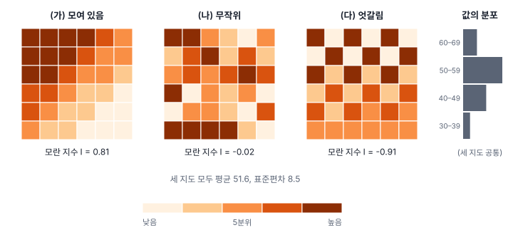
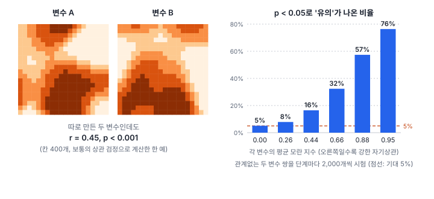
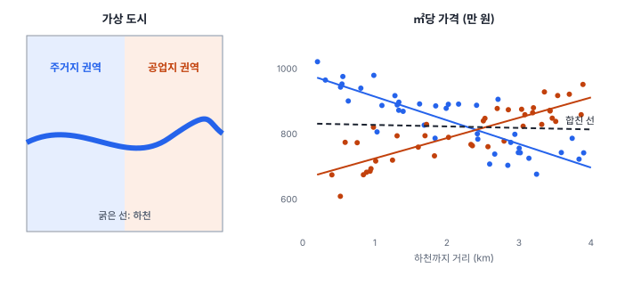
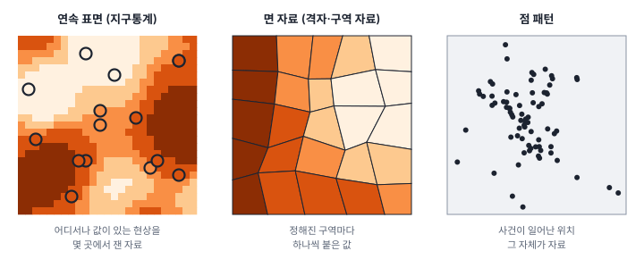

[목차](../README.md) · 다음: [1강 공간 자료의 세 얼굴](01-three-faces-of-spatial-data.md)

# 0강 공간통계학이란 무엇인가

> 앱 지원: 해당 없음 (해 보기는 지도 보기만 함) · 읽는 시간 약 25분

## 이 강에서 얻는 것

- 공간 자료에 일반 통계를 그대로 쓰면 무엇이 틀어지는지 **공간 의존성**과 **공간 이질성** 두 가지로 설명할 수 있음
- 공간통계학의 세 갈래(연속 표면, 면 자료, 점 패턴)를 구분하고, 내 자료가 어느 갈래에 속하는지 판단할 수 있음
- 공간통계학이 어떤 문제를 풀려고 생겨났는지 흐름을 알고, 이 책을 어떤 순서로 읽을지 정할 수 있음

## 들어가는 질문

연구자 A는 전국 시군구 자료로 비만율을 녹지율, 1인당 소득, 고령인구 비율로 설명하는 회귀분석을 했음. 세 변수 모두 p < 0.001로 유의하게 나왔고, 결과를 정리해 학술지에 투고했음. 돌아온 심사 의견은 다음과 같았음.

> 관측 단위가 시군구이므로 이웃한 지역끼리 값이 비슷할 가능성이 큽니다. 공간 자기상관을 검토하셨습니까? 잔차의 공간 의존성을 진단하고, 필요하면 공간 회귀모형을 고려하십시오. 또한 녹지율의 효과가 모든 지역에서 같다고 가정할 근거가 있습니까?

A는 통계 수업에서 배운 회귀분석을 그대로 썼을 뿐임. 무엇이 문제일까?

이 강을 다 읽으면 심사 의견의 두 질문이 각각 무엇을 묻는지 설명할 수 있음. 이 책을 다 읽으면 그 질문에 답하고, 처음부터 그런 지적을 받지 않는 분석을 설계할 수 있음.

## 1. 위치가 정보인 자료

**공간 자료**(spatial data)는 값마다 그 값이 관측된 위치가 붙은 자료임. 시군구별 발생률, 관측소별 기온, 사건이 일어난 좌표가 모두 공간 자료임.

일반 통계는 대부분 관측치의 순서를 바꿔도 결과가 같음. 평균, 표준편차, 히스토그램, 두 변수의 상관계수 모두 표의 행을 섞어도 그대로임. 행 하나하나는 서로 바꿔 넣어도 되는 독립된 관측으로 봄. 그런데 공간 자료에서는 행을 섞는 순간 중요한 정보 하나가 사라짐. **어느 값이 어느 값의 옆에 있었는가**임.



위 세 지도는 **같은 값 36개**를 자리만 바꿔 배치한 것임. 평균 51.6, 표준편차 8.5, 히스토그램까지 셋 모두 똑같음. 일반 통계가 보는 것은 여기까지임. 하지만 지도는 전혀 다름.

- (가)는 큰 값이 왼쪽 위에, 작은 값이 오른쪽 아래에 모여 있음
- (나)는 값이 무작위로 흩어져 있음
- (다)는 큰 값과 작은 값이 바둑판처럼 엇갈려 있음

지도 아래의 **모란 지수**(Moran's I)는 이 차이를 수 하나로 잰 것임. 이웃한 칸끼리 값이 닮을수록 커져서 대체로 1 가까이 가고, 이웃끼리 엇갈릴수록 작아져서 −1 쪽으로 감. 값을 무작위로 배치했을 때의 기댓값은 0이 아니라 칸 수를 $n$이라 할 때 $-1/(n-1)$이며, 여기서는 약 −0.03임. 정확한 최댓값·최솟값은 이웃을 어떻게 정의하느냐에 따라 달라짐. 계산하는 법은 11강에서 다룸.

**공간통계학**(spatial statistics)은 값만이 아니라 **값이 놓인 자리까지 자료로 다루는 통계학**임. 위치가 만드는 구조를 재고(이웃끼리 얼마나 닮았나), 그 구조를 고려해 추론하고(이 차이가 우연인가), 위치를 모형에 넣어 예측함(재지 않은 곳의 값은 얼마인가).

## 2. 가까운 것은 닮음: 공간 의존성

지리학자 토블러(Waldo Tobler)는 1970년 논문에서 다음 문장을 남겼음.

> Everything is related to everything else, but near things are more related than distant things.
>
> (모든 것은 다른 모든 것과 관련되어 있지만, 가까운 것끼리 먼 것보다 더 깊이 관련되어 있다.)

토블러는 이 문장을 스스로 '지리학 제1법칙'이라 불렀고, 이후 **토블러의 지리학 제1법칙**으로 널리 알려짐. 물리 법칙 같은 법칙이라기보다는 경험칙이지만, 실제 공간 자료 대부분이 이를 따름. 가까운 곳의 값이 닮는 경향을 **공간 의존성**(spatial dependence), 이를 한 변수에 대해 잰 것을 **공간 자기상관**(spatial autocorrelation)이라 함.

가까운 곳이 닮는 이유는 대체로 셋임.

1. **현상 자체가 퍼짐**: 감염병은 접촉으로 옮고, 아파트 시세는 옆 단지의 거래가를 보고 정해지고, 씨앗은 어미 나무 근처에 떨어짐
2. **같은 환경을 공유함**: 기후, 지형, 토양, 수괴 같은 조건은 넓게 이어져 있어서, 가까운 곳은 같은 요인의 영향을 함께 받음
3. **자료를 만드는 방식**: 행정 경계는 현상의 경계와 맞지 않아서 한 현상이 여러 구역에 쪼개져 들어감. 보간하거나 평활한 산출물(격자 기온, 위성 산출물)은 만드는 과정에서 이웃 값이 섞임

반대로 이웃끼리 엇갈리는 **음의 공간 자기상관**도 있음. 상권을 나눠 갖는 점포의 매출, 서로 영역을 지키는 동물의 밀도처럼 경쟁이 있는 현상에서 나타남. 실제 자료에서는 양의 자기상관이 훨씬 흔함.

### 왜 문제가 되는가

대부분의 통계 검정은 관측치가 **서로 독립**이라고 가정함. 이웃끼리 닮은 자료는 이 가정을 어김. 같은 이야기를 서로 들은 증인 열 명의 증언이 독립된 증인 열 명의 증언만큼 믿을 만하지 않은 것처럼, 서로 닮은 관측 400개는 독립된 관측 400개만큼의 정보를 주지 않음. 실제 정보량에 해당하는 관측 수를 **유효 표본 크기**(effective sample size)라 하며 9강에서 다룸. 검정은 관측 400개를 모두 독립으로 세므로 확신을 지나치게 크게 가짐.

얼마나 크게 가지는지 시뮬레이션으로 확인해 봄. 20×20 격자 400칸에 **서로 아무 관계 없는 두 변수**를 따로 만들되, 두 변수 모두 이웃끼리 닮은 정도를 단계적으로 키움. 단계마다 이런 변수 쌍을 2,000개씩 만들어 보통의 상관 검정(피어슨 상관계수의 t검정)을 함. 두 변수는 관계가 없으므로, 유의수준 5%로 검정하면 '유의'가 나오는 비율은 5%여야 함.



자기상관이 없을 때는 5.1%로 정확히 맞음. 하지만 두 변수의 모란 지수가 평균 0.44일 때 16.5%, 0.66일 때 32.4%, 0.88일 때 57.4%, 0.95일 때 76.3%가 '유의'로 나옴. 모란 지수가 0.44~0.66 정도인 변수는 실제 지역 자료에서 드물지 않음. 그런 자료에서는 관계없는 변수를 검정해도 여섯 번에 한 번에서 세 번에 한 번꼴로 '유의'가 나오는 셈임.

이 문제는 **두 변수가 모두** 자기상관을 가질 때 생긴다는 점에 주의함. 둘 중 하나라도 공간적으로 무작위이면 검정은 거의 제대로 동작함. 그런데 실제 지역 자료에서는 결과 변수와 설명변수가 함께 자기상관을 가지는 경우가 대부분이라 이 문제를 피하기 어려움.

들어가는 질문의 첫 번째 지적이 바로 이것임. 시군구끼리 닮은 자료에서 p < 0.001은 보이는 것만큼 강한 증거가 아닐 수 있음. 회귀분석에서는 설명변수와 **잔차**(모형이 설명하지 못하고 남은 부분)가 함께 자기상관을 가질 때 계수의 표준오차가 작게 추정되어 같은 문제가 생김. 그래서 공간 자료로 회귀분석을 하면 잔차의 자기상관을 먼저 진단하며, 그 방법은 24강에서 다룸.

## 3. 곳마다 다름: 공간 이질성

공간 자료의 두 번째 특징은 **관계 자체가 장소마다 다를 수 있다**는 점임. 이를 **공간 이질성**(spatial heterogeneity)이라 하고, 특히 변수 사이의 관계(회귀계수)가 장소마다 달라지는 것을 **공간 비정상성**(spatial nonstationarity)이라 함. 5부 지구통계에서 말하는 '정상성'은 평균과 공분산 구조에 관한 개념이라 뜻이 조금 다르며, 20강에서 구분함.

가상의 도시에서 하천까지의 거리와 주택의 ㎡당 가격을 조사했다고 함. 도시는 하천을 사이에 두고 서쪽 주거지 권역과 동쪽 공업지 권역으로 나뉨.



- 주거지 권역에서는 하천에 가까울수록 비쌈. 산책로와 조망 때문임. 거리 1 km마다 ㎡당 가격이 72.5만 원 내려감
- 공업지 권역에서는 하천에 가까울수록 쌈. 침수 위험과 악취 때문임. 거리 1 km마다 ㎡당 가격이 62.2만 원 올라감
- 두 권역을 합쳐 회귀선 하나를 그으면 기울기는 −4.6만 원(p = 0.62)으로 거의 0임

합친 결과만 보면 "하천까지 거리는 집값과 관계없다"고 결론 내리게 됨. 그런데 이 결론은 두 권역 **어디에도** 맞지 않음. 전역 모형의 계수는 여러 장소의 관계를 평균낸 것이고, 그 평균이 어떤 장소도 대표하지 못할 수 있음.

이 예에서는 권역 경계를 미리 알았지만, 실제로는 관계가 어디서 어떻게 바뀌는지 모르는 경우가 대부분이고, 경계선 하나로 딱 나뉘지 않고 서서히 바뀌기도 함. 계수가 장소마다 달라지도록 허용하는 지리가중회귀(GWR)와 다중척도 지리가중회귀(MGWR)가 이런 문제를 다루며 7부에서 설명함. 들어가는 질문의 두 번째 지적("녹지율의 효과가 모든 지역에서 같다고 가정할 근거가 있습니까?")이 바로 이 문제임.

공간 의존성과 공간 이질성은 공간계량경제학을 체계화한 안셀린(Luc Anselin)이 1988년 저서에서 공간 자료의 두 가지 **공간 효과**(spatial effects)로 정리한 이후, 공간 자료 분석의 핵심 개념으로 자리 잡았음. 까다로운 점은 둘이 겉으로 비슷한 지도를 만든다는 것임. 값이 모여 있는 지도는 이웃끼리 영향을 주고받아서(의존성) 생길 수도 있고, 지역마다 평균이 달라서(이질성) 생길 수도 있음. 둘을 가려내는 문제는 28강에서 다룸.

그 밖에도 공간 자료에는 몇 가지 까다로운 점이 더 있음. 같은 자료를 어떤 단위로 묶느냐에 따라 결론이 달라지는 **가변적 공간 단위 문제**(MAUP, 3강), 연구 지역 가장자리에 있는 구역은 이웃 정보가 잘리는 **경계 효과**(4강), 좌표계에 따라 거리와 면적이 달라지는 문제(2강)임.

## 4. 공간통계학의 세 갈래

공간통계학은 **위치가 어떻게 주어지는가**에 따라 크게 세 갈래로 나뉨. 통계학자 크레시(Noel Cressie)가 교과서 『Statistics for Spatial Data』에서 정리한 분류이며, 지금도 표준으로 쓰임.



| 갈래 | 위치는 | 자료 예 | 대표 질문 | 대표 방법 | 이 책 |
|---|---|---|---|---|---|
| 연속 표면 (지구통계 자료) | 연속 공간의 어디든 될 수 있고, 연구자가 고른 몇 곳에서 잼 | 관측소 기온, 해양 정점 수온, 토양 오염 시료, 지하수위 | 재지 않은 곳의 값은? 그 추정은 얼마나 불확실한가? | 베리오그램, 크리깅 | 5부 |
| 면 자료 (격자·구역 자료) | 미리 정해진 구역들이고, 구역마다 값이 하나 | 시군구 발생률, 행정동 인구, 위성 산출물을 격자로 평균낸 값 | 이웃끼리 닮았나? 어디가 핫스팟인가? 변수 사이의 관계는? | 공간가중치, 모란 지수, LISA, 공간 회귀, GWR, 영역화 | 3·6·7·8부 |
| 점 패턴 | 위치 자체가 우연히 정해지는 관측 대상 | 질병 발생 주소, 범죄 신고 위치, 나무 위치, 선박 탐지 위치 | 모여 있나 흩어져 있나? 어디서 더 자주 일어나나? 무엇 때문인가? | 커널 밀도, K 함수, 점 과정 모형 | 4부 |

갈래를 가르는 기준은 파일 형식이 아니라 **위치가 어떤 범위에서 오고, 무엇이 우연인가**임.

- 연속 표면: 값은 연구 지역의 모든 지점에 있고, 관측한 곳은 그 가운데 일부임. 관측하지 않은 곳에도 값이 있다는 것이 핵심임
- 면 자료: 위치는 미리 정해진 구역들뿐이고, 보통 그 구역 전부를 관측함. 구역 사이의 '중간 지점'이라는 개념이 없음
- 점 패턴: 앞의 둘은 위치가 정해져 있고 값이 우연이지만, 점 패턴은 **위치 자체가 우연**임

같은 현상도 어떻게 기록하느냐에 따라 갈래가 바뀜. 감염병 환자의 주소는 점 패턴이지만 시군구별로 세면 면 자료가 됨. 대기오염 측정소 값은 연속 표면 자료지만 격자로 평균내면 면 자료가 됨. 자료를 바꾸는 순간 쓸 수 있는 방법과 얻는 결론이 달라지므로, 분석 전에 이 선택을 의식해야 함(1강, 3강).

비전공 연구자가 가장 자주 만나는 것은 면 자료임. 행정 통계 대부분이 구역 단위로 공개되기 때문임. 그래서 이 책은 면 자료를 가장 길게 다루며, GeoStat도 면 자료 분석을 중심으로 만들어졌음.

세 갈래를 가로지르는 영역도 있음. 공간 의존성을 회귀모형 안에 넣는 **공간계량경제학**(spatial econometrics, 6부), 시간이 함께 변하는 **시공간 분석**(9부), 작은 지역의 불안정한 비율을 다루는 **베이지안 공간 모형**(10부), 표본 설계와 머신러닝 검증을 다루는 **공간 데이터 과학**(11부)임.

## 5. 짧은 역사

공간통계학은 한 사람이 한 번에 만든 학문이 아님. 농업 실험, 광산, 지리학, 경제학, 역학처럼 서로 다른 분야가 **위치 때문에 생기는 문제**를 각자 풀다가 하나로 모인 학문임.

| 연도 | 사람 | 한 일 |
|---|---|---|
| 1854 | John Snow | 런던 콜레라 사망자 지도. 통계적 추론은 아니지만 공간 분석의 상징으로 자주 인용됨 |
| 1920~30년대 | R. A. Fisher | 밭의 비옥도 차이 같은 변동에 대응해 무작위 배치와 블록 설계를 발전시킴 (1935, 『The Design of Experiments』) |
| 1950 | P. A. P. Moran | 모란 지수 |
| 1951 | D. G. Krige | 남아프리카 금광의 품위 추정. 크리깅의 출발점 |
| 1954 | R. C. Geary | 기어리 비율(Geary's C) |
| 1962~63 | G. Matheron | 지구통계학 이론을 세우고 크리깅을 정식화함 |
| 1970 | W. Tobler | 지리학 제1법칙 |
| 1973 | A. Cliff, J. K. Ord | 『Spatial Autocorrelation』. 공간 자기상관 검정 이론을 정리함 |
| 1974 | J. Besag | 격자 자료의 공간 상호작용 모형 (조건부 자기회귀 모형의 바탕) |
| 1976~77 | B. Ripley | K 함수. 점 패턴 분석의 기초 |
| 1979 | J. Paelinck, L. Klaassen | 『Spatial Econometrics』. 공간계량경제학이라는 이름이 자리 잡음 |
| 1988 | L. Anselin | 『Spatial Econometrics: Methods and Models』 |
| 1991 | J. Besag, J. York, A. Mollié | 질병 지도용 베이지안 모형(BYM) |
| 1991 | N. Cressie | 『Statistics for Spatial Data』 (개정판 1993). 세 갈래를 한 권으로 정리함 |
| 1992, 1995 | A. Getis, J. K. Ord | G 통계량과 국지 통계량 Gi* |
| 1995 | L. Anselin | 국지적 공간연관 지표(LISA) |
| 1996 | C. Brunsdon, A. S. Fotheringham, M. Charlton | 지리가중회귀(GWR) |
| 1997 | M. Kulldorff | 공간 스캔 통계 |
| 2003~ | L. Anselin 외 | 무료 소프트웨어 GeoDa 공개. 공간통계를 전공자 밖으로 넓힘 |
| 2017 | A. S. Fotheringham, W. Yang, W. Kang | 다중척도 지리가중회귀(MGWR) |

흥미로운 뿌리 하나는 농업 실험임. 피셔(Ronald Fisher)가 일한 로탐스테드 농업시험장에서는 밭의 비옥도가 자리마다 달라서, 비료 효과를 제대로 재려면 이런 변동이 결과를 흐리지 않게 해야 했음. 피셔는 처리를 무작위로 배치하고, 가까운 구획일수록 조건이 닮는다는 점을 이용해 가까운 구획끼리 블록으로 묶는 실험 설계를 발전시켰음. 오늘날 모든 분야가 쓰는 실험 설계의 한 축이, 가까운 것끼리 닮는다는 공간의 성질을 이용하는 데서 나온 셈임.

이 책은 각 방법이 나오는 강에서 원전과 그 방법이 풀려던 문제를 함께 소개함. 방법의 이름만이 아니라 **왜 그 방법이 필요했는지**를 알면 언제 써야 하고 언제 쓰면 안 되는지도 판단할 수 있기 때문임.

## 6. 이 책을 읽는 법

### 구성

```
0부 들어가며
1부 공간 자료 ─ 2부 통계 다시 보기 ─ 3부 공간 자기상관      (공통 핵심)
        ├─ 면 자료 갈래:    6부 공간 회귀 · 7부 공간 이질성 · 8부 영역화
        ├─ 점 갈래:         4부 점 패턴
        ├─ 연속 표면 갈래:  5부 지구통계
        └─ 확장:            9부 시공간 · 10부 베이지안 · 11부 공간 데이터 과학
12부 연구와 보고
```

0~3부는 모든 갈래의 바탕이므로 먼저 읽음. 그다음 갈래는 자기 자료에 맞는 것부터 읽어도 됨. 12부는 분석을 설계하고 보고하는 법을 다루며 책 전체를 마무리함.

### 읽는 길

- **처음부터 끝까지**: 0강부터 42강까지 순서대로
- **실무 빠른 길**: 당장 면 자료를 분석해야 한다면 0 → 3 → 10 → 11 → 12 → 14 → 24 → 29 → 41 → 42강

### 강의 구성

모든 강은 같은 틀로 되어 있음.

- **이 강에서 얻는 것**과 **들어가는 질문**으로 시작함
- **본문**은 직관 → 작은 예제 손계산 → 일반식 순서로 설명함. 식이 나오면 말로 한 번 더 풀어 쓰므로, 식을 건너뛰어도 흐름은 따라갈 수 있음
- **시뮬레이션으로 보기**에서는 참 구조를 알고 만든 자료에 방법을 적용해, 방법이 무엇을 찾고 무엇을 놓치는지 확인함
- **해 보기**에서 직접 실습함
- **헷갈리는 쌍**, **흔한 실수와 심사 지적**, **보고서에는 이렇게 씀**은 배운 것을 실제 연구에 옮길 때 필요한 내용임
- **요약**, **핵심 용어**, **원전과 더 읽을거리**, **연습**으로 마무리함

### 실습 도구와 예제 자료

실습에는 GeoStat을 씀. 강 제목 아래에 앱 지원 정도를 표시함.

- ● 앱에서 전부 따라 할 수 있음
- ◐ 일부만 앱에서 되고, 나머지는 코드로 함
- ○ 코드(Python)로 실습함. GeoStat 엔진과 같은 PySAL 계열 라이브러리를 씀

예제 자료는 1강부터 가상 도시 **한빛시**를 책 전체에서 이어 씀. 한빛시의 모든 값은 알려진 규칙으로 만들었기 때문에, 방법이 참 구조를 찾아내는지 확인할 수 있음. 원전의 수치와 맞춰 보는 용도로 공간통계 교과서에 자주 나오는 공개 자료(노스캐롤라이나 영아 돌연사 자료 등)도 함께 씀.

### 필요한 준비

고교 수학과 기초 통계 한 학기 정도(평균, 분산, 회귀분석을 들어 본 수준)면 충분함. 통계 기초가 흐릿하면 2부에서 공간 자료에 필요한 만큼 다시 정리함. 행렬은 6부부터 쓰며, 필요한 내용은 부록 B에 모았음.

## 해 보기: GeoStat에서 지도 보기

이 강에서는 계산 없이 지도만 봄. 눈으로 받은 인상을 적어 두었다가 11강과 12강에서 수로 확인함.

1. GeoStat을 설치함 (저장소 [README](../../README.md)의 설치 안내 참고)
2. **도움말 → 샘플: 노스캐롤라이나 영아 돌연사 (ESDA 예제)** 메뉴를 고름. 미국 노스캐롤라이나주 카운티 100개의 영아 돌연사 건수와 비율 자료이며, 크레시의 교과서에 실려 널리 쓰이는 자료임
3. 왼쪽 **주제도**에서 변수 `SIDR79`(1979~84년 출생 1,000명당 비율), 방법 **분위수**를 고르고 **적용**을 누름
4. 높은 값의 카운티가 몇 곳에 이어져 있는지, 흩어져 있는지 보고 인상을 한 문장으로 적어 둠
5. 방법을 **등간격**과 **자연 분류 (Jenks)** 방법으로 바꿔 가며 다시 봄. 같은 자료인데 인상이 어떻게 달라지는지 적어 둠
6. 아래 속성 테이블에서 `SIDR79` 머리글을 두 번 눌러 큰 값부터 정렬하고(한 번 누르면 작은 값부터 정렬됨), 맨 위의 행 몇 개를 고름. 지도에서 어디에 있는지 확인함

5번에서 인상이 크게 달라졌다면, 지도를 눈으로 보고 "모여 있다"고 판단하는 것이 왜 위험한지 이미 경험한 것임. 계급을 나누는 방법에 따라 지도가 어떻게 달라지는지는 5강에서, 모여 있음을 수로 재고 검정하는 법은 11강에서 다룸.

## 헷갈리는 쌍

- **공간 분석 vs 공간통계학**: 버퍼, 중첩, 거리 계산, 점 집계 같은 GIS의 기하 연산은 공간 자료를 가공하는 도구임. 공간통계학은 그렇게 만든 자료에서 불확실성을 따지고 추론함("이 차이가 우연인가?"). GIS 분석 결과가 공간통계의 입력이 되는 경우가 많음
- **공간 의존성 vs 공간 이질성**: 의존성은 관측치끼리의 관계(이웃 값과 닮음), 이질성은 모형 구조의 변화(평균이나 관계가 장소마다 다름)임. 둘 다 값이 모인 지도를 만들 수 있어 겉모습만으로는 구분하기 어려움
- **상관 vs 자기상관**: 상관은 두 변수 사이의 관계, 자기상관은 한 변수가 다른 위치(또는 다른 시점)의 자기 자신과 관련된 정도임

## 흔한 실수와 심사 지적

- **시군구·격자를 독립 표본으로 보고 일반 검정을 그대로 씀**
  - 결과: p값이 지나치게 작게 나옴
  - 지적: "공간 자기상관을 검토하셨습니까?"
  - 대응: 잔차의 모란 지수와 LM 검정으로 진단하고(24강), 필요하면 공간 회귀모형을 씀(25~26강)
- **지도를 눈으로 보고 "모여 있다"고 결론 냄**
  - 결과: 계급 구분 방법과 색에 따라 인상이 달라지고, 우연히 생긴 무늬도 군집처럼 보임
  - 지적: "군집이라고 판단한 통계적 근거는 무엇입니까?"
  - 대응: 전역·국지 공간 자기상관 검정(11~13강)
- **전역 회귀계수를 모든 지역에 똑같이 적용해 정책을 제언함**
  - 지적: "효과가 지역마다 같다고 가정할 근거가 있습니까?"
  - 대응: 공간 체제 분석(28강), GWR·MGWR(29~30강)
- **자료 유형과 맞지 않는 방법을 씀**
  - 예: 점 자료를 행정구역으로 집계하면서 정보를 버림, 관측소 값을 가장 가까운 시군구에 그대로 붙여 면 자료처럼 다룸
  - 대응: 자료 유형과 분석 단위를 먼저 정함(1강, 3강)

## 보고서에는 이렇게 씀

공간 자료를 분석한 논문의 방법 절은 첫머리에서 **분석 단위와 공간 구조를 어떻게 다뤘는지** 밝힘. 아래는 면 자료로 회귀분석을 한 경우의 예시 문장이며, 논문 문체로 썼음.

> 분석 단위는 ○○시 행정동 N개이다. 관측치가 공간적으로 인접해 있어 일반 회귀모형의 오차 독립 가정이 성립하지 않을 수 있으므로, 퀸 인접 공간가중치(행 표준화)를 정의하고 OLS 잔차의 Moran's I(순열 검정 999회)와 LM 검정으로 공간 의존성을 진단하였다. 또한 회귀계수의 공간적 변이를 확인하기 위해 지리가중회귀를 추정하였다.

방법 절에 적어야 할 항목은 다음과 같음. 각 항목을 어떻게 정하는지는 해당 강에서 다룸.

- 분석 단위와 개수, 자료의 시점
- 좌표계 (거리를 쓴 경우)
- 공간가중치의 정의와 표준화 방식
- 검정 방법 (순열 횟수, 난수 시드), 다중검정 보정 방법
- 사용한 소프트웨어와 버전

## 요약

- 공간 자료는 값마다 위치가 붙은 자료이며, 행을 섞으면 "어느 값이 어느 값의 옆에 있었는가"라는 정보가 사라짐
- 공간 의존성은 가까운 값끼리 닮는 경향임. 독립을 가정한 검정은 이를 무시하면 지나친 확신을 가짐. 관계없는 두 변수도 둘 다 모란 지수가 0.66 정도면 32%가 '유의'로 나옴
- 공간 이질성은 관계가 장소마다 다른 것임. 전역 모형의 계수는 어떤 장소도 대표하지 못하는 평균일 수 있음
- 공간통계학은 연속 표면(지구통계), 면 자료, 점 패턴의 세 갈래로 나뉨. 값이 모든 지점에 있는가, 정해진 구역에만 있는가, 위치 자체가 우연인가로 가름
- 공간통계학은 농업 실험, 광산, 지리학, 경제학, 역학이 위치 때문에 생기는 문제를 각자 풀다가 모인 학문임

## 핵심 용어

| 한글 | 영문 | 비고 |
|---|---|---|
| 공간 자료 | Spatial Data | |
| 공간통계학 | Spatial Statistics | |
| 공간 의존성 | Spatial Dependence | |
| 공간 자기상관 | Spatial Autocorrelation | |
| 공간 이질성 | Spatial Heterogeneity | |
| 공간 비정상성 | Spatial Nonstationarity | 관계(계수)가 장소마다 달라지는 것 |
| 공간 효과 | Spatial Effects | 의존성과 이질성을 함께 이르는 말 (Anselin 1988) |
| 토블러의 지리학 제1법칙 | Tobler's First Law of Geography | |
| 유효 표본 크기 | Effective Sample Size | 9강 |
| 모란 지수 | Moran's I | 11강 |
| 연속 표면 자료 | Geostatistical Data | 지구통계 자료라고도 함 |
| 면 자료 | Lattice Data, Areal Data | 격자 자료, 구역 자료라고도 함 |
| 점 패턴 | Spatial Point Pattern | |
| 공간계량경제학 | Spatial Econometrics | |
| 가변적 공간 단위 문제 | Modifiable Areal Unit Problem (MAUP) | 3강 |

## 원전과 더 읽을거리

**원전**

- Tobler, W. R. (1970). A computer movie simulating urban growth in the Detroit region. *Economic Geography*, 46(sup1), 234–240. 지리학 제1법칙이 나오는 논문
- Anselin, L. (1988). *Spatial Econometrics: Methods and Models*. Kluwer. 공간 의존성과 이질성을 공간 효과로 정리함
- Cressie, N. (1993). *Statistics for Spatial Data* (Revised ed.). Wiley. 1장에서 공간 자료의 세 유형을 정리함
- Clifford, P., Richardson, S., & Hémon, D. (1989). Assessing the significance of the correlation between two spatial processes. *Biometrics*, 45(1), 123–134. 이 강의 시뮬레이션이 보여 준 문제를 다루고 보정 방법을 제안함

**입문서**

- Rey, S. J., Arribas-Bel, D., & Wolf, L. J. (2023). *Geographic Data Science with Python*. CRC Press. 온라인으로 무료 공개되어 있고 PySAL을 씀
- O'Sullivan, D., & Unwin, D. J. (2010). *Geographic Information Analysis* (2nd ed.). Wiley. 공간 분석 전반의 입문서
- Fotheringham, A. S., Brunsdon, C., & Charlton, M. (2000). *Quantitative Geography: Perspectives on Spatial Data Analysis*. Sage.

## 연습

1. 1절 그림 (가) 지도에서 왼쪽 위 칸과 오른쪽 아래 칸의 값을 서로 바꾸면 평균과 표준편차는 어떻게 되는가? 모란 지수는 커지는가, 작아지는가?

2. 다음 자료가 세 갈래 가운데 어디에 속하는지 고르고 이유를 적으시오.
   - (가) 해양 정점 40곳에서 잰 표층 수온
   - (나) 시군구별 인구 10만 명당 결핵 발생률
   - (다) 119 구급 출동 위치
   - (라) 위성 식생지수(NDVI)를 500 m 격자로 평균낸 값
   - (마) 산림 조사구 안의 소나무 위치
   - (바) 아파트 단지별 실거래 평균 가격

3. 2절 시뮬레이션에서 각 변수의 모란 지수가 0.66일 때 관계없는 변수 쌍의 32%가 '유의'로 나왔음. 연구자가 이런 자료에서 결과 변수와 관계없는 설명변수 10개를 하나씩 상관 검정한다면, '유의'가 나오는 변수는 평균 몇 개로 예상되는가? 자기상관이 없을 때와 비교하시오.

4. 3절 예에서 합친 기울기만 보고 "하천까지 거리는 집값에 영향을 주지 않는다"고 쓴 보고서가 있음. 이 결론의 문제를 두 문장으로 설명하시오.

5. 해 보기의 5번에서 분위수 지도와 등간격 지도의 인상이 달랐던 이유를 추측해 보시오. (5강에서 확인함)

<details>
<summary>해답</summary>

1. 값의 모임은 그대로이므로 평균과 표준편차는 바뀌지 않음. 큰 값이 작은 값들 사이에, 작은 값이 큰 값들 사이에 끼게 되므로 이웃끼리 닮은 정도가 줄어 모란 지수는 작아짐. 실제로 계산하면 0.81에서 0.41로 절반 가까이 떨어짐. 칸 두 개만 바꿨는데도 크게 변하는 것은, 두 칸이 각각 이웃 2개와 맺는 관계가 모두 뒤집히기 때문임.

2. (가) 연속 표면. 수온은 바다 어디에나 있고 연구자가 고른 정점에서 잼. (나) 면 자료. 시군구라는 정해진 구역마다 값이 하나임. (다) 점 패턴. 출동 위치 자체가 우연히 정해짐. (라) 면 자료. 원래는 연속 표면이지만 격자로 평균낸 순간 정해진 구역마다 값이 하나인 자료가 됨. (마) 점 패턴. (바) 정답이 하나가 아님. 단지 위치는 정해져 있고 값이 붙어 있으므로 이웃을 정의해 면 자료처럼 다룰 수도 있고, 가격이 연속적으로 변하는 표면을 단지에서 잰 것으로 보고 지구통계로 다룰 수도 있음. 무엇을 묻느냐(단지 사이의 파급인가, 재지 않은 곳의 가격 추정인가)에 따라 고름.

3. 10 × 0.32 = 평균 약 3.2개. 자기상관이 없으면 10 × 0.05 = 0.5개임. 관계없는 변수 가운데 세 개 남짓이 '유의'로 보고될 수 있음.

4. 두 권역에서 관계의 방향이 반대라서 합친 기울기가 0에 가까워진 것이지, 관계가 없는 것이 아님. 전역 모형의 계수는 두 권역 어디에도 맞지 않는 평균임.

5. 분위수는 각 계급에 카운티 수가 같도록 나누고, 등간격은 값의 범위를 같은 폭으로 나눔. 값이 한쪽으로 치우쳐 있으면 등간격 지도에서는 대부분의 카운티가 한두 계급에 몰려 차이가 잘 보이지 않음.

</details>

---

[목차](../README.md) · 다음: [1강 공간 자료의 세 얼굴](01-three-faces-of-spatial-data.md)
