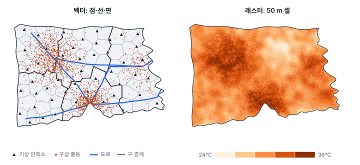
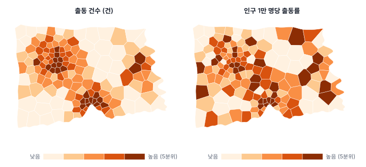
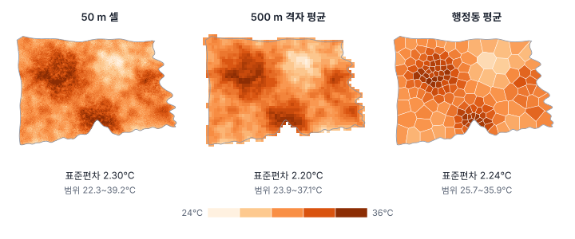

[목차](../README.md) · 이전: [0강 공간통계학이란 무엇인가](00-what-is-spatial-statistics.md) · 다음: [2강 좌표계와 거리](02-coordinates-and-distance.md)

# 1강 공간 자료의 세 얼굴

> 앱 지원: ● 앱에서 전부 따라 할 수 있음 · 읽는 시간 약 30분

## 이 강에서 얻는 것

- 공간 자료를 지오메트리와 속성으로 나눠 읽고, 벡터(점·선·면)와 래스터가 각각 무엇을 잘 담고 무엇을 놓치는지 설명할 수 있음
- 속성의 성격(측정 척도, 외연량과 내포량)과 값이 대표하는 공간 범위(지원)를 따져, 값을 합치거나 지도에 칠하는 올바른 방법을 고를 수 있음
- 자료를 한 형태에서 다른 형태로 옮길 때(점 집계, 존 통계, 보간) 무엇이 바뀌고 무엇을 잃는지 알고, 분석 단위를 의식적으로 정할 수 있음

## 들어가는 질문

한빛시 보건소의 폭염 대책 담당자가 "더운 동네일수록 폭염 관련 구급 출동이 많은가?"를 알아보려고 자료를 모았음. 받은 자료는 다음과 같음.

- 2025년 여름(6~8월) 폭염 관련 119 구급 출동 1,408건의 위치
- 행정동 150개의 주민등록 인구
- 위성 영상으로 만든 여름 한낮 지표온도 지도
- 기상 관측소 48곳의 8월 평균 기온

네 자료는 모양이 모두 다름. 하나는 점의 목록이고, 하나는 구역마다 붙은 숫자이며, 하나는 격자 모양의 그림이고, 하나는 몇 곳에서 잰 값임. 이 자료를 한 표에 담아 비교하려면 무언가를 바꿔야 하고, **무엇을 어떻게 바꾸느냐에 따라 답이 달라질 수 있음**. 이 강은 그 선택을 다룸.

## 1. 한빛시: 이 책의 예제 도시

들어가는 질문의 한빛시는 이 책을 위해 만든 **가상 도시**임. 인구 120만 명, 면적 454 ㎢에 구 5개, 행정동 150개가 있음. 남쪽 항구 주변의 원도심, 북서쪽의 신도심, 도시 가운데 북쪽의 산림, 동쪽 해안의 산업단지로 이루어짐. 이 강부터 책 끝까지 대부분의 예제가 한빛시에서 나옴.

| 파일 | 형태 | 개수 | 주요 속성 |
|---|---|---|---|
| `hanbit_dong.gpkg` | 면 (폴리곤) | 행정동 150개 | 동코드, 구, 동이름, 인구, 고령인구(65세 이상), 면적_km2 |
| `hanbit_events.gpkg` | 점 | 구급 출동 1,408건 | 출동ID, 출동일(2025년 6~8월), 월, 연령대 |
| `hanbit_stations.gpkg` | 점 | 기상 관측소 48곳 | 관측소ID, 기온_8월평균 |
| `hanbit_roads.gpkg` | 선 | 주요 도로 4개 | 도로명, 등급 |
| `hanbit_lst.tif` | 래스터 | 50 m 셀 640×480개 | 지표온도(℃) |

자료는 저장소의 [`book/data`](../data/) 폴더에 있음. 한빛시의 모든 값은 알려진 규칙(참 모형)으로 만들었으므로, 뒤에서 분석 방법이 참 구조를 얼마나 찾아내는지 확인할 수 있음. 규칙은 책 끝의 부록 G에서 공개함. 실제 지명과 겹치지 않도록 서해 바다 위에 좌표를 두었으므로, GeoStat에서 배경지도를 켜면 도시가 바다 위에 떠 있음.

## 2. 피처: 지오메트리와 속성

공간 자료의 한 행을 **피처**(feature)라 함. 피처는 두 부분으로 이루어짐.

- **지오메트리**(geometry): 어디에 어떤 모양으로 있는가. 좌표의 목록임
- **속성**(attribute): 그곳에 대해 무엇을 알고 있는가. 표의 열임

한빛시 행정동 자료의 처음 세 행은 다음과 같음. 지오메트리 열에는 경계선을 이루는 좌표 수백 개가 들어 있어 여기서는 생략함.

| 동코드 | 구 | 동이름 | 인구 | 고령인구 | 면적_km2 | 지오메트리 |
|---|---|---|---|---|---|---|
| HB001 | 가람구 | 가람1동 | 1,907 | 534 | 4.723 | 폴리곤 |
| HB002 | 가람구 | 가람2동 | 3,617 | 915 | 3.277 | 폴리곤 |
| HB003 | 가람구 | 가람3동 | 3,114 | 988 | 3.967 | 폴리곤 |

좌표가 어떤 기준으로 적혀 있는지(좌표계)는 2강에서 다룸. 좌표계가 없으면 좌표는 그냥 숫자일 뿐이라 다른 자료와 겹쳐 볼 수 없음.

### 벡터와 래스터

지오메트리를 적는 방식은 크게 둘임.

**벡터**(vector)는 개체를 좌표로 그림. 좌표 하나면 **점**(출동 위치, 관측소), 이어진 좌표면 **선**(도로), 닫힌 좌표면 **면**(행정동)임. 경계가 뚜렷한 개체를 정확히 나타내고, 한 개체에 속성을 여럿 붙일 수 있음.

**래스터**(raster)는 공간을 같은 크기의 격자 셀로 나누고 셀마다 값을 하나씩 적음. 한빛시 지표온도는 한 변이 50 m인 셀 640×480 = 307,200개로 이루어지고, 이 가운데 육지에 있는 181,637개에 값이 있음. 어디에나 값이 있는 현상을 담기 좋고 셀끼리 계산하기 쉬움. 대신 셀 크기, 즉 **해상도**(resolution)보다 작은 것은 담지 못함.

| 형식 | 종류 | 특징 |
|---|---|---|
| Shapefile (`.shp`) | 벡터 | 가장 오래되고 널리 쓰임. 파일 여러 개가 한 묶음이고, 열 이름이 10바이트(한글 3~5자)로 제한되며, 한글 인코딩이 자주 깨짐 |
| GeoPackage (`.gpkg`) | 벡터·래스터 | 파일 하나에 레이어 여럿. 열 이름 제한과 인코딩 문제가 없음. 이 책이 쓰는 형식 |
| GeoJSON (`.geojson`) | 벡터 | 사람이 읽을 수 있는 텍스트. 웹에서 많이 씀. 표준은 원칙적으로 경위도 좌표만 씀 |
| GeoTIFF (`.tif`) | 래스터 | 래스터의 표준. 위성 영상과 산출물 대부분이 이 형식임 |

## 3. 객체와 장: 두 가지 세계관

벡터와 래스터는 **적는 방식**임. 그보다 먼저 물어야 할 것은 **현상이 어떤 모양으로 존재하는가**임. 지리정보과학에서는 이를 두 관점으로 나눔.

- **객체 관점**(object view): 세상은 빈 공간에 놓인 개체들로 이루어짐. 건물, 환자, 나무, 선박처럼 경계가 있고 셀 수 있음. 개체가 없는 곳에는 아무것도 없음
- **장 관점**(field view): 세상은 모든 지점에서 값을 가지는 표면임. 기온, 고도, 오염 농도처럼 어디에서 재도 값이 있음

관점과 적는 방식은 별개임. 기온은 장이지만 관측소라는 점(벡터)으로 기록되기도 하고 지표온도 래스터로 기록되기도 함. 건물은 객체지만 폴리곤(벡터)으로도, 건물이면 1 아니면 0인 래스터로도 기록할 수 있음.

이 구분이 중요한 이유는 0강의 세 갈래와 그대로 이어지기 때문임.

- 장을 몇 곳에서 잰 자료(관측소 기온)는 **연속 표면** 자료임. 재지 않은 곳에도 값이 있으므로 보간이 자연스러운 질문임
- 객체가 **어디에 있는가** 자체가 관심사인 자료(출동 위치)는 **점 패턴**임. 출동이 없는 곳에는 값이 0인 것이 아니라 사건이 없는 것임
- 공간을 미리 나눈 구역에 값을 붙인 자료(동별 인구)는 **면 자료**임

그래서 출동 위치 사이를 보간해 '출동 표면'을 만드는 것은 개념상 맞지 않음. 점과 점 사이에 숨은 값이 있는 것이 아니기 때문임. 점이 얼마나 빽빽한지를 표면으로 나타내고 싶다면 보간이 아니라 커널 밀도 추정을 씀(17강).

## 4. 속성 읽기: 척도, 외연량과 내포량

### 측정 척도

속성값이 어떤 종류의 수인지에 따라 할 수 있는 계산이 달라짐. 통계학의 고전적 분류는 스티븐스(S. S. Stevens)가 1946년에 제안한 네 척도임.

| 척도 | 뜻 | 한빛시 예 | 할 수 있는 것 |
|---|---|---|---|
| 명목 | 이름만 구분함 | 구, 동이름 | 개수 세기, 최빈값, 고유값 지도 |
| 서열 | 순서가 있음 | 도로 등급(간선 > 보조), 연령대 | 순위, 중앙값 |
| 등간 | 차이가 의미 있지만 0이 '없음'을 뜻하지 않음 | 기온(℃) | 평균, 차이. 비율은 안 됨 (30℃는 15℃의 두 배로 더운 것이 아님) |
| 비율 | 0이 '없음'을 뜻함 | 인구, 면적, 출동 건수 | 모든 계산 |

### 외연량과 내포량

공간 자료에서 척도보다 더 자주 문제가 되는 구분이 있음. **구역을 합칠 때 값이 더해지는가**임.

- **외연량**(extensive variable): 구역을 합치면 값이 더해짐. 인구, 고령인구, 출동 건수, 면적처럼 구역이 클수록 대체로 커지는 양임
- **내포량**(intensive variable): 구역을 합쳐도 더해지지 않음. 인구밀도, 고령비율, 출동률, 평균 지표온도처럼 '단위당' 또는 '평균'인 양임

이웃한 두 동을 하나로 합친다고 해 봄.

| | 마루22동 | 마루8동 | 합친 동 | 틀린 계산 |
|---|---|---|---|---|
| 인구 (명) | 12,607 | 3,904 | 16,511 | |
| 면적 (㎢) | 2.20 | 5.89 | 8.09 | |
| 인구밀도 (명/㎢) | 5,725 | 663 | **2,041** | 두 밀도의 단순 평균 3,194 |
| 평균 지표온도 (℃) | 32.83 | 29.86 | **30.67** | 두 값의 단순 평균 31.35 |

외연량인 인구와 면적은 그냥 더함. 내포량인 인구밀도는 두 밀도를 평균내는 것이 아니라, 합친 인구를 합친 면적으로 다시 나눠야 함. 단순 평균 3,194는 좁은 마루22동의 높은 밀도를 넓은 마루8동과 같은 무게로 친 결과라 실제보다 50% 넘게 큼. 평균 지표온도도 마찬가지로 면적으로 가중해 평균내야 함. 합친 폴리곤으로 존 통계를 새로 구해도 30.67℃가 나와 면적 가중 평균과 같음.

규칙은 하나임. **내포량은 분자와 분모를 각각 더한 뒤 다시 나눔.** 구 전체의 출동률을 구할 때도 동별 출동률을 평균내지 않고, 구의 출동 건수 합을 구의 인구 합으로 나눔. 누리구의 동 32개로 계산하면 제대로 구한 출동률은 인구 1만 명당 11.50건인데, 동별 출동률의 단순 평균은 10.33건이 나옴.

### 지도에는 내포량을 칠함

단계구분도(구역을 값에 따라 색칠한 지도)는 원칙적으로 내포량을 칠함. 외연량은 구역의 크기를 따라가기 때문임. 면적이 큰 구역은 면적만으로 값이 커지고, 인구가 많은 구역은 인구만으로 건수가 많아짐.

출동 건수와 인구의 상관계수는 0.80으로 높고, 출동률과 인구의 상관계수는 0.17에 그침. 건수 지도는 대체로 "사람이 많이 사는 곳"을 다시 그린 지도임. 폭염 대책이 알고 싶은 것은 **주민 한 사람이 겪는 위험**이므로 출동률 지도를 봐야 함. 건수 지도에서는 더 낮은 계급에 있다가 출동률 지도에서 가장 진한 계급으로 올라선 동이 13개임. 이 동들은 평균 인구가 5,594명으로 동 평균(8,000명)보다 적고, 13개 동을 합친 고령비율은 23.5%로 도시 전체(20.6%)보다 높음. 인구가 적어 건수로는 묻혀 있던, 고령 주민이 많은 동들임.

다만 내포량에도 함정이 둘 있음.

- **분모가 작으면 값이 크게 튐**: 출동률이 가장 높은 동은 다솜23동으로 인구 1만 명당 49.36건임. 도시 전체(11.73건)의 4배가 넘지만, 실제로는 인구 1,013명에 출동 5건임. 출동이 두 건만 적었어도 출동률은 29.6건으로 40% 줄어듦. 이 문제는 14강에서 다룸
- **분모가 맞는지 따져야 함**: 다솜23동은 산업단지가 있는 동임. 그곳에서 쓰러진 사람은 그 동의 주민이 아니라 일하러 온 사람일 수 있음. 주민등록 인구가 위험에 노출된 사람 수를 제대로 나타내지 못하는 것임. 알맞은 분모를 고르는 문제는 3강에서 다시 다룸

## 5. 지원: 값이 대표하는 공간 범위

같은 '지표온도'라는 이름이 붙어 있어도 값이 대표하는 공간 범위는 다를 수 있음. 이 범위를 **지원**(support)이라 함.

- 관측소 기온: 관측소가 있는 **한 지점**의 값
- 지표온도 래스터: 센서가 본 **50 m × 50 m**의 평균값
- 행정동 평균 지표온도: **행정동 전체**의 평균값

지원이 커지면, 즉 넓은 범위를 평균낼수록 두 가지가 사라짐.

- **극값**: 가장 뜨거운 50 m 셀은 39.2℃인데, 그 셀이 든 행정동의 평균은 35.45℃임. 셀 단위의 범위는 22.3~39.2℃이지만 행정동 단위에서는 25.7~35.9℃로 좁아짐
- **구역 안의 차이**: 행정동 안에서 50 m 셀 값의 표준편차는 평균 1.01℃임. 행정동 평균만 보면 이 차이는 보이지 않음

그런데 도시 전체의 표준편차는 50 m 셀 2.30℃, 500 m 격자 2.20℃, 행정동 2.24℃로 거의 줄지 않았음. 한빛시 지표온도의 차이가 대부분 도심과 산림처럼 행정동보다 넓은 규모에서 생기기 때문임. 평균을 내서 잃는 정보의 양은 **현상이 변하는 규모와 단위 크기의 관계**에 달려 있음. 이 관계는 3강에서 가변적 공간 단위 문제로 이어짐.

지원과 관련된 함정이 하나 더 있음. 행정동 평균 지표온도 150개를 다시 평균내면 31.73℃가 나오지만, 도시 전체 셀의 평균은 30.45℃임. 도심에는 좁은 동이 많아서, 동마다 같은 무게를 주면 뜨거운 도심이 과대 대표되기 때문임. 동 평균을 면적으로 가중해 평균내면 30.46℃로 셀 평균과 거의 같아짐. "동 평균들의 평균"은 "도시의 평균"이 아님.

마지막으로 관측소 기온(8월 평균 23.2~26.5℃)과 지표온도(한낮 22~39℃)는 지원도 다르고, 애초에 잰 대상도 다름. 하나는 지상 1.5 m 높이의 공기 온도이고, 다른 하나는 땅 표면의 온도임. 이름이 비슷하다고 같은 변수로 다루면 안 됨.

## 6. 형태를 바꾸는 법과 그 대가

들어가는 질문으로 돌아가 봄. 네 자료를 한 표에 담는 가장 흔한 방법은 모든 자료를 **행정동이라는 면 자료로 모으는 것**임. 그 밖에도 자료의 형태를 바꾸는 방법은 여러 가지이며, 모두 대가가 있음.

| 바꾸기 | 한빛시 예 | GeoStat 메뉴 | 얻는 것 | 잃는 것 |
|---|---|---|---|---|
| 점 → 면 (점 집계) | 출동 위치 → 동별 출동 건수 | 공간 분석 → 점 집계 | 다른 동 자료와 한 표에 담김 | 동 안에서 어디에 몰렸는지 |
| 래스터 → 면 (존 통계) | 지표온도 → 동별 평균 | 공간 분석 → 존 통계 | 동마다 값 하나 | 동 안의 차이, 극값 |
| 면 → 다른 면 (면적 가중 보간) | 동별 인구 → 500 m 격자 인구 | (앱 미지원) | 단위를 맞춤 | 구역 안에서 고르게 퍼져 있다는 가정이 들어감 |
| 점 관측 → 표면 (보간·크리깅) | 관측소 기온 → 기온 지도 | (앱 미지원, 5부) | 모든 곳의 추정값 | 추정값은 관측값이 아님. 불확실성이 따라옴 |
| 점 패턴 → 표면 (커널 밀도) | 출동 위치 → 출동 밀도 지도 | (앱 미지원, 17강) | 매끄러운 밀도 지도 | 결과가 대역폭 선택에 크게 좌우됨 |
| 면 → 점 (대표점) | 행정동 → 중심점 | (거리 기반 가중치에서 자동으로 씀, 10강) | 거리 계산이 쉬워짐 | 구역의 크기와 모양 |

면적 가중 보간에서도 외연량과 내포량의 규칙이 그대로 쓰임. 동의 인구(외연량)를 격자로 나눌 때는 격자가 동을 덮는 면적 비율대로 **나눠 주고**, 동의 인구밀도(내포량)를 옮길 때는 겹친 면적으로 **가중 평균**함.

들어가는 질문의 경우라면 표준적인 경로는 다음과 같음.

1. 출동 위치를 행정동별로 집계해 출동 건수를 구함 (점 → 면)
2. 건수를 인구로 나눠 인구 1만 명당 출동률로 바꿈 (외연량 → 내포량)
3. 지표온도를 행정동별로 평균냄 (래스터 → 면)
4. 관측소 기온은 동마다 값을 만들려면 보간이 필요하므로 이번에는 쓰지 않음

각 단계에 선택이 숨어 있음. 분모를 주민등록 인구로 할지 낮 시간 인구로 할지, 지표온도를 평균으로 요약할지 가장 뜨거운 곳의 값으로 요약할지, 단위를 행정동으로 할지 격자로 할지에 따라 결론이 달라질 수 있음. 이렇게 만든 두 변수의 관계를 따지는 일은 0강에서 본 함정이 있으므로 3부 이후로 미룸.

## 해 보기: GeoStat에서 한빛시 자료 다루기

1. 저장소의 [`book/data`](../data/) 폴더에서 `hanbit_dong.gpkg`, `hanbit_events.gpkg`, `hanbit_lst.tif`를 내려받음
2. **파일 → 데이터 열기…** 메뉴로 세 파일을 하나씩 엶. 좌표계(EPSG:5186)가 들어 있어 따로 지정하지 않아도 됨
3. 레이어 목록에서 `hanbit_dong`을 누르고 아래 속성 테이블에서 150행과 열 이름을 확인함
4. **공간 분석 → 점 집계 (점 → 폴리곤)…** 메뉴에서 점 레이어로 `hanbit_events`를 고르고, 개수 항목만 켠 채 실행함. `PT_CNT` 열이 생김
   - 확인: 가람1동(HB001)은 1건. 머리글을 두 번 눌러 큰 값부터 정렬하면 마루17동이 34건으로 가장 많음. 출동이 0건인 동은 7개임
5. **공간 분석 → 계산 필드 추가…** 메뉴에서 **새 변수 이름** 칸에 `출동률`, **식** 칸에 `` `PT_CNT` / `인구` * 10000 ``을 넣고 **계산**을 누름
6. 왼쪽 **주제도**에서 `PT_CNT`와 `출동률`을 각각 분위수 5계급으로 칠해 4절의 그림과 비교함
7. 레이어 목록에서 `hanbit_dong`을 고른 채 **공간 분석 → 존 통계 (래스터 → 폴리곤)…** 메뉴를 열고, 래스터 `hanbit_lst`와 기본 통계로 실행함. `ZS_MEAN`, `ZS_STD` 등의 열이 생김
   - 확인: 가람1동의 `ZS_MEAN`은 29.91℃. 가장 높은 동은 가람38동으로 35.86℃임
8. 같은 방법으로 계산 필드 `고령비율` = `` `고령인구` / `인구` * 100 ``을 만들고 지도로 봄. 출동률 지도와 어디가 닮았는지 적어 둠

## 헷갈리는 쌍

- **벡터·래스터 vs 객체·장**: 벡터와 래스터는 자료를 적는 방식이고, 객체와 장은 현상이 존재하는 방식임. 장인 기온을 관측소 점(벡터)으로 적을 수도 있음
- **외연량 vs 내포량**: 구역을 합칠 때 더해지면 외연량(인구, 건수), 더해지지 않으면 내포량(밀도, 비율, 평균)임. 내포량은 분자와 분모를 따로 더한 뒤 다시 나눔
- **해상도 vs 지원**: 해상도는 래스터 셀의 크기이고, 지원은 값 하나가 실제로 대표하는 범위임. 보통은 같지만, 1 km 위성 산출물을 100 m 셀로 잘게 나누면(리샘플링) 해상도는 100 m가 되어도 지원은 여전히 1 km임
- **밀도 vs 비율**: 둘 다 내포량이지만 밀도의 분모는 면적(명/㎢), 비율의 분모는 사람 수 같은 개수(건/1만 명)임

## 흔한 실수와 심사 지적

- **건수(외연량)를 단계구분도로 그려 "위험 지역"이라고 씀**
  - 지적: "인구 규모를 보정했습니까?"
  - 대응: 알맞은 분모로 나눈 비율을 지도로 그림. 분모가 작은 구역의 튀는 값은 14강의 평활을 검토함
- **하위 구역 비율을 단순 평균해 상위 구역 비율로 보고함**
  - 대응: 분자 합 ÷ 분모 합으로 다시 계산함
- **사건 위치를 보간해 '발생 표면'을 만듦**
  - 문제: 사건이 없는 곳에 숨은 값이 있는 것이 아님
  - 대응: 커널 밀도 추정(17강)이나 구역별 집계를 씀
- **지원이 다른 변수를 같은 것처럼 비교함**
  - 예: 관측소 기온과 위성 지표온도, 30 m 산출물과 1 km 산출물
  - 지적: "두 자료의 공간 해상도와 측정 대상이 다른데 어떻게 맞췄습니까?"
- **구역 평균들의 평균을 전체 평균으로 보고함**
  - 대응: 면적(또는 인구)으로 가중해 평균냄

## 보고서에는 이렇게 씀

방법 절에는 원자료의 형태와 그것을 분석 단위로 바꾼 방법을 적음. 아래는 논문 문체로 쓴 예시임.

> 2025년 6~8월 폭염 관련 119 구급 출동 1,408건의 발생 위치를 행정동 150개에 집계하고, 주민등록 인구 1만 명당 출동률로 변환하였다. 지표온도는 50 m 해상도 위성 산출물을 행정동 경계와 겹치는 셀의 면적 비율로 가중 평균하여 행정동별 평균값을 구하였다(존 통계).

적어야 할 항목은 다음과 같음.

- 원자료의 형태(점, 면, 래스터), 시점, 해상도
- 형태를 바꾼 방법(집계, 존 통계, 보간)과 요약 통계량(평균, 최댓값 등)
- 비율의 분모와 단위(1만 명당 등)
- 경계 위에 놓인 점이나 구역 밖의 점을 어떻게 처리했는지

## 요약

- 공간 자료의 한 행은 지오메트리와 속성으로 이루어진 피처임. 지오메트리는 벡터(점·선·면)나 래스터(셀)로 적음
- 벡터·래스터라는 적는 방식과 별개로, 현상은 객체(셀 수 있는 개체)나 장(어디에나 값이 있는 표면)으로 존재하며, 이 구분이 세 갈래와 이어짐
- 외연량은 구역을 합치면 더해지고 내포량은 더해지지 않음. 내포량은 분자와 분모를 따로 더해 다시 나누며, 단계구분도에는 원칙적으로 내포량을 칠함
- 값이 대표하는 범위(지원)가 커지면 극값과 구역 안 차이가 사라짐. 잃는 양은 현상이 변하는 규모와 단위 크기의 관계로 정해짐
- 점 집계, 존 통계, 보간처럼 자료의 형태를 바꾸는 모든 방법에는 대가가 있으므로, 어떤 선택을 했는지 보고서에 적음

## 핵심 용어

| 한글 | 영문 | 비고 |
|---|---|---|
| 피처 | Feature | 지오메트리 + 속성 |
| 지오메트리 | Geometry | |
| 속성 | Attribute | |
| 벡터 / 래스터 | Vector / Raster | |
| 해상도 | Resolution | 래스터 셀의 크기 |
| 객체 관점 / 장 관점 | Object View / Field View | |
| 측정 척도 (명목·서열·등간·비율) | Levels of Measurement (Nominal, Ordinal, Interval, Ratio) | Stevens 1946 |
| 외연량 | Extensive Variable | 합치면 더해지는 양 |
| 내포량 | Intensive Variable | 밀도, 비율, 평균 |
| 단계구분도 | Choropleth Map | 5강 |
| 지원 | Support | 값이 대표하는 공간 범위. 3강 |
| 지원 변경 | Change of Support | |
| 점 집계 | Point Aggregation, Spatial Join | GeoStat: 점 집계 |
| 존 통계 | Zonal Statistics | GeoStat: 존 통계 |
| 면적 가중 보간 | Areal Weighting Interpolation | |

## 원전과 더 읽을거리

**원전**

- Stevens, S. S. (1946). On the theory of scales of measurement. *Science*, 103(2684), 677–680. 네 가지 측정 척도를 제안한 논문
- Couclelis, H. (1992). People manipulate objects (but cultivate fields): Beyond the raster-vector debate in GIS. In A. U. Frank, I. Campari, & U. Formentini (Eds.), *Theories and Methods of Spatio-Temporal Reasoning in Geographic Space* (pp. 65–77). Springer. 객체와 장의 구분을 벡터·래스터 논쟁과 떼어 정리함
- Goodchild, M. F., & Lam, N. S.-N. (1980). Areal interpolation: A variant of the traditional spatial problem. *Geo-Processing*, 1, 297–312. 면적 가중 보간의 출발점
- Gotway, C. A., & Young, L. J. (2002). Combining incompatible spatial data. *Journal of the American Statistical Association*, 97(458), 632–648. 지원이 다른 자료를 합치는 문제(지원 변경)를 통계적으로 정리함

**교과서**

- Longley, P. A., Goodchild, M. F., Maguire, D. J., & Rhind, D. W. (2015). *Geographic Information Science and Systems* (4th ed.). Wiley. 공간 자료 표현 전반
- Rey, S. J., Arribas-Bel, D., & Wolf, L. J. (2023). *Geographic Data Science with Python*. CRC Press. 3장에서 공간 자료의 표현을 Python으로 다룸

## 연습

1. 한빛시의 다섯 파일(`hanbit_dong`, `hanbit_events`, `hanbit_stations`, `hanbit_roads`, `hanbit_lst`)을 각각 (가) 벡터인가 래스터인가, (나) 점·선·면 가운데 무엇인가, (다) 바탕의 현상이 객체인가 장인가, (라) 0강의 세 갈래 가운데 어디에 가까운가로 분류하시오.

2. 다음을 외연량과 내포량으로 나누시오: 고령인구, 고령비율, 면적, 출동 건수, 동별 평균 지표온도, 동 안 도로의 총길이, 인구밀도.

3. 마루22동은 인구 12,607명에 고령인구 3,458명, 마루8동은 인구 3,904명에 고령인구 1,017명임. 두 동을 합친 동의 고령비율(%)을 구하고, 두 동 고령비율의 단순 평균과 비교하시오.

4. 1 km 해상도의 위성 기온 산출물을 100 m 셀로 리샘플링해 행정동별 존 통계를 구했음. 이 결과의 해상도와 지원은 각각 얼마인가? 이 결과로 "행정동 안의 기온 차이"를 말할 수 있는가?

5. 관측소 기온을 행정동에 붙이려고 각 동에 "가장 가까운 관측소의 값"을 넣었음. 이 방법의 문제를 두 가지 적으시오.

해답

1. `hanbit_dong`: 벡터, 면, 면 자료. 행정동은 사람이 그은 경계로 도시를 빈틈없이 나눈 구역이라 객체와 장 어느 쪽에도 딱 들어맞지 않음. 굳이 고르면 경계가 뚜렷한 개체라는 점에서 객체에 가깝지만, 그 안의 인구는 사람(객체)을 구역마다 센 값임. `hanbit_events`: 벡터, 점, 객체(출동 사건), 점 패턴. `hanbit_stations`: 벡터, 점, 장(기온), 연속 표면 자료. `hanbit_roads`: 벡터, 선, 객체(도로). 세 갈래 어디에도 딱 들어맞지 않으며 주로 다른 분석의 보조 자료(거리 계산 등)로 씀. `hanbit_lst`: 래스터, 셀, 장(지표온도). 연속 표면을 촘촘히 잰 것이지만, 셀을 구역으로 보면 면 자료로도 다룰 수 있음.

2. 외연량: 고령인구, 면적, 출동 건수, 동 안 도로의 총길이. 내포량: 고령비율, 동별 평균 지표온도, 인구밀도.

3. 합친 고령비율은 (3,458 + 1,017) ÷ (12,607 + 3,904) × 100 = 4,475 ÷ 16,511 × 100 ≈ 27.10%. 두 동의 고령비율은 27.43%와 26.05%라서 단순 평균은 26.74%임. 인구가 많은 마루22동의 비율이 더 높으므로 제대로 가중하면 단순 평균보다 높게 나옴. 이 경우는 두 값이 비슷해 차이가 작지만, 비율 차이가 크고 인구 차이가 큰 동을 합치면 차이도 커짐.

4. 두 단계로 나눠 봐야 함. 리샘플링한 래스터는 해상도가 100 m지만 지원은 여전히 1 km임. 100 m 셀 값은 1 km 값을 쪼개 옮긴 것일 뿐임. 존 통계 결과는 행정동마다 값이 하나이므로 지원은 행정동이지만, 그 안에 담긴 정보는 1 km보다 세밀하지 않음. 1 km보다 작은 행정동이나 행정동 안의 기온 차이에 대해서는 새 정보가 없으므로 말할 수 없음.

5. (1) 가장 가까운 관측소 값을 쓰는 것은 사실상 관측소마다 티센 다각형을 그려 그 안을 같은 값으로 채우는 가장 거친 보간이며, 관측소 사이에서 값이 계단처럼 바뀐다고 가정함. (2) 관측소는 한 지점의 값(점 지원)인데 행정동 전체의 값처럼 쓰게 되고, 관측소가 동 경계 밖 멀리 있어도 그 값이 들어감. 관측소가 없는 넓은 동일수록 오차가 큼. 불확실성까지 따지는 보간은 5부에서 다룸.

---

[목차](../README.md) · 이전: [0강 공간통계학이란 무엇인가](00-what-is-spatial-statistics.md) · 다음: [2강 좌표계와 거리](02-coordinates-and-distance.md)
