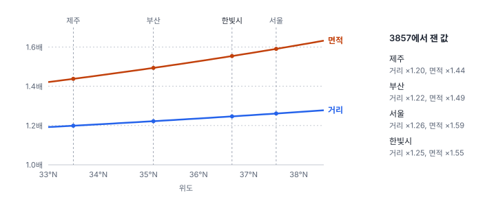
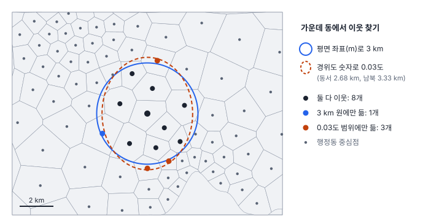

[목차](../README.md) · 이전: [1강 공간 자료의 세 얼굴](01-three-faces-of-spatial-data.md) · 다음: 3강 척도와 단위의 문제 (집필 예정)

# 2강 좌표계와 거리

> 앱 지원: ● 앱에서 전부 따라 할 수 있음 · 읽는 시간 약 30분

## 이 강에서 얻는 것

- 지리 좌표계(경위도)와 투영 좌표계(m)를 구분하고, 자료의 좌표계를 확인하고 지정하고 변환할 수 있음
- 한국에서 자주 만나는 좌표계(EPSG:4326, 5186, 5179, 5174, 3857 등)가 어디에 쓰이고 어떤 함정이 있는지 앎
- 경위도나 웹 지도 좌표로 거리와 면적을 재면 이웃, 밀도, 대역폭이 어떻게 틀어지는지 알고, 분석에 맞는 좌표계를 고를 수 있음

## 들어가는 질문

연구자 B는 한빛시 기상 관측소 48곳의 경도·위도가 적힌 표를 받아, 반경 3 km 안에 있는 관측소끼리 이웃으로 묶으려 했음. 분석 도구에 거리 3을 넣었더니 모든 관측소가 서로 이웃이 되었음. 0.03을 넣으니 그럴듯해 보였지만, 동서로는 가까운 관측소가 빠지고 남북으로는 먼 관측소가 들어갔음.

같은 연구실의 C는 행정동 인구밀도를 구하려고 배경지도와 같은 좌표계로 바꾼 뒤 면적을 쟀음. 밀도가 기존 통계보다 3분의 1 넘게 낮게 나왔음.

두 사람 모두 계산은 맞게 했음. 틀린 것은 **좌표의 뜻**을 확인하지 않은 것임. 이 강은 좌표가 무엇을 뜻하는지, 거리와 면적을 믿고 재려면 어떤 좌표계를 써야 하는지 다룸.

## 1. 좌표는 약속임

1강에서 피처의 지오메트리는 좌표의 목록이라고 했음. 그런데 좌표 숫자는 그 자체로는 위치가 아님. 한빛시 관측소 S01의 위치를 여러 좌표계로 적으면 다음과 같음.

| 좌표계 | x | y | 단위 |
|---|---|---|---|
| EPSG:5186 중부원점 (한빛시 자료의 좌표계) | 53,523.1 | 447,836.2 | m |
| EPSG:4326 WGS 84 경위도 | 125.362634 | 36.617701 | 도 |
| EPSG:5179 UTM-K | 808,864.8 | 1,848,776.0 | m |
| EPSG:32651 UTM 51N | 711,283.1 | 4,055,063.2 | m |
| EPSG:3857 웹 메르카토르 | 13,955,304.6 | 4,385,952.3 | m (겉보기) |

다섯 줄 모두 같은 지점임. 숫자가 지점이 되려면 **좌표계**(coordinate reference system, CRS)라는 약속이 필요함. 좌표계는 다음을 정함.

- **타원체**: 지구를 어떤 크기와 납작함의 타원체로 볼 것인가 (GRS80, WGS 84, Bessel 1841 등)
- **측지 기준계**(datum): 그 타원체를 실제 지구에 어떻게 맞춰 놓았는가 (Korea 2000, 한국측지계 1985 등)
- **투영법**: 둥근 면을 평면으로 어떻게 펼 것인가 (투영하지 않으면 경위도)
- **원점과 가산값**: 평면의 (0, 0)을 어디에 둘 것인가
- **단위**: 도, m 등

이 약속들에 번호를 붙여 모아 둔 목록이 **EPSG 코드**임. 원래 석유 업계의 측량 모임(European Petroleum Survey Group)이 만든 목록이며, 지금은 GIS 소프트웨어 대부분이 이 번호로 좌표계를 주고받음. 좌표계 정보가 없는 자료는 GeoStat이 지도에 올리지 못하고 좌표계를 지정하라고 묻는 것도 이 때문임.

좌표의 **순서**도 약속임. 대부분의 GIS와 GeoStat은 x = 경도, y = 위도 순서로 다룸. 표 파일에서 두 열을 바꿔 넣으면 한국의 점이 위도 125°라는 존재하지 않는 곳에 찍히거나 오류가 남. 경도·위도 열 이름이 없는 표를 받으면 먼저 값의 범위를 봄. 한국은 경도 124~132°, 위도 33~39° 근처임.

## 2. 경위도: 도는 거리가 아님

**지리 좌표계**(geographic coordinate system)는 위치를 경도와 위도라는 각도로 나타냄. GPS, 웹 서비스, GeoJSON 파일이 주로 경위도를 씀. 문제는 1도의 길이가 방향과 위치에 따라 다르다는 것임.

- 위도 1도(남북)는 어디서나 약 111 km임 (한국에서 110.9~111.0 km)
- 경도 1도(동서)는 위도가 높을수록 짧아짐. 자오선이 극으로 갈수록 모이기 때문임

| 위도 | 경도 1도 (동서) | 위도 1도 (남북) | 동서 ÷ 남북 |
|---|---|---|---|
| 33° (제주 남쪽) | 93.45 km | 110.90 km | 0.84 |
| 35° (부산 근처) | 91.29 km | 110.94 km | 0.82 |
| 36.67° (한빛시) | 89.40 km | 110.97 km | 0.81 |
| 38° | 87.83 km | 111.00 km | 0.79 |

한빛시에서 경도 1도는 위도 1도의 0.81배 길이임. 그래서 경위도 숫자를 평면 좌표처럼 넣고 피타고라스 공식으로 거리를 재면, 동서 거리와 남북 거리를 서로 다른 자로 재는 셈이 됨.

경위도로 거리를 제대로 재려면 지구가 둥글다는 것을 반영해야 함. 지구를 반지름 $R$인 구로 보면 두 점 사이의 가장 짧은 거리(대권거리)는 **하버사인 공식**(haversine formula)으로 구함.

$$
d = 2R \arcsin \sqrt{\sin^2\frac{\Delta\varphi}{2} + \cos\varphi_1 \cos\varphi_2 \sin^2\frac{\Delta\lambda}{2}}
$$

$\varphi$는 위도, $\lambda$는 경도, $\Delta$는 두 점의 차이임. 구 위에서 두 점과 지구 중심이 이루는 각을 구해 반지름을 곱하는 식임. 지구를 타원체로 보고 계산한 가장 짧은 거리는 **측지선 거리**(geodesic distance)라 하며, 요즘 도구는 대부분 이 값을 계산해 줌.

한빛시에서 가장 멀리 떨어진 두 관측소 S01과 S06 사이의 거리를 여러 방법으로 재 보면 다음과 같음.

| 방법 | 거리 | 측지선 대비 |
|---|---|---|
| 측지선 (GRS80 타원체) | 29.438 km | 기준 |
| 하버사인 (구) | 29.398 km | −0.1% |
| EPSG:5186 평면 거리 | 29.447 km | +0.03% |
| EPSG:5179 평면 거리 | 29.442 km | +0.01% |
| EPSG:3857 평면 거리 | 36.698 km | **+24.7%** |
| 경위도 숫자 그대로 × 111 km | 35.126 km | **+19.3%** |

알맞은 투영 좌표계에서 잰 평면 거리는 측지선과 0.1%도 차이 나지 않음. 반면 경위도 숫자를 그대로 쓰거나 웹 메르카토르로 재면 20% 안팎이 틀림. 원인은 서로 다름. 경위도 숫자를 쓴 경우는 두 관측소가 주로 동서로 떨어져 있어서(경도 차이 0.29°, 위도 차이 0.12°) 실제로는 89 km인 동서 1도를 111 km로 친 오차가 드러난 것임. 웹 메르카토르의 오차는 투영 자체가 거리를 부풀리기 때문이며 3절에서 다룸.

## 3. 투영: 둥근 지구를 평면에

**투영 좌표계**(projected coordinate system)는 둥근 지구를 평면에 펴고 m 단위의 x, y를 붙임. 거리와 면적을 평면 공식으로 잴 수 있어 분석에 편함. 대신 대가가 있음. 구면은 늘이거나 줄이지 않고는 평면에 펼 수 없음. 귤껍질을 찢지 않고 평평하게 펼 수 없는 것과 같음. 그래서 모든 투영은 거리, 면적, 모양, 방향 가운데 무엇을 지키고 무엇을 포기할지 고른 결과임.

- **정각 투영**(conformal): 좁은 범위의 모양과 각도를 지킴. 횡메르카토르, 메르카토르, 람베르트 정각원추가 여기에 속함
- **정적 투영**(equal-area): 면적을 지킴. 알버스, 람베르트 정적방위가 여기에 속함
- **정거 투영**(equidistant): 특정 점이나 선에서 잰 거리를 지킴

### 한국의 표준: 횡메르카토르

한국의 국가 좌표계는 **횡메르카토르**(Transverse Mercator, TM) 투영을 씀. 원기둥을 옆으로 눕혀 기준 경도선(중앙 자오선)에 대고 지구를 옮겨 그리는 방식임. 중앙 자오선 근처는 거의 정확하고, 동서로 멀어질수록 거리가 조금씩 늘어남. 중앙 자오선에서 $x$만큼 떨어진 곳의 축척 계수는 대략 다음과 같음.

$$
k \approx k_0 \left(1 + \frac{x^2}{2R^2}\right)
$$

$k_0$는 중앙 자오선 위의 축척 계수이고 $R$은 지구 반지름(약 6,371 km)임. 중앙 자오선에서 100 km 떨어지면 거리가 0.012%, 200 km 떨어지면 0.049% 늘어남. 한빛시는 중부원점의 중앙 자오선(동경 127°)에서 서쪽으로 약 162 km 떨어져 있어, EPSG:5186으로 잰 거리는 약 0.03%, 면적은 약 0.06% 큼. 한빛시 면적은 5186으로 454.02 ㎢, 타원체 위에서 직접 잰 값은 453.73 ㎢임. 공간통계에서는 무시해도 되는 차이임.

UTM-K(EPSG:5179)는 전국을 하나의 좌표계로 덮으려고 중앙 자오선을 127.5°에 두고 $k_0$를 0.9996으로 살짝 줄였음. 중앙 자오선 위에서는 거리를 0.04% 작게 재고, 동서로 멀어질수록 커지게 해서 오차를 고르게 나눈 것임. 본토에서는 오차가 대체로 ±0.04% 안쪽이고, 중앙 자오선에서 먼 동해의 울릉도·독도에서는 0.07~0.15%까지 커짐.

### 웹 메르카토르: 보여 주는 좌표계

구글 지도, 오픈스트리트맵, GeoStat의 배경지도처럼 웹 지도 타일은 대부분 **웹 메르카토르**(EPSG:3857)를 씀. 세계 어디를 확대해도 모양이 거의 찌그러지지 않고 타일을 나누기 쉬워서 화면에 지도를 보여 주는 데는 좋음. 그러나 적도에서 멀어질수록 거리와 면적이 크게 부풀려짐. 거리는 대략 위도의 시컨트($1/\cos\varphi$)배, 면적은 그 제곱배가 됨. 웹 메르카토르는 타원체인 WGS 84 좌표를 구의 식으로 투영하기 때문에 엄밀한 정각 투영이 아니고 이 배율도 근사값이지만, 분석에 쓰면 안 된다는 결론에는 영향이 없음.

한빛시의 위도에서는 거리가 1.25배, 면적이 1.55배가 됨. 한빛시 면적을 3857로 재면 454 ㎢가 아니라 706.60 ㎢가 나옴. 들어가는 질문의 C가 인구밀도를 3분의 1 넘게 낮게 얻은 이유임. 인구를 1.55배 부푼 면적으로 나누면 밀도는 원래의 약 64%가 됨. 웹 메르카토르는 **지도를 보여 주는** 좌표계이지 **재는** 좌표계가 아님.

## 4. 한국에서 만나는 좌표계

| EPSG | 이름 | 종류 | 주로 쓰는 곳 | 주의할 점 |
|---|---|---|---|---|
| 4326 | WGS 84 | 경위도 | GPS, 웹 서비스, GeoJSON | 거리·면적을 이 숫자로 바로 재지 않음 |
| 4737 | Korea 2000 (KGD2002) | 경위도 | 국내 측량 기준의 경위도 | WGS 84와의 차이는 1 m 안팎이라 통계 분석에서는 같다고 봐도 됨 |
| 5186 | Korea 2000 / 중부원점 | TM | 수치지형도 등 국가 기본 자료 | 원점 38°N 127°E, 가산값 (200,000, 600,000). 서부(5185, 125°E), 동부(5187, 129°E), 동해(5188, 131°E) 원점이 따로 있음 |
| 5181 | Korea 2000 / 중부원점 (옛 가산값) | TM | 2010년 이전 방식의 자료 | 5186과 투영은 같고 북쪽 가산값만 50만 m라 y가 10만 m 다름 |
| 5179 | Korea 2000 / UTM-K | TM | 전국 단위 자료 (행정구역 경계, 도로명주소 지도 등) | 전국을 좌표계 하나로 다룰 때 편함 |
| 5174 | 한국측지계 1985 / 수정 중부원점 | TM (Bessel 타원체) | 옛 지적도, 오래된 수치지도 | 흔히 '구 측지계(Bessel)'라고 부름. 같은 숫자를 새 기준으로 읽으면 약 300 m 어긋남 |
| 32651, 32652 | WGS 84 / UTM 51N, 52N | TM | 위성 영상 (Sentinel-2, Landsat 등) | 한반도는 대부분 52N, 서해안 일부와 서해는 51N |
| 3857 | 웹 메르카토르 | 메르카토르 | 웹 지도 타일, 배경지도 | 표시용. 거리·면적 계산에 쓰지 않음 |

한국은 오랫동안 일제강점기 토지조사사업 때 정한 Bessel 타원체 기반의 측지 기준계를 썼고, 2000년대 초 측량법을 고쳐 세계 기준에 맞춘 Korea 2000(세계측지계)으로 옮겨 왔음. 5174처럼 옛 기준계로 만든 자료가 아직 남아 있어서, 서로 다른 시기의 자료를 겹칠 때 수백 m 어긋나는 일이 생김.

공간통계 분석에서 좌표계를 고르는 규칙은 세 가지면 충분함.

1. **거리와 면적은 투영 좌표계(m)에서 잼.** 경위도와 3857은 쓰지 않음
2. **한 분석에 쓰는 모든 레이어를 같은 좌표계로 맞춤**
3. **분석 범위에 맞는 국가 좌표계를 고름.** 시·도 범위라면 그 지역의 원점 좌표계(5185~5188)나 UTM-K(5179), 전국이라면 5179. 위성 영상과 함께 쓴다면 영상의 UTM 좌표계에 맞춰도 됨. 이 범위에서는 어느 쪽을 골라도 거리 오차가 0.1% 안쪽이라 분석 결과는 거의 같음

## 5. 좌표계가 분석을 바꾸는 곳

### 거리로 정한 이웃

3부에서 다룰 공간가중치 가운데 거리 기준 가중치와 k-최근접 이웃(KNN)은 이름 그대로 거리로 이웃을 정함. 경위도 숫자로 거리를 재면 동서 거리에 비해 남북 거리가 짧게 계산되므로(한빛시에서 실제 비율의 0.81배), 남북 방향의 먼 이웃이 들어오고 동서 방향의 가까운 이웃이 빠짐.

그림의 가운데 동(마루2동)에서 반경 3 km 안의 동은 9개임. 경위도 숫자로 0.03도를 재면 동서로는 2.68 km, 남북으로는 3.33 km인 타원이 되어 11개가 들어옴. 둘 다에 드는 동은 8개뿐임. 한빛시 행정동 150개 전체에 가장 가까운 이웃 6개(KNN)를 찾으면, 경위도 숫자로 찾았을 때 55개 동의 이웃 목록이 달라짐. 이웃 900개 가운데 56개(6.2%)가 바뀌고, 이웃이 남북 방향에 있는 비율이 50.7%에서 56.6%로 늘어남. 위도가 높은 곳일수록 이 왜곡은 더 커짐.

이렇게 이웃이 바뀌면 그 위에서 계산하는 모란 지수, LISA, 공간 회귀가 모두 달라짐. 3부부터 쓰는 거의 모든 방법이 이웃 정의 위에 서 있으므로, 좌표계는 분석의 가장 아래층임.

### 면적과 밀도

인구밀도, 사건 밀도, 1강의 면적 가중 평균처럼 면적이 들어가는 계산은 좌표계의 면적 왜곡을 그대로 물려받음. 3857에서는 밀도가 약 36% 낮아지고, 경위도에서는 면적 단위가 '제곱도'라 값 자체가 의미가 없음(한빛시는 0.04574 제곱도임).

### 대역폭과 거리 구간

거리 기준 가중치의 임계값, 커널 밀도의 대역폭(17강), 코렐로그램의 거리 구간(11강), 지리가중회귀의 고정 대역폭(29강)은 모두 거리 단위로 적는 값임. 경위도로 분석하면 "대역폭 0.05"처럼 해석할 수 없는 값이 나오고, 그 값조차 동서와 남북에서 다른 길이를 뜻함. 보고서에 "대역폭 3.2 km"라고 쓸 수 있어야 함.

### 지정과 변환

좌표계를 다루는 작업은 두 가지이며, 둘을 헷갈리면 큰 사고가 남.

- **지정**(assign, define): 좌표 숫자는 그대로 두고 "이 숫자는 이 좌표계로 읽어라"라는 꼬리표만 붙임. 좌표계 정보가 빠진 자료에 원래 좌표계를 알려 줄 때 씀
- **변환**(reproject, transform): 좌표 숫자를 다른 좌표계의 숫자로 다시 계산함. 자료를 다른 좌표계로 옮길 때 씀

변환해야 할 때 지정을 하면 자료가 엉뚱한 곳으로 감. 한빛시 행정동(5186 숫자)에 좌표계를 잘못 지정하면 다음처럼 옮겨짐.

| 잘못 지정한 좌표계 | 옮겨진 거리 |
|---|---|
| EPSG:5181 (옛 가산값) | 북쪽으로 100.0 km |
| EPSG:5174 (한국측지계 1985) | 북쪽으로 100.3 km |
| EPSG:5179 (UTM-K) | 1,585 km |

이렇게 크게 어긋나면 금방 알아챔. 위험한 것은 **작게 어긋나는 경우**임. 가산값이 같은 5174와 5181은 같은 숫자를 읽어도 약 313 m밖에 차이 나지 않음. 옛 지적도를 새 기준 좌표계로 잘못 지정하면, 자료가 그럴듯한 자리에 놓인 채 수백 m씩 밀려 있게 됨. 행정동 경계와 사건 위치를 겹칠 때 경계 근처의 사건이 옆 동으로 넘어가는 식으로 결과가 조용히 틀어짐.

GeoStat은 거리 기반 가중치를 만들 때 경위도 자료를 알아서 UTM 좌표계로 바꿔 m 단위로 계산함. 그러나 모든 도구가 그렇지는 않음. Python의 PySAL에 경위도 좌표를 그대로 넣으면 숫자 그대로 거리를 재서, 한빛시 행정동의 '최소 이웃 거리'가 0.02715라는 도 단위 값으로 나옴. 코드로 분석할 때는 반드시 먼저 투영 좌표계로 변환함(GeoPandas의 `to_crs`).

## 해 보기: GeoStat에서 좌표계 확인·변환·지정

1. `hanbit_dong.gpkg`를 열고 왼쪽 **정보** 칸의 좌표계를 확인함. EPSG:5186, 이름은 `KGD2002 / Central Belt 2010`으로 나옴 (KGD2002는 Korea 2000 측지 기준계의 약칭으로, EPSG의 투영 좌표계 이름에 쓰임)
2. 속성 테이블의 **내보내기…** 단추(또는 **파일 → 레이어 내보내기…** 메뉴)를 누르고, **다른 좌표계로 변환해 저장**을 켠 다음 `EPSG:4326 — WGS 84 경위도`를 고름. **저장 위치 선택…** 단추를 누르고 파일 이름을 `hanbit_dong_4326.gpkg`로 바꿔 저장함
3. 저장한 파일을 **파일 → 데이터 열기…** 메뉴로 엶. 정보 칸의 좌표계가 EPSG:4326이고, 지도에서 원래 레이어와 정확히 겹쳐야 함. 좌표 숫자는 바뀌었지만 위치는 그대로인 것이 **변환**임
4. 두 레이어에서 각각 **공간 분석 → 공간가중치 만들기…** 메뉴를 열고 유형을 **거리 임계값**으로 고름. 칸에 미리 채워지는 값(모든 동이 이웃을 하나 이상 갖는 최소 거리)을 비교함
   - 확인: 원래 레이어는 2783.667, 경위도 레이어는 2783.085로 거의 같음. 경위도 레이어 쪽에는 UTM 51N으로 바꿔 m 단위로 계산했다는 안내가 나옴. 0.6 m 차이는 두 좌표계의 축척 차이임
   - 가중치는 만들지 않고 **취소**를 눌러도 됨
5. 이번에는 원래 `hanbit_dong` 레이어의 정보 칸에서 좌표계 옆의 **지정…** 단추를 누르고 `EPSG:5174 — Korean 1985 / 중부원점 (Bessel, 구 지적도)`를 골라 **지정**함. 행정동이 북쪽으로 약 100 km 옮겨감. `hanbit_events`를 함께 열어 두었다면 출동 점과 완전히 떨어짐. 좌표 숫자는 그대로인데 위치가 바뀐 것이 **지정**임
6. 다시 **지정…** 단추를 눌러 EPSG:5186으로 되돌림

## 헷갈리는 쌍

- **지리 좌표계 vs 투영 좌표계**: 지리 좌표계는 경위도(각도), 투영 좌표계는 평면에 편 m 단위 좌표임. 거리와 면적은 투영 좌표계에서 잼
- **지정 vs 변환**: 지정은 숫자를 두고 꼬리표만 바꾸고, 변환은 숫자를 다시 계산함. 좌표계 정보가 빠졌을 때는 지정, 다른 좌표계로 옮길 때는 변환함
- **타원체 vs 측지 기준계**: 타원체는 지구 모양의 수학적 모델(GRS80, Bessel)이고, 측지 기준계는 그 타원체를 실제 지구에 맞춘 방식(Korea 2000, 한국측지계 1985)임. 타원체가 같아도 기준계가 다르면 위치가 어긋남
- **5186 vs 5181**: 둘 다 Korea 2000 중부원점 TM이지만 북쪽 가산값이 60만 m와 50만 m로 달라 y 좌표가 10만 m 차이 남
- **표시용 좌표계 vs 계산용 좌표계**: 3857은 화면에 지도를 보여 주는 용도이고, 계산은 국가 TM이나 UTM에서 함

## 흔한 실수와 심사 지적

- **경위도 좌표로 거리 기반 가중치나 GWR 대역폭을 계산함**
  - 결과: 이웃이 남북으로 치우치고, 대역폭을 거리로 해석할 수 없음
  - 지적: "사용한 좌표계와 거리 단위를 밝히십시오."
  - 대응: 투영 좌표계로 변환한 뒤 다시 계산하고, 좌표계를 EPSG 번호로 적음
- **웹 지도 좌표계(3857)에서 면적·밀도·거리를 계산함**
  - 결과: 한국에서는 면적이 1.4~1.6배로 부풀려짐
  - 대응: 국가 좌표계로 변환한 뒤 계산함
- **좌표계를 모르는 자료에 아무 좌표계나 지정함**
  - 결과: 크게 어긋나면 바로 보이지만, 5174와 5181처럼 수백 m만 어긋나면 모르고 지나감
  - 대응: 자료를 준 기관에 좌표계를 확인하고, 위치를 확실히 아는 다른 자료(도로, 해안선)와 겹쳐 봄
- **서로 다른 좌표계의 레이어를 그대로 겹쳐 계산함**
  - 대응: 분석 전에 모든 레이어를 한 좌표계로 변환함. GeoStat의 점 집계·존 통계는 자동으로 맞춰 주지만, 다른 도구도 그런지 확인함

## 보고서에는 이렇게 씀

좌표계는 거리나 면적을 쓴 모든 분석에 적음. 아래는 논문 문체로 쓴 예시임.

> 모든 공간 자료는 KGD2002 / Central Belt 2010(EPSG:5186) 좌표계로 변환하여 분석하였다. 경위도로 제공된 기상 관측소 위치는 WGS 84(EPSG:4326)에서 같은 좌표계로 변환하였으며, 거리 기반 공간가중치의 임계값과 대역폭은 m 단위로 나타내었다.

적어야 할 항목은 다음과 같음.

- 분석에 쓴 좌표계의 이름과 EPSG 번호
- 원자료의 좌표계가 달랐다면 어떤 좌표계에서 변환했는지
- 거리 임계값·대역폭 같은 거리 매개변수의 단위

## 요약

- 좌표 숫자는 좌표계라는 약속(타원체, 측지 기준계, 투영법, 원점, 단위)과 함께 있어야 위치가 됨. EPSG 번호가 그 약속의 이름임
- 경위도는 각도라서 거리가 아님. 한국에서 경도 1도는 위도 1도의 0.8배 안팎이라, 경위도 숫자로 거리를 재면 동서와 남북이 다른 자로 재짐
- 모든 투영은 무언가를 왜곡함. 한국의 국가 TM 좌표계는 본토 범위에서 거리 오차가 0.1% 안쪽이지만, 웹 메르카토르(3857)는 거리를 20% 안팎, 면적을 40~65% 부풀림
- 거리로 정한 이웃, 밀도, 대역폭은 모두 좌표계의 영향을 받음. 거리와 면적은 투영 좌표계(m)에서 재고, 모든 레이어를 같은 좌표계로 맞춤
- 좌표계 지정은 꼬리표만 바꾸고 변환은 숫자를 다시 계산함. 수백 m만 어긋나는 잘못된 지정이 가장 위험함

## 핵심 용어

| 한글 | 영문 | 비고 |
|---|---|---|
| 좌표계 | Coordinate Reference System (CRS) | |
| 지리 좌표계 | Geographic Coordinate System | 경위도 |
| 투영 좌표계 | Projected Coordinate System | |
| 타원체 | Ellipsoid | GRS80, WGS 84, Bessel 1841 |
| 측지 기준계 | Geodetic Datum | Korea 2000(KGD2002), 한국측지계 1985 |
| EPSG 코드 | EPSG Code | 좌표계 번호 |
| 대권거리 / 측지선 거리 | Great-circle Distance / Geodesic Distance | |
| 하버사인 공식 | Haversine Formula | |
| 횡메르카토르 | Transverse Mercator (TM) | 한국 국가 좌표계의 투영법 |
| 축척 계수 | Scale Factor | |
| 정각 / 정적 / 정거 투영 | Conformal / Equal-area / Equidistant Projection | |
| 웹 메르카토르 | Web Mercator (EPSG:3857) | |
| 좌표계 지정 | Assign / Define Projection | GeoStat: 좌표계 지정 |
| 좌표계 변환 | Reproject / Transform | GeoStat: 내보내기에서 변환 |
| 가산값 | False Easting / False Northing | |

## 원전과 더 읽을거리

**원전과 참고 자료**

- Snyder, J. P. (1987). *Map Projections: A Working Manual* (USGS Professional Paper 1395). U.S. Geological Survey. 투영법의 식과 성질을 정리한 표준 참고서
- Karney, C. F. F. (2013). Algorithms for geodesics. *Journal of Geodesy*, 87(1), 43–55. 오늘날 GIS 도구가 쓰는 측지선 거리 계산법
- Battersby, S. E., Finn, M. P., Usery, E. L., & Yamamoto, K. H. (2014). Implications of Web Mercator and its use in online mapping. *Cartographica*, 49(2), 85–101. 웹 메르카토르를 분석에 쓸 때의 문제
- EPSG Geodetic Parameter Dataset (epsg.org). 이 강에 나온 좌표계의 정확한 매개변수

**교과서**

- Iliffe, J., & Lott, R. (2008). *Datums and Map Projections for Remote Sensing, GIS and Surveying* (2nd ed.). Whittles. 측지 기준계와 투영을 실무 관점에서 다룸
- Longley, P. A., Goodchild, M. F., Maguire, D. J., & Rhind, D. W. (2015). *Geographic Information Science and Systems* (4th ed.). Wiley. 좌표와 위치 참조 전반

## 연습

1. 부산(북위 35°) 근처에서 경도 0.1°와 위도 0.1°는 각각 약 몇 km인가? 이 지역의 점 자료를 경위도 숫자 그대로 넣고 "반경 0.1" 안의 점을 이웃으로 삼으면 이웃 범위는 어떤 모양이 되는가?

2. 어떤 연구가 시군구 경계를 배경지도와 같은 EPSG:3857로 바꾼 뒤 면적을 재어 인구밀도를 계산했음. 서울(북위 37.5°)과 제주(북위 33.5°)의 인구밀도는 각각 실제의 몇 배로 계산되었겠는가? 이 오류가 두 지역을 비교하는 데 주는 영향을 설명하시오.

3. 좌표계 정보(.prj)가 없는 Shapefile을 받았음. 좌표 값의 범위가 x는 180,000~220,000, y는 540,000~560,000임. EPSG:5186과 5181 가운데 어느 쪽일 가능성이 높은지, 확인하려면 무엇을 해야 하는지 적으시오. (중부원점의 원점은 북위 38°임)

4. 지정과 변환 가운데 무엇을 써야 하는지 고르시오. (가) 경위도로 된 GeoJSON을 5186으로 바꿔 행정동과 함께 분석하려 함 (나) 좌표계 정보가 빠진 5186 Shapefile을 받음 (다) 5174로 만든 옛 지적도를 5186 자료와 겹치려 함

5. 한빛시 자료는 EPSG:5186으로 되어 있고 한빛시는 중앙 자오선에서 약 162 km 떨어져 있음. 이 자료를 서부원점(EPSG:5185, 중앙 자오선 125°)으로 변환하면 거리 오차는 대략 어떻게 달라지는가? 공간통계 분석 결과가 달라질 만한 차이인가?

해답

1. 위도 35°에서 경도 1°는 약 91.3 km, 위도 1°는 약 110.9 km이므로 경도 0.1°는 약 9.1 km, 위도 0.1°는 약 11.1 km임. "반경 0.1"은 동서 반지름 9.1 km, 남북 반지름 11.1 km인 남북으로 긴 타원이 됨.

2. 3857의 면적 배율은 $1/\cos^2\varphi$임. 서울(37.5°)은 약 1.59배, 제주(33.5°)는 약 1.44배로 면적이 부풀려지므로, 인구밀도는 서울이 실제의 약 0.63배, 제주가 약 0.70배로 계산됨. 모든 지역이 같은 비율로 틀리는 것이 아니라 북쪽일수록 더 많이 낮아지므로, 지역 간 비교에서 남쪽 지역의 밀도가 상대적으로 높게 보이는 체계적 편향이 생김.

3. 원점(북위 38°)의 북쪽 좌표는 5186에서 600,000, 5181에서 500,000임. y가 540,000~560,000이면 5186으로는 원점보다 40~60 km 남쪽(북위 37.5° 안팎, 수도권 근처)이고, 5181로는 40~60 km 북쪽(북위 38.5° 안팎, 휴전선 이북)이 됨. 한국 자료라면 5186일 가능성이 높음. 확인하려면 두 좌표계를 각각 지정해 보고, 위치를 확실히 아는 다른 자료(행정 경계, 해안선, 도로)나 배경지도와 겹쳐 맞는 쪽을 고름. 가능하면 자료를 준 곳에 좌표계를 물어봄.

4. (가) 변환. 경위도 숫자를 5186 숫자로 다시 계산해야 함. (나) 지정. 좌표 숫자는 이미 5186이므로 꼬리표만 붙이면 됨. (다) 먼저 옛 지적도에 5174를 지정(정보가 없다면)한 뒤 5186으로 변환함. 5174를 건너뛰고 5186을 바로 지정하면 약 100 km 어긋나고, 5181을 지정하면 약 300 m 어긋남.

5. 서부원점의 중앙 자오선(125°)은 한빛시(약 125.2°)에서 약 16 km밖에 떨어져 있지 않아 거리 오차가 0.001% 안팎으로 줄어듦. 5186에서도 오차가 약 0.03%라서, 이웃 판정이나 모란 지수 같은 공간통계 결과가 달라질 만한 차이는 아님. 국가 TM 좌표계 사이의 선택보다 경위도나 3857을 쓰지 않는 것이 훨씬 중요함.

---

[목차](../README.md) · 이전: [1강 공간 자료의 세 얼굴](01-three-faces-of-spatial-data.md) · 다음: 3강 척도와 단위의 문제 (집필 예정)
