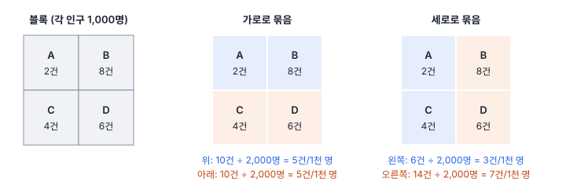
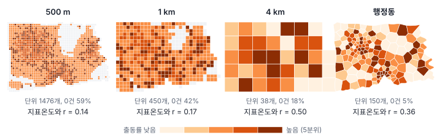
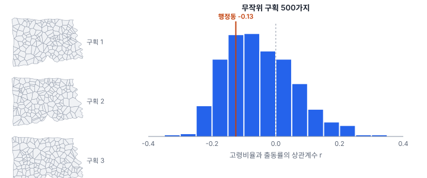
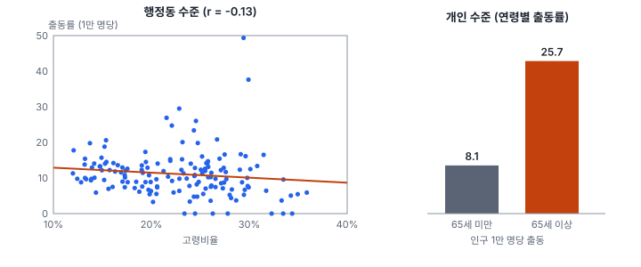

[목차](../README.md) · 이전: [2강 좌표계와 거리](02-coordinates-and-distance.md) · 다음: [4강 공간 자료 준비](04-preparing-spatial-data.md)

# 3강 척도와 단위의 문제

> 앱 지원: ◐ 격자 집계와 비교는 앱에서, 무작위 구획 실험은 코드로 함 · 읽는 시간 약 35분

## 이 강에서 얻는 것

- 같은 자료라도 어떤 크기(척도)와 어떤 경계(구획)로 묶느냐에 따라 상관과 회귀 결과가 달라진다는 **가변적 공간 단위 문제**(MAUP)를 설명할 수 있음
- 지역 단위의 관계를 개인에게 옮기는 **생태학적 오류**와 그 반대 방향의 오류를 구분하고, 결론을 알맞은 수준으로 쓸 수 있음
- 분석 단위와 분모를 고르는 원칙을 알고, 단위를 바꿔 결과가 얼마나 흔들리는지 확인하는 민감도 분석을 할 수 있음

## 들어가는 질문

한빛시 보건소는 1강의 구급 출동 자료를 행정동으로 집계해 분석했음. 두 가지 결과가 나왔음.

- 지표온도가 높은 동일수록 출동률이 높음 (상관계수 0.36)
- 고령비율이 높은 동일수록 출동률이 오히려 조금 낮음 (상관계수 −0.13)

보도자료 초안에는 "폭염 피해는 노인보다 도심 주민에게 집중된다"라는 문장이 들어갔음. 그런데 이웃 대학의 연구자가 같은 출동 자료를 4 km 격자로 다시 집계해 보니 지표온도와의 상관계수가 0.50으로 커졌음. 한편 출동 기록의 연령을 직접 세어 보면 65세 이상의 출동률은 65세 미만의 3배가 넘었음.

어느 숫자가 맞는가? 모두 계산은 맞음. 다른 것은 **무엇을 단위로 셌는가**와 **어느 수준에 대해 말하는가**임. 이 강은 그 두 가지를 다룸.

## 1. 같은 자료, 다른 결론: 가변적 공간 단위 문제

행정동, 시군구, 격자처럼 자료를 모으는 단위는 대부분 현상과 상관없이 사람이 그은 것임. 경계를 조금 옮기거나 단위를 크게 잡아도 자료 자체는 그대로인데, 집계한 값과 그로부터 구한 통계는 달라짐. 이를 **가변적 공간 단위 문제**(modifiable areal unit problem, MAUP)라 함. 오픈쇼(Stan Openshaw)가 1970~80년대에 체계적으로 정리한 이름이며, 두 가지 얼굴이 있음.

- **척도 효과**(scale effect): 단위의 **크기**를 바꾸면 결과가 달라짐 (행정동 → 구, 500 m 격자 → 4 km 격자)
- **구획 효과**(zoning effect): 단위의 수와 크기가 같아도 **경계를 어떻게 긋느냐**에 따라 결과가 달라짐

작은 예로 구획 효과를 먼저 봄. 인구가 1,000명씩인 블록 네 개에서 출동이 각각 2, 8, 4, 6건 있었음.

- 가로로 묶으면 위 구역(A+B)과 아래 구역(C+D) 모두 10건 ÷ 2,000명 = 1천 명당 5건으로 같음. "지역 차이 없음"이 결론이 됨
- 세로로 묶으면 왼쪽(A+C)은 1천 명당 3건, 오른쪽(B+D)은 7건임. "오른쪽이 두 배 넘게 위험함"이 결론이 됨

블록 네 개의 자료는 하나도 바뀌지 않았음. 바뀐 것은 선뿐임. 선거구를 어떻게 긋느냐에 따라 같은 표로 다른 당선자가 나오는 **게리맨더링**이 바로 이 구획 효과를 이용한 것임.

## 2. 척도 효과

한빛시 구급 출동 1,408건을 크기가 다른 네 가지 격자와 행정동으로 집계하고, 단위마다 출동률(인구 1만 명당)과 평균 지표온도, 고령비율을 구해 상관계수를 계산했음. 인구는 3강부터 쓰는 100 m 격자 인구 자료(`hanbit_pop100.tif`)를 각 단위로 합산했고, 인구가 100명 미만인 단위는 출동률이 지나치게 튀므로 뺐음.

| 단위 | 분석한 단위 수 (전체) | 인구 중앙값 | 출동 0건인 단위 | r(지표온도, 출동률) | r(고령비율, 출동률) |
|---|---|---|---|---|---|
| 500 m 격자 | 1,476 (1,934) | 365 | 59% | 0.14 | −0.03 |
| 1 km 격자 | 450 (511) | 962 | 42% | 0.17 | −0.02 |
| 2 km 격자 | 129 (135) | 3,158 | 26% | 0.16 | −0.15 |
| 4 km 격자 | 38 (38) | 14,854 | 18% | **0.50** | −0.26 |
| 행정동 | 150 (150) | 8,503 | 5% | 0.36 | −0.13 |

분석한 단위 수는 인구 100명 이상인 단위이고, 괄호 안은 격자를 만들었을 때의 전체 개수임. 인구 중앙값과 출동 0건 비율도 분석한 단위만으로 구했음.

지표온도와 출동률의 상관계수가 500 m 격자에서는 0.14, 4 km 격자에서는 0.50으로 세 배 넘게 커짐. 같은 자료로 "약한 관계"와 "뚜렷한 관계"가 모두 나올 수 있다는 뜻임. 다만 커지는 모습이 고르지는 않음. 2 km까지는 0.14~0.17로 거의 그대로였고, 4 km에서 크게 뛰었음.

왜 이런 일이 생기는가? 작은 단위의 출동률에는 두 가지가 섞여 있음. 하나는 더위처럼 넓은 범위에 걸친 **체계적인 차이**이고, 다른 하나는 인구가 적은 곳에서 출동이 우연히 한두 건 더 나오고 덜 나오는 **잡음**임. 500 m 격자는 절반 넘게 출동이 0건이고, 1건만 생겨도 출동률이 크게 튐. 단위를 키우면 잡음은 서로 상쇄되어 줄어들고 체계적인 차이의 비중이 커지므로 상관계수가 커지는 경향이 있음. 1934년 겔케(Gehlke)와 비엘(Biehl)이 미국 인구조사 자료에서 단위를 합칠수록 상관계수가 커지는 것을 처음 보고한 이래 반복해서 확인된 현상임. 경향일 뿐 법칙은 아니어서, 자료와 구획에 따라 커지지 않거나 오히려 작아지기도 함.

그렇다고 4 km 격자의 0.50이 "진짜" 관계인 것도 아님. 단위가 38개뿐이라 상관계수 자체가 불안정함. 격자 하나만 빼도 0.46에서 0.57 사이로 움직이고, 95% 신뢰구간은 대략 0.22~0.71로 넓음. 또 4 km 안에 도심과 외곽이 섞여 지표온도의 동네 차이가 지워짐. 어떤 크기의 단위를 쓰느냐는 **어떤 질문을 하느냐**의 문제임. 동네 단위의 폭염 대책을 세우려면 동네 크기의 단위가, 도시 전체의 구조를 보려면 큰 단위가 맞음. 1강의 지원(support) 개념과 같은 이야기를 분석 단위의 관점에서 다시 본 것임.

## 3. 구획 효과

이번에는 단위의 개수를 고정하고 경계만 바꿔 봄. 한빛시 안에 무작위로 점 150개를 찍고 가장 가까운 점끼리 묶어 구역 150개를 만드는 방식(보로노이 분할)으로, 행정동과 개수가 같은 무작위 구획을 500가지 만들었음. 2절처럼 인구가 100명 미만인 구역은 뺐음(구획마다 평균 6개). 무작위 구획의 구역들은 면적이 대체로 비슷하고, 행정동은 인구가 비슷하도록 도심에서 작고 외곽에서 크게 그어져 있다는 점이 다름. 구획마다 고령비율과 출동률의 상관계수를 구하면 다음과 같음.

- 고령비율과 출동률의 상관계수는 −0.33에서 +0.30까지 흩어짐. 500가지 가운데 31%는 **양수**, 나머지는 음수임. 구획만 바꿔도 "고령 동일수록 출동이 많다"와 "적다"가 모두 나옴
- 지표온도와 출동률의 상관계수는 0.01에서 0.41까지 흩어짐. 부호는 늘 양수였지만 크기는 크게 달라짐. 행정동의 값(0.36)은 무작위 구획 500가지 가운데 98%보다 컸음. 행정동은 인구에 맞춰 그어져 도심에서는 작고 외곽에서는 크기 때문에, 무작위 구획과는 다른 결과를 냄

오픈쇼와 테일러(Openshaw & Taylor, 1979)는 미국 아이오와주 99개 카운티 자료로 수많은 구획을 만들어, 같은 두 변수의 상관계수가 음의 값부터 양의 값까지 매우 넓게 흩어진다는 것을 보였음. 공교롭게도 그들이 쓴 변수도 고령인구 비율(과 공화당 득표율)이었음. 논문 제목이 「상관계수 백만여 개」였을 만큼, 구획 효과는 예외가 아니라 집계 자료의 기본 성질임.

## 4. 생태학적 오류: 지역의 관계를 개인에게 옮기지 않음

들어가는 질문으로 돌아가 봄. 행정동 수준에서는 고령비율과 출동률의 상관계수가 −0.13임. 그런데 같은 출동 자료를 사람 단위로 보면 이야기가 정반대임.

| | 출동 | 인구 | 인구 1만 명당 출동 |
|---|---|---|---|
| 65세 이상 | 635건 | 246,926명 | 25.72 |
| 65세 미만 | 773건 | 953,074명 | 8.11 |

65세 이상은 인구의 20.6%인데 출동의 45.1%를 차지하고, 한 사람이 출동을 겪을 확률은 65세 미만의 **3.17배**임.

지역 수준의 관계(고령 동일수록 출동률이 약간 낮음)를 개인 수준의 관계(노인은 덜 위험함)로 읽는 것을 **생태학적 오류**(ecological fallacy)라 함. 로빈슨(W. S. Robinson)이 1950년 논문에서 이 문제를 체계적으로 보였고, '생태학적 오류'라는 이름은 셀빈(H. C. Selvin)이 1958년에 붙였음. 로빈슨은 1930년 미국 인구조사에서 외국 출생과 문맹의 상관계수가 개인 수준에서는 0.12였지만 주(州) 수준에서는 −0.53으로 부호까지 뒤집힌다는 것을 보였음. 이민자가 문맹률이 낮은 주에 많이 살았기 때문임.

한빛시에서도 같은 일이 일어났음. 고령비율이 높은 동은 대부분 시원한 외곽에 있음. 행정동의 고령비율과 평균 지표온도의 상관계수는 −0.75임. 고령비율을 기준으로 동을 절반씩 나눠 보면 다음과 같음.

| | 평균 지표온도 | 동 전체 출동률 | 65세 이상 출동률 | 65세 미만 출동률 |
|---|---|---|---|---|
| 고령비율이 높은 동 75개 | 30.25℃ | 11.45 | 23.02 | 7.22 |
| 고령비율이 낮은 동 75개 | 33.21℃ | 11.87 | 27.77 | 8.50 |

두 무리 모두에서 65세 이상의 출동률은 65세 미만의 3배를 넘음. 그러나 고령비율이 높은 동은 3℃ 가까이 시원해서 나이대별 출동률이 모두 낮고, 이 효과가 노인이 많은 효과를 상쇄해 동 전체의 출동률은 오히려 조금 낮게 나옴. 동네마다 다른 조건은 지표온도만이 아닐 수 있음. 주거 형태, 냉방 여건처럼 그 동네 자체의 조건이 주민 한 사람 한 사람의 위험을 바꾸는 것을 **맥락 효과**(contextual effect)라 하며, 개인의 특성과 구분해 따지려면 다수준 모형이 필요함. 지역 수준의 상관은 "노인이 위험한가"가 아니라 "노인이 많은 동네가 어떤 동네인가"를 반영한 것임.

반대 방향의 오류도 있음. 개인 수준의 관계를 지역에 그대로 옮겨 "노인이 3배 위험하니 고령비율이 높은 동의 출동률이 가장 높을 것"이라고 결론 내리는 것은 **개인주의적 오류**(individualistic fallacy, 원자론적 오류라고도 함)임. 한빛시에서는 실제로 그렇지 않았음.

두 오류를 피하는 방법은 하나임. **결론을 자료의 수준에 맞춰 씀.** 행정동 자료로는 "고령비율이 높은 동은 출동률이 조금 낮은 경향이 있다"까지만 말할 수 있고, 노인 개인의 위험에 대해서는 말할 수 없음. 개인과 지역의 효과를 함께 따지려면 개인 자료와 지역 자료를 함께 넣는 다수준 모형이 필요함.

## 5. 분모와 경계도 단위임

MAUP는 경계만의 문제가 아님. 단위를 정하는 모든 선택이 결과를 바꿈.

- **분모**: 1강의 다솜23동처럼 산업단지가 있는 동에서는 쓰러진 사람의 상당수가 주민이 아니라 일하러 온 사람일 수 있음. 주민등록 인구로 나누면 위험이 과대 추정됨. 낮 시간 인구, 종사자 수처럼 **실제로 노출된 사람의 수**가 알맞은 분모인지 따져야 함
- **구성**: 4절처럼 동마다 연령 구성이 다르면 출동률을 그대로 비교할 수 없음. 연령 구성을 맞춘 뒤 비교하는 **연령 표준화**가 필요하며 14강에서 다룸
- **시간에 따른 경계 변화**: 행정동은 인구가 늘면 나뉘고(분동) 줄면 합쳐짐(합동). 10년 전 자료와 지금 자료를 동 단위로 비교하면, 값의 변화와 경계의 변화가 뒤섞임. 시계열을 비교할 때는 두 시점에 공통인 경계로 다시 집계하거나, 경계가 바뀌지 않는 격자 단위를 씀. 통계청도 인구 등을 격자 단위로 공개하는데, 격자는 이런 목적에 알맞음

## 6. MAUP와 함께 살기

MAUP는 해결되는 문제가 아니라 **관리하는 문제**임. 다음을 지키면 대부분의 함정을 피할 수 있음.

1. **질문의 수준을 먼저 정함.** 개인에 대한 질문인가, 지역에 대한 질문인가? 결론은 그 수준으로만 씀
2. **가능한 한 작은 단위, 가능하면 개체 자료를 확보함.** 작은 단위는 나중에 합칠 수 있지만 큰 단위는 쪼갤 수 없음
3. **현상의 규모에 맞는 단위를 고름.** 동네 단위 현상을 시군구로 보거나, 광역 현상을 100 m 격자로 보지 않음
4. **단위를 바꿔 결과를 다시 계산함(민감도 분석).** 행정동, 두세 가지 크기의 격자로 다시 계산해서 결론이 유지되는지 보고, 그 결과를 보고서에 함께 적음
5. **작은 단위의 불안정은 따로 다룸.** 인구가 적은 단위의 비율은 14강의 평활이나 10부의 베이지안 모형으로 안정시킴

## 해 보기: GeoStat에서 척도 효과 확인하기

행정동과 4 km 격자에서 지표온도와 출동률의 관계를 비교함.

1. `hanbit_dong.gpkg`, `hanbit_events.gpkg`, `hanbit_lst.tif`와 이번 강에서 추가된 `hanbit_pop100.tif`(1밴드 인구, 2밴드 고령인구)를 엶
2. **행정동**: `hanbit_dong`을 고른 채 1강처럼 점 집계로 `PT_CNT`를, 존 통계(`hanbit_lst`, 평균)로 `ZS_MEAN`을 만들고, 계산 필드 `출동률` = `` `PT_CNT` / `인구` * 10000 ``을 만듦
3. 위 도구 모음의 **차트** 단추로 오른쪽 패널을 열고 **+ 산점도**를 눌러 x에 `ZS_MEAN`, y에 `출동률`을 고름
   - 확인: 차트 아래에 기울기 1.043, R² 0.128이 나옴 (R²는 상관계수의 제곱이라 0.358² ≈ 0.128)
4. **4 km 격자**: **공간 분석 → 격자 만들기 (정사각·육각)…** 메뉴에서 범위를 `레이어: hanbit_dong`, 모양을 정사각형, 셀 크기를 `4000`으로 하고 **폴리곤과 겹치는 셀만 남기기**와 **만든 뒤 바로 존 통계 계산**(래스터 `hanbit_lst`)을 켠 채 **만들기…** 단추를 눌러 저장함. 격자 38개가 생기고 `ZS_MEAN` 등의 열이 붙음
5. 새 격자 레이어를 고른 채 **공간 분석 → 존 통계 (래스터 → 폴리곤)…** 메뉴를 열고, 래스터 `hanbit_pop100`, 밴드 1, 통계는 **합계**만 켜고, 결과 열 접두어를 `POP`으로 해서 실행함. `POP_SUM` 열이 생김
6. 같은 격자 레이어에서 점 집계로 `PT_CNT`를 만들고, 계산 필드 `출동률` = `` `PT_CNT` / `POP_SUM` * 10000 ``을 만듦
7. 산점도(x `ZS_MEAN`, y `출동률`)를 추가함
   - 확인: 기울기 1.765, R² 0.252. 행정동보다 설명력(R²)이 두 배 가까이 크게 나옴
8. (더 해 보기) 셀 크기 `1000`으로 4~7을 반복해 봄. 격자 511개 가운데 인구가 0인 19개는 출동률이 빈 값이 되고, 인구 3명인 격자에 출동이 3건 있어 출동률이 1만 명당 10,000건이 되는 등 극단값이 생김. R²는 0.005로 떨어짐. 인구가 적은 단위의 출동률이 얼마나 불안정한지 직접 확인할 수 있음

무작위 구획 500가지를 만드는 3절의 실험은 앱에서 할 수 없으며, 그림을 만든 코드가 [`book/fig-src/03.py`](../fig-src/03.py)에 있음.

## 헷갈리는 쌍

- **척도 효과 vs 구획 효과**: 척도 효과는 단위의 크기를 바꿀 때, 구획 효과는 크기와 개수는 같고 경계만 바꿀 때 결과가 달라지는 것임
- **생태학적 오류 vs 개인주의적 오류**: 지역 수준의 관계를 개인에게 옮기면 생태학적 오류, 개인 수준의 관계를 지역에 옮기면 개인주의적 오류임
- **MAUP vs 지원(1강)**: 지원은 값 하나가 대표하는 공간 범위이고, MAUP는 그 범위(단위)를 바꿀 때 통계 결과가 달라지는 현상임. 같은 문제를 값의 관점과 분석의 관점에서 본 것임
- **체계적 차이 vs 잡음**: 작은 단위의 비율 차이에는 넓은 범위의 체계적 차이와 적은 인구에서 생기는 우연한 잡음이 섞여 있음. 단위를 키우면 잡음이 줄어 상관이 커지는 경향이 있음

## 흔한 실수와 심사 지적

- **행정구역 자료의 상관을 개인의 위험으로 해석함**
  - 예: "고령비율이 높은 시군구일수록 사망률이 높으므로 노인이 위험하다"
  - 지적: "지역 수준 자료로 개인 수준의 결론을 낼 수 있습니까?"
  - 대응: 결론을 지역 수준으로 고쳐 쓰고, 개인 수준 주장이 필요하면 개인 자료나 다수준 모형을 씀
- **한 가지 단위의 결과만 보고함**
  - 지적: "분석 단위를 바꾸어도 결과가 유지됩니까?"
  - 대응: 행정동과 두세 가지 크기의 격자로 다시 계산한 결과를 부록에 함께 실음
- **인구가 매우 적은 단위의 비율을 그대로 씀**
  - 결과: 출동 한두 건에 비율이 크게 튀고, 상관·지도가 잡음에 끌려감
  - 대응: 최소 인구 기준을 두거나 평활(14강)을 씀. 기준을 정했다면 그 값을 보고함
- **분모를 따지지 않음**
  - 예: 산업단지·관광지·도심 업무지구처럼 주민과 실제 노출 인구가 크게 다른 곳
  - 대응: 낮 시간 인구나 종사자 수로 다시 계산해 결과를 비교함
- **경계가 바뀐 시점의 자료를 그대로 비교함**
  - 대응: 공통 경계로 다시 집계하거나 격자 자료를 씀

## 보고서에는 이렇게 씀

분석 단위를 왜 골랐는지와 단위를 바꿨을 때 결과가 어떠했는지를 함께 적음. 아래는 논문 문체로 쓴 예시임.

> 분석 단위는 폭염 대책의 행정 단위인 행정동(150개)으로 하였다. 가변적 공간 단위 문제에 따른 결과의 민감도를 확인하기 위해 1 km·2 km·4 km 정사각 격자로 다시 집계하여 같은 분석을 반복하였으며, 인구 100명 미만인 격자는 비율이 불안정하여 제외하였다. 본 연구의 결론은 행정동 수준의 관계에 대한 것이며, 개인 수준의 위험으로 해석하지 않는다.

적어야 할 항목은 다음과 같음.

- 분석 단위와 그 단위를 고른 이유
- 비율의 분모와, 분모가 노출 인구를 잘 나타내는지에 대한 판단
- 작은 단위를 제외하거나 평활한 기준
- 다른 단위로 다시 분석한 결과 (민감도 분석)
- 결론이 어느 수준(개인, 지역)에 대한 것인지

## 요약

- 집계 단위를 바꾸면 같은 자료에서 다른 통계가 나옴. 크기를 바꿀 때의 척도 효과와 경계를 바꿀 때의 구획 효과가 있음 (가변적 공간 단위 문제, MAUP)
- 한빛시에서 지표온도와 출동률의 상관계수는 500 m 격자 0.14에서 4 km 격자 0.50까지 커졌고, 고령비율과 출동률의 상관계수는 무작위 구획에 따라 −0.33에서 +0.30까지 흩어짐
- 지역 수준의 관계를 개인에게 옮기면 생태학적 오류임. 한빛시에서는 고령 동일수록 출동률이 조금 낮았지만, 개인 수준에서는 노인의 출동률이 3.17배였음
- 분모(노출 인구), 인구 구성, 시간에 따른 경계 변화도 모두 단위의 문제임
- MAUP는 해결이 아니라 관리의 대상임. 질문의 수준을 정하고, 작은 단위를 확보하고, 여러 단위로 결과를 확인해 보고함

## 핵심 용어

| 한글 | 영문 | 비고 |
|---|---|---|
| 가변적 공간 단위 문제 | Modifiable Areal Unit Problem (MAUP) | 가변 면적 단위 문제라고도 함 <!-- 용어 허용 --> |
| 척도 효과 | Scale Effect | 집계 효과(aggregation effect)라고도 함 |
| 구획 효과 | Zoning Effect | |
| 게리맨더링 | Gerrymandering | |
| 생태학적 오류 | Ecological Fallacy | Robinson 1950 |
| 생태학적 상관 | Ecological Correlation | 집계 단위에서 구한 상관 |
| 개인주의적 오류 | Individualistic (Atomistic) Fallacy | |
| 다수준 모형 | Multilevel Model | 개인과 지역 효과를 함께 추정 |
| 맥락 효과 | Contextual Effect | 지역 자체의 조건이 개인의 결과에 주는 효과 |
| 민감도 분석 | Sensitivity Analysis | |
| 보로노이 분할 | Voronoi Tessellation | 티센 다각형과 같음 |
| 연령 표준화 | Age Standardization | 14강 |
| 노출 인구 | Population at Risk | 알맞은 분모 |

## 원전과 더 읽을거리

**원전**

- Gehlke, C. E., & Biehl, K. (1934). Certain effects of grouping upon the size of the correlation coefficient in census tract material. *Journal of the American Statistical Association*, 29(185A), 169–170. 단위를 합칠수록 상관계수가 커지는 현상을 처음 보고함
- Robinson, W. S. (1950). Ecological correlations and the behavior of individuals. *American Sociological Review*, 15(3), 351–357. 생태학적 오류의 고전
- Selvin, H. C. (1958). Durkheim's *Suicide* and problems of empirical research. *American Journal of Sociology*, 63(6), 607–619. '생태학적 오류'라는 이름을 붙임
- Openshaw, S., & Taylor, P. J. (1979). A million or so correlation coefficients: Three experiments on the modifiable areal unit problem. In N. Wrigley (Ed.), *Statistical Applications in the Spatial Sciences* (pp. 127–144). Pion. 구획 효과를 대규모 실험으로 보임
- Openshaw, S. (1984). *The Modifiable Areal Unit Problem* (CATMOG 38). Geo Books. MAUP를 체계적으로 정리한 소책자

**더 읽을거리**

- Fotheringham, A. S., & Wong, D. W. S. (1991). The modifiable areal unit problem in multivariate statistical analysis. *Environment and Planning A*, 23(7), 1025–1044. 회귀분석에서의 MAUP
- Wakefield, J. (2008). Ecologic studies revisited. *Annual Review of Public Health*, 29, 75–90. 역학에서 생태학적 연구를 해석하는 법

## 연습

1. 1절의 블록 예에서 출동이 A 3건, B 3건, C 7건, D 7건이라면, 가로로 묶을 때와 세로로 묶을 때 각각 두 구역의 출동률은 얼마인가? 어느 쪽 구획이 "지역 차이 없음"이라는 결론을 내는가?

2. 다음 문장이 생태학적 오류, 개인주의적 오류, 문제없는 서술 가운데 무엇인지 고르시오.
   - (가) "고령비율이 높은 동일수록 출동률이 낮으므로 노인은 폭염에 덜 취약하다."
   - (나) "65세 이상 개인의 출동률이 3배이므로, 고령비율이 가장 높은 동의 출동률이 가장 높을 것이다."
   - (다) "한빛시 행정동 가운데 고령비율이 높은 동은 출동률이 조금 낮은 경향이 있었다."

3. 2절에서 4 km 격자의 상관계수(0.50)가 행정동(0.36)보다 컸음. 연구자가 "4 km 격자가 가장 강한 관계를 보이므로 4 km 격자로 분석해야 한다"고 주장함. 이 주장의 문제를 두 가지 적으시오.

4. 한빛시 다솜23동은 인구 1,013명이고 산업단지가 있음. 이 동의 출동률을 계산할 때 주민등록 인구 대신 쓸 만한 분모를 두 가지 들고, 각각 어떤 질문에 알맞은지 적으시오.

5. 3절에서 무작위 구획 500가지 가운데 행정동보다 지표온도와 출동률의 상관계수가 큰 구획은 2%뿐이었음. 이 사실로 "행정동 구획이 참 관계를 가장 잘 드러낸다"고 말할 수 있는가?

해답

1. 가로로 묶으면 위(A+B)는 6건 ÷ 2,000명 = 1천 명당 3건, 아래(C+D)는 14건 ÷ 2,000명 = 7건임. 세로로 묶으면 왼쪽(A+C)과 오른쪽(B+D) 모두 10건 ÷ 2,000명 = 5건으로 같음. 이번에는 세로 구획이 "지역 차이 없음"이라는 결론을 냄. 어느 구획이 차이를 지우는지는 자료의 무늬에 따라 달라짐.

2. (가) 생태학적 오류. 지역 수준의 관계를 개인의 취약성으로 옮겼음. (나) 개인주의적 오류. 개인 수준의 관계를 지역 수준의 순위로 옮겼음. 한빛시에서는 고령 동이 시원해 실제로는 그렇지 않았음. (다) 문제없는 서술. 지역 수준의 관계를 지역 수준으로 서술했음.

3. (1) 상관계수가 커진 것은 주로 단위를 키우면서 잡음이 상쇄되었기 때문이지 관계가 더 "진짜"라서가 아님. 게다가 4 km 격자는 38개뿐이라 상관계수 자체가 불안정함. (2) 분석 단위는 상관계수가 가장 크게 나오는 쪽이 아니라 질문에 맞는 쪽으로 골라야 함. 동네 단위 폭염 대책이 목적이라면 4 km 격자는 도심과 외곽을 한데 섞어 필요한 차이를 지움. 결과가 가장 좋게 나오는 단위를 고르는 것은 결과를 보고 방법을 고르는 것이라 그 자체로 편향임.

4. (가) 낮 시간 인구(생활인구): 낮 동안 그곳에 머무는 사람이 폭염에 노출되므로, "이 장소에 있는 사람이 얼마나 위험한가"를 묻는 데 알맞음. (나) 산업단지 종사자 수, 특히 야외 작업자 수: "일하는 사람의 폭염 위험"을 묻는 데 알맞음. 반대로 "이 동에 사는 주민이 얼마나 위험한가"를 묻는다면 출동 기록을 주민만으로 다시 세고 주민등록 인구로 나누는 것이 맞음.

5. 말할 수 없음. 행정동은 인구가 많은 도심에서 작고 외곽에서 크게 그어져 있어서, 도심의 더위와 출동이 몰린 무늬와 경계가 우연히 잘 맞았을 수 있음. 상관계수가 큰 구획이 참 관계를 잘 드러낸다는 보장은 없고, 구획마다 다른 값이 나온다는 사실 자체가 어느 하나를 "참"으로 삼기 어렵다는 뜻임. 할 수 있는 말은 "행정동 구획에서는 이 관계가 무작위 구획보다 강하게 나타났다"까지임.

---

[목차](../README.md) · 이전: [2강 좌표계와 거리](02-coordinates-and-distance.md) · 다음: [4강 공간 자료 준비](04-preparing-spatial-data.md)
