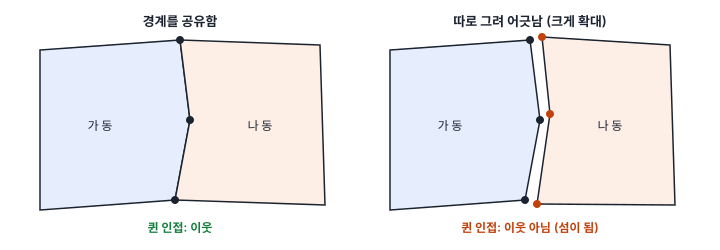
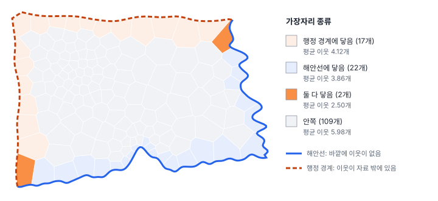
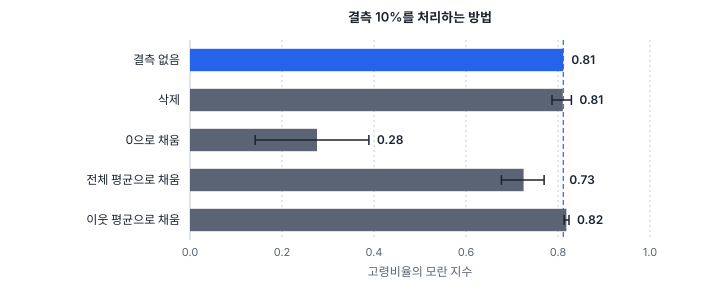

[목차](../README.md) · 이전: [3강 척도와 단위의 문제](03-scale-and-units.md) · 다음: 5강 지도로 탐색하기 (집필 예정)

# 4강 공간 자료 준비

> 앱 지원: ● 앱에서 따라 할 수 있음 (속성 결합과 경계 보정은 다른 도구가 필요함) · 읽는 시간 약 30분

## 이 강에서 얻는 것

- 속성 결합과 공간 결합에서 자주 생기는 오류(코드 형식, 경계 위의 점, 지오코딩 정밀도)를 알고 결합 결과를 점검할 수 있음
- 경계를 따로 그려 생긴 틈과 겹침, 섬, 연구 지역 가장자리가 이웃 관계를 어떻게 바꾸는지 설명할 수 있음
- 결측값과 비공개 값을 어떻게 처리하느냐에 따라 공간 분석 결과가 달라진다는 것을 알고, 분석 전에 자료를 점검할 수 있음

## 들어가는 질문

한빛시 행정동 경계 파일을 받은 연구자 E는 공간가중치(퀸 인접)를 만들다가 이상한 결과를 봤음. "이웃 없는 피처 150개". 모든 동이 섬이라는 뜻임. 지도에서는 행정동들이 빈틈없이 맞붙어 있는데 왜 이웃이 하나도 없는가?

같은 팀의 F는 다른 기관에서 받은 동별 소득 자료를 경계 파일에 붙였더니 150개 가운데 131개만 붙었음. 붙지 않은 19개 동의 소득을 0으로 채워 분석했더니 공간 자기상관이 크게 약해졌음.

두 사람 모두 분석 방법은 맞게 골랐음. 문제는 분석에 들어가기 전의 자료였음. 공간 분석에서 시간이 가장 많이 드는 곳은 대개 분석이 아니라 준비이며, 이 단계의 실수는 뒤의 모든 결과로 조용히 번짐. 이 강은 공간 자료를 분석할 수 있는 상태로 만드는 과정과 그 과정의 함정을 다룸.

## 1. 속성 결합: 열쇠가 맞아야 붙음

통계 자료는 대개 경계 파일과 따로 옴. 행정동별 인구표, 소득표, 병원 수 표를 경계 파일에 붙이는 작업을 **속성 결합**(attribute join)이라 하고, 두 표를 이어 주는 공통 열을 **키**(key)라 함. 한빛시에서는 `동코드`가 키임.

결합이 조용히 실패하는 흔한 이유는 다음과 같음.

- **코드 형식이 다름**: 한쪽은 문자 `'04524'`, 다른 쪽은 숫자 `4524`임. 엑셀이 앞자리 0을 지우는 일이 흔함. 우편번호처럼 0으로 시작하는 코드나 긴 코드에서 일부만 떼어 쓴 코드는 반드시 문자로 다룸
- **코드 체계가 다름**: 같은 동이라도 기관마다 쓰는 코드가 다를 수 있음. 예를 들어 행정안전부의 행정동 코드와 통계청(SGIS)의 행정구역 코드는 체계가 다름. 또 행정동과 법정동은 경계가 같을 때도 있지만, 한 행정동이 여러 법정동을 포함하거나 한 법정동이 여러 행정동으로 나뉘는 경우가 많음. 주민등록 인구 같은 통계는 주로 행정동으로, 지적·부동산 자료는 법정동으로 나옴
- **시점이 다름**: 행정동은 나뉘고(분동) 합쳐지므로(합동, 3강) 2020년 경계에 2025년 통계를 붙이면 새로 생긴 동은 붙지 않고 없어진 동은 비어 있음. 코드가 모두 붙었더라도 경계 조정으로 같은 코드의 범위가 달라졌을 수 있으므로, 경계와 통계의 기준 시점을 함께 확인함
- **이름으로 붙임**: `가람1동`과 `가람제1동`, `가람 1동`은 사람 눈에는 같지만 컴퓨터에는 다른 값임. 이름은 키로 쓰지 않음

규칙은 두 가지임. **코드로 붙이고, 붙인 뒤에는 붙지 않은 행을 셈.** 150개 가운데 131개가 붙었다면 나머지 19개가 왜 안 붙었는지 확인하기 전에는 분석하지 않음. 들어가는 질문의 F가 한 것처럼 붙지 않은 칸을 0으로 채우면, 5절에서 보듯 결과가 크게 틀어짐.

GeoStat에는 아직 표를 키로 붙이는 기능이 없으므로, 속성 결합은 스프레드시트, QGIS, Python(pandas) 같은 도구에서 한 뒤 결과 파일을 열어 씀.

## 2. 공간 결합: 위치로 붙임

**공간 결합**(spatial join)은 키 대신 위치로 붙임. 1강의 점 집계가 대표적임. 출동 지점이 어느 행정동 안에 있는지 따져 동마다 개수를 셈. 공간 결합에는 키 결합에 없는 함정이 있음.

- **경계 위의 점**: 점이 두 동의 경계선 위에 정확히 놓이면 어느 동에 넣을지는 도구의 판정 규칙에 따라 다름. '만남'(intersects)으로 판정하면 두 동 모두에 세어지고, '안에 있음'(within)으로 판정하면 어느 동에도 세어지지 않음. GeoStat의 점 집계는 이런 점을 번호가 앞선 동 하나에만 넣음. 다른 도구는 규칙이 다를 수 있으므로, 점 수의 합계가 원래 점 수와 같은지 확인함
- **연구 지역 밖의 점**: 좌표가 틀렸거나 바다 위에 찍힌 점은 어느 동에도 들어가지 않음. GeoStat은 몇 개를 세지 않았는지 알려 줌. 그 점들이 왜 밖에 있는지 확인함
- **지오코딩 정밀도**: 주소를 좌표로 바꾸는 작업(지오코딩)이 건물까지 찾지 못하면 동이나 도로의 대표 지점으로 대신 찍는 경우가 있음. 그러면 같은 좌표에 점이 수십 개 쌓여 가짜 군집이 생김. 점 자료를 받으면 **완전히 같은 좌표가 몇 개인지** 세어 봄
- **면과 면의 결합**: 한 구역이 다른 구역 여러 개에 걸칠 때, 가장 많이 겹치는 쪽에 통째로 붙이느냐 겹친 면적 비율로 나누느냐에 따라 값이 달라짐. 외연량과 내포량의 규칙(1강)을 따름

## 3. 지오메트리 품질: 이웃은 꼭짓점으로 정해짐

공간통계의 많은 방법은 "누가 이웃인가"에서 출발함(10강). 면 자료에서 가장 흔한 이웃 정의는 경계를 공유하면 이웃으로 치는 **인접**임. 퀸 인접은 꼭짓점 하나만 공유해도, 룩 인접은 변을 공유해야 이웃으로 침. 문제는 대부분의 도구(PySAL, GeoDa, GeoStat)가 "경계를 공유한다"를 **두 폴리곤에 똑같은 좌표의 꼭짓점이 있다**로 판단한다는 것임.

한빛시 행정동 150개는 서로 경계를 정확히 공유하므로 퀸 인접으로 연결 406개가 나옴. 동 하나당 평균 이웃은 5.41개이고, 이웃이 없는 동(섬)은 없음. 그런데 각 동의 꼭짓점을 동마다 따로 **x·y 각각 0.5 m 안에서만** 흔들어 보면(경계를 동마다 따로 그린 상황), 지도에서는 전혀 차이가 보이지 않는데도 퀸 인접 연결이 **0개**, 섬이 **150개**가 됨. 들어가는 질문의 E가 겪은 일임.

이런 어긋남은 다음과 같은 경우에 생김.

- 구역마다 따로 그리거나, 서로 다른 출처의 경계를 이어 붙임
- 구역마다 서로 다른 좌표계 변환이나 저장 정밀도를 거친 파일을 합침. 한 레이어 전체를 한꺼번에 변환하면 공유한 꼭짓점은 똑같이 바뀌므로 문제가 없음
- 파일 크기를 줄이려고 폴리곤마다 따로 **단순화**(꼭짓점 줄이기)함. 한빛시 행정동을 동마다 따로 100 m 기준으로 단순화하면 406개 연결 가운데 10개가 끊어짐. 실제 행정 경계처럼 꼭짓점이 많고 구불구불한 경계일수록 더 많이 끊어짐

대응 방법은 세 가지임.

1. **경계를 고침**: GIS 도구의 위상 점검·스냅 기능으로 가까운 꼭짓점을 하나로 맞추고 틈과 겹침을 없앰. 단순화가 필요하면 이웃한 경계를 함께 단순화하는 **위상 보존 단순화** 도구를 씀
2. **허용 오차를 두고 이웃을 판단함**: 경계 사이가 정해진 거리 안이면 이웃으로 치는 방법임. PySAL의 `fuzzy_contiguity`는 각 구역을 조금씩 넓혀(버퍼) 서로 겹치면 이웃으로 침. 한빛시의 어긋난 파일에서 동마다 0.5 m씩 넓히면(경계 사이 1 m 안이면 이웃) 원래 연결 406개가 그대로 돌아옴. 허용 오차를 너무 크게 주면 실제로는 떨어진 구역까지 이웃이 되므로, 어긋남의 크기에 맞춰 작게 줌. GeoDa도 공간가중치를 만들 때 정밀도 임계값(precision threshold)을 줄 수 있음
3. **인접 대신 거리로 이웃을 정함**: k-최근접 이웃(KNN)이나 거리 기준 가중치는 경계의 어긋남에 영향을 받지 않음. 다만 뜻이 다른 이웃 정의임. 한빛시에서 KNN(k=5)의 이웃 750개 가운데 원래 퀸 이웃과 같은 것은 92%임

어느 쪽이든, 인접 가중치를 만든 뒤에는 **평균 이웃 수와 섬의 개수를 반드시 확인함.** 행정동처럼 빈틈없이 맞붙은 구역에서 섬이 여럿 나오면 자료의 문제를 먼저 의심함.

## 4. 섬과 연구 지역의 가장자리

### 섬

이웃이 없는 구역을 **섬**(island)이라 함. 3절처럼 자료 문제로 생긴 가짜 섬도 있지만, 진짜 섬도 있음. 한국에는 섬으로만 이루어진 읍면이 많음. 섬은 이웃 평균(공간 시차)을 계산할 수 없어서 많은 공간통계 계산에서 문제를 일으킴. 처리 방법은 다음과 같음.

- 가장 가까운 육지 구역이나 뱃길로 이어진 구역을 이웃으로 직접 이어 줌
- 거리나 KNN으로 이웃을 정해 모든 구역이 이웃을 갖게 함
- 분석에서 빼고, 뺀 이유와 개수를 보고함

어느 방법이 맞는지는 현상에 따라 다름. 감염병 전파처럼 사람의 이동이 중요하면 뱃길로 잇는 것이 맞고, 기후처럼 거리가 중요하면 거리 기준이 맞음. 10강에서 자세히 다룸.

### 경계 효과

연구 지역의 가장자리에 있는 구역은 이웃이 적음. 한빛시 행정동의 퀸 인접 이웃 수를 가장자리 종류별로 보면 다음과 같음.

| 가장자리 종류 | 동 수 | 평균 이웃 수 |
|---|---|---|
| 안쪽 | 109 | 5.98 |
| 행정 경계에 닿음 | 17 | 4.12 |
| 해안선에 닿음 | 22 | 3.86 |
| 둘 다 닿음 | 2 | 2.50 |

두 가장자리는 뜻이 다름.

- **해안선** 쪽 동은 바다 쪽에 정말로 이웃이 없음. 이웃이 적은 것이 현실 그대로임
- **행정 경계** 쪽 동은 이웃 시에 실제 이웃이 있는데 자료에 없을 뿐임. 이 동들의 이웃 평균은 도시 안쪽 이웃만으로 계산되므로, 이웃 시가 한빛시와 사정이 다르면 결과가 틀어짐

이렇게 연구 지역을 자르면서 생기는 왜곡을 **경계 효과**(edge effect)라 함. 대응 방법으로는, 연구 지역 바깥의 이웃 구역까지 자료를 모아 **이웃 계산에만 쓰고** 결과는 연구 지역만 보고하는 **완충 구역**(buffer zone)을 두는 방법이 기본임(3절의 버퍼와는 다른 뜻으로, 연구 지역 바깥에 두르는 띠 모양의 구역임). 가장자리 구역의 국지 통계(12강의 LISA 등)는 이웃이 적어 불안정하므로 해석에 주의함. 점 패턴에서는 경계 효과를 보정하는 방법이 따로 발달했으며 16강에서 다룸.

## 5. 결측과 비공개: 빈칸을 무엇으로 채우는가

결합에 실패했거나, 조사가 안 되었거나, 개인정보 보호를 위해 값을 공개하지 않아서 생긴 빈칸을 **결측값**(missing value)이라 함. 공간 자료에서는 빈칸을 처리하는 방법이 이웃 관계까지 바꾸므로 영향이 더 큼.

한빛시 행정동 고령비율의 모란 지수(퀸 인접, 행 표준화)는 0.81로, 이웃끼리 매우 닮았음. 동 15개(10%)의 값을 무작위로 지우고 네 가지 방법으로 처리하는 실험을 300번 반복했음.

| 처리 방법 | 모란 지수 평균 | 90% 범위 |
|---|---|---|
| 결측 없음 | 0.81 (0.812) | |
| 결측인 동을 삭제 | 0.81 | 0.79~0.83 |
| 0으로 채움 | 0.28 | 0.14~0.39 |
| 전체 평균으로 채움 | 0.73 | 0.68~0.77 |
| 이웃 평균으로 채움 | 0.818 | 0.813~0.824 |

- **0으로 채우기**는 최악임. 고령비율이 0인 동은 실제로 있을 수 없는 값이고, 주변과 전혀 다른 값이 끼어들어 공간 구조가 무너짐. 모란 지수가 0.81에서 0.28로 떨어짐. 들어가는 질문의 F가 한 실수임
- **전체 평균으로 채우기**는 주변과 상관없는 값을 넣으므로 공간 자기상관을 약하게 만듦
- **이웃 평균으로 채우기**는 그럴듯해 보이지만, 채운 값이 이웃과 닮을 수밖에 없어 공간 자기상관을 부풀림. 300번 가운데 95% 이상에서 결측 없는 값(0.812)보다 컸음. 결측이 한곳에 몰려 있으면 채운 값끼리 이웃이 되어 더 부풀릴 수 있음
- **삭제**는 결측이 적고 무작위일 때는 평균적으로 괜찮았음. 하지만 삭제한 동과 맞닿은 동들은 그만큼 이웃을 잃고, 한빛시 실험에서도 2%의 경우에는 섬이 생겼음

위 실험은 결측이 어느 동에 생길지 완전히 무작위인 경우임. 루빈(Rubin, 1976)의 분류로는 **완전 무작위 결측**(MCAR)임. 현실은 대개 그렇지 않음.

- **무작위 결측**(MAR): 결측 여부가 관측된 다른 변수로 설명됨. 예를 들어 가구 수가 적은 동의 소득을 비공개하면, 결측 여부는 (관측된) 가구 수에 달림
- **비무작위 결측**(MNAR): 결측 여부가 빠진 값 자체에 달림. 예를 들어 작은 값일수록 가려지면, 가려졌다는 사실이 곧 값이 작다는 정보임

통계를 공개할 때 개인을 알아볼 수 없도록 작은 값을 가리는 경우가 많은데, 그러면 인구가 적은 외곽 구역에 결측이 몰림. MAR이든 MNAR이든 이런 결측을 그냥 삭제하면 외곽이 통째로 빠져 결과가 도심 쪽으로 치우침. 결측이 어디에 몰려 있는지 지도로 먼저 봄. 작은 수를 가리는 문제는 14강에서 다시 다룸.

정답은 하나가 아님. 원자료를 다시 구할 수 있는지 먼저 확인하고, 안 되면 여러 방법으로 처리해 결과가 얼마나 달라지는지(3강의 민감도 분석) 보고함. 결측을 채울 때는 채운 값이라는 표시 열을 따로 남김.

## 6. 분석 전 점검 목록

| 점검할 것 | 확인 방법 | 문제가 있으면 |
|---|---|---|
| 좌표계 | 정보 칸의 EPSG, 다른 레이어와 겹치는지 | 지정 또는 변환 (2강) |
| 개수 | 행 수가 기대한 수와 같은지 (150개 동, 1,408건) | 누락·중복 원인 확인 |
| 키와 결합 | 붙지 않은 행의 수 | 코드 형식·체계·시점 확인 |
| 중복 | 같은 키, 같은 좌표가 여러 번 나오는지 | 지오코딩 정밀도, 중복 입력 확인 |
| 지오메트리 | 인접 가중치의 평균 이웃 수와 섬의 수 | 스냅·위상 정리, 허용 오차 인접 |
| 범위 밖 | 연구 지역 밖의 점, 비정상 좌표 (0, 0 등) | 원인 확인 후 수정 또는 제외 |
| 결측 | 결측 개수와 위치를 지도로 | 원자료 확보, 민감도 분석 |
| 단위와 분모 | 외연량·내포량, 비율의 분모 (1강, 3강) | 알맞은 단위로 바꿈 |
| 시점 | 경계와 통계의 기준 시점 | 같은 시점의 경계로 맞춤 |

이 점검은 분석 결과를 보기 **전에** 함. 결과를 보고 나서 이상한 부분만 고치면, 원하는 결과가 나올 때까지 자료를 손보는 셈이 되기 때문임.

## 해 보기: GeoStat에서 이웃 관계 점검하기

1. `hanbit_dong.gpkg`를 열고 **공간 분석 → 공간가중치 만들기…** 메뉴를 엶. 유형은 **퀸 인접 (Queen)**, 나머지는 기본값으로 두고 **만들기**를 누름
   - 확인: 왼쪽 **공간가중치** 칸에 이웃 수 "평균 5.41 · 최소 2 · 최대 8"이 나오고, 섬 항목은 나타나지 않음(섬이 없음). 이웃 수 막대그래프(연결성 히스토그램)에서 이웃이 6개인 동(54개)과 5개인 동(43개)이 가장 많음
2. 이번 강에서 추가된 `hanbit_boundary.gpkg`(해안선과 행정 경계)를 열어 연구 지역의 가장자리를 확인함
3. 레이어 목록에서 `hanbit_dong`을 다시 고름(파일을 새로 열면 그 레이어가 선택되므로). 속성 테이블에서 `가람1동`(HB001) 행을 눌러 선택하고, 공간가중치 칸의 **이웃 선택** 단추를 누름. 선택이 이웃까지 넓어짐
   - 확인: 가람1동은 북서쪽 모서리에서 행정 경계에 닿은 동이라 이웃이 3개(가람2동, 가람3동, 가람10동)뿐임. 안쪽의 `가람4동`(HB004)으로 같은 일을 하면 이웃이 6개임
4. 연습용 파일 `book/data/practice/hanbit_dong_digitized.gpkg`를 엶. 행정동 꼭짓점을 동마다 따로 x·y 각각 0.5 m 안에서 흔든 파일임. 지도에서 원래 레이어와 겹쳐 보면 차이가 보이지 않음
5. 이 레이어에 퀸 인접 가중치를 만듦
   - 확인: "이웃 없는 피처 150개"라는 경고가 나오고, 공간가중치 칸에 섬 150개가 표시됨. 옆의 **선택**을 누르면 섬인 동이 모두 선택됨
6. 같은 레이어에 유형 **k-최근접 이웃 (KNN)** 을 고르고 **이웃 수 k**를 5로 바꿔 가중치를 만들어 봄. 섬이 사라짐. 다만 인접과는 다른 이웃 정의라는 점을 기억함. 경계 자체를 고치려면 QGIS 같은 GIS 도구의 스냅 기능이나 PySAL의 `fuzzy_contiguity`를 씀

## 헷갈리는 쌍

- **속성 결합 vs 공간 결합**: 속성 결합은 코드 같은 키로, 공간 결합은 위치 관계(안에 있음, 겹침, 가장 가까움)로 붙임
- **행정동 vs 법정동**: 행정동은 행정 서비스와 인구 통계의 단위, 법정동은 법으로 정한 지적·주소의 단위임. 경계가 같은 곳도 있지만 1:1로 맞지 않는 곳이 많고 코드도 다르므로 섞지 않음
- **진짜 섬 vs 가짜 섬**: 진짜 섬은 실제로 이웃이 없는 구역(도서 지역)이고, 가짜 섬은 경계의 틈이나 결측 때문에 이웃을 잃은 구역임
- **해안선 가장자리 vs 행정 경계 가장자리**: 해안 쪽은 이웃이 실제로 없고, 행정 경계 쪽은 이웃이 자료 밖에 있을 뿐임. 경계 효과가 문제가 되는 것은 주로 후자임
- **결측 vs 0**: 결측은 값을 모르는 것이고 0은 값이 0인 것임. 둘을 바꿔 쓰면 결과가 크게 틀어짐

## 흔한 실수와 심사 지적

- **결합되지 않은 행을 확인하지 않음**
  - 결과: 일부 구역이 조용히 빠지거나 0으로 채워짐
  - 대응: 결합 전후 행 수와 결합되지 않은 행의 목록을 확인하고 보고함
- **인접 가중치에서 섬이 여럿 나왔는데 그대로 분석함**
  - 지적: "이웃이 없는 구역을 어떻게 처리했습니까?"
  - 대응: 가짜 섬이면 경계를 고치고, 진짜 섬이면 처리 방법(연결, 거리 기준, 제외)을 밝힘
- **결측값을 0이나 평균으로 채우고 밝히지 않음**
  - 지적: "결측값 처리 방법과 그에 따른 민감도를 제시하십시오."
  - 대응: 결측의 개수와 위치, 처리 방법을 적고, 다른 방법으로도 결론이 유지되는지 보임
- **연구 지역 가장자리의 경계 효과를 고려하지 않음**
  - 대응: 가능하면 바깥 구역을 완충 구역으로 넣어 이웃 계산에만 쓰고, 가장자리 구역의 결과는 조심해서 해석함
- **지오코딩된 점 자료의 정밀도를 확인하지 않음**
  - 결과: 동 중심점 같은 대표 지점에 점이 쌓여 가짜 군집이 생김
  - 대응: 같은 좌표에 겹친 점의 수를 세고, 지오코딩 수준(건물, 도로, 동)을 확인함

## 보고서에는 이렇게 씀

자료를 준비한 과정은 방법 절이나 부록에 적음. 아래는 논문 문체로 쓴 예시임.

> 행정동 경계(2025년 기준, 150개)에 같은 시점의 주민등록 인구를 행정동 코드로 결합하였으며 결합되지 않은 행정동은 없었다. 퀸 인접 공간가중치의 평균 이웃 수는 5.41개였고 이웃이 없는 행정동은 없었다. 연구 지역 북쪽과 서쪽은 인접 시와 맞닿아 있어 가장자리 행정동의 이웃이 실제보다 적게 반영되었을 수 있다. 소득 자료는 가구 수가 적어 공개되지 않은 행정동 12개(주로 외곽, 부록 그림 A1)를 제외하고 분석하였으며, 이들을 소속 구의 값으로 채운 분석과 이웃 평균으로 채운 분석에서도 결론은 같았다(부록 표 A2).

적어야 할 항목은 다음과 같음.

- 자료의 출처와 기준 시점, 결합에 쓴 키와 결합 결과(결합되지 않은 행의 수)
- 경계 파일에 가한 처리(스냅, 단순화 등)와 이웃 관계 요약(평균 이웃 수, 섬의 수와 처리 방법)
- 결측의 수, 위치, 처리 방법과 민감도 분석
- 연구 지역 가장자리의 처리(완충 구역 여부)

## 요약

- 속성 결합은 이름이 아닌 코드로 하고, 결합 후 붙지 않은 행을 반드시 셈. 코드 형식, 코드 체계, 시점 차이가 흔한 원인임
- 공간 결합에서는 경계 위의 점, 연구 지역 밖의 점, 지오코딩 정밀도 때문에 같은 좌표에 쌓인 점을 확인함
- 인접 가중치는 꼭짓점이 정확히 같아야 이웃으로 인정함. 0.5 m 어긋나도 한빛시 150개 동이 모두 섬이 됨. 가중치를 만든 뒤 평균 이웃 수와 섬의 수를 확인함
- 연구 지역 가장자리의 구역은 이웃이 적음. 해안 쪽은 현실이지만 행정 경계 쪽은 자료가 잘린 결과이므로 완충 구역을 두는 방법을 검토함
- 결측을 0으로 채우면 공간 구조가 무너지고(모란 지수 0.81 → 0.28), 이웃 평균으로 채우면 부풀려짐. 처리 방법을 밝히고 민감도를 보고함

## 핵심 용어

| 한글 | 영문 | 비고 |
|---|---|---|
| 속성 결합 | Attribute Join | 키로 붙임 |
| 공간 결합 | Spatial Join | 위치로 붙임 |
| 키 | Key | 두 표를 잇는 공통 열 |
| 지오코딩 | Geocoding | 주소를 좌표로 바꿈 |
| 행정동 / 법정동 | Administrative Dong / Legal Dong | |
| 인접 | Contiguity | 퀸·룩 인접, 10강 |
| 틈 / 겹침 | Gap / Overlap (Sliver) | 경계가 어긋나 생긴 작은 조각 |
| 위상 | Topology | 경계를 공유하는 관계 |
| 단순화 | Simplification | 꼭짓점 줄이기 |
| 허용 오차 인접 | Fuzzy Contiguity | 구역을 조금 넓혀 겹치면 이웃. PySAL `fuzzy_contiguity` |
| 섬 | Island | 이웃이 없는 구역 |
| 경계 효과 | Edge Effect | |
| 완충 구역 | Buffer Zone | 이웃 계산에만 쓰는 바깥 구역 |
| 결측값 | Missing Value | |
| 완전 무작위 결측 | MCAR (Missing Completely At Random) | 결측이 어떤 값과도 무관 |
| 무작위 결측 | MAR (Missing At Random) | 관측된 다른 변수로 결측이 설명됨 |
| 비무작위 결측 | MNAR (Missing Not At Random) | 빠진 값 자체가 결측을 결정 |
| 대체 | Imputation | 결측을 채우는 것 |

## 원전과 더 읽을거리

**원전**

- Rubin, D. B. (1976). Inference and missing data. *Biometrika*, 63(3), 581–592. 결측이 생긴 과정에 따라 분석이 달라진다는 것을 정리하고 무작위 결측(MAR)을 정의한 고전
- Griffith, D. A. (1983). The boundary value problem in spatial statistical analysis. *Journal of Regional Science*, 23(3), 377–387. 공간통계에서의 경계 효과
- Zandbergen, P. A. (2008). A comparison of address point, parcel and street geocoding techniques. *Computers, Environment and Urban Systems*, 32(3), 214–232. 지오코딩 방식에 따른 위치 오차

**더 읽을거리**

- Little, R. J. A., & Rubin, D. B. (2019). *Statistical Analysis with Missing Data* (3rd ed.). Wiley. MCAR·MAR·MNAR과 대체 방법의 표준 교과서
- Rey, S. J., Arribas-Bel, D., & Wolf, L. J. (2023). *Geographic Data Science with Python*. CRC Press. 4장(Spatial Weights)에서 가중치를 만들 때의 섬과 연결 성분(connected components)을 다룸

## 연습

1. 동별 인구표의 `동코드` 열을 엑셀로 열었다가 저장했더니 경계 파일과 결합되는 행이 크게 줄었음. 가능한 원인 두 가지와 확인 방법을 적으시오.

2. 출동 1,408건을 행정동에 점 집계했더니 동별 개수의 합이 1,411건이었음. 무엇을 의심해야 하는가? 반대로 합이 1,390건이라면?

3. 어느 시군구 경계 파일로 퀸 인접 가중치를 만들었더니 섬이 7개 나왔음. 이 가운데 진짜 섬(도서 지역)과 가짜 섬(경계 문제)을 가려내는 방법을 적으시오.

4. 4절의 표에서 행정 경계에 닿은 동의 평균 이웃 수는 4.12개, 해안선에 닿은 동은 3.86개였음. 이웃이 더 적은 쪽은 해안인데도 경계 효과를 더 걱정해야 하는 쪽은 행정 경계라고 한 이유를 설명하시오.

5. 소득 자료가 개인정보 보호를 위해 가구 수가 적은 동 12개에서 비공개였음. 이 12개 동을 삭제하고 분석하면 어떤 방향으로 결과가 치우칠 수 있는지 추측하고, 결측 처리 방법을 어떻게 보고해야 하는지 적으시오.

해답

1. (1) 코드 앞자리의 0이 지워져 문자 `'0123'`이 숫자 `123`이 되었을 수 있음. 두 표에서 코드의 자릿수와 형식(문자인지 숫자인지)을 비교함. (2) 긴 숫자 코드가 지수 표기로 저장되었거나(예: 13자리 집계구 코드가 `1.10105E+12`로) 15자리를 넘는 코드(예: 19자리 필지 고유번호 PNU)의 끝자리가 0으로 바뀌었을 수 있음. 저장된 파일을 텍스트 편집기로 열어 코드가 원래대로인지 확인함. 코드 열은 처음부터 텍스트로 불러와야 함.

2. 합이 원래보다 많으면 같은 점이 두 동에 함께 세어졌을 가능성이 큼. 경계 위의 점을 두 번 세는 규칙(intersects)의 도구를 썼거나, 행정동 폴리곤이 서로 겹쳐 있을 수 있음. 합이 적으면 18건이 어느 동에도 들어가지 않은 것이므로, 연구 지역 밖에 찍힌 점(좌표 오류, 바다 위의 점), 행정동 사이의 틈에 떨어진 점, 또는 경계 위의 점을 어느 쪽에도 넣지 않는 규칙(within)의 도구를 썼는지 확인함.

3. 섬으로 나온 구역을 지도에서 확인해 실제로 바다로 떨어져 있는지 봄. 육지 구역인데 섬으로 나왔다면 경계 문제임. 확인 방법으로는 (가) 섬 구역과 옆 구역의 경계를 확대해 틈이 있는지 보고, (나) 작은 허용 오차(예: 경계 사이 1 m)를 준 인접으로 다시 계산해 이웃이 생기는지 봄. 작은 허용 오차로 이웃이 생기면 가짜 섬임. 허용 오차를 수 km로 크게 주면 진짜 섬도 이웃이 생기므로 판별에 쓸 수 없음.

4. 해안 쪽 동은 바다 쪽에 이웃이 실제로 없으므로, 이웃이 적은 것이 현실을 그대로 반영함. 행정 경계 쪽 동은 이웃 시에 실제 이웃 구역이 있는데 자료에서 빠진 것이라, 이웃 평균을 계산할 때 현실과 다른 값이 쓰임. 경계 효과는 이웃이 적다는 사실보다 **현실과 다르게 잘렸다**는 데서 생기는 왜곡임. 다만 해안 쪽 동도 이웃이 적어 국지 통계가 불안정한 것은 마찬가지이므로 해석은 조심함.

5. 가구 수가 적은 동은 대개 외곽이나 특수한 지역(산림, 산업단지 등)이므로, 삭제하면 분석이 도심 쪽 동 위주가 되어 외곽의 특성이 결과에서 빠짐. 외곽의 소득 수준이 도심과 다르다면 소득과 다른 변수의 관계가 치우칠 수 있고, 삭제로 이웃 관계가 끊겨 섬이 생길 수도 있음. 보고할 때는 비공개 동의 수와 위치(지도), 비공개 기준, 처리 방법을 적고, 이 결측은 관측된 가구 수에 따라 생긴 무작위 결측(MAR)이지 완전 무작위 결측(MCAR)이 아니므로 삭제가 안전하지 않다는 점을 밝히고, 삭제 외에 다른 처리(예: 상위 단위 값이나 이웃 평균으로 채움)로도 결론이 유지되는지 민감도 분석 결과를 함께 적음.

---

[목차](../README.md) · 이전: [3강 척도와 단위의 문제](03-scale-and-units.md) · 다음: 5강 지도로 탐색하기 (집필 예정)
