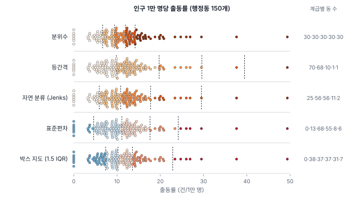
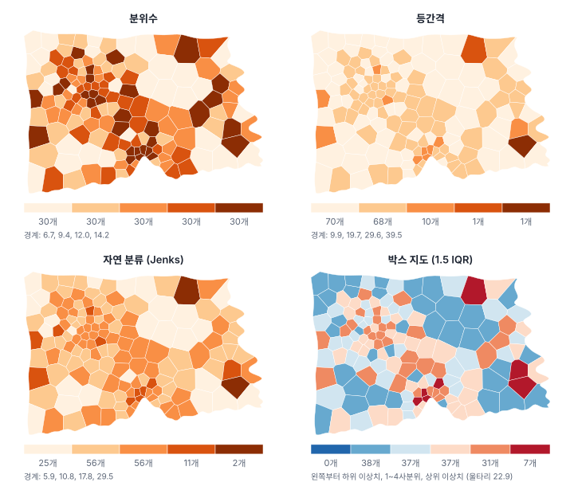
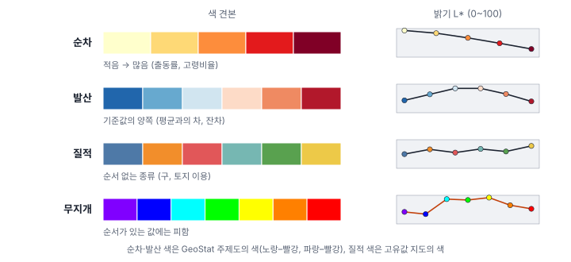
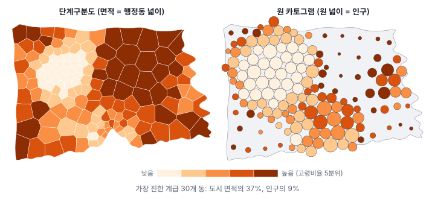
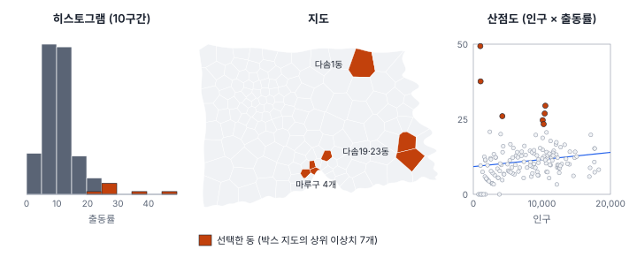

[목차](../README.md) · 이전: [4강 공간 자료 준비](04-preparing-spatial-data.md) · 다음: 6강 요약·분포·추정 (집필 예정)

# 5강 지도로 탐색하기

> 앱 지원: ● 앱에서 따라 할 수 있음 (카토그램은 코드로 그림) · 읽는 시간 약 35분

## 이 강에서 얻는 것

- 단계구분도의 분류 방법(분위수, 등간격, 자연 분류, 표준편차, 박스 지도)이 각각 무엇을 보여 주고 무엇을 숨기는지 설명하고, 자료와 목적에 맞는 방법을 고를 수 있음
- 순차·발산·질적 색 체계를 구분하고, 무지개 색을 피해야 하는 이유를 설명할 수 있음
- 넓은 구역이 지도의 인상을 지배하는 면적 편향을 알고, 카토그램으로 보완할 수 있음
- 지도·히스토그램·산점도를 연동해 자료를 탐색하고, 탐색에서 얻은 인상과 검정을 구분할 수 있음

## 들어가는 질문

한빛시 폭염 대책 회의에 보고서 두 개가 올라왔음. 둘 다 1강에서 만든 행정동별 인구 1만 명당 구급 출동률을 GeoStat으로 칠한 지도를 실었음.

- 보고서 A: "출동률이 가장 높은 계급의 동은 **30개**로, 도심과 외곽 곳곳에 퍼져 있음"
- 보고서 B: "출동률이 가장 높은 계급의 동은 다솜23동 **한 곳**뿐임"

같은 자료, 같은 프로그램, 같은 다섯 계급인데 결론이 이렇게 다름. 둘 중 누가 틀렸는가? 사실 둘 다 틀리지 않았음. 두 사람은 주제도의 **방법** 칸 하나만 다르게 골랐음. A는 분위수, B는 등간격이었음. 지도는 자료를 그대로 비추는 거울이 아니라, 만드는 사람의 선택이 들어간 요약임. 이 강은 그 선택이 무엇이고, 지도를 탐색의 도구로 제대로 쓰려면 무엇을 알아야 하는지 다룸.

## 1. 단계구분도는 값을 계급으로 묶음

구역마다 값을 색으로 칠한 지도를 **단계구분도**(choropleth map)라 함. 1강에서 본 출동률 지도가 단계구분도임. 값이 150개면 색도 150가지로 칠할 수 있지만, 지도의 색을 범례와 맞춰 읽을 수 있는 단계는 대개 5~7개뿐임. 그래서 보통 값을 몇 개의 **계급**(class)으로 묶고 계급마다 한 색을 씀. 계급을 나누지 않고 값에 비례한 연속 색으로 칠하는 방법(Tobler 1973)도 있지만, 이때도 색의 차이를 읽는 것은 결국 눈이므로 문제가 없어지지는 않음.

계급으로 묶는 순간 **경계를 어디에 두느냐**가 지도의 메시지를 정함. 경계 바로 아래와 바로 위의 두 동은 값이 거의 같아도 다른 색이 되고, 한 계급 안의 가장 작은 값과 가장 큰 값은 크게 달라도 같은 색이 됨.

### 손으로 해 보기: 값 9개를 세 계급으로

값 9개 `2, 4, 5, 6, 7, 9, 11, 14, 34`를 세 계급으로 나눠 봄. 하나(34)만 유난히 큼.

| 방법 | 나누는 규칙 | 계급 1 | 계급 2 | 계급 3 | 계급 안 제곱합 | GVF |
|---|---|---|---|---|---|---|
| 분위수 | 계급마다 개수가 같게 | 2, 4, 5 | 6, 7, 9 | 11, 14, 34 | 322.00 | 0.567 |
| 등간격 | 값의 범위를 같은 폭으로 (폭 10.67) | 2 ~ 11 (7개) | 14 | 34 | 55.43 | 0.925 |
| 자연 분류 | 계급 안의 흩어짐이 가장 작게 | 2 ~ 7 (5개) | 9, 11, 14 | 34 | 27.47 | 0.963 |

- **분위수**(quantile)는 값을 크기순으로 세우고 같은 개수씩 끊음. 11과 34가 같은 계급에 들어감. 순위는 잘 보이지만 크기의 차이는 숨음
- **등간격**(equal interval)은 최솟값 2부터 최댓값 34까지를 세 칸으로 똑같이 나눔(폭 32 ÷ 3 = 10.67). 34 하나 때문에 폭이 넓어져, 나머지 8개 가운데 7개가 첫 계급에 몰림
- **자연 분류**(natural breaks)는 같은 계급 안의 값들이 최대한 비슷하도록 경계를 찾음. 경계를 둘 수 있는 자리 8곳 가운데 2곳을 고르는 28가지 경우를 모두 따져, 계급 안 제곱합이 가장 작은 것을 고른 결과임(자료가 많을 때는 모든 경우를 따지지 않고 동적 계획법으로 같은 답을 빠르게 구함). 지도학자 젠크스(Jenks 1967)가 지도에 쓰기 시작해 **젠크스 분류**라고도 하며, 계산 방법은 피셔(Fisher 1958)의 최적 분할과 같음

마지막 열의 **GVF**(분산 적합도, goodness of variance fit)는 계급이 자료의 흩어짐을 얼마나 설명하는지 나타냄.

$$
\text{GVF} = 1 - \frac{\sum_{k}\sum_{i \in k} (x_i - \bar{x}_k)^2}{\sum_{i} (x_i - \bar{x})^2}
$$

분자는 계급 안 제곱합(각 값과 자기 계급 평균의 차를 제곱해 더한 것), 분모는 전체 제곱합(각 값과 전체 평균의 차를 제곱해 더한 것, 이 예에서 743.56)임. 1에 가까울수록 계급 안의 값들이 비슷함. 같은 계급 수라면 자연 분류는 정의상 GVF가 가장 큰 분류임.

### 분포의 모양을 보여 주는 지도: 표준편차 지도와 박스 지도

앞의 세 방법은 계급 수를 사용자가 정함. 이와 달리 통계량으로 경계를 정하고 계급 수가 6개로 고정된 지도도 있음.

- **표준편차 지도**(standard deviation map)는 평균에서 표준편차(σ)의 몇 배 떨어졌는지로 나눔. 경계는 평균 −2σ, −σ, 평균, +σ, +2σ임. 평균을 기준으로 위아래를 나눠 보여 주므로 발산 색(2절)을 씀. 값이 좌우 대칭인 종 모양으로 퍼져 있을 때 잘 맞음
- **박스 지도**(box map)는 상자 그림(box plot, GeoStat 차트의 박스플롯)을 지도로 옮긴 것임(Anselin 1994, 1999). 사분위수 Q1, 중앙값, Q3로 네 계급을 나누고, 상자 그림과 같은 **울타리** 밖의 값을 이상치 계급으로 따로 뺌

$$
\text{아래 울타리} = Q_1 - 1.5 \times \text{IQR}, \qquad \text{위 울타리} = Q_3 + 1.5 \times \text{IQR}, \qquad \text{IQR} = Q_3 - Q_1
$$

박스 지도는 평균과 표준편차 대신 순위에 바탕을 둔 사분위수를 쓰므로, 극단값 몇 개가 경계를 끌고 가지 않음. 공간 탐색에서 "유난히 높은 곳이 어디인가"를 보는 데 알맞아 GeoDa가 대표 지도로 제공하면서 널리 퍼졌음.

### 한빛시 출동률에 적용하기

한빛시 행정동 150개의 출동률은 평균 11.12, 중앙값 10.22이고, 0부터 49.36까지 퍼져 있음. 왜도가 2.01로 오른쪽 꼬리가 긴 분포임. 대부분의 동은 5~15 사이에 있고, 몇 개 동만 멀리 떨어져 있음. 같은 자료를 다섯 방법으로 나눠 보면 다음과 같음.

| 방법 | 계급별 동 수 | 가장 높은 계급 | GVF |
|---|---|---|---|
| 분위수 (5계급) | 30 · 30 · 30 · 30 · 30 | 14.18 초과, 동 30개 | 0.694 |
| 등간격 (5계급) | 70 · 68 · 10 · 1 · 1 | 39.49 초과, 다솜23동 1개 | 0.851 |
| 자연 분류 (5계급) | 25 · 56 · 56 · 11 · 2 | 29.51 초과, 다솜1동·다솜23동 2개 | 0.908 |
| 표준편차 | 0 · 13 · 68 · 55 · 8 · 6 | +2σ(24.15) 초과, 동 6개 | |
| 박스 지도 | 0 · 38 · 37 · 37 · 31 · 7 | 위 울타리(22.87) 초과, 동 7개 | |

들어가는 질문의 두 보고서가 여기서 설명됨. 보고서 A의 분위수 지도는 가장 진한 계급에 30개 동을 넣었고, 보고서 B의 등간격 지도는 다솜23동 하나만 넣었음. 표에서 더 읽을 것이 있음.

- **등간격**은 한쪽으로 치우친 자료에 약함. 최댓값 49.36 하나가 폭을 정해, 150개 동 가운데 138개가 아래 두 계급에 몰림. 지도 대부분이 옅은 두 색뿐이라 도시 안의 차이가 거의 보이지 않음. 0강 해 보기에서 등간격 지도의 인상이 밋밋했던 이유임
- **자연 분류**는 GVF가 가장 높지만, 가장 진한 계급은 인구가 각각 1천 명 남짓한 두 동(다솜1동 1,063명·4건, 다솜23동 1,013명·5건)임. GVF가 높다는 것은 값을 잘 요약했다는 뜻이지, 지도가 전하려는 내용에 맞는다는 뜻이 아님. 또 경계가 자료의 뭉침에 따라 정해지므로, 자연 분류 지도끼리는 같은 계급이라도 뜻이 다름
- **분위수**는 색이 고르게 퍼져 공간 패턴이 가장 잘 보임. 하지만 14.18과 49.36이 같은 색이라 크기의 차이는 숨음. 값이 몰려 있는 곳에서는 거의 같은 값이 다른 계급으로 갈라지기도 함(3분위와 4분위의 경계 11.95 근처)
- **표준편차 지도**는 평균 −2σ가 −1.91로 음수라서 가장 낮은 계급이 비어 있음. 출동률은 음수가 될 수 없으므로 아래쪽 꼬리는 처음부터 없음. 치우친 분포에서는 평균과 σ가 극단값에 끌려가므로 해석이 어색해짐
- **박스 지도**는 Q1 7.37, 중앙값 10.22, Q3 13.57로 네 계급을 나누고, 위 울타리 13.57 + 1.5 × 6.20 = 22.87을 넘는 동 7개를 상위 이상치로 표시함. 아래 울타리는 −1.93이라 하위 이상치는 없음. 네 번째 계급(Q3~울타리)이 31개인 것은 원래 38개 가운데 7개가 이상치로 빠졌기 때문임

### 어느 방법을 쓸까

정답은 없지만, 목적에 따라 고르는 기준은 있음.

| 방법 | 알맞은 경우 | 조심할 점 |
|---|---|---|
| 분위수 | 순위와 공간 패턴을 보고 싶을 때. 여러 지도를 "상위 20%" 같은 순위로 비교할 때 | 크기의 차이가 숨음. 같은 값이 많으면 계급 수가 줄어듦 |
| 등간격 | 값이 고르게 퍼져 있고, 눈금 자체에 뜻이 있을 때 (예: 기온 2℃ 간격) | 치우친 자료에서는 대부분이 한두 계급에 몰림 |
| 자연 분류 | 지도 한 장으로 자료의 무리를 보여 줄 때 | 계급의 뜻이 지도마다 다름. 극단값 몇 개를 따로 떼어 내기 쉬움 |
| 표준편차 | 평균과의 차가 관심이고 분포가 대칭일 때 | 치우친 분포에서는 빈 계급과 어색한 경계가 생김 |
| 박스 지도 | 유난히 높거나 낮은 구역(이상치)을 찾을 때. 탐색의 첫 지도 | 이상치가 곧 "문제 지역"은 아님 (3절, 4절) |

역학 자료의 지도 여러 장을 읽는 실험에서는 분위수와 최소 경계 오차 방법이 가장 정확하게 읽혔고, 자연 분류는 분위수의 70%에도 못 미쳤음. 또 지도 여러 장에 같은 범례를 쓰면 비교 정확도가 약 28% 높아졌음(Brewer & Pickle 2002). 이 실험은 일반적인 지도 읽기를 잰 것이고 이상치 찾기를 잰 것은 아님. 값 자체를 지도끼리 비교하려면 어느 방법이든 모든 지도에 같은 경계를 씀. 탐색의 첫 단계에서는 **분위수 지도와 박스 지도를 함께 보고**, 어떤 방법을 쓰든 보고서에는 방법과 계급 경계를 밝히는 것이 좋음.

## 2. 색: 순서가 있는 값에는 밝기로

색은 계급의 순서를 전하는 수단임. 사람은 색상(빨강, 초록 같은 색의 종류)보다 **밝기**의 차이로 순서를 읽음. 그래서 색 체계는 자료의 성격에 맞춰 세 가지로 나눔(Harrower & Brewer 2003).

- **순차**(sequential): 적은 값은 밝게, 많은 값은 어둡게 칠함. 출동률, 고령비율처럼 한 방향으로 커지는 값에 씀. 그림의 순차 색은 밝기(L*)가 99 → 88 → 70 → 48 → 26으로 한 방향으로만 변함
- **발산**(diverging): 가운데 기준값을 밝게 두고 양쪽으로 서로 다른 색상이 점점 어두워짐. 평균과의 차, 증감률, 회귀 잔차처럼 기준값의 위아래가 모두 의미 있는 값에 씀. 표준편차 지도와 박스 지도가 발산 색을 쓰는 이유임
- **질적**(qualitative): 밝기에 한 방향의 순서가 없는 서로 다른 색상을 씀. 구 이름, 토지 이용처럼 순서가 없는 범주에 씀

흔히 보는 **무지개 색**은 순서가 있는 값에 쓰지 않음. 그림에서 보듯 무지개 색의 밝기는 41 → 32 → 91 → 88 → 97 → 67 → 53으로 오르내려, 노랑(가장 밝음)이 가장 튀어 보이고 파랑과 빨강 가운데 어느 쪽이 큰 값인지 색만으로는 알 수 없음. 색이 바뀌는 자리에 없는 경계가 생겨 보이기도 함(Crameri et al. 2020). 또 남성의 5~8%(인구 집단에 따라 다름)는 적록 색각 이상이 있으므로, 빨강과 초록을 양 끝에 둔 발산 색도 피함.

GeoStat은 방법에 따라 색 체계를 자동으로 고름. 분위수·등간격·자연 분류에는 노랑–빨강 순차 색을, 표준편차·백분위·박스 지도에는 파랑–빨강 발산 색을, 고유값 지도에는 질적 색을 씀. 값이 없는 구역은 회색의 **값 없음** 계급으로 따로 칠함. 이 책의 그림은 흑백 인쇄에서도 순서가 보이도록 주황 계열 순차 색을 썼음.

## 3. 면적 편향: 넓은 구역이 눈을 지배함

단계구분도에서 한 구역이 차지하는 잉크의 양은 값이 아니라 **구역의 넓이**로 정해짐. 한빛시 행정동의 넓이는 0.61㎢에서 8.60㎢까지 14배 차이가 남. 넓이가 작은 절반(75개 동)에 인구의 71.4%가 살지만, 이 동들은 지도 면적의 23.7%만 차지함. 사람이 많이 사는 곳일수록 지도에서 작게 보이는 셈임.

고령비율(고령인구 ÷ 인구 × 100)을 분위수 5계급으로 칠해 보면 이 편향이 뚜렷함.

| 고령비율 계급 | 동 수 | 지도 면적 | 인구 | 고령인구 |
|---|---|---|---|---|
| 1분위 (11.99 ~ 16.84%) | 30 | 7.6% | 29.4% | 20.6% |
| 2분위 (16.84 ~ 20.63%) | 30 | 13.4% | 25.4% | 23.3% |
| 3분위 (20.63 ~ 24.70%) | 30 | 17.4% | 20.0% | 22.3% |
| 4분위 (24.70 ~ 27.51%) | 30 | 24.3% | 16.3% | 20.6% |
| 5분위 (27.51 ~ 35.87%) | 30 | 37.4% | 9.0% | 13.2% |

가장 진한 5분위 동 30개는 지도 면적의 37.4%를 칠하지만, 사는 사람은 9.0%, 노인은 13.2%뿐임. 고령비율이 높은 동은 대개 넓고 인구가 적은 외곽 동이기 때문임(고령비율과 동 면적의 상관계수 0.77). 지도만 보면 "도시의 3분의 1이 고령화가 심각한 지역"처럼 보이지만, 노인이 가장 많이 사는 곳은 오히려 고령비율이 낮은 도심임. 1분위 동에 사는 노인(20.6%)이 5분위 동에 사는 노인(13.2%)보다 많음. 노인 복지 시설을 어디에 둘지 정하는 회의에서 이 지도만 본다면 결론이 틀어질 수 있음.

### 카토그램

**카토그램**(cartogram)은 구역의 크기를 넓이 대신 인구 같은 다른 양에 비례하게 바꾼 지도임. 위치 관계를 어느 정도 지키면서 모양을 늘리고 줄이는 연속 카토그램(Gastner & Newman 2004)과, 구역을 크기가 다른 원으로 바꾸는 **원 카토그램**(Dorling cartogram, Dorling 1996)이 대표적임.

원 카토그램에서는 원의 넓이가 인구에 비례하므로, 진한 색이 차지하는 잉크의 양이 곧 그 계급에 사는 사람의 비율임. 왼쪽 지도에서 도시의 동쪽과 가장자리를 덮던 진한 색이 오른쪽에서는 작은 원 여럿으로 줄어듦. 두 지도는 서로 다른 질문에 답함. 단계구분도는 "어느 땅이 그런가", 카토그램은 "몇 사람이 그런 곳에 사는가"에 답함. 사람에 관한 자료라면 두 지도를 함께 보는 것이 좋음. GeoStat에는 아직 카토그램 기능이 없어 이 그림은 코드로 그렸음(`book/fig-src/05.py`).

### 작은 인구의 극단값

면적 편향과 짝을 이루는 문제가 하나 더 있음. 1절의 등간격 지도에서 가장 진한 계급을 혼자 차지한 다솜23동은 인구가 1,013명임. 출동이 5건이라 출동률이 49.36이 되었는데, 출동이 1건만 적었어도 39.49, 1건 많았으면 59.23임. 출동 1건은 인구 1만 명인 동에서는 출동률을 1만큼, 1천 명인 동에서는 10만큼 바꿈. 인구가 적은 구역은 우연만으로 비율이 극단으로 튀기 쉽고, 이런 구역은 대개 넓은 외곽이라 지도에서 눈에 잘 띔. 출동이 한 건도 없어 출동률이 0인 동도 7개인데, 이 동들의 평균 인구는 1,608명임. 이 문제를 다루는 비율 평활(GeoStat의 **공간 분석 → 비율 지도 · EB 보정…** 메뉴)은 14강에서 다룸.

## 4. 탐색적 공간 자료 분석과 연동 시각화

통계학자 튜키(Tukey 1977)는 가설을 검정하기 전에 자료를 여러 방식으로 그려 보며 구조와 이상한 점을 찾는 단계를 **탐색적 자료 분석**(EDA, exploratory data analysis)이라 불렀음. 공간 자료에서는 여기에 "그 값이 **어디에** 있는가"가 더해지며, 이를 **탐색적 공간 자료 분석**(ESDA, exploratory spatial data analysis)이라 함(Anselin 1994 등).

ESDA의 핵심 도구는 **연동 시각화**(linked views)임. 지도, 히스토그램, 산점도, 속성 테이블을 같은 자료로 띄워 두고, 한 곳에서 고른 구역을 모든 창에 함께 표시함. 한 창에서 고르는 것을 **브러싱**(brushing)이라 함. 산점도끼리 연동하는 브러싱(Becker & Cleveland 1987)이 먼저 나왔고, 지도와 산점도를 잇는 지리적 브러싱(Monmonier 1989)을 거쳐 GeoDa 같은 도구로 널리 쓰이게 되었음(Anselin, Syabri & Kho 2006). GeoStat도 지도, 속성 테이블, 범례, 차트의 선택이 모두 이어져 있음.

박스 지도의 상위 이상치 7개를 골라 세 창에서 함께 보면 창마다 다른 것이 보임.

- **히스토그램**은 "얼마나 유난한가"를 보여 줌. 7개는 오른쪽 꼬리에 있고, 그 가운데 두 개는 나머지와 멀리 떨어져 있음
- **지도**는 "어디에 있는가"를 보여 줌. 마루구의 4개 동은 원도심에 모여 있고(3개는 서로 맞닿아 있고 1개는 가까이 있음), 다솜구의 3개 가운데 2개(다솜19동·다솜23동)는 동쪽에 붙어 있으며 다솜1동은 북쪽에 홀로 떨어져 있음
- **산점도**(인구 × 출동률)는 "왜 그럴 수 있는가"의 단서를 줌. 마루구의 4개는 인구가 1만 명 남짓한 동에서 출동이 24~31건씩 나왔음. 반면 다솜1동과 다솜23동은 인구가 1천 명 남짓해 출동 4~5건만으로 높은 비율이 되었음. 다솜19동은 인구 4,228명에 11건으로 그 중간임

마루구 4개와 다솜19·23동처럼 이웃한 동들이 함께 높은 것과, 다솜1동처럼 인구가 적은 동 하나가 홀로 높은 것은 무게가 다른 증거임. 앞의 것은 여러 동에서 되풀이된 신호이고, 뒤의 것은 몇 건의 우연으로도 생길 수 있음. 다만 뒤의 것이 우연이라고 단정할 수도 없고, 다솜23동처럼 인구가 적으면서 이웃과 함께 높은 경우도 있음. 이 차이를 수로 따지는 것이 뒤의 강들의 몫임. 이웃끼리 닮았는지는 11~12강에서, 작은 수의 비율은 14강에서, "여기 몰려 있다"는 주장의 검정은 15강에서 다룸.

탐색에는 규칙이 하나 있음. **탐색에서 찾은 패턴을 같은 자료로 다시 검정하면 안 됨.** 지도를 여러 장 그려 보다가 가장 두드러진 곳을 골라 "여기가 유의하게 높은가"를 같은 자료로 검정하면, 우연히 높은 곳을 고른 과정이 검정에 반영되지 않아 유의하게 나오기 쉬움(많이 들여다볼수록 더 그럼)(7강의 다중검정, 15강의 사후 가설). 탐색은 가설을 **만드는** 단계이고, 가설을 **확인하는** 것은 미리 정한 방법이나 새 자료로 함.

## 해 보기: GeoStat에서 분류를 바꾸고 연동해 보기

1. 1강의 해 보기처럼 `hanbit_dong.gpkg`와 `hanbit_events.gpkg`를 열고, 레이어 목록에서 `hanbit_dong`을 고름(점 집계는 선택한 레이어에 결과를 붙임). **공간 분석 → 점 집계 (점 → 폴리곤)…** 메뉴로 동별 출동 건수 `PT_CNT`를 만든 뒤, **공간 분석 → 계산 필드 추가…** 메뉴로 `출동률` = `` `PT_CNT` / `인구` * 10000 ``을 만듦
2. 왼쪽 **주제도**에서 변수 `출동률`, 방법 **분위수**, 계급 수 5로 **적용**을 누름
   - 확인: 범례의 다섯 계급이 모두 30개이고, 가장 높은 계급의 라벨이 "14.18 – 49.36"임
3. 방법을 **등간격**으로 바꿔 적용하고, 이어서 **자연 분류 (Jenks)** 방법으로도 적용함
   - 확인: 등간격은 70·68·10·1·1개, 자연 분류는 25·56·56·11·2개임. 가장 진한 계급이 어느 동인지 지도에서 찾아봄
4. 방법을 **표준편차**로 바꿔 적용함
   - 확인: 계급이 6개로 바뀌고(계급 수 칸이 사라짐), 가장 낮은 계급 "< -2σ"가 0개임
5. 방법 목록에서 **박스 지도 (1.5 IQR)** 항목을 골라 적용함
   - 확인: 계급별 동 수가 0·38·37·37·31·7개임
6. 범례에서 **상위 이상치** 줄을 누름. 이 계급의 동 7개가 선택되고, 아래 상태 표시줄에 "선택 7개"가 나옴
7. 도구 모음의 **차트** 단추(⌘J)로 차트 패널을 열고 **+ 히스토그램** 단추를 눌러 변수 `출동률`, 구간 수 10으로 추가함
   - 확인: 막대 가운데 선택된 7개 동이 들어 있는 부분만 노랗게 표시됨. 19.74~24.68 막대는 6개 가운데 1개(마루19동)만, 24.68~29.62 막대는 4개 모두 선택된 동이고, 오른쪽에 떨어진 두 막대(34.55~39.49, 44.42~49.36)도 선택된 동 하나씩으로만 이루어져 있음
8. **+ 산점도** 단추를 눌러 X 변수 `인구`, Y 변수 `출동률`로 추가함
   - 확인: 아래쪽 기울기 옆에 "R² 0.028"이 나옴. 인구와 출동률은 거의 관계가 없음. 선택된 7개 점 가운데 2개가 인구 1천 명 근처, 4개가 1만 명 근처에 있음
9. 이번에는 히스토그램에서 가장 왼쪽 막대(출동률 0~4.94)를 누르거나 끌어 선택함. 지도와 산점도에서 이 15개 동이 어디에 있고 인구가 얼마쯤인지 보고, 출동률이 낮은 동과 높은 동의 인구에 어떤 공통점이 있는지 적어 둠
10. **공간 분석 → 계산 필드 추가…** 메뉴로 `고령비율` = `` `고령인구` / `인구` * 100 ``을 만들고 분위수 5계급으로 칠함. **+ 산점도** 단추로 X 변수 `인구`, Y 변수 `고령비율`인 산점도도 추가함. 범례에서 가장 높은 계급을 눌러 선택하고, 선택된 동이 지도에서 차지하는 넓이와 산점도에서의 인구를 비교해 3절의 면적 편향을 확인함

## 헷갈리는 쌍

- **분위수 지도 vs 백분위 지도**: 분위수 지도는 사용자가 정한 k개 계급에 같은 개수씩 넣음. GeoStat의 **백분위** 지도는 1%, 10%, 50%, 90%, 99%에서 끊는 6계급 고정 지도로, 양 끝의 극단값을 보는 데 씀
- **표준편차 지도 vs 박스 지도**: 둘 다 6계급 발산 지도지만, 표준편차 지도는 평균과 표준편차로, 박스 지도는 사분위수와 울타리로 경계를 정함. 치우친 분포에서는 박스 지도가 더 안정적임
- **자연 분류 vs 등간격**: 자연 분류는 자료의 뭉침을 따라 경계를 정하고, 등간격은 값의 범위만으로 경계를 정함. 둘 다 극단값이 있으면 그 값을 따로 떼어 내기 쉬움
- **단계구분도 vs 카토그램**: 단계구분도는 땅의 넓이대로, 카토그램은 인구 같은 다른 양에 비례해 크기를 바꿔 그림
- **순차 색 vs 발산 색**: 순차 색은 한 방향으로 커지는 값에, 발산 색은 기준값의 양쪽이 모두 의미 있는 값에 씀
- **탐색 vs 확증**: 탐색은 자료를 보며 가설을 만드는 단계이고, 확증(검정)은 미리 정한 가설을 확인하는 단계임. 탐색에서 찾은 곳을 같은 자료로 검정하지 않음

## 흔한 실수와 심사 지적

- **분류 방법과 계급 경계를 밝히지 않음**
  - 지적: "지도의 계급 구분 방법과 경계값을 제시하십시오."
  - 대응: 그림 설명에 방법, 계급 수, 경계값을 적음
- **여러 시기나 지역의 지도를 각각 다른 경계로 그려 비교함**
  - 결과: 같은 색이 지도마다 다른 값을 뜻해, 색의 변화가 값의 변화처럼 보임
  - 대응: 모든 지도에 같은 경계를 씀. GeoStat은 시간 변수 묶음의 주제도에 **모든 기간 같은 계급 경계 (기간끼리 비교)** 선택 칸이 있음
- **건수(외연량)로 단계구분도를 그림**
  - 결과: 넓거나 사람이 많은 구역이 진하게 칠해져 "사람이 많은 곳" 지도가 됨 (1강)
  - 대응: 인구나 면적으로 나눈 비율·밀도로 칠함. 건수 자체를 보여 줘야 하면 비례 기호 지도를 씀
- **무지개 색이나 빨강–초록 색을 씀**
  - 지적: "색 구분이 어렵고 흑백 인쇄 시 판독이 불가능합니다."
  - 대응: 순서가 있는 값은 밝기가 한 방향으로 변하는 순차 색을, 기준값이 있으면 발산 색을 씀
- **지도의 인상만으로 "군집이 있다"고 주장함**
  - 지적: "공간적 군집 여부를 통계적으로 검정하였습니까?"
  - 대응: 분류 방법을 바꿔도 같은 인상이 남는지 확인하고, 모란 지수(11강)나 국지 통계(12강)로 검정함
- **인구가 적은 구역의 극단적인 비율을 그대로 강조함**
  - 대응: 분모(인구)를 함께 보여 주고, 비율 평활(14강)을 검토함

## 보고서에는 이렇게 씀

지도의 그림 설명에는 변수의 정의와 단위, 분류 방법, 계급 경계를 적음. 아래는 논문 문체로 쓴 예시임.

> 그림 2는 행정동별 인구 1만 명당 폭염 관련 구급 출동률을 분위수 5계급(경계 6.68, 9.42, 11.95, 14.18)으로 나타낸 것이다. 출동률의 분포가 오른쪽으로 크게 치우쳐 있어(왜도 2.01) 등간격 분류에서는 150개 행정동 중 138개가 하위 두 계급에 속하였으므로 분위수 분류를 사용하였다. 박스 지도(1.5 IQR)로 확인한 상위 이상치 7개 행정동 가운데 4개는 마루구 원도심에 모여 있었고, 2개는 인구가 1,100명 미만이어서 출동 건수 몇 건의 차이로도 비율이 크게 달라질 수 있으므로 해석에 주의가 필요하다.

적어야 할 항목은 다음과 같음.

- 변수의 정의(분자와 분모)와 단위, 자료의 기준 시점
- 분류 방법, 계급 수, 경계값. 여러 지도를 비교했다면 같은 경계를 썼는지
- 이상치나 인구가 적은 구역을 어떻게 다뤘는지
- 지도에서 받은 인상을 어떤 통계로 확인했는지(또는 확인하지 않았는지)

## 요약

- 단계구분도는 값을 계급으로 묶으므로 경계를 어디에 두느냐가 지도의 메시지를 정함. 같은 한빛시 출동률도 분위수로는 가장 진한 계급이 30개 동, 등간격으로는 1개 동이 됨
- 분위수는 순위와 공간 패턴을, 등간격은 값의 눈금을, 자연 분류는 자료의 뭉침을, 표준편차 지도는 평균과의 거리를, 박스 지도는 이상치를 보여 줌. GVF가 높다고 좋은 지도는 아님
- 순서가 있는 값은 밝기가 한 방향으로 변하는 순차 색으로, 기준값이 있는 값은 발산 색으로, 범주는 질적 색으로 칠함. 무지개 색은 피함
- 단계구분도에서는 넓은 구역이 눈을 지배함. 한빛시 고령비율 5분위 동은 지도의 37%를 칠하지만 인구는 9%임. 카토그램은 크기를 인구에 비례하게 바꿔 이를 보완함
- 지도·히스토그램·산점도를 연동하면 "어디에", "얼마나", "왜"를 함께 볼 수 있음. 탐색은 가설을 만드는 단계이며, 찾은 패턴은 뒤의 강에서 다룰 방법으로 확인함

## 핵심 용어

| 한글 | 영문 | 비고 |
|---|---|---|
| 단계구분도 | Choropleth Map | 구역을 값의 계급으로 칠한 지도 |
| 계급 | Class | 같은 색으로 칠하는 값의 구간 |
| 분위수 분류 | Quantile Classification | 계급마다 개수가 같게 |
| 등간격 분류 | Equal Interval Classification | 값의 범위를 같은 폭으로 |
| 자연 분류 | Natural Breaks (Jenks, Fisher-Jenks) | 계급 안 제곱합을 가장 작게 |
| 분산 적합도 | Goodness of Variance Fit (GVF) | 1 − 계급 안 제곱합 ÷ 전체 제곱합 |
| 표준편차 지도 | Standard Deviation Map | 평균 ± σ, 2σ로 끊음 |
| 박스 지도 | Box Map | 사분위수와 1.5 IQR 울타리 |
| 사분위 범위 | Interquartile Range (IQR) | Q3 − Q1 |
| 순차 / 발산 / 질적 색 | Sequential / Diverging / Qualitative | |
| 카토그램 | Cartogram | 크기를 다른 양에 비례하게 |
| 원 카토그램 | Dorling Cartogram | 구역을 원으로 |
| 탐색적 공간 자료 분석 | Exploratory Spatial Data Analysis (ESDA) | |
| 연동 시각화 | Linked Views | |
| 브러싱 | Brushing | 한 창에서 골라 모든 창에 표시 |

## 원전과 더 읽을거리

**원전**

- Fisher, W. D. (1958). On grouping for maximum homogeneity. *Journal of the American Statistical Association*, 53(284), 789–798. 자연 분류의 계산 방법인 최적 분할
- Jenks, G. F. (1967). The data model concept in statistical mapping. *International Yearbook of Cartography*, 7, 186–190. 자연 분류를 지도에 쓰기 시작함
- Tobler, W. R. (1973). Choropleth maps without class intervals? *Geographical Analysis*, 5(3), 262–265. 계급 없는 단계구분도를 제안함
- Tukey, J. W. (1977). *Exploratory Data Analysis*. Addison-Wesley. 탐색적 자료 분석과 상자 그림
- Becker, R. A., & Cleveland, W. S. (1987). Brushing scatterplots. *Technometrics*, 29(2), 127–142. 브러싱
- Monmonier, M. (1989). Geographic brushing: Enhancing exploratory analysis of the scatterplot matrix. *Geographical Analysis*, 21(1), 81–84. 지도와 산점도를 잇는 브러싱
- Anselin, L. (1994). Exploratory spatial data analysis and geographic information systems. In M. Painho (Ed.), *New Tools for Spatial Analysis* (pp. 45–54). Eurostat. 탐색적 공간 자료 분석
- Anselin, L. (1999). Interactive techniques and exploratory spatial data analysis. In P. A. Longley, M. F. Goodchild, D. J. Maguire, & D. W. Rhind (Eds.), *Geographical Information Systems: Principles, Techniques, Management and Applications* (2nd ed., pp. 251–264). Wiley. 박스 지도와 연동 시각화
- Dorling, D. (1996). *Area Cartograms: Their Use and Creation* (CATMOG 59). University of East Anglia. 원 카토그램

**더 읽을거리**

- Brewer, C. A., & Pickle, L. (2002). Evaluation of methods for classifying epidemiological data on choropleth maps in series. *Annals of the Association of American Geographers*, 92(4), 662–681. 분류 방법에 따라 지도를 얼마나 정확히 읽는지 비교한 실험
- Harrower, M., & Brewer, C. A. (2003). ColorBrewer.org: An online tool for selecting colour schemes for maps. *The Cartographic Journal*, 40(1), 27–37. 순차·발산·질적 색 체계
- Gastner, M. T., & Newman, M. E. J. (2004). Diffusion-based method for producing density-equalizing maps. *Proceedings of the National Academy of Sciences*, 101(20), 7499–7504. 연속 카토그램을 만드는 방법
- Anselin, L., Syabri, I., & Kho, Y. (2006). GeoDa: An introduction to spatial data analysis. *Geographical Analysis*, 38(1), 5–22. 연동 시각화를 갖춘 공간 분석 도구
- Crameri, F., Shephard, G. E., & Heron, P. J. (2020). The misuse of colour in science communication. *Nature Communications*, 11, 5444. 무지개 색의 문제
- Monmonier, M. (2018). *How to Lie with Maps* (3rd ed.). University of Chicago Press. 지도가 사람을 속이는 여러 방식

## 연습

1. 0강 해 보기의 노스캐롤라이나 `SIDR79`(카운티 100개)를 5계급으로 나누면 분위수는 20·20·20·20·20개, 등간격은 24·48·21·3·4개, 자연 분류는 12·27·39·18·4개, 박스 지도는 0·25·25·25·21·4개임. 0강 연습 5번의 답을 이 수로 다시 설명하고, 등간격·자연 분류·박스 지도에서 가장 높은 계급에 공통으로 4개가 들어간 것이 무엇을 뜻하는지 적으시오.

2. 값 9개 `1, 2, 2, 3, 3, 4, 5, 8, 20`을 분위수와 등간격으로 각각 3계급으로 나누시오. 두 결과에서 8은 어느 값들과 같은 색이 되는가?

3. 한빛시 출동률의 Q1은 7.37, Q3는 13.57임. 박스 지도의 아래 울타리와 위 울타리를 구하고, 하위 이상치 계급이 비어 있는 이유를 설명하시오.

4. 인구 1,013명인 다솜23동의 출동은 5건, 인구 10,506명인 마루16동의 출동은 31건임. 두 동에서 출동이 1건 늘어날 때 출동률(1만 명당)이 각각 얼마나 바뀌는지 구하고, 이것이 지도를 읽을 때 무엇을 뜻하는지 적으시오.

5. 다음 각 지도에 어울리는 색 체계(순차, 발산, 질적)를 고르고 이유를 적으시오. (가) 행정동별 여름 평균 지표온도 (나) 행정동별 지표온도에서 도시 평균을 뺀 값 (다) 행정동이 속한 구 (라) 회귀모형의 잔차

해답

1. SIDR79는 오른쪽으로 치우친 분포라서(왜도 0.76) 등간격 지도에서는 72개 카운티가 아래 두 계급에 몰리고, 몇 개의 큰 값만 진하게 칠해짐. 그래서 등간격 지도는 분위수 지도보다 밋밋하고, 높은 값이 몇 곳에만 흩어진 것처럼 보임. 세 방법에서 가장 높은 계급에 같은 4개가 들어갔다는 것은, 이 4개 카운티가 나머지와 뚜렷이 떨어진 극단값이라는 뜻임(박스 지도의 상위 이상치). 이 카운티들의 분모(출생 수)가 작은지 확인해 볼 필요가 있음(14강).

2. 분위수: {1, 2, 2}, {3, 3, 4}, {5, 8, 20}. 8은 5, 20과 같은 색임. 등간격: 폭이 (20 − 1) ÷ 3 ≈ 6.33이므로 1~7.33, 7.33~13.67, 13.67~20으로 나뉘어 {1, 2, 2, 3, 3, 4, 5}, {8}, {20}. 8은 혼자 가운데 계급임. 분위수에서는 8이 20과 같은 색이 되고, 등간격에서는 20과도 5와도 다른 색이 됨.

3. IQR = 13.57 − 7.37 = 6.20. 아래 울타리 = 7.37 − 1.5 × 6.20 = −1.93, 위 울타리 = 13.57 + 1.5 × 6.20 = 22.87. 출동률은 0보다 작을 수 없으므로 아래 울타리 −1.93보다 작은 값이 나올 수 없음. 분포가 오른쪽으로 치우쳐 아래쪽 꼬리가 짧기 때문임.

4. 다솜23동은 1 ÷ 1,013 × 10,000 ≈ 9.87, 마루16동은 1 ÷ 10,506 × 10,000 ≈ 0.95만큼 바뀜. 같은 1건이 인구가 적은 동에서는 10배 넘게 큰 변화를 만듦. 따라서 인구가 적은 동의 높은(또는 0인) 비율은 우연만으로 생겼을 수 있고, 지도에서 진하게 칠해졌다고 해서 인구가 많은 동의 높은 비율만큼 믿을 만한 증거는 아님. 분모를 함께 보고, 비율 평활(14강)을 검토함.

5. (가) 순차: 한 방향으로 커지는 값임. (나) 발산: 0(도시 평균)을 기준으로 위아래가 모두 의미 있음. (다) 질적: 구는 순서가 없는 범주임. (라) 발산: 잔차는 0을 기준으로 과대·과소 예측을 나타냄. GeoStat의 **0 기준 발산 (계수·잔차)** 방법이 이런 값을 위한 것임.

---

[목차](../README.md) · 이전: [4강 공간 자료 준비](04-preparing-spatial-data.md) · 다음: 6강 요약·분포·추정 (집필 예정)
