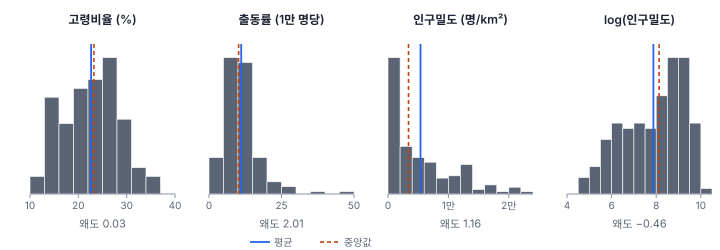
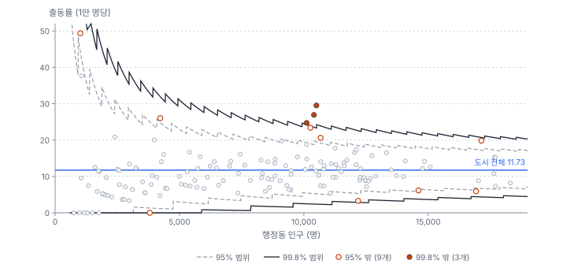
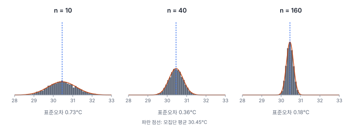
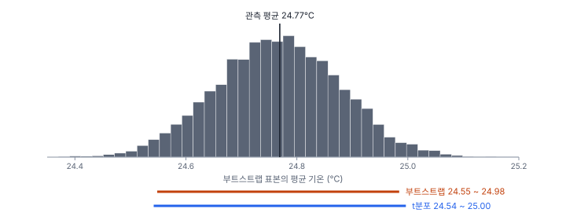

[목차](../README.md) · 이전: [5강 지도로 탐색하기](05-mapping-and-exploration.md) · 다음: [7강 검정의 논리와 순열 검정](07-testing-and-permutation.md)

# 6강 요약·분포·추정

> 앱 지원: ◐ 요약통계와 분포는 앱에서, 신뢰구간과 부트스트랩은 코드로 함 · 읽는 시간 약 35분

## 이 강에서 얻는 것

- 평균·중앙값·표준편차·사분위 범위·왜도로 자료를 요약하고, 비율 자료의 평균은 가중해야 한다는 것을 설명할 수 있음
- 정규·로그정규·포아송 분포가 공간 자료의 어디에 나타나는지 알고, 인구가 적은 구역의 비율이 왜 크게 흔들리는지 설명할 수 있음
- 표준오차와 신뢰구간의 뜻을 바르게 해석하고, 부트스트랩으로 신뢰구간을 구할 수 있음
- 이 강의 계산이 모두 "관측값이 서로 독립"이라는 가정 위에 있다는 것을 알고, 9강으로 넘어갈 준비를 함

## 들어가는 질문

한빛시의 여름철 폭염 구급 출동률을 묻는 기자에게 담당자 두 사람이 서로 다른 답을 했음.

- G: "행정동 150개의 출동률을 평균 내면 **1만 명당 11.12건**임"
- H: "도시 전체 출동 1,408건을 인구 120만 명으로 나누면 **1만 명당 11.73건**임"

같은 날 기상 담당자는 "관측소 48곳의 8월 평균 기온은 **24.77℃**"라고 발표했음. 기자는 다시 물었음. "관측소가 없는 곳까지 합친 도시 전체의 평균 기온도 24.77℃인가? 얼마나 믿을 수 있는가?"

첫 질문은 **요약**의 문제이고, 둘째 질문은 **추정**의 문제임. 이 강은 공간 분석에 필요한 만큼 통계의 기초를 다시 정리함. 예제는 모두 한빛시 자료임.

## 1. 요약통계: 가운데, 퍼짐, 모양

자료 150개를 한 줄로 전하려면 몇 개의 수로 요약해야 함. 요약은 세 가지를 봄.

- **가운데**(위치): 평균(mean)과 중앙값(median). 평균은 모든 값을 더해 개수로 나눈 것이고, 중앙값은 크기순으로 세웠을 때 가운데 값임
- **퍼짐**: 분산(variance)과 표준편차(standard deviation), 사분위 범위(IQR). 표준편차는 값들이 평균에서 평균적으로 얼마나 떨어져 있는지를 나타냄. 사분위 범위는 가운데 절반의 값이 차지하는 폭(Q3 − Q1)임. 평균이 다른 변수끼리 퍼짐을 비교할 때는 표준편차를 평균으로 나눈 **변동계수**(CV)를 씀
- **모양**: 왜도(skewness). 0이면 좌우가 대칭이고, 양수면 오른쪽 꼬리가, 음수면 왼쪽 꼬리가 긺

$$
\bar{x} = \frac{1}{n}\sum_{i=1}^{n} x_i, \qquad s = \sqrt{\frac{1}{n-1}\sum_{i=1}^{n}(x_i - \bar{x})^2}
$$

표준편차의 분모가 n이 아니라 n − 1인 것은, 평균을 자료에서 구했기 때문에 흩어짐이 조금 작게 재어지는 것을 보정하기 위함임. 한빛시 행정동 150개의 네 변수를 요약하면 다음과 같음.

| 변수 | 평균 | 중앙값 | 표준편차 | 사분위 범위 | 변동계수 | 왜도 |
|---|---|---|---|---|---|---|
| 고령비율 (%) | 22.63 | 23.23 | 5.80 | 9.11 | 0.26 | 0.03 |
| 출동률 (1만 명당) | 11.12 | 10.22 | 6.52 | 6.20 | 0.59 | 2.01 |
| 인구밀도 (명/㎢) | 5,380 | 3,388 | 5,449 | 7,318 | 1.01 | 1.16 |
| 동 평균 지표온도 (℃) | 31.73 | 31.65 | 2.24 | 3.77 | 0.07 | −0.12 |



고령비율과 지표온도는 왜도가 0에 가까워 평균과 중앙값이 거의 같음. 출동률과 인구밀도는 오른쪽 꼬리가 길어 평균이 중앙값보다 큼. 인구밀도는 평균(5,380)이 중앙값(3,388)의 1.6배임. 큰 값 몇 개가 평균을 끌어올렸기 때문임. 이럴 때 "보통의 동"을 말하려면 중앙값이 낫고, 사분위 범위가 표준편차보다 퍼짐을 더 잘 나타냄. 중앙값과 사분위 범위는 극단값 몇 개에 흔들리지 않으므로 **로버스트**(robust)하다고 함. 출동률이 가장 큰 다솜23동 하나를 빼면 평균은 11.12에서 10.86으로 움직이지만 중앙값은 10.22에서 10.20으로 거의 그대로임.

### 비율의 평균은 가중해서 냄

들어가는 질문의 두 답은 모두 계산은 맞음. 다만 서로 다른 질문에 답했음.

- G의 11.12는 **행정동 150개의 출동률을 똑같은 무게로** 평균 낸 값임. "보통의 행정동"의 출동률임
- H의 11.73은 도시 전체의 출동을 도시 전체 인구로 나눈 값이고, 이는 동별 출동률을 **인구로 가중해** 평균 낸 값과 정확히 같음. "한빛시 주민 한 사람"의 출동률임

가중 평균이 더 큰 것은 인구가 적은 동에 출동률이 낮은 곳이 많기 때문임. 출동이 한 건도 없는 7개 동이 모두 인구 3,806명 이하이고, 인구 3천 명 미만 30개 동의 출동률 중앙값은 5.59임. 인구로 가중하면 이 동들의 무게가 줄어 평균이 올라감. 1강에서 내포량은 그냥 평균 내지 않고 분모로 가중한다고 했던 규칙과 같음. 도시 전체의 출동률을 묻는다면 H가 맞음. 보고서에는 어느 쪽인지 밝힘.

## 2. 분포: 값이 퍼지는 규칙

값이 어떻게 퍼져 있는지를 나타낸 것을 **분포**(distribution)라 함. 이 책에서 자주 만나는 분포는 셋임.

- **정규분포**(normal distribution): 평균을 중심으로 좌우 대칭인 종 모양. 서로 독립인 작은 요인 여럿이 더해져 생기는 값이 이 모양에 가까워짐. 뒤에 볼 표본평균의 분포가 대표적임
- **로그정규분포**(log-normal distribution): 로그를 취하면 정규분포가 되는 분포. 여러 요인이 **곱해져** 생기는 값(소득, 인구밀도, 농도)이 흔히 이 모양임. 한빛시 인구밀도의 왜도는 1.16이지만 로그를 취하면 크기가 0.46으로 줄어듦(부호가 바뀌어 조금 왼쪽으로 치우침). 로그값의 평균을 되돌린 **기하평균**은 2,629명/㎢로, 산술평균(5,380)보다 중앙값(3,388)에 가까움
- **포아송분포**(Poisson distribution): 드문 사건의 건수. 기댓값이 λ인 포아송분포는 분산도 λ라서, 건수의 표준편차는 √λ임

### 작은 인구의 비율이 흔들리는 이유

행정동의 출동 건수를 포아송분포로 보면 5강에서 본 "작은 인구의 극단값"을 설명할 수 있음. 모든 동의 참 출동률이 도시 전체와 같은 11.73이라고 해 보면, 인구 1,013명인 다솜23동의 기대 건수는 1,013 × 11.73 ÷ 10,000 = 1.19건임. 표준편차는 √1.19 = 1.09건이므로, 출동률로 바꾸면 **표준오차가 1만 명당 10.76**임. 인구 10,506명인 마루16동은 기대 12.33건, 표준편차 3.51건이라 출동률의 표준오차는 3.34임. 같은 참값에서도 인구가 10분의 1이면 출동률은 약 3배(√10배) 더 크게 흔들림.



이를 그림으로 그린 것이 **깔때기 그림**(funnel plot, Spiegelhalter 2005)임. 가로축은 인구, 세로축은 출동률이고, 선은 참 출동률이 모두 11.73일 때 우연만으로 나올 수 있는 범위임. 건수는 정수라서 포아송분포로 정확히 계산한 범위는 계단 모양이 됨. 인구가 적은 왼쪽으로 갈수록 범위가 넓어짐. 95% 범위를 벗어난 동은 12개(위로 8개, 아래로 4개)임. 다솜23동의 49.36은 95% 범위는 넘지만 99.8% 범위 안에 있음. 인구가 1천 명이면 이 정도는 드물지만 아주 이례적이지는 않음. 반면 마루구의 세 동(15동, 16동, 30동)은 인구가 1만 명 남짓한데도 99.8% 범위 위에 있음. 인구가 많아 흔들림이 작은 곳에서 이만큼 높다는 것은 우연으로 보기 어려움. 이 판단을 150개 동에 한꺼번에 할 때의 문제는 7강에서, 작은 인구의 비율을 다듬는 방법은 14강에서 다룸.

## 3. 표본분포와 표준오차

추정(estimation)은 일부를 보고 전체를 짐작하는 일임. 관측소 48곳의 기온으로 도시 전체의 평균 기온을 짐작하는 것이 추정임. 추정값은 어느 관측소를 골랐느냐에 따라 달라지므로, 추정값이 **얼마나 흔들리는지**를 함께 알아야 함.

참값을 아는 예로 연습해 봄. 한빛시 지표온도 래스터의 육지 셀 181,637개 전체를 **모집단**(population)으로 보면 참 평균은 30.45℃, 표준편차 σ는 2.30℃임. 1절 표의 동 평균 지표온도 31.73℃가 이보다 높은 것은 좁고 뜨거운 도심 동과 넓고 시원한 외곽 동을 같은 무게로 평균 냈기 때문임. 동 면적으로 가중하면 30.46℃로 모집단 평균과 거의 같음(1절의 가중 평균과 같은 이야기). 여기서 셀 n개를 무작위로 뽑아 평균을 내는 일을 5,000번 되풀이하면, 표본평균이 퍼지는 모양을 볼 수 있음. 이를 **표본분포**(sampling distribution)라 함.



표본평균의 표준편차를 **표준오차**(standard error, SE)라 함. 관측값이 서로 독립이면 다음과 같음.

$$
\text{SE}(\bar{x}) = \frac{\sigma}{\sqrt{n}}
$$

| 표본 크기 n | σ/√n | 5,000번 표본평균의 표준편차 |
|---|---|---|
| 10 | 0.728 | 0.724 |
| 40 | 0.364 | 0.365 |
| 160 | 0.182 | 0.179 |

식과 실험이 거의 같음. 두 가지를 기억함.

- 표본을 4배로 늘려야 표준오차가 절반이 됨. 정밀도는 √n에 비례해서만 좋아짐
- 모집단(셀 값)의 분포는 정규분포가 아니어도, 표본평균의 분포는 n이 커질수록 정규분포에 가까워짐. 이를 **중심극한정리**(central limit theorem)라 함

표준편차와 표준오차를 헷갈리지 않음. **표준편차**는 개별 값이 얼마나 퍼져 있는지(셀마다 2.30℃), **표준오차**는 추정값이 얼마나 흔들리는지(40개 평균이면 0.36℃)를 나타냄.

## 4. 신뢰구간

실제로는 표본을 한 번만 뽑고, σ도 모름. 그래서 표본 표준편차 s로 표준오차를 추정하고, 그 불확실성을 반영해 정규분포 대신 **t분포**를 씀. 95% **신뢰구간**(confidence interval)은 다음과 같음.

$$
\bar{x} \pm t_{0.975,\,n-1} \times \frac{s}{\sqrt{n}}
$$

관측소 48곳의 기온은 평균 24.77℃, 표준편차 0.783℃이므로 표준오차는 0.783 ÷ √48 = 0.113℃임. 자유도 47인 t분포의 97.5% 분위수 2.012를 곱하면 95% 신뢰구간은 **24.54℃에서 25.00℃ 사이**임.

신뢰구간의 뜻은 자주 잘못 읽힘.

- 맞는 해석: 같은 방법으로 표본을 뽑아 구간을 만드는 일을 여러 번 하면, 그 구간들의 95%가 참값을 포함함. 앞의 지표온도 모집단에서 40개씩 뽑아 t 신뢰구간을 2,000번 만들어 보니 94.6%가 참 평균 30.45℃를 포함했음(10개씩 뽑았을 때는 95.0%)
- 틀린 해석: "참값이 이 구간에 있을 확률이 95%임." 참값은 정해진 하나의 값이고, 흔들리는 것은 구간임. 한 번 만든 구간은 참값을 포함하거나 포함하지 않거나 둘 중 하나임

### 독립이라는 가정

지금까지의 모든 식에는 "관측값이 서로 **독립**"이라는 가정이 숨어 있음. 3절의 실험은 셀을 모집단에서 **무작위로** 뽑았으므로, 셀 값이 공간적으로 닮아 있어도 뽑는 방법이 독립을 보장함. 관측소는 다름. 무작위로 뽑은 지점이 아니라 정해진 자리에 있고, 가까운 관측소끼리 기온이 닮았을 가능성이 큼(토블러의 지리학 제1법칙, 0강). 닮은 값 48개는 독립인 값 48개보다 정보가 적으므로, 위의 신뢰구간은 실제보다 좁을 수 있음. 관측소 자리가 도시 전체를 고르게 대표하는지도 따로 따져야 함(38강). 이것이 얼마나 문제인지는 9강에서 수로 확인함. 공간통계가 따로 필요한 이유가 바로 이 가정이 깨지는 데 있음.

## 5. 부트스트랩

평균이 아닌 통계량(중앙값, 비율의 비, 상관계수)은 표준오차 공식이 없거나 복잡함. **부트스트랩**(bootstrap, Efron 1979)은 공식 대신 컴퓨터 계산으로 표본분포를 흉내 냄. 모집단에서 다시 뽑을 수 없으니, **가진 표본을 모집단 삼아** 거기서 다시 뽑음.

1. 원래 표본(n개)에서 **복원 추출**로 n개를 뽑음. 같은 값이 여러 번 뽑힐 수도, 한 번도 안 뽑힐 수도 있음
2. 그 재표본으로 통계량(평균, 중앙값 등)을 계산함
3. 1~2를 수천 번 되풀이해 통계량의 분포를 만듦. 이 분포의 표준편차가 부트스트랩 표준오차이고, 2.5%와 97.5% 분위수가 **백분위 부트스트랩 신뢰구간**임

손으로 해 보면 이렇게 됨. 관측소 5곳의 기온이 24.94, 24.87, 24.62, 25.91, 25.02℃이고 평균이 25.07℃일 때, 복원 추출한 재표본 세 개는 다음과 같았음.

| 재표본 | 뽑힌 값 (크기순) | 평균 |
|---|---|---|
| 1 | 24.62, 24.62, 24.62, 24.94, 25.02 | 24.76 |
| 2 | 24.94, 24.94, 25.02, 25.91, 25.91 | 25.34 |
| 3 | 24.87, 25.02, 25.02, 25.91, 25.91 | 25.35 |

재표본의 평균이 원래 평균 주위에서 흔들리는 폭이 곧 표준오차의 추정임. 관측소 48곳 전체로 9,999번 해 본 결과는 다음과 같음.



| 통계량 | 관측값 | 표준오차 | 95% 신뢰구간 |
|---|---|---|---|
| 평균 (t분포) | 24.77 | 0.113 | 24.54 ~ 25.00 |
| 평균 (부트스트랩) | 24.77 | 0.112 | 24.55 ~ 24.98 |
| 중앙값 (부트스트랩) | 24.78 | 0.114 | 24.55 ~ 24.97 |

평균에서는 t분포와 부트스트랩이 거의 같은 답을 냄. 공식이 간단하지 않은 중앙값도 같은 방법으로 신뢰구간을 얻었음. 다만 부트스트랩도 관측값을 **독립으로 하나씩** 다시 뽑으므로, 관측값끼리 닮았다면 같은 문제가 남음. 공간 자료에서는 가까운 관측값을 묶음째 다시 뽑는 **블록 부트스트랩**을 쓰며, 이는 39강의 공간 교차검증과 같은 생각임.

## 6. 모두 조사했는데 왜 오차를 말하는가

한빛시 행정동 150개는 표본이 아니라 **전부**임. 그런데도 출동률에 표준오차를 붙이는 것은 이상해 보일 수 있음. 여기에는 두 관점이 있음.

- **설계 기반**(design-based) 관점: 불확실성은 누구를 표본으로 뽑았느냐에서 옴. 전수 조사라면 도시 전체 출동률 11.73은 오차 없는 사실임
- **모형 기반**(model-based) 관점: 관측값은 어떤 과정(여기서는 위험에 따라 출동이 생기는 과정)이 한 번 만들어 낸 결과임. 2025년 여름에 다솜23동에서 5건이 나온 것은 그 과정의 한 번의 실현이고, 같은 위험에서도 다른 해에는 2건이나 7건이 나올 수 있었음. 관심이 "올해 몇 건이었나"가 아니라 "이 동의 위험이 얼마인가"라면 불확실성이 있음

공간통계는 대부분 모형 기반 관점을 따름. 깔때기 그림의 범위, 7강 이후의 검정, 회귀계수의 표준오차는 모두 "자료를 만든 과정"에 대한 불확실성임. 표본 설계와 두 관점의 차이는 38강에서 다룸.

## 해 보기: GeoStat으로 요약하고 분포 보기

앱에는 아직 요약통계 표가 없으므로, 박스플롯의 요약 줄과 히스토그램을 씀.

1. 5강의 해 보기 1번처럼 `hanbit_dong.gpkg`와 `hanbit_events.gpkg`를 열고, `hanbit_dong`을 고른 뒤 점 집계로 `PT_CNT`를, 계산 필드로 `출동률` = `` `PT_CNT` / `인구` * 10000 ``을 만듦
2. **차트** 단추(⌘J)로 차트 패널을 열고 **+ 박스플롯** 단추로 변수 `출동률`을 추가함
   - 확인: 아래쪽 요약 줄에 중앙값 10.22, Q1 7.372, Q3 13.57, 평균 11.12, n 150이 나옴. 평균이 중앙값보다 큼
3. **+ 히스토그램** 단추로 `출동률`의 히스토그램(구간 수 10)을 추가하고, 오른쪽 꼬리의 막대를 눌러 어느 동인지 지도에서 확인함
4. **공간 분석 → 계산 필드 추가…** 메뉴로 `인구밀도` = `` `인구` / `면적_km2` ``와 `로그밀도` = `` log(`인구` / `면적_km2`) ``를 만듦. `log`는 자연로그임. 두 변수의 히스토그램을 나란히 놓고 모양을 비교함
5. 계산 필드 `출동률_z` = `` (`출동률` - `출동률`.mean()) / `출동률`.std() ``를 만듦. 평균을 빼고 표준편차로 나눈 **표준화 점수**(z점수)임
   - 확인: 속성 테이블에서 `출동률_z` 열 제목을 두 번 눌러 큰 값부터(▼) 정렬하면 다솜23동이 5.8679로 맨 위에 옴. 평균에서 표준편차의 약 6배 떨어졌다는 뜻임
6. `hanbit_stations.gpkg`를 열고, **+ 박스플롯** 단추로 `기온_8월평균`을 추가함
   - 확인: 중앙값 24.78, 평균 24.77, n 48이 나옴

### 코드로: 신뢰구간과 부트스트랩

신뢰구간과 부트스트랩은 앱에 아직 없으므로 Python으로 함. GeoStat 엔진과 같은 라이브러리(geopandas, numpy, scipy)를 씀.

```python
import geopandas as gpd
import numpy as np
from scipy import stats

t = gpd.read_file("book/data/hanbit_stations.gpkg")["기온_8월평균"].to_numpy()
n, m, s = t.size, t.mean(), t.std(ddof=1)
se = s / np.sqrt(n)
q = stats.t.ppf(0.975, n - 1)
print(f"평균 {m:.2f}, 표준오차 {se:.3f}, 95% 신뢰구간 {m - q * se:.2f} ~ {m + q * se:.2f}")

rng = np.random.default_rng(20261003)
boot = t[rng.integers(0, n, (9999, n))]          # 복원 추출 9,999번
for name, f in (("평균", np.mean), ("중앙값", np.median)):
    b = f(boot, axis=1)
    lo, hi = np.percentile(b, [2.5, 97.5])
    print(f"{name}: 부트스트랩 표준오차 {b.std(ddof=1):.3f}, 95% 신뢰구간 {lo:.2f} ~ {hi:.2f}")
```

- 확인: 평균 24.77, 표준오차 0.113, 95% 신뢰구간 24.54 ~ 25.00. 부트스트랩은 평균 24.55 ~ 24.98, 중앙값 24.55 ~ 24.97로 5절의 표와 같음. 난수 시드(`20261003`)를 바꾸면 소수 둘째 자리가 조금 달라짐

## 헷갈리는 쌍

- **표준편차 vs 표준오차**: 표준편차는 개별 값의 퍼짐, 표준오차는 추정값(평균 등)의 흔들림임. 표본이 커져도 표준편차는 그대로지만 표준오차는 줄어듦
- **단순 평균 vs 가중 평균**: 구역별 비율을 똑같은 무게로 평균 내면 "보통의 구역", 분모로 가중하면 "전체"의 비율임
- **평균 vs 중앙값**: 치우친 분포에서는 평균이 꼬리 쪽으로 끌려감. 중앙값은 극단값에 흔들리지 않음
- **신뢰구간 vs 값의 범위**: 95% 신뢰구간은 평균 같은 추정값의 불확실성이고, 개별 값의 95%가 들어가는 범위가 아님. 관측소 기온의 95% 신뢰구간은 24.54~25.00℃지만, 관측소 기온 자체는 23.21~26.52℃에 퍼져 있음
- **설계 기반 vs 모형 기반**: 불확실성이 표본 추출에서 오는가, 자료를 만든 과정에서 오는가의 차이임

## 흔한 실수와 심사 지적

- **구역별 비율의 단순 평균을 전체 비율로 보고함**
  - 결과: 인구가 적은 구역의 비율이 과대하게 반영됨
  - 대응: 전체 비율은 합계 ÷ 합계로 구하고, 단순 평균을 쓸 때는 그 뜻을 밝힘
- **치우친 변수를 평균 ± 표준편차로만 요약함**
  - 지적: "분포가 치우쳐 있으므로 중앙값과 사분위 범위를 함께 제시하십시오."
  - 대응: 왜도를 확인하고, 치우쳤으면 중앙값(Q1~Q3)으로 요약하거나 로그 변환을 검토함
- **표준오차와 표준편차를 섞어 씀**
  - 결과: "평균 ± 0.11"이 개별 관측소의 흩어짐처럼 읽힘
  - 대응: 표와 그림에 SD인지 SE인지, 신뢰구간이면 몇 %인지 적음
- **공간 자료에 독립 가정의 표준오차를 그대로 씀**
  - 지적: "관측 지점 간 공간 자기상관을 고려하였습니까?"
  - 대응: 9강의 유효 표본 크기나 공간 모형을 검토함
- **인구가 적은 구역의 극단적인 비율을 그대로 해석함**
  - 대응: 깔때기 그림처럼 분모에 따른 우연의 범위를 함께 보여 줌

## 보고서에는 이렇게 씀

> 2025년 6~8월 한빛시의 폭염 관련 구급 출동은 1,408건으로, 인구 1만 명당 11.73건이었다. 행정동별 출동률은 중앙값 10.22건(Q1~Q3 7.37~13.57건)이었으며 오른쪽으로 치우친 분포를 보였다(왜도 2.01). 인구가 적은 행정동일수록 출동률의 변동이 커서, 인구 1,013명인 다솜23동의 출동률 49.36건은 도시 전체 출동률을 기준으로 한 포아송 95% 범위를 넘었으나 99.8% 범위 안에 있었다. 관측소 48곳의 8월 평균 기온은 24.77℃(95% 신뢰구간 24.54~25.00℃)였다.

적어야 할 항목은 다음과 같음.

- 가운데와 퍼짐을 무엇으로 요약했는지(평균·표준편차 또는 중앙값·사분위 범위)
- 전체 비율인지, 구역별 비율의 평균인지
- 표준오차(SE)인지 표준편차(SD)인지, 신뢰구간의 수준과 계산 방법(t분포, 부트스트랩)
- 관측값의 독립 가정이 맞지 않을 가능성과 그 대응

## 요약

- 요약은 가운데(평균, 중앙값), 퍼짐(표준편차, 사분위 범위), 모양(왜도)으로 함. 치우친 분포는 중앙값과 사분위 범위가 더 잘 요약함
- 구역별 비율의 단순 평균(11.12)과 전체 비율(11.73)은 다른 질문의 답임. 전체 비율은 분모로 가중한 평균임
- 사건 건수를 포아송분포로 보면 분산이 평균과 같음(실제로는 이보다 더 흩어지는 과산포가 흔함). 그래서 인구가 적은 구역의 비율은 크게 흔들리고, 깔때기 그림으로 이를 보여 줄 수 있음
- 독립인 관측의 표준오차는 σ/√n으로, 표본이 4배가 되어야 절반이 됨. 95% 신뢰구간은 "같은 방법으로 만든 구간의 95%가 참값을 포함함"이라는 뜻임
- 부트스트랩은 표본을 복원 추출로 다시 뽑아 공식 없이 표준오차와 신뢰구간을 구함
- 이 강의 계산은 모두 관측값이 독립이라는 가정 위에 있음. 공간 자료에서 이 가정이 깨지면 무엇이 생기는지는 9강에서 다룸

## 핵심 용어

| 한글 | 영문 | 비고 |
|---|---|---|
| 평균 / 중앙값 | Mean / Median | |
| 표준편차 | Standard Deviation (SD) | 개별 값의 퍼짐 |
| 사분위 범위 | Interquartile Range (IQR) | Q3 − Q1 |
| 변동계수 | Coefficient of Variation (CV) | 표준편차 ÷ 평균 |
| 왜도 | Skewness | |
| 가중 평균 | Weighted Mean | |
| 로버스트 | Robust | 극단값에 덜 흔들림 |
| 정규분포 / 로그정규분포 / 포아송분포 | Normal / Log-normal / Poisson | |
| 기하평균 | Geometric Mean | 로그의 평균을 되돌린 값 |
| 깔때기 그림 | Funnel Plot | |
| 모집단 / 표본 | Population / Sample | |
| 표본분포 | Sampling Distribution | |
| 표준오차 | Standard Error (SE) | 추정값의 흔들림 |
| 중심극한정리 | Central Limit Theorem | |
| 신뢰구간 | Confidence Interval (CI) | |
| 부트스트랩 | Bootstrap | 복원 추출로 표본분포를 흉내 냄 |
| 설계 기반 / 모형 기반 추론 | Design-based / Model-based Inference | 38강 |

## 원전과 더 읽을거리

**원전**

- Student (1908). The probable error of a mean. *Biometrika*, 6(1), 1–25. t분포
- Efron, B. (1979). Bootstrap methods: Another look at the jackknife. *The Annals of Statistics*, 7(1), 1–26. 부트스트랩
- Spiegelhalter, D. J. (2005). Funnel plots for comparing institutional performance. *Statistics in Medicine*, 24(8), 1185–1202. 깔때기 그림

**더 읽을거리**

- Efron, B., & Tibshirani, R. J. (1993). *An Introduction to the Bootstrap*. Chapman & Hall. 부트스트랩의 표준 입문서
- de Gruijter, J. J., & ter Braak, C. J. F. (1990). Model-free estimation from spatial samples: A reappraisal of classical sampling theory. *Mathematical Geology*, 22(4), 407–415. 공간 표본에서 설계 기반과 모형 기반 추론의 차이

## 연습

1. 행정동 A(인구 1,000명, 출동 3건)와 B(인구 9,000명, 출동 9건)가 있음. 두 동 출동률(1만 명당)의 단순 평균과, 두 동을 합친 출동률을 구하시오. 어느 쪽이 "두 동 주민 한 사람의 출동률"인가?

2. 1절의 표에서 인구밀도의 표준편차(5,449)가 평균(5,380)보다 큼. 인구밀도를 평균 ± 표준편차로 요약하면 어떤 이상한 결과가 나오는지 적고, 더 나은 요약을 제안하시오.

3. 3절의 지표온도 모집단(σ = 2.30℃)에서 표준오차를 0.1℃ 이하로 하려면 셀을 몇 개 이상 무작위로 뽑아야 하는가?

4. 어떤 연구자가 "관측소 기온의 95% 신뢰구간이 24.54~25.00℃이므로, 한빛시 어느 곳이든 8월 평균 기온은 95% 확률로 이 범위에 있다"고 썼음. 틀린 점 두 가지를 지적하시오.

5. 인구 2,000명인 동의 참 출동률이 도시 전체와 같은 11.73이라면 기대 건수와 건수의 표준편차는 얼마인가? 이 동의 출동률 표준오차(1만 명당)를 구하고, 인구 8,000명인 동과 비교하시오.

<details>
<summary>해답</summary>

1. A는 30, B는 10이므로 단순 평균은 20임. 합친 출동률은 (3 + 9) ÷ (1,000 + 9,000) × 10,000 = 12임. 두 동 주민 한 사람의 출동률은 합친 값 12이고, 이는 인구로 가중한 평균 (30 × 1,000 + 10 × 9,000) ÷ 10,000 = 12와 같음. 단순 평균 20은 인구가 적은 A의 높은 비율에 너무 큰 무게를 줌.

2. 평균 − 표준편차 = 5,380 − 5,449 = −69명/㎢으로, 인구밀도가 음수인 동이 흔하다는 뜻처럼 읽힘. 오른쪽으로 치우친 분포(왜도 1.16)에서는 평균 ± 표준편차가 분포를 잘 나타내지 못함. 중앙값 3,388명/㎢와 Q1~Q3(951~8,269명/㎢, 사분위 범위 7,318명/㎢)로 요약하거나, 로그를 취해 요약하고 기하평균(2,629명/㎢)을 쓰는 것이 나음.

3. 2.30 ÷ √n ≤ 0.1이므로 √n ≥ 23, n ≥ 529. 셀 529개 이상임. (모집단에서 무작위로 뽑는 한, 셀 값이 공간적으로 닮아 있어도 이 식이 맞음. 뽑는 방법이 독립을 보장하기 때문임. 관측소처럼 위치가 정해진 자료는 다름. 9강, 38강)

4. (1) 신뢰구간은 **평균**의 불확실성이지 개별 장소 기온의 범위가 아님. 관측소 기온 자체는 23.21~26.52℃에 퍼져 있음. (2) "95% 확률로 참값이 이 구간에 있다"는 해석도 틀림. 같은 방법으로 만든 구간들의 95%가 참값을 포함한다는 뜻임. 덧붙여, 관측소끼리 닮았다면 이 구간 자체가 너무 좁을 수 있음(9강).

5. 기대 건수 λ = 2,000 × 11.73 ÷ 10,000 = 2.35건, 표준편차 √2.35 = 1.53건. 출동률의 표준오차는 1.53 ÷ 2,000 × 10,000 = 7.66임. 인구 8,000명이면 λ = 9.38건, 표준편차 3.06건, 표준오차 3.83으로 정확히 절반임. 인구가 4배면 표준오차는 1/√4 = 1/2이 됨.

</details>

---

[목차](../README.md) · 이전: [5강 지도로 탐색하기](05-mapping-and-exploration.md) · 다음: [7강 검정의 논리와 순열 검정](07-testing-and-permutation.md)
