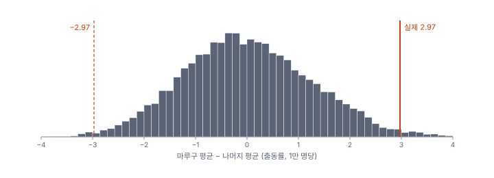
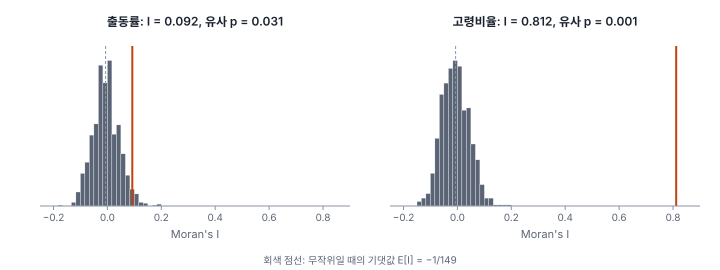
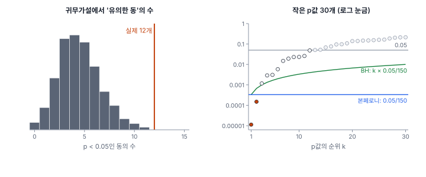

[목차](../README.md) · 이전: [6강 요약·분포·추정](06-summary-distribution-estimation.md) · 다음: [8강 회귀분석과 진단](08-regression-and-diagnostics.md)

# 7강 검정의 논리와 순열 검정

> 앱 지원: ◐ Moran's I의 순열 검정과 다중검정 보정은 앱에서, 두 집단 순열 검정과 동별 검정은 코드로 함 · 읽는 시간 약 40분

## 이 강에서 얻는 것

- 귀무가설, 검정통계량, 귀무분포, p값으로 이어지는 검정의 논리를 설명하고, p값을 바르게 해석할 수 있음
- 1종 오류, 2종 오류, 검정력의 관계를 알고, 인구가 적은 구역에서 검정력이 낮은 이유를 설명할 수 있음
- 순열 검정의 원리와 유사 p값을 이해하고, 공간통계의 검정(Moran's I, LISA)이 왜 순열을 쓰는지 설명할 수 있음
- 여러 구역을 한꺼번에 검정할 때의 문제를 알고, 본페로니와 FDR 보정을 쓸 수 있음

## 들어가는 질문

6강의 깔때기 그림을 본 한빛시 담당자가 보고서를 썼음.

> 행정동 150개 가운데 12개 동의 출동률이 도시 평균과 통계적으로 유의하게 달랐음(p < 0.05). 이 12개 동을 폭염 집중 관리 지역으로 지정할 것을 제안함.

검토를 맡은 통계 자문위원은 두 가지를 물었음.

- "모든 동의 위험이 똑같더라도, 150개 동을 하나씩 검정하면 몇 개쯤은 우연히 유의하게 나오지 않습니까?"
- "인구가 1천 명인 동과 1만 명인 동에서 '유의하지 않음'이 같은 뜻입니까?"

이 강은 이 두 질문에 답할 수 있도록 검정의 논리를 다시 정리함. 그리고 공간통계의 거의 모든 검정이 기대는 **순열 검정**을 소개함.

## 1. 검정의 논리

통계적 검정(hypothesis test)은 반증의 논리를 따름. 보이고 싶은 것의 반대를 **귀무가설**(null hypothesis, H₀)로 세우고, 자료가 귀무가설과 얼마나 어긋나는지 잼.

1. **귀무가설**을 정함: "마루구와 나머지 구의 출동률에는 차이가 없음"
2. **검정통계량**을 정함: 차이를 하나의 수로 나타낸 것. 예를 들어 두 집단의 평균 차이
3. **귀무분포**를 구함: 귀무가설이 참이라면 검정통계량이 어떤 분포를 보이는지. 수식(t분포 등)으로 구하거나, 컴퓨터로 흉내 내서 구함
4. **p값**을 계산함: 귀무가설이 참일 때, 관측한 것만큼 또는 그보다 더 극단적인 검정통계량이 나올 확률

p값이 미리 정한 **유의수준** α(흔히 0.05)보다 작으면 "귀무가설과 어긋난다"고 보고 귀무가설을 기각함.

### 손으로 해 보기: 3개 대 3개

두 집단의 값이 A = {14, 18, 22}, B = {9, 11, 13}이라 함. 평균 차이는 18 − 11 = **7**임. 귀무가설은 "A와 B라는 라벨은 값과 아무 관계가 없음"임. 그렇다면 라벨을 어떻게 붙여도 똑같이 그럴듯해야 함. 값 6개 가운데 3개를 A로 고르는 방법은 ₆C₃ = 20가지이고, 20가지 배치의 평균 차이를 모두 구하면 다음과 같음.

−7.00, −6.33, −5.00, −3.67, −3.67, −2.33, −1.67, −1.00, −1.00, −0.33, 0.33, 1.00, 1.00, 1.67, 2.33, 3.67, 3.67, 5.00, 6.33, **7.00**

이 20개가 귀무분포임. 관측한 7.00은 가장 큰 값이므로 한쪽 p값은 1/20 = 0.05, 양쪽 p값(차이의 크기가 7 이상)은 2/20 = 0.10임. 이렇게 라벨을 섞어 귀무분포를 만드는 검정을 **순열 검정**(permutation test)이라 하며, 피셔(Fisher 1935)와 피트먼(Pitman 1937)이 제안했음. 각 집단이 3개뿐이면 가장 작은 한쪽 p값이 0.05, 양쪽 p값이 0.10이라서, 아무리 차이가 커도 양쪽 검정으로는 0.05 기준에서 기각할 수 없음.

## 2. p값이 말하는 것과 말하지 않는 것

p값은 "귀무가설이 참이라면 이런 자료가 얼마나 드문가"만 말함. 미국통계학회(Wasserstein & Lazar 2016)는 흔한 오해를 다음처럼 정리했음.

- p값은 **귀무가설이 참일 확률이 아님**. p = 0.03은 "차이가 없을 확률 3%"가 아님
- p값은 **효과의 크기나 중요성을 말하지 않음**. 표본이 크면 아주 작은 차이도 p값이 작아짐
- **p > 0.05는 "차이가 없다"는 증거가 아님**. 증거가 부족하다는 뜻일 뿐임
- 과학적 결론이나 정책 결정은 p값이 어떤 기준을 넘었는지만으로 내리지 않음

그래서 보고서에는 p값만이 아니라 **효과의 크기**(차이, 비율의 비)와 **신뢰구간**(6강)을 함께 적음.

## 3. 두 가지 오류와 검정력

검정의 결론은 틀릴 수 있고, 틀리는 방식은 두 가지임.

| | 귀무가설이 참 (차이 없음) | 귀무가설이 거짓 (차이 있음) |
|---|---|---|
| 기각함 | **1종 오류** (거짓 양성), 확률 α 이하 | 맞음. 이 확률이 **검정력** 1 − β |
| 기각하지 않음 | 맞음 | **2종 오류** (거짓 음성), 확률 β |

α는 연구자가 정함. 2종 오류의 확률 β와 **검정력**(power)은 효과의 크기와 자료의 양에 달림. 들어가는 질문의 둘째 질문이 여기에 해당함. 참 출동률이 도시 전체의 **두 배**인 동이 있다고 할 때, 그 동 하나의 출동 건수만으로 포아송 검정(α = 0.05)을 하면 이를 찾아낼 확률은 인구에 따라 크게 다름.

| 행정동 인구 | 기대 건수 (도시 평균일 때) | 두 배 위험을 찾아낼 확률 (검정력) | 실제 1종 오류율 |
|---|---|---|---|
| 1,000명 | 1.17건 | 8.9% | 0.71% |
| 3,000명 | 3.52건 | 27.6% | 1.02% |
| 10,000명 | 11.73건 | 79.0% | 4.13% |
| 18,000명 | 21.12건 | 95.6% | 3.95% |

마지막 열은 위험이 도시 평균과 같을 때 잘못 기각할 확률임. 건수는 정수라서 p값이 띄엄띄엄 나오므로, 실제 1종 오류율은 α = 0.05보다 작아짐(보수적). 기대 건수가 작을수록 더 그러함. 인구 1천 명인 동은 위험이 정말 두 배여도 열에 아홉은 "유의하지 않음"이 나옴. 이런 동의 "유의하지 않음"은 "안전함"이 아니라 "알 수 없음"임. 공간 자료에서는 구역마다 분모가 달라 검정력도 구역마다 다르다는 점을 늘 기억함.

## 4. 순열 검정

### 두 집단 비교

1절의 손계산을 실제 자료에 적용해 봄. 마루구 35개 동의 출동률 평균은 13.40, 나머지 115개 동은 10.43으로 차이는 2.97임. 동이 150개면 라벨을 붙이는 방법이 너무 많아 모두 따질 수 없으므로, 라벨을 무작위로 섞는 일을 9,999번 되풀이해 귀무분포를 흉내 냄.



섞은 9,999번 가운데 차이의 크기가 2.97 이상인 경우는 180번이었음. 순열 검정의 p값은 관측값 자신도 귀무분포의 한 경우로 세어 다음처럼 계산함.

$$
p = \frac{M + 1}{R + 1} = \frac{180 + 1}{9{,}999 + 1} = 0.0181
$$

M은 관측값만큼 또는 더 극단적인 순열 결과의 수, R은 순열 횟수임. 이렇게 구한 p값을 **유사 p값**(pseudo p-value)이라 함. 분자와 분모에 1을 더하므로 유사 p값은 0이 될 수 없고, 가장 작은 값은 1/(R + 1)임(North, Curtis & Sham 2002). 같은 자료에 분산이 다른 두 집단을 위한 웰치 t검정을 하면 t = 2.60, p = 0.0115임. 두 방법은 가정이 조금 달라 p값도 조금 다르지만 결론은 같음.

순열 검정은 분포에 대한 가정(정규분포 등)이 필요 없다는 장점이 있음. 대신 귀무가설 아래에서 **값들을 서로 바꿔도 된다**(교환 가능성, exchangeability)는 가정이 필요함. 이 가정이 공간 자료에서 어떻게 깨지는지는 9강에서 봄.

### 공간 순열: 값을 위치에 섞음

공간통계의 대표적인 검정인 **Moran's I**(11강)도 순열로 검정함. Moran's I는 이웃한 구역끼리 값이 얼마나 닮았는지를 하나의 수로 잰 것임. 지금은 "클수록 이웃끼리 닮았음"만 알면 됨. 귀무가설은 "값이 어느 위치에 있는지는 아무 의미가 없음", 즉 **공간적으로 무작위**임. 그렇다면 150개 값을 150개 행정동에 아무렇게나 다시 배치해도 똑같이 그럴듯해야 함. 이렇게 값을 위치에 섞어 Moran's I를 999번 다시 계산하면 귀무분포를 흉내 낼 수 있음. 값을 위치에 섞는다는 **무작위화 가정**(Cliff & Ord 1981)을 컴퓨터로 되풀이한 것이며, 이런 몬테카를로 검정은 호프(Hope 1968)가 정리했음. GeoStat과 GeoDa의 유사 p값은 관측값이 있는 쪽 꼬리만 센 **단측** 값임(11강).



| 변수 | Moran's I | 순열 99번 | 순열 999번 | 순열 9,999번 |
|---|---|---|---|---|
| 출동률 | 0.092 | 0.040 | 0.031 | 0.028 |
| 고령비율 | 0.812 | 0.010 | 0.001 | 0.0001 |

두 가지를 읽을 수 있음.

- **출동률**은 약하게 닮았음. 유사 p값은 순열 횟수에 따라 0.040, 0.031, 0.028로 조금씩 흔들리며, 순열을 늘릴수록 안정됨
- **고령비율**은 999번을 섞어도 한 번도 실제 값(0.812)에 가까이 가지 못했음. 그래서 유사 p값은 순열 횟수로 정해지는 가장 작은 값 1/(R + 1)과 같음. 이때 "p = 0.001"은 "p ≤ 0.001"로 읽음. 더 작은 p값이 필요하면(5절의 보정처럼) 순열을 늘려야 함

## 5. 다중검정: 여러 번 검정하면 우연도 여러 번

들어가는 질문의 첫째 질문으로 돌아감. 동마다 출동 건수가 도시 평균에서 기대되는 수와 다른지 포아송 검정(양쪽, α = 0.05)을 하면 **12개 동**이 유의하게 나옴(8개는 높은 쪽, 4개는 낮은 쪽).

그런데 모든 동의 참 출동률이 똑같이 11.73이라고 두고 출동 건수를 무작위로 만들어 같은 검정을 해 보면, 2,000번 가운데 98.6%에서 적어도 한 동이 "유의"하게 나왔음. 평균적으로 4.5개 동이 우연히 유의했음(이산 분포라 150 × 0.05 = 7.5개보다 적음).



검정을 여러 번 할 때 오류를 따지는 기준은 둘임.

- **가족별 오류율**(FWER, family-wise error rate): 검정 전체에서 거짓 양성이 **하나라도** 나올 확률. 보정하지 않으면 150번 검정에서 98.6%임
- **거짓 발견율**(FDR, false discovery rate): 유의하다고 판정한 것들 가운데 **거짓 양성의 비율**의 기댓값(유의한 것이 하나도 없으면 0으로 셈)

### 본페로니 보정

가장 단순한 방법은 α를 검정 횟수 m으로 나누는 **본페로니**(Bonferroni) 보정임. 150개 동이면 기준이 0.05 ÷ 150 = 0.00033이 됨. 이렇게 하면 가족별 오류율이 α 이하로 유지됨(모의실험에서 2.3%). 대신 기준이 매우 엄격해 검정력이 크게 떨어짐. 홀름(Holm 1979)의 단계적 방법은 같은 보장을 하면서 조금 덜 엄격함.

### 벤야미니–호흐베르크(BH) 보정

벤야미니와 호흐베르크(Benjamini & Hochberg 1995)는 거짓 발견율을 α 이하로 유지하는 방법을 제안했음.

1. p값 m개를 작은 것부터 늘어놓음: p₍₁₎ ≤ p₍₂₎ ≤ … ≤ p₍ₘ₎
2. p₍ₖ₎ ≤ k × α / m을 만족하는 가장 큰 k를 찾음
3. p₍₁₎부터 p₍ₖ₎까지를 유의하다고 판정함

기준선이 순위 k에 따라 올라가므로, 본페로니보다 덜 엄격함. 유의한 것이 많을수록 차이가 커짐. BH가 거짓 발견율을 보장하는 것은 검정들이 서로 독립이거나 양의 상관이 있을 때임. 이웃 구역의 국지 통계처럼 값을 나눠 쓰는 검정에 FDR을 쓸 때의 문제는 데카스트루와 싱어(de Castro & Singer 2006)가 다뤘으며, 12강에서 다시 봄.

### 한빛시에 적용

| 기준 | 유의한 동 |
|---|---|
| 보정 없음 (p < 0.05) | 12개 |
| 본페로니 (p < 0.00033) | 2개: 마루16동, 마루30동 |
| BH (FDR 5%) | 2개: 마루16동, 마루30동 |

보정하면 12개가 2개로 줄어듦. 세 번째로 작은 p값(마루15동, 0.00118)은 BH 기준선(3 × 0.05 ÷ 150 = 0.001)을 조금 넘었음. 여기서 흥미로운 점이 있음. 모든 동의 위험이 같을 때 2,000번 모의실험에서 유의한 동은 가장 많아야 11개였고, 12개 이상인 경우는 한 번도 없었음. "유의한 동의 수"를 하나의 검정통계량으로 보면 몬테카를로 p값이 1/2,001 ≈ 0.0005 이하라는 뜻임. **도시 전체로 보면 동마다 위험이 다르다는 증거는 강하지만, 어느 동이 다른지 하나하나 확신할 수 있는 것은 두 곳뿐**임. "전체적으로 무언가 있다"와 "여기에 있다"는 다른 질문이며, 이 구분은 11강(전역 통계)과 12강(국지 통계)에서 다시 나옴. 다만 여기서 확인한 것은 동마다 위험이 **다르다**(이질성)는 것이지, 위험이 비슷한 동끼리 **모여 있다**(공간 자기상관)는 것이 아님. 실제로 출동률의 Moran's I는 0.092로 약했음(4절). 두 질문은 서로 다름.

그러면 12개 동을 버려야 하는가? 그렇지 않음. 보정은 **확증**(이 동이 확실히 다르다고 주장하기)을 위한 것이고, **탐색**(더 조사할 후보를 고르기, 5강)에서는 보정하지 않은 목록도 쓸모가 있음. 다만 보고서에는 몇 번 검정했는지와 보정 여부를 밝혀야 함.

### 순열 횟수와 보정의 관계

순열 검정에 보정을 할 때는 주의할 점이 있음. 순열 999번의 유사 p값은 0.001보다 작아질 수 없는데, 150개 구역의 본페로니 기준은 0.00033임. 그래서 **순열 999번으로는 본페로니 보정을 통과하는 구역이 하나도 나올 수 없음.** 해 보기에서 GeoStat의 LISA로 이를 확인함. 보정 기준보다 작은 p값이 나올 수 있도록 순열 횟수 R을 충분히 늘려야 함. 가장 작은 유사 p값 1/(R + 1)이 본페로니 기준 α/m 이하가 되려면 R + 1 ≥ m/α여야 하고, 기준 근처의 p값을 안정되게 재려면 그보다 몇 배 많게 함.

## 해 보기: GeoStat에서 순열 검정과 다중검정 보정

1. `hanbit_dong.gpkg`와 `hanbit_events.gpkg`를 열고 5강처럼 `출동률`을 만듦(`hanbit_dong`을 고른 뒤 점 집계, 계산 필드). 계산 필드 `고령비율` = `` `고령인구` / `인구` * 100 ``도 만듦
2. **공간 분석 → 공간가중치 만들기…** 메뉴에서 유형은 **퀸 인접 (Queen)**, 나머지는 기본값으로 두고 **만들기**를 누름(4강)
3. **공간 분석 → Moran's I · Moran 산점도…** 메뉴에서 종류 **단변량**, 변수 `출동률`, 순열 횟수 **99**로 **계산**을 누름. 창은 계산 후 닫히고 다시 열면 설정이 처음으로 돌아가므로, 메뉴를 다시 열어 변수 `출동률`을 고르고 순열 횟수 **999**로, 한 번 더 열어 **9999**로 계산함
   - 확인: Moran's I는 세 번 모두 0.0924이고, 유사 p는 0.040, 0.031, 0.028로 조금씩 달라짐. 카드 아래의 막대그래프가 순열 분포이고, 노란 선이 실제 I임
4. 메뉴를 다시 열어 변수 `고령비율`, 순열 999번으로 계산함
   - 확인: I = 0.8116, 유사 p = 0.001. 순열 분포의 막대가 모두 노란 선보다 훨씬 왼쪽에 있음
5. **LISA**(12강)는 구역마다 국지 Moran's I를 계산하고 구역마다 유사 p값을 냄. 150개 구역이면 150번 검정하는 셈임. **공간 분석 → 국지 통계 (LISA · Gi\* · Local Geary)…** 메뉴에서 방법 **Local Moran (LISA)**, 변수 `고령비율`, 순열 999번, 유의수준 α 0.05, 다중검정 보정 **없음**으로 **실행**함
   - 확인: 알림에 "유의한 피처 66개 (p ≤ 0.0500)"가 나옴
6. 메뉴를 다시 열어 같은 설정(방법 Local Moran, 변수 `고령비율`, 순열 999번)에 다중검정 보정만 **FDR (Benjamini-Hochberg)** 항목으로 골라 실행함. 한 번 더 열어 보정을 **Bonferroni**로 골라 실행함
   - 확인: FDR은 49개(p ≤ 0.0163), Bonferroni는 0개(p ≤ 0.000333)임
7. 메뉴를 다시 열어 변수 `고령비율`, 보정 **Bonferroni**, 순열 횟수 **9999**로 실행함
   - 확인: 유의한 피처가 22개로 늘어남. 순열 999번의 가장 작은 유사 p값 0.001이 Bonferroni 기준 0.000333보다 커서 6번에서는 아무것도 통과할 수 없었던 것임

### 코드로: 두 집단 순열 검정과 동별 검정

```python
import geopandas as gpd
import numpy as np
from scipy import stats

dong = gpd.read_file("book/data/hanbit_dong.gpkg")
ev = gpd.read_file("book/data/hanbit_events.gpkg")
dong["건수"] = gpd.sjoin(ev, dong, predicate="within").groupby("index_right").size() \
    .reindex(dong.index, fill_value=0)
rate = (dong["건수"] / dong["인구"] * 10000).to_numpy()
maru = (dong["구"] == "마루구").to_numpy()

# 두 집단 순열 검정
obs = rate[maru].mean() - rate[~maru].mean()
rng = np.random.default_rng(20261001)
perm = np.array([(lambda m: rate[m].mean() - rate[~m].mean())(rng.permutation(maru)) for _ in range(9999)])
M = (np.abs(perm) >= abs(obs)).sum()
print(f"차이 {obs:.2f}, 유사 p = {(M + 1) / (9999 + 1):.4f}")

# 동별 포아송 검정과 다중검정 보정
lam = dong["인구"] * dong["건수"].sum() / dong["인구"].sum()
x = dong["건수"]
p = np.minimum(1, 2 * np.minimum(stats.poisson.cdf(x, lam), stats.poisson.sf(x - 1, lam)))
q = stats.false_discovery_control(p)             # BH 보정한 q값
print("보정 없음", (p < 0.05).sum(), "본페로니", (p < 0.05 / len(p)).sum(), "BH", (q < 0.05).sum())
```

- 확인: 차이 2.97, 유사 p = 0.0181(시드를 바꾸면 0.015~0.018 정도로 달라짐). 동별 검정은 보정 없음 12, 본페로니 2, BH 2
- 점 집계를 `sjoin`으로 했으므로 경계 위의 점 처리가 GeoStat과 다를 수 있음(4강). 한빛시 자료에서는 결과가 같음

## 헷갈리는 쌍

- **p값 vs 귀무가설이 참일 확률**: p값은 귀무가설이 참이라고 **가정했을 때** 자료가 이만큼 극단적일 확률임. 귀무가설이 참일 확률이 아님
- **통계적 유의성 vs 실질적 중요성**: 유의하다고 효과가 큰 것이 아니고, 유의하지 않다고 효과가 없는 것이 아님
- **1종 오류 vs 2종 오류**: 없는 차이를 있다고 하는 것(거짓 양성)과 있는 차이를 놓치는 것(거짓 음성)
- **FWER vs FDR**: 거짓 양성이 하나라도 나올 확률과, 유의한 것들 가운데 거짓 양성의 비율
- **라벨 순열 vs 공간 순열**: 두 집단 비교는 집단 라벨을 섞고, Moran's I는 값을 위치에 섞음. 둘 다 "섞어도 된다"는 가정 위에 있음
- **탐색 vs 확증**: 후보를 고르는 탐색에서는 보정 없는 목록도 쓸 수 있지만, "이곳이 다르다"고 주장하는 확증에는 보정이 필요함

## 흔한 실수와 심사 지적

- **구역마다 검정하고 보정하지 않음**
  - 지적: "150개 구역에 대해 개별 검정을 수행하였는데 다중검정 보정을 하였습니까?"
  - 대응: 검정 횟수를 밝히고 FDR이나 본페로니로 보정함. 탐색 목적이면 그렇다고 밝힘
- **"유의하지 않음"을 "차이 없음"으로 씀**
  - 결과: 인구가 적어 검정력이 낮은 구역이 "안전한 곳"으로 분류됨
  - 대응: 효과의 크기와 신뢰구간을 함께 적고, 검정력이 낮은 구역을 표시함
- **순열 999번으로 본페로니 보정을 함**
  - 결과: 순열 횟수 때문에 아무것도 유의하지 않게 나옴
  - 대응: R + 1 ≥ 검정 수 ÷ α가 되도록, 실제로는 그보다 몇 배 크게 순열 횟수를 늘림
- **유사 p값 0.001을 "p = 0.001"로 보고함**
  - 대응: 순열 999번의 가장 작은 값이면 "p ≤ 0.001 (순열 999회)"로 씀
- **난수 시드를 밝히지 않음**
  - 결과: 다른 사람이 같은 유사 p값을 재현할 수 없음
  - 대응: 순열 횟수와 난수 시드를 적음. GeoStat은 GeoDa와 같은 시드(123456789)를 쓰지만, 난수 생성기가 달라 GeoDa와 유사 p값이 똑같지는 않음
- **p값만 보고함**
  - 대응: 효과의 크기(차이, 비)와 신뢰구간을 함께 적음

## 보고서에는 이렇게 씀

> 행정동별 출동 건수가 도시 전체 출동률(인구 1만 명당 11.73건)로 기대되는 건수와 다른지 행정동마다 양측 포아송 검정을 수행하였다. 150개 행정동 중 12개가 p < 0.05였으나, 벤야미니–호흐베르크 방법으로 거짓 발견율을 5%로 통제하면 마루16동(관측 31건, 기대 12.3건)과 마루30동(관측 28건, 기대 12.2건) 2개만 유의하였다. 두 행정동의 관측 건수는 기대 건수의 각각 2.5배와 2.3배였다. 모든 행정동의 위험이 같다는 가정 아래 2,000회 모의실험에서 p < 0.05인 행정동이 12개 이상 나온 경우는 없었으므로(모의 p ≤ 0.0005), 행정동 간 위험 차이는 전체적으로 뚜렷하였다. 반면 출동률의 전역 Moran's I(퀸 인접, 행 표준화)는 0.092로 약하였다(단측 유사 p = 0.028, 순열 9,999회, 난수 시드 123456789).

적어야 할 항목은 다음과 같음.

- 귀무가설과 검정 방법(양측·단측, 정확 검정·근사·순열)
- 검정 횟수와 다중검정 보정 방법, 보정 전후의 결과
- 효과의 크기와 신뢰구간
- 순열 검정이면 순열 횟수와 난수 시드

## 요약

- 검정은 귀무가설 → 검정통계량 → 귀무분포 → p값의 순서로 진행함. p값은 귀무가설이 참일 때 관측한 만큼 극단적인 결과가 나올 확률이지, 귀무가설이 참일 확률이 아님
- 1종 오류는 α로 정하고, 검정력은 효과의 크기와 자료의 양에 달림. 인구 1천 명인 동은 위험이 두 배여도 검정력이 9%에 그침
- 순열 검정은 라벨이나 값을 섞어 귀무분포를 만듦. 유사 p값은 (M + 1)/(R + 1)이고, 가장 작은 값은 1/(R + 1)임. 공간통계는 값을 위치에 섞는 공간 순열을 씀
- 150개 구역을 검정하면 모든 귀무가설이 참이어도 거의 언제나 몇 개는 유의하게 나옴. 본페로니는 가족별 오류율을, BH는 거짓 발견율을 통제함
- 보정 기준이 작으면 순열 횟수를 충분히 늘려야 함

## 핵심 용어

| 한글 | 영문 | 비고 |
|---|---|---|
| 귀무가설 | Null Hypothesis (H₀) | |
| 검정통계량 | Test Statistic | |
| 귀무분포 | Null Distribution | |
| p값 | p-value | |
| 유의수준 | Significance Level (α) | |
| 1종 오류 / 2종 오류 | Type I / Type II Error | 거짓 양성 / 거짓 음성 |
| 검정력 | Power | 1 − β |
| 순열 검정 | Permutation Test | 공간통계에서는 무작위화 가정을 흉내 내는 데 씀 (11강) |
| 유사 p값 | Pseudo p-value | (M + 1)/(R + 1) |
| 교환 가능성 | Exchangeability | 순열 검정의 가정 |
| 다중검정 | Multiple Testing | |
| 가족별 오류율 | Family-wise Error Rate (FWER) | |
| 거짓 발견율 | False Discovery Rate (FDR) | |
| 본페로니 보정 | Bonferroni Correction | α / m |
| 벤야미니–호흐베르크 | Benjamini–Hochberg (BH) | FDR 통제 |

## 원전과 더 읽을거리

**원전**

- Fisher, R. A. (1935). *The Design of Experiments*. Oliver & Boyd. 무작위화에 바탕한 검정
- Pitman, E. J. G. (1937). Significance tests which may be applied to samples from any populations. *Supplement to the Journal of the Royal Statistical Society*, 4(1), 119–130. 순열 검정
- Hope, A. C. A. (1968). A simplified Monte Carlo significance test procedure. *Journal of the Royal Statistical Society: Series B*, 30(3), 582–598. 몬테카를로 검정
- Holm, S. (1979). A simple sequentially rejective multiple test procedure. *Scandinavian Journal of Statistics*, 6(2), 65–70. 홀름의 단계적 보정
- Benjamini, Y., & Hochberg, Y. (1995). Controlling the false discovery rate: A practical and powerful approach to multiple testing. *Journal of the Royal Statistical Society: Series B*, 57(1), 289–300. 거짓 발견율
- Cliff, A. D., & Ord, J. K. (1981). *Spatial Processes: Models & Applications*. Pion. 공간 자기상관 검정의 정규 근사와 무작위화

**더 읽을거리**

- Wasserstein, R. L., & Lazar, N. A. (2016). The ASA's statement on p-values: Context, process, and purpose. *The American Statistician*, 70(2), 129–133. p값의 오해
- North, B. V., Curtis, D., & Sham, P. C. (2002). A note on the calculation of empirical P values from Monte Carlo procedures. *American Journal of Human Genetics*, 71(2), 439–441. 유사 p값에 1을 더하는 이유
- de Castro, M. C., & Singer, B. H. (2006). Controlling the false discovery rate: A new application to account for multiple and dependent tests in local statistics of spatial association. *Geographical Analysis*, 38(2), 180–208. 국지 공간통계의 FDR 보정

## 연습

1. 1절의 손계산에서 A = {14, 18, 22}, B = {9, 11, 13} 대신 A = {12, 18, 22}, B = {9, 11, 13}이라면 관측 차이와 한쪽 순열 p값은 얼마인가? (값 6개 가운데 3개를 A로 고르는 20가지를 모두 따져 볼 것)

2. 어떤 연구자가 "p = 0.03이므로 마루구의 출동률이 높을 확률은 97%다"라고 썼음. 무엇이 틀렸는지 설명하고 바르게 고쳐 쓰시오.

3. 순열 499번으로 구한 유사 p값의 가장 작은 값은 얼마인가? 구역 200개에 LISA를 하고 본페로니 보정(α = 0.05)을 하려면 순열을 적어도 몇 번 이상 해야 하는가?

4. 행정동 150개를 검정해 p값을 작은 것부터 늘어놓았더니 0.0002, 0.0006, 0.0009, 0.0015, 0.004, …였음. 본페로니(α = 0.05)와 BH(FDR 5%)로 각각 몇 개가 유의한지 구하시오. (여섯 번째 이후는 모두 0.05보다 큼)

5. 3절의 표에서 인구 1천 명인 동의 검정력이 낮은 이유를 6강의 표준오차와 연결해 설명하고, 이런 동의 위험을 판단하는 다른 방법을 하나 제안하시오.

<details>
<summary>해답</summary>

1. 관측 차이는 (12 + 18 + 22)/3 − 11 = 17.33 − 11 = 6.33임. 값 6개의 합이 85이므로, A로 고른 3개의 합이 S이면 차이는 (2S − 85)/3임. 차이가 6.33 이상이려면 S ≥ 52여야 하고, 이를 만족하는 배치는 {12, 18, 22}(S = 52, 차이 6.33) 자신과 {13, 18, 22}(S = 53, 차이 7.00) 두 가지뿐임. 따라서 한쪽 p = 2/20 = 0.10.

2. p값은 귀무가설(차이 없음)이 참일 때 관측한 만큼 큰 차이가 나올 확률이지, 대립가설이 참일 확률이 아님. 바르게 쓰면: "마루구와 나머지 구의 출동률에 차이가 없다면, 관측한 만큼 큰 차이(어느 방향이든)가 우연히 나올 확률은 약 3%로, 차이가 없다는 가정과 잘 맞지 않는다." 효과의 크기(평균 차이가 몇인지)와 신뢰구간을 함께 적는 것이 좋음.

3. 1/(499 + 1) = 0.002. 본페로니 기준은 0.05/200 = 0.00025이므로, 1/(R + 1) ≤ 0.00025에서 R ≥ 3,999. 가장 작은 p값이 기준을 넘지 않으려면 적어도 3,999번이 필요하고, 실제로는 기준 근처의 p값도 안정되게 재려면 9,999번 이상이 좋음.

4. 본페로니 기준은 0.05/150 = 0.000333이므로 0.0002 하나만 유의함. BH 기준은 k × 0.000333임: k=1은 0.000333(0.0002 통과), k=2는 0.000667(0.0006 통과), k=3은 0.001(0.0009 통과), k=4는 0.00133(0.0015 불통과), k=5는 0.00167(0.004 불통과). 여섯 번째 이후는 0.05보다 커서 어떤 k의 기준(가장 커도 150 × 0.000333 = 0.05)도 넘음. 통과하는 가장 큰 k가 3이므로 3개가 유의함.

5. 인구 1천 명인 동은 기대 건수가 1.17건뿐이라 출동률의 표준오차가 1만 명당 10 남짓으로 큼(6강). 참 출동률이 두 배(23.5)여도 우연의 범위 안에 묻히기 쉬워 검정력이 낮음. 대안으로는 여러 해의 자료를 합쳐 건수를 늘리거나, 이웃 동과 함께 보는 방법(공간 평활, 14강의 경험적 베이즈), 효과의 크기와 신뢰구간을 보고하는 방법이 있음.

</details>

---

[목차](../README.md) · 이전: [6강 요약·분포·추정](06-summary-distribution-estimation.md) · 다음: [8강 회귀분석과 진단](08-regression-and-diagnostics.md)
