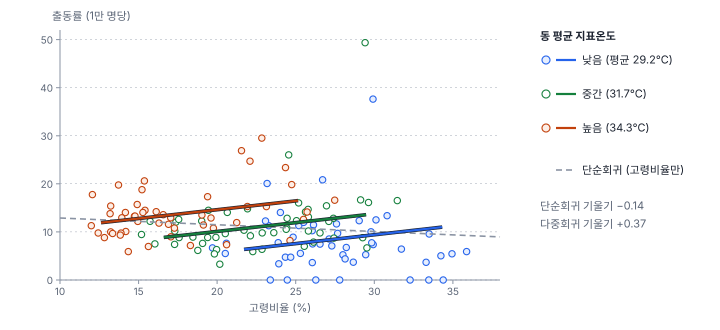
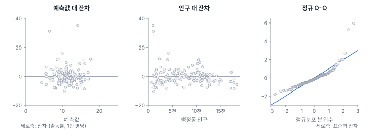
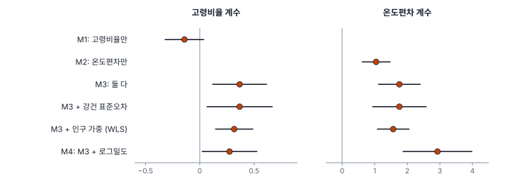

[목차](../README.md) · 이전: [7강 검정의 논리와 순열 검정](07-testing-and-permutation.md) · 다음: [9강 독립 가정이 깨질 때](09-when-independence-fails.md)

# 8강 회귀분석과 진단

> 앱 지원: ● 앱에서 따라 할 수 있음 (VIF와 가중최소제곱은 코드로 보충함) · 읽는 시간 약 45분

## 이 강에서 얻는 것

- 최소제곱 회귀(OLS)의 계수를 "다른 변수가 같을 때"의 차이로 해석하고, 변수를 빼면 계수가 어떻게 틀어지는지(누락 변수 편향) 설명할 수 있음
- 회귀의 가정을 알고, 잔차 그림과 검정(Jarque-Bera, Breusch-Pagan, Koenker-Bassett, White)으로 가정이 맞는지 점검할 수 있음
- 이분산과 다중공선성을 진단하고, 강건 표준오차, 가중최소제곱, 변수 중심화로 대응할 수 있음
- 최대우도와 AIC·AICc로 모형을 비교하고, 그 한계를 알 수 있음

## 들어가는 질문

3강에서 한빛시 행정동의 고령비율과 출동률의 상관계수가 −0.13(소수 셋째 자리까지 −0.125)이었음. 신입 연구원 I는 이를 회귀분석으로 확인했음.

> 출동률 = 14.31 − 0.141 × 고령비율 (p = 0.126)

"고령비율이 높은 동일수록 출동률이 오히려 낮은 경향이 있지만 유의하지는 않다." 그런데 선배 J가 동 평균 지표온도를 식에 함께 넣자 결과가 뒤집혔음.

> 출동률 = −0.23 + **0.367** × 고령비율 + 1.757 × 온도편차 (고령비율 p = 0.004, 온도편차 = 동 평균 지표온도 − 30)

같은 자료인데 고령비율의 효과가 음수에서 양수로 바뀌었음. 어느 쪽이 맞는가? 그리고 이 회귀식은 믿을 만한가? 이 강은 회귀분석을 읽고 점검하는 법을 다룸.

## 1. 최소제곱 회귀

**선형회귀**(linear regression)는 종속변수 y를 독립변수 x들의 일차식으로 설명함.

$$
y_i = \beta_0 + \beta_1 x_{1i} + \beta_2 x_{2i} + \cdots + \varepsilon_i
$$

β는 계수(coefficient), ε는 식으로 설명하지 못한 나머지인 **오차**(error)임. 계수를 자료에서 추정할 때는 관측값과 예측값의 차이, 즉 **잔차**(residual) e의 제곱합이 가장 작도록 정함. 이를 **최소제곱법**(OLS, ordinary least squares)이라 함.

### 손으로 해 보기: 점 다섯 개

x = 1, 2, 3, 4, 5와 y = 2, 4, 5, 4, 6에 직선을 맞춤. x의 평균은 3, y의 평균은 4.2임. 기울기는 x와 y의 편차 곱의 합을 x 편차 제곱합으로 나눈 것임.

$$
b = \frac{\sum (x_i - \bar{x})(y_i - \bar{y})}{\sum (x_i - \bar{x})^2} = \frac{8.0}{10.0} = 0.8, \qquad a = \bar{y} - b\bar{x} = 4.2 - 0.8 \times 3 = 1.8
$$

예측값은 2.6, 3.4, 4.2, 5.0, 5.8이고, 잔차는 −0.6, 0.6, 0.8, −1.0, 0.2로 합이 0임. 잔차 제곱합은 2.4, y의 전체 제곱합은 8.8이므로 **결정계수**(R²)는 1 − 2.4/8.8 = 0.727임. y의 흩어짐 가운데 73%를 x로 설명했다는 뜻임.

### 계수는 "다른 변수가 같을 때"의 차이

다중회귀의 계수 β₁은 **다른 독립변수가 같을 때** x₁이 1 커지면 y가 평균적으로 얼마나 달라지는지를 나타냄. 들어가는 질문의 두 번째 식은 "지표온도가 같은 동끼리 비교하면, 고령비율이 1%p 높은 동의 출동률이 1만 명당 0.367건 높음"으로 읽음. 첫 번째 식에는 지표온도가 없으므로 "지표온도가 다른 동끼리" 섞어서 비교한 것임.

여기서 **온도편차**는 동 평균 지표온도(1강의 존 통계 평균)에서 30을 뺀 값임. 30을 빼도 기울기는 그대로이고 절편만 "고령비율 0%이고 지표온도 30℃일 때의 값"으로 바뀜. 변수를 이렇게 기준값에서 빼 쓰는 것을 **중심화**(centering)라 하며, 5절에서 이 처리가 왜 도움이 되는지 봄.

## 2. 누락 변수 편향: 왜 부호가 뒤집혔는가



그림에서 지표온도가 높은 동(진한 점)은 왼쪽 위에, 낮은 동(옅은 점)은 오른쪽 아래에 몰려 있음. 한빛시에서 고령비율이 높은 동은 대개 외곽의 넓고 시원한 동이기 때문임(고령비율과 동 평균 지표온도의 상관계수 −0.75). 지표온도는 출동률을 높이므로, 고령비율만 넣으면 "고령비율이 높은 동 = 시원한 동"의 효과가 고령비율에 덧씌워짐. 온도 구간 안에서 보면(색 실선) 고령비율이 높을수록 출동률이 높음.

이렇게 y와 x 모두에 관련된 변수를 빠뜨려 계수가 틀어지는 것을 **누락 변수 편향**(omitted variable bias)이라 하고, 빠진 변수를 **교란 변수**(confounder)라 함. 단순회귀의 기울기는 정확히 다음처럼 나뉨.

$$
b_{\text{단순}} = b_{\text{고령}} + b_{\text{온도}} \times \delta = 0.367 + 1.757 \times (-0.289) = -0.141
$$

δ는 온도편차를 고령비율에 회귀한 기울기(−0.289)임. 고령비율의 효과(+0.367)가 "고령 동은 시원하다"는 경로(1.757 × −0.289 = −0.508)에 덮여 음수가 된 것임.

공간 자료에서는 교란 변수가 거의 언제나 **위치**와 얽혀 있음. 도심과 외곽, 해안과 내륙처럼 공간 구조가 여러 변수를 한꺼번에 움직이기 때문임. 그렇다고 두 번째 식이 참이라는 보장도 없음. 빠진 교란 변수가 더 있을 수 있고, 3강에서 본 것처럼 행정동 수준의 관계는 개인 수준의 관계와 다를 수 있음(생태학적 오류). 회귀계수를 인과 효과로 읽으려면 어떤 변수를 통제해야 하는지에 대한 이론이 먼저 있어야 함.

## 3. 회귀의 가정

OLS의 계수와 표준오차, p값이 제 뜻을 가지려면 다음 가정이 필요함.

| 가정 | 뜻 | 깨지면 |
|---|---|---|
| 선형성 | y와 x의 관계가 (변환 후) 직선임 | 계수가 관계를 잘못 요약함 |
| 독립성 | 오차끼리 서로 독립임 | 표준오차가 틀어짐 (9강, 24강) |
| 등분산성 | 오차의 분산이 모든 관측에서 같음 | 표준오차가 틀어짐 (4절) |
| 정규성 | 오차가 정규분포를 따름 | 작은 표본에서 p값이 부정확함 |
| 완전한 공선성 없음 | 한 x가 다른 x들의 일차식이 아님 | 계수를 구할 수 없음 (5절) |

계수 자체를 치우치지 않게 추정하는 데는 오차의 평균이 x와 관계없다는 가정(교란 변수가 빠지지 않음)이 가장 중요함. 등분산성·독립성·정규성은 주로 **표준오차와 p값**에 영향을 줌. 가정은 오차에 대한 것이지만 오차는 볼 수 없으므로, 잔차를 보고 점검함.

## 4. 잔차 진단



잔차 그림을 먼저 보고, 검정은 그다음에 봄.

- **예측값 대 잔차**: 잔차가 0 주위에 고르게 흩어져야 함. 곡선 모양이면 선형성이, 나팔 모양이면 등분산성이 의심됨. 위쪽에 멀리 떨어진 점 두 개가 다솜23동(잔차 35.2)과 다솜1동임
- **인구 대 잔차**: 모형에 없는 변수에 대해서도 그려 봄. 인구가 적은 동일수록 잔차가 크게 흩어짐. 인구 3천 명 미만 30개 동의 잔차 표준편차는 10.17, 나머지 120개 동은 4.32임. 6강에서 본 것처럼 인구가 적으면 출동률이 우연만으로 크게 흔들리기 때문임
- **정규 Q-Q 그림**: 잔차를 표준화해 정규분포의 분위수와 비교함. 점이 대각선 위에 있으면 정규분포에 가까움. 오른쪽 위에서 점이 크게 휘어 올라감. 잔차의 오른쪽 꼬리가 길다는 뜻임(잔차 왜도 2.59)

### 진단 검정

GeoStat의 OLS 결과에는 다음 검정이 나옴. 모두 귀무가설이 "가정이 맞음"이므로, p값이 작으면 가정이 깨졌다는 증거임.

| 검정 | 보는 것 | 값 | p |
|---|---|---|---|
| Jarque-Bera | 잔차의 정규성 (왜도와 첨도) | 1,062.7 | < 0.001 |
| Breusch-Pagan | 이분산 (정규 오차를 가정) | 32.50 | < 0.001 |
| Koenker-Bassett | 이분산 (정규 가정 없이) | 4.65 | 0.098 |
| White | 이분산 (x의 제곱과 곱까지) | 6.01 | 0.305 |

- **Jarque-Bera**(Jarque & Bera 1980)는 잔차가 정규분포와 크게 다르다고 말함. 정규성은 계수의 치우침과는 관계가 없고, 표본이 150개라 p값도 크게 틀어지지 않을 가능성이 큼. 다만 극단값 몇 개가 결과를 좌우하는지는 확인해야 함
- 이분산 검정 셋의 결론이 다름. **Breusch-Pagan**(Breusch & Pagan 1979)은 오차가 정규분포라고 가정하는데 이 자료는 정규성이 크게 깨져서, 정규 가정을 뺀 **Koenker-Bassett**(Koenker 1981, GeoDa와 PySAL이 쓰는 이름)가 더 믿을 만함. 그런데 Koenker-Bassett와 **White**(White 1980)는 잔차의 흩어짐이 **모형에 넣은 x**(GeoStat·GeoDa의 Breusch-Pagan과 Koenker-Bassett는 x의 제곱)에 따라 달라지는지만 봄. 흩어짐을 만드는 것은 모형에 없는 인구임. 잔차 제곱을 1/인구에 회귀해 같은 방식으로 검정하면 nR² = 24.39, p < 0.001로 이분산이 뚜렷함. **검정은 물어본 것에만 답함**. 그래서 그림이 먼저임

### 이분산에 대응하기

- **강건 표준오차**: 계수는 그대로 두고, 이분산에서도 맞도록 표준오차만 고쳐 계산함(White 1980). GeoStat의 **White 이분산 강건 표준오차** 선택 칸이 이것이며, 정확히는 White의 추정량에 n/(n − k)를 곱한 HC1임. 고령비율의 표준오차가 0.127에서 0.154로 커지고 p값은 0.004에서 0.018이 됨
- **가중최소제곱**(WLS, weighted least squares): 잔차의 분산이 작은(믿을 만한) 관측에 더 큰 무게를 줌. 출동률의 분산은 인구에 반비례하므로(6강) 인구로 가중하는 것이 자연스러움. 인구로 가중하면 고령비율 계수 0.317(표준오차 0.089), 온도편차 계수 1.567(0.252)이 됨. 앱에는 아직 없어 코드로 함
- **모형 바꾸기**: 출동률의 바탕은 건수이므로, 건수를 포아송분포로 보고 인구를 노출량으로 넣는 **포아송 회귀**가 더 알맞은 모형임. 27강에서 다룸



## 5. 다중공선성

독립변수끼리 강하게 상관되어 있으면 각 변수의 몫을 가려내기 어려움. 이를 **다중공선성**(multicollinearity)이라 함. 계수는 여전히 치우치지 않지만 표준오차가 커지고, 변수를 하나 넣고 빼는 데 따라 계수가 크게 흔들림.

### VIF

변수 x_j를 나머지 x들로 회귀했을 때의 결정계수를 R²_j라 하면, **분산 팽창 계수**(VIF)는 다음과 같음.

$$
\text{VIF}_j = \frac{1}{1 - R_j^2}
$$

VIF는 다른 x들과의 상관 때문에 계수의 분산이 몇 배로 커졌는지를 나타냄. 고령비율과 온도편차의 상관계수가 −0.7498이므로 둘의 VIF는 1/(1 − 0.7498²) ≈ 2.28임. 여기에 인구밀도의 로그(로그밀도)를 더하면(모형 M4), 로그밀도와 지표온도의 상관계수가 0.91이라 VIF가 온도편차 6.39, 로그밀도 6.55로 커짐. 그림에서 보듯 온도편차의 계수는 1.757에서 2.927로 크게 바뀌고, 표준오차도 0.330에서 0.540으로 커짐. 로그밀도의 계수는 −2.37로 "인구가 빽빽할수록 출동률이 낮다"처럼 보이지만, 지표온도와 거의 같은 정보를 나눠 가진 결과라 따로 해석하기 어려움. VIF가 5~10을 넘으면 주의하라는 경험 규칙이 흔히 쓰임.

### 조건수와 중심화

GeoStat은 VIF 대신 **조건수**(condition number, Belsley, Kuh & Welsch 1980)를 보여 줌. 설명변수 행렬이 얼마나 "거의 선형 종속"인지를 하나의 수로 나타낸 것으로, 30을 넘으면 다중공선성을 의심함. 그런데 조건수는 절편(상수항)과의 공선성도 함께 잼. 지표온도는 값이 25~36℃에 몰려 있어 상수항과 거의 평행한 열이 됨.

| 설명변수 | 조건수 |
|---|---|
| 고령비율 + 지표온도(그대로) | 58.77 |
| 고령비율 + 온도편차(30을 뺌) | 14.35 |
| 온도편차만 | 2.04 |

지표온도를 그대로 넣으면 조건수가 58.77로 기준을 넘지만, 30을 빼면 14.35로 떨어짐. 두 경우의 기울기와 그 표준오차는 완전히 같음(0.367, 1.757). 달라진 것은 절편뿐임. 고령비율도 평균을 빼서 넣으면 조건수는 2.64까지 떨어짐. 14.35의 대부분도 고령비율(평균 22.6%)이 상수항과 겹친 몫이었던 것임. 이런 "없어도 되는" 공선성은 변수를 중심화하면 사라지므로, 값의 범위가 0에서 먼 변수(기온, 연도, 해발고도)는 기준값을 빼서 넣는 것이 좋음. 변수끼리의 진짜 공선성(고령비율과 온도편차, 온도편차와 로그밀도)은 중심화해도 그대로임. 거꾸로, 앱의 조건수는 M4에서 14.41로 M3(14.35)와 거의 같아 M4의 공선성(VIF 6.4~6.6)을 드러내지 못함. 변수끼리의 공선성은 VIF로 봄.

대응은 다음 중에서 고름.

- 연구 질문에 필요한 변수만 넣음. 같은 것을 반영하는 변수(지표온도와 인구밀도는 둘 다 도시화 정도를 반영함)는 하나를 고르거나 연구 질문에 맞는 쪽을 씀
- 변수를 합쳐 지수를 만들거나, 주성분 분석 같은 방법으로 줄임
- 계수 하나하나보다 예측이 목적이라면 공선성을 그대로 두어도 됨

## 6. 변수 변환

값이 오른쪽으로 크게 치우친 변수는 로그를 취하면 관계가 직선에 가까워지고 잔차도 대칭에 가까워지는 경우가 많음(6강의 인구밀도). 로그를 취하면 해석도 바뀜.

| 형태 | 계수 b의 해석 |
|---|---|
| y ~ x | x가 1 커지면 y가 b만큼 달라짐 |
| log y ~ x | x가 1 커지면 y가 약 100 × b % 달라짐 (정확히는 e^b배) |
| y ~ log x | x가 1% 커지면 y가 약 b/100만큼 달라짐 |
| log y ~ log x | x가 1% 커지면 y가 약 b% 달라짐 (탄력성) |

출동률에는 0인 동이 7개 있어 그대로 로그를 취할 수 없음. 흔히 1을 더해 log(출동률 + 1)을 쓰는데, 이렇게 하면 Jarque-Bera가 1,062.7에서 138.9로 줄어 잔차가 정규분포에 조금 가까워짐(R²는 0.245지만 y가 달라 0.175와 비교할 수 없음, 아래 참고). 온도편차의 계수 0.183은 "지표온도가 1℃ 높으면 (출동률 + 1)이 약 20% 큼"으로 읽음. 다만 더한 1은 임의의 값이고 결과가 그 값에 따라 달라지므로, 건수 자료라면 포아송 회귀(27강)가 더 나은 선택임.

주의할 점이 하나 있음. **y를 변환한 모형과 변환하지 않은 모형은 R²나 AIC로 비교할 수 없음.** 설명하려는 대상 자체가 다르기 때문임.

## 7. 최대우도와 AIC·AICc

### 최대우도

**최대우도**(maximum likelihood)는 "이 모수라면 지금의 자료가 나올 확률(가능도, likelihood)이 얼마인가"를 계산해, 그 값이 가장 큰 모수를 추정값으로 고르는 방법임. 오차가 정규분포일 때 OLS의 계수는 최대우도 추정값과 같음. 회귀 결과의 **로그우도**(log-likelihood)는 그 가장 큰 가능도에 로그를 취한 값으로, 클수록 모형이 자료에 잘 맞음. 공간회귀(25~26강)처럼 보통의 최소제곱으로는 제대로 추정할 수 없는 모형은 최대우도로 추정하므로, 이 개념이 뒤에서 자주 나옴.

### AIC와 AICc

변수를 더하면 로그우도는 줄지 않으므로(R²도 마찬가지), 적합도만으로 모형을 고르면 변수가 많은 모형이 늘 이김. **AIC**(Akaike 1974)는 모수 수 K만큼 벌점을 줌.

$$
\text{AIC} = -2\,\text{LL} + 2K, \qquad \text{AICc} = -2\,\text{LL} + \frac{2Kn}{n - K - 1}
$$

AIC가 작을수록 좋은 모형임. **AICc**(Hurvich & Tsai 1989)는 표본이 작을 때 벌점을 키운 보정판이며, n이 K에 비해 충분히 크면 AIC와 거의 같아짐. 같은 y, 같은 관측치로 적합한 모형끼리만 비교함.

| 모형 | 설명변수 | R² | 로그우도 | AICc | ΔAICc |
|---|---|---|---|---|---|
| M1 | 고령비율 | 0.016 | −492.30 | 990.77 | 29.55 |
| M2 | 온도편차 | 0.128 | −483.20 | 972.56 | 11.34 |
| M3 | 고령비율 + 온도편차 | 0.175 | −479.06 | 966.40 | 5.18 |
| M4 | M3 + 로그밀도 | 0.214 | −475.40 | 961.22 | 0 |

AICc의 차이(ΔAICc)가 2 안이면 두 모형을 비슷하게 지지하고, 10을 넘으면 뒤처진 모형은 지지를 거의 받지 못한다고 봄(Burnham & Anderson 2002). AICc는 M4를 고르지만, 5절에서 본 것처럼 M4의 계수는 공선성 때문에 하나하나 해석하기 어려움. **AIC는 예측을 잘하는 모형을 고르는 기준이지, 계수를 해석하기 좋은 모형이나 참 모형을 고르는 기준이 아님.**

GeoStat의 OLS 결과에서 **AIC**는 계수의 수(상수 포함)를 K로, **AICc**는 계수에 오차 분산 σ²까지 더한 수를 K로 셈. 그래서 같은 모형에서 AIC와 AICc를 서로 비교하면 안 되고, 모형끼리 비교할 때는 한 기준만 씀. **모형 비교** 카드는 AICc를 씀.

### 잔차의 공간 자기상관

공간 자료의 회귀에서는 마지막으로 잔차가 공간적으로 닮았는지 봄. 닮았다면 오차의 독립 가정이 깨진 것이고, 표준오차가 틀어짐(9강). M3의 잔차 Moran's I는 −0.030이고 결과 카드의 진단 표에 나오는 p값(정규 근사, 양측)은 0.787임. 모형 비교 카드의 p값 0.302는 순열 999번으로 구한 단측 유사 p값이라 다름. 두 값 모두 공간 자기상관이 뚜렷하지 않다는 결론은 같고, GeoStat은 "LM 검정상 공간 의존성이 뚜렷하지 않음 → OLS로 충분할 수 있음"이라고 알려 줌. 이 판단 절차는 24강에서 다룸.

## 해 보기: GeoStat에서 회귀분석하고 진단하기

1. `hanbit_dong.gpkg`, `hanbit_events.gpkg`, `hanbit_lst.tif`를 열고 `hanbit_dong`을 고름. 1강처럼 점 집계로 `PT_CNT`를, **공간 분석 → 존 통계 (래스터 → 폴리곤)…** 메뉴로 `hanbit_lst`의 평균 `ZS_MEAN`을 만듦
2. **공간 분석 → 계산 필드 추가…** 메뉴로 다음 세 변수를 만듦
   - `출동률` = `` `PT_CNT` / `인구` * 10000 ``
   - `고령비율` = `` `고령인구` / `인구` * 100 ``
   - `온도편차` = `` `ZS_MEAN` - 30 ``
3. 4강처럼 **퀸 인접 (Queen)** 공간가중치를 만듦
4. **공간 분석 → 회귀 분석 (OLS · 공간회귀 · GWR · MGWR)…** 메뉴를 엶. 모형 **OLS (최소제곱)**, 종속변수 (y) `출동률`, 독립변수 `고령비율`만 고르고, 결과 열 접두어를 `M1`으로 바꿔 **실행**을 누름. 접두어가 같으면 앞의 결과가 지워지므로 모형마다 다른 접두어를 씀
   - 확인: 오른쪽 결과 패널에 고령비율 계수 −0.1409, p 0.126, R² 0.01573이 나옴
5. 회귀 분석 창을 다시 엶(설정이 처음으로 돌아가 있음). 종속변수 (y) `출동률`, 독립변수 `고령비율`과 `온도편차`를 고르고, 결과 열 접두어 `M3`으로 실행함
   - 확인: 고령비율 계수 0.367(p 0.004), 온도편차 계수 1.757(p < 0.001), R² 0.175, 조건수 14.35. 진단 표에 Jarque-Bera, Breusch-Pagan, Koenker-Bassett, White가 나옴
   - 확인: **모형 비교** 카드가 나타나 AICc 990.77(첫 모형)과 966.398(두 번째 모형)을 나란히 보여 주고, 두 번째 모형에 **최적** 표시가 붙음
6. 실행이 끝나면 지도가 잔차 `M3_RESID`의 표준편차 지도로 바뀜
   - 확인: "> +2σ" 계급에 다솜1동, 다솜19동, 다솜23동, 라온6동 4개가 있고, "< -2σ" 계급은 비어 있음
7. **+ 산점도** 단추로 X 변수 `인구`, Y 변수 `M3_RESID`를 추가함. 인구가 적은 왼쪽에서 잔차가 크게 흩어지는지 확인함
8. 회귀 분석 창을 다시 열어 5번과 같이 고르고, **White 이분산 강건 표준오차** 선택 칸을 켠 뒤 결과 열 접두어 `M3W`로 실행함
   - 확인: 계수는 그대로이고, 고령비율의 표준오차가 0.1537, p가 0.018로 바뀜. 강건 표준오차를 쓰면 진단 표에서 White 검정은 빠짐
9. (선택) 계산 필드 `로그밀도c` = `` log(`인구` / `면적_km2`) - 8 ``을 만듦. 로그밀도의 평균이 8 근처라 8을 빼서 중심화함(5절). 회귀 분석 창에서 5번의 두 변수에 `로그밀도c`를 더해 접두어 `M4`로 실행함
   - 확인: 온도편차 계수가 2.927로 커지고 로그밀도c 계수는 −2.371임. 모형 비교 카드의 AICc는 961.217로 가장 작음

### 코드로: VIF와 가중최소제곱

```python
import geopandas as gpd
import numpy as np
from rasterstats import zonal_stats   # pip install rasterstats

dong = gpd.read_file("book/data/hanbit_dong.gpkg")
ev = gpd.read_file("book/data/hanbit_events.gpkg")
dong["건수"] = gpd.sjoin(ev, dong, predicate="within").groupby("index_right").size() \
    .reindex(dong.index, fill_value=0)
dong["지표온도"] = [z["mean"] for z in zonal_stats(dong, "book/data/hanbit_lst.tif", stats="mean")]
y = (dong["건수"] / dong["인구"] * 10000).to_numpy()
x1 = (dong["고령인구"] / dong["인구"] * 100).to_numpy()
x2 = dong["지표온도"].to_numpy() - 30
X = np.column_stack([np.ones(len(y)), x1, x2])

# VIF: x가 둘이면 나머지 x로 회귀한 R²_j가 두 변수의 상관계수 제곱과 같음
r = np.corrcoef(x1, x2)[0, 1]
print(f"VIF = {1 / (1 - r ** 2):.2f}")

# 인구로 가중한 최소제곱
w = np.sqrt(dong["인구"].to_numpy())
b, *_ = np.linalg.lstsq(X * w[:, None], y * w, rcond=None)
e = y * w - (X * w[:, None]) @ b
se = np.sqrt(np.diag(e @ e / (len(y) - 3) * np.linalg.inv((X * w[:, None]).T @ (X * w[:, None]))))
print("WLS 계수", b.round(3), "표준오차", se.round(3))
```

- 확인: `VIF = 2.28`, `WLS 계수 [0.792 0.317 1.568] 표준오차 [2.366 0.089 0.252]`. `rasterstats`의 존 통계는 셀을 중심점으로 판정하므로 GeoStat(면적 가중)과 소수 둘째 자리가 조금 다를 수 있음

## 헷갈리는 쌍

- **오차 vs 잔차**: 오차는 참 모형에서 설명되지 않는 부분(볼 수 없음), 잔차는 추정한 모형의 관측값 − 예측값(볼 수 있음)
- **단순회귀 계수 vs 다중회귀 계수**: 단순회귀는 다른 변수를 섞은 비교, 다중회귀는 다른 변수가 같을 때의 비교임
- **Breusch-Pagan vs Koenker-Bassett**: 둘 다 이분산 검정이지만, Breusch-Pagan은 정규 오차를 가정하고 Koenker-Bassett는 그렇지 않음. 잔차가 정규분포가 아니면 Koenker-Bassett를 봄
- **강건 표준오차 vs 가중최소제곱**: 강건 표준오차는 계수를 두고 표준오차만 고침. 가중최소제곱은 믿을 만한 관측에 무게를 더 줘서 계수도 다시 추정함
- **VIF vs 조건수**: VIF는 변수 하나하나의 공선성을, 조건수는 설명변수 전체(상수항 포함)의 공선성을 봄. 조건수는 중심화하지 않은 변수에서 크게 나옴
- **R² vs AIC**: R²는 변수를 더하면 늘 커지고, AIC는 모수 수만큼 벌점을 줌. 둘 다 같은 y를 쓴 모형끼리만 비교함

## 흔한 실수와 심사 지적

- **단순회귀 결과를 인과 효과로 해석함**
  - 지적: "교란 변수(예: 지표온도, 도시화 정도)를 통제하였습니까?"
  - 대응: 이론에 근거해 교란 변수를 넣고, 통제 전후의 계수를 함께 보여 줌
- **잔차 진단 없이 계수와 p값만 보고함**
  - 지적: "회귀 가정의 충족 여부를 제시하십시오."
  - 대응: 잔차 그림과 정규성·이분산 검정 결과를 적음
- **비율 자료의 이분산을 무시함**
  - 결과: 인구가 적은 구역의 흔들림이 표준오차를 틀어지게 함
  - 대응: 강건 표준오차나 인구 가중을 쓰거나, 건수 모형(포아송 회귀)을 씀
- **서로 강하게 상관된 변수를 함께 넣고 계수를 하나하나 해석함**
  - 지적: "VIF를 제시하고 다중공선성 문제를 논하십시오."
  - 대응: VIF를 보고하고, 같은 개념의 변수는 하나를 고르거나 합침
- **중심화하지 않은 변수로 조건수가 커졌는데 변수를 뺌**
  - 대응: 기준값을 빼서 다시 보고, 그래도 크면 변수끼리의 공선성을 따짐
- **y를 변환한 모형과 변환하지 않은 모형을 R²나 AIC로 비교함**
  - 대응: 같은 y를 쓴 모형끼리만 비교함

## 보고서에는 이렇게 씀

> 행정동별 출동률(인구 1만 명당)을 종속변수로, 고령비율(%)과 동 평균 지표온도(30℃ 기준 편차)를 독립변수로 한 최소제곱 회귀모형을 추정하였다(n = 150, R² = 0.175). 지표온도를 통제하면 고령비율이 1%p 높을수록 출동률이 0.367건 높았으며(White(HC1) 강건 표준오차 0.154, p = 0.018), 지표온도를 통제하지 않은 모형에서는 고령비율의 계수가 음수였다(−0.141, p = 0.126). 잔차는 오른쪽으로 치우쳤고(Jarque-Bera = 1,062.7, p < 0.001) 인구가 적은 행정동일수록 분산이 컸으므로 이분산 강건 표준오차를 사용하였으며, 인구 가중 최소제곱 추정에서도 결론은 같았다(고령비율 계수 0.317, 표준오차 0.089). 두 독립변수의 VIF는 2.28이었고, 잔차의 공간 자기상관은 유의하지 않았다(Moran's I = −0.030, 정규 근사 p = 0.787).

적어야 할 항목은 다음과 같음.

- 종속변수와 독립변수의 정의·단위, 변환·중심화 여부
- 계수, 표준오차(어떤 방식인지), p값 또는 신뢰구간, R²
- 교란 변수를 어떻게 골랐는지
- 잔차 진단(정규성, 이분산, 공간 자기상관)과 그 대응, 다중공선성(VIF)
- 모형을 비교했다면 기준(AICc 등)과 비교한 모형들

## 요약

- OLS는 잔차 제곱합을 가장 작게 하는 계수를 고름. 다중회귀의 계수는 "다른 변수가 같을 때"의 차이임
- 교란 변수를 빠뜨리면 계수가 틀어지며 부호까지 뒤집힐 수 있음. 한빛시의 고령비율 계수는 지표온도를 통제하면 −0.141에서 +0.367이 됨
- 회귀의 가정(선형성, 독립성, 등분산성, 정규성)은 잔차 그림으로 먼저 점검하고, 검정은 물어본 것에만 답한다는 점을 기억함
- 이분산에는 강건 표준오차, 가중최소제곱, 알맞은 분포의 모형으로 대응함
- 다중공선성은 VIF로 진단함. 조건수는 중심화하지 않은 변수에서 부풀려지므로, 기준값을 빼서 넣음
- AIC·AICc는 같은 y의 모형끼리 비교하며, 예측을 잘하는 모형을 고르는 기준이지 해석하기 좋은 모형의 기준이 아님

## 핵심 용어

| 한글 | 영문 | 비고 |
|---|---|---|
| 최소제곱법 | Ordinary Least Squares (OLS) | |
| 계수 / 절편 | Coefficient / Intercept | |
| 잔차 / 오차 | Residual / Error | |
| 결정계수 | Coefficient of Determination (R²) | |
| 누락 변수 편향 | Omitted Variable Bias | |
| 교란 변수 | Confounder | |
| 등분산성 / 이분산성 | Homoskedasticity / Heteroskedasticity | |
| 정규 Q-Q 그림 | Normal Q-Q Plot | |
| 강건 표준오차 | Robust (Heteroskedasticity-consistent) Standard Error | White 1980 |
| 가중최소제곱 | Weighted Least Squares (WLS) | |
| 다중공선성 | Multicollinearity | |
| 분산 팽창 계수 | Variance Inflation Factor (VIF) | |
| 조건수 | Condition Number | 30 넘으면 주의 |
| 중심화 | Centering | 기준값을 뺌 |
| 최대우도 / 로그우도 | Maximum Likelihood / Log-likelihood | |
| 아카이케 정보 기준 | Akaike Information Criterion (AIC) / corrected AIC (AICc) | 작을수록 좋음 |

## 원전과 더 읽을거리

**원전**

- Akaike, H. (1974). A new look at the statistical model identification. *IEEE Transactions on Automatic Control*, 19(6), 716–723. AIC
- Breusch, T. S., & Pagan, A. R. (1979). A simple test for heteroscedasticity and random coefficient variation. *Econometrica*, 47(5), 1287–1294. 이분산 검정
- White, H. (1980). A heteroskedasticity-consistent covariance matrix estimator and a direct test for heteroskedasticity. *Econometrica*, 48(4), 817–838. 강건 표준오차와 White 검정
- Jarque, C. M., & Bera, A. K. (1980). Efficient tests for normality, homoscedasticity and serial independence of regression residuals. *Economics Letters*, 6(3), 255–259. 정규성 검정
- Belsley, D. A., Kuh, E., & Welsch, R. E. (1980). *Regression Diagnostics: Identifying Influential Data and Sources of Collinearity*. Wiley. 조건수
- Koenker, R. (1981). A note on studentizing a test for heteroscedasticity. *Journal of Econometrics*, 17(1), 107–112. 정규 가정 없는 이분산 검정 (GeoDa·PySAL의 Koenker-Bassett 검정)
- Hurvich, C. M., & Tsai, C.-L. (1989). Regression and time series model selection in small samples. *Biometrika*, 76(2), 297–307. AICc

**더 읽을거리**

- Burnham, K. P., & Anderson, D. R. (2002). *Model Selection and Multimodel Inference* (2nd ed.). Springer. AIC로 모형을 비교하는 법
- Anselin, L., & Rey, S. J. (2014). *Modern Spatial Econometrics in Practice: A Guide to GeoDa, GeoDaSpace and PySAL*. GeoDa Press. GeoDa·PySAL의 회귀 진단을 읽는 법

## 연습

1. 점 네 개 (x, y) = (0, 1), (1, 3), (2, 2), (3, 6)에 최소제곱 직선을 맞추고, 잔차와 R²를 구하시오.

2. 2절의 식 b단순 = b고령 + b온도 × δ에서, 만약 고령비율이 높은 동이 오히려 더운 동(δ > 0)이었다면 단순회귀의 기울기는 다중회귀의 기울기보다 커지는가, 작아지는가?

3. 두 독립변수의 상관계수가 0.9, 0.95, 0.99일 때 VIF를 각각 구하시오. 표준오차는 상관이 없을 때에 비해 몇 배가 되는가? (표준오차는 √VIF배)

4. 어떤 연구자가 연도(2001~2025)를 독립변수로 넣었더니 조건수가 500이 넘었음. 무엇이 원인이며 어떻게 고치면 되는가? 고쳤을 때 연도의 기울기는 바뀌는가?

5. 모형 A(y = 출동률)의 AIC는 964, 모형 B(y = log(출동률 + 1))의 AIC는 265였음. "B의 AIC가 훨씬 작으므로 B가 더 좋은 모형이다"라는 주장의 문제를 설명하시오.

<details>
<summary>해답</summary>

1. x의 평균 1.5, y의 평균 3. 편차 곱의 합 = (−1.5)(−2) + (−0.5)(0) + (0.5)(−1) + (1.5)(3) = 3 + 0 − 0.5 + 4.5 = 7, x 편차 제곱합 = 2.25 + 0.25 + 0.25 + 2.25 = 5. 기울기 b = 7/5 = 1.4, 절편 a = 3 − 1.4 × 1.5 = 0.9. 예측값 0.9, 2.3, 3.7, 5.1이므로 잔차는 0.1, 0.7, −1.7, 0.9(합 0). 잔차 제곱합 0.01 + 0.49 + 2.89 + 0.81 = 4.2, 전체 제곱합 4 + 0 + 1 + 9 = 14, R² = 1 − 4.2/14 = 0.7.

2. b온도이 양수(1.757)이고 δ도 양수라면 b온도 × δ가 양수이므로, 단순회귀의 기울기가 다중회귀의 기울기(0.367)보다 **커짐**. 이때 단순회귀는 고령비율의 효과를 과대평가함. 교란 변수가 y와 x 모두에 같은 방향으로 관련되면 과대, 반대 방향이면 과소 추정됨.

3. VIF = 1/(1 − r²): r = 0.9이면 1/0.19 = 5.26, 0.95이면 1/0.0975 = 10.3, 0.99이면 1/0.0199 = 50.3. 표준오차는 √VIF배이므로 2.29배, 3.20배, 7.09배.

4. 연도 값(2001~2025)이 0에서 멀고 좁은 범위에 몰려 있어 상수항과 거의 평행한 열이 되었기 때문임. 기준 연도를 빼서(예: 연도 − 2001, 또는 연도 − 2013) 넣으면 조건수가 크게 줄어듦. 기울기는 바뀌지 않고 절편의 뜻만 "기준 연도의 값"으로 바뀜.

5. 두 모형은 종속변수가 다르므로(출동률과 log(출동률 + 1)) 로그우도와 AIC를 그대로는 비교할 수 없음. B의 AIC가 작게 나온 것은 로그를 취해 y의 척도(흩어짐)가 작아져 확률밀도 값이 커졌기 때문임. 실제로 변환에 따른 보정(야코비안, 2 × Σlog(y + 1))을 더해 원래 척도로 옮기면 B의 AIC는 964.6으로 A(964.1)와 비슷함. 같은 y를 쓴 모형끼리만 AIC로 비교하고, y를 바꾼 모형은 잔차 진단이나 원래 척도로 되돌린 예측 오차 등으로 비교함.

</details>

---

[목차](../README.md) · 이전: [7강 검정의 논리와 순열 검정](07-testing-and-permutation.md) · 다음: [9강 독립 가정이 깨질 때](09-when-independence-fails.md)
