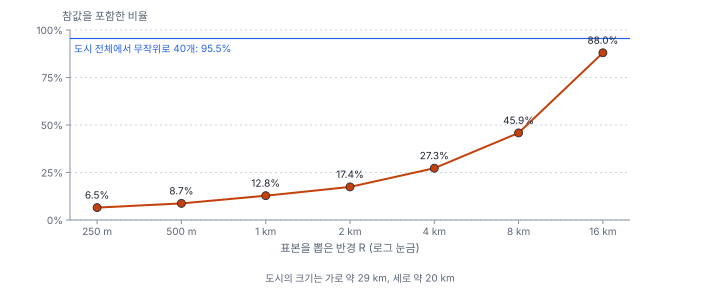
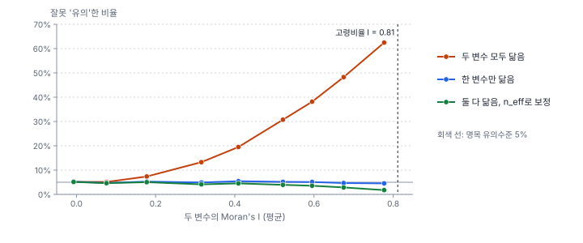

[목차](../README.md) · 이전: [8강 회귀분석과 진단](08-regression-and-diagnostics.md) · 다음: [10강 이웃 정하기: 공간가중치](10-spatial-weights.md)

# 9강 독립 가정이 깨질 때

> 앱 지원: ○ 코드(Python)로 실습함 · 읽는 시간 약 35분

## 이 강에서 얻는 것

- 서로 닮은 관측값은 개수만큼의 정보를 담지 않는다는 것을 알고, 유효 표본 크기를 계산할 수 있음
- 공간 자기상관이 있는 자료에 보통의 신뢰구간과 t검정을 쓰면 무엇이 틀어지는지 모의 실험으로 설명할 수 있음
- 의사반복을 알아보고 피할 수 있음
- 공간 의존성을 다루는 방법들이 이 책의 어느 강에 나오는지 알고, 3부로 넘어갈 준비를 함

## 들어가는 질문

한빛시 연구원 K는 3강과 8강에서 쓴 행정동 자료가 150개뿐이라 검정력이 약하다고 생각했음. 그래서 행정동의 고령비율과 출동률을 100 m 격자 셀에 옮겨 담아, 셀 45,396개로 상관을 다시 구했음.

| 분석 단위 | 개수 | 상관계수 | p값 |
|---|---|---|---|
| 행정동 | 150 | −0.125 | 0.126 |
| 100 m 셀 | 45,396 | −0.106 | 7.5 × 10⁻¹¹³ |

상관계수는 거의 같은데 p값은 "유의하지 않음"에서 "의심할 여지 없음"으로 바뀌었음. 자료가 300배 늘었으니 증거도 그만큼 강해진 것인가?

그렇지 않음. 셀 하나하나는 새로운 관측이 아니라, 행정동 값을 평균 303번씩 **복사한** 것임. 6~8강의 표준오차, 신뢰구간, t검정은 모두 "관측값이 서로 독립"이라는 가정 위에 있었음. 이 강은 그 가정이 깨지면 무슨 일이 생기는지 보고, 공간통계가 따로 필요한 이유를 정리함.

## 1. 닮은 관측은 정보가 적음

서로 독립인 관측 n개의 평균은 표준오차가 σ/√n임(6강). 그런데 관측값끼리 닮았으면, 하나를 알면 나머지를 어느 정도 짐작할 수 있으므로 새로 알게 되는 정보가 줄어듦. 극단적으로, 같은 값을 100번 복사하면 관측은 100개지만 정보는 1개뿐임.

이를 수로 나타낸 것이 **유효 표본 크기**(effective sample size, n_eff)임. 관측 n개가 담은 정보가 독립인 관측 몇 개와 같은지를 뜻함. 모든 관측 쌍의 상관이 ρ로 같다면 평균의 분산은 다음과 같음.

$$
\operatorname{Var}(\bar{x}) = \frac{\sigma^2}{n}\bigl[1 + (n-1)\rho\bigr]
\quad\Longrightarrow\quad
n_{\text{eff}} = \frac{n}{1 + (n-1)\rho}
$$

### 손으로 해 보기: 관측소 48곳

관측소 48곳의 기온이 서로 조금씩 닮았다고 하고, 쌍마다 상관이 같다고 두면 다음과 같음.

| 관측소 쌍의 평균 상관 ρ | n_eff | 표준오차 배수 (독립 대비) |
|---|---|---|
| 0 | 48 | 1배 |
| 0.02 | 24.7 | 1.39배 |
| 0.1 | 8.4 | 2.39배 |
| 0.3 | 3.2 | 3.89배 |

평균 상관이 0.1만 되어도 관측소 48곳의 정보는 독립인 관측 8.4개 분량임. 6강에서 구한 관측소 기온의 95% 신뢰구간(24.54~25.00℃)은 관측소가 독립이라고 보고 만든 것이라, 실제로는 이보다 넓어야 할 수 있음. 공간 자료에서는 가까운 쌍은 상관이 크고 먼 쌍은 작으므로 ρ가 쌍마다 다르지만, 생각은 같음. 분산이 모두 같다면, 자기 자신(ρᵢᵢ = 1)을 포함한 모든 (i, j) 조합의 상관을 더해 다음처럼 구함. 이는 위 식에서 ρ를 쌍 상관의 평균으로 바꾼 것과 같음.

$$
n_{\text{eff}} = \frac{n^2}{\sum_{i}\sum_{j} \rho_{ij}}
$$

## 2. 모여 있는 표본은 참값을 놓침

한빛시 지표온도는 가까울수록 크게 닮았음. 50 m 떨어진 셀끼리의 상관은 0.95, 1 km 떨어지면 0.79, 4 km 떨어져도 0.33임. 6강에서는 도시 전체에서 셀 40개를 무작위로 뽑아 95% 신뢰구간을 만들었고, 구간의 약 95%가 참 평균을 포함했음. 이번에는 40개를 **반경 R 안에서만** 뽑아 봄. 한 동네에 관측소를 몰아 설치한 상황임.



| 표본을 뽑은 범위 | 참 평균을 포함한 비율 | 평균 구간 폭 |
|---|---|---|
| 도시 전체에서 무작위 | 95.5% | 1.46℃ |
| 반경 8 km | 45.9% | 1.37℃ |
| 반경 2 km | 17.4% | 0.83℃ |
| 반경 500 m | 8.7% | 0.48℃ |
| 반경 250 m | 6.5% | 0.39℃ |

표본이 한곳에 모일수록 두 가지가 동시에 일어남.

- **구간이 좁아짐**: 표본 표준편차는 동네 **안**의 변동만 담고, 동네마다 평균이 다른 변동은 담지 못함. 공식은 40개가 독립이라고 보고 √40으로 나누므로, 실제 흔들림보다 훨씬 좁은 구간이 나옴. 자료가 "확실하다"고 말함
- **참값을 놓침**: 모인 40개의 평균은 그 동네의 온도일 뿐이고, 어느 동네를 골랐느냐에 따라 크게 달라짐. 이 흔들림(표본평균의 실제 표준오차)이 공식의 표준오차보다 훨씬 큼. 반경 8 km 표본은 구간 폭(1.37℃)이 무작위 표본(1.46℃)과 거의 같은데도 참값을 절반 넘게 놓침. 반경 250 m 표본의 구간은 열에 아홉 넘게 참값을 놓침

반대로 도시 전체에서 무작위로 뽑은 40개가 95.5%로 제대로 동작한 이유도 여기서 알 수 있음. 지표온도가 닮아 있어도, 셀을 모집단 전체에서 무작위로 뽑으면 뽑힌 셀들은 **뽑는 방법 덕분에** 서로 독립임(6강). 문제는 표본이 무작위가 아니라 한곳에 모여 있거나, 관측소처럼 정해진 자리에 있을 때임. 설계에 기대는 추론과 모형에 기대는 추론의 차이는 38강에서 다룸.

**좁은 구간이 틀린 자리에 놓이는** 것, 이것이 독립 가정이 깨졌을 때 가장 위험한 모습임. 자신 있게 틀림. 관측소, 조사 지점, 채집 지점을 어떻게 배치하느냐가 결과를 좌우하는 이유이며, 표본 배치는 38강에서 다룸.

## 3. 두 변수가 모두 닮으면 가짜 상관이 생김

0강에서 두 변수가 모두 공간적으로 닮았으면 아무 관계가 없어도 유의한 상관이 자주 나오고, 둘 중 하나라도 무작위이면 검정이 거의 제대로 동작한다고 했음. 이를 모의 실험으로 확인함.

한빛시 행정동 150개 위에 **서로 아무 관계가 없는** 두 변수 x, y를 만듦. 각 변수는 이웃끼리 닮도록 공간 자기회귀 과정 x = (I − ρW)⁻¹ε로 만들었음. 여기서 ρ는 1절의 쌍 상관과 다른 뜻으로, 이웃끼리 닮은 정도를 정하는 모수임(표에는 SAR ρ로 적음). W는 4강의 퀸 인접 가중치(행 표준화), ε는 서로 독립인 정규 난수이고, ρ가 클수록 이웃끼리 더 닮음. x와 y는 따로 만들었으므로 참 상관은 0임. 여기에 보통의 상관 t검정(α = 0.05)을 해서 "유의하다"는 결론이 몇 번 나오는지 셈. 결론이 나오면 모두 틀린 것임.



| SAR ρ | 두 변수의 Moran's I (평균) | 잘못 유의 (둘 다 닮음) | 한쪽만 닮음 | 상관의 n_eff | n_eff로 보정 |
|---|---|---|---|---|---|
| 0 | −0.01 | 5.1% | 5.2% | 150 | 5.1% |
| 0.6 | 0.32 | 13.3% | 4.9% | 87.2 | 4.1% |
| 0.8 | 0.52 | 30.7% | 5.2% | 40.1 | 3.9% |
| 0.9 | 0.67 | 48.2% | 4.7% | 19.0 | 2.9% |
| 0.95 | 0.78 | 62.5% | 4.5% | 10.2 | 1.8% |

세 가지를 읽을 수 있음.

- 두 변수가 모두 이웃끼리 닮을수록 1종 오류가 5%에서 크게 부풀려짐. Moran's I가 0.78이면 **아무 관계가 없는 두 변수의 상관이 62.5%의 확률로 "유의"하게 나옴**. 한빛시 고령비율의 Moran's I는 0.81로 이보다도 큼(7강). 다만 출동률은 0.09로 약하므로, 이 두 변수의 상관 검정에서는 부풀림이 작음. 0강의 격자 실험(관측 400개)보다 같은 Moran's I에서 부풀림이 큰 것은 관측 수와 이웃 구조가 달라서임. 부풀림은 Moran's I만으로 정해지지 않으므로 유효 표본 크기를 계산해야 함
- **한 변수만 닮았으면 문제가 없음**(4.5~5.4%). 상관의 표준오차를 부풀리는 것은 x의 닮음과 y의 닮음이 **겹치는** 부분이기 때문임. 그래서 회귀에서는 y 자체보다 **잔차**가 닮았는지를 봄(8강, 24강)
- 클리퍼드, 리처드슨, 에몽(Clifford, Richardson & Hémon 1989)이 제안하고 뒤틸뢸(Dutilleul 1993)이 다듬은 **수정 t검정**은 두 변수의 공간 구조로 상관의 유효 표본 크기를 구해 t검정의 자유도를 바꿈. 보정하면 1종 오류가 5% 이하로 돌아옴. 다만 닮음이 아주 강하면 5%보다 뚜렷이 작아져 보수적이 됨(SAR ρ = 0.95에서 1.8%). 이 실험에서는 참 공간 구조를 알고 보정했지만, 실제 자료에서는 두 변수의 공간 구조를 자료에서 추정해야 함. 같은 SAR ρ = 0.95에서도 평균의 n_eff는 3.3, 상관의 n_eff는 10.2로, 유효 표본 크기는 어떤 통계량이냐에 따라 다름

이 결과는 상관계수 자체가 틀렸다는 뜻이 아님. 상관계수의 **표준오차와 p값**이 틀렸다는 뜻임. 150개의 닮은 값은 독립인 값 150개보다 훨씬 적은 정보를 담고 있는데(ρ = 0.95이면 상관에 대해 약 10개 분량), t검정은 150개 분량의 정보가 있다고 보고 계산함.

## 4. 의사반복

들어가는 질문의 셀 분석은 **의사반복**(pseudoreplication, Hurlbert 1984)의 대표적인 예임. 원래 야외 실험 설계에서 나온 말을 공간 자료로 넓혀 씀. 의사반복은 서로 독립이 아닌 관측을 독립인 반복처럼 세는 것임. 공간 자료에서 흔한 형태는 다음과 같음.

- **면 자료를 격자나 화소로 옮김**: 행정동 값을 셀 45,396개에 복사하면, 셀 수는 늘어도 독립인 정보는 행정동 150개를 넘지 못함. 오히려 셀이 많은 넓은 동이 더 큰 무게를 받아, 결과가 면적으로 가중한 다른 상관(−0.125가 아니라 −0.106)이 됨
- **래스터 화소를 모두 관측으로 셈**: 위성 영상의 화소 수백만 개로 두 지역을 비교하면, 차이가 아무리 작아도 p값이 0에 가까워짐. 한빛시 지표온도의 인접 셀 상관이 0.95였듯이(2절) 이웃 화소는 강하게 닮기 쉬우므로 화소 수가 곧 정보의 양은 아님
- **한 지점을 여러 번 잰 것을 여러 지점처럼 셈**: 같은 관측소의 매일 기온 90개는 관측소 90곳이 아님
- **처리가 구역 단위로 주어졌는데 개인 단위로 분석함**: 구 단위로 시행된 정책의 효과를 주민 수십만 명의 자료로 검정하면, 실제 처리 단위(구 5개)보다 훨씬 많은 정보가 있는 것처럼 계산됨

피하는 원칙은 하나임. **독립적으로 정해지거나 처리된 단위가 무엇인지 먼저 묻고, 그 단위로 분석하거나 그 구조를 모형에 넣음.**

## 5. 그러면 어떻게 하는가

공간 의존성은 피해야 할 골칫거리이기만 한 것이 아님. 가까운 것끼리 닮는 것은 공간 현상의 본질이며(토블러의 제1법칙), 그 자체가 연구 대상이기도 함. 이 책의 나머지 대부분이 이를 다루는 방법임.

| 하려는 일 | 방법 | 다루는 곳 |
|---|---|---|
| 닮았는지 먼저 확인 | Moran's I, 코렐로그램 | 11강 |
| 어디서 닮았는지 찾기 | LISA, Gi* | 12~13강 |
| 가까움을 정의하기 | 공간가중치 | 10강 |
| 회귀에 공간 의존을 넣기 (파급, 오차의 공간 구조) | 공간시차·공간오차 모형 | 24~26강 |
| 회귀에서 공간 구조를 걸러 내기 | 고유벡터 공간 필터링 | 27강 |
| 연속 표면의 공간 구조를 모형에 넣기 | 베리오그램, 크리깅 | 21~22강 |
| 관계 자체가 지역마다 다를 때 | 지리가중회귀(GWR) | 28~30강 |
| 공간 구조를 지키며 검증하기 | 블록 부트스트랩, 공간 교차검증 | 39강 |
| 표본을 처음부터 잘 배치하기 | 공간 표본 설계 | 38강 |
| 래스터·격자 자료를 제대로 요약하기 | 격자 요약, 정확도 평가 | 40강 |
| 분석 단위를 바르게 정하기 | 독립 단위로 집계, 다수준(계층) 모형 | 3강, 36강, 41강 |

2부에서 다시 본 통계의 도구들은 모두 쓸모가 있음. 다만 공간 자료에 쓸 때는 늘 "이 관측들이 정말 독립인가?"를 먼저 물어야 함. 3부는 이웃을 정하는 공간가중치(10강)에서 시작해, 그 질문에 답하는 도구인 **공간 자기상관**을 재고 검정하는 법을 다룸.

## 해 보기: 코드로 가짜 상관 만들기

이 강의 실험은 앱에 없으므로 Python으로 함. GeoStat 엔진과 같은 라이브러리(geopandas, libpysal, esda)를 씀.

```python
import geopandas as gpd
import numpy as np
from scipy import stats
from libpysal.weights import Queen
from esda import Moran

dong = gpd.read_file("book/data/hanbit_dong.gpkg")
w = Queen.from_dataframe(dong, use_index=False)
w.transform = "r"
W = w.full()[0]
n = len(dong)

rng = np.random.default_rng(1)
for rho in (0.0, 0.6, 0.9):
    A = np.linalg.inv(np.eye(n) - rho * W)          # x = (I − ρW)⁻¹ ε
    wrong, Is = 0, []
    for _ in range(1000):
        x = A @ rng.standard_normal(n)              # 서로 관계없는 두 변수
        y = A @ rng.standard_normal(n)
        wrong += stats.pearsonr(x, y).pvalue < 0.05
        Is.append(Moran(x, w, permutations=0).I)
    print(f"ρ = {rho}: Moran's I 평균 {np.mean(Is):.2f}, 잘못 '유의'한 비율 {wrong / 1000:.1%}")
```

- 확인: ρ = 0이면 5% 안팎, ρ = 0.6이면 13% 안팎, ρ = 0.9이면 48% 안팎(1,000번이라 몇 %p 흔들림)
- 더 해 보기: `y = rng.standard_normal(n)`으로 한 변수만 닮게 바꾸면 비율이 5% 근처로 돌아오는지 확인함
- 더 해 보기: `x = (dong["고령인구"] / dong["인구"] * 100).to_numpy()`로 한빛시의 실제 고령비율을 x로 두고, 서로 관계없는 난수 y를 ρ = 0.95로 만들어 상관 검정을 되풀이해 봄

## 헷갈리는 쌍

- **관측 수 vs 유효 표본 크기**: 관측 수는 센 개수, 유효 표본 크기는 그 관측들이 담은 정보가 독립인 관측 몇 개와 같은지임
- **상관계수가 틀림 vs p값이 틀림**: 공간 자기상관은 주로 상관계수·회귀계수의 표준오차와 p값을 틀어지게 함. 추정값 자체는 대개 크게 치우치지 않음(교란 변수가 공간 구조에 섞여 있는 경우는 예외, 8강)
- **한 변수의 자기상관 vs 두 변수 모두의 자기상관**: 상관 검정이 부풀려지는 것은 두 변수가 모두 닮았을 때임. 회귀에서는 잔차가 닮았는지가 문제임
- **반복 vs 의사반복**: 반복은 독립적으로 정해진 단위를 여러 번 관측하는 것, 의사반복은 한 단위를 여러 번 세는 것임
- **모인 표본 vs 흩어진 표본**: 같은 개수라도 모인 표본은 정보가 적고 대표성이 낮음

## 흔한 실수와 심사 지적

- **래스터 화소나 격자 셀 전체로 검정함**
  - 지적: "화소 간 공간 자기상관으로 표본이 독립이 아니므로 p값을 신뢰할 수 없습니다."
  - 대응: 독립적인 단위로 집계하거나, 서로 충분히 떨어진 표본을 뽑거나, 공간 구조를 넣은 모형을 씀
- **면 자료를 격자에 복사해 표본 수를 늘림**
  - 결과: 정보는 늘지 않고 p값만 작아짐
  - 대응: 원래 단위(행정동)로 분석함
- **공간 자료의 상관·회귀를 보통의 t검정으로만 보고함**
  - 지적: "변수의 공간 자기상관을 고려한 검정(예: 수정 t검정)이나 공간 회귀모형을 검토하십시오."
  - 대응: 변수와 잔차의 Moran's I를 보고하고, 필요하면 유효 표본 크기 보정이나 공간 회귀를 씀
- **한곳에 모인 조사 지점으로 넓은 지역의 평균을 추정함**
  - 대응: 표본을 지역 전체에 흩어 배치하고, 모인 표본이라면 추정의 범위를 그 동네로 한정함

## 보고서에는 이렇게 씀

> 두 변수의 상관은 행정동(n = 150) 수준에서 분석하였다. 100 m 격자로 옮겨 분석하면 셀 수(45,396개)가 늘어나지만 각 셀의 값은 행정동 값의 복제이므로 독립 관측으로 볼 수 없다. 고령비율과 출동률의 전역 Moran's I는 각각 0.81과 0.09였으며, 두 변수가 모두 공간적으로 자기상관된 경우 보통의 상관 검정은 p값을 과소평가하여 1종 오류가 명목 수준을 넘으므로(Clifford, Richardson & Hémon 1989), 수정 t검정의 결과를 함께 제시하였다.

적어야 할 항목은 다음과 같음.

- 분석 단위와, 그 단위가 독립이라고 볼 근거
- 주요 변수(회귀라면 잔차)의 공간 자기상관 정도
- 공간 자기상관이 있으면 어떻게 대응했는지(유효 표본 크기 보정, 공간 모형 등)

## 요약

- 서로 닮은 관측은 개수만큼의 정보를 담지 않음. 쌍마다 상관이 ρ이면 n_eff = n / (1 + (n − 1)ρ)이고, ρ = 0.1이면 관측소 48곳의 정보가 8.4곳 분량임
- 한곳에 모인 표본은 신뢰구간이 좁아지면서도 참값을 자주 놓침. 지표온도 셀 40개를 반경 250 m 안에서 뽑으면 95% 구간이 참값을 포함하는 경우가 6.5%뿐임
- 두 변수가 모두 공간적으로 닮았으면 관계가 없어도 상관 검정이 자주 "유의"를 냄. Moran's I가 0.78이면 62.5%임. 한 변수만 닮았으면 문제가 없음
- 면 자료를 격자에 복사하거나 화소를 모두 관측으로 세는 의사반복은 p값만 작게 만듦
- 공간 의존성은 재고(11~13강), 모형에 넣고(21~30강), 검증과 설계에 반영해(38~39강) 다룸. 3부가 그 출발임

## 핵심 용어

| 한글 | 영문 | 비고 |
|---|---|---|
| 독립 | Independence | |
| 공간 의존성 | Spatial Dependence | |
| 공간 자기상관 | Spatial Autocorrelation | 11강 |
| 유효 표본 크기 | Effective Sample Size (n_eff) | |
| 가짜 상관 | Spurious Correlation | |
| 수정 t검정 | Modified t-test | Clifford 외 1989, Dutilleul 1993 |
| 공간 자기회귀 과정 | Simultaneous Autoregressive (SAR) Process | x = (I − ρW)⁻¹ε, 25~26강 |
| 의사반복 | Pseudoreplication | Hurlbert 1984 |
| 신뢰구간 포함 확률 | Coverage Probability | 신뢰구간이 참값을 포함하는 비율 |

## 원전과 더 읽을거리

**원전**

- Hurlbert, S. H. (1984). Pseudoreplication and the design of ecological field experiments. *Ecological Monographs*, 54(2), 187–211. 의사반복
- Clifford, P., Richardson, S., & Hémon, D. (1989). Assessing the significance of the correlation between two spatial processes. *Biometrics*, 45(1), 123–134. 두 공간 과정의 상관 검정
- Dutilleul, P. (1993). Modifying the t test for assessing the correlation between two spatial processes. *Biometrics*, 49(1), 305–314. 수정 t검정

**더 읽을거리**

- Legendre, P. (1993). Spatial autocorrelation: Trouble or new paradigm? *Ecology*, 74(6), 1659–1673. 공간 자기상관을 골칫거리가 아니라 연구 대상으로 보는 관점
- Griffith, D. A. (2005). Effective geographic sample size in the presence of spatial autocorrelation. *Annals of the Association of American Geographers*, 95(4), 740–760. 공간 자료의 유효 표본 크기

## 연습

1. 관측 100개의 쌍마다 상관이 0.05로 같다면 n_eff는 얼마인가? 평균의 표준오차는 독립일 때의 몇 배인가?

2. 2절의 실험에서 반경 250 m 표본의 평균 구간 폭(0.39℃)이 도시 전체 무작위 표본의 폭(1.46℃)보다 좁은 이유와, 그런데도 참값을 더 자주 놓치는 이유를 각각 설명하시오.

3. 3절의 결과에서 "한쪽만 닮음"의 1종 오류가 5% 근처인 이유를 설명하시오. 이것이 회귀분석의 잔차 진단과 어떻게 연결되는가?

4. 위성 영상에서 산업단지 화소 20만 개와 주거지 화소 30만 개의 지표온도 평균을 t검정으로 비교했더니 p < 10⁻³⁰⁰이었음. 이 결과의 문제를 설명하고, 더 나은 분석 방법을 두 가지 이상 제안하시오.

5. 어떤 정책이 한빛시의 5개 구 가운데 2개 구에서만 시행되었음. 연구자가 두 구의 주민 50만 명과 나머지 세 구의 주민 70만 명의 개인 자료로 정책 효과를 검정하려 함. 이 설계에서 독립적으로 "처리"된 단위는 무엇이고, 그 수는 몇 개인가?

<details>
<summary>해답</summary>

1. n_eff = 100 / (1 + 99 × 0.05) = 100 / 5.95 = 16.8. 표준오차는 √(1 + 99 × 0.05) = √5.95 = 2.44배가 됨. 상관 0.05는 작아 보여도 쌍이 많아서 효과가 큼.

2. 좁은 이유: 가까운 셀끼리는 값이 비슷해 표본 표준편차가 작고, 공식은 여전히 n = 40으로 나누므로 구간이 좁아짐. 놓치는 이유: 250 m 안의 셀 40개는 사실상 한 동네의 온도만 담고 있어 도시 전체의 평균을 대표하지 못함. 표본평균이 그 동네 온도 쪽으로 치우쳐 있는데 구간은 좁으니 참값이 구간 밖에 놓이기 쉬움.

3. 상관의 표본분포가 퍼지는 정도는 x의 공간 구조와 y의 공간 구조가 겹치는 정도로 정해짐(Clifford 외 1989의 식에서 두 공분산 행렬의 곱). 한쪽이 독립이면 겹칠 구조가 없어 보통의 t검정이 맞음. 회귀에서도 마찬가지로, x가 공간적으로 닮았더라도 **잔차**(오차)가 독립이면 보통의 표준오차가 맞음. 그래서 회귀 진단에서는 y가 아니라 잔차의 Moran's I를 봄(8강, 24강).

4. 인접 화소는 강하게 닮았으므로 화소 50만 개는 독립인 관측 50만 개가 아니며(의사반복), 두 지역이 공간적으로 나뉘어 있어 "지역 차이"와 "위치에 따른 차이"를 가를 수도 없음. p값이 극단적으로 작은 것은 증거가 강해서가 아니라 관측 수를 잘못 세었기 때문임. 대안: (가) 산업단지와 주거지 여러 곳을 독립 단위로 두고 단위별 평균으로 비교함, (나) 서로 충분히 떨어진 화소만 표본으로 뽑음(상관 거리보다 멀리), (다) 공간 구조를 넣은 모형(공간 회귀, 지구통계 모형)을 씀. 효과의 크기(평균 차이, ℃)를 함께 보고함.

5. 정책은 구 단위로 시행되었으므로 독립적으로 처리된 단위는 구이고, 그 수는 5개(처리 2, 대조 3)임. 주민 120만 명을 독립 관측으로 세면 의사반복이 되어 정책 효과의 p값이 크게 과소평가됨. 구 단위로 분석하거나, 주민이 구에 묶여 있다는 구조를 넣은 다수준(계층) 모형(36강)을 써야 하며, 처리 단위가 5개뿐이라는 한계를 밝혀야 함.

</details>

---

[목차](../README.md) · 이전: [8강 회귀분석과 진단](08-regression-and-diagnostics.md) · 다음: [10강 이웃 정하기: 공간가중치](10-spatial-weights.md)
