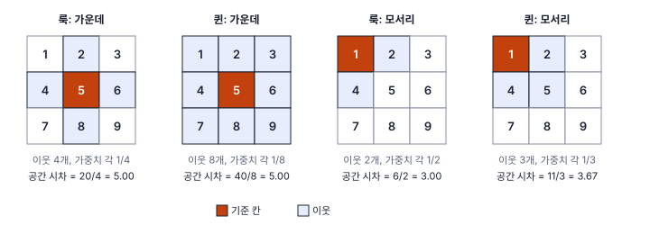
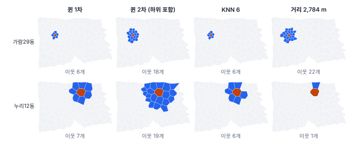
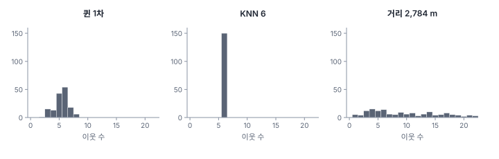
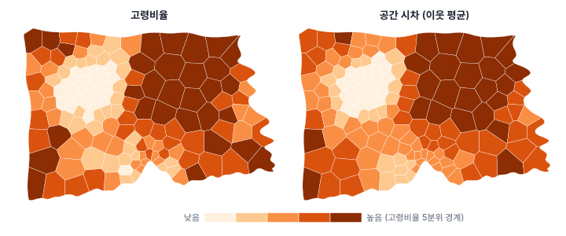

[목차](../README.md) · 이전: [9강 독립 가정이 깨질 때](09-when-independence-fails.md) · 다음: [11강 전역 공간 자기상관](11-global-autocorrelation.md)

# 10강 이웃 정하기: 공간가중치

> 앱 지원: ● 앱에서 따라 할 수 있음 · 읽는 시간 약 35분

## 이 강에서 얻는 것

- 공간가중치 행렬 W와 공간 시차의 뜻을 알고, 작은 격자에서 손으로 계산할 수 있음
- 인접(룩·퀸·고차), 거리 임계값, KNN, 커널 가중치가 각각 어떤 "이웃"을 정의하는지 설명하고, 자료와 현상에 맞게 고를 수 있음
- 이진 가중치와 행 표준화의 차이를 알고, 이웃 수 분포·섬·비대칭으로 가중치를 점검할 수 있음
- 같은 자료라도 가중치에 따라 결과가 달라진다는 것을 알고, 민감도 분석으로 보고할 수 있음

## 들어가는 질문

9강에서 공간 자료는 "이웃끼리 닮았는가"를 먼저 물어야 한다고 했음. 그런데 이웃은 누구인가? 한빛시 출동률이 이웃끼리 닮았는지 Moran's I(11강)로 재 보니, 이웃을 어떻게 정하느냐에 따라 답이 달랐음.

| 이웃의 정의 | 출동률의 Moran's I | 유사 p |
|---|---|---|
| 경계를 맞댄 동 (퀸 인접) | 0.092 | 0.031 |
| 가장 가까운 6개 동 (KNN 6) | 0.102 | 0.011 |
| 중심점 2,784 m 안의 동 (거리 임계값) | −0.002 | 0.447 |

앞의 둘로 보면 "출동률은 이웃끼리 약하게 닮았다"이고, 마지막으로 보면 "전혀 닮지 않았다"임. 공간통계의 거의 모든 방법은 **누가 누구의 이웃인가**를 정하는 데서 시작함. 그 정의가 **공간가중치**(spatial weights)이고, 이 강은 3부 전체의 바탕이 되는 이 선택을 다룸.

## 1. 공간가중치 행렬과 공간 시차

구역이 n개면 공간가중치는 n × n 행렬 **W**로 나타냄. i행 j열의 값 w_ij는 구역 j가 구역 i의 이웃으로서 얼마나 중요한지를 뜻함. 이웃이 아니면 0이고, 자기 자신은 이웃으로 치지 않으므로 대각선 w_ii도 0임(커널은 예외, 5절). 한빛시 행정동 150개의 퀸 인접 W는 150 × 150 = 22,500칸 가운데 3.61%만 0이 아님. 대부분이 0인 **희소 행렬**임.

W로 계산하는 가장 기본적인 양이 **공간 시차**(spatial lag)임.

$$
[\mathbf{W}y]_i = \sum_{j} w_{ij}\, y_j
$$

구역 i의 공간 시차는 이웃 값들의 가중합임. 2절의 행 표준화를 하면 가중치 합이 1이 되어 공간 시차가 곧 **이웃의 평균**이 됨. 공간 자기상관(11~13강)은 "값과 그 공간 시차가 얼마나 닮았는가"를, 공간회귀(24~26강)는 "공간 시차가 결과에 얼마나 영향을 주는가"를 다룸.

### 손으로 해 보기: 3×3 격자

값이 1부터 9까지인 3×3 격자에서 가운데 칸(5)과 모서리 칸(1)의 이웃을 정해 봄.

| 기준 칸 | 룩 이웃 | 룩 공간 시차 | 퀸 이웃 | 퀸 공간 시차 |
|---|---|---|---|---|
| 가운데 5 | 2, 4, 6, 8 | 20/4 = 5.00 | 1~4, 6~9 | 40/8 = 5.00 |
| 모서리 1 | 2, 4 | 6/2 = 3.00 | 2, 4, 5 | 11/3 = 3.67 |
| 변 2 | 1, 3, 5 | 9/3 = 3.00 | 1, 3, 4, 5, 6 | 19/5 = 3.80 |

가운데 칸은 룩이든 퀸이든 시차가 5로 같음. 이 격자는 값이 고르게 늘어 마주 보는 이웃끼리의 평균이 5이기 때문이고, 값이 고르지 않으면 가운데 칸에서도 둘이 달라짐. 모서리와 변의 칸은 이웃이 한쪽에만 있어 이웃의 정의에 따라 시차가 달라짐. 가장자리에서 이웃이 적고 한쪽으로 치우치는 것은 4강의 경계 효과와 같은 이야기임.

## 2. 인접: 경계를 맞대면 이웃

면 자료에서 가장 흔한 정의는 **인접**(contiguity)임(4강).

- **룩**(rook) 인접: 경계선(변)을 공유해야 이웃. 체스의 룩이 가로세로로만 움직이는 데서 온 이름임
- **퀸**(queen) 인접: 변이나 꼭짓점 하나만 공유해도 이웃. 체스의 퀸처럼 대각선도 포함함

격자에서는 둘의 차이가 큼(가운데 칸의 이웃 4개 대 8개). 하지만 행정구역처럼 경계가 불규칙한 면에서는 꼭짓점 하나에서만 만나는 경우가 드물어 둘이 거의 같음. 한빛시 행정동은 150개 모두 퀸 이웃과 룩 이웃이 완전히 같음(평균 5.41개, 최소 2, 최대 8).

### 고차 인접

**2차 인접**은 이웃의 이웃임. "하위 차수 포함"이면 1차 이웃과 2차 이웃을 모두, 포함하지 않으면 2차 이웃만 이웃으로 침. 한빛시에서 퀸 2차(하위 포함)의 이웃 수는 평균 15.73개(7~24개)로 1차의 약 세 배임. 영향이 바로 옆 동을 넘어 퍼지는 현상이나, 구역이 아주 작아 바로 옆만으로는 이웃이 너무 적을 때 씀. 차수를 달리해 Moran's I를 계산하면 "닮음이 몇 단계 떨어진 곳까지 이어지는가"를 볼 수 있음(11강의 코렐로그램).

## 3. 거리 임계값: 정해진 거리 안이면 이웃

구역의 중심점끼리의 거리가 임계값 d 안이면 이웃으로 침. 점 자료에도 쓸 수 있고, 거리라는 뜻이 분명하다는 장점이 있음. 임계값이 너무 작으면 이웃이 없는 섬이 생기므로, 흔히 **모든 구역이 이웃을 하나 이상 갖는 가장 작은 거리**에서 시작함. GeoStat은 이 값을 계산해 채워 줌. 한빛시 행정동에서는 2,783.667 m임.

문제는 구역의 크기가 고르지 않을 때임.

같은 2,784 m 안에 도심의 작은 가람29동(0.81㎢)은 이웃이 22개, 외곽의 넓은 누리12동(8.34㎢)은 1개뿐임. 이웃이 1개인 동이 5개나 됨. 이웃이 하나뿐인 동의 공간 시차는 그 한 동의 값이라 크게 흔들리고, 이웃이 22개인 동은 넓은 범위의 평균이 됨. 거리 임계값은 구역 크기가 비슷하거나(격자, 고른 관측망), 영향이 미치는 거리가 이론적으로 정해져 있을 때(예: 도보 10분 거리) 알맞음.

**역거리 가중**(inverse distance)은 임계값 안의 이웃에도 가까울수록 큰 가중치 1/d(또는 1/d²)를 줌. 가까운 것이 더 닮는다는 토블러의 법칙을 가중치에 직접 담은 것임.

## 4. KNN: 가장 가까운 k개

**k-최근접 이웃**(KNN)은 중심점이 가장 가까운 k개를 이웃으로 침. 모든 구역이 정확히 k개의 이웃을 가지므로 섬이 없고, 밀도가 고르지 않아도 이웃 수가 일정함. 위 그림에서 KNN 6은 도심 동과 외곽 동 모두 이웃이 6개임.

KNN의 특징은 **비대칭**임. A의 가장 가까운 6개에 B가 들어도, B 주변이 빽빽하면 B의 6개에 A가 들지 않을 수 있음. 한빛시 KNN 6에서 900개의 이웃 관계 가운데 140개가 한쪽만의 관계임. 비대칭이라고 계산이 안 되는 것은 아니지만, 대칭 행렬을 전제로 하는 계산(공간회귀 최대우도 추정의 일부 계산 방식 등, 25~26강)에서는 주의가 필요함.

## 5. 커널: 거리에 따라 줄어드는 가중치

**커널**(kernel) 가중치는 거리에 따라 연속적으로 줄어드는 함수(삼각, 이차, 가우시안 등)로 가중치를 줌. 범위를 정하는 **대역폭**은 모든 구역에 같은 거리를 쓰는 **고정**과, 구역마다 k번째 이웃까지의 거리를 쓰는 **적응**이 있음. 주로 지리가중회귀(29~30강)에서 "어느 관측을 얼마나 반영해 지역 회귀를 할지"를 정하는 데 씀.

커널 가중치는 **자기 자신을 포함**함. GeoStat의 커널 가중치도 대각선이 1임. 그래서 Moran's I나 LISA처럼 "자기 값과 이웃 값의 관계"를 재는 통계에 쓰면 자기 값이 이웃에 섞여 들어가 닮음이 부풀려짐. 한빛시 출동률의 Moran's I는 퀸으로 0.092인데 커널(삼각, 적응 k=6)로는 0.509가 나옴. 자기 가중치가 I 값과 그 기댓값을 함께 끌어올려, 다른 가중치의 I와 비교할 수 없게 됨. 앱에서 이 커널로 계산하면 유사 p는 오히려 0.069로 퀸(0.031)보다 큰데, 큰 I 값이 의미 없다는 신호이지 다른 가중치보다 보수적이라는 뜻이 아님. 커널 가중치는 GWR용으로 쓰고, 자기상관 통계에는 쓰지 않음.

## 6. 표준화

가중치 값 자체를 어떻게 둘지도 정해야 함.

- **이진**(binary): 이웃이면 1, 아니면 0. 공간 시차는 이웃 값의 **합**임. 이웃이 많은 구역일수록 시차가 커짐
- **행 표준화**(row standardization): 각 행의 합이 1이 되도록 나눔. 이웃이 k개면 각 가중치가 1/k이고, 공간 시차는 이웃의 **평균**임

행 표준화하면 이웃 수가 다른 구역끼리 시차를 비교할 수 있어 가장 널리 씀. 대신 이웃이 2개인 가장자리 동은 이웃 하나가 1/2의 무게를, 이웃이 8개인 안쪽 동은 1/8의 무게를 가짐. 이웃이 적은 구역은 이웃 하나하나의 영향이 커짐. 이런 차이를 줄이려는 **분산 안정 표준화**(Tiefelsdorf, Griffith & Boots 1999)도 있음.

GeoStat은 만든 가중치를 그대로 저장하고, 분석할 때 방법에 맞는 표준화를 자동으로 적용함. Moran's I, LISA, Local Geary는 행 표준화를, Gi*와 Join Count는 이진 가중치를 씀(Join Count는 11강, Gi*는 13강).

예를 들어 가람1동의 고령비율은 28.00%이고, 퀸 이웃 세 동(가람2·3·10동)의 고령비율은 25.30, 31.73, 24.68%라 공간 시차는 그 평균인 27.23%임. 고령비율과 그 공간 시차의 상관계수는 0.938로, 이웃끼리 매우 닮았다는 뜻임(11강에서 이를 Moran's I로 잼). 공간 시차는 이웃과 평균하므로 표준편차가 5.80에서 5.02로 줄고 지도도 매끄러워짐.

## 7. 가중치를 점검하기

가중치를 만들면 분석 전에 다음을 봄.

- **이웃 수 분포**: 평균·최소·최대와 히스토그램. 거리 임계값처럼 이웃 수가 1개에서 22개까지 크게 퍼지면, 이웃이 적은 구역의 결과가 불안정함
- **섬**: 이웃이 없는 구역. 자료 문제인지(4강) 진짜 섬인지 가리고, 진짜 섬이면 KNN이나 뱃길 연결로 처리함. 섬은 행 표준화를 할 수 없고 공간 시차가 0이 되어 통계를 왜곡함
- **연결 성분**: 서로 이어지지 않는 덩어리가 여럿이면(예: 본토와 섬 지역), 덩어리끼리는 아무 영향도 주고받지 않는다고 가정하는 셈임
- **대칭**: KNN처럼 비대칭인 가중치인지
- **이웃의 뜻**: 지도에서 몇 구역을 골라 이웃을 직접 확인함. GeoStat의 **이웃 선택** 단추가 이를 위한 것임

## 8. 어떻게 고르는가: 이론, 그리고 민감도 분석

가중치는 연구 질문의 **현상이 어떻게 퍼지는가**에 대한 가정임. 자료가 정답을 알려 주지 않음.

| 현상이 퍼지는 방식 | 알맞은 가중치 |
|---|---|
| 경계를 맞댄 구역끼리 직접 주고받음 (행정 정책, 상권) | 인접 (퀸·룩) |
| 정해진 거리 안에서 영향이 미침 (보행권, 소음, 대기) | 거리 임계값, 역거리 |
| 구역 크기가 고르지 않아 이웃 수를 맞추고 싶음, 섬이 있음 | KNN |
| 지역마다 따로 회귀를 하며 가까운 관측일수록 많이 반영 | 커널 (GWR) |
| 영향이 이웃의 이웃까지 퍼짐 | 고차 인접 |

그리고 결과가 가중치에 얼마나 민감한지 확인해 함께 보고함. 한빛시의 두 변수로 해 보면 다음과 같음(순열 999번).

| 가중치 | 이웃 수 (평균, 범위) | 고령비율 I | 출동률 I (유사 p) |
|---|---|---|---|
| 퀸 1차 (= 룩 1차) | 5.41 (2~8) | 0.812 | 0.092 (0.031) |
| 퀸 2차 (하위 포함) | 15.73 (7~24) | 0.657 | 0.045 (0.046) |
| KNN 4 | 4 | 0.816 | 0.159 (0.003) |
| KNN 6 | 6 | 0.780 | 0.102 (0.011) |
| 거리 2,784 m | 9.67 (1~22) | 0.776 | −0.002 (0.447) |
| 역거리 2,784 m | 9.67 (1~22) | 0.789 | 0.014 (0.319) |

고령비율은 어떤 가중치로도 I가 0.66~0.82이고 유사 p가 모두 0.001(순열 999번으로 얻을 수 있는 최솟값)임. 결론이 가중치에 흔들리지 않음. 반면 출동률은 I가 −0.002에서 0.159까지, 유사 p가 0.003에서 0.447까지 오감. 가까운 소수의 동(KNN 4, 퀸 1차)으로 보면 약하게 닮았고, 이웃 수가 1~22개로 들쭉날쭉한 거리 임계값에서는 닮음이 사라짐. 이런 결과는 "출동률은 바로 이웃한 몇 동 사이에서만 약하게 닮음"으로 정직하게 보고해야지, 유의하게 나온 가중치 하나만 골라 보고하면 안 됨. 여러 가중치를 돌려 보고 가장 좋은 p값을 고르는 것은 7강에서 본 다중검정의 한 형태임.

## 해 보기: GeoStat에서 가중치 만들고 비교하기

1. `hanbit_dong.gpkg`와 `hanbit_events.gpkg`를 열고 5강처럼 `출동률`을 만듦(`hanbit_dong`을 고른 뒤 점 집계, 계산 필드). 계산 필드 `고령비율` = `` `고령인구` / `인구` * 100 ``도 만듦
2. **공간 분석 → 공간가중치 만들기…** 메뉴에서 다음 가중치를 차례로 만듦. 창은 만들 때마다 닫히므로 다시 열어 유형을 고름
   - **퀸 인접 (Queen)**: 왼쪽 **공간가중치** 칸에 "평균 5.41 · 최소 2 · 최대 8"
   - **룩 인접 (Rook)**: 같은 값이 나옴
   - **퀸 인접 (Queen)**, **인접 차수** 2(차수를 2로 바꾸면 **하위 차수 포함** 칸이 나타나며 기본으로 켜져 있음): "평균 15.73 · 최소 7 · 최대 24"
   - **k-최근접 이웃 (KNN)**, **이웃 수 k** 6: "평균 6.00 · 최소 6 · 최대 6"
   - **거리 임계값**: **거리 임계값** 칸에 2783.667이 미리 채워짐. 그대로 만들면 "평균 9.67 · 최소 1 · 최대 22"
3. 공간가중치 칸 맨 위의 목록(이름은 `queen1`, `rook1`, `queen2`, `knn6`, `dist2783`처럼 자동으로 붙음)에서 가중치를 바꿔 가며 이웃 수 막대그래프의 모양을 비교함
4. 속성 테이블에서 `가람29동`(HB029)만 골라 **이웃 선택** 단추를 누름. 이 단추는 지금 선택에 이웃을 더하므로, 가중치를 바꿀 때마다 `가람29동`만 다시 고른 뒤 누름
   - 확인: 알림에 퀸 1차는 "이웃 6개를 선택에 추가함", 거리 임계값은 "이웃 22개를 선택에 추가함". 외곽의 `누리12동`도 같은 방법으로 비교함
5. **공간 분석 → Moran's I · Moran 산점도…** 메뉴에서 변수 `출동률`, **공간가중치**를 퀸 1차(`queen1 — 퀸 인접 1차`)로 골라 계산함. 메뉴를 다시 열어 KNN 6, 거리 임계값으로도 계산함
   - 확인: Moran's I가 0.0924(유사 p 0.031), 0.1024(0.011), −0.0016(0.447)임
6. 같은 방법으로 `고령비율`을 계산함
   - 확인: 0.8116, 0.7797, 0.7761로 세 경우 모두 유사 p 0.001임
7. 공간가중치 칸의 **저장…** 단추로 퀸 가중치를 `.gal` 파일로 저장함. GeoDa나 PySAL에서도 같은 가중치를 불러 쓸 수 있음

## 헷갈리는 쌍

- **룩 vs 퀸**: 룩은 변을, 퀸은 꼭짓점까지 공유하면 이웃. 격자에서는 크게 다르지만 불규칙한 행정 경계에서는 거의 같음
- **거리 임계값 vs KNN**: 거리 임계값은 거리를 고정하고 이웃 수가 달라지며, KNN은 이웃 수를 고정하고 거리가 달라짐
- **이진 vs 행 표준화**: 공간 시차가 이웃의 합인가, 평균인가
- **고정 대역폭 vs 적응 대역폭**: 모든 구역에 같은 거리를 쓰는가, 구역마다 k번째 이웃까지의 거리를 쓰는가
- **공간가중치 vs 공간 시차**: 가중치는 이웃의 정의(행렬), 공간 시차는 그 가중치로 계산한 이웃 값의 가중합(변수)

## 흔한 실수와 심사 지적

- **가중치를 밝히지 않음**
  - 지적: "공간가중치 행렬을 어떻게 정의하였습니까?"
  - 대응: 종류(퀸 1차, KNN 6 등), 표준화, 이웃 수 요약, 섬의 처리를 적음
- **여러 가중치를 시도하고 유의한 것만 보고함**
  - 지적: "가중치 선택에 따라 결과가 달라지지 않습니까?"
  - 대응: 이론에 따라 하나를 먼저 정하고, 다른 가중치의 결과를 민감도 분석으로 함께 보고함
- **구역 크기가 크게 다른데 거리 임계값을 씀**
  - 결과: 도심은 이웃이 수십 개, 외곽은 1~2개가 되어 결과가 불안정함
  - 대응: KNN이나 인접을 쓰거나, 이웃 수 분포를 보고함
- **커널 가중치로 Moran's I를 계산함**
  - 결과: 자기 자신이 이웃에 포함되어 자기상관이 부풀려짐
  - 대응: 자기상관 통계에는 대각선이 0인 가중치를 씀
- **경위도 좌표로 거리 가중치를 만듦**
  - 결과: 경도와 위도의 1도가 길이가 달라 거리가 왜곡됨(2강)
  - 대응: 투영 좌표계를 씀. GeoStat은 경위도 자료면 UTM으로 바꿔 m 단위로 계산함

## 보고서에는 이렇게 씀

> 공간가중치는 경계나 꼭짓점을 공유하는 행정동을 이웃으로 하는 1차 퀸 인접으로 정의하고 행 표준화하였다(평균 이웃 수 5.41, 범위 2~8, 이웃이 없는 행정동 없음). 결과의 민감도를 보기 위해 6-최근접 이웃과 거리 임계값(2,784 m, 모든 행정동이 이웃을 하나 이상 갖는 최소 거리) 가중치로도 분석하였다. 유의성은 순열 999회(난수 시드 123456789)의 유사 p값으로 판단하였다. 고령비율의 공간 자기상관은 세 가중치에서 모두 뚜렷하였으나(Moran's I 0.78~0.81, 모두 유사 p = 0.001), 출동률은 가중치에 따라 0.09, 0.10, 0.00(유사 p = 0.031, 0.011, 0.447)으로 달라 약하고 불안정하였다.

적어야 할 항목은 다음과 같음.

- 가중치의 종류와 매개변수(차수, k, 임계값, 커널과 대역폭), 중심점을 썼는지
- 표준화 방법
- 이웃 수 요약(평균, 최소, 최대)과 섬의 수와 처리
- 다른 가중치로 한 민감도 분석의 결과

## 요약

- 공간가중치 W는 누가 누구의 이웃인지를 정한 n × n 행렬이고, 공간 시차 Wy는 이웃 값의 가중합(행 표준화면 평균)임
- 인접(룩·퀸·고차), 거리 임계값, KNN, 커널은 서로 다른 "이웃"을 정의함. 불규칙한 행정 경계에서는 룩과 퀸이 거의 같음
- 거리 임계값은 구역 크기가 고르지 않으면 이웃 수가 크게 달라지고(한빛시 1~22개), KNN은 이웃 수가 같지만 비대칭임
- 커널 가중치는 자기 자신을 포함하므로 GWR에 쓰고, 자기상관 통계에는 쓰지 않음
- 가중치는 이론으로 고르고, 이웃 수 분포·섬·대칭을 점검하며, 다른 가중치로 민감도 분석을 해서 함께 보고함. 한빛시 고령비율은 가중치에 강건하지만 출동률은 그렇지 않음

## 핵심 용어

| 한글 | 영문 | 비고 |
|---|---|---|
| 공간가중치 (행렬) | Spatial Weights (Matrix) | W |
| 공간 시차 | Spatial Lag | Wy, 이웃 값의 가중합 |
| 인접 | Contiguity | |
| 룩 / 퀸 인접 | Rook / Queen Contiguity | |
| 고차 인접 | Higher-order Contiguity | 이웃의 이웃 |
| 거리 임계값 | Distance Band (Threshold) | |
| 역거리 가중 | Inverse Distance Weighting | 1/d, 1/d² |
| k-최근접 이웃 | k-Nearest Neighbors (KNN) | 비대칭 |
| 커널 | Kernel | 고정·적응 대역폭 |
| 이진 / 행 표준화 | Binary / Row-standardized | |
| 희소 행렬 | Sparse Matrix | 비영 비율 |
| 섬 | Island (Isolate) | |
| 연결 성분 | Connected Component | |
| 민감도 분석 | Sensitivity Analysis | |

## 원전과 더 읽을거리

**원전**

- Cliff, A. D., & Ord, J. K. (1981). *Spatial Processes: Models & Applications*. Pion. 공간가중치를 일반화된 연결 행렬로 정리함
- Anselin, L. (1988). *Spatial Econometrics: Methods and Models*. Kluwer. 공간 시차와 가중치 행렬의 표기
- Tiefelsdorf, M., Griffith, D. A., & Boots, B. (1999). A variance-stabilizing coding scheme for spatial link matrices. *Environment and Planning A*, 31(1), 165–180. 분산 안정 표준화

**더 읽을거리**

- Getis, A., & Aldstadt, J. (2004). Constructing the spatial weights matrix using a local statistic. *Geographical Analysis*, 36(2), 90–104. 자료에서 가중치를 정하는 방법
- Getis, A. (2009). Spatial weights matrices. *Geographical Analysis*, 41(4), 404–410. 가중치 선택에 대한 짧은 정리
- Rey, S. J., Arribas-Bel, D., & Wolf, L. J. (2023). *Geographic Data Science with Python*. CRC Press. 4장(Spatial Weights)에서 PySAL로 가중치를 만들고 점검하는 법

## 연습

1. 손으로 해 보기의 3×3 격자에서 오른쪽 아래 모서리 칸(9)의 룩·퀸 이웃과, 행 표준화한 공간 시차를 각각 구하시오. 이진 가중치라면 공간 시차는 얼마인가?

2. 2×2 격자(값 A=1, B=3 / C=5, D=7, A는 왼쪽 위)의 퀸 인접 이진 W를 4 × 4 행렬로 쓰고, 행 표준화한 W와 공간 시차 Wy를 구하시오.

3. 행정동 크기가 도심에서는 0.6㎢, 외곽에서는 8㎢ 정도인 도시에서 거리 임계값 가중치를 썼을 때 생길 문제를 설명하고, 대안 두 가지를 제시하시오.

4. KNN 가중치가 비대칭이 되는 예를 점 세 개로 들어 보시오. (k = 1)

5. 8절의 표를 보고, 출동률의 공간 자기상관에 대해 보고서에 쓸 문장을 두세 문장으로 쓰시오.

해답

1. 룩 이웃은 6과 8이므로 행 표준화 시차는 (6 + 8)/2 = 7.00. 퀸 이웃은 5, 6, 8이므로 (5 + 6 + 8)/3 = 6.33. 이진 가중치면 시차는 이웃의 합이므로 룩 14, 퀸 19.

2. 2×2 격자에서는 네 칸이 모두 서로 변이나 꼭짓점을 공유하므로 퀸 이웃은 자기 자신을 뺀 나머지 셋임. 이진 W는 대각선이 0이고 나머지가 모두 1인 행렬:
   [[0,1,1,1],[1,0,1,1],[1,1,0,1],[1,1,1,0]]. 행 표준화하면 0이 아닌 칸이 모두 1/3. Wy는 A: (3 + 5 + 7)/3 = 5, B: (1 + 5 + 7)/3 = 4.33, C: (1 + 3 + 7)/3 = 3.67, D: (1 + 3 + 5)/3 = 3.

3. 모든 동이 이웃을 하나 이상 갖도록 임계값을 정하면 넓은 외곽 동에 맞춰 거리가 커지므로, 도심의 작은 동은 이웃이 수십 개, 외곽 동은 한두 개가 됨. 외곽 동의 공간 시차는 이웃 한두 개 값에 크게 흔들리고, 도심 동은 넓은 범위가 평균되어 지역 차이가 흐려짐. 대안: KNN(이웃 수를 고정), 인접 가중치(경계를 기준으로), 또는 이웃 수 분포를 함께 보고하고 다른 가중치로 민감도 분석을 함.

4. 일직선 위에 점 A(0), B(1), C(1.5)가 있으면, A의 가장 가까운 이웃은 B(거리 1)임. B의 가장 가까운 이웃은 C(거리 0.5)이므로 A가 아님. 따라서 A→B는 이웃 관계지만 B→A는 아님.

5. 예: "출동률의 전역 Moran's I는 1차 퀸 인접 가중치에서 0.092(유사 p = 0.031), 6-최근접 이웃에서 0.102(유사 p = 0.011)였으나, 거리 임계값(2,784 m) 가중치에서는 −0.002(유사 p = 0.447)로 유의하지 않았다. 출동률의 공간 자기상관은 바로 인접한 소수의 행정동 사이에서만 약하게 나타나며, 가중치 정의에 민감하였다."

---

[목차](../README.md) · 이전: [9강 독립 가정이 깨질 때](09-when-independence-fails.md) · 다음: [11강 전역 공간 자기상관](11-global-autocorrelation.md)
