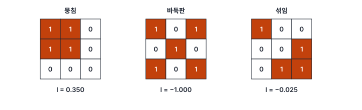
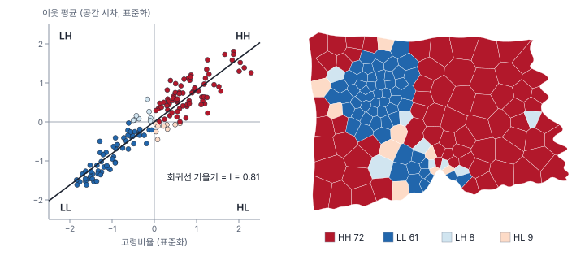
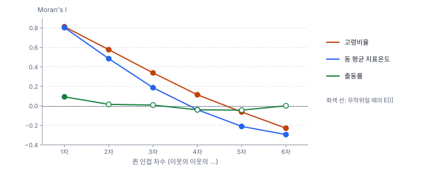

[목차](../README.md) · 이전: [10강 이웃 정하기: 공간가중치](10-spatial-weights.md) · 다음: [12강 국지 공간 자기상관 I: LISA](12-lisa.md)

# 11강 전역 공간 자기상관

> 앱 지원: ◐ Moran's I, Moran 산점도, Join Count, 인접 차수별 비교는 앱에서, Geary's C, General G, 거리 구간별 코렐로그램은 코드로 함 · 읽는 시간 약 40분

## 이 강에서 얻는 것

- Moran's I의 식을 이해하고 작은 격자에서 손으로 계산할 수 있으며, Moran 산점도로 그 뜻을 읽을 수 있음
- 정규 가정, 무작위화, 순열이라는 세 가지 추론 방법의 차이를 설명할 수 있음
- Geary's C, General G, Join Count가 Moran's I와 어떻게 다른 질문에 답하는지 알고 골라 쓸 수 있음
- 코렐로그램으로 닮음이 어느 거리까지 이어지는지 보고, 전역 통계의 한계를 설명할 수 있음

## 들어가는 질문

0강에서 지도를 눈으로 보고 "모여 있다"고 판단하는 것은 위험하다고 했고, 5강에서는 분류 방법만 바꿔도 지도의 인상이 달라지는 것을 봤음. 7강과 10강에서는 Moran's I라는 수를 미리 빌려 썼음. 한빛시 고령비율은 0.812, 출동률은 0.092였음.

- 0.812는 얼마나 "모여 있다"는 뜻인가? 1이 최대인가?
- 출동률의 0.092는 작은 값인데 왜 유사 p가 0.031로 "유의"한가?
- 모여 있다는 것을 재는 방법은 Moran's I 하나뿐인가?

이 강은 도시 전체에 대해 "비슷한 값이 서로 가까이 있는가"를 하나의 수로 재는 **전역 공간 자기상관**(global spatial autocorrelation)을 다룸.

## 1. Moran's I

**공간 자기상관**은 가까운 곳의 값끼리 닮은 정도임. 양(+)이면 비슷한 값이 모여 있고, 음(−)이면 큰 값과 작은 값이 번갈아 있으며, 0 근처면 값이 공간적으로 무작위로 놓여 있음. 모란(Moran 1950)이 제안한 **Moran's I**는 가장 널리 쓰이는 척도임.

$$
I = \frac{n}{S_0} \cdot \frac{\sum_i \sum_j w_{ij}\, z_i z_j}{\sum_i z_i^2}, \qquad z_i = x_i - \bar{x}, \qquad S_0 = \sum_i \sum_j w_{ij}
$$

분자의 Σ w_ij z_i z_j는 이웃한 쌍마다 "평균에서 벗어난 정도"를 곱해 더한 것임. 이웃한 두 구역이 모두 평균보다 높거나 모두 낮으면 곱이 양수, 하나는 높고 하나는 낮으면 음수가 됨. 분모 Σz²로 나눠 값의 단위를 없애고, n/S₀로 이웃 수의 영향을 맞춤. 상관계수와 비슷하게 생겼지만 −1~1 사이로 정해져 있지는 않음(대체로 그 안에 있음).

공간적으로 무작위일 때 I의 **기댓값** E[I] = −1/(n − 1)은 0이 아님. 평균을 자료에서 구했기 때문에 생기는 작은 음의 치우침이며, 한빛시 150개 동에서는 −1/149 = −0.0067임.

### 손으로 해 보기: 3×3 격자

3×3 격자에 1과 0을 세 가지로 배치하고, 룩 인접 이진 가중치로 I를 계산해 봄. 이웃 쌍은 12개이고 양방향으로 세므로 S₀ = 24, E[I] = −1/8 = −0.125임.



"뭉침" 배치를 손으로 따라가 봄. 1이 4개라 평균은 4/9이고, 1인 칸의 z는 5/9, 0인 칸의 z는 −4/9임.

- 분모: Σz² = 4 × (5/9)² + 5 × (4/9)² = 180/81
- 분자: 이웃 쌍 12개 가운데 1–1 쌍이 4개, 1–0 쌍이 4개, 0–0 쌍이 4개임. 양방향으로 세면 각각 8개이므로 Σ w z z = 8 × 25/81 + 8 × (−20/81) + 8 × 16/81 = 168/81
- I = (9/24) × (168/81) / (180/81) = 0.375 × 0.933 = **0.350**

바둑판은 이웃 쌍 12개가 모두 1–0이라 I = −1.000, "섞임"은 −0.025임. 기댓값 −0.125와 0.1 차이가 나지만, 칸이 9개뿐이면 무작위일 때 I가 크게 흔들려 이 정도는 무작위와 구별되지 않음. 앱은 늘 행 표준화를 쓰는데, 행 표준화로 구하면 "뭉침"의 I는 0.375임(12강).

### Moran 산점도

행 표준화 가중치를 쓰면 Moran's I는 **표준화한 값(가로축)과 그 공간 시차(세로축)의 회귀 기울기**와 같음(Anselin 1996). 이 그림을 **Moran 산점도**라 함.



네 사분면은 다음을 뜻함.

- **HH**(오른쪽 위): 나도 높고 이웃도 높음. 한빛시 고령비율에서 72개 동
- **LL**(왼쪽 아래): 나도 낮고 이웃도 낮음. 61개 동
- **LH**(왼쪽 위): 나는 낮은데 이웃은 높음. 8개 동
- **HL**(오른쪽 아래): 나는 높은데 이웃은 낮음. 9개 동

HH와 LL이 133개로 대부분이라 기울기가 0.81로 큼. 산점도에서 회귀선에서 멀리 떨어진 점이나 LH·HL 사분면의 점은 주변과 다른 "공간 이상치"의 후보이고, 이를 하나하나 검정하는 것이 12강의 LISA임.

## 2. 세 가지 추론

I = 0.092가 우연인지 판단하려면 "공간적으로 무작위일 때 I가 어떻게 퍼지는가"(귀무분포)를 알아야 함. 방법은 셋임(Cliff & Ord 1981).

- **정규 가정**(normality): 값이 정규분포에서 독립으로 뽑혔다고 보고, I의 분산을 식으로 구해 z 점수를 냄
- **무작위화**(randomization): 실제 관측값 n개를 위치에 무작위로 배치한다고 보고 분산을 식으로 구함. 값의 분포 모양(첨도)을 반영함
- **순열**(permutation): 무작위화 가정을 컴퓨터로 직접 흉내 냄. 값을 999번 섞어 I를 다시 계산하고 유사 p값을 냄(7강)

| 변수 | I | 정규 z (양측 p) | 무작위화 z (양측 p) | 순열 z (단측 유사 p, 999번) |
|---|---|---|---|---|
| 고령비율 | 0.812 | 16.45 (< 0.001) | 16.41 (< 0.001) | 16.13 (0.001) |
| 출동률 | 0.092 | 1.99 (0.046) | 2.05 (0.040) | 1.99 (0.031) |
| 동 평균 지표온도 | 0.802 | 16.26 (< 0.001) | 16.22 (< 0.001) | 16.18 (0.001) |

세 방법은 비슷한 답을 냄. 표의 정규·무작위화 p는 양측이고 순열 p는 단측이라, 출동률의 p가 순열에서 더 작아 보이는 것은 방식의 차이임(정규·무작위화의 단측 p는 0.023, 0.020). 순열은 분포 가정이 필요 없고, 분산 식이 없는 통계(이변량, EB 비율 등)에도 쓸 수 있어 GeoDa와 GeoStat의 기본임. GeoStat의 Moran 카드에 나오는 z는 순열 분포로 구한 z이고, 유사 p는 단측(관측값이 있는 쪽 꼬리) 값임(7강). 고령비율의 z가 16이라는 것은, I = 0.812가 무작위일 때의 분포(표준편차 약 0.05)에서 16 표준편차 떨어져 있다는 뜻임.

들어가는 질문으로 돌아가면, 출동률의 I = 0.092는 작지만 표준편차 0.05의 분포에서 약 2 표준편차 떨어져 있어 유의 경계에 걸침. **I의 크기와 유의성은 다른 것**임. 구역이 많으면 작은 I도 유의하게 나오고, 구역이 적으면 큰 I도 유의하지 않을 수 있음. 보고서에는 I와 p를 함께 적음.

## 3. 다른 전역 척도

### Geary's C

기어리(Geary 1954)의 **C**는 이웃 쌍의 **값의 차이의 제곱**을 봄.

$$
C = \frac{(n-1)}{2 S_0} \cdot \frac{\sum_i \sum_j w_{ij} (x_i - x_j)^2}{\sum_i z_i^2}
$$

이웃끼리 비슷하면 차이가 작아 C가 1보다 작아지고(0에 가까울수록 강한 양의 자기상관), 이웃끼리 다르면 1보다 커짐. 무작위일 때의 기댓값은 1임. Moran's I는 평균에서 벗어난 정도의 **곱**을 보므로 전체적인 패턴에, Geary's C는 이웃 사이의 **차이**를 보므로 국지적인 차이에 더 민감함. 한빛시 고령비율의 C는 0.193(유사 p 0.001), 출동률은 0.953(0.212)임(행 표준화 가중치. 이진 가중치로 구하면 값이 조금 달라짐). 출동률은 C로 보면 유의하지 않음.

### General G

게티스와 오드(Getis & Ord 1992)의 **General G**는 높은 값끼리 모여 있는지(**핫스팟**) 낮은 값끼리 모여 있는지(**콜드스팟**)를 가림. 값에 음수가 없어야(0 이상) 하고, 이진 가중치로 이웃한 쌍의 값의 곱을 전체 쌍의 곱으로 나눔. G가 기댓값보다 크면 높은 값이 모여 있다는 뜻임. Moran's I는 높은 값끼리 모인 것과 낮은 값끼리 모인 것을 구별하지 않지만, G는 구별함.

| 변수 | Moran's I (유사 p) | Geary's C (유사 p) | General G / 기댓값 (유사 p) |
|---|---|---|---|
| 고령비율 | 0.812 (0.001) | 0.193 (0.001) | 0.03763 / 0.03633 (0.002) |
| 출동률 | 0.092 (0.031) | 0.953 (0.212) | 0.03899 / 0.03633 (0.007) |

출동률은 Moran's I로는 경계에 걸치고 Geary's C로는 유의하지 않은데, General G로는 유의함(정규 근사 z = 2.68). 출동률이 높은 동 몇 곳이 모여 있는 것(5강의 마루구 원도심 4개 동)이 G에는 잘 잡히지만, 도시 전체에 퍼진 닮음을 보는 I와 C에는 약하게 잡히기 때문임. 세 척도는 서로 다른 질문에 답하므로, 무엇을 묻는지에 맞춰 고름.

### Join Count: 범주 자료

값이 0/1처럼 범주이면 **Join Count**를 씀(Cliff & Ord 1981). 이웃한 쌍을 1–1(BB, black-black), 1–0(BW), 0–0(WW)으로 세어, 무작위로 배치했을 때보다 같은 범주끼리 이웃한 쌍이 많은지 봄. 손으로 해 보기의 "뭉침"은 BB 4, BW 4, WW 4쌍이고, 바둑판은 BW만 12쌍임.

한빛시에서 고령비율이 상위 25%(Q3 = 26.67% 초과)인 동을 1로 두면 38개 동이 1임. 퀸 인접 이웃 쌍 406개 가운데 BB가 62쌍인데, 무작위로 배치하면 평균 25.5쌍임. 고령비율이 높은 동끼리 무작위보다 2.4배 많이 붙어 있음(유사 p 0.001). 반대로 BW는 75쌍으로 무작위일 때(약 155쌍)보다 훨씬 적음.

## 4. 코렐로그램: 닮음은 어디까지 이어지는가

Moran's I 하나는 "바로 이웃끼리" 닮았는지만 말해 줌. 이웃의 범위를 넓혀 가며 I를 계산하면, 닮음이 어느 거리까지 이어지는지를 볼 수 있음. 이를 **코렐로그램**(correlogram)이라 함. 앱에서는 퀸 인접의 차수를 하나씩 올려(하위 차수 미포함) 만들 수 있음.



| 차수 | 1 | 2 | 3 | 4 | 5 | 6 |
|---|---|---|---|---|---|---|
| 고령비율 | 0.812 | 0.576 | 0.338 | 0.114 | −0.063 | −0.229 |
| 동 평균 지표온도 | 0.802 | 0.484 | 0.186 | −0.039 | −0.211 | −0.295 |
| 출동률 | 0.092 | 0.015 | 0.008 | −0.041 | −0.044 | 0.001 |

- 고령비율과 지표온도는 1차에서 0.8이던 닮음이 차수가 오를수록 줄어 0을 지나고(고령비율은 4~5차, 지표온도는 3~4차), 그보다 멀면 **음수**가 됨. 멀리 떨어진 동끼리는 오히려 다르다는 뜻임. 도심(고령비율 낮음, 더움)과 외곽(고령비율 높음, 시원함)이라는 도시 규모의 **추세**가 있으면 이런 모양이 나옴
- 출동률은 1차에서만 약하게 닮고 2차부터는 0 근처임. 10강의 민감도 분석에서 출동률이 가까운 이웃에서만 닮았던 것과 같은 이야기임

코드로 중심점 사이 거리 2 km씩의 구간을 만들어 같은 일을 하면, 고령비율은 0~2 km 0.690, 2~4 km 0.614, 4~6 km 0.284, 6~8 km −0.049, 8~10 km −0.151임. 0~2 km 구간에서는 넓은 외곽 동 29개가 구간 안에 이웃이 없는 섬이 됨. 거리 구간 코렐로그램은 구간마다 이웃 수가 달라지므로 이웃 수를 함께 봐야 함. 연속 표면에서는 같은 생각을 베리오그램(21강)으로 다룸.

## 5. 전역 통계를 읽을 때 조심할 것

- **전역 통계는 평균임**: I = 0.092는 도시 전체의 평균적인 닮음일 뿐, 어디에서 닮았는지는 말하지 않음. 마루구 원도심에 강한 군집이 있고 나머지는 무작위여도 전역 I는 작게 나올 수 있음. "어디에서"는 12~13강의 국지 통계가 답함
- **추세와 군집을 구별하지 못함**: 고령비율처럼 도심에서 외곽으로 커지는 큰 추세가 있으면, 이웃끼리 서로 영향을 주지 않아도 I가 크게 나옴. 추세(1차 효과)와 상호작용(2차 효과)을 가리려면 추세를 회귀로 먼저 빼고 잔차의 I를 봄(24강)
- **가중치와 척도에 따라 달라짐**: 10강의 민감도 분석과 3강의 MAUP처럼, 같은 현상도 가중치와 구역 크기에 따라 I가 달라짐
- **유의성과 크기는 다름**: 구역이 많으면 작은 I도 유의함. I의 크기를 해석하고, 가중치와 순열 횟수를 함께 보고함
- **비율 자료의 작은 수**: 인구가 적은 구역의 불안정한 비율이 I를 흐리거나 부풀릴 수 있음. EB 표준화를 한 Moran's I(14강)를 함께 봄

## 해 보기: GeoStat에서 전역 공간 자기상관 재기

1. `hanbit_dong.gpkg`와 `hanbit_events.gpkg`를 열고 `출동률`과 `고령비율`을 만듦(5강·7강). **퀸 인접 (Queen)** 공간가중치도 만듦
2. **공간 분석 → Moran's I · Moran 산점도…** 메뉴에서 종류 **단변량**, 변수 `고령비율`, 순열 999번으로 **계산**함
   - 확인: Moran's I 0.8116, E[I] −0.0067, 유사 p 0.001, z 16.13. 산점도 아래쪽에 "I 0.8116"이 기울기로 나옴
3. 산점도에서 오른쪽 위(HH)의 점들을 끌어 선택함. 지도에서 어디인지 보고, 왼쪽 아래(LL)도 같은 방법으로 봄. LH·HL 사분면의 점들은 지도에서 어떤 동인지 확인함
4. 같은 방법으로 `출동률`을 계산함
   - 확인: I 0.0924, 유사 p 0.031, z 1.99
5. **공간 분석 → 계산 필드 추가…** 메뉴로 `고령상위` = `` `고령비율` > 26.67 ``을 만듦. 비교식이라 0/1 변수가 됨
6. **공간 분석 → Join Count (이진 변수)…** 메뉴에서 이진 변수 `고령상위`, 퀸 가중치, 순열 999번으로 **계산**함
   - 확인: 1–1 (BB) 관측 62, 1–0 (BW) 관측 75, 0–0 (WW) 관측 269. BB의 기댓값(순열 평균)은 25.5 안팎, 유사 p 0.001
   - Join Count는 난수 시드를 고정하지 않아 기댓값과 유사 p가 실행할 때마다 조금씩 달라짐. BW의 유사 p가 1.000인 것은 "BW가 무작위보다 많은가"를 묻는 단측 값이기 때문임(BW는 오히려 훨씬 적음)
7. 코렐로그램: **공간가중치 만들기…** 에서 **퀸 인접 (Queen)**, **인접 차수** 2, **하위 차수 포함**을 끈 가중치를 만들고, 그 가중치로 `고령비율`의 Moran's I를 계산함. 차수 3, 4, 5, 6으로도 반복함
   - 확인: 0.5763, 0.3378, 0.1141, −0.0635, −0.2289(4절의 표)
8. (0강의 인상 확인) **도움말 → 샘플: 노스캐롤라이나 영아 돌연사 (ESDA 예제)** 를 열고 **퀸 인접 (Queen)** 가중치를 만든 뒤 `SIDR79`의 Moran's I를 계산함
   - 확인: Moran's I 0.1428, E[I] −0.0101, 유사 p 0.017, z 2.36. 0강에서 적어 둔 인상("모여 있다" 또는 "흩어져 있다")과 비교함. 높은 카운티가 모여 보였다면 약하지만 유의한 양의 자기상관으로 확인된 셈이고, 그 위치는 12강의 LISA로 봄

### 코드로: Geary's C, General G, 거리 구간 코렐로그램

```python
import geopandas as gpd
import numpy as np
from esda import G, Geary, Moran
from libpysal.weights import Queen, W

dong = gpd.read_file("book/data/hanbit_dong.gpkg")
x = (dong["고령인구"] / dong["인구"] * 100).to_numpy()
wq = Queen.from_dataframe(dong, use_index=False)

wq.transform = "r"
np.random.seed(123456789)
gc = Geary(x, wq, permutations=999)
print(f"Geary's C = {gc.C:.3f}, 유사 p = {gc.p_sim:.3f}")
wq.transform = "b"
np.random.seed(123456789)
g = G(x, wq, permutations=999)
print(f"General G = {g.G:.5f}, 기댓값 {g.EG:.5f}, 유사 p = {g.p_sim:.3f}")

# 거리 구간별 코렐로그램: 중심점 사이 거리 2 km씩
c = np.c_[dong.centroid.x, dong.centroid.y]
d = np.sqrt(((c[:, None, :] - c[None, :, :]) ** 2).sum(-1))
for lo in range(0, 12000, 2000):
    nb = {i: [j for j in range(len(x)) if j != i and lo < d[i, j] <= lo + 2000] for i in range(len(x))}
    w = W(nb, silence_warnings=True)
    w.transform = "r"
    np.random.seed(123456789)
    m = Moran(x, w, permutations=999)
    print(f"{lo / 1000:.0f}~{(lo + 2000) / 1000:.0f} km: 이웃 평균 {w.mean_neighbors:.1f}, 섬 {len(w.islands)}, I = {m.I:.3f}, 유사 p = {m.p_sim:.3f}")
```

- 확인: Geary's C 0.193(유사 p 0.001), General G 0.03763(기댓값 0.03633, 유사 p 0.002). 코렐로그램은 0~2 km 0.690(섬 29개), 2~4 km 0.614, 4~6 km 0.284, 6~8 km −0.049, 8~10 km −0.151, 10~12 km −0.137
- 더 해 보기: 7강의 코드처럼 `hanbit_events.gpkg`를 공간 결합해 출동률을 만들고, `x`를 출동률로 바꿔 General G가 Moran's I보다 뚜렷하게 나오는지 확인함

## 헷갈리는 쌍

- **Moran's I vs 상관계수**: 상관계수는 두 변수의 관계, Moran's I는 한 변수와 그 이웃 값의 관계임. I는 −1~1로 묶여 있지 않으며, 무작위일 때 기댓값이 0이 아니라 −1/(n − 1)임
- **Moran's I vs Geary's C**: I는 평균에서 벗어난 정도의 곱(전체 패턴), C는 이웃 간 차이의 제곱(국지 차이). 양의 자기상관이면 I > E[I], C < 1
- **Moran's I vs General G**: I는 높은 값끼리와 낮은 값끼리의 모임을 구별하지 않고, G는 핫스팟과 콜드스팟을 구별함
- **무작위화 vs 순열**: 무작위화는 "값을 위치에 섞는다"는 가정으로 분산을 식으로 구하고, 순열은 그 섞기를 실제로 되풀이해 분포를 만듦
- **크기 vs 유의성**: I가 작아도 구역이 많으면 유의하고, 커도 구역이 적으면 유의하지 않을 수 있음
- **추세 vs 자기상관**: 도시 규모의 추세만 있어도 I는 크게 나옴. 둘을 가르려면 추세를 빼고 잔차를 봄

## 흔한 실수와 심사 지적

- **I와 p만 적고 가중치와 추론 방법을 적지 않음**
  - 지적: "어떤 공간가중치와 검정 방법(정규 근사, 순열)을 사용하였습니까?"
  - 대응: 가중치, 표준화, 순열 횟수(와 시드), 단측·양측을 적음
- **전역 I가 유의하지 않으니 공간 패턴이 없다고 결론 내림**
  - 결과: 국지적인 군집을 놓침
  - 대응: 국지 통계(12~13강)와 General G를 함께 봄
- **전역 I가 크니 이웃끼리 서로 영향을 준다고 해석함**
  - 지적: "도시 규모의 추세(예: 도심–외곽 차이)로 설명되는 것은 아닙니까?"
  - 대응: 추세 변수를 넣은 회귀의 잔차로 I를 다시 봄(24강)
- **비율 자료에 원비율로 I를 계산하고 끝냄**
  - 대응: 인구가 적은 구역의 영향을 보려고 EB Moran's I(14강)를 함께 보고함
- **I의 크기를 상관계수처럼 해석함** ("0.3이니 약한 상관")
  - 대응: I의 범위는 가중치에 따라 달라지므로, 기댓값·순열 분포와 비교한 z나 다른 가중치의 결과와 함께 해석함

## 보고서에는 이렇게 씀

> 행정동별 고령비율과 출동률의 전역 공간 자기상관을 Moran's I로 측정하였다. 공간가중치는 1차 퀸 인접(행 표준화)을 사용하였고, 유의성은 순열 999회(난수 시드 123456789)로 구한 단측 유사 p값으로 판단하였다. 고령비율은 강한 양의 공간 자기상관을 보였으나(I = 0.812, z = 16.13, p ≤ 0.001), 인접 차수가 높아질수록 감소하여 5차 이상에서는 음수가 되어 도심–외곽의 추세가 반영된 것으로 보인다. 출동률의 자기상관은 약하였으며(I = 0.092, p = 0.031), 행 표준화 가중치의 Geary's C로는 유의하지 않았으나(C = 0.953, p = 0.212) 이진 가중치의 General G는 유의하여(정규 근사 z = 2.68, 유사 p = 0.007) 일부 고출동률 행정동의 국지적 집중이 시사되었다.

적어야 할 항목은 다음과 같음.

- 통계량(I, C, G, Join Count)과 그 값, 기댓값
- 가중치와 표준화
- 추론 방법(정규 근사, 무작위화, 순열 횟수와 시드), 단측·양측
- 코렐로그램이나 다른 가중치로 본 민감도
- 추세나 작은 수 문제를 어떻게 다뤘는지

## 요약

- Moran's I는 이웃한 쌍의 "평균에서 벗어난 정도의 곱"으로 공간 자기상관을 잼. 무작위일 때 기댓값은 −1/(n − 1)이고, 행 표준화 가중치에서는 Moran 산점도의 기울기와 같음
- 추론은 정규 가정, 무작위화, 순열 세 가지가 있고 대개 비슷한 답을 냄. GeoStat은 순열을 쓰며 유사 p는 단측임
- Geary's C는 이웃 간 차이를, General G는 높은 값끼리의 모임을, Join Count는 범주끼리의 이웃을 봄. 한빛시 출동률은 I와 C로는 약하지만 G로는 유의함
- 코렐로그램은 닮음이 어느 거리까지 이어지는지 보여 줌. 고령비율은 4~5차에서 0을 지나 음수가 되는데, 도시 규모의 추세를 반영함
- 전역 통계는 "어디에서"를 말하지 않으며, 추세와 상호작용을 구별하지 못하고, 가중치와 척도에 따라 달라짐

## 핵심 용어

| 한글 | 영문 | 비고 |
|---|---|---|
| 공간 자기상관 | Spatial Autocorrelation | |
| 전역 / 국지 | Global / Local | |
| 모란의 I | Moran's I | Moran 1950 |
| 모란 산점도 | Moran Scatterplot | 기울기 = I |
| 사분면 | Quadrant (HH, LL, LH, HL) | |
| 기어리의 C | Geary's C | Geary 1954, 기댓값 1 |
| 일반 G | General G (Getis-Ord) | 핫스팟·콜드스팟 구별 |
| 조인 카운트 | Join Count (BB, BW, WW) | 범주 자료 |
| 정규 가정 / 무작위화 / 순열 | Normality / Randomization / Permutation | |
| 코렐로그램 | Correlogram | 거리·차수별 자기상관 |
| 추세 | Trend (First-order Effect) | |

## 원전과 더 읽을거리

**원전**

- Moran, P. A. P. (1950). Notes on continuous stochastic phenomena. *Biometrika*, 37(1/2), 17–23. Moran's I
- Geary, R. C. (1954). The contiguity ratio and statistical mapping. *The Incorporated Statistician*, 5(3), 115–145. Geary's C
- Cliff, A. D., & Ord, J. K. (1981). *Spatial Processes: Models & Applications*. Pion. 정규 가정과 무작위화 아래의 분산, Join Count
- Getis, A., & Ord, J. K. (1992). The analysis of spatial association by use of distance statistics. *Geographical Analysis*, 24(3), 189–206. General G와 Gi
- Anselin, L. (1996). The Moran scatterplot as an ESDA tool to assess local instability in spatial association. In M. Fischer, H. J. Scholten, & D. Unwin (Eds.), *Spatial Analytical Perspectives on GIS* (pp. 111–125). Taylor & Francis. Moran 산점도

**더 읽을거리**

- Griffith, D. A. (1987). *Spatial Autocorrelation: A Primer*. Association of American Geographers. 공간 자기상관의 짧은 입문서
- Rey, S. J., Arribas-Bel, D., & Wolf, L. J. (2023). *Geographic Data Science with Python*. CRC Press. 6장(Global Spatial Autocorrelation)

## 연습

1. 손으로 해 보기의 "섞임" 배치(1이 왼쪽 위, 가운데 줄 오른쪽, 아래 줄 가운데와 오른쪽)에서 1–1, 1–0, 0–0 이웃 쌍의 수를 세고, Moran's I의 분자 Σ w z z를 구해 I = −0.025를 확인하시오.

2. 구역이 21개인 자료에서 Moran's I가 0.04로 나왔음. 공간적으로 무작위일 때의 기댓값과 비교해 이 값이 양의 자기상관을 뜻하는지 판단하시오.

3. 어떤 변수의 Moran's I가 0.45(유사 p 0.001), Geary's C가 0.98(유사 p 0.40)이었음. 두 결과가 다른 이유를 추측하시오.

4. 4절의 코렐로그램에서 고령비율이 6차에서 −0.229라는 것은 무엇을 뜻하는가? 이 값을 "멀리 떨어진 동끼리 서로 밀어낸다"로 해석하면 안 되는 이유를 설명하시오.

5. 한빛시 출동률에 대해 "전역 Moran's I가 약하므로(0.092) 출동률에는 공간적인 군집이 없다"는 결론의 문제를 이 강의 결과를 근거로 설명하시오.

<details>
<summary>해답</summary>

1. "섞임"에서 1은 (1,1), (2,3), (3,2), (3,3) 칸의 4개임. 룩 이웃 쌍 12개를 세면 1–1은 (2,3)–(3,3), (3,2)–(3,3)의 2쌍, 1–0은 6쌍, 0–0은 4쌍임. 1인 칸의 z = 5/9, 0인 칸의 z = −4/9이므로 양방향으로 세어 Σ w z z = 4 × 25/81 + 12 × (−20/81) + 8 × 16/81 = (100 − 240 + 128)/81 = −12/81. Σz² = 180/81이므로 I = (9/24) × (−12/180) = −0.025.

2. E[I] = −1/(21 − 1) = −0.05. 관측값 0.04는 기댓값보다 0.09 큼. 양의 방향이긴 하지만 구역이 21개면 무작위일 때 I의 표준편차가 0.1을 훌쩍 넘는 경우가 많아, 이 정도 차이는 우연과 구별하기 어려움. 순열 검정으로 유의성을 봐야 함.

3. 실제로는 대개 C ≈ 1 − I로 함께 움직임(한빛시 고령비율 1 − I = 0.188, C = 0.193). 둘이 크게 어긋나는 것은 극단값이 이웃이 많은 구역이나 적은 구역에 몰려 있을 때임. Geary's C는 이웃끼리의 차이를 제곱해 보므로 이웃 수가 다른 구역에 놓인 극단값과 이상치에 더 민감함. 그래서 I는 크고 C가 1 근처라면, 추세보다는 이상치나 이웃 수가 다른 곳에 놓인 극단값이 있는지 먼저 점검함.

4. 6단계 떨어진 동끼리는 고령비율이 평균보다 반대 방향으로 벗어나는 경향이 있다는 뜻임. 한빛시는 도심이 고령비율이 낮고 외곽이 높으므로, 멀리 떨어진 쌍은 대개 "도심 동 – 외곽 동" 쌍이 되어 음수가 나옴. 이 모양은 도시 규모의 추세만으로도 설명되므로, 멀리 떨어진 동끼리 서로를 "밀어낸다"는 증거가 되지 못함. 평균을 뺀 값은 합이 0이라, 가까운 거리에서 양의 닮음이 크면 먼 거리에서는 음수가 나오기 마련이기도 함.

5. 전역 I는 도시 전체의 평균적인 닮음이라, 일부에 강한 군집이 있어도 작게 나올 수 있음. 실제로 General G는 유의했고(z = 2.68, p = 0.007), 7강에서 동별 검정으로도 마루구의 동들이 두드러졌음. 또 KNN 4 가중치에서는 I가 0.159(p = 0.003)였음(10강). "도시 전체에 고르게 퍼진 닮음은 약하지만 국지적인 집중이 있을 수 있음"으로 쓰고, 국지 통계(12~13강)로 확인해야 함.

</details>

---

[목차](../README.md) · 이전: [10강 이웃 정하기: 공간가중치](10-spatial-weights.md) · 다음: [12강 국지 공간 자기상관 I: LISA](12-lisa.md)
