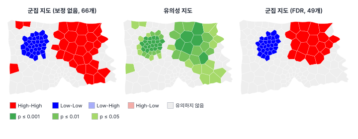
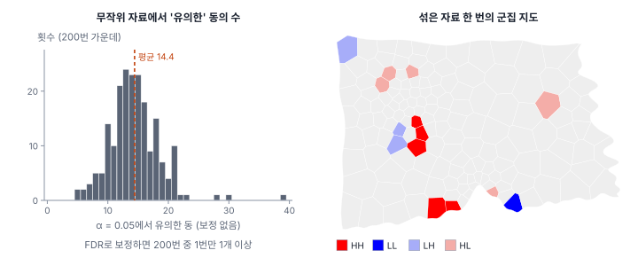
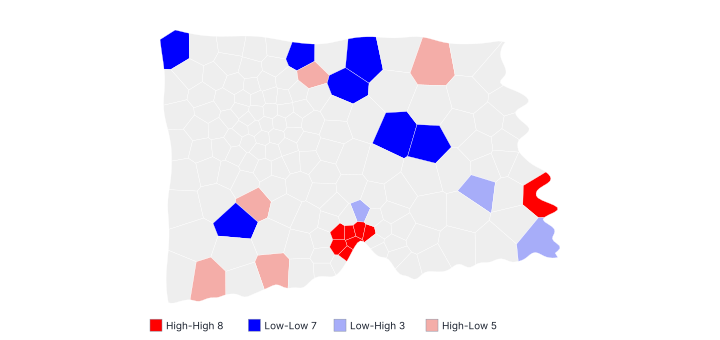

[목차](../README.md) · 이전: [11강 전역 공간 자기상관](11-global-autocorrelation.md) · 다음: [13강 국지 공간 자기상관 II](13-local-statistics.md)

# 12강 국지 공간 자기상관 I: LISA

> 앱 지원: ● 앱에서 따라 할 수 있음 (무작위 자료 실험은 코드로 보충함) · 읽는 시간 약 40분

## 이 강에서 얻는 것

- 국지 Moran's I(LISA)의 식과 조건부 순열을 이해하고, 전역 Moran's I와의 관계를 설명할 수 있음
- 군집 지도의 네 범주(HH, LL, HL, LH)와 유의성 지도를 바르게 읽을 수 있음
- 무작위 자료에서도 LISA가 군집을 찍는 이유를 알고, 다중검정 보정과 순열 횟수를 정할 수 있음
- "LISA는 군집의 핵을 찍을 뿐 경계를 긋지 않는다"는 뜻을 알고, 결과를 과장하지 않고 보고할 수 있음

## 들어가는 질문

11강에서 한빛시 고령비율의 전역 Moran's I는 0.812였음. 시청은 "그러면 고령화가 **어디에** 모여 있는가?"를 물었음. 전역 통계는 이 질문에 답하지 못함. 안셀린(Anselin 1995)은 전역 Moran's I를 구역마다 나눠 계산하는 **LISA**(local indicators of spatial association, 국지적 공간 연관 지표)를 제안했음. 오늘날 공간통계에서 가장 많이 쓰이는 지도 가운데 하나임.

LISA를 고령비율에 돌리면 66개 동이 "유의한 군집"으로 나옴. 같은 방법을 출동률에 돌리면 23개 동이 나옴. 그런데 출동률을 FDR로 보정하면 하나도 남지 않고, 고령비율 값을 지도 위에 아무렇게나 섞은 자료에 돌려도 평균 14개 동이 "유의"하게 나옴. 이 강은 LISA 지도를 어떻게 만들고, 어디까지 믿을 수 있는지 다룸.

## 1. 국지 Moran's I

전역 Moran's I의 분자 Σᵢ Σⱼ w_ij z_i z_j는 구역마다의 몫 z_i Σⱼ w_ij z_j를 더한 것임. 이 몫을 구역별로 따로 보면 **국지 Moran's I**가 됨.

$$
I_i = \frac{(n-1)\, z_i \sum_j w_{ij} z_j}{\sum_k z_k^2}
$$

z_i는 구역 i의 값에서 평균을 뺀 것이고, Σⱼ w_ij z_j는 이웃 값(행 표준화면 이웃의 평균)의 편차, 즉 공간 시차임. 두 부호가 같으면(나도 높고 이웃도 높거나, 나도 낮고 이웃도 낮으면) I_i가 양수, 다르면 음수임. 분모의 상수는 구현마다 n 또는 n − 1을 쓰는데 GeoStat(PySAL)은 n − 1을 씀(부록 E).

안셀린이 LISA라고 부른 조건은 두 가지임. 구역마다 공간 연관의 정도를 나타내야 하고, 국지 통계를 모두 더하면 전역 통계에 비례해야 함. 행 표준화 가중치에서 Σᵢ I_i = (n − 1) × I이므로, 국지 I의 평균이 거의 전역 I임. 한빛시 고령비율에서 국지 I의 합은 120.92이고 149 × 0.8116 = 120.93임. 전역 I = 0.812는 150개 동의 국지 I를 평균 낸 것과 같은 셈이고, LISA는 그 평균을 "어디가 얼마나 기여했는가"로 풀어 보여 줌.

### 손으로 해 보기: 3×3 격자

11강의 "뭉침" 배치(1, 1, 0 / 1, 1, 0 / 0, 0, 0)에서 룩 인접 행 표준화로 국지 I를 구함. 1인 칸의 z는 5/9 = 0.556, 0인 칸의 z는 −4/9 = −0.444, Σz² = 180/81 = 2.222, n − 1 = 8임.

| 칸 | z | 이웃 | 이웃 z의 평균 | I_i |
|---|---|---|---|---|
| 왼쪽 위 (1) | 0.556 | 오른쪽(1), 아래(1) | 0.556 | 8 × 0.556 × 0.556 / 2.222 = 1.111 |
| 가운데 (1) | 0.556 | 위(1), 왼쪽(1), 오른쪽(0), 아래(0) | 0.056 | 0.111 |
| 오른쪽 위 (0) | −0.444 | 왼쪽(1), 아래(0) | 0.056 | −0.089 |
| 오른쪽 아래 (0) | −0.444 | 위(0), 왼쪽(0) | −0.444 | 0.711 |

1이 모인 덩어리 안쪽(이웃이 모두 1인 왼쪽 위)과 0이 모인 곳의 구석(오른쪽 아래)이 큰 양수임. 가운데 칸은 자신은 1인데 이웃이 반반이라 작음. 덩어리의 **가장자리는 국지 I가 작음**. 9개 칸의 I_i를 모두 더하면 3.0이고, 이는 (n − 1) × 전역 I(행 표준화에서 0.375) = 8 × 0.375와 같음. 11강의 0.350은 같은 배치를 이진 가중치로 구한 값임.

## 2. 조건부 순열

I_i가 우연인지 판단하는 데도 순열을 씀. 다만 전역 검정과 달리, 구역 i의 값은 **제자리에 두고** 나머지 n − 1개 값을 섞어 i의 이웃 자리에 다시 배치함. 이를 **조건부 순열**(conditional permutation)이라 함. "구역 i의 값이 이만할 때, 이웃이 무작위로 정해졌다면 I_i가 이만큼 극단적일 확률"을 구하는 것임. 999번 되풀이해 유사 p값을 냄.

GeoStat은 GeoDa와 같은 방식으로, 관측값이 있는 쪽 꼬리만 센 유사 p값을 냄. 이것이 무엇을 뜻하는지는 4절에서 봄.

## 3. 군집 지도와 유의성 지도

유의한 구역을 Moran 산점도(11강)의 사분면으로 나눠 칠한 것이 **군집 지도**(cluster map)임.

| 범주 | 뜻 | 종류 |
|---|---|---|
| High-High (HH) | 나도 높고 이웃도 높음 | 군집 (핫스팟) |
| Low-Low (LL) | 나도 낮고 이웃도 낮음 | 군집 (콜드스팟) |
| High-Low (HL) | 나는 높은데 이웃은 낮음 | 공간 이상치 |
| Low-High (LH) | 나는 낮은데 이웃은 높음 | 공간 이상치 |

**유의성 지도**(significance map)는 같은 구역을 유사 p값의 크기(0.05, 0.01, 0.001, 0.0001 이하)로 칠함. 두 지도는 함께 봄.



고령비율은 보정 없이 66개 동(HH 31, LL 35)이 유의함. 동쪽 외곽에 고령비율이 높은 동의 군집이, 도심에 낮은 동의 군집이 있음. 이상치(HL, LH)는 없음. FDR로 보정하면 49개(HH 19, LL 30)로 줄지만 두 군집의 핵은 그대로임. 보정 전 지도에서 서쪽과 북쪽 가장자리에 흩어져 있던 HH 동들은 보정 후 사라짐. 유의성 지도를 보면 두 군집의 한가운데는 유사 p가 0.001(순열 999번에서 가장 작은 값)인 동이 27개이고, 가장자리로 갈수록 p가 커짐.

### 군집 지도를 읽을 때의 주의

- **LISA는 군집의 핵을 찍을 뿐 경계를 긋지 않음**: 유의한 HH 동은 "그 동과 이웃이 함께 높은 곳의 중심"임. 군집이 정확히 어디까지인지는 말하지 않음. 고령비율에서 유의한 HH 31개 동의 이웃 가운데 HH로 찍히지 않은 동이 29개인데, 그중 24개는 산점도로는 HH 사분면에 있었음. 군집은 찍힌 동보다 넓게 퍼져 있음. 손계산에서 덩어리의 가장자리 칸이 작은 I를 가졌던 것과 같은 이유임
- **유의한 구역끼리의 겹침**: 이웃한 두 동의 검정은 이웃을 나눠 쓰므로 서로 독립이 아님. 붙어 있는 HH 동 다섯 개는 독립적인 군집 다섯 개가 아니라 하나의 군집을 여러 번 본 것에 가까움
- **이웃이 적은 동**: 이웃이 적은 동(대개 시 경계의 동)은 이웃 몇 개의 값에 크게 흔들림. 한빛시에서 이웃이 4개 이하인 동 29개는 28%가, 5개 이상인 동은 48%가 유의했음. 이 차이에는 군집이 어디에 있는지도 섞여 있지만, 가장자리에서 군집이 덜 찍히거나 더 흔들릴 수 있음(4강의 경계 효과)
- **"높다"는 평균에 대한 것임**: HH의 "높음"은 도시 평균보다 높다는 뜻이지, 정책 기준이나 다른 도시보다 높다는 뜻이 아님

## 4. 무작위 자료에서도 군집이 찍힘

LISA는 150개 동마다 검정하므로 7강의 다중검정 문제를 그대로 안고 있음. 직접 확인해 봄. 고령비율 값 150개를 행정동에 무작위로 섞으면 값의 분포는 같지만 공간 패턴은 없음. 이런 자료를 200개 만들어 LISA를 돌림.



공간 패턴이 전혀 없는데도 보정 없이 α = 0.05로 보면 매번 5~39개, 평균 14.4개 동이 유의하게 찍혔음. 150 × 0.05 = 7.5개의 두 배쯤임. 이유는 유사 p값이 관측값이 있는 쪽 꼬리만 세기 때문임. 귀무가설 아래에서 I_i는 큰 쪽으로도 작은 쪽으로도 벗어날 수 있는데, 어느 쪽으로 벗어나든 그쪽 꼬리로 p를 재므로 "p ≤ 0.05"가 실제로는 양쪽 합쳐 약 10%의 확률로 일어남. 그래서 **LISA의 α = 0.05는 사실상 양측 10% 수준**으로 봐야 함. 한 번의 지도(오른쪽)에도 HH, HL, LH가 흩어져 있어, 이것만 보면 "군집"이나 "이상치"로 해석하고 싶어짐.

FDR로 보정하면 200번 가운데 1번만 유의한 동이 하나 이상 나왔음. 다만 이것은 순열 999번의 한계 덕도 있음. 가장 작은 유사 p가 0.001이라, 0.001인 동이 셋 이상 나오지 않으면 FDR 기준을 넘지 못함. 순열을 9,999번으로 늘려 같은 실험을 200번 하면 FDR 후에도 9.5%에서 유의한 동이 하나 이상 나왔음. 단측으로 접은 유사 p 때문에 FDR의 5%도 사실상 10% 수준이 되는 것임. FDR의 기준(q)을 0.025로 절반 낮추면 4.0%로 줄었음.

### 대응

- **다중검정 보정**을 함. GeoStat의 국지 통계 창에서 FDR이나 Bonferroni를 고를 수 있음. 다만 이웃한 구역의 검정은 서로 독립이 아니어서, 보정은 대략적인 기준임(de Castro & Singer 2006)
- **순열 횟수를 늘림**: 순열 999번의 가장 작은 유사 p값은 0.001이라 Bonferroni 기준(0.05/150 = 0.00033)을 넘을 수 없고(7강), FDR도 가장 작은 p의 기준이 같은 0.00033이라 제약을 받음. 보정을 하면 9,999번으로 늘림
- **α를 절반으로 씀**: 유사 p가 관측 쪽 꼬리만 세므로, 양측 5% 수준을 원하면 α(또는 FDR의 q)를 0.025로 둠
- **엄격한 α를 함께 봄**: 안셀린(Anselin 1995)은 Bonferroni 같은 보정이 국지 통계에서 지나치게 보수적일 수 있다고 지적했고, GeoDa는 α = 0.01이나 0.001처럼 작은 기준으로 지도를 걸러 보기를 권함. 유의성 지도로 p의 크기를 같이 보는 것이 그 방법임
- **유의성의 안정성을 확인함**: 순열 횟수와 시드를 바꿔도 같은 동이 유의한지 봄
- **탐색으로 씀**: LISA는 가설을 만드는 탐색 도구임(5강). 찍힌 곳은 후보이고, 확증은 다른 자료나 미리 정한 가설로 함(15강)

## 5. 출동률의 LISA



출동률은 보정 없이 23개 동이 유의함.

| 범주 | 동 수 | 동 |
|---|---|---|
| High-High | 8 | 마루13·15·16·17·18·30·31동, 다솜20동 |
| Low-Low | 7 | 가람1동, 누리1·3·11·23동, 다솜12동, 라온13동 |
| High-Low | 5 | 누리9동, 다솜1동, 라온9·17·18동 |
| Low-High | 3 | 다솜18·24동, 마루5동 |

마루구 원도심의 HH 7개는 5강과 7강에서 본 동들과 겹침. 그러나 무작위 자료에서도 평균 14개가 찍힌다는 것을 생각하면, 23개 가운데 상당수는 우연일 수 있음. FDR로 보정하면 하나도 남지 않음. 유사 p가 0.001인 동은 하나뿐이고 그다음이 0.004, 0.004, 0.005…라, k번째로 작은 p가 k × 0.05/150(0.00033, 0.00067, 0.001, …) 이하인 경우가 없기 때문임. 순열을 9,999번으로 늘려도 마찬가지임.

정리하면, 출동률에 대한 LISA의 증거는 약함. "마루구 원도심에 출동률이 높은 동이 모여 있을 가능성이 있음(보정 전 HH 7개 동, 보정 후 유의하지 않음)" 정도로 보고하고, 확인은 다른 방법(7강의 동별 검정, 14강의 EB LISA, 15강의 스캔 통계)으로 함. 출동률 같은 비율 자료는 인구가 적은 동의 흔들림이 LISA를 흐리므로(다솜1동은 인구 1,063명에 HL로 찍힘), 14강의 EB 비율 LISA를 함께 봄.

## 해 보기: GeoStat에서 LISA 지도 만들기

1. `hanbit_dong.gpkg`와 `hanbit_events.gpkg`를 열고 `출동률`과 `고령비율`을 만들고(5강·7강), **퀸 인접 (Queen)** 공간가중치를 만듦(10강)
2. **공간 분석 → 국지 통계 (LISA · Gi\* · Local Geary)…** 메뉴에서 방법 **Local Moran (LISA)**, 변수 `고령비율`, 순열 999번, 유의수준 α 0.05, 다중검정 보정 **없음**, 결과 열 접두어 `LISA`로 **실행**함
   - 확인: 알림에 "유의한 피처 66개 (p ≤ 0.0500)". 지도가 군집 지도로 바뀌고 범례에 High-High 31, Low-Low 35가 나옴
3. 왼쪽 **주제도**에서 방법을 먼저 **유의성 지도 (p값)** 항목으로 고르면 변수가 `LISA_P`로 바뀜. 적용하고, 군집의 중심일수록 p가 작은지 봄. 다시 방법 **LISA 군집 지도**, 변수 `LISA_CL`로 돌아옴
   - 주의: 현재 판에서는 유사 p가 0.001인 27개 동이 "p ≤ 0.001"이 아니라 "p ≤ 0.01" 계급으로 칠해짐. 내부에서 p값을 저장하는 정밀도 때문에 생기는 표시 문제이며, 그림 12-cluster의 유의성 지도가 올바른 계급임
4. 범례의 **High-High** 줄을 눌러 HH 동을 선택하고, 공간가중치 칸의 **이웃 선택**을 눌러 이웃까지 선택을 넓힘(알림: "이웃 29개를 선택에 추가함"). 새로 선택된 동이 군집 지도에서는 "유의하지 않음"인데 고령비율 값은 높은지 속성 테이블에서 확인함(군집의 핵과 경계)
5. 메뉴를 다시 열면 설정이 처음으로 돌아가므로, 변수 `고령비율`을 다시 고르고 다중검정 보정 **FDR (Benjamini-Hochberg)**, 결과 열 접두어 `LISA_FDR`로 실행함
   - 확인: "유의한 피처 49개 (p ≤ 0.0163)", High-High 19, Low-Low 30
6. 메뉴를 다시 열어 변수 `출동률`, 보정 **없음**, 접두어 `RATE`로 실행함
   - 확인: "유의한 피처 23개 (p ≤ 0.0500)". High-High 8, Low-Low 7, Low-High 3, High-Low 5
7. 메뉴를 다시 열어 변수 `출동률`, 보정 **FDR (Benjamini-Hochberg)**, 접두어 `RATE_FDR`로 실행함
   - 확인: "유의한 피처 0개 (p ≤ 0.000333)". 통과하는 동이 없으면 기준값으로 α/n이 표시됨
8. (선택) 주제도를 변수 `RATE_CL`, 방법 **LISA 군집 지도**로 바꾼 뒤, **차트**의 **+ Moran 산점도** 로 `출동률`의 산점도를 띄우고, 군집 지도에서 HH로 찍힌 동을 범례로 선택해 산점도의 어디에 있는지 봄
9. (0강의 인상 확인) 11강에서 연 노스캐롤라이나 샘플의 `SIDR79`로 같은 설정(퀸, 순열 999, α 0.05, 보정 없음)의 LISA를 돌림
   - 확인: 유의한 피처 10개. High-High 3, Low-Low 5, Low-High 1, High-Low 1. 0강에서 눈으로 본 "모인 곳"이 HH로 찍혔는지 비교함

### 코드로: 무작위 자료에서 LISA 돌려 보기

```python
import geopandas as gpd
import numpy as np
from esda import Moran_Local
from libpysal.weights import Queen

dong = gpd.read_file("book/data/hanbit_dong.gpkg")
x = (dong["고령인구"] / dong["인구"] * 100).to_numpy()
w = Queen.from_dataframe(dong, use_index=False)
w.transform = "r"

rng = np.random.default_rng(1)
found = []
for _ in range(50):
    xs = rng.permutation(x)                       # 값의 분포는 같고 공간 패턴은 없음
    lm = Moran_Local(xs, w, permutations=999, seed=123456789)
    found.append((lm.p_sim <= 0.05).sum())
print(f"무작위 자료에서 '유의'한 동: 평균 {np.mean(found):.1f}개, 범위 {min(found)}~{max(found)}")
```

- 확인: 평균 15.3개, 범위 7~34(시드 1로 50번). 50번뿐이라 시드를 바꾸면 조금 달라짐(200번 돌린 본문 실험은 평균 14.4개). 150 × 0.05 = 7.5개의 약 두 배임
- 더 해 보기: `from scipy.stats import false_discovery_control`으로 `lm.p_sim`을 보정하고 같은 일을 해 봄. 순열을 9,999번으로 늘려야 보정을 통과하는 동이 나올 수 있음

## 헷갈리는 쌍

- **전역 I vs 국지 I**: 전역 I는 도시 전체의 평균적인 닮음, 국지 I는 구역마다의 몫. 국지 I의 합은 (n − 1) × 전역 I
- **군집 지도 vs 유의성 지도**: 군집 지도는 유의한 구역의 종류(HH, LL, HL, LH), 유의성 지도는 유사 p값의 크기를 보여 줌
- **HH vs 핫스팟**: LISA의 HH는 "나와 이웃이 함께 높음". 13강의 Gi* 핫스팟은 "나를 포함한 주변의 합이 큼". 대체로 겹치지만 같지 않음
- **군집 vs 공간 이상치**: HH·LL은 비슷한 값의 군집, HL·LH는 주변과 다른 값의 이상치
- **조건부 순열 vs 전체 순열**: LISA는 기준 구역의 값을 고정하고 나머지만 섞음. 전역 검정은 모든 값을 섞음
- **핵 vs 경계**: LISA가 찍는 것은 군집의 중심이고, 군집이 어디까지인지는 따로 판단해야 함

## 흔한 실수와 심사 지적

- **보정 없이 군집 지도를 결론으로 씀**
  - 지적: "150개 구역에 대한 국지 검정의 다중검정 문제를 어떻게 다뤘습니까?"
  - 대응: FDR이나 Bonferroni로 보정한 결과(순열 9,999번)를 함께 제시하거나, 탐색 목적임을 밝히고 α = 0.01의 결과를 같이 보여 줌
- **찍힌 동만 "군집"이라고 보고 경계를 그음**
  - 결과: 군집의 크기를 과소평가하거나, 행정 경계를 군집의 경계로 오해함
  - 대응: "군집의 핵"이라고 쓰고, 이웃까지의 패턴을 지도로 함께 보여 줌
- **HL·LH 이상치를 자료 오류나 특별한 장소로 단정함**
  - 대응: 인구가 적어 비율이 튄 것은 아닌지(14강), 경계 효과는 아닌지 먼저 확인함
- **가중치·순열 횟수·시드·보정 방법을 밝히지 않음**
  - 대응: 모두 적음. LISA는 가중치에 따라 결과가 크게 달라질 수 있으므로(10강) 다른 가중치로도 봄
- **원비율로 LISA를 돌리고 끝냄**
  - 대응: 비율 자료는 EB 비율 LISA(14강)를 함께 봄

## 보고서에는 이렇게 씀

> 고령비율의 국지적 공간 연관을 LISA(국지 Moran's I, Anselin 1995)로 분석하였다. 공간가중치는 1차 퀸 인접(행 표준화)을 사용하였고, 유의성은 조건부 순열 999회(난수 시드 123456789)로 구한 단측(관측값 쪽) 유사 p값으로 판단하였다. 보정 전 α = 0.05에서는 66개 행정동(High-High 31개, Low-Low 35개)이 유의하였고, 다중검정을 고려해 벤야미니–호흐베르크 방법(q = 0.05)을 적용한 결과 49개 행정동이 유의하였다(High-High 19개, Low-Low 30개, 공간 이상치 없음). 고령비율이 높은 행정동의 군집은 동부 외곽에, 낮은 행정동의 군집은 도심에 위치하였다. 출동률은 보정 전 23개 행정동이 유의하였으나 보정 후에는 유의한 행정동이 없어, 국지적 군집의 증거는 약하였다.

적어야 할 항목은 다음과 같음.

- 국지 통계의 종류(국지 Moran's I)와 가중치
- 순열 횟수와 시드, 유사 p값의 방식(조건부 순열)
- 유의수준과 다중검정 보정 방법, 보정 전후의 결과
- 범주별 구역 수와 위치, 이상치의 해석
- "군집의 핵"을 보여 준 것이며 경계를 그은 것이 아니라는 점

## 요약

- LISA(국지 Moran's I)는 전역 Moran's I를 구역마다 나눈 것으로, 국지 I의 합이 (n − 1) × 전역 I임
- 유의성은 기준 구역의 값을 고정하고 나머지를 섞는 조건부 순열로 판단하며, 결과를 HH·LL(군집)과 HL·LH(이상치)로 나눈 군집 지도와 p값의 유의성 지도로 함께 봄
- 유사 p값이 관측값 쪽 꼬리만 세므로 α = 0.05는 사실상 양측 10% 수준임. 공간 패턴이 없는 자료에서도 평균 14.4개 동이 유의하게 찍혔음. FDR 보정은 이를 크게 줄이지만, 순열을 충분히 늘리면 FDR의 5%도 사실상 10% 수준임
- 한빛시 고령비율은 보정 후에도 49개 동의 뚜렷한 군집이 남지만, 출동률은 보정 후 남는 동이 없음
- LISA는 군집의 핵을 찍는 탐색 도구이며, 경계를 긋거나 확증하지 않음

## 핵심 용어

| 한글 | 영문 | 비고 |
|---|---|---|
| 국지적 공간 연관 지표 | Local Indicators of Spatial Association (LISA) | Anselin 1995 |
| 국지 모란의 I | Local Moran's I | |
| 조건부 순열 | Conditional Permutation | 기준 구역의 값을 고정 |
| 군집 지도 | Cluster Map | HH, LL, HL, LH |
| 유의성 지도 | Significance Map | 유사 p값의 크기 |
| 공간 군집 | Spatial Cluster | HH, LL |
| 공간 이상치 | Spatial Outlier | HL, LH |
| 핫스팟 / 콜드스팟 | Hot Spot / Cold Spot | 13강 |
| 다중검정 보정 | Multiple Testing Correction | FDR, Bonferroni |

## 원전과 더 읽을거리

**원전**

- Anselin, L. (1995). Local indicators of spatial association—LISA. *Geographical Analysis*, 27(2), 93–115. LISA와 조건부 순열

**더 읽을거리**

- de Castro, M. C., & Singer, B. H. (2006). Controlling the false discovery rate: A new application to account for multiple and dependent tests in local statistics of spatial association. *Geographical Analysis*, 38(2), 180–208. 국지 통계의 다중검정
- Sokal, R. R., Oden, N. L., & Thomson, B. A. (1998). Local spatial autocorrelation in a biological model. *Geographical Analysis*, 30(4), 331–354. 국지 통계의 분포와 검정 문제
- Anselin, L. (2019). A local indicator of multivariate spatial association: Extending Geary's c. *Geographical Analysis*, 51(2), 133–150. 다변량 국지 통계(13강)
- Rey, S. J., Arribas-Bel, D., & Wolf, L. J. (2023). *Geographic Data Science with Python*. CRC Press. 7장(Local Spatial Autocorrelation)

## 연습

1. 손으로 해 보기의 3×3 "뭉침" 배치에서 왼쪽 아래 칸(0)의 국지 I를 구하시오. 이웃은 위(1)와 오른쪽(0)임.

2. 유의한 HH 동 A의 이웃 B가 군집 지도에서 "유의하지 않음"으로 나왔는데, B의 고령비율도 높았음. B가 군집에 속하지 않는다고 말할 수 있는가?

3. 구역이 300개인 자료에서 공간 패턴이 전혀 없다면, 보정 없이 α = 0.05로 LISA를 돌렸을 때 대략 몇 개가 유의하게 찍힐 것으로 예상하는가? 그 이유는?

4. 출동률 LISA에서 다솜1동(인구 1,063명)이 High-Low로 찍혔음. 이 결과를 "주변보다 위험한 특이 지역"으로 해석하기 전에 확인할 것을 두 가지 쓰시오.

5. 보정 전 23개였던 출동률의 유의한 동이 FDR 보정 후 0개가 되었음. "출동률에는 국지적 군집이 없다"고 결론 내리는 것은 옳은가?

<details>
<summary>해답</summary>

1. 왼쪽 아래 칸의 z = −0.444. 이웃 z는 위 칸 0.556, 오른쪽 칸 −0.444이므로 평균 0.056. I_i = 8 × (−0.444) × 0.056 / 2.222 = −0.089. 자신은 낮은데 이웃의 평균이 약간 높아 작은 음수임.

2. 말할 수 없음. LISA는 A와 그 이웃이 함께 높은 "핵"을 찍을 뿐 군집의 경계를 정하지 않음. B는 자신의 이웃 가운데 낮은 값이 섞여 있거나 검정력이 부족해 유의하지 않았을 수 있음. B는 A가 중심인 군집의 일부일 가능성이 큼. 지도와 값, 이웃 선택으로 패턴을 함께 봐야 함.

3. 약 30개(300 × 0.10). GeoStat·GeoDa의 유사 p값은 관측값이 있는 쪽 꼬리만 세므로, 귀무가설에서 p ≤ 0.05가 양쪽 합쳐 약 10%의 확률로 일어남. 이 강의 실험에서도 150개 중 평균 14.4개(9.6%)였음.

4. (가) 인구가 적어 출동 몇 건으로 비율이 튄 것은 아닌지(6강의 깔때기 그림, 14강의 EB 비율). 다솜1동은 출동 4건으로 출동률이 37.6임. (나) 다중검정 보정 후에도 유의한지, 순열 횟수·시드·가중치를 바꿔도 같은지. 그 밖에 이웃 수가 적은 가장자리 동인지(경계 효과)도 확인함.

5. 옳지 않음. "보정 후 유의하지 않음"은 "군집이 없다"는 증거가 아니라 "150개 동 각각에 대해 확신할 만한 증거가 없다"는 뜻임. 동마다 검정하는 LISA는 검정력이 낮음. 11강의 General G나 15강의 스캔 통계처럼 다른 질문을 하는 방법으로 확인하고, "국지적 군집의 증거는 약함"으로 보고함.

</details>

---

[목차](../README.md) · 이전: [11강 전역 공간 자기상관](11-global-autocorrelation.md) · 다음: [13강 국지 공간 자기상관 II](13-local-statistics.md)
