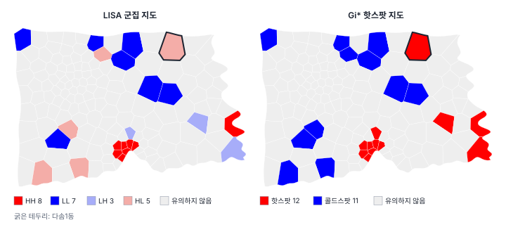
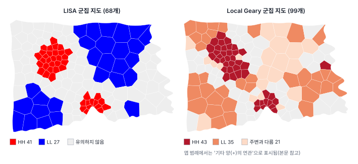
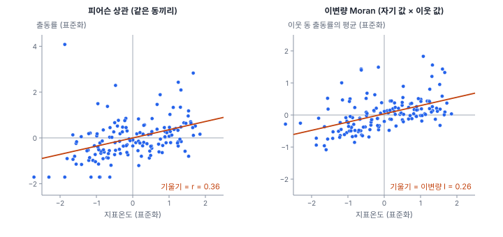
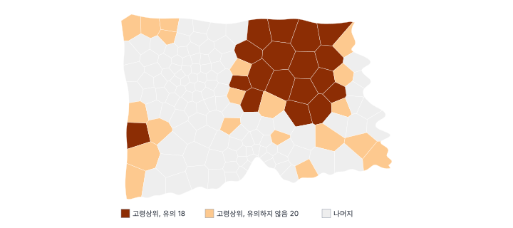

[목차](../README.md) · 이전: [12강 국지 공간 자기상관 I: LISA](12-lisa.md) · 다음: [14강 비율 자료와 작은 수 문제](14-rates-small-numbers.md)

# 13강 국지 공간 자기상관 II

> 앱 지원: ◐ Gi\*, Local Geary, 이변량 Moran·이변량 LISA, 전역 Join Count는 앱에서, Lee's L, 다변량 Local Geary, 국지 Join Count는 코드로 함 · 읽는 시간 약 45분

## 이 강에서 얻는 것

- Getis-Ord Gi\*의 식을 알고, LISA와 무엇이 같고 무엇이 다른지 설명할 수 있음
- "핫스팟 분석"이라는 이름이 도구마다 다른 통계와 추론을 가리킨다는 것을 알고, 보고서에 무엇을 적어야 하는지 앎
- Local Geary가 LISA와 다른 무엇을 보는지 알고 군집 지도를 바르게 읽을 수 있음
- 이변량 Moran's I의 함정을 알고 Lee's L과 구별할 수 있음
- 범주 자료에 전역·국지 Join Count를 쓸 수 있음

## 들어가는 질문

12강에서 출동률의 LISA는 보정 없이 23개 동을 찍었음. 같은 자료를 소방본부 담당자가 다른 프로그램의 "핫스팟 분석"으로 돌렸더니 유의한 동이 13개였고, LISA에서 "Low-High 이상치"였던 다솜18동이 "99% 신뢰수준의 핫스팟"으로 나왔음. 어느 쪽이 맞는가?

둘 다 맞음. 다른 통계를 다른 방식으로 검정했을 뿐임. 국지 통계는 LISA 하나가 아니고, 저마다 다른 질문에 답함. 이 강은 LISA 다음으로 많이 쓰이는 국지 통계 네 가지(Gi\*, Local Geary, 이변량 통계, Join Count)를 LISA와 나란히 놓고, 같은 동이 왜 다르게 찍히는지 봄.

## 1. Getis-Ord Gi와 Gi\*

게티스와 오드(Getis & Ord 1992)는 11강의 General G를 구역마다 나눈 **Gi**를 제안했음. 구역 i의 이웃 값의 합이 전체 합에서 차지하는 몫임. 자기 자신을 이웃에 넣으면 **Gi\***(지 아이 스타)가 됨. Gi는 대개 표준화한 z값으로 쓰고, 오드와 게티스(Ord & Getis 1995)는 이를 이진이 아닌 일반 가중치로 넓혔음. Gi\*의 z는 다음과 같음.

$$
z_i^{*} = \frac{\sum_j w_{ij} x_j - \bar{x} \sum_j w_{ij}}{S \sqrt{\dfrac{n \sum_j w_{ij}^2 - \left(\sum_j w_{ij}\right)^2}{n-1}}}, \qquad S = \sqrt{\frac{\sum_j x_j^2}{n} - \bar{x}^2}
$$

w는 이진 가중치이고, Gi\*에서는 w_ii = 1(자기 자신 포함)임. 분자는 "나와 이웃 값의 합"에서 "그 칸 수만큼 평균을 더한 값"을 뺀 것임. z가 크게 양수면 **핫스팟**(높은 값이 모인 곳), 크게 음수면 **콜드스팟**(낮은 값이 모인 곳)임.

LISA와 가장 큰 차이는 부호의 뜻임. LISA의 국지 I는 "나와 이웃이 닮았는가"를 부호로 말하고(높은 곳끼리든 낮은 곳끼리든 닮으면 양수), Gi\*의 z는 "나를 포함한 주변이 높은가 낮은가"를 부호로 말함.

### 손으로 해 보기: 3×3 격자

12강의 "뭉침" 배치(1, 1, 0 / 1, 1, 0 / 0, 0, 0)에 룩 인접과 자기 자신을 넣은 이진 가중치로 Gi\*를 구함. x̄ = 4/9 = 0.444, S = 0.497, n = 9임.

| 칸 | 나와 이웃의 합 (칸 수) | 기댓값 x̄ × 칸 수 | 분모 | Gi\* z | LISA I_i (12강) |
|---|---|---|---|---|---|
| 왼쪽 위 (1) | 3 (3칸) | 1.333 | 0.745 | 2.236 | 1.111 |
| 가운데 (1) | 3 (5칸) | 2.222 | 0.786 | 0.990 | 0.111 |
| 오른쪽 위 (0) | 1 (3칸) | 1.333 | 0.745 | −0.447 | −0.089 |
| 오른쪽 아래 (0) | 0 (3칸) | 1.333 | 0.745 | −1.789 | 0.711 |

왼쪽 위 칸의 분모는 0.497 × √((9 × 3 − 3²)/8) = 0.497 × 1.5 = 0.745임. 오른쪽 아래 칸을 보면 차이가 드러남. LISA는 "0인 칸이 0인 이웃에 둘러싸여 닮았음"이라 양수(LL)이고, Gi\*는 "주변이 낮음"이라 음수(콜드스팟)임. 높은 군집과 낮은 군집에서는 둘이 같은 곳을 가리키지만 표현 방식이 다름.

### Gi와 Gi\*

자기 자신을 빼면 Gi임. Gi는 "주변이 높은가"를, Gi\*는 "나를 포함한 구역 묶음이 높은가"를 물음. 오드와 게티스는 구역 i도 군집의 일부일 수 있는 핫스팟 탐지에는 Gi\*를, 구역 i가 주변에 미치는 영향(예: 공장 주변의 오염)을 볼 때는 Gi를 권했음. GeoStat에는 Gi\*만 있음. G 통계의 비율(이웃 합 ÷ 전체 합)은 값이 0 이상인 변수(개수, 비율 등)를 위한 것임. 다만 표준화한 z는 모든 값에 같은 상수를 더해도 바뀌지 않으므로, 음수가 섞인 변수(편차, 잔차)에도 z는 그대로 해석할 수 있음.

## 2. Gi\*와 LISA: 같은 p, 다른 라벨

GeoStat에서 같은 변수와 가중치로 LISA와 Gi\*를 돌리면, 퀸·룩·KNN처럼 이웃마다 가중치가 같은 경우 **유사 p값이 완전히 같음**. 두 통계 모두 구역 i의 값을 고정하고 이웃 자리에 나머지 값을 섞어 넣는 조건부 순열(12강)을 쓰고, 시드가 같으면 같은 순열이 나옴. 구역 i의 값이 고정되면 국지 I도 Gi\*도 "이웃 값의 합"이 커질수록 한쪽으로만 커지거나 작아지므로, 순열 분포에서 관측값이 차지하는 순위가 같음. 그래서 **유의한 동의 집합이 같고, 다른 것은 라벨뿐임**. 역거리나 커널 가중치처럼 이웃마다 가중치가 다르면 달라짐. GeoStat의 Gi\*는 어떤 가중치든 0/1 이진 가중치로 바꿔 쓰는데(10강), LISA는 원래 가중치를 행 표준화해 쓰기 때문임.

| 변수 | LISA (보정 없음) | Gi\* (보정 없음) | FDR 보정 후 |
|---|---|---|---|
| 지표온도(ZS_MEAN) | HH 41, LL 27 | 핫 41, 콜드 27 | 같은 34개·18개 |
| 고령비율 | HH 31, LL 35 | 핫 31, 콜드 35 | 같은 19개·30개 |
| 출동률 | HH 8, LL 7, LH 3, HL 5 | 핫 12, 콜드 11 | 둘 다 0개 |

지표온도와 고령비율처럼 이상치가 없으면 HH = 핫스팟, LL = 콜드스팟으로 두 지도가 같음. 출동률처럼 이상치가 있으면 달라짐.



- **LISA의 LH → Gi\* 핫스팟**: 다솜18동은 자기 출동률이 7.02로 평균(11.12)보다 낮지만 이웃 5개 동의 평균이 20.80임. 자신을 넣어도 평균이 18.50이라 Gi\*로는 핫스팟(z = 2.83)임. 다솜24동, 마루5동도 같음. LISA는 "높은 곳 사이의 낮은 동(이상치)"이라고 하고, Gi\*는 "높은 곳의 일부"라고 함
- **LISA의 HL → Gi\* 콜드스팟**: 누리9동(14.50, 이웃 평균 6.68), 라온9·17·18동이 그러함
- **예외인 다솜1동**: 자기 출동률이 37.63으로 매우 높고, 이웃 다섯 동의 평균은 6.42(두 동은 0)임. LISA는 High-Low임. 그런데 Gi\*에서는 핫스팟으로 찍힘. 자신을 넣은 여섯 동의 평균이 11.62로 시 평균 11.12보다 아주 조금 높아 z = 0.19가 되었고, GeoStat은 핫·콜드를 z의 부호로 정하기 때문임

다솜1동은 두 가지를 알려 줌. 첫째, Gi\* 지도의 "핫스팟"은 **유의성과 방향을 따로 정함**. 유의성(유사 p = 0.015)은 "자기 값을 고정했을 때 이웃이 이례적으로 낮다"는 데서 왔고, 방향(z = 0.19)은 "자신을 포함한 합이 평균보다 조금 높다"는 데서 왔음. 둘이 어긋나면 z가 0에 가까운 "유의한 핫스팟"이 생김. 결과 열 `GISTAR_Z`를 함께 보고, z가 작은 핫스팟은 의심함. 둘째, 다솜1동은 인구가 1,063명이고 출동은 4건뿐임. 몇 건의 차이로 비율이 크게 흔들리는 동이 국지 통계의 결과를 좌우하고 있음(14강).

## 3. "핫스팟 분석"이라는 이름

"핫스팟 분석"은 하나의 방법이 아님. 도구마다 다른 통계를 다른 방식으로 검정함.

| 도구에서 부르는 이름 | 실제 통계 | 유의성 판단 (기본 설정) |
|---|---|---|
| ArcGIS Pro의 Hot Spot Analysis (Getis-Ord Gi\*) | Gi\* | z를 정규분포에 비춘 양측 p. 90·95·99% 신뢰수준으로 칠함(Gi_Bin) |
| ArcGIS Pro의 Cluster and Outlier Analysis (Anselin Local Moran's I) | 국지 Moran's I (LISA) | 순열 |
| ArcGIS Pro의 Optimized Hot Spot Analysis | Gi\* | 거리 척도를 자동으로 고르고 FDR 보정 |
| GeoDa의 Local G* | Gi\* | 조건부 순열 (단측으로 접은 유사 p) |
| GeoStat의 Gi\* 핫스팟 지도 | Gi\* | 조건부 순열 (단측으로 접은 유사 p) |
| 범죄 지도학의 "핫스팟 지도" | 커널 밀도 추정(17강) | 흔히 검정 없음 |
| 역학의 "군집" | 공간 스캔 통계(15강) | 몬테카를로 |

같은 Gi\*라도 추론 방식이 다르면 결과가 다름. 출동률의 Gi\* z를 정규분포에 비춰 양측 p ≤ 0.05(|z| ≥ 1.96)로 판정하면 13개 동(핫 10, 콜드 3)이고, 90% 신뢰수준(|z| ≥ 1.645)이면 20개 동(핫 11, 콜드 9)임. GeoStat의 조건부 순열로는 23개임. 12강에서 본 것처럼 단측으로 접은 유사 p의 α = 0.05는 양측 10%에 가까워서, 90% 신뢰수준의 결과와 비슷한 수가 나옴. 지표온도처럼 패턴이 뚜렷한 변수는 정규 근사 66개, 순열 68개로 차이가 작음. 들어가는 질문의 다솜18동은 z = 2.83이라 정규 근사로는 99% 신뢰수준의 핫스팟이고, LISA로는 LH 이상치였음.

그래서 보고서에 "핫스팟 분석 결과"라고만 쓰면 안 됨. 통계의 이름(Gi\*인지 국지 Moran's I인지), 가중치, 추론 방식(정규 근사인지 순열인지, 순열 횟수와 시드), 유의수준과 보정 방법을 함께 적어야 다른 사람이 같은 결과를 낼 수 있음.

## 4. Local Geary

11강의 Geary's C를 구역마다 나눈 **Local Geary**는 안셀린(Anselin 1995)이 LISA의 하나로 제안했고, 안셀린(Anselin 2019)이 군집 범주와 다변량판까지 체계화했음.

$$
c_i = \sum_j w_{ij} \left(z_i - z_j\right)^2
$$

z는 표준화한 값이고, 가중치는 행 표준화임. 나와 이웃 하나하나의 차이를 제곱해 평균 낸 것이라, c_i가 작으면 이웃과 비슷하고(양의 연관), 크면 이웃과 다름(음의 연관). LISA는 이웃의 **평균**과 나를 비교하지만, Local Geary는 이웃 **하나하나**와 나를 비교함. 이웃 평균은 나와 같지만 이웃끼리 값이 크게 엇갈리는 구역은, LISA로는 0에 가깝고 Local Geary로는 큼.

손계산의 "뭉침" 배치에서, 1과 0의 표준화한 값의 차이는 1/0.497 = 2.01이고 그 제곱은 4.05임. 왼쪽 위 칸은 이웃이 모두 1이라 c = 0이고, 가운데 칸은 이웃 넷 가운데 둘이 0이라 c = (0 + 0 + 4.05 + 4.05)/4 = 2.025임. 오른쪽 아래 칸은 이웃이 모두 0이라 c = 0임. 덩어리의 안쪽은 0, 경계에 걸친 칸은 큼.

유의성은 LISA와 같은 조건부 순열로 판단하고, 유의한 구역을 다음처럼 나눔.

| GeoStat 코드 | 조건 | 뜻 |
|---|---|---|
| 1 High-High | c_i가 평균보다 작고 값이 평균보다 큼 | 이웃과 비슷하면서 높음 |
| 2 Low-Low | c_i가 평균보다 작고 값이 평균보다 작음 | 이웃과 비슷하면서 낮음 |
| 3 | c_i가 평균보다 큼 | 이웃과 다름 (음의 연관) |

> 주의: GeoStat 현재 판의 범례는 코드 3을 "기타 양(+)의 연관"으로 표시함. 실제로는 c_i가 평균보다 큰 동, 곧 **주변과 다른 동**임. 한빛시의 세 변수 모두에서 코드 3인 동은 하나도 빠짐없이 c_i가 평균보다 컸음. 이 강의 그림과 설명은 실제 뜻을 따름.

GeoDa는 c_i가 작은 동을 "값과 이웃 평균이 같은 쪽인지"에 따라 HH, LL, 기타 양의 연관으로 나누므로, GeoStat과 범주가 조금 다름. 도구를 바꾸면 범주의 정의를 먼저 확인함.

### 지표온도: LISA보다 많이, 다르게 찍음



지표온도에서 LISA는 68개 동을, Local Geary는 99개 동(HH 43, LL 35, 주변과 다름 21)을 찍었음. 두 결과를 교차해 보면 다음과 같음.

| Local Geary \ LISA | 유의하지 않음 | HH | LL |
|---|---|---|---|
| 유의하지 않음 | 44 | 3 | 4 |
| HH | 10 | 33 | 0 |
| LL | 22 | 0 | 13 |
| 주변과 다름 | 6 | 5 | 10 |

- Local Geary의 HH·LL은 LISA보다 넓게 퍼짐. 평균에서 조금만 벗어나도 이웃과 아주 비슷하면 c_i가 작아 유의해짐. 곧 Local Geary의 HH는 "높은 군집의 핵"이 아니라 "평균보다 높은 쪽에서 이웃과 고르게 비슷한 동"임
- "주변과 다름" 21개 동 가운데 15개는 LISA의 HH나 LL이었음. 이 동들은 자기 값과 이웃 평균의 차이가 평균 1.01℃로 다른 동(0.51℃)의 두 배였고, 이웃 값의 범위도 3.67℃로 다른 동(3.00℃)보다 넓었음. 기온이 급하게 바뀌는 경계에 놓여, 이웃의 평균으로는 군집이지만 이웃 하나하나와는 차이가 큰 곳임
- LISA의 이상치(HL, LH)와 Local Geary의 "주변과 다름"은 같은 것이 아님. 지표온도에서 LISA는 이상치를 하나도 찍지 않았지만, Local Geary는 21개를 찍었음

### 출동률: 보정 후에도 남는 동

출동률은 보정 없이 31개 동(HH 8, LL 11, 주변과 다름 12)이고, FDR로 보정해도 4개 동이 남음. LISA는 보정 후 0개였음.

| 코드 | FDR 후에도 유의한 동 | 자기 출동률 | 이웃 평균 |
|---|---|---|---|
| HH | 가람31동 | 14.5 | 13.5 |
| HH | 마루15동 | 24.7 | 21.2 |
| 주변과 다름 | 다솜20동 | 11.3 | 20.4 |
| 주변과 다름 | 마루16동 | 29.5 | 19.7 |

"Local Geary로는 출동률의 국지 군집이 확인되었다"고 읽으면 안 됨. 가람31동은 시 평균(11.1)보다 조금 높을 뿐인데, 이웃과 값이 거의 같아(c_i = 0.06) 유의해졌음. 높은 군집이라기보다 "이웃과 고르게 비슷한 동"임. 또 보정 전 "주변과 다름" 12개에는 출동이 0건인 다솜22·24동과 출동률이 49.4인 다솜23동처럼 인구가 적어 비율이 튄 동이 섞여 있음. 제곱한 차이는 극단값에 특히 민감하므로, 비율 자료에서는 14강의 평활을 먼저 생각함.

### 다변량 Local Geary

안셀린(Anselin 2019)은 여러 변수를 표준화해 차이의 제곱을 변수마다 구해 평균 내는 **다변량 Local Geary**도 제안했음. "여러 속성을 함께 볼 때 이웃과 비슷한 구역"을 찾음. 고령비율과 출동률로 계산하면 89개 동이 유의하고 FDR 후에도 70개가 남음(코드로 보충). 출동률 하나로는 31개였던 것을 생각하면, 유의성은 거의 고령비율의 강한 자기상관이 끌고 온 것임(89개 가운데 74개가 고령비율 하나의 Local Geary에서도 유의). 반대로 통계량의 크기는 출동률의 차이가 좌우해, 다변량 c_i와 출동률 하나의 c_i의 상관이 0.998임. 다변량 통계는 "두 변수의 관계"를 검정하지 않고, 자기상관이 강한 변수 하나가 결과를 좌우할 수 있음. 해석하기 어려워 탐색에만 씀.

## 5. 이변량 Moran's I와 그 함정

"지표온도가 높은 동의 **주변**에서 출동이 많은가?"처럼 두 변수의 공간적 관계를 묻고 싶을 때가 있음. GeoStat의 **이변량 Moran's I**는 표준화한 x와, 표준화한 y의 공간 시차를 곱해 평균 냄.

$$
I_B = \frac{1}{n} \sum_i z_{x,i} \sum_j w_{ij} z_{y,j}
$$

행 표준화에서 I_B는 "자기 x"를 가로축에, "이웃의 y 평균"을 세로축에 놓은 이변량 Moran 산점도의 회귀 기울기임.



| 자기 값 × 이웃 값 | 이변량 I | 유사 p | 같은 동끼리의 피어슨 r |
|---|---|---|---|
| 지표온도 × 이웃 출동률 | 0.258 | 0.001 | 0.358 |
| 출동률 × 이웃 지표온도 | 0.253 | 0.001 | 0.358 |
| 고령비율 × 이웃 출동률 | −0.114 | 0.063 | −0.125 |

이변량 I = 0.258을 "지표온도가 높은 동은 그 주변 동의 출동을 늘린다"로 읽고 싶어짐. 그러나 이 값에는 세 가지가 섞여 있음(Wartenberg 1985; Lee 2001).

- **같은 동 안의 상관**: 지표온도와 출동률은 같은 동끼리 r = 0.358로 상관함. 출동률이 공간적으로 조금이라도 닮아 있으면(11강, I = 0.092), 이웃의 출동률도 자기 동의 출동률을 어느 정도 따라가므로 같은 동끼리의 상관이 이웃 쪽으로 번져 나옴
- **각 변수의 자기상관**: 지표온도는 매우 강하게 닮아 있음(I = 0.80). 높은 지표온도의 동은 높은 지표온도의 이웃에 둘러싸여 있으므로, "자기 지표온도"는 사실상 "주변 지표온도"이기도 함
- **방향을 말하지 못함**: 지표온도 × 이웃 출동률(0.258)과 출동률 × 이웃 지표온도(0.253)가 조금 다른 것은 행 표준화 때문일 뿐임(이진 가중치라면 두 값이 같음). 어느 쪽을 x로 두어도 거의 같은 값이 나오므로, 이 통계로는 어느 변수가 어느 쪽에 영향을 주는지 알 수 없음

이변량 Moran's I는 "x와 주변 y가 함께 움직이는 정도"를 서술할 뿐, 같은 동 안의 관계와 공간적 파급을 가르지 못함. 파급을 묻고 싶으면 같은 동의 x를 통제한 채 주변의 x가 y를 설명하는지를 공간회귀(26강의 SLX 모형)로 봄.

### Lee's L

이(Lee 2001)는 두 변수를 모두 평활한 뒤 비교하는 **L 통계**를 제안했음. 행 표준화 가중치에서 다음과 같음.

$$
L_{XY} = \frac{1}{n} \sum_i \Big( \sum_j w_{ij} z_{x,j} \Big) \Big( \sum_j w_{ij} z_{y,j} \Big) \approx \sqrt{L_{XX}}\, \sqrt{L_{YY}}\; r\!\left(\tilde{x}, \tilde{y}\right)
$$

x̃, ỹ는 공간 시차(이웃 평균)임. L_XX는 x를 평활했을 때 남는 분산의 비율로, 자기상관이 강할수록 큼. 곧 Lee's L은 "두 변수 각각이 얼마나 공간적으로 매끄러운가"와 "매끄럽게 만든 두 변수가 얼마나 상관하는가"를 곱한 것임. 대칭이라 x와 y를 바꿔도 같음.

| 변수 쌍 | L_XX | L_YY | 시차끼리의 r | Lee's L | 유사 p |
|---|---|---|---|---|---|
| 지표온도, 출동률 | 0.712 | 0.274 | 0.496 | 0.219 | 0.001 |
| 고령비율, 출동률 | 0.748 | 0.274 | −0.194 | −0.087 | 0.003 |

오른쪽의 분해는 시차의 평균이 정확히 0이 아니어서 근사임(표의 값으로 계산하면 −0.088, 직접 계산하면 −0.087). 고령비율과 출동률은 이변량 I로는 유의하지 않았는데(p = 0.063) Lee's L로는 유의함(p = 0.003). 두 통계가 다른 질문을 하고, 귀무가설도 다르기 때문임. 이변량 Moran의 순열은 y만 섞어 같은 동의 x와 y 짝을 깨뜨리므로, 같은 동 안의 상관만으로도 유의해질 수 있음. Lee's L은 "동네 단위로 평활하면 고령비율이 높은 동네가 출동률이 조금 낮은가"를 묻고, 유사 p는 자료의 행(동)을 통째로 다른 자리에 섞어 두 변수의 짝은 유지한 채 공간 배치만 무작위로 만든 순열에서 나옴. 어느 쪽이 유의하게 나오는지를 보고 통계를 고르면 안 되고, 질문에 맞는 통계를 먼저 정함. Lee's L은 GeoStat에 없어 코드로 계산함.

### 이변량 LISA

국지판인 이변량 LISA도 같은 함정을 안고 있음. 자기 지표온도 × 이웃 출동률은 보정 없이 23개 동(HH 8, LL 12, LH 3)이 유의하고 FDR 후에는 0개임. 자기 고령비율 × 이웃 출동률도 23개(HH 6, LL 2, LH 5, HL 10)이고 FDR 후 0개임. 이변량 LISA의 HH는 "지표온도가 높은 동 주변에 출동률이 높은 동이 있음"일 뿐, 그 동의 지표온도가 주변의 출동을 일으켰다는 뜻이 아님.

## 6. 범주 자료: Join Count

11강에서 고령비율 상위 38개 동(`고령상위` = 1)의 전역 Join Count를 봤음. 1–1 이웃 쌍(BB)이 62개로, 무작위 배치의 기댓값(약 25.5)보다 훨씬 많았음(유사 p 0.001). 전역 Join Count는 "1이 뭉쳐 있는가"에 답하고, **국지 Join Count**(Anselin & Li 2019)는 "어느 1이 다른 1에 둘러싸여 있는가"에 답함.

국지 Join Count는 1인 구역마다 이웃 가운데 1인 구역의 수(LJC)를 세고, 조건부 순열로 우연보다 많은지 검정함(위쪽 꼬리만 보는 단측 검정). 0인 구역은 검정하지 않음.



고령상위 38개 동 가운데 18개가 유의했고(1인 38개 동만으로 FDR 보정하면 12개), 그 18개는 모두 12강의 고령비율 LISA에서 HH였음. 같은 LJC라도 이웃 수에 따라 뜻이 다름. 이웃 3개가 모두 고령상위인 누리4동(LJC 3)은 유사 p 0.010으로 유의했고, 이웃 8개 가운데 3개가 고령상위인 라온7동(LJC 3)은 0.331로 유의하지 않았음.

국지 Join Count는 값이 이미 0/1인 자료(어떤 시설이 있는가, 어떤 규제 구역인가)에 맞음. 연속 변수를 기준값으로 잘라 0/1로 만들면 기준값에 따라 결과가 바뀌고 정보를 버리므로, 연속 변수는 LISA나 Gi\*로 보는 것이 나음. GeoStat의 Join Count는 전역만 있고, 이진 가중치로 셈.

## 해 보기: GeoStat에서 국지 통계 비교하기

1. `hanbit_dong.gpkg`, `hanbit_events.gpkg`, `hanbit_lst.tif`를 열고 `hanbit_dong`을 고름. 점 집계로 `PT_CNT`, 존 통계로 `ZS_MEAN`(1강), 계산 필드로 `출동률`과 `고령비율`을 만들고, **퀸 인접 (Queen)** 공간가중치를 만듦(10강)
2. **공간 분석 → 국지 통계 (LISA · Gi\* · Local Geary)…** 메뉴에서 방법 **Local Moran (LISA)**, 변수 `출동률`, 순열 999번, 유의수준 α 0.05, 보정 없음, 결과 열 접두어 `LISA`로 **실행**함
   - 확인: 알림 끝에 "유의한 피처 23개 (p ≤ 0.0500)". 범례에 High-High 8, Low-Low 7, Low-High 3, High-Low 5
3. 메뉴를 다시 열어 방법을 **Getis-Ord Gi\*** 항목으로 바꾸고, 같은 변수와 설정에 접두어 `GISTAR`로 실행함
   - 확인: 유의한 피처 23개. 범례에 핫스팟 (High) 12, 콜드스팟 (Low) 11
4. 속성 테이블에서 `LISA_P`와 `GISTAR_P` 열이 모든 동에서 같은지 확인함. `동이름`이 다솜1동인 행을 찾아 `LISA_CL`(4, High-Low)과 `GISTAR_CL`(1, 핫스팟), `GISTAR_Z`(0.19)를 비교함
5. 다솜18동의 `GISTAR_Z`를 봄
   - 확인: 2.83. 정규 근사로는 99% 신뢰수준(|z| ≥ 2.576)의 핫스팟인데, LISA로는 Low-High임
6. 메뉴를 다시 열어 방법 **Local Geary**, 변수 `ZS_MEAN`, 접두어 `LGEARY`로 실행함
   - 확인: 유의한 피처 99개. 범례에 High-High 43, Low-Low 35, "기타 양(+)의 연관" 21. 이 21개가 실제로는 주변과 다른 동임(4절의 주의). 같은 변수의 LISA(접두어 `LISA_T`)도 돌려 68개와 비교함
7. **차트**의 **+ Moran 산점도** 단추로 종류 **이변량 Moran's I (두 번째 변수의 공간 시차와 비교)** 항목, 변수 `ZS_MEAN`, 두 번째 변수 `출동률`, 순열 999번으로 **계산**함
   - 확인: I 0.2580, 유사 p 0.001. **+ Moran 산점도** 단추를 다시 눌러 변수와 두 번째 변수를 바꿔 계산하고, 0.2532가 나오는지 봄
8. **+ 산점도** 단추로 x에 `ZS_MEAN`, y에 `출동률`을 놓고 같은 동끼리의 상관을 봄
   - 확인: 카드 아래에 R² 0.128. 피어슨 r = √0.128 = 0.358임. 카드의 기울기는 원래 단위라 이변량 I와 바로 비교할 수 없음
9. 국지 통계 메뉴에서 방법 **이변량 LISA**, 변수 (자기 값) `ZS_MEAN`, 두 번째 변수 (주변 값) `출동률`, 접두어 `BLISA`로 실행함
   - 확인: 유의한 피처 23개. High-High 8, Low-Low 12, Low-High 3. 보정을 FDR로 바꾸면 0개
10. (선택) 11강의 `고령상위`로 **공간 분석 → Join Count (이진 변수)…** 를 다시 계산해 전역 결과(BB 62)를 확인함. 국지 Join Count는 아래 코드로 함

### 코드로: Lee's L, 국지 Join Count, 다변량 Local Geary

```python
import geopandas as gpd
import numpy as np
from esda import Geary_Local_MV, Join_Counts_Local, Spatial_Pearson, fdr
from libpysal.weights import Queen

dong = gpd.read_file("book/data/hanbit_dong.gpkg")
ev = gpd.read_file("book/data/hanbit_events.gpkg")
cnt = gpd.sjoin(ev, dong[["geometry"]], predicate="within").groupby("index_right").size()
dong["출동률"] = cnt.reindex(dong.index, fill_value=0) / dong["인구"] * 10000
dong["고령비율"] = dong["고령인구"] / dong["인구"] * 100
w = Queen.from_dataframe(dong, use_index=False)

# 1) Lee's L: 두 변수의 공간 시차끼리의 연관 (행 표준화, 대각 없음)
w.transform = "r"
np.random.seed(123456789)
sp = Spatial_Pearson(connectivity=w.sparse, permutations=999)
sp.fit(dong[["고령비율"]].to_numpy(), dong[["출동률"]].to_numpy())
print(f"Lee's L = {sp.association_[0, 1]:.3f}, 유사 p = {sp.significance_[0, 1]:.3f}")
print(f"L_XX(고령비율) = {sp.association_[0, 0]:.3f}, L_YY(출동률) = {sp.association_[1, 1]:.3f}")

# 2) 국지 Join Count: 고령상위(1)인 동의 이웃 가운데 1이 우연보다 많은가
y = (dong["고령비율"] > 26.67).astype(int).to_numpy()
w.transform = "b"
lj = Join_Counts_Local(connectivity=w, permutations=999, seed=123456789, alternative="greater").fit(y)
p = np.nan_to_num(lj.p_sim, nan=1.0)          # 0인 동은 p가 없음(NaN)
print(f"고령상위 {y.sum()}개 동 가운데 유의(p ≤ 0.05) {(p <= 0.05).sum()}개")

# 3) 다변량 Local Geary: 두 변수를 함께 보아 이웃과 비슷한가 (변수마다 표준화해 차이를 더함)
w.transform = "r"
np.random.seed(123456789)
mv = Geary_Local_MV(connectivity=w, permutations=999).fit([dong["고령비율"].to_numpy(), dong["출동률"].to_numpy()])
print(f"다변량 Local Geary: p ≤ 0.05 {(mv.p_sim <= 0.05).sum()}개, FDR {(mv.p_sim <= fdr(mv.p_sim, 0.05)).sum()}개")
```

- 확인: Lee's L −0.087(유사 p 0.003), L_XX 0.748, L_YY 0.274. 국지 Join Count 18개. 다변량 Local Geary 89개, FDR 70개
- 더 해 보기: Lee(2001)는 가중치에 자기 자신을 넣기를 권했음. `w.sparse`에 단위행렬을 더하고 행 표준화한 행렬로 다시 계산해 L이 어떻게 바뀌는지 봄

## 헷갈리는 쌍

- **LISA HH vs Gi\* 핫스팟**: LISA HH는 "나도 높고 이웃 평균도 높음", Gi\* 핫스팟은 "나를 포함한 주변의 합이 높음". GeoStat에서는 유의한 동이 같고 라벨만 다름. LISA의 LH는 Gi\*에서 핫스팟이 됨
- **Gi vs Gi\***: Gi는 자신을 빼고, Gi\*는 자신을 넣음. 핫스팟 탐지에는 Gi\*
- **LISA의 이상치 vs Local Geary의 "주변과 다름"**: LISA 이상치는 나와 이웃 평균이 반대쪽, Local Geary의 음의 연관은 나와 이웃 하나하나의 차이가 큼. 이웃끼리 엇갈리면 이웃 평균은 비슷해도 Geary는 큼
- **이변량 Moran vs Lee's L**: 이변량 Moran은 "자기 x × 이웃 y"로 대칭이 아니고 같은 동 안의 상관이 섞임. Lee's L은 두 변수를 모두 평활해 비교하고 대칭임
- **전역 vs 국지 Join Count**: 전역은 1이 전체적으로 뭉쳤는지, 국지는 어느 1이 1에 둘러싸였는지

## 흔한 실수와 심사 지적

- **"핫스팟 분석을 실시하였다"고만 씀**
  - 지적: "어떤 통계량입니까? 유의성은 정규 근사입니까, 순열입니까?"
  - 대응: Gi\*인지 국지 Moran's I인지, 가중치, 추론 방식, 순열 횟수와 시드, 보정 방법을 적음
- **Gi\* 지도와 LISA 지도를 "두 방법이 같은 결과를 확인했다"고 씀**
  - 결과: 같은 순열로 같은 p를 냈으므로 독립된 두 증거가 아님
  - 대응: 하나의 결과를 두 방식으로 표현한 것이라고 씀
- **z가 0에 가까운 "유의한 핫스팟"을 그대로 보고함**
  - 대응: `GISTAR_Z`와 자기 값, 이웃 값을 함께 보고, 이웃이 이례적인 경우(다솜1동)는 따로 해석함
- **이변량 Moran's I를 "공간적 파급효과"로 해석함**
  - 지적: "같은 지역 안의 상관과 어떻게 구별했습니까?"
  - 대응: 같은 동의 상관(피어슨 r)을 함께 제시하고, 파급을 주장하려면 공간회귀(SLX)로 같은 동의 x를 통제함
- **Local Geary의 범주를 도구마다 같다고 봄**
  - 대응: 범주의 정의(GeoDa와 GeoStat이 다름)와 c_i의 크기를 확인함
- **연속 변수를 임의의 기준으로 잘라 Join Count를 씀**
  - 대응: 기준값을 바꿔도 결과가 같은지 보거나, 연속 변수 그대로 LISA·Gi\*를 씀

## 보고서에는 이렇게 씀

> 출동률의 국지적 집중을 Getis-Ord Gi\* 통계량(Ord & Getis 1995)으로 분석하였다. 공간가중치는 자기 자신을 포함한 1차 퀸 인접(이진)을 사용하였고, 유의성은 조건부 순열 999회(난수 시드 123456789)로 구한 단측 유사 p값으로 판단하였다. 보정 전 α = 0.05에서 핫스팟 12개, 콜드스팟 11개 행정동이 유의하였으나, 벤야미니–호흐베르크 방법으로 거짓 발견율을 통제하면 유의한 행정동이 없었다. 이 결과는 같은 순열을 사용한 국지 Moran's I(LISA)와 유의한 행정동이 동일하며, 국지 Moran's I에서 공간 이상치(Low-High)로 분류된 3개 행정동은 Gi\*에서 핫스팟으로 분류되었다. 지표온도와 출동률의 이변량 Moran's I는 0.258(p = 0.001)이었으나 같은 행정동 안의 피어슨 상관(r = 0.358)이 반영된 값으로, 주변 지역으로의 파급효과를 뜻하지는 않는다.

적어야 할 항목은 다음과 같음.

- 통계량의 이름(Gi인지 Gi\*인지, 국지 Moran's I인지, Local Geary인지)과 가중치(자기 자신 포함 여부, 표준화)
- 추론 방식(정규 근사, 전체 순열, 조건부 순열), 순열 횟수와 시드, 단측·양측
- 유의수준과 다중검정 보정, 범주별 구역 수
- 이변량 통계를 썼다면 같은 위치의 상관을 함께 제시

## 요약

- Gi\*는 "나를 포함한 주변의 합"이 높으면 핫스팟, 낮으면 콜드스팟으로 봄. LISA는 "나와 이웃이 닮았는가"를 봄
- GeoStat에서 LISA와 Gi\*는 같은 조건부 순열을 써서, 이웃마다 가중치가 같으면 유사 p와 유의한 동이 같음. 라벨만 다르며, LISA의 LH는 Gi\* 핫스팟, HL은 콜드스팟이 됨. 유의성과 방향을 따로 정하므로 z가 0에 가까운 핫스팟(다솜1동)이 생길 수 있음
- "핫스팟 분석"은 도구마다 다른 통계와 추론을 가리킴. 같은 Gi\*도 정규 근사로는 13개, 순열로는 23개 동이 유의했음
- Local Geary는 이웃 하나하나와의 차이를 봐서 LISA보다 많이, 다르게 찍음. GeoStat 범례의 "기타 양(+)의 연관"은 실제로 주변과 다른 동임
- 이변량 Moran's I는 같은 위치의 상관과 자기상관이 섞여 있고 대칭이 아님. Lee's L은 두 변수를 평활해 비교함. 어느 쪽도 파급효과를 증명하지 않음
- 0/1 자료는 Join Count로 보고, 국지 Join Count는 1에 둘러싸인 1을 찾음

## 핵심 용어

| 한글 | 영문 | 비고 |
|---|---|---|
| 국지 G 통계량 | Getis-Ord Gi, Gi\* | Gi\*는 자기 자신 포함 |
| 핫스팟 / 콜드스팟 | Hot Spot / Cold Spot | Gi\* z의 부호 |
| 국지 기어리 | Local Geary's c | Anselin 1995, 2019 |
| 다변량 국지 기어리 | Multivariate Local Geary | |
| 이변량 모란의 I | Bivariate Moran's I | 자기 x × 이웃 y |
| 리의 L | Lee's L | Lee 2001, 대칭 |
| 공간 평활 계수 | Spatial Smoothing Scalar | L_XX |
| 국지 조인 카운트 | Local Join Count | Anselin & Li 2019 |
| 정규 근사 | Normal Approximation | 순열과 대비 |

## 원전과 더 읽을거리

**원전**

- Getis, A., & Ord, J. K. (1992). The analysis of spatial association by use of distance statistics. *Geographical Analysis*, 24(3), 189–206. Gi와 Gi\*
- Anselin, L. (1995). Local indicators of spatial association—LISA. *Geographical Analysis*, 27(2), 93–115. Local Geary의 첫 제안
- Ord, J. K., & Getis, A. (1995). Local spatial autocorrelation statistics: Distributional issues and an application. *Geographical Analysis*, 27(4), 286–306. 표준화한 Gi\*와 그 분포
- Anselin, L. (2019). A local indicator of multivariate spatial association: Extending Geary's c. *Geographical Analysis*, 51(2), 133–150. Local Geary와 다변량 Local Geary
- Lee, S.-I. (2001). Developing a bivariate spatial association measure: An integration of Pearson's r and Moran's I. *Journal of Geographical Systems*, 3(4), 369–385. L 통계
- Anselin, L., & Li, X. (2019). Operational local join count statistics for cluster detection. *Journal of Geographical Systems*, 21(2), 189–210. 국지 Join Count

**더 읽을거리**

- Wartenberg, D. (1985). Multivariate spatial correlation: A method for exploratory geographical analysis. *Geographical Analysis*, 17(4), 263–283. 이변량·다변량 Moran
- Anselin, L. (2024). *An Introduction to Spatial Data Science with GeoDa, Volume 1: Exploring Spatial Data*. CRC Press. 국지 통계의 장들
- Rey, S. J., Arribas-Bel, D., & Wolf, L. J. (2023). *Geographic Data Science with Python*. CRC Press. 7장(Local Spatial Autocorrelation)

## 연습

1. 손으로 해 보기의 3×3 "뭉침" 배치에서 왼쪽 아래 칸(0)의 Gi\* z를 구하시오. 이웃은 위(1)와 오른쪽(0)이고, 자기 자신을 포함함.

2. 어떤 동이 LISA로는 Low-High, Gi\*로는 핫스팟으로 나왔음. 두 결과가 모순인가?

3. 동료가 "Gi\* 지도와 LISA 지도가 같은 동들을 찍었으니 결과가 두 방법으로 확인되었다"고 썼음. 무엇이 문제인가?

4. 지표온도의 Local Geary에서 "주변과 다름"으로 나온 동 가운데 10개는 LISA에서 Low-Low였음. 한 동이 두 범주에 동시에 들어갈 수 있는 이유를 설명하시오.

5. 이변량 Moran's I(자기 지표온도 × 이웃 출동률)가 0.258로 유의했음. "더운 동은 주변 동의 출동을 늘린다"는 해석을 확인하려면 무엇을 해야 하는가?

<details>
<summary>해답</summary>

1. 나와 이웃의 합은 0 + 1 + 0 = 1(3칸), 기댓값은 0.444 × 3 = 1.333, 분모는 오른쪽 위 칸과 같은 0.745. z = (1 − 1.333)/0.745 = −0.447. 주변이 조금 낮은 쪽임.

2. 모순이 아님. LISA는 "나는 낮고 이웃 평균은 높음"이라 이상치(LH)로 분류하고, Gi\*는 "나를 포함한 주변의 합이 높음"이라 핫스팟으로 분류함. 같은 사실(높은 동들 사이에 낮은 동이 하나 끼어 있음)을 다른 기준으로 표현한 것임. 그 동이 높은 군집의 일부인지, 그 안의 예외인지는 질문에 따라 다르게 봐야 함.

3. 퀸 인접처럼 이웃마다 가중치가 같으면, GeoStat에서 두 통계는 같은 조건부 순열과 같은 시드를 써서 유사 p가 완전히 같음. 유의한 동이 같은 것은 필연이고 독립된 두 증거가 아님. 하나의 결과를 두 방식으로 표현했다고 써야 함.

4. LISA는 자기 값과 이웃의 평균을 비교하고, Local Geary는 자기 값과 이웃 하나하나의 차이를 제곱해 더함. 낮은 동의 이웃 가운데 더 낮은 동과 높은 동이 섞여 있으면, 이웃 평균은 낮아 LISA로는 LL이지만 이웃 하나하나와의 차이가 커서 Local Geary로는 "주변과 다름"이 됨. 기온이 급하게 바뀌는 경계의 동들이 그러했음.

5. (가) 같은 동끼리의 상관(r = 0.358)이 이변량 I에 섞여 있으므로, 같은 동의 지표온도를 통제한 채 이웃 지표온도가 출동률을 설명하는지 회귀로 봄(SLX, 26강). (나) 인구 등 다른 변수를 함께 넣음. (다) x와 y를 바꾼 값(0.253)과 Lee's L(0.219)도 보고, 어느 통계도 인과를 증명하지 않는다는 점을 적음.

</details>

---

[목차](../README.md) · 이전: [12강 국지 공간 자기상관 I: LISA](12-lisa.md) · 다음: [14강 비율 자료와 작은 수 문제](14-rates-small-numbers.md)
