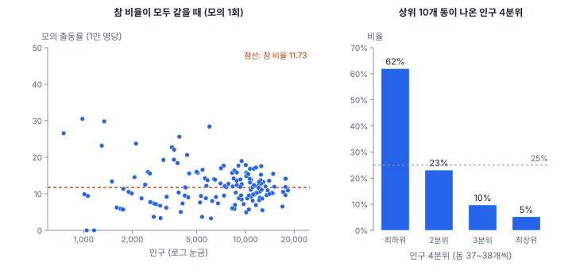
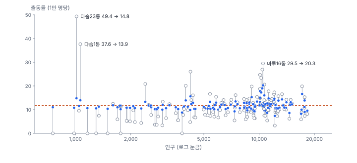
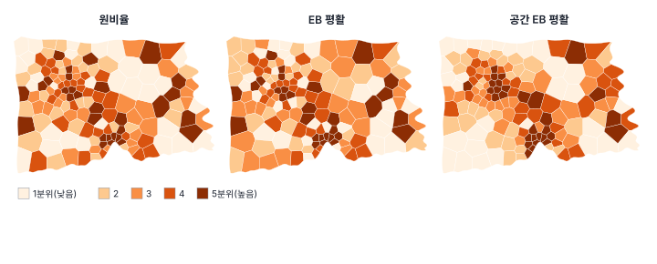
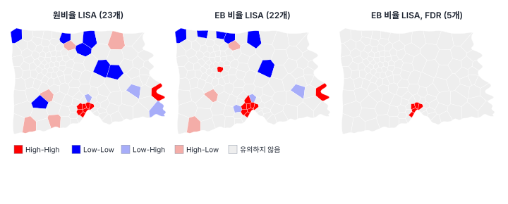

[목차](../README.md) · 이전: [13강 국지 공간 자기상관 II](13-local-statistics.md) · 다음: [15강 공간 군집 탐지](15-cluster-detection.md)

# 14강 비율 자료와 작은 수 문제

> 앱 지원: ● 앱에서 따라 할 수 있음 (귀무 모의와 손계산 확인은 코드로 보충함) · 읽는 시간 약 40분

## 이 강에서 얻는 것

- 인구가 적은 구역의 비율이 왜 지도에서 가장 튀는지 설명하고, 모의로 확인할 수 있음
- 원비율, 초과위험, 연령 표준화 SMR이 각각 무엇을 바로잡고 무엇을 바로잡지 못하는지 앎
- 경험적 베이즈(EB) 평활과 공간 EB 평활의 원리를 알고 손으로 계산할 수 있음
- 비율 자료의 공간 자기상관을 EB Moran's I와 EB 비율 LISA로 재고, 평활한 비율로 검정하면 안 되는 이유를 앎

## 들어가는 질문

5강의 출동률 지도에서 가장 진한 동은 다솜23동(49.36)과 다솜1동(37.63)이었음. 둘 다 인구가 1천 명 남짓함. 출동이 한 건도 없어 출동률이 0인 동 7개도 평균 인구가 1,608명이었음. 12강에서 다솜1동은 LISA의 High-Low 이상치로, 13강의 Local Geary에서는 "주변과 다름"으로 찍혔음.

시청 담당자가 물었음. "다솜23동은 출동률이 시 평균의 네 배입니다. 구급대를 늘려야 하지 않습니까?" 다솜23동의 출동은 5건이었음. 1건만 적었어도 39.49, 1건 많았으면 59.23임. 같은 1건이 인구 1만 명인 마루16동에서는 출동률을 1만큼밖에 바꾸지 않음. **분모가 작은 비율은 값이 커서가 아니라 분모가 작아서 튐**. 이 강은 이 "작은 수 문제"를 확인하고, 비율을 안정시키는 방법과 비율 자료의 공간 자기상관을 재는 방법을 다룸.

## 1. 지도에서 가장 튀는 곳이 가장 작은 곳인 이유

구역 i의 사건 수 e_i가 포아송분포를 따르고 참 비율이 θ_i라면, 원비율 r_i = e_i / n_i의 분산은 θ_i / n_i임(6강). 분모 n_i가 작을수록 분산이 커짐. 참 비율이 모든 구역에서 똑같아도, 원비율 지도의 가장 진한 칸과 가장 흐린 칸은 분모가 작은 구역이 차지하기 쉬움.

이를 모의로 확인함. 150개 동의 참 출동률이 모두 도시 전체 비율(1,408건 ÷ 120만 명 = 1만 명당 11.73)과 같다고 두고, 동마다 기대 건수(인구 × 11.73 / 1만)를 평균으로 하는 포아송분포에서 출동 건수를 뽑음. 이 모의를 1,000번 함.



참 비율이 모두 같은데도 원비율 상위 10개 동의 62%가 인구 최하위 4분위(3,874명 이하, 38개 동)에서 나왔음. 4분위마다 25%씩이어야 공평한데, 최상위 4분위에서는 5%뿐이었음. 하위 10개도 70%가 최하위 4분위였음. 모의 자료의 4분위별 원비율 표준편차는 인구가 적은 쪽부터 7.69, 4.44, 3.38, 2.91이었음.

실제 자료와 비교하면 다음과 같음.

- 출동 0건인 동은 실제 7개, 참 비율이 모두 같을 때의 기댓값은 4.35개임. 0건 자체는 이례적이지 않음
- 실제 원비율의 4분위별 표준편차는 9.57, 4.34, 5.81, 3.51로, 인구가 적은 쪽에서 크게 흩어지는 모양은 모의와 같음. 다만 3분위(5.81)가 모의(3.38)보다 큼. 인구 1만 명 안팎의 마루구 동들이 높게 나온 것으로, 작은 수만으로 설명되지 않는 부분임
- 실제 상위 10개 가운데 최하위 4분위는 3개(다솜23동, 다솜1동, 라온6동)였음

원비율 지도는 "참 비율의 차이"와 "분모 크기에 따른 우연"을 한 장에 섞어 보여 줌. 이 둘을 가르는 것이 이 강의 일임.

## 2. 초과위험과 SMR

### 초과위험

**초과위험**(excess risk)은 관측 건수를 기대 건수로 나눈 것임. 기대 건수는 구역의 인구에 도시 전체 비율을 곱함.

$$
\text{초과위험}_i = \frac{e_i}{n_i \hat{\beta}}, \qquad \hat{\beta} = \frac{\sum_k e_k}{\sum_k n_k}
$$

1보다 크면 도시 평균보다 높고, 2면 두 배임. 다솜23동은 기대 1.19건에 관측 5건이라 4.21, 마루16동은 기대 12.33건에 관측 31건이라 2.51임.

초과위험은 원비율을 전체 비율로 나눈 것일 뿐이라(r_i / β̂), 지도의 모양이 원비율과 똑같음. GeoStat은 초과위험을 박스 지도로 칠하는데, 상위 이상치 7개(다솜23동, 다솜1동, 마루16동, 마루30동, 다솜19동, 마루15동, 마루19동)는 5강의 출동률 박스 지도와 같은 동임. 초과위험은 "1을 기준으로 읽는다"는 해석을 더할 뿐, 작은 수 문제를 고치지 않음.

### 연령 표준화와 SMR

기대 건수를 인구 구조에 맞춰 계산할 수도 있음. 출동 자료의 연령대를 보면 65세 이상이 1,408건 가운데 635건임. 고령인구 1만 명당 25.72건, 65세 미만은 8.11건으로 3.17배임. 고령인구가 많은 동은 다른 조건이 같아도 출동이 많을 것으로 기대됨.

집단별 비율(표준 비율)을 동의 집단별 인구에 곱해 더하면 **연령 표준화 기대 건수**가 되고, 관측 건수를 이것으로 나눈 것이 **표준화 사망비**(SMR, standardized mortality ratio)와 같은 꼴의 비임. 역학에서 쓰는 이름을 따라 SMR이라 부름(여기서는 사망이 아니라 출동). 이 방법을 **간접 표준화**라 함.

$$
\text{SMR}_i = \frac{e_i}{\sum_g n_{ig} \lambda_g}
$$

λ_g는 집단 g(65세 이상, 미만)의 도시 전체 비율, n_ig는 구역 i의 집단 g 인구임.

| 동 | 고령비율 | 관측 | 기대 (나이 무시) | 기대 (연령 표준화) | 초과위험 | SMR |
|---|---|---|---|---|---|---|
| 다솜23동 | 29.4% | 5 | 1.19 | 1.35 | 4.21 | 3.71 |
| 다솜8동 | 31.5% | 22 | 15.63 | 18.19 | 1.41 | 1.21 |
| 가람33동 | 12.1% | 20 | 13.21 | 11.52 | 1.51 | 1.74 |
| 가람19동 | 13.7% | 18 | 10.69 | 9.59 | 1.68 | 1.88 |

고령비율이 높은 동은 SMR이 초과위험보다 작아지고, 낮은 동은 커짐. 상위 10개에서 라온6동, 가람34동이 빠지고 가람19동, 가람23동이 들어왔음. 전체로는 초과위험과 SMR의 상관이 0.986이라 큰 그림은 같음. 그러나 공간 자기상관은 달라졌음. 초과위험(= 원비율)의 Moran's I는 0.092(유사 p 0.031)인데 SMR은 0.146(유사 p 0.005)임. 연령 구조가 설명하는 부분을 걸러 내자 공간 패턴이 더 또렷해졌음.

SMR도 작은 수 문제는 그대로임. 다솜23동의 SMR 3.71은 여전히 관측 5건에 기대 1.35건에서 나온 값임. 또 간접 표준화의 SMR은 구역마다 자기 인구 구조에 맞춘 비율이라, 두 구역의 SMR을 서로 비교하는 것은 엄밀하게는 맞지 않음(Breslow & Day 1987). 기준(도시 전체)과 각 구역을 비교하는 데 씀.

## 3. 경험적 베이즈 평활

**경험적 베이즈(EB) 평활**은 분모가 작아 믿기 어려운 비율을 전체 비율 쪽으로 당기고, 분모가 커서 믿을 만한 비율은 거의 그대로 둠(Clayton & Kaldor 1987). 그 정도를 자료에서 추정함.

### 원리

동마다의 참 비율 θ_i가 평균 β, 분산 α인 분포(사전분포)에서 나왔다고 봄. 관측한 원비율 r_i는 θ_i 주위로 분산 θ_i / n_i만큼 흔들림. 그러면 θ_i의 가장 좋은 선형 추정은 원비율과 전체 평균의 가중 평균이 됨.

$$
\hat{\theta}_i = w_i\, r_i + (1 - w_i)\, \hat{\beta}, \qquad w_i = \frac{\hat{\alpha}}{\hat{\alpha} + \hat{\beta} / n_i}
$$

가중치 w_i는 "동마다 참 비율이 다른 정도(α)"를 "그 차이 + 이 동의 우연한 흔들림(β/n_i)"으로 나눈 것임. 분모 n_i가 크면 흔들림이 작아 w_i가 1에 가깝고, 작으면 0에 가까워 전체 비율 쪽으로 당겨짐. β와 α는 자료에서 적률법으로 추정함(Marshall 1991).

$$
\hat{\beta} = \frac{\sum_i e_i}{\sum_i n_i}, \qquad s^2 = \frac{\sum_i n_i (r_i - \hat{\beta})^2}{\sum_i n_i}, \qquad \hat{\alpha} = s^2 - \frac{\hat{\beta}}{\bar{n}}
$$

s²는 원비율이 흩어진 정도이고, β̂/n̄는 그 가운데 우연만으로 생기는 몫임. 둘의 차이가 동 사이의 참 차이(α̂)임. 원비율이 우연만큼도 흩어지지 않아 α̂가 음수로 나오면 0으로 두는 것이 보통이고, 이때는 모든 동이 전체 비율로 당겨짐. GeoStat(esda)의 전역 EB 평활은 이 처리를 하지 않으므로(공간 EB와 EB Moran·EB 비율 LISA는 처리함), 사건이 아주 적은 자료에서는 아래 코드로 α̂를 먼저 확인함.

### 손으로 해 보기

1만 명당 출동률을 쓰고, 인구 n_i를 만 명 단위로 둠. 한빛시는 β̂ = 11.73, s² = 24.96, 평균 인구 n̄ = 0.8만 명이라 β̂/n̄ = 14.67이고, α̂ = 24.96 − 14.67 = 10.29임. 원비율이 흩어진 정도의 절반 넘게(14.67/24.96 = 59%)가 우연이라는 뜻임.

| 동 | 인구 | 원비율 | β̂/n_i | 가중치 w_i | EB 평활 |
|---|---|---|---|---|---|
| 다솜23동 | 1,013 | 49.36 | 11.73/0.1013 = 115.83 | 10.29/(10.29 + 115.83) = 0.082 | 0.082 × 49.36 + 0.918 × 11.73 = 14.80 |
| 다솜1동 | 1,063 | 37.63 | 110.38 | 0.085 | 13.94 |
| 누리12동 | 753 | 0.00 | 155.82 | 0.062 | 11.01 |
| 마루16동 | 10,506 | 29.51 | 11.17 | 0.480 | 20.26 |
| 마루20동 | 17,697 | 15.26 | 6.63 | 0.608 | 13.88 |

다솜23동의 49.36은 14.80으로 크게 내려오고, 마루16동의 29.51은 20.26으로 절반쯤만 내려옴. 출동이 0건인 누리12동은 11.01로 거의 평균까지 올라감. 한빛시에서 가장 큰 가중치도 0.616이라, 모든 동이 어느 정도는 평균 쪽으로 당겨짐.



EB 평활을 하면 순위가 바뀜. 원비율 상위 10개 가운데 인구 최하위 4분위가 3개였는데, EB 평활 상위 10개에는 1개뿐임. EB 평활 상위 6개는 마루16동(20.26), 마루30동, 마루15동, 마루19동, 마루17동, 누리26동으로 모두 인구 1만 명이 넘는 동임. "작은 동이라 튄 값"이 걷히고 "큰 동인데도 높은 값"이 남음.

### 공간 EB 평활

**공간 EB**는 전체 비율 대신 이웃의 비율 쪽으로 당김. β와 α를 도시 전체가 아니라 구역 i와 그 이웃을 묶은 창에서 추정함. 공간 EB는 "이웃과 비슷할 것"이라는 가정을 더하므로, 이웃이 높으면 높게, 낮으면 낮게 당김. 누리12동은 자신과 이웃을 묶은 창의 비율이 7.55라 공간 EB로 5.32가 되어, 평균 쪽으로 올라간 EB(11.01)와 방향이 반대임. 다솜23동은 공간 EB로 30.28로, 시에서 가장 높음. 창의 비율(12.54)은 시 평균과 비슷하지만, 창 안의 비율이 0부터 49.36까지 들쭉날쭉해 국지 α̂가 크게 추정되고, 그래서 자기 원비율을 절반 가까이(가중치 0.48) 믿기 때문임. 창에 든 구역이 몇 개뿐이라 공간 EB도 작은 수 문제에서 자유롭지 않음. 같은 메뉴의 **공간 비율**은 (자신과 이웃의 사건 합) ÷ (자신과 이웃의 분모 합)으로, 가장 단순한 공간 평활임.



분위수 지도는 순위만 보여 주므로, 세 지도의 차이는 "어느 동이 위쪽에 있는가"의 차이임. 원비율 분위수 경계는 6.68, 9.42, 11.95, 14.18이고, EB는 10.24, 10.81, 11.80, 12.90으로 폭이 좁음. EB로 값의 범위가 0~49.36에서 7.37~20.26으로 줄었기 때문임. 가장 큰 변화는 아래쪽에 있음. 인구 최하위 4분위 동 가운데 1분위(가장 옅은 계급)에 있던 동이 원비율 20개에서 EB 7개로 줄었음. 출동 0건인 동들이 11 안팎으로 당겨져, 전체 비율(11.73)이 걸친 3~4분위로 올라갔기 때문임. 위쪽의 다솜23동, 다솜1동, 라온6동은 EB에서도 5분위에 남았음(순위는 내려갔음).

### EB를 쓸 때의 주의

- **EB는 지도를 위한 추정임**: EB 평활 값은 "이 동의 참 비율에 대한 더 나은 추정"이지, 관측값이 아님. 보고서에는 원비율과 EB를 함께 적고 어떤 방법으로 평활했는지 밝힘
- **작은 동의 진짜 높은 위험을 흐릴 수 있음**: 다솜23동의 참 비율이 정말 높더라도, 5건으로는 그것을 확신할 수 없어 EB가 끌어내림. EB는 "증거가 부족하면 평균으로" 판단하는 것이지, "작은 동은 평균이다"라고 말하는 것이 아님
- **포아송 가정**: 사건이 서로 독립이라는 가정 아래의 분산(θ/n)을 씀. 한 사고로 여러 건이 생기는 등 과산포가 있으면 흔들림을 과소평가함(6강). 적률 추정에서는 그 추가 흩어짐이 α̂에 섞여 들어가, 원비율을 실제보다 많이 믿고 덜 당김
- **본격적인 모형은 36강**: 포아송-감마 모형과 공간 랜덤효과를 넣은 계층 베이즈 모형(BYM 등)이 EB의 확장임

## 4. 비율의 공간 자기상관: EB Moran과 EB 비율 LISA

원비율로 Moran's I나 LISA를 구하면, 작은 동의 큰 흔들림이 결과를 흐리거나 부풀림. 그렇다고 평활한 비율로 구해서도 안 됨. 공간 EB나 공간 비율은 이웃 값을 섞어 만든 것이라 자기상관을 만들어 넣은 셈이고, 전역 EB 값은 이웃을 섞지는 않지만 동마다 분산이 다른 추정값이라 검정에 쓰도록 만든 값이 아님.

| 사용한 값 | Moran's I | 유사 p |
|---|---|---|
| 원비율 | 0.092 | 0.031 |
| EB 평활 비율 | 0.197 | 0.002 |
| 공간 EB 평활 비율 | 0.371 | 0.001 |
| 공간 비율 | 0.663 | 0.001 |
| **EB Moran's I** (Assunção & Reis 1999) | 0.169 | 0.004 |

공간 비율의 I = 0.663은 출동률이 실제로 그만큼 닮아서가 아니라, 이웃끼리 같은 사건을 나눠 더했기 때문임. 공간적으로 평활한 값으로 자기상관을 검정하면 안 됨.

아순상과 헤이스(Assunção & Reis 1999)는 비율을 평활하지 않고 **표준화**하는 방법을 제안했음. 원비율에서 전체 비율을 빼고, 그 동의 흔들림을 고려한 표준편차로 나눔.

$$
z_i = \frac{r_i - \hat{\beta}}{\sqrt{\hat{\alpha} + \hat{\beta} / n_i}}
$$

인구가 적은 동은 분모가 커서 z가 작아짐. 다솜23동은 원비율로는 가장 높았지만 z는 3.35로 마루16동(3.84) 다음임. 이 z로 Moran's I를 구한 것이 **EB Moran's I**이고, 국지판이 **EB 비율 LISA**임. GeoStat은 Moran 산점도와 국지 통계에서 "EB 비율"을 고르면 이 방법을 씀.

한빛시 출동률의 EB Moran's I는 0.169(유사 p 0.004)로 원비율(0.092, 0.031)보다 큼. 작은 동의 흔들림이 공간 패턴을 가리고 있었음.



EB 비율 LISA는 보정 없이 22개 동(HH 10, LL 6, LH 3, HL 3)이 유의함. 개수는 원비율 LISA(23개)와 비슷하지만 구성이 다름.

- 원비율에서만 유의했던 6개 동: 다솜1동(HL), 다솜24동(LH) 등. 다솜1동은 인구 1,063명에 출동 4건, 다솜24동은 1,162명에 출동 0건임. EB 비율 LISA에서 다솜1동의 유사 p는 0.015에서 0.165로 커졌음
- EB에서만 유의한 5개 동: 인구 1만 2천 명이 넘는 마루14동·누리13동·마루11동과, 가람5동·가람9동(LL)
- **FDR로 보정하면 5개 동(마루15·16·17·18·31동)이 HH로 남음**. 다섯 동 모두 유사 p가 순열 999번의 최솟값인 0.001이고, 순열을 9,999번으로 늘려도 같은 5개가 남음. 원비율 LISA는 9,999번으로 늘려도 보정 후 0개였음. 다만 마루31동은 자기 출동률(11.93)이 시 평균 수준이고 높은 이웃 때문에 HH로 분류되었음. 높은 동은 마루15·16·17동이 중심임(13강에서 Gi\*의 다솜1동을 볼 때와 같은 주의)

12강에서 "출동률에 대한 LISA의 증거는 약함"이라고 했던 결론은, 작은 동의 흔들림을 걸러 내자 "마루구 원도심에 출동률이 높은 동들의 군집이 있음(FDR 후 5개 동이 HH)"으로 바뀜. 같은 자료라도 비율의 불안정성을 다루는지에 따라 결론이 달라짐. 이 군집이 정말 하나의 군집인지, 크기가 얼마인지는 15강의 스캔 통계로 다시 봄.

## 해 보기: GeoStat에서 비율 다루기

1. `hanbit_dong.gpkg`와 `hanbit_events.gpkg`를 열고 `hanbit_dong`을 고름. 1강처럼 점 집계로 `PT_CNT`를 만들고, **퀸 인접 (Queen)** 공간가중치를 만듦
2. **공간 분석 → 비율 지도 · EB 보정…** 메뉴에서 방법 **원비율**, 분자 `PT_CNT`, 분모 `인구`, 단위 **10,000당** 항목으로 **실행**함
   - 확인: `R_RAW` 열이 생기고 분위수 5계급 지도로 칠해짐. 다솜23동 49.36
3. 같은 메뉴에서 방법 **초과위험**으로 실행함
   - 확인: `R_EXCESS`가 박스 지도로 칠해지고, 상위 이상치가 7개임. 다솜23동 4.207, 마루16동 2.515
4. 방법 **경험적 베이즈(EB) 평활**, 단위 **10,000당** 항목으로 실행함
   - 확인: `R_EB`의 다솜23동 14.80, 마루16동 20.26, 누리12동 11.01. **차트**의 **+ 산점도** 단추로 x에 `R_RAW`, y에 `R_EB`를 놓고, 인구가 적은 동이 어디로 갔는지 봄
5. 방법 **공간 EB 평활**, 가중치는 퀸, 단위 **10,000당** 항목으로 실행함
   - 확인: `R_SEB`의 다솜23동 30.28, 누리12동 5.32
6. **+ Moran 산점도** 단추로 종류 **EB 비율 Moran's I (분자 ÷ 분모)** 항목, 변수 `PT_CNT`, 분모 `인구`, 순열 999번으로 **계산**함
   - 확인: I 0.1691, 유사 p 0.004. **+ Moran 산점도** 단추를 다시 눌러 종류 **단변량**, 변수 `R_SEB`로 계산해 0.3711이 나오는 것도 봄(공간적으로 평활한 값으로 재면 부풀려짐)
7. **공간 분석 → 국지 통계 (LISA · Gi\* · Local Geary)…** 메뉴에서 방법 **EB 비율 LISA**, 분자 `PT_CNT`, 분모 `인구`, 순열 999번, α 0.05, 보정 없음, 접두어 `EBLISA`로 실행함
   - 확인: 알림에 "유의한 피처 22개 (p ≤ 0.0500)". 범례에서 High-High 10, Low-Low 6, Low-High 3, High-Low 3
8. 메뉴를 다시 열면 설정이 처음으로 돌아가므로, 방법 **EB 비율 LISA**, 분자 `PT_CNT`, 분모 `인구`를 다시 고르고 보정 **FDR (Benjamini-Hochberg)**, 접두어 `EBLISA_FDR`로 실행함
   - 확인: 유의한 피처 5개 (p ≤ 0.00167). 마루15·16·17·18·31동
9. SMR: **공간 분석 → 계산 필드 추가…** 메뉴로 `기대건수` = `` `고령인구` * 0.00257162 + (`인구` - `고령인구`) * 0.00081106 ``을 만들고, 이어서 `SMR` = `` `PT_CNT` / `기대건수` ``를 만듦. 두 상수는 65세 이상(635건 ÷ 246,926명)과 미만(773건 ÷ 953,074명)의 도시 전체 출동률임
   - 확인: 다솜23동 `기대건수` 1.35, `SMR` 3.71. 가람33동 `SMR` 1.74

### 코드로: EB 손계산 확인, SMR, EB 비율 LISA

```python
import geopandas as gpd
import numpy as np
from esda import Moran_Local_Rate, fdr
from esda.smoothing import Empirical_Bayes
from libpysal.weights import Queen

dong = gpd.read_file("book/data/hanbit_dong.gpkg")
ev = gpd.read_file("book/data/hanbit_events.gpkg")
j = gpd.sjoin(ev, dong[["geometry"]], predicate="within")
e = j.groupby("index_right").size().reindex(dong.index, fill_value=0).to_numpy()
pop = dong["인구"].to_numpy(float)

# 1) EB 평활을 직접 계산 (1만 명당, n은 만 명 단위)
r = e / pop * 1e4
beta = e.sum() / pop.sum() * 1e4
n = pop / 1e4
s2 = (pop * (r - beta) ** 2).sum() / pop.sum()
alpha = s2 - beta / n.mean()
w = alpha / (alpha + beta / n)
eb = w * r + (1 - w) * beta
check = Empirical_Bayes(e, pop).r.ravel() * 1e4       # esda(GeoStat)와 같은지
print(f"β = {beta:.2f}, α = {alpha:.3f}, 가중치 {w.min():.3f}~{w.max():.3f}, esda와 같음: {np.allclose(eb, check)}")

# 2) 연령 표준화 기대 건수와 SMR (65세 이상과 미만 두 집단)
old = (j["연령대"] == "65+").groupby(j["index_right"]).sum().reindex(dong.index, fill_value=0).to_numpy()
p65 = dong["고령인구"].to_numpy(float)
r65, ru = old.sum() / p65.sum(), (e - old).sum() / (pop - p65).sum()
expected = p65 * r65 + (pop - p65) * ru
smr = e / expected
print(f"65세 이상 {r65 * 1e4:.2f}, 미만 {ru * 1e4:.2f} (1만 명당), SMR {smr.min():.2f}~{smr.max():.2f}")

# 3) EB 비율 LISA (Assunção-Reis 표준화)
wq = Queen.from_dataframe(dong, use_index=False)
wq.transform = "r"
lm = Moran_Local_Rate(e, pop, wq, adjusted=True, permutations=999, seed=123456789, geoda_quads=True)
sig = lm.p_sim <= fdr(lm.p_sim, 0.05)
print("FDR 보정 후 유의:", dong.loc[sig, "동이름"].tolist())
```

- 확인: β = 11.73, α = 10.294, 가중치 0.062~0.616, esda와 같음: True. 65세 이상 25.72, 미만 8.11, SMR 0.00~3.71. FDR 보정 후 유의한 동은 마루15·16·17·18·31동
- 더 해 보기: 1절의 귀무 모의를 직접 해 봄. `np.random.default_rng().poisson(pop * beta / 1e4)`로 건수를 만들어 원비율 상위 10개 동의 인구를 확인함

## 헷갈리는 쌍

- **초과위험 vs SMR**: 초과위험은 기대 건수를 인구 × 전체 비율로, SMR은 인구 구조(연령 등)별 비율로 계산함. 둘 다 작은 수 문제는 그대로임
- **EB 평활 vs 공간 EB 평활**: EB는 전체 비율 쪽으로, 공간 EB는 이웃 비율 쪽으로 당김. 공간 EB는 "이웃과 비슷하다"는 가정을 더함
- **평활 vs 표준화**: 평활(EB)은 지도에 쓸 추정값을 만들고, 표준화(Assunção–Reis)는 자기상관 검정에 쓸 값을 만듦
- **EB Moran's I vs 평활 비율의 Moran's I**: 앞의 것이 올바른 방법임. 공간적으로 평활한 비율로 잰 I는 평활이 만든 자기상관 때문에 부풀려지고, 전역 EB 값도 검정용 값이 아님

## 흔한 실수와 심사 지적

- **원비율 지도에서 가장 진한 구역을 "위험 지역"으로 지목함**
  - 지적: "그 구역의 사건 수와 분모는 얼마입니까?"
  - 대응: 사건 수, 분모, 깔때기 그림(6강)이나 EB 평활 값을 함께 제시함
- **출동 0건인 구역을 "안전 지역"으로 씀**
  - 대응: 기대 건수가 1건 안팎이면 0건은 흔한 일임. 한빛시는 참 비율이 모두 같아도 0건인 동이 4개 남짓 나옴
- **공간 EB나 공간 비율로 Moran's I·LISA를 구함**
  - 결과: 평활이 만든 자기상관을 발견했다고 보고하게 됨
  - 대응: EB Moran's I와 EB 비율 LISA를 씀
- **EB 평활 값을 관측값처럼 보고함**
  - 대응: "EB 평활 출동률"이라고 이름 붙이고, 원비율과 사건 수를 함께 적음
- **연령 구조가 다른 구역을 원비율로 비교함**
  - 대응: 연령 등 구조 변수로 표준화한 SMR을 함께 보고, 결과가 달라지는지 확인함

## 보고서에는 이렇게 씀

> 행정동별 출동률은 인구 규모의 차이가 커서(753~18,302명) 인구가 적은 행정동의 비율이 불안정하므로, 원비율과 함께 경험적 베이즈 평활 비율(Clayton & Kaldor 1987; 적률 추정)을 제시하였다. 공간 자기상관은 Assunção와 Reis(1999)의 EB 표준화 Moran's I로 측정하였고, 1차 퀸 인접(행 표준화)과 순열 999회(난수 시드 123456789)를 사용하였다. 출동률의 EB Moran's I는 0.169(유사 p = 0.004)로 원비율의 Moran's I(0.092, p = 0.031)보다 컸다. EB 비율 LISA에서 벤야미니–호흐베르크 방법으로 거짓 발견율을 5%로 통제한 결과, 마루구 원도심의 5개 행정동이 High-High 군집으로 유의하였다. 원비율이 가장 높았던 다솜23동(인구 1,013명, 출동 5건)은 EB 평활 후 14.8로, 도시 전체 비율(11.7)과 큰 차이가 없었다.

적어야 할 항목은 다음과 같음.

- 분자와 분모, 비율의 단위(1만 명당 등), 분모의 범위
- 평활·표준화 방법(EB, 공간 EB, 연령 표준화)과 기준 집단
- 자기상관 검정에 쓴 값(EB 표준화인지)과 가중치, 순열, 보정
- 극단 구역은 사건 수와 분모를 함께 제시

## 요약

- 분모가 작은 비율은 우연만으로 크게 흔들려, 참 비율이 모두 같아도 지도의 극단을 차지함. 한빛시 모의에서 상위 10개 동의 62%가 인구 최하위 4분위였음
- 초과위험은 원비율을 전체 비율로 나눈 것이고, SMR은 연령 등 구조를 반영한 기대 건수로 나눈 것임. 둘 다 작은 수 문제는 고치지 않음
- EB 평활은 비율을 신뢰도에 따라 전체 비율 쪽으로 당김. 가중치는 α̂ / (α̂ + β̂ / n_i)이고, 다솜23동은 49.36에서 14.80으로, 마루16동은 29.51에서 20.26으로 바뀜. 공간 EB는 이웃 쪽으로 당김
- 공간적으로 평활한 비율로 자기상관을 재면 부풀려짐. EB Moran's I와 EB 비율 LISA를 씀. 한빛시 출동률은 EB 비율 LISA에서 FDR 후에도 마루구 다섯 동이 HH로 유의했음

## 핵심 용어

| 한글 | 영문 | 비고 |
|---|---|---|
| 원비율 | Raw Rate | 사건 수 ÷ 분모 |
| 초과위험 | Excess Risk | 관측 ÷ 기대 |
| 표준화 사망비 | Standardized Mortality Ratio (SMR) | 간접 표준화 |
| 간접 표준화 | Indirect Standardization | 기준 비율 × 구역 인구 구조 |
| 작은 수 문제 | Small Number Problem | |
| 경험적 베이즈 평활 | Empirical Bayes (EB) Smoothing | Clayton & Kaldor 1987 |
| 공간 EB 평활 | Spatial EB Smoothing | 이웃 쪽으로 |
| 공간 비율 | Spatial Rate | 창 안의 합 ÷ 합 |
| 수축 | Shrinkage | 평균 쪽으로 당김 |
| EB Moran's I | EB Moran's I | Assunção & Reis 1999 |

## 원전과 더 읽을거리

**원전**

- Clayton, D., & Kaldor, J. (1987). Empirical Bayes estimates of age-standardized relative risks for use in disease mapping. *Biometrics*, 43(3), 671–681. EB 평활
- Marshall, R. J. (1991). Mapping disease and mortality rates using empirical Bayes estimators. *Journal of the Royal Statistical Society: Series C (Applied Statistics)*, 40(2), 283–294. 적률 추정과 공간 EB
- Assunção, R. M., & Reis, E. A. (1999). A new proposal to adjust Moran's I for population density. *Statistics in Medicine*, 18(16), 2147–2162. EB Moran's I

**더 읽을거리**

- Breslow, N. E., & Day, N. E. (1987). *Statistical Methods in Cancer Research, Volume II: The Design and Analysis of Cohort Studies* (IARC Scientific Publications No. 82). IARC. 간접 표준화와 SMR
- Waller, L. A., & Gotway, C. A. (2004). *Applied Spatial Statistics for Public Health Data*. Wiley. 4.4절(평활한 비율 지도와 EB), 7장(구역 집계 자료의 군집과 자기상관)
- Anselin, L., Lozano, N., & Koschinsky, J. (2006). Rate transformations and smoothing. Spatial Analysis Laboratory, University of Illinois. GeoDa의 비율 메뉴
- Gelman, A., & Price, P. N. (1999). All maps of parameter estimates are misleading. *Statistics in Medicine*, 18(23), 3221–3234. 원비율 지도와 평활 지도가 각각 보여 주는 것

## 연습

1. 인구가 4,000명이고 출동이 9건인 동의 EB 평활 출동률(1만 명당)을 한빛시의 β̂ = 11.73, α̂ = 10.29로 구하시오.

2. 어떤 동의 원비율이 0인데 EB 평활 값은 11.0이었음. "EB가 없는 출동을 만들어 냈다"는 비판에 어떻게 답하겠는가?

3. 동료가 공간 EB 평활 출동률로 LISA를 돌려 HH 군집이 많이 나왔다고 보고했음. 무엇이 문제이고, 어떻게 고쳐야 하는가?

4. 고령비율이 30%인 동과 12%인 동의 초과위험이 모두 1.5였음. 연령 표준화 SMR은 각각 1.5보다 커질지 작아질지 예상하고 이유를 쓰시오.

5. 12강에서는 "출동률의 국지 군집 증거는 약함", 이 강에서는 "마루구 다섯 동이 FDR 후에도 유의함"이 되었음. 두 결론이 다른 이유를 한 문장으로 쓰고, 보고서에 무엇을 함께 적어야 하는지 쓰시오.

<details>
<summary>해답</summary>

1. 원비율 = 9 / 4,000 × 1만 = 22.5. n = 0.4만 명이라 β̂/n = 11.73/0.4 = 29.33. 가중치 = 10.29/(10.29 + 29.33) = 0.260. EB = 0.260 × 22.5 + 0.740 × 11.73 = 5.85 + 8.68 = 14.53. 원비율의 4분의 1만 믿고 나머지는 전체 비율로 채운 셈임.

2. EB 평활 값은 "관측한 출동 수"가 아니라 "이 동의 참 출동률에 대한 추정"임. 인구가 적어 기대 건수가 1건 안팎이면 0건은 참 비율이 평균이어도 흔히 나오므로, 0건만으로 참 비율이 0이라고 볼 근거가 약함. EB는 이 불확실성을 반영해 전체 비율 쪽으로 추정한 것임. 보고서에는 원비율(0건)과 EB 값을 함께 적음.

3. 공간 EB는 이웃의 비율을 섞어 만든 값이라 이웃끼리 비슷해지도록 만들어져 있음. 그 값으로 LISA를 구하면 평활이 만든 자기상관을 군집으로 찾게 됨(한빛시 공간 EB의 Moran's I는 0.371, 원비율은 0.092). EB 비율 LISA(Assunção–Reis 표준화)를 써야 함.

4. 고령비율 30%인 동은 고령인구가 많아 연령 표준화 기대 건수가 "인구 × 전체 비율"보다 크므로 SMR이 1.5보다 작아짐. 12%인 동은 기대 건수가 작아져 SMR이 1.5보다 커짐. 한빛시의 다솜8동(31.5%)은 1.41 → 1.21, 가람33동(12.1%)은 1.51 → 1.74였음.

5. 원비율 LISA는 인구가 적은 동의 큰 흔들림까지 그대로 써서 마루구 동들의 신호가 묻혔고, EB 비율 LISA는 동마다 흔들림의 크기를 반영해 표준화했기 때문임. 보고서에는 두 결과와 각 방법, 보정 방법을 모두 적고, 결론이 비율의 불안정성을 다루는 방식에 달려 있다는 점을 밝힘.

</details>

---

[목차](../README.md) · 이전: [13강 국지 공간 자기상관 II](13-local-statistics.md) · 다음: [15강 공간 군집 탐지](15-cluster-detection.md)
