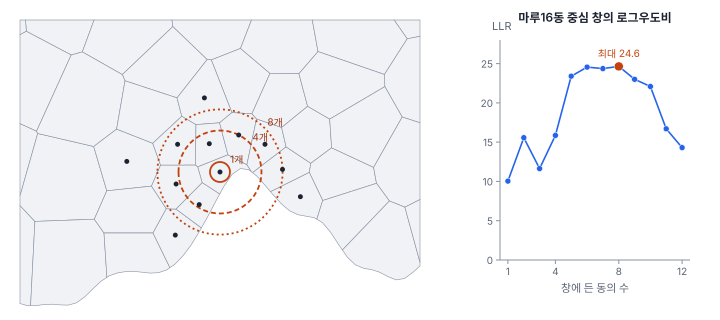
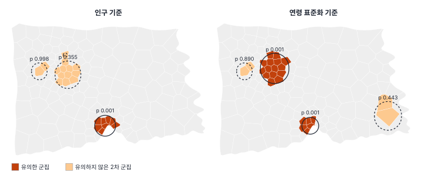
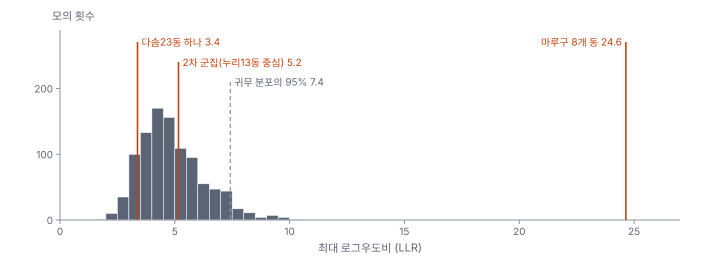

[목차](../README.md) · 이전: [14강 비율 자료와 작은 수 문제](14-rates-small-numbers.md) · 다음: [16강 점 패턴의 기초](16-point-pattern-basics.md)

# 15강 공간 군집 탐지

> 앱 지원: ○ GeoStat에 스캔 통계가 없어 코드로 함 (기대 건수와 비율은 14강처럼 앱에서 만들 수 있음) · 읽는 시간 약 40분

## 이 강에서 얻는 것

- 공간 자기상관 검정, 국지 통계(핫스팟), 군집 탐지가 각각 어떤 질문에 답하는지 구별할 수 있음
- Kulldorff 공간 스캔 통계의 원리(창, 로그우도비, 몬테카를로)를 알고 직접 계산할 수 있음
- 지도를 보고 고른 지역을 검정하는 "사후 가설"이 왜 거짓 경보를 만드는지 설명하고, 민원형 질문을 다루는 절차를 앎

## 들어가는 질문

다솜23동 주민 대표가 시청에 민원을 냈음. "우리 동은 석 달 동안 구급 출동이 5건이나 있었습니다. 인구로 따지면 시 평균의 네 배입니다. 원인을 조사해 주십시오." 담당자가 포아송분포로 계산해 보니, 기대 건수 1.19건에서 5건 이상이 나올 확률은 0.0075였음. "유의한 군집"인가?

한편 12~14강을 거치며 마루구 원도심의 동들이 거듭 눈에 띄었음. 이 지역에서 LISA(12강)는 보정 전 HH 7개, Gi\*(13강)는 핫스팟 8개, EB 비율 LISA(14강)는 FDR 후 5개 동을 찍었음. 그러면 마루구에는 "출동이 많은 지역"이 하나 있는가, 여러 개 있는가? 그 범위는 어디까지인가?

이 강은 이런 질문에 직접 답하는 **군집 탐지**(cluster detection)를 다룸. 대표 방법인 Kulldorff 공간 스캔 통계로 한빛시의 출동을 분석하고, 다솜23동의 민원이 왜 0.0075라는 숫자만으로 판단할 수 없는지 봄.

## 1. 세 가지 질문

"출동이 몰려 있는가"라는 말은 여러 질문을 가리킬 수 있음. 베사그와 뉴웰(Besag & Newell 1991)은 도시 전체의 "군집성"(clustering)을 묻는 검정과 "군집"(clusters)의 위치를 찾는 탐지를 구별했음. 여기에 12~13강의 국지 통계를 더해 정리하면 다음과 같음.

| 질문 | 방법 | 결과 | 다중검정 |
|---|---|---|---|
| 도시 전체에 공간 패턴이 있는가? | 전역 자기상관 (Moran's I, General G, 11강) | 통계량 하나와 p값 하나 | 없음 |
| 구역마다, 이웃과 함께 높거나 낮은가? | 국지 통계 (LISA, Gi\*, 12~13강) | 구역마다 통계량과 p값 | 구역 수만큼 (보정 필요) |
| 위험이 높은 구역 묶음이 있는가? 있다면 어디인가? | 군집 탐지 (스캔 통계, 이 강) | 군집의 위치·범위·상대위험과 p값 | 통계량 안에서 처리 |

- **자기상관 검정**은 "있는가"에 답하지만 "어디인가"에 답하지 않음
- **국지 통계**는 "어디인가"에 답하지만, 구역마다 검정해 다중검정 문제가 생기고(12강), 찍힌 구역들이 하나의 군집인지 여러 군집인지 말하지 않음. "군집의 핵"을 찍을 뿐 경계를 긋지 않음
- **군집 탐지**는 "어디에, 어느 범위로 위험이 높은 곳이 있는가"를 묻고, 그 답을 찾는 과정 전체를 하나의 검정으로 평가함

이 밖에 미리 정한 지점(공장, 송전탑 등) 주변의 위험이 높은지 묻는 **초점 검정**(focused test)도 있음. 질문이 "여기 주변"으로 정해져 있으면 그쪽이 검정력이 높음. 이 강은 위치를 미리 정하지 않는 일반 탐지를 다룸.

## 2. Kulldorff 공간 스캔 통계

쿨도르프(Kulldorff 1997)의 **공간 스캔 통계**(spatial scan statistic)는 지도 위에 수많은 창을 대 보고, 그 가운데 "창 안의 비율이 창 밖보다 가장 이례적으로 높은 창"을 찾음.

### 창

창은 원임. 구역마다 그 중심점을 원의 중심으로 삼고, 반지름을 0에서부터 키우면서 중심점이 원에 들어오는 구역을 하나씩 묶음. 반지름은 창 안의 인구가 정한 상한(흔히 전체의 50%)에 닿을 때까지 키움. 한빛시에서는 중심 150개마다 크기가 평균 67.3가지라, 모두 10,099개의 창이 생김.



### 로그우도비

창 z 안의 관측 건수를 O, 기대 건수를 E(창 안의 인구 × 전체 비율), 전체 건수를 C라 함. "창 안과 밖의 비율이 같다"는 귀무가설과 "창 안의 비율이 더 높다"는 대립가설의 포아송 우도비를 로그로 쓰면 다음과 같음.

$$
\text{LLR}(z) = O \ln\frac{O}{E} + (C - O) \ln\frac{C - O}{C - E}, \qquad O > E \text{ 일 때 (아니면 0)}
$$

첫째 항은 창 안이 기대보다 많은 정도, 둘째 항은 그만큼 창 밖이 기대보다 적은 정도임. 관측이 기대에서 멀수록, 그리고 건수가 많을수록 커짐. 같은 O/E라도 건수가 많은 창이 더 큰 LLR을 가지므로, 원비율로 순위를 매기는 것보다는 인구가 적은 구역의 우연한 튐(14강)에 덜 휘둘림.

마루16동을 중심으로 8개 동을 묶은 창은 O = 205, E = 124.03, C = 1,408임.

$$
\text{LLR} = 205 \ln\frac{205}{124.03} + 1203 \ln\frac{1203}{1283.97} = 103.01 - 78.36 = 24.65
$$

같은 중심에서 창 크기별 LLR은 1개 동 10.04, 4개 15.86, 5개 23.39, 6개 24.55, 8개 24.65(최대), 9개 22.99, 12개 14.31이었음. 창이 군집보다 작으면 건수가 적어서, 크면 높지 않은 동이 섞여서 LLR이 작아짐. 스캔 통계는 이렇게 **군집의 범위까지** 추정함.

### 몬테카를로 검정

모든 창의 LLR 가운데 최댓값이 검정통계량임. 그 창이 **가장 가능성 높은 군집**(most likely cluster)임. 수많은 창 가운데 최댓값을 골랐으므로, 그 값을 하나의 창에 대한 검정처럼 판정하면 안 됨. 대신 귀무가설 아래에서 같은 일을 되풀이함.

1. 전체 건수 C를 인구에 비례해 구역에 무작위로 나눔(다항분포)
2. 모든 창의 LLR을 다시 계산해 최댓값을 기록함
3. 999번 되풀이해, 관측된 최댓값보다 크거나 같은 경우를 셈

p = (1 + 그 횟수) / (999 + 1)임. "모든 창을 뒤져 가장 이례적인 것을 고른다"는 과정 자체를 모의에 넣었으므로, 창이 몇 개든 다중검정이 자동으로 처리됨(Kulldorff 1997). 이 점이 스캔 통계의 핵심임.

## 3. 한빛시 출동의 스캔 결과



인구 기준(창의 인구 50% 이하, 몬테카를로 999회)의 결과는 다음과 같음.

| 군집 | 동 | 반지름 | 관측 | 기대 | 상대위험 | LLR | p |
|---|---|---|---|---|---|---|---|
| 가장 가능성 높은 군집 | 마루13·15·16·17·18·20·30·31동 (8개, 인구 105,711명) | 1,565 m | 205 | 124.03 | 1.76 | 24.65 | 0.001 |
| 2차 | 누리13동 중심 11개 동 | 1,934 m | 189 | 150.45 | 1.30 | 5.16 | 0.355 |
| 2차 | 가람23·24동 | 1,166 m | 34 | 23.30 | 1.47 | 2.19 | 0.998 |
| 2차 | 가람19동 | 0 m (1개 동) | 18 | 10.69 | 1.69 | 2.09 | 0.999 |

상대위험(RR)은 창 안의 O/E를 창 밖의 O/E로 나눈 것임. 마루구 8개 동은 출동 위험이 나머지 지역의 1.76배이고, p = 0.001(999번 모의 가운데 이보다 크거나 같은 최댓값이 한 번도 없음)임. 2차 군집은 SaTScan과 같은 방식으로 골랐음. 중심마다 LLR이 가장 큰 창 하나씩을 후보로 두고, LLR이 큰 순서로 앞서 찾은 군집과 겹치지 않는 것을 고름. 2차 군집은 모두 유의하지 않음. 다솜23동을 중심으로 한 창 가운데 LLR이 가장 큰 것은 52개 동을 묶은 창(LLR 7.73)으로, 마루구 군집과 겹쳐 후보에서 빠졌음.

창의 인구 상한을 10%로 줄여도 가장 가능성 높은 군집은 같은 8개 동이었음. 이때는 큰 창이 허용되지 않아 다솜23·19동 창(관측 16, 기대 6.15, 상대위험 2.62, LLR 5.48, p = 0.237)과 마루19동(p = 0.440)이 2차 군집으로 나왔지만 역시 유의하지 않았음. 2차 군집의 목록은 창의 상한에 따라 바뀜.

이 결과를 앞 강들과 나란히 놓으면 다음과 같음.

| 방법 | 마루구 원도심에서 찍힌 동 |
|---|---|
| LISA, 보정 없음 (12강) | HH 7개: 마루13·15·16·17·18·30·31동 |
| Gi\*, 보정 없음 (13강) | 핫스팟 12개 가운데 마루구 8개: 위 7개와 마루5동(LISA의 LH) |
| EB 비율 LISA, FDR (14강) | HH 5개: 마루15·16·17·18·31동 |
| 스캔 통계 (이 강) | 군집 1개, 8개 동: 마루13·15·16·17·18·20·30·31동 |

국지 통계는 동마다 "유의한가"를 말하고, 스캔 통계는 "하나의 군집이 이 범위에 있다"를 말함. 마루20동은 국지 통계로는 한 번도 찍히지 않았지만(원비율 15.26으로 평균보다 조금 높음), 군집의 일부로 묶였음. 반대로 스캔 통계의 창은 원이라, 군집의 실제 경계가 원 모양이 아니면 높지 않은 동이 섞이거나 높은 동이 빠질 수 있음.

### 무엇을 기대 건수로 삼는가

기대 건수를 인구 대신 14강의 연령 표준화 기대 건수로 바꾸면 결과가 달라짐(그림 오른쪽).

| 군집 | 동 | 관측 | 기대 | 상대위험 | LLR | p |
|---|---|---|---|---|---|---|
| 가장 가능성 높은 군집 | 마루13·15·16·17·30·31동 (6개) | 151 | 84.52 | 1.88 | 22.84 | 0.001 |
| 2차 | 누리14동 중심 15개 동 | 244 | 182.96 | 1.40 | 10.75 | 0.001 |
| 2차 | 다솜23·19동 | 16 | 6.60 | 2.44 | 4.80 | 0.443 |

연령 표준화 분석에서 창의 상한 50%는 인구가 아니라 기대 건수에 적용했음(SaTScan과 같음). 가장 가능성 높은 군집에서는 마루18·20동이 빠져 6개 동이 되었음.

누리14동을 중심으로 한 15개 동(누리구와 가람구에 걸침)이 새로 유의해졌음. 이 동들의 고령비율은 평균 14.1%로 도시 평균(20.6%)보다 낮음. 젊은 인구가 많아 연령을 고려한 기대 건수가 작은데, 관측은 그보다 많았음. 인구 기준 O/E는 1.21이었지만 연령 표준화 O/E는 1.33임. "연령 구조를 고려하면 출동이 기대보다 많은 지역"이라는 뜻이고, 인구 기준 분석과는 다른 질문의 답임. 어떤 변수로 기대 건수를 만들지는 분석 목적(연령 차이를 설명된 것으로 볼 것인가)에 따라 정하고, 두 결과를 모두 보고함.

## 4. 사후 가설의 함정

다솜23동의 민원으로 돌아감. 기대 1.19건에서 5건 이상이 나올 포아송 확률은 0.0075임. 그러나 이 동은 **지도를 본 뒤에** 가장 튀는 곳으로 골라졌음. 150개 동 가운데 가장 튀는 동을 골라 검정하면 작은 p가 나오는 것은 당연함. 과녁을 먼저 그리지 않고 총을 쏜 뒤 탄흔 주위에 과녁을 그리는 것과 같다고 해서 **텍사스 명사수의 오류**(Texas sharpshooter fallacy)라 부름. 군집 조사에서 자료를 본 뒤 경계를 정하는 문제는 오래전부터 지적되어 왔음(Rothman 1990).



스캔 통계의 귀무 분포는 "패턴이 없어도 모든 창을 뒤지면 이 정도의 최댓값은 나온다"를 보여 줌. 한빛시에서 귀무 최댓값의 평균은 4.89, 95% 지점은 7.41이었음. 다솜23동 하나의 LLR은 3.38로 이 분포의 아래쪽(귀무 최댓값의 89%가 이보다 큼)이라, 스캔의 기준으로 p = 0.890임. 150개 동에 대한 Bonferroni 기준(0.05/150 = 0.00033)으로도 0.0075는 유의하지 않음. 반면 마루구의 24.65는 999번의 모의에서 한 번도 나오지 않은 값임.

스캔 통계가 거짓 경보를 잘 막는지도 확인함. 출동이 인구에 비례해 무작위로 흩어진 귀무 자료 2,000개에 스캔을 돌리면 p ≤ 0.05가 6.7%였음. 이 실험은 관측 자료에 쓴 999번의 모의를 기준으로 재사용했는데, 그 기준값(7.41)은 실제 95% 지점보다 조금 낮아 꼬리 확률이 약 5.6%이고, 2,000번 실험 자체에도 0.5%포인트쯤의 오차가 있음. 자료마다 새로 모의하는 정식 몬테카를로 검정은 정확히 5% 수준을 지킴. 그 가운데 가장 가능성 높은 창의 동 수는 중앙값 5개였고, 19%(373번)는 동 하나짜리 창이었음. 패턴이 없어도 "가장 이례적인 창"은 늘 어딘가에 있으며, 작은 동 하나가 그 자리를 차지하는 일도 흔함.

"유의하지 않음"은 "다솜23동에 문제가 없음"이 아님. 석 달 5건으로는 우연과 가를 수 없다는 뜻임. 이 동의 출동이 정말 많다면 시간이 지나 건수가 쌓일수록 드러남.

## 5. 찾은 뒤에 확인하기

사후 가설을 확증하는 가장 좋은 방법은 **새 자료**로 다시 보는 것임. 출동 자료를 기간으로 나눠 해 봄. 6~7월(924건)로 스캔해 군집을 찾고, 그 창을 고정한 채 8월(484건)에 대해 한 번만 검정함.

| 6~7월에 찾은 창 | 6~7월 관측/기대 | 스캔 p | 8월 관측/기대 | 8월 O/E | 8월 단측 포아송 p |
|---|---|---|---|---|---|
| 마루12·13·15·16·30동 (5개) | 77 / 41.76 | 0.001 | 43 / 21.88 | 1.97 | 0.00004 |
| 다솜23·19동 | 13 / 4.04 | 0.146 | 3 / 2.11 | 1.42 | 0.35 |

마루구의 창은 8월 자료에서도 기대의 두 배 가까이 출동이 있었음. 창을 미리 정하고 하나만 검정했으므로 이 p값은 사후 가설의 문제가 없음. 다솜23·19동의 창은 8월에 3건(기대 2.11)으로, 확인되지 않았음. 다만 같은 여름의 연속된 달이고 인구는 같으므로, 완전히 독립된 확인은 아님. 다른 해의 자료나 다른 지표(이송 환자 수 등)로 보면 더 강한 확인이 됨.

## 6. 민원형 질문을 다루는 절차

"여기 몰려 있다"는 민원은 공중보건에서 흔하고, 대부분은 조사해도 원인이 확인되지 않음(CDC 2013). 그렇다고 무시하면 신뢰를 잃음. 다음 순서로 다룸.

1. **사례와 범위를 정의함**: 어떤 사건(출동의 종류), 어느 기간, 어느 지역인지 적음. 지역 경계를 민원이 정했다면 사후에 정한 것임을 기록함
2. **기대 건수와 비교함**: 관측 건수, 기대 건수(인구 또는 연령 표준화), O/E와 그 신뢰구간을 계산함. 다솜23동은 5건, 기대 1.19건(연령 표준화 1.35건)임
3. **사후 지역의 p값을 확증으로 쓰지 않음**: 도시 전체에 스캔을 돌려, 그 지역이 "모든 곳을 뒤졌을 때도" 두드러지는지 맥락을 줌
4. **전향적으로 확인함**: 지역과 기준을 고정한 채 새 기간의 자료를 모아 한 번 검정함
5. **결과를 정직하게 전함**: "증거 부족"과 "문제 없음"을 구별하고, 무엇을 더 보면 판단할 수 있는지 함께 알림

## 7. 스캔 통계의 한계

- **원형 창**: 강이나 도로를 따라 길게 늘어선 군집은 원으로 잘 잡히지 않음. 타원 창이나 이웃 구역을 이어 붙이는 유연한 창(Tango & Takahashi 2005)이 있음
- **창의 상한**: 50%는 관례일 뿐임. 상한이 크면 큰 군집이, 작으면 작은 군집이 잘 잡힘. 한빛시는 10%로 바꿔도 가장 가능성 높은 군집이 같았지만 2차 군집은 달라졌음. 다른 값으로도 해 보고 보고함
- **2차 군집의 p**: 가장 큰 LLR의 귀무 분포로 판정하므로 보수적임(실제보다 큼)
- **포아송 가정과 과산포**: 한 사고에서 여러 건이 생기는 등 건수가 서로 독립이 아니면 거짓 경보가 늘어남. 다른 확률 모형(음이항 등)이나 공변량 조정을 생각함
- **범위는 창의 범위임**: 보고하는 군집의 경계는 원이 묶은 구역들이지, 위험이 실제로 높은 곳의 정확한 경계가 아님

## 해 보기: 코드로 공간 스캔 통계 계산하기

GeoStat에는 스캔 통계가 없음. 아래 코드는 이 강의 결과를 그대로 재현함. 실무에서는 쿨도르프가 만든 무료 프로그램 SaTScan을 많이 씀. SaTScan으로 같은 분석을 하려면 분석 종류 **Purely Spatial**, 확률 모형 **Poisson**, **High Rates** 탐색, 최대 창 크기 **위험 인구의 50%**, 반복 999회, 2차 군집 기준 **No Geographical Overlap**으로 설정함. 다만 난수와 세부 설정(구역의 좌표로 무엇을 쓰는지 등)이 달라 p값의 끝자리가 다를 수 있음.

### 코드로: 가장 가능성 높은 군집 찾기

```python
import geopandas as gpd
import numpy as np

dong = gpd.read_file("book/data/hanbit_dong.gpkg")
ev = gpd.read_file("book/data/hanbit_events.gpkg")
cnt = gpd.sjoin(ev, dong[["geometry"]], predicate="within").groupby("index_right").size()
cases = cnt.reindex(dong.index, fill_value=0).to_numpy(float)
pop = dong["인구"].to_numpy(float)

xy = np.c_[dong.centroid.x, dong.centroid.y]
dist = np.sqrt(((xy[:, None] - xy[None]) ** 2).sum(-1))
order = np.argsort(dist, axis=1, kind="stable")        # 동마다 가까운 동의 순서 = 원을 키우는 순서
inside = np.cumsum(pop[order], axis=1) <= 0.5 * pop.sum()  # 창의 인구는 전체의 50% 이하


def llr_all(c):
    """모든 창(중심 150개 × 크기)의 포아송 로그우도비. 기대보다 많은 창만"""
    C = c.sum()
    O = np.cumsum(c[order], axis=1)
    E = np.cumsum(pop[order], axis=1) / pop.sum() * C
    with np.errstate(divide="ignore", invalid="ignore"):
        L = O * np.log(O / E) + (C - O) * np.log((C - O) / (C - E))
    return np.where(inside & (O > E), np.nan_to_num(L), 0.0)


L = llr_all(cases)
i, k = np.unravel_index(L.argmax(), L.shape)
members = dong["동이름"].to_numpy()[order[i, : k + 1]]

rng = np.random.default_rng(20261015)
null_max = [llr_all(rng.multinomial(int(cases.sum()), pop / pop.sum()).astype(float)).max() for _ in range(999)]
p = (1 + np.sum(np.array(null_max) >= L[i, k])) / 1000
print(f"가장 가능성 높은 군집: {list(members)}")
print(f"LLR = {L[i, k]:.2f}, 몬테카를로 p = {p:.3f}")
```

- 확인: 가장 가능성 높은 군집 마루16·15·31·17·30·13·18·20동, LLR = 24.65, 몬테카를로 p = 0.001
- 더 해 보기: `pop` 대신 14강의 연령 표준화 기대 건수(`고령인구 × 0.00257162 + (인구 − 고령인구) × 0.00081106`)를 넣으면 가장 가능성 높은 군집이 마루구 6개 동(LLR 22.84)으로 줄어드는지 봄. 이 코드는 가장 가능성 높은 군집만 찾음. 2차 군집(누리14동 중심의 15개 동 등)까지 찾으려면 `book/fig-src/15.py`의 `scan` 함수처럼 중심마다 가장 큰 창을 모아 겹치지 않게 고름. `inside`의 0.5를 0.1로 바꿔 가장 가능성 높은 군집이 같은지도 확인함
- 앱으로 할 수 있는 부분: 계산 필드로 인구 기준 기대 건수 `기대_인구` = `` `인구` * 1408 / 1200000 ``을 만들고, 속성 테이블에서 군집에 든 8개 동을 골라 `PT_CNT`와 `기대_인구`의 합(205건, 124.03건)을 확인할 수 있음. 14강에서 만든 연령 표준화 `기대건수`로 더하면 127.24건임

## 헷갈리는 쌍

- **군집 탐지 vs 자기상관 검정**: 자기상관 검정은 "도시 전체에 패턴이 있는가", 군집 탐지는 "위험이 높은 구역 묶음이 어디에 어느 범위로 있는가"
- **스캔 통계의 군집 vs LISA의 HH**: 스캔 통계는 하나의 검정으로 군집과 범위를 정하고, LISA는 구역마다 검정해 핵을 찍음
- **가장 가능성 높은 군집 vs 2차 군집**: 앞의 것은 LLR이 가장 큰 창이고, 2차 군집은 그와 겹치지 않는 창 가운데 다음으로 큰 것. 2차 군집의 p는 보수적임
- **사후 가설 vs 사전 가설**: 지도를 보고 고른 지역은 사후 가설이라 그 자료로 확증할 수 없음. 미리 정한 지역은 한 번의 검정으로 판단할 수 있음
- **일반 탐지 vs 초점 검정**: 위치를 정하지 않고 찾는지, 미리 정한 지점 주변을 검정하는지

## 흔한 실수와 심사 지적

- **지도에서 눈에 띈 지역을 골라 포아송 검정을 하고 "유의한 군집"이라 씀**
  - 지적: "그 지역은 언제, 무엇을 보고 정했습니까?"
  - 대응: 사후 가설임을 밝히고, 도시 전체 스캔이나 새 자료로 확인함
- **LISA·Gi\*로 찍힌 동들을 하나의 군집으로 묶어 상대위험을 계산함**
  - 결과: 경계를 사후에 그은 것이라 상대위험이 과대 추정됨
  - 대응: 군집의 범위는 스캔 통계처럼 탐색 과정을 검정에 넣은 방법으로 정함
- **2차 군집을 가장 가능성 높은 군집과 같은 무게로 보고함**
  - 대응: 각 군집의 p값을 따로 적고, 유의하지 않은 2차 군집은 참고로만 씀
- **창의 상한, 기대 건수의 기준, 모의 횟수를 밝히지 않음**
  - 대응: 모두 적고, 상한과 기준을 바꾼 결과도 함께 보여 줌
- **"유의하지 않음"을 "문제 없음"으로 전함**
  - 대응: 사건 수가 적어 판단할 수 없다는 뜻임을 밝히고, 확인 계획을 함께 제시함

## 보고서에는 이렇게 씀

> 출동의 공간적 집중을 Kulldorff(1997)의 포아송 공간 스캔 통계로 탐지하였다. 행정동 중심점을 중심으로 한 원형 창을 사용하였고, 창의 인구는 전체의 50% 이하로 제한하였으며, 높은 비율의 군집만 탐색하였다. 유의성은 귀무가설(출동이 인구에 비례해 분포) 아래 몬테카를로 모의 999회(난수 시드 20261015)로 판단하였고, 2차 군집은 앞선 군집과 지리적으로 겹치지 않는 창으로 한정하였다. 가장 가능성 높은 군집은 마루구 원도심의 8개 행정동(반지름 1.6 km, 인구 105,711명)으로, 관측 출동 205건이 기대 124.0건보다 많았다(상대위험 1.76, 로그우도비 24.65, p = 0.001). 연령 표준화 기대 건수를 기준으로 한 분석에서도 같은 지역의 6개 행정동이 군집으로 탐지되었고(상대위험 1.88, 로그우도비 22.84, p = 0.001), 이에 더해 누리구·가람구의 15개 행정동이 유의한 2차 군집으로 나타났다(상대위험 1.40, 로그우도비 10.75, p = 0.001). 민원이 제기된 다솜23동은 단독으로 관측 5건, 기대 1.2건이었으나 이 행정동을 포함한 창은 유의한 군집으로 탐지되지 않았다(창의 인구 상한을 10%로 낮춘 분석에서 다솜19동과 묶인 2차 군집, p = 0.237).

적어야 할 항목은 다음과 같음.

- 확률 모형(포아송), 기대 건수의 기준(인구, 연령 표준화 등)
- 창의 모양과 상한, 높은 비율만 찾았는지
- 몬테카를로 횟수와 시드, 2차 군집의 기준(겹침 허용 여부)
- 군집마다 구역, 반지름, 관측·기대 건수, 상대위험, LLR, p값
- 사후 가설로 제기된 지역은 그 사실과 확인 계획

## 요약

- 자기상관 검정은 "패턴이 있는가", 국지 통계는 "구역마다 이웃과 함께 높은가", 군집 탐지는 "위험이 높은 구역 묶음이 어디에 어느 범위로 있는가"에 답함
- Kulldorff 스캔 통계는 원형 창 수천 개의 포아송 로그우도비 가운데 최댓값을 검정통계량으로 쓰고, 그 과정을 몬테카를로로 되풀이해 다중검정을 자동으로 처리함
- 한빛시 출동의 가장 가능성 높은 군집은 마루구 원도심 8개 동(상대위험 1.76, p = 0.001)이었고, 6~7월로 찾은 창이 8월 자료에서도 확인되었음
- 지도를 보고 고른 지역의 p값(다솜23동 0.0075)은 사후 가설이라 확증이 될 수 없음. 스캔의 기준으로는 p = 0.890이었음
- 민원형 질문은 사례 정의, 기대 건수와의 비교, 전체 스캔으로 맥락 주기, 전향적 확인, 정직한 소통의 순서로 다룸

## 핵심 용어

| 한글 | 영문 | 비고 |
|---|---|---|
| 군집 탐지 | Cluster Detection | |
| 공간 스캔 통계 | Spatial Scan Statistic | Kulldorff 1997 |
| 창 | Window | 원형, 타원, 유연한 창 |
| 로그우도비 | Log-Likelihood Ratio (LLR) | |
| 가장 가능성 높은 군집 | Most Likely Cluster | |
| 2차 군집 | Secondary Cluster | |
| 상대위험 | Relative Risk (RR) | 창 안 O/E ÷ 창 밖 O/E |
| 몬테카를로 검정 | Monte Carlo Test | |
| 초점 검정 | Focused Test | 미리 정한 지점 주변 |
| 텍사스 명사수의 오류 | Texas Sharpshooter Fallacy | 사후 가설 |

## 원전과 더 읽을거리

**원전**

- Kulldorff, M. (1997). A spatial scan statistic. *Communications in Statistics—Theory and Methods*, 26(6), 1481–1496. 공간 스캔 통계
- Kulldorff, M., & Nagarwalla, N. (1995). Spatial disease clusters: Detection and inference. *Statistics in Medicine*, 14(8), 799–810. 원형 창과 몬테카를로 검정
- Besag, J., & Newell, J. (1991). The detection of clusters in rare diseases. *Journal of the Royal Statistical Society: Series A*, 154(1), 143–155. 군집 질문의 분류

**더 읽을거리**

- Rothman, K. J. (1990). A sobering start for the cluster busters' conference. *American Journal of Epidemiology*, 132(Suppl. 1), S6–S13. 사후 가설과 군집 조사
- Centers for Disease Control and Prevention. (2013). Investigating suspected cancer clusters and responding to community concerns: Guidelines from CDC and the Council of State and Territorial Epidemiologists. *MMWR Recommendations and Reports*, 62(RR-8), 1–24. 민원형 군집 조사 절차
- Tango, T., & Takahashi, K. (2005). A flexibly shaped spatial scan statistic for detecting clusters. *International Journal of Health Geographics*, 4, 11. 유연한 창
- Waller, L. A., & Gotway, C. A. (2004). *Applied Spatial Statistics for Public Health Data*. Wiley. 6~7장(군집 검정과 탐지)

## 연습

1. 어떤 창의 관측이 30건, 기대가 20건, 전체가 1,408건임. LLR을 구하시오. 같은 O/E(1.5)에서 관측 6건, 기대 4건인 창과 비교하면 어느 쪽이 큰가?

2. 스캔 통계의 p값이 "가장 가능성 높은 군집의 LLR"을 "모의 자료마다의 최대 LLR" 분포와 비교해 구해지는 이유를 설명하시오.

3. 다솜23동 주민에게 이 강의 결과를 설명하는 글을 세 문장으로 쓰시오. "문제 없음"이라는 표현은 쓰지 마시오.

4. 인구 기준 분석에서는 같은 지역(누리13동 중심 11개 동)이 유의하지 않았는데(p = 0.355), 연령 표준화 기준에서는 누리14동 중심의 15개 동이 유의했음. 두 결과 가운데 어느 것을 보고해야 하는가?

5. 국지 통계로 찍힌 마루구 7개 동(LISA HH)을 묶어 관측과 기대를 비교하고 포아송 검정을 했더니 p가 매우 작았음. 이 p값을 군집의 증거로 쓸 수 없는 이유는?

<details>
<summary>해답</summary>

1. 30 ln(30/20) + 1378 ln(1378/1388) = 30 × 0.4055 + 1378 × (−0.00723) = 12.16 − 9.96 = 2.20. 6건 창은 6 ln(1.5) + 1402 ln(1402/1404) = 2.433 − 1.999 = 0.43. O/E가 같아도 건수가 많은 창의 LLR이 5배쯤 큼. 건수가 많을수록 같은 비율 차이가 우연일 가능성이 작기 때문임.

2. 가장 가능성 높은 군집은 1만 개 넘는 창 가운데 LLR이 가장 큰 것으로 골라졌음. 그 LLR을 창 하나의 귀무 분포와 비교하면, 많은 창을 뒤져 가장 큰 것을 고른 효과가 빠져 거짓 경보가 많아짐. 모의 자료에서도 똑같이 모든 창의 최댓값을 구해 비교하면, 고르는 과정까지 귀무 분포에 들어가 다중검정이 처리됨.

3. (예) "다솜23동은 석 달 동안 출동이 5건으로, 인구로 기대되는 1.2건보다 많았습니다. 다만 건수가 적어 이 차이가 우연인지 아닌지를 지금 자료로는 가릴 수 없었고, 시 전체를 함께 분석했을 때도 두드러지는 지역으로 나오지 않았습니다. 앞으로 6개월 동안 같은 기준으로 출동을 집계해 다시 확인하고 결과를 알려 드리겠습니다."

4. 둘 다 보고하고, 각각 무엇을 묻는지 밝힘. 인구 기준은 "인구에 비해 출동이 많은 지역", 연령 표준화 기준은 "연령 구조를 고려해도 출동이 많은 지역"을 찾음. 누리·가람 지역은 젊은 인구가 많아 인구 기준으로는 평범해 보였지만, 연령을 고려하면 기대보다 많았음. 목적이 구급 자원 배치라면 인구 기준이, 원인 탐색이라면 연령 표준화 기준이 더 맞을 수 있음.

5. 7개 동은 같은 자료에서 "높은 동"으로 골라진 뒤 묶였으므로 사후 가설임. 묶음의 경계를 자료를 보고 정했기 때문에 관측이 기대보다 많은 것은 거의 당연하고, 포아송 p는 이 선택 과정을 반영하지 않음. 범위까지 정하는 탐색을 검정에 넣은 스캔 통계나, 범위를 고정한 뒤 새 자료로 하는 검정을 써야 함.

</details>

---

[목차](../README.md) · 이전: [14강 비율 자료와 작은 수 문제](14-rates-small-numbers.md) · 다음: [16강 점 패턴의 기초](16-point-pattern-basics.md)
