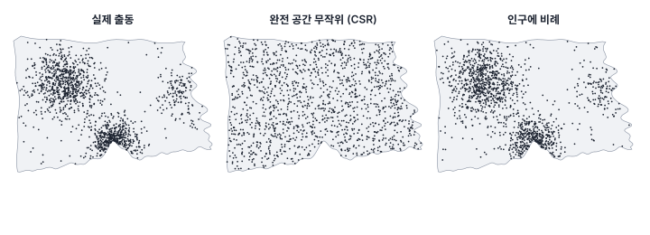
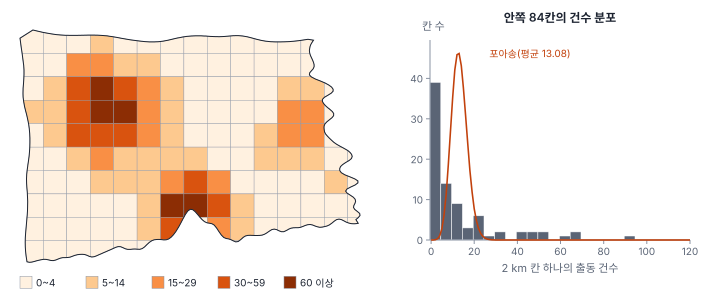
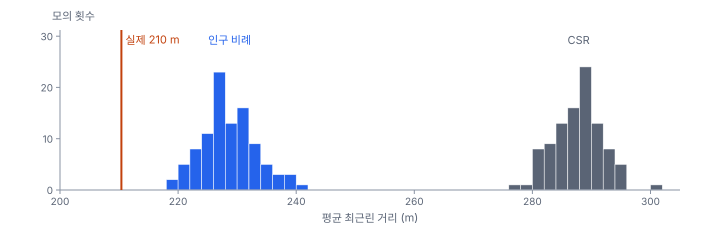

[목차](../README.md) · 이전: [15강 공간 군집 탐지](15-cluster-detection.md) · 다음: [17강 강도 추정](17-intensity.md)

# 16강 점 패턴의 기초

> 앱 지원: ◐ 방격 집계는 앱에서 할 수 있고, 무작위 모의와 최근린 분석은 코드로 함 · 읽는 시간 약 35분

## 이 강에서 얻는 것

- 점 패턴을 "점 과정의 한 번의 실현"으로 보는 관점과, 점의 위치와 점에 붙은 값(표시)을 구별할 수 있음
- 완전 공간 무작위(CSR)와 포아송 과정의 두 성질을 설명하고, 강도를 계산할 수 있음
- 1차 성질(강도의 변화)과 2차 성질(점끼리의 상호작용)을 구별하고, 하나의 자료로는 둘을 가르기 어렵다는 점을 앎
- 방격법과 최근린 거리로 CSR을 검정하고, 관찰창과 경계 효과가 결과를 어떻게 바꾸는지 앎

## 들어가는 질문

3부에서는 출동을 행정동으로 세어 "동마다 몇 건인가"를 다뤘음. 그러나 출동은 원래 동 단위로 일어나지 않음. 2025년 여름 한빛시의 출동 1,408건에는 저마다 정확한 좌표가 있음. 이 점들을 동으로 묶지 않고 그대로 보면 무엇을 물을 수 있는가?

지도에 찍힌 점을 보면 누구나 "몰려 있다"고 말함. 그런데 사람은 무작위로 뿌린 점에서도 몰린 곳을 찾아냄. 또 출동이 몰린 곳은 사람이 몰려 사는 곳이기도 함. "몰려 있다"는 말이 무엇과 비교해 몰려 있다는 뜻인지 정하는 데서 점 패턴 분석이 시작함.

## 1. 점 패턴과 점 과정

**점 패턴**(point pattern)은 정해진 지역 안에서 일어난 사건의 위치 모음임. 출동 위치, 범죄 발생 지점, 나무의 위치, 질병 환자의 주소가 그런 예임. 점 패턴 분석은 이 점들을 어떤 확률 규칙(**점 과정**, point process)이 한 번 만들어 낸 결과(실현)로 보고, 그 규칙을 추론함.

중요한 전제가 두 가지 있음.

- **관찰창**(window): 점을 찾아본 지역 전체를 정해야 함. 한빛시에서는 시 경계 안 454.02 km²임. 바다에는 출동이 일어날 수 없고, 이웃 시의 출동은 기록되지 않았음. 창 밖에는 점이 "없는" 것이 아니라 "보지 않은" 것임
- **빠짐없는 조사**: 창 안에서 일어난 사건은 모두 기록되었다고 봄. 점이 없는 곳은 사건이 일어나지 않은 곳이라는 정보가 됨

이 점에서 점 패턴은 1강의 다른 자료와 다름. 기상 관측소 48곳도 점이지만, 관측소의 위치는 사람이 정했고 관심은 그 점에서 잰 **값**(기온)에 있음. 출동은 **위치 자체**가 관심임. 출동 점에 붙은 연령대처럼 점마다 붙은 값을 **표시**(mark)라 하고, 표시가 붙은 점 패턴을 **표시 점 패턴**(marked point pattern)이라 함. "점이 어디에 있는가"를 묻는 것이 점 패턴 분석(4부)이고, "정해진 점에서 잰 값이 공간적으로 어떻게 이어지는가"를 묻는 것이 지구통계(5부)임. 관측소 기온을 점 패턴처럼 분석하거나, 출동 위치 사이를 보간하면 질문을 잘못 고른 것임(1강).

## 2. 완전 공간 무작위와 포아송 과정

비교의 기준은 **완전 공간 무작위**(complete spatial randomness, CSR)임. 수학적으로는 **균질 포아송 과정**이고, 두 성질로 정의됨.

1. 창 안의 어떤 영역 B에 든 점의 수는 평균이 λ|B|인 포아송분포를 따름. λ는 **강도**(intensity), 곧 단위 면적당 기대 점 수이고, |B|는 B의 면적임
2. 겹치지 않는 영역들에 든 점의 수는 서로 독립임

두 성질을 합치면, 점의 수가 n으로 정해졌을 때 n개의 점은 서로 독립으로 창 안에 고르게(균등분포로) 흩어짐. 어디에 점이 있든 다른 점의 위치에 영향을 주지 않고, 창 안의 모든 곳이 똑같이 점을 받을 가능성이 있다는 뜻임.

강도의 추정은 점의 수를 면적으로 나눈 것임.

$$
\hat{\lambda} = \frac{n}{|W|} = \frac{1408}{454.02\ \text{km}^2} = 3.101\ \text{건/km}^2
$$

CSR은 현실을 묘사하는 모형이 아니라 **기준선**임. "아무 구조도 없다면 이렇게 보일 것"을 정해 두고, 실제 패턴이 그로부터 어느 방향으로 얼마나 벗어나는지를 봄. CSR보다 점이 몰리면 **군집**(clustered, aggregated), 서로 고르게 떨어져 있으면 **규칙**(regular, dispersed) 패턴이라 함.



가운데 CSR 그림에도 점이 듬성한 곳과 빽빽한 곳이 있음. 무작위는 고르게 퍼진 것이 아님. 그럼에도 실제 출동(왼쪽)은 CSR과 확연히 다르고, 사람이 사는 곳에 비례해 뿌린 점(오른쪽)과 훨씬 비슷함.

## 3. 1차 성질과 2차 성질

점 패턴이 CSR에서 벗어나는 방식은 두 가지임.

- **1차 성질**(first-order property): 강도 λ(x)가 위치 x에 따라 달라짐. 사람이 많이 사는 곳에 출동이 많은 것처럼, 점 하나하나가 놓일 가능성이 장소마다 다름. 강도가 위치마다 다른 포아송 과정을 **불균질 포아송 과정**(inhomogeneous Poisson process)이라 함. 점끼리는 여전히 서로 독립임
- **2차 성질**(second-order property): 점끼리 서로 영향을 줌. 감염병 환자 옆에 환자가 생기거나(끌어당김), 나무가 서로 그늘을 피해 떨어져 자라는 것(밀어냄)처럼, 한 점의 존재가 근처에 다른 점이 생길 가능성을 바꿈

3부의 말로 하면 1차 성질은 "추세", 2차 성질은 "자기상관"에 해당함. 두 성질은 모두 "점이 몰린 지도"를 만들어 냄. 인구가 몰린 곳에 출동이 몰린 것(1차)과, 출동이 출동을 부른 것(2차)은 한 장의 지도에서 구별되지 않음. 바틀릿(Bartlett 1964)은 점 패턴 하나만으로는 두 설명을 원리적으로 가를 수 없음을 보였음. 가르려면 강도에 대한 외부 정보(인구 등)를 쓰거나, 같은 과정의 실현(반복 관측)이 여러 번 필요함. 이 문제는 17~19강 내내 따라다님.

## 4. 방격법

가장 오래된 방법은 지역을 같은 크기의 칸(**방격**, quadrat)으로 나눠 칸마다 점을 세는 것임. CSR이면 칸마다의 개수가 포아송분포를 따르므로 평균과 분산이 같음. 분산을 평균으로 나눈 **분산 대 평균 비**(variance-to-mean ratio, VMR)가 1보다 크면 군집, 작으면 규칙 패턴의 신호임. 기대 개수와 관측 개수를 비교하는 카이제곱 검정도 쓸 수 있음.

$$
\chi^2 = \sum_{k=1}^{m} \frac{(n_k - \lambda |B_k|)^2}{\lambda |B_k|}
$$

### 손으로 해 보기: 점 10개

10 km × 10 km 정사각형에 점 10개가 있음. 왼쪽 아래 (1, 1), (2, 1.5), (1.5, 2.5), (2.5, 2), (3, 1)에 다섯 개가 몰려 있고, 나머지는 (7, 8), (8, 7.5), (2, 8), (8, 2), (6, 6)임. 5 km 방격 네 칸으로 나누면 개수는 왼쪽 아래 5, 오른쪽 아래 1, 왼쪽 위 1, 오른쪽 위 3임.

- 평균 = 10/4 = 2.5, 분산 = [(5 − 2.5)² + (1 − 2.5)² + (1 − 2.5)² + (3 − 2.5)²]/3 = 11/3 = 3.67
- VMR = 3.67/2.5 = 1.47
- 카이제곱 = 11/2.5 = 4.40, 자유도 3, p = 0.22

눈으로는 왼쪽 아래에 뚜렷이 몰려 보이지만, 점 10개와 칸 4개로는 CSR과 구별할 수 없음. 점이 적으면 어떤 검정도 힘이 없음.

### 한빛시 출동

앱의 **격자 만들기**와 같은 방식(시 범위를 덮는 정사각 격자 가운데 시와 겹치는 칸)으로 방격을 만들어 셈. 시 경계에 걸린 칸은 기대 개수를 시 안에 든 면적으로 계산하고, 분산 대 평균 비는 시 안에 완전히 들어간 칸만으로 구함.



| 방격 크기 | 칸 수 (안쪽) | 안쪽 칸 평균 | VMR | CSR 모의 99번의 VMR | 0건인 칸 (CSR이면) | 카이제곱 (자유도) |
|---|---|---|---|---|---|---|
| 1 km | 511 (401) | 3.22 | 9.27 | 0.85~1.16 | 40% (4.0%) | 4,686 (510) |
| 2 km | 135 (84) | 13.08 | 26.91 | 0.71~1.43 | 19% (0.0%) | 3,961 (134) |
| 4 km | 38 (14) | 57.71 | 71.39 | 0.29~2.37 | 7% (0.0%) | 2,671 (37) |

어느 크기로 봐도 CSR과는 거리가 멂(카이제곱의 p는 사실상 0). 두 가지를 더 읽을 수 있음.

- **VMR이 방격 크기에 따라 커짐**: 1 km에서 9, 4 km에서 71임. VMR은 "군집의 정도"를 나타내는 하나의 수가 아니라 척도에 따라 달라지는 값임. 3강의 MAUP가 점 패턴에서도 나타나는 것임
- **카이제곱 검정은 무엇과 다른지 말하지 않음**: 점이 1,408개나 되면 아주 작은 차이도 유의함. "CSR이 아님"은 출발점일 뿐이고, 강도가 다른 것인지(1차) 점끼리 끌어당기는 것인지(2차)는 알려 주지 않음

## 5. 최근린 거리

방격법은 칸의 크기와 위치에 결과가 달려 있음. 칸을 쓰지 않는 방법으로 점마다 가장 가까운 다른 점까지의 거리(**최근린 거리**, nearest neighbour distance)를 봄. 클라크와 에반스(Clark & Evans 1954)는 CSR에서 평균 최근린 거리의 기댓값이 0.5/√λ라는 점을 써서, 관측 평균을 기댓값으로 나눈 **R**을 제안했음. R < 1이면 군집, R > 1이면 규칙 패턴임.

한빛시 출동의 평균 최근린 거리는 210.4 m(중앙값 146.5 m)이고, CSR 기댓값은 0.5/√(3.101/10⁶ m²) = 283.9 m라서 R = 0.741임.

손계산의 점 10개는 최근린 거리 평균이 1.818 km이고 기댓값이 0.5/√(10/100) = 1.581 km라 R = 1.15로, 오히려 규칙 쪽으로 나옴. 점이 적고, 창의 가장자리에 놓인 점은 이웃을 창 안에서만 찾기 때문에 거리가 길어지는 **경계 효과** 때문임. 0.5/√λ는 끝없이 넓은 평면에서의 값이라, 창이 있는 실제 자료에는 맞지 않음.

### 모의로 비교하기

경계 효과를 식으로 바로잡는 대신, 같은 창 안에서 CSR을 직접 여러 번 만들어 비교하면 경계 효과가 양쪽에 똑같이 들어감. 한빛시 시 경계 안에 1,408개의 점을 무작위로 뿌리는 일을 99번 했음. 또 하나의 기준으로, 점을 100 m 격자 인구에 비례해 뿌리는 일도 99번 했음. "출동은 사람 수에 비례해 일어날 뿐"이라는 불균질 포아송 과정임.



| 기준 | 평균 최근린 거리 (99번) | 관측 210.4 m와 비교 |
|---|---|---|
| CSR | 평균 287.8 m (277.6~300.1) | 99번 모두 관측보다 김 |
| 인구에 비례 | 평균 228.7 m (218.6~241.7) | 99번 모두 관측보다 김 |

모의에서 CSR의 평균(287.8 m)이 식의 기댓값(283.9 m)보다 조금 긴 것이 경계 효과임. 실제 출동은 CSR보다 크게 몰려 있고, "사람 수에 비례"라는 기준보다도 더 몰려 있음. 인구만으로 설명되지 않는 무엇이 있다는 뜻임. 그것이 더위나 고령 인구 같은 다른 1차 요인인지, 출동끼리의 상호작용(2차)인지는 이 결과만으로 말할 수 없음. 17강에서 강도를, 18~19강에서 상호작용을 다룸.

## 6. 관찰창과 경계 효과

관찰창을 어떻게 잡느냐에 따라 결론이 바뀜.

- **창이 너무 넓으면**: 시 경계 대신 시를 둘러싼 사각형(576.3 km²)을 창으로 잡으면 바다까지 포함되어 강도가 2.443건/km²로 21% 낮게 계산되고, R은 0.658로 더 몰린 것처럼 나옴. 점이 생길 수 없는 바다를 "점이 없는 곳"으로 센 탓임
- **창 가장자리의 점**: 시 경계에서 500 m 안에 있는 출동 115개(8.2%)는 평균 최근린 거리가 237.6 m로, 나머지(208.0 m)보다 김. 해안 쪽은 바다라서 원래 이웃이 없고, 이웃 시와 맞닿은 쪽은 이웃 시의 출동이 기록되지 않아 이웃이 빠진 것임(4강의 경계 효과). CSR 모의 한 번에서도 경계 500 m 안의 점은 최근린 거리가 길었음(360.1 m 대 283.7 m)

대응 방법은 다음과 같음.

- 창은 점이 실제로 생길 수 있고 빠짐없이 조사된 범위로 잡음. 바다·호수·군사시설처럼 사건이 일어날 수 없는 곳은 뺌
- 같은 창에서 모의한 값과 비교함. 경계 효과가 관측과 모의 양쪽에 똑같이 들어가 상쇄됨
- 경계에서 일정 거리 안의 점은 다른 점의 이웃으로만 쓰고 중심점으로는 쓰지 않는 **경계 보정**(border correction)을 씀(18강)

## 해 보기

### 앱으로: 방격 집계

1. `hanbit_dong.gpkg`와 `hanbit_events.gpkg`를 엶
2. **공간 분석 → 격자 만들기 (정사각·육각)…** 메뉴에서 범위를 `레이어: hanbit_dong`, 모양을 정사각형, 셀 크기를 `2000`으로 하고 **폴리곤과 겹치는 셀만 남기기**를 켠 채(존 통계는 끔) **만들기…** 단추를 눌러 저장함
   - 확인: 격자 135개가 생김
3. 새 격자 레이어를 고른 채 **공간 분석 → 점 집계 (점 → 폴리곤)…** 메뉴에서 점 레이어로 `hanbit_events`를 고르고, **개수 (_CNT)** 항목을 켠 채 실행함
   - 확인: `PT_CNT`의 합계가 1,408이고, 가장 많은 칸은 127건, 0건인 칸은 39개임. 이 가운데 23개는 바다에 걸쳐 시 안의 면적이 작은 칸임
4. **차트**의 **+ 히스토그램** 단추로 `PT_CNT`의 분포를 봄. 평균 근처에 몰린 종 모양(포아송)이 아니라, 0 근처에 많고 오른쪽으로 길게 늘어진 모양임을 확인함
5. 셀 크기 `1000`과 `4000`으로 2~4를 반복하고 분포의 모양을 비교함(격자 511개, 38개)

방격의 VMR, CSR 모의, 최근린 거리는 앱에 없어 코드로 함.

### 코드로: 최근린 거리와 CSR 모의

```python
import geopandas as gpd
import numpy as np
import shapely
from scipy.spatial import cKDTree

dong = gpd.read_file("book/data/hanbit_dong.gpkg")
ev = gpd.read_file("book/data/hanbit_events.gpkg")
win = dong.union_all()                                  # 관찰창: 시 경계
P = np.c_[ev.geometry.x, ev.geometry.y]
n, area = len(P), win.area


def mean_nn(pts):
    d, _ = cKDTree(pts).query(pts, k=2)                  # 0번째는 자기 자신
    return d[:, 1].mean()


def csr(k, rng):
    x0, y0, x1, y1 = win.bounds
    out = np.empty((0, 2))
    while len(out) < k:                                  # 사각형에 뿌리고 창 밖은 버림
        q = rng.uniform([x0, y0], [x1, y1], size=(2 * k, 2))
        out = np.vstack([out, q[shapely.contains_xy(win, q[:, 0], q[:, 1])]])
    return out[:k]


obs = mean_nn(P)
expected = 0.5 / np.sqrt(n / area)
rng = np.random.default_rng(1)
sims = np.array([mean_nn(csr(n, rng)) for _ in range(99)])
print(f"관측 {obs:.1f} m, 식의 기댓값 {expected:.1f} m, R = {obs / expected:.3f}")
print(f"CSR 모의 99번: {sims.min():.1f}~{sims.max():.1f} m, 관측보다 작은 모의 {np.sum(sims <= obs)}번")
```

- 확인: 관측 210.4 m, 식의 기댓값 283.9 m, R = 0.741. CSR 모의는 시드에 따라 조금 다르지만 대략 275~305 m이고, 관측보다 작은 모의는 0번임
- 더 해 보기: `ev[ev["연령대"] == "65+"]`만 골라 같은 계산을 해 봄. 점 수가 다르면 기댓값도 달라지므로, 모의도 그 점 수로 다시 함

## 헷갈리는 쌍

- **점 패턴 vs 지구통계 자료**: 점 패턴은 위치 자체가 관심이고 창 안을 빠짐없이 조사함. 지구통계 자료는 사람이 고른 지점에서 잰 값이 관심임
- **1차 성질 vs 2차 성질**: 1차는 장소마다 강도가 다른 것, 2차는 점끼리 서로 영향을 주는 것. 한 장의 지도로는 구별하기 어려움
- **CSR vs 불균질 포아송**: 둘 다 점끼리 독립이지만, CSR은 강도가 어디서나 같고 불균질 포아송은 장소마다 다름
- **군집 패턴 vs 군집 탐지**: 군집 패턴은 점 패턴 전체의 성격(CSR보다 몰림), 군집 탐지(15강)는 위험이 높은 특정 지역을 찾는 것

## 흔한 실수와 심사 지적

- **CSR을 기각하고 "출동이 군집한다"고 결론냄**
  - 지적: "인구가 몰린 곳에 출동이 몰린 것과 무엇이 다릅니까?"
  - 대응: 인구 등 강도에 영향을 주는 요인을 반영한 기준(불균질 포아송)과도 비교함
- **관찰창을 자료의 외접 사각형으로 잡음**
  - 결과: 강도가 낮게 계산되고 군집이 과장됨
  - 대응: 사건이 생길 수 있고 조사된 범위로 창을 정하고, 창을 밝힘
- **방격 크기 하나로 VMR을 보고함**
  - 대응: 크기를 바꿔 보고, 척도에 따라 달라진다는 점을 함께 보고함
- **Clark–Evans R을 식의 기댓값으로만 판단함**
  - 대응: 같은 창에서 모의한 값과 비교하거나 경계 보정을 함

## 보고서에는 이렇게 씀

> 2025년 6~8월 한빛시의 폭염 관련 구급 출동 1,408건의 위치를 점 패턴으로 분석하였다. 관찰창은 바다를 제외한 시 경계(454.0 km²)로 정하였으며, 평균 강도는 3.10건/km²였다. 평균 최근린 거리는 210.4 m로 완전 공간 무작위의 기댓값(283.9 m)보다 짧았고(Clark–Evans R = 0.741), 같은 관찰창에서 생성한 완전 공간 무작위 모의 99회의 값(277.6~300.1 m)은 물론, 100 m 격자 인구에 비례하는 불균질 포아송 모의 99회(218.6~241.7 m)보다도 짧았다. 시 안에 완전히 들어간 2 km 방격 개수의 분산 대 평균 비는 26.9였으며, 방격 크기에 따라 9.3(1 km)에서 71.4(4 km)까지 커졌다. 출동은 인구 분포만으로 설명되는 것보다 더 공간적으로 집중되어 있었다.

적어야 할 항목은 다음과 같음.

- 관찰창의 범위와 면적, 바깥을 어떻게 다뤘는지
- 점의 수와 강도, 기간
- 비교 기준(CSR인지, 인구 비례 같은 불균질 포아송인지)과 모의 횟수
- 방격의 크기와 위치, 경계에 걸친 칸의 처리

## 요약

- 점 패턴은 점 과정의 한 번의 실현이며, 관찰창과 빠짐없는 조사를 전제로 함. 점의 위치가 관심이면 점 패턴, 정해진 점의 값이 관심이면 지구통계임
- CSR(균질 포아송 과정)은 개수가 포아송분포를 따르고 영역끼리 독립인 기준선임. 한빛시 출동의 강도는 3.10건/km²임
- 점이 몰리는 것은 강도의 변화(1차)일 수도, 점끼리의 상호작용(2차)일 수도 있으며, 한 장의 지도로는 가르기 어려움
- 방격법의 VMR(2 km에서 26.9)과 최근린 거리(R = 0.741) 모두 CSR을 강하게 기각함. VMR은 방격 크기에 따라 달라짐
- 경계 효과와 관찰창의 선택이 결과를 바꿈. 같은 창에서 모의한 값과 비교하는 것이 가장 단순한 대응임. 한빛시 출동은 인구 비례 모의보다도 더 몰려 있었음

## 핵심 용어

| 한글 | 영문 | 비고 |
|---|---|---|
| 점 패턴 | Point Pattern | 사건 위치의 모음 |
| 점 과정 | Point Process | 점 패턴을 만드는 확률 규칙 |
| 관찰창 | Observation Window | |
| 표시 점 패턴 | Marked Point Pattern | 연령대 등 |
| 완전 공간 무작위 | Complete Spatial Randomness (CSR) | 균질 포아송 과정 |
| 강도 | Intensity | 단위 면적당 기대 점 수 |
| 불균질 포아송 과정 | Inhomogeneous Poisson Process | 1차 성질 |
| 방격법 | Quadrat Method | |
| 분산 대 평균 비 | Variance-to-Mean Ratio (VMR) | |
| 최근린 거리 | Nearest Neighbour Distance | Clark–Evans R |
| 경계 효과 | Edge Effect | |

## 원전과 더 읽을거리

**원전**

- Clark, P. J., & Evans, F. C. (1954). Distance to nearest neighbor as a measure of spatial relationships in populations. *Ecology*, 35(4), 445–453. 최근린 거리의 R
- Bartlett, M. S. (1964). The spectral analysis of two-dimensional point processes. *Biometrika*, 51(3/4), 299–311. 군집과 불균질성을 가르기 어려움
- Diggle, P. J. (2013). *Statistical Analysis of Spatial and Spatio-Temporal Point Patterns* (3rd ed.). CRC Press. 점 패턴 분석의 표준 교과서

**더 읽을거리**

- Baddeley, A., Rubak, E., & Turner, R. (2015). *Spatial Point Patterns: Methodology and Applications with R*. CRC Press. spatstat의 저자들이 쓴 실전서. 1~6장
- Illian, J., Penttinen, A., Stoyan, H., & Stoyan, D. (2008). *Statistical Analysis and Modelling of Spatial Point Patterns*. Wiley.
- Rey, S. J., Arribas-Bel, D., & Wolf, L. J. (2023). *Geographic Data Science with Python*. CRC Press. 8장(Point Pattern Analysis)

## 연습

1. 한빛시 출동을 "구"의 면적으로 나눠 구별 강도를 구하면 무엇을 알 수 있고, 무엇을 놓치는가?

2. 어떤 연구자가 서울시의 편의점 위치로 최근린 거리를 구하면서 관찰창을 경기도까지 포함한 사각형으로 잡았음. 결과에 어떤 영향이 있는가?

3. 손계산의 점 10개에서 방격을 2.5 km(16칸)로 줄이면 VMR은 어떻게 될 것으로 예상하는가? 직접 세어 보시오.

4. 출동이 인구 비례 모의보다도 더 몰려 있다는 결과를 "출동이 출동을 부른다(전염)"로 해석할 수 있는가?

5. 기상 관측소 48곳의 위치로 최근린 거리를 구했더니 R = 1.7로 규칙 패턴이었음. 이 결과는 무엇을 말하는가?

<details>
<summary>해답</summary>

1. 구마다의 평균 강도(출동의 밀도)를 비교할 수 있음. 그러나 구 안에서 어디에 몰렸는지는 사라지고, 구 경계를 어디에 긋느냐에 따라 값이 달라짐(3강 MAUP). 면적으로 나눈 강도는 인구가 많은 곳을 높게 보여 주므로 "위험"과는 다름(14강).

2. 경기도에는 서울의 편의점이 기록되지 않았으므로, 창의 대부분이 "편의점이 없는 곳"으로 계산됨. 강도가 크게 낮게 추정되고 CSR 기댓값 0.5/√λ가 길어져, R이 작게 나와 군집이 과장됨. 창은 서울시 경계로 잡아야 함.

3. 2.5 km 칸 16개로 세면(칸 경계 위의 점은 오른쪽·위 칸에 넣음) 2개인 칸이 2개((0~2.5, 0~2.5)와 (2.5~5, 0~2.5)), 1개인 칸이 6개, 0개인 칸이 8개임. 평균 0.625, 분산 (14 − 10²/16)/15 = 0.517이라 VMR = 0.83으로 1보다 작아짐. 5 km 칸에서는 1.47이었으므로, 같은 점이 칸 크기에 따라 "몰림"에서 "고름"으로 바뀜. 왼쪽 아래 무리가 칸 경계에 나뉘어 들어갔기 때문임. VMR은 척도와 칸의 위치에 달린 값임.

4. 그것만으로는 안 됨. 인구 외에도 더위, 고령 인구 같은 다른 1차 요인이 강도를 바꿀 수 있고, 그런 요인이 몰린 곳에서도 점이 더 몰림. 바틀릿의 결과처럼, 2차 상호작용의 증거가 되려면 알려진 1차 요인을 모두 반영한 뒤에도 몰림이 남는지 봐야 함(18~19강). 폭염 출동은 서로 전염되는 사건이 아니라는 상식도 해석에 중요함.

5. 관측소는 사람이 서로 일정 거리 이상 떨어지게 배치한 것이므로, 규칙 패턴은 "배치 설계"를 보여 줄 뿐임. 관측소 위치는 점 패턴 분석의 대상이 아니라, 지구통계에서 표본 배치(23강 6절, 38강)의 문제임.

</details>

---

[목차](../README.md) · 이전: [15강 공간 군집 탐지](15-cluster-detection.md) · 다음: [17강 강도 추정](17-intensity.md)
