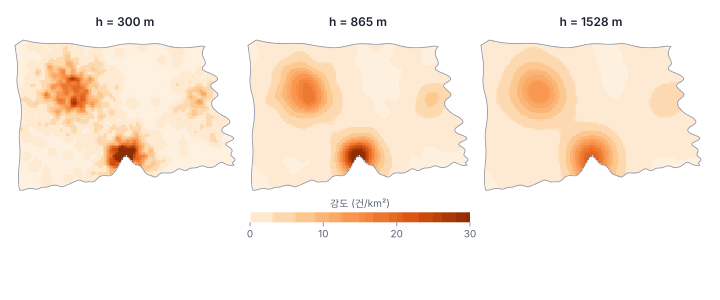
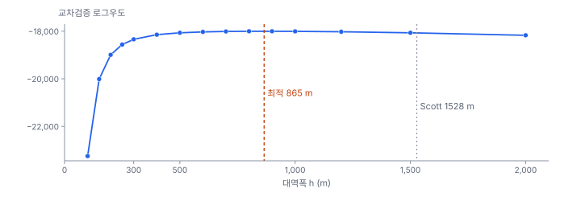
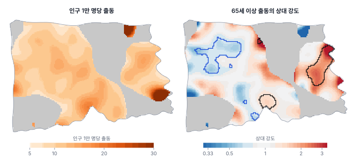
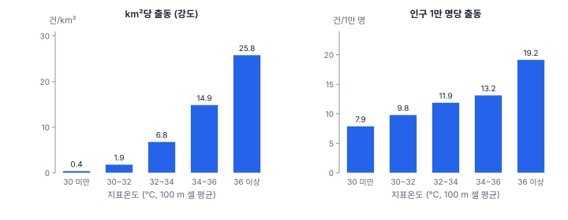

[목차](../README.md) · 이전: [16강 점 패턴의 기초](16-point-pattern-basics.md) · 다음: [18강 점 사이의 상호작용](18-interaction.md)

# 17강 강도 추정

> 앱 지원: ◐ 방격 밀도는 앱에서(격자 만들기 + 점 집계), 커널 밀도·대역폭 선택·상대 강도는 코드로 함 · 읽는 시간 약 40분

## 이 강에서 얻는 것

- 방격 밀도와 커널 밀도로 위치마다 다른 강도 λ(x)를 추정하고, 경계 보정이 왜 필요한지 앎
- 대역폭이 결과를 좌우한다는 것을 알고, 우도 교차검증과 경험 규칙으로 대역폭을 고를 수 있음
- 강도를 인구로 나눈 "1인당 강도"와, 두 종류 점의 강도 비(상대 강도)를 만들고 무작위 표지 모의로 유의성을 판단할 수 있음
- 공변량에 따라 강도가 어떻게 달라지는지 보고, 면적 기준 강도에 숨은 교란을 읽을 수 있음

## 들어가는 질문

16강에서 한빛시 출동은 CSR과 거리가 멀었음. 강도가 장소마다 다르다(1차 성질)는 것은 분명함. 소방본부는 "출동 밀도 지도"를 만들어 구급차 배치에 쓰고 싶어 함. 범죄 지도학이나 상권 분석에서 흔히 보는 **핫스팟 지도**가 바로 이것임(13강의 Gi\* "핫스팟 분석"과는 다른 것임).

그런데 같은 출동 자료로 그린 밀도 지도가 그리는 사람에 따라 전혀 다르게 생겼음. 한 사람은 도시 곳곳에 작은 점박이가 있는 지도를, 다른 사람은 큰 덩어리 두 개뿐인 지도를 들고 왔음. 무엇이 다른가? 그리고 밀도 지도에서 가장 진한 곳은 "위험한 곳"인가, 아니면 "사람이 많은 곳"인가?

## 1. 강도와 그 추정

16강에서 강도 λ는 단위 면적당 기대 점 수였음. 1차 성질이 있는 점 과정에서는 강도가 위치의 함수 λ(x)이고, 영역 B에 든 점 수의 기댓값은 그 영역에서 λ(x)를 적분한 값임. 강도 추정은 이 λ(x)를 자료에서 그려 내는 일임.

### 방격 밀도

가장 단순한 방법은 16강의 방격 개수를 칸의 면적으로 나누는 것임. 앱에서 **격자 만들기**와 **점 집계**의 **밀도: km²당 개수 (_DENS)** 항목으로 바로 만들 수 있음. 1 km 격자에서 가장 높은 칸은 41.0건/km²이고, 511칸 가운데 245칸이 0임. 방격 밀도는 이해하기 쉽지만 두 가지 약점이 있음. 칸의 경계에서 값이 계단처럼 뚝 끊기고, 격자를 조금만 옮겨도 칸마다의 값이 바뀜. 또 바다에 걸친 칸은 칸 전체 면적으로 나누므로 실제 강도보다 낮게 나옴.

### 커널 밀도

**커널 밀도 추정**(kernel density estimation, KDE)은 점마다 작은 언덕(커널)을 세우고 그 높이를 더함. 위치 x의 강도 추정은 다음과 같음.

$$
\hat{\lambda}(x) = \frac{1}{e_h(x)} \sum_{i=1}^{n} k_h(x - x_i), \qquad k_h(u) = \frac{1}{2\pi h^2} \exp\!\left(-\frac{\lVert u \rVert^2}{2h^2}\right)
$$

k_h는 가우시안 커널이고, **대역폭**(bandwidth) h는 언덕의 폭(표준편차)임. 커널 하나의 부피는 1이므로, 커널을 모두 더한 표면을 평면 전체에서 적분하면 점의 수 n이 됨. 방격과 달리 칸의 경계가 없어 매끈하고, 격자의 위치에 따라 바뀌지 않음.

e_h(x)는 **경계 보정**(edge correction) 항임. 해안선 바로 옆의 위치에서는 커널의 절반이 바다로 넘어가, 근처 점이 같아도 강도가 반쯤으로 낮게 추정됨. 디글(Diggle 1985)의 균일 보정은 위치 x에 세운 커널의 부피 가운데 관찰창 안에 드는 비율 e_h(x)로 나눠 이를 바로잡음. 한빛시에서 보정하지 않으면 대역폭 865 m에서 67건, 1,528 m에서 113건이 창 밖(바다와 이웃 시)으로 새어 나감.

### 손으로 해 보기

위치 x에서 0.5 km, 1 km, 2 km 떨어진 곳에 점이 하나씩 있고 대역폭이 1 km인 가우시안 커널을 씀(km 단위).

| 점 | 거리 d | k = exp(−d²/2) / (2π) |
|---|---|---|
| 1 | 0.5 | 0.8825 / 6.283 = 0.1405 |
| 2 | 1.0 | 0.6065 / 6.283 = 0.0965 |
| 3 | 2.0 | 0.1353 / 6.283 = 0.0215 |

합은 0.2585건/km²임. x가 곧은 해안선 바로 위에 있어 커널의 절반이 바다로 나간다면 e_h(x) = 0.5이므로, 보정한 강도는 0.2585/0.5 = 0.517건/km²임. 가까운 점일수록 크게 기여하고, 대역폭의 두 배(2 km)쯤 떨어진 점은 거의 기여하지 않음.

## 2. 대역폭이 지도를 정함

커널의 모양(가우시안, 이차, 원통 등)보다 대역폭이 훨씬 중요함. 같은 자료로 대역폭만 바꾼 지도 세 장을 봄.



| 대역폭 | 최대 강도 (건/km²) | 상위 1% | 중앙값 |
|---|---|---|---|
| 300 m | 56.2 | 25.0 | 0.84 |
| 865 m (우도 교차검증) | 34.6 | 22.4 | 1.20 |
| 1,528 m (Scott 규칙) | 21.2 | 16.7 | 1.65 |

세 지도 모두 가장 높은 곳은 마루16동 부근임. 그러나 최대 강도는 대역폭에 따라 56에서 21까지 세 배 가까이 달라짐. 대역폭이 작으면 점 하나하나의 우연한 위치까지 그대로 그려 **과소평활**(undersmoothing)이 되고, 크면 실제로 다른 곳들이 뭉개져 **과대평활**(oversmoothing)이 됨. "핫스팟 지도"를 보여 줄 때 대역폭을 밝히지 않으면 지도를 읽을 수 없음.

### 대역폭 고르기

- **경험 규칙**: 점 좌표의 표준편차에 n^(−1/6)을 곱하는 Scott 규칙 같은 식이 있음. 한빛시는 x 5,850 m, y 4,253 m의 제곱평균제곱근(5,114 m)에 1408^(−1/6)을 곱해 1,528 m임. 점들이 하나의 정규분포 덩어리라고 가정한 식이라, 여러 덩어리로 나뉜 자료에서는 크게 나옴
- **우도 교차검증**(likelihood cross-validation): 점 하나를 빼고 나머지로 그 자리의 강도를 추정해, 그 로그를 모든 점에 대해 더하고 강도 표면의 적분(약 n)을 뺀 값을 최대로 하는 h를 고름. "빠진 점이 있던 자리를 얼마나 잘 예측하는가"를 보는 것임. 한빛시에서는 865 m가 나옴
- **목적에 맞춰 정함**: 구급차 한 대가 맡는 범위, 동네의 크기처럼 분석 목적에 맞는 거리를 정하고, 다른 값으로도 결과가 유지되는지 봄



교차검증 곡선은 600~1,200 m에서 거의 평평함. 최적값 하나보다 "이 범위의 어느 값이나 비슷하게 좋음"으로 읽는 것이 정직함. 이 밖에 점이 빽빽한 곳은 좁게, 성긴 곳은 넓게 쓰는 **적응 대역폭**(adaptive bandwidth)도 있음(10강 커널 가중치의 적응 대역폭과 같은 생각).

## 3. 강도는 위험이 아님

밀도 지도의 진한 곳은 "출동이 많은 곳"이지 "출동 위험이 높은 곳"이 아님. 사람이 많이 사는 곳에는 출동도 많음. 14강에서 건수를 인구로 나눠 비율로 바꾼 것과 같은 일을 표면에서 하려면, 같은 대역폭으로 인구의 커널 밀도를 만들어 나눔.

$$
\hat{r}(x) = \frac{\hat{\lambda}_{\text{출동}}(x)}{\hat{\lambda}_{\text{인구}}(x)}
$$



대역폭 1,000 m로 그린 인구 1만 명당 출동 강도(왼쪽)는 출동 강도가 0.5건/km² 이상인 301.5 km²에서 5% 지점 7.3, 중앙값 11.1, 95% 지점 17.2임. 출동 밀도 지도의 두 덩어리(마루구, 가람구) 가운데 가람구 쪽은 인구로 나누면 시 전체(11.7)보다 약간 낮은 10 안팎으로 옅어지고, 마루구 원도심(마루15·16·30동 부근 약 17~19)은 남음. 대신 밀도 지도에서는 눈에 띄지 않던 다솜구의 동쪽 해안(다솜19·20·23·24동 부근)과 북쪽(다솜1·2동 부근)이 높게 나옴. 가장 높은 값(76.3)은 다솜23동 부근인데, 인구가 1천 명 남짓한 동들이 모인 곳이라 분모가 작아 값이 크게 흔들림. 실제로 출동이 많은 곳인지 작은 수 때문에 튄 값인지는 이 지도만으로 가릴 수 없고, 15강의 군집 탐지로 확인해야 함. 14강의 작은 수 문제는 표면에서도 그대로 나타남.

### 두 종류 점의 상대 강도

인구 대신 다른 종류의 점을 분모로 쓸 수도 있음. 역학의 **사례–대조**(case–control) 설계가 그 예임. 환자(사례)의 강도를 같은 인구에서 뽑은 건강한 사람(대조)의 강도로 나누면, 인구 분포가 상쇄되고 "같은 수의 사람 가운데 환자가 될 상대적 위험"이 남음(Kelsall & Diggle 1995).

출동 자료에서는 65세 이상 출동 635건과 65세 미만 출동 773건을 나눠 봄. 각각 같은 대역폭(1,000 m)으로 강도를 추정하고 건수로 나눈 뒤 비를 구하면, 1보다 큰 곳은 65세 이상 출동의 비중이 시 전체보다 큰 곳임(오른쪽 그림).

유의성은 **무작위 표지**(random labelling) 모의로 판단함. 1,408개 점의 위치는 그대로 두고 "65세 이상" 표지만 무작위로 섞어 635개에 다시 붙인 뒤 상대 강도를 계산하는 일을 199번 되풀이함. 위치마다 관측 상대 강도가 모의의 상위 2.5% 안이면 유의하게 높고, 하위 2.5% 안이면 낮음. 위치 자체는 바꾸지 않으므로 인구 분포의 영향이 들어가지 않음.

- 65세 이상 출동의 비중이 유의하게 높은 곳은 22.6 km²로, 그곳의 평활한 고령비율은 평균 26.2%임(시 전체 20.6%)
- 유의하게 낮은 곳은 23.8 km²이고, 평활한 고령비율이 평균 15.6%임
- 로그 상대 강도와 평활한 고령비율의 상관은 0.44임. 65세 이상 출동은 대체로 고령 인구가 많은 곳에 많지만, 고령비율만으로 다 설명되지는 않음

위치마다 검정하므로 12강의 다중검정 문제가 그대로 있고, 이웃한 위치끼리 검정이 겹쳐 "유의한 영역"의 경계는 대략적임. 영역 전체에 대한 하나의 검정이 필요하면, 상대 강도 표면이 평평한지(어디서나 1인지)를 표면 전체의 편차로 재는 검정을 무작위 표지로 함(Kelsall & Diggle 1995).

## 4. 강도와 공변량

강도가 어떤 변수(공변량)에 따라 달라지는지 보려면, 공변량을 몇 구간으로 나눠 구간마다 "그 구간의 면적에 든 점의 수"를 셈. 지표온도를 100 m 셀 평균으로 다섯 구간으로 나눴음.



| 지표온도 | 면적 (km²) | 인구 | 출동 | km²당 | 인구 1만 명당 | 인구 밀도 (명/km²) |
|---|---|---|---|---|---|---|
| 30℃ 미만 | 208.3 | 112,662 | 89 | 0.43 | 7.90 | 541 |
| 30~32℃ | 141.1 | 266,396 | 262 | 1.86 | 9.83 | 1,888 |
| 32~34℃ | 73.0 | 418,767 | 498 | 6.82 | 11.89 | 5,733 |
| 34~36℃ | 31.1 | 352,061 | 463 | 14.88 | 13.15 | 11,313 |
| 36℃ 이상 | 3.7 | 50,114 | 96 | 25.81 | 19.16 | 13,472 |

면적 기준 강도는 가장 시원한 구간에서 가장 더운 구간까지 60배로 늘지만, 인구 1만 명당으로 보면 2.4배임. 더운 곳은 인구 밀도가 25배 높은 도심이기 때문임. 면적 기준 강도에는 "사람이 많은 효과"와 "더운 효과"가 섞여 있고, 인구로 나눠야 더위의 효과에 가까워짐. 그래도 남은 2.4배가 모두 더위 때문인지는 고령 인구 등 다른 변수를 함께 봐야 알 수 있음. 여러 공변량을 함께 다루는 강도 모형은 19강에서 다룸.

## 해 보기

### 앱으로: 방격 밀도

1. `hanbit_dong.gpkg`와 `hanbit_events.gpkg`를 엶
2. **공간 분석 → 격자 만들기 (정사각·육각)…** 메뉴에서 범위 `레이어: hanbit_dong`, 정사각형, 셀 크기 `1000`, **폴리곤과 겹치는 셀만 남기기**를 켜고 **만들기…** 단추로 저장함
3. 격자 레이어를 고른 채 **공간 분석 → 점 집계 (점 → 폴리곤)…** 메뉴에서 점 레이어 `hanbit_events`, **개수 (_CNT)** 와 **밀도: km²당 개수 (_DENS)** 항목을 모두 켜고 실행함
   - 확인: `PT_DENS`의 최댓값이 41.0이고, 511칸 가운데 245칸이 0임
4. 주제도에서 `PT_DENS`를 분위수로 칠하고, 위 커널 밀도 지도와 비교함. 해안에 걸친 칸은 바다까지 포함한 칸 면적으로 나눠 낮게 나온다는 점을 확인함
5. 셀 크기 `500`으로 다시 만들어 비교함. 칸이 작아질수록 점박이가 되는 것이 커널 밀도의 작은 대역폭과 같은 현상임

### 코드로: 경계 보정한 커널 밀도와 우도 교차검증

```python
import geopandas as gpd
import numpy as np
import shapely
from scipy.spatial.distance import cdist

dong = gpd.read_file("book/data/hanbit_dong.gpkg")
ev = gpd.read_file("book/data/hanbit_events.gpkg")
win = dong.union_all()
P = np.c_[ev.geometry.x, ev.geometry.y]

g = 250                                                   # 평가 격자 250 m
x0, y0, x1, y1 = win.bounds
gx, gy = np.meshgrid(np.arange(x0 + g / 2, x1, g), np.arange(y0 + g / 2, y1, g))
inside = shapely.contains_xy(win, gx, gy)
G = np.c_[gx[inside], gy[inside]]


def kern(d2, h):                                          # 가우시안 커널 (1/m²)
    return np.exp(-d2 / (2 * h * h)) / (2 * np.pi * h * h)


def edge(at, h):                                          # 커널 질량 가운데 시 안에 드는 비율
    return kern(cdist(at, G, "sqeuclidean"), h).sum(1) * g * g


def intensity(h):                                         # 경계 보정한 강도 (건/km²)
    return kern(cdist(G, P, "sqeuclidean"), h).sum(1) / edge(G, h) * 1e6


D2 = cdist(P, P, "sqeuclidean")
np.fill_diagonal(D2, np.inf)                              # 자기 자신은 빼고(leave-one-out)


def cv(h):                                                # 우도 교차검증 점수
    return np.log(kern(D2, h).sum(1) / edge(P, h)).sum() - len(P)


for h in (300, 500, 865, 1200, 1528):
    print(f"h {h:5d} m: CV {cv(h):9.1f}, 최대 강도 {intensity(h).max():5.1f}건/km²")
```

- 확인: CV는 300 m −18341.3, 500 m −18066.7, 865 m −18002.3, 1,200 m −18023.9, 1,528 m −18073.0으로 865 m가 가장 큼. 최대 강도는 56.7, 47.6, 34.1, 26.3, 20.9건/km²임. 평가 격자가 250 m라 본문(200 m 격자)과 끝자리가 조금 다름
- 더 해 보기: `P`를 65세 이상과 미만으로 나눠 각각의 `intensity(1000)`을 구하고, 건수로 나눈 비를 지도로 그려 위 상대 강도 그림과 비교함

## 헷갈리는 쌍

- **강도 vs 위험**: 강도는 면적당 사건 수, 위험은 사람(또는 대조)당 사건 수. 밀도 지도의 진한 곳은 사람이 많은 곳일 수 있음
- **방격 밀도 vs 커널 밀도**: 방격은 칸으로 세고 칸 경계에서 끊김. 커널은 점마다 언덕을 더해 매끈하지만 대역폭에 좌우됨
- **커널의 모양 vs 대역폭**: 모양(가우시안, 이차 등)은 결과를 조금 바꾸고, 대역폭은 크게 바꿈
- **과소평활 vs 과대평활**: 대역폭이 작으면 우연한 점박이가, 크면 실제 차이가 뭉개진 지도가 됨
- **상대 강도 vs 인구 대비 강도**: 상대 강도는 다른 종류의 점(대조)으로, 인구 대비 강도는 인구 표면으로 나눔

## 흔한 실수와 심사 지적

- **대역폭을 밝히지 않은 "핫스팟 지도"**
  - 지적: "대역폭은 얼마이고 왜 그 값입니까? 다른 값에서도 같습니까?"
  - 대응: 대역폭과 선택 방법을 적고, 두세 가지 값의 지도를 함께 보여 줌
- **경계 보정 없이 해안·시 경계의 강도를 해석함**
  - 결과: 경계 근처의 강도가 낮게 나와 "외곽은 안전하다"로 잘못 읽음
  - 대응: 경계 보정을 하고, 창 밖의 점이 조사되지 않았다는 점을 밝힘
- **밀도 지도를 위험 지도로 씀**
  - 대응: 인구나 대조 집단의 강도로 나눈 상대 강도를 함께 제시함
- **인구가 적은 곳의 상대 강도를 그대로 해석함**
  - 대응: 분모의 강도가 낮은 곳은 가리거나 표시하고, 무작위 표지 모의로 유의성을 봄
- **공변량별 강도를 면적 기준으로만 봄**
  - 대응: 인구 기준으로도 보고, 여러 공변량을 함께 다루는 모형(19강)으로 교란을 다룸

## 보고서에는 이렇게 씀

> 출동의 공간적 강도를 가우시안 커널 밀도로 추정하였다. 시 경계에 의한 과소 추정을 줄이기 위해 균일 경계 보정(Diggle 1985)을 적용하였고, 대역폭은 우도 교차검증으로 865 m를 선택하였다(600~1,200 m 범위에서 교차검증 점수가 거의 같았다). 강도는 마루16동 부근에서 가장 높았다(34.6건/km²). 인구 분포의 영향을 제거하기 위해 같은 커널로 추정한 인구 밀도로 나눈 인구 1만 명당 출동 강도(대역폭 1,000 m)는 출동 강도가 0.5건/km² 이상인 지역(301.5 km²)의 90%에서 7.3~17.2건이었다. 65세 이상 출동과 65세 미만 출동의 상대 강도를 무작위 표지 모의 199회로 검정한 결과, 고령 인구 비중이 높은 22.6 km²에서 65세 이상 출동의 비중이 유의하게 높았다.

적어야 할 항목은 다음과 같음.

- 커널의 종류와 대역폭, 대역폭을 고른 방법, 민감도
- 경계 보정 방법과 관찰창
- 강도인지 인구(또는 대조) 대비 강도인지, 분모의 출처
- 상대 강도의 유의성 판단 방법(무작위 표지 횟수, 양측 기준)

## 요약

- 강도 λ(x)는 위치마다의 단위 면적당 기대 점 수이고, 방격 밀도나 커널 밀도로 추정함. 커널 밀도는 경계 보정이 필요함
- 커널 밀도는 대역폭에 크게 좌우됨. 한빛시 출동의 최대 강도는 300 m에서 56.2, 1,528 m에서 21.2건/km²였음. 우도 교차검증은 865 m를 골랐지만 600~1,200 m가 거의 같았음
- 강도는 위험이 아님. 인구 강도나 대조 집단의 강도로 나눠야 위험에 가까워짐. 65세 이상 출동의 상대 강도는 고령 인구가 많은 곳에서 유의하게 높았음
- 지표온도 구간별 출동은 면적 기준으로 60배, 인구 기준으로 2.4배 차이가 났음. 면적 기준 강도에는 인구의 효과가 섞여 있음

## 핵심 용어

| 한글 | 영문 | 비고 |
|---|---|---|
| 강도 함수 | Intensity Function λ(x) | |
| 방격 밀도 | Quadrat Density | 앱: 점 집계의 _DENS |
| 커널 밀도 추정 | Kernel Density Estimation (KDE) | |
| 대역폭 | Bandwidth | |
| 경계 보정 | Edge Correction | Diggle 1985 균일 보정 |
| 우도 교차검증 | Likelihood Cross-Validation | |
| 적응 대역폭 | Adaptive Bandwidth | |
| 상대 강도(상대 위험) | Relative Intensity (Relative Risk) | Kelsall & Diggle 1995 |
| 사례–대조 | Case–Control | |
| 무작위 표지 | Random Labelling | |

## 원전과 더 읽을거리

**원전**

- Diggle, P. J. (1985). A kernel method for smoothing point process data. *Journal of the Royal Statistical Society: Series C (Applied Statistics)*, 34(2), 138–147. 커널 강도와 경계 보정
- Kelsall, J. E., & Diggle, P. J. (1995). Non-parametric estimation of spatial variation in relative risk. *Statistics in Medicine*, 14(21–22), 2335–2342. 상대 위험 표면
- Silverman, B. W. (1986). *Density Estimation for Statistics and Data Analysis*. Chapman & Hall. 커널 밀도와 대역폭

**더 읽을거리**

- Baddeley, A., Rubak, E., & Turner, R. (2015). *Spatial Point Patterns: Methodology and Applications with R*. CRC Press. 6장(강도와 공변량), 9장(포아송 모형), 14장(상대 위험)
- Davies, T. M., Marshall, J. C., & Hazelton, M. L. (2018). Tutorial on kernel estimation of continuous spatial and spatiotemporal relative risk. *Statistics in Medicine*, 37(7), 1191–1221.
- Chainey, S., & Ratcliffe, J. (2005). *GIS and Crime Mapping*. Wiley. 범죄 지도학의 핫스팟 지도

## 연습

1. 손계산에서 대역폭을 2 km로 바꾸면 세 점의 커널 값과 합은 어떻게 되는가? (exp(−0.03125) = 0.969, exp(−0.125) = 0.882, exp(−0.5) = 0.607)

2. 해안선을 따라 출동이 많은 동네가 있음. 경계 보정을 하지 않은 커널 밀도 지도에서 이 동네는 어떻게 보이는가?

3. 우도 교차검증이 600~1,200 m에서 거의 평평했음. 보고서에 대역폭을 어떻게 적는 것이 좋은가?

4. 커널 밀도 지도에서 가장 진한 마루16동 부근에 구급차를 더 배치하자는 제안이 있었음. 이 지도만으로 판단해도 되는가?

5. 무작위 표지 모의에서 위치는 그대로 두고 표지만 섞는 이유는 무엇인가?

<details>
<summary>해답</summary>

1. h = 2 km이면 분모가 2π × 4 = 25.13이고, 지수는 −d²/8임. 0.5 km: 0.969/25.13 = 0.0386, 1 km: 0.882/25.13 = 0.0351, 2 km: 0.607/25.13 = 0.0241. 합은 0.0978건/km²로 1 km일 때(0.2585)의 3분의 1 남짓임. 대역폭이 크면 가까운 점의 기여가 줄고 먼 점의 기여가 상대적으로 커져, 값이 낮고 고르게 퍼짐.

2. 커널의 일부가 바다로 넘어가 시 안의 강도가 실제보다 낮게 추정되므로, 출동이 많은데도 덜 진하게 보임. 대역폭이 클수록 심함. 경계 보정을 하면 이 과소 추정이 줄어듦.

3. "우도 교차검증으로 865 m를 선택하였으나 600~1,200 m에서 점수가 거의 같았으며, 600 m와 1,200 m에서도 주요 고강도 지역이 같았다"처럼 범위와 민감도를 함께 적음. 최적값 하나만 적으면 그 값이 특별히 옳은 것처럼 읽힘.

4. 지도 하나만으로 정하면 안 됨. 구급차 배치에는 출동 수 자체가 중요하므로 강도 지도는 쓸모가 있음. 다만 "위험"으로 해석하려면 인구 대비 강도를 봐야 하고, 대역폭에 따라 진한 곳의 범위가 달라지므로 여러 대역폭에서 확인함. 또 출동 수의 우연한 변동이 있으므로 다른 기간의 자료와 비교함.

5. 위치를 그대로 두면 점들이 놓인 인구 분포가 관측과 모의에서 같으므로, 인구 분포의 영향이 비교에서 빠짐. 표지만 섞으면 "어느 점이 65세 이상인가가 위치와 무관하다"는 귀무가설을 검정하게 됨. 위치까지 무작위로 바꾸면 인구가 몰린 효과까지 함께 검정하게 되어 질문이 달라짐.

</details>

---

[목차](../README.md) · 이전: [16강 점 패턴의 기초](16-point-pattern-basics.md) · 다음: [18강 점 사이의 상호작용](18-interaction.md)
