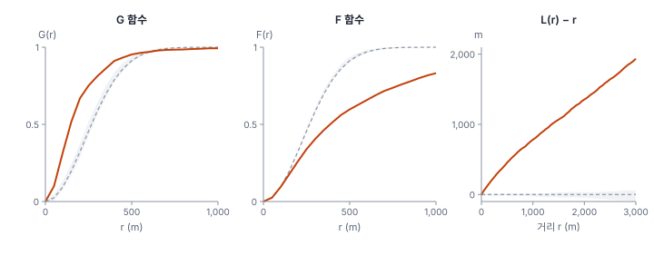
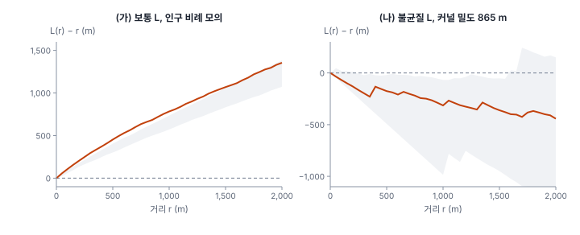
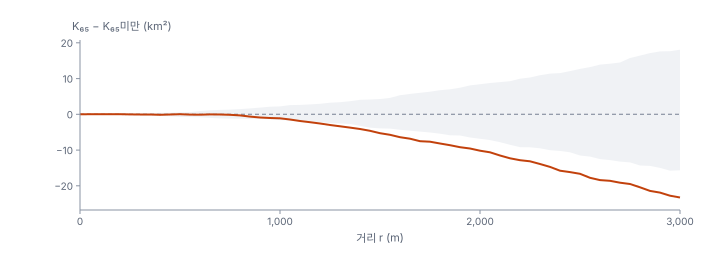

[목차](../README.md) · 이전: [17강 강도 추정](17-intensity.md) · 다음: [19강 점 과정 모형](19-point-process-models.md)

# 18강 점 사이의 상호작용

> 앱 지원: ○ GeoStat에 거리 함수가 없어 코드로 함 · 읽는 시간 약 45분

## 이 강에서 얻는 것

- G, F, J 함수와 Ripley의 K·L 함수가 무엇을 재는지 알고 손으로 계산할 수 있음
- 모의 포락선으로 CSR을 검정하고, 점별 포락선과 전역 검정의 차이를 앎
- 불균질 K로 강도의 변화를 걸러 낸 뒤 상호작용을 보는 법과, 강도를 무엇으로 두느냐가 결론을 바꾼다는 점을 앎
- 두 종류의 점(표시)이 서로 다르게 모여 있는지 무작위 표지로 검정할 수 있음

## 들어가는 질문

16강에서 출동은 CSR보다, 그리고 인구에 비례한 무작위보다도 몰려 있었음. 17강에서는 강도가 장소마다 크게 다르다는 것을 지도로 봤음. 그러면 출동끼리 서로 "끌어당기는" 성질, 곧 한 출동 근처에 다른 출동이 더 생기는 성질도 있는가?

방역 담당자라면 이 질문이 중요함. 감염병이라면 환자 옆에 환자가 생기는 것이 상호작용이고, 그 거리 규모가 전파 범위를 말해 줌. 폭염 출동은 전염되지 않으니 상호작용이 없어야 할 것 같음. 그런데 분석 도구는 "몰려 있음"을 강하게 보여 줌. 이 강은 거리에 따라 몰림을 재는 함수들을 다루고, 그 함수가 말하는 "몰림"이 상호작용인지 강도의 변화인지를 어떻게 가르는지 봄.

## 1. 최근린 거리 함수 G와 빈 공간 함수 F

16강의 평균 최근린 거리는 숫자 하나였음. 거리 전체의 분포를 보면 더 많은 것을 알 수 있음.

- **G 함수**: 최근린 거리가 r 이하인 점의 비율. "점에서 출발해 가장 가까운 점까지"
- **F 함수**(빈 공간 함수, empty space function): 창 안의 임의의 위치에서 가장 가까운 점까지의 거리가 r 이하인 비율. "아무 데서나 출발해 가장 가까운 점까지"

CSR에서는 두 함수가 같고, 이론값은 1 − exp(−λπr²)임. 군집 패턴에서는 점들이 서로 가까워 G가 빨리 올라가고, 빈 곳이 많아 F는 느리게 올라감. 규칙 패턴은 반대임. 둘을 묶은 **J 함수** J(r) = (1 − G(r)) / (1 − F(r))는 CSR에서 1, 군집이면 1보다 작고, 규칙이면 1보다 큼(van Lieshout & Baddeley 1996).



| 거리 r | G(r) | CSR 모의 99번 | F(r) | CSR 모의 99번 |
|---|---|---|---|---|
| 100 m | 0.315 | 0.075~0.131 | 0.094 | 0.092~0.103 |
| 200 m | 0.669 | 0.285~0.374 | 0.261 | 0.324~0.341 |
| 500 m | 0.953 | 0.901~0.937 | 0.597 | 0.903~0.936 |

출동의 3분의 2는 200 m 안에 다른 출동이 있음. CSR이라면 3분의 1 정도임. 반대로 시 안의 아무 곳에서 500 m 안에 출동이 하나라도 있을 확률은 60%로, CSR(90% 이상)보다 훨씬 낮음. 출동이 없는 넓은 빈 땅이 있다는 뜻임. J(200 m) = (1 − 0.669)/(1 − 0.261) = 0.447, J(500 m) = 0.117로 1보다 한참 작음.

G와 F는 경계 보정이 필요함. 위 값은 간단한 경계 보정을 했음. 최근린 거리가 그 점에서 시 경계까지의 거리보다 긴 점은 진짜 최근린이 창 밖에 있을 수 있으므로 계산에서 뺌(F도 같음). 이 방식은 짧은 거리 쪽으로 조금 치우치지만, CSR 모의에도 같은 방식을 썼으므로 비교는 공정함. 표준적인 방법으로는 거리 r마다 경계에서 r 이상 떨어진 점만 쓰는 경계 보정(border, reduced sample)이나 Hanisch 보정이 있음.

## 2. Ripley의 K 함수

G와 F는 가장 가까운 이웃만 봄. 리플리(Ripley 1976)의 **K 함수**는 거리 r 안에 있는 **모든** 이웃을 셈.

$$
K(r) = \frac{1}{\lambda}\, \mathbb{E}[\text{임의의 점에서 거리 } r \text{ 안에 있는 다른 점의 수}]
$$

CSR에서 거리 r 안의 다른 점 수의 기댓값은 λπr²이므로 K(r) = πr²임. K(r)가 πr²보다 크면 그 거리 규모에서 군집, 작으면 규칙 패턴임. K는 r이 커지면 빨리 커져 읽기 어려우므로, 흔히 **L 함수** L(r) = √(K(r)/π)로 바꿈. CSR에서 L(r) = r이므로 L(r) − r을 그리면 CSR은 0인 수평선이 되고, 0보다 위는 군집, 아래는 규칙임(Besag 1977).

추정은 관측된 쌍을 세어 함.

$$
\hat{K}(r) = \frac{|W|}{n(n-1)} \sum_{i} \sum_{j \neq i} \mathbf{1}(d_{ij} \le r)\, e_{ij}
$$

e_ij는 경계 보정 가중치임. 이 강에서는 경계 보정을 써서, 시 경계에서 r보다 가까운 점은 중심점(i)으로 쓰지 않고 이웃(j)으로만 셈.

### 손으로 해 보기: 점 10개

16강의 점 10개(10 km × 10 km)에서 r = 1.2 km를 봄. 점을 A(1, 1), B(2, 1.5), C(1.5, 2.5), D(2.5, 2), E(3, 1), F(7, 8), G(8, 7.5), H(2, 8), I(8, 2), J(6, 6)라 함. 1.2 km 안에 있는 쌍은 A–B, B–C, B–D, B–E, C–D, D–E(모두 왼쪽 아래 무리), F–G(오른쪽 위)의 7쌍이고, 순서를 따지면 14개임. 경계 보정 없이 계산하면 다음과 같음.

- K̂(1.2) = 100/(10 × 9) × 14 = 15.56 km²
- CSR이면 π × 1.2² = 4.52 km²
- L(1.2) = √(15.56/π) = 2.225 km로, r = 1.2 km보다 1 km 넘게 큼

16강에서 최근린 거리(R = 1.15)로는 오히려 규칙 쪽이었고 방격(4칸)으로는 유의하지 않았던 이 점들이, 1.2 km 규모에서는 CSR의 세 배 넘게 이웃을 가짐. K는 거리 규모마다 따로 답한다는 것이 장점임. 다만 점 10개로는 모의 범위가 아주 넓어 유의하다고 말하기 어려움.

### 한빛시 출동

| 거리 r | K(r) (km²) | CSR πr² | CSR 모의 99번 | L(r) − r |
|---|---|---|---|---|
| 100 m | 0.136 | 0.031 | 0.024~0.042 | 108 m |
| 500 m | 2.855 | 0.785 | 0.732~0.831 | 453 m |
| 1 km | 9.988 | 3.142 | 2.991~3.253 | 783 m |
| 2 km | 35.350 | 12.566 | 12.007~12.971 | 1,354 m |
| 3 km | 76.526 | 28.274 | 26.666~29.351 | 1,935 m |

출동 하나의 1 km 안에는 평균 31.0건의 다른 출동이 있음(λK). CSR이라면 9.7건임. 모든 거리에서 CSR 모의의 범위를 크게 벗어남.

## 3. 모의 포락선

K 함수의 분포를 식으로 구하기는 어려우므로, CSR을 여러 번 모의해 같은 함수를 계산하고 그 범위를 띠로 그림. 이를 **모의 포락선**(simulation envelope)이라 함. 관측 함수가 띠를 벗어난 거리에서 CSR과 다르다고 봄.

주의할 점이 있음. 모의 99번의 최솟값~최댓값으로 그린 띠는 **거리 하나에서** 유의수준 약 2%(양측)의 검정임. 그러나 거리 수십 개를 동시에 보며 "어딘가에서 벗어났는지"를 보면, 7강의 다중검정처럼 실제 유의수준이 훨씬 커짐. 그래서 미리 정한 거리 범위 전체에서 관측이 모의 평균에서 가장 멀리 벗어난 정도(최대 절대 편차)를 하나의 통계량으로 삼아 모의와 비교하는 **전역 포락선 검정**(global envelope test)을 씀(Baddeley et al. 2014; Myllymäki et al. 2017).

한빛시 출동은 r 0~3 km에서 L(r) − r의 최대 편차가 1,943 m였고, CSR 모의 99번의 최대 편차는 가장 커도 79 m였음. p = 0.01(99번 모의로 얻을 수 있는 가장 작은 값)로 CSR을 기각함.

## 4. 강도를 걸러 낸 상호작용: 불균질 K

여기까지는 16강과 같은 결론임. "CSR보다 몰려 있음." 그러나 16강에서 봤듯이 몰림은 강도의 변화(1차)에서도 생기고 상호작용(2차)에서도 생김. K 함수 자체는 둘을 구별하지 않음. 강도가 큰 곳에 점이 몰리면, 상호작용이 없어도 K는 커짐.

배들리, 묄러, 와거폴트(Baddeley, Møller & Waagepetersen 2000)는 각 점을 그 위치의 강도로 나눠 세는 **불균질 K 함수**를 제안했음.

$$
\hat{K}_{\text{inhom}}(r) = \frac{1}{|W|} \sum_{i} \sum_{j \neq i} \frac{\mathbf{1}(d_{ij} \le r)\, e_{ij}}{\lambda(x_i)\, \lambda(x_j)}
$$

강도가 큰 곳의 쌍은 작게, 강도가 작은 곳의 쌍은 크게 셈. 강도 λ(x)가 맞다면, 상호작용이 없는 불균질 포아송 과정에서 K_inhom(r) = πr²임. 따라서 불균질 L(r) − r이 0 근처면 "강도의 변화만으로 설명됨", 0보다 위면 "강도를 고려해도 남는 군집(상호작용)"임.

문제는 λ(x)를 무엇으로 두느냐임. 두 가지를 해 봤음.



### (가) 강도 = 인구에 비례

"출동은 사람 수에 비례해 일어날 뿐"이라는 귀무가설임. 처음에는 인구 격자로 λ(x)를 만들어 불균질 K를 구하려 했지만, 출동 7건이 인구가 0인 100 m 셀에 떨어져 있었음. 그 점들은 λ가 0에 가까워 1/λ 가중이 폭주함. 인구 격자를 300 m, 500 m, 1,000 m로 평활하면 불균질 L(500 m) − 500이 −264 m, 263 m, 49 m로 부호까지 바뀌었음. 불균질 K는 **강도가 작게 추정된 점에 극도로 민감함**.

그래서 같은 귀무가설을 다른 방식으로 검정함. 보통의 K 함수를 통계량으로 쓰고, 출동을 인구에 비례해 뿌린 모의 99번과 비교함(왼쪽 그림). 이는 "인구 비례 불균질 포아송"을 귀무가설로 한 정당한 모의 검정임. 다만 K 자체를 상호작용의 크기로 읽지는 않음.

| 거리 r | 관측 L(r) − r | 인구 비례 모의 99번 |
|---|---|---|
| 100 m | 108 m | 61~99 m |
| 250 m | 250 m | 164~214 m |
| 500 m | 453 m | 301~406 m |
| 1 km | 783 m | 572~735 m |
| 2 km | 1,354 m | 1,073~1,383 m |

관측은 50 m부터 1,550 m까지 띠보다 위에 있음. 16강의 최근린 결과와 같이, 인구 분포만으로는 출동의 몰림이 설명되지 않음. 남은 몰림이 더위나 고령 인구 같은 다른 1차 요인 때문인지, 상호작용 때문인지는 아직 모름.

### (나) 강도 = 출동 자체의 커널 밀도

17강에서 고른 865 m 대역폭의 커널 밀도로 λ(x)를 추정함(점마다 자기 자신은 빼고). 모의도 같은 강도에서 불균질 포아송으로 만든 뒤, 모의마다 강도를 다시 추정해 같은 방식으로 계산함(오른쪽 그림).

관측 불균질 L(r) − r은 0~2 km의 모든 거리에서 띠 안에 있음. 0보다 아래(−36 m에서 −443 m)에 있는 것은 같은 자료로 강도를 추정해 생기는 치우침이고, 모의에서도 똑같이 나타남. 다만 띠가 매우 넓어(1 km에서 −985~−68 m) 검정력이 낮다는 점도 함께 봐야 함. 1/λ 가중 때문에 강도가 낮은 곳의 점 하나가 값을 크게 흔들기 때문임.

결론은 "865 m 규모로 변하는 강도만으로 출동의 몰림이 모두 설명됨"임. 그러나 이것이 상호작용이 없다는 증거는 아님. 커널 밀도는 대역폭과 비슷하거나 그보다 큰 규모의 몰림을 강도로 흡수하고, 그보다 조금 작은 몰림도 상당 부분 흡수함. 출동이 서로 끌어당겨 500 m 규모로 몰렸더라도 865 m 커널은 그 몰림을 "강도가 높은 곳"으로 그려 내고, 불균질 K는 그것을 걸러 냄. 16강의 바틀릿 문제가 그대로 돌아온 것임.

### 정리

| 강도로 둔 것 | 결론 | 무엇을 가정했나 |
|---|---|---|
| 상수 (CSR) | 모든 거리에서 군집 | 강도가 어디서나 같음 |
| 인구에 비례 | 1.5 km까지 군집이 남음 | 사람 수 말고는 강도에 영향이 없음 |
| 출동의 커널 밀도 (865 m) | 상호작용 없이 설명됨 | 865 m보다 큰 규모의 변화는 모두 강도 |

같은 자료가 강도를 어떻게 두느냐에 따라 "강한 군집"에서 "상호작용 없음"까지 오감. 상호작용을 말하려면 강도를 **외부 공변량으로 설명하는 모형**을 세우고(19강), 그 모형이 설명하지 못하고 남은 몰림을 봐야 함. 공변량이 강도를 잘 설명할수록 "남은 몰림"을 상호작용으로 해석할 근거가 강해짐.

## 5. 두 종류의 점: 교차 K와 무작위 표지

점에 표시가 있으면 표시끼리의 관계를 물을 수 있음. **교차 K 함수**(cross-K) K₁₂(r)는 종류 1의 점에서 거리 r 안에 있는 종류 2의 점 수를 종류 2의 강도로 나눈 것임. 두 종류가 서로 독립이면 πr²임.

출동에서는 "65세 이상 출동이 65세 미만 출동보다 더 몰려 있는가"를 물을 수 있음. 17강처럼 **무작위 표지** 귀무가설을 씀. 위치는 그대로 두고 연령 표지만 섞으면, 두 종류의 몰림은 같아야 함. 그래서 65세 이상끼리의 K에서 65세 미만끼리의 K를 뺀 값 K₆₅(r) − K₆₅미만(r)를 통계량으로 씀(Diggle & Chetwynd 1991). 무작위 표지 귀무가설 아래에서는 두 종류의 강도 모양이 같으므로 1차 성질의 영향이 상쇄됨. 다만 65세 이상과 미만 인구의 분포 자체가 다르면 상호작용이 없어도 차이가 0에서 벗어남.



| 거리 r | K₆₅ − K₆₅미만 (km²) | 무작위 표지 99번 |
|---|---|---|
| 250 m | −0.031 | −0.257~0.211 |
| 1 km | −1.129 | −1.611~2.216 |
| 2 km | −10.170 | −6.859~8.420 |
| 3 km | −23.277 | −15.675~18.073 |

1.1 km보다 짧은 거리에서는 두 종류의 몰림에 차이가 드러나지 않음. 1.1 km 이상에서는 띠 아래로 내려가, 큰 규모에서 65세 미만 출동이 65세 이상 출동보다 더 몰려 있음. 65세 미만 출동은 인구가 빽빽한 도심 두 곳에 몰리고, 65세 이상 출동은 고령 인구가 많은 외곽까지 넓게 퍼져 있기 때문일 수 있음(17강의 상대 강도 지도 참고). 거리 범위 0~3 km의 전역 검정(표준화한 최대 편차)도 p = 0.01이었음.

이 밖에 표시가 연속값(출동의 중증도 등)이면, 거리 r만큼 떨어진 두 점의 표시가 얼마나 닮았는지를 보는 **표시 상관 함수**(mark correlation function)를 씀.

## 해 보기

### 코드로: 경계 보정 L 함수와 CSR 포락선

```python
import geopandas as gpd
import numpy as np
import shapely
from scipy.spatial import cKDTree

dong = gpd.read_file("book/data/hanbit_dong.gpkg")
ev = gpd.read_file("book/data/hanbit_events.gpkg")
win = dong.union_all()
P = np.c_[ev.geometry.x, ev.geometry.y]
R = np.array([100, 250, 500, 1000, 2000])


def k_border(Q):
    """경계 보정 K: 시 경계에서 r보다 가까운 점은 중심점으로 쓰지 않음"""
    b = shapely.distance(win.boundary, shapely.points(Q))
    pairs = cKDTree(Q).query_pairs(R.max(), output_type="ndarray")
    d = np.hypot(*(Q[pairs[:, 0]] - Q[pairs[:, 1]]).T)
    lam = len(Q) / win.area
    out = []
    for r in R:
        m = d <= r
        cnt = (m & (b[pairs[:, 0]] >= r)).sum() + (m & (b[pairs[:, 1]] >= r)).sum()
        out.append(cnt / (lam * (b >= r).sum()))
    return np.array(out)


def csr(k, rng):
    x0, y0, x1, y1 = win.bounds
    out = np.empty((0, 2))
    while len(out) < k:
        q = rng.uniform([x0, y0], [x1, y1], size=(2 * k, 2))
        out = np.vstack([out, q[shapely.contains_xy(win, q[:, 0], q[:, 1])]])
    return out[:k]


L = lambda K: np.sqrt(K / np.pi) - R                     # noqa: E731
obs = L(k_border(P))
rng = np.random.default_rng(1)
sims = np.array([L(k_border(csr(len(P), rng))) for _ in range(39)])
for r, o, lo, hi in zip(R, obs, sims.min(0), sims.max(0)):
    print(f"r {r:5d} m: L(r) − r = {o:7.1f} m, CSR 모의 39번 {lo:6.1f} ~ {hi:5.1f} m")
```

- 확인: L(r) − r은 100 m 108.4, 250 m 249.9, 500 m 453.3, 1 km 783.1, 2 km 1,354.4 m. CSR 모의 39번은 대략 ±40 m 안에 있음(시드에 따라 조금 다름)
- 더 해 보기: `csr` 대신 16강처럼 인구 격자(`hanbit_pop100.tif` 1밴드)에 비례해 뿌리는 함수를 만들어, 왼쪽 그림의 인구 비례 포락선을 재현해 봄. 파이썬 라이브러리 `pointpats`에도 G, F, J, K, L 함수와 모의 검정이 있음

## 헷갈리는 쌍

- **G vs F**: G는 점에서 출발한 최근린 거리, F는 임의의 위치에서 출발한 거리. 군집이면 G는 빠르게, F는 느리게 올라감
- **K vs L**: 같은 정보이고, L = √(K/π)로 바꾸면 CSR이 직선 L(r) = r이 되어 읽기 쉬움
- **점별 포락선 vs 전역 포락선 검정**: 점별 띠를 벗어난 거리를 찾는 것은 다중검정. 거리 범위를 미리 정한 전역 검정으로 판단함
- **보통 K vs 불균질 K**: 보통 K는 강도가 일정하다고 보고 몰림을 재고, 불균질 K는 강도의 변화를 걸러 낸 뒤 남는 몰림(상호작용)을 잼
- **교차 K vs 무작위 표지 검정**: 교차 K는 두 종류 사이의 끌림·밀어냄을, K 차이(무작위 표지)는 한 종류가 다른 종류보다 더 몰렸는지를 물음

## 흔한 실수와 심사 지적

- **K 함수가 CSR보다 크다는 것을 "상호작용(전파)"의 증거로 씀**
  - 지적: "강도의 변화로 같은 결과가 나오지 않습니까?"
  - 대응: 불균질 K나 공변량 강도 모형(19강)으로 1차 성질을 걸러 낸 결과를 함께 제시함
- **점별 포락선을 벗어난 거리만 골라 "500 m 규모의 군집"이라고 씀**
  - 대응: 거리 범위를 미리 정하고 전역 검정을 하며, 규모의 해석은 조심함
- **불균질 K의 강도를 같은 자료의 작은 대역폭 커널로 추정함**
  - 결과: 몰림을 강도가 흡수해 상호작용이 사라짐
  - 대응: 대역폭에 따른 민감도를 보고하고, 가능하면 외부 공변량으로 강도를 정함
- **강도가 0에 가까운 곳의 점을 그대로 둔 채 불균질 K를 구함**
  - 대응: 강도 추정이 0에 가까운 점이 있는지 확인하고, 결과가 강도의 평활에 민감한지 봄
- **경계 보정 없이 큰 거리의 K를 해석함**
  - 대응: 경계 보정을 하고, 창 크기에 비해 너무 큰 거리(대개 창의 짧은 변의 4분의 1 이상)는 해석하지 않음

## 보고서에는 이렇게 씀

> 출동 위치의 2차 성질을 경계 보정한 Ripley의 K 함수와 L 함수로 분석하였다. 완전 공간 무작위 모의 99회에 대한 전역 포락선 검정(거리 0~3 km, 최대 절대 편차)에서 출동은 강하게 군집하였다(p = 0.01). 100 m 격자 인구에 비례하는 불균질 포아송 과정을 귀무가설로 한 모의 검정에서도 관측 L 함수는 50~1,550 m에서 모의 범위를 벗어나, 인구 분포만으로는 군집이 설명되지 않았다. 반면 출동 자체의 커널 강도(대역폭 865 m)를 사용한 불균질 L 함수는 0~2 km에서 모의 범위 안에 있었다. 따라서 관측된 군집은 대역폭 규모 이상의 강도 변화로 설명될 수 있으며, 이 자료만으로는 출동 사이의 상호작용을 강도의 공간적 변화와 구별할 수 없다.

적어야 할 항목은 다음과 같음.

- 함수의 종류(G, F, K, L, 불균질 K 등)와 경계 보정 방법, 거리 범위
- 귀무가설(CSR, 인구 비례 등)과 모의 횟수, 점별인지 전역 검정인지
- 불균질 K를 썼다면 강도를 무엇으로 어떻게 추정했는지, 민감도
- 상호작용과 강도 변화를 구별할 수 없는 한계

## 요약

- G 함수(최근린 거리)와 F 함수(빈 공간 거리)는 군집이면 G가 빨리, F가 느리게 올라감. 출동은 3분의 2가 200 m 안에 이웃이 있었음(CSR이면 3분의 1)
- K 함수는 거리 r 안의 모든 이웃을 세며, L(r) − r로 바꾸면 CSR이 0인 선이 됨. 출동은 1 km 안에 평균 31.0건의 이웃이 있었음(CSR 9.7)
- 모의 포락선은 거리마다의 검정이므로, 거리 범위 전체에 대한 전역 검정으로 판단함
- 불균질 K는 강도로 가중해 1차 성질을 걸러 내지만, 강도를 무엇으로 두느냐에 따라 결론이 "강한 군집"에서 "상호작용 없음"까지 바뀜. 강도가 0에 가까운 점에 민감함
- 무작위 표지로 보면, 65세 미만 출동은 1.1 km 이상의 큰 규모에서 65세 이상 출동보다 더 몰려 있었음

## 핵심 용어

| 한글 | 영문 | 비고 |
|---|---|---|
| 최근린 거리 함수 | Nearest Neighbour Distance Function G | |
| 빈 공간 함수 | Empty Space Function F | |
| J 함수 | J Function | van Lieshout & Baddeley 1996 |
| K 함수 | Ripley's K Function | Ripley 1976 |
| L 함수 | L Function | Besag 1977 |
| 쌍상관함수 | Pair Correlation Function g(r) | K의 미분을 2πr로 나눈 것 |
| 모의 포락선 | Simulation Envelope | |
| 전역 포락선 검정 | Global Envelope Test | |
| 불균질 K 함수 | Inhomogeneous K Function | Baddeley et al. 2000 |
| 교차 K 함수 | Cross-K Function | |
| 표시 상관 함수 | Mark Correlation Function | |

## 원전과 더 읽을거리

**원전**

- Ripley, B. D. (1976). The second-order analysis of stationary point processes. *Journal of Applied Probability*, 13(2), 255–266. K 함수
- Besag, J. (1977). Contribution to the discussion of Dr Ripley's paper. *Journal of the Royal Statistical Society: Series B*, 39(2), 193–195. L 함수
- Baddeley, A. J., Møller, J., & Waagepetersen, R. (2000). Non- and semi-parametric estimation of interaction in inhomogeneous point patterns. *Statistica Neerlandica*, 54(3), 329–350. 불균질 K
- van Lieshout, M. N. M., & Baddeley, A. J. (1996). A nonparametric measure of spatial interaction in point patterns. *Statistica Neerlandica*, 50(3), 344–361. J 함수
- Diggle, P. J., & Chetwynd, A. G. (1991). Second-order analysis of spatial clustering for inhomogeneous populations. *Biometrics*, 47(3), 1155–1163. 사례–대조의 K 함수 차이

**더 읽을거리**

- Baddeley, A., Diggle, P. J., Hardegen, A., Lawrence, T., Milne, R. K., & Nair, G. (2014). On tests of spatial pattern based on simulation envelopes. *Ecological Monographs*, 84(3), 477–489. 포락선 검정의 함정
- Myllymäki, M., Mrkvička, T., Grabarnik, P., Seijo, H., & Hahn, U. (2017). Global envelope tests for spatial processes. *Journal of the Royal Statistical Society: Series B*, 79(2), 381–404.
- Baddeley, A., Rubak, E., & Turner, R. (2015). *Spatial Point Patterns: Methodology and Applications with R*. CRC Press. 7~8장, 10장, 14장

## 연습

1. 손계산의 점 10개에서 r = 2 km일 때 K̂(2)를 경계 보정 없이 구하시오. 2 km 안의 쌍은 7쌍에 A–C(1.58), A–D(1.80), A–E(2.00), C–E(2.12 → 제외)를 더해 따짐.

2. 어떤 나무 군락의 L(r) − r이 2 m까지는 0보다 아래, 10~30 m에서는 0보다 위였음. 무엇을 뜻하는가?

3. 모의 99번 포락선을 r 60개에서 보았더니 관측이 r = 400 m 한 곳에서만 띠를 살짝 벗어났음. "400 m 규모의 군집이 있다"고 할 수 있는가?

4. 불균질 K를 구할 때 강도를 같은 자료의 커널 밀도(대역폭 200 m)로 추정했더니 모든 거리에서 L(r) − r이 0 근처였음. 이 결과로 상호작용이 없다고 결론 내릴 수 있는가?

5. 65세 이상과 미만 출동의 K 함수 차이를 비교할 때, 위치까지 무작위로 바꾸지 않고 표지만 섞는 이유는?

<details>
<summary>해답</summary>

1. 2 km 안의 쌍은 앞의 7쌍(A–B, B–C, B–D, B–E, C–D, D–E, F–G)에 A–C(1.58), A–D(1.80), A–E(2.00)를 더해 10쌍이고, 순서를 따지면 20개임. G–J((8, 7.5)–(6, 6), 2.5)와 F–J((7, 8)–(6, 6), 2.24)는 2 km를 넘음. K̂(2) = 100/90 × 20 = 22.2 km², CSR이면 π × 4 = 12.6 km², L(2) = √(22.2/π) = 2.66 km임.

2. 2 m 안에서는 나무끼리 서로 밀어내(가까이 자라지 못함) 규칙 패턴이고, 10~30 m 규모에서는 무리 지어 자람. 작은 규모의 억제와 큰 규모의 군집이 함께 있는 흔한 모습임. K 함수가 거리 규모마다 답을 주는 장점이 드러나는 예임.

3. 할 수 없음. r 60개에서 점별 포락선을 보면 어딘가에서 띠를 벗어날 확률이 2%보다 훨씬 큼. 미리 정한 거리 범위의 전역 검정으로 판단하고, 그래도 유의하다면 규모의 해석은 조심스럽게 함.

4. 할 수 없음. 대역폭 200 m의 커널 밀도는 200 m보다 큰 규모의 몰림을 모두 강도로 흡수하므로, 불균질 K는 남은 몰림이 거의 없게 나옴. 상호작용에 의한 몰림인지 강도 변화인지 구별할 수 없게 된 것이지, 상호작용이 없다는 증거가 아님. 외부 공변량으로 강도를 정하는 모형(19강)을 씀.

5. 위치를 그대로 두면 두 종류의 점이 같은 위치 집합 위에 놓이므로, 인구 분포(1차 성질)의 영향이 K 함수 차이에서 상쇄됨. 표지만 섞는 것은 "어느 점이 65세 이상인가가 위치와 무관하다"는 귀무가설을 검정함. 위치까지 바꾸면 인구가 몰린 효과까지 함께 검정하게 되어 질문이 달라짐.

</details>

---

[목차](../README.md) · 이전: [17강 강도 추정](17-intensity.md) · 다음: [19강 점 과정 모형](19-point-process-models.md)
