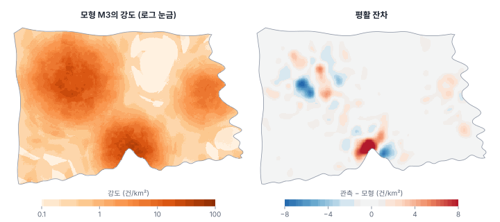
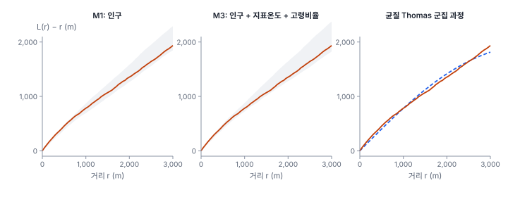

[목차](../README.md) · 이전: [18강 점 사이의 상호작용](18-interaction.md) · 다음: [20강 연속 표면과 확률장](20-continuous-surfaces.md)

# 19강 점 과정 모형

> 앱 지원: ○ 공변량 자료(격자 인구, 지표온도)는 앱에서 볼 수 있고, 모형 적합은 코드로 함 · 읽는 시간 약 45분

## 이 강에서 얻는 것

- 공변량으로 강도를 설명하는 불균질 포아송 모형을 세우고, 계수를 해석할 수 있음
- 우도와 AIC로 강도 모형을 비교하고, 잔차와 모의 포락선으로 진단할 수 있음
- 군집 과정(Thomas, Neyman–Scott), 억제 과정(Strauss), 로그 가우시안 콕스 과정이 어떤 현상을 그리는지 앎
- 서로 다른 모형이 같은 K 함수를 만들 수 있다는 점과, 모형을 고를 때 무엇을 봐야 하는지 앎

## 들어가는 질문

18강은 불편한 결론으로 끝났음. 출동의 몰림은 강도를 어떻게 두느냐에 따라 "강한 군집"이 되기도 하고 "상호작용 없음"이 되기도 했음. 강도를 같은 자료의 커널 밀도로 두면 몰림이 강도에 흡수되어 버렸음.

해결의 실마리는 강도를 **자료 밖의 정보**로 설명하는 것임. 인구, 지표온도, 고령 인구 비율은 출동 위치와 별개로 잰 변수임. 이 변수들로 강도를 설명하는 모형을 세우면, 모형이 설명한 몰림은 1차 성질이고 설명하지 못하고 남은 몰림이 상호작용의 후보가 됨. 이 강은 그런 **점 과정 모형**을 적합하고, 모형끼리 비교하고, 진단하는 방법을 다룸.

## 1. 공변량 강도 모형

불균질 포아송 과정에서 강도를 공변량의 로그선형 함수로 둠.

$$
\log \lambda(x) = \beta_0 + \beta_1 z_1(x) + \beta_2 z_2(x) + \cdots
$$

z_k(x)는 위치 x의 공변량 값임. 8강의 회귀와 모양이 같지만, 반응변수가 "점이 어디에 있는가"라는 점이 다름. 버먼과 터너(Berman & Turner 1992)는 창을 작은 칸으로 나누고 칸마다 점의 수를 반응변수로 한 포아송 GLM으로 이 모형의 우도를 근사하는 방법을 보였음(가상의 점과 가중치를 쓰는 구적법). 칸마다 점의 수를 반응변수로 한 포아송 회귀(칸 면적을 오프셋으로)는 그 가장 단순한 형태이고, 칸이 충분히 작으면 사실상 같음.

한빛시에서는 100 m 셀 45,396개(453.96 km²)를 칸으로 썼음(셀 중심이 바다에 떨어져 출동 2건이 빠짐). 공변량은 다음 세 가지임.

- **log(셀 인구 + 1)**: 100 m 격자 인구(3강). 인구가 0인 셀이 있어 1을 더함. 계수가 1이면 출동이 인구에 정비례함
- **지표온도 − 32℃**: 50 m 지표온도를 100 m 셀로 평균. 계수는 1℃ 높을 때 로그 강도의 증가
- **고령비율(%)**: 고령인구와 인구를 각각 300 m 가우시안으로 평활해 나눈 값. 셀 하나의 고령비율은 인구가 적으면 크게 흔들리므로 평활함(14강)

| 모형 | 넣은 공변량 | log(인구+1) | 지표온도 (1℃당) | 고령비율 (1%p당) | 로그우도 | AIC |
|---|---|---|---|---|---|---|
| M0 | 없음 (CSR) | | | | −6,352.6 | 12,707.3 |
| M1 | 인구 | 1.174 (0.028) | | | −5,104.3 | 10,212.5 |
| M2 | 인구, 지표온도 | 0.905 (0.049) | 0.156 (0.023) | | −5,082.2 | 10,170.5 |
| M3 | 인구, 지표온도, 고령비율 | 0.922 (0.050) | 0.164 (0.024) | 0.0101 (0.0039) | −5,078.9 | 10,165.7 |

괄호 안은 표준오차임. AIC는 M0에서 M1으로 2,495, M2로 42, M3로 다시 4.8 줄어, 세 공변량이 모두 강도를 설명하는 데 보탬이 됨.

### 계수 읽기

M3의 계수를 exp로 바꾸면 배수가 됨.

- **인구**: log(인구+1)의 계수 0.922는 인구가 두 배일 때 강도가 2^0.922 = 1.89배라는 뜻임. 1보다 조금 작지만 95% 구간(약 0.82~1.02)이 1을 포함하므로, 출동이 인구에 정비례한다는 것과 모순되지 않음. M1에서는 이 계수가 1.174였는데, 지표온도를 넣자 0.905로 줄었음. 인구가 많은 곳이 더운 곳이라, M1에서는 더위의 효과 일부를 인구가 대신 떠안고 있었던 것임(8강의 누락 변수)
- **지표온도**: exp(0.164) = 1.178이므로, 인구와 고령비율이 같다면 지표온도가 1℃ 높을 때 출동 강도가 17.8% 높음. 17강의 지표온도 구간별 표에서 인구 1만 명당 출동이 2.4배 차이 났던 것을 이제 인구·고령비율을 함께 고려해 하나의 수로 요약한 셈임
- **고령비율**: 1%p 높을 때 1.0% 높음(10%p면 exp(10 × 0.01015) = 1.107배). 표준오차를 생각하면 효과가 있다는 증거는 있지만 크기는 불확실함

### 손으로 해 보기

인구 100명, 지표온도 34℃, 고령비율 20%인 100 m 셀의 강도는 다음과 같음.

$$
\lambda = \exp(-2.2431 + 0.9219 \times \ln 101 + 0.1640 \times 2 + 0.01015 \times 20) = 12.71\ \text{건/km}^2
$$

셀 면적이 0.01 km²이므로 이 셀의 기대 출동은 0.127건임. 인구가 200명이면 (201/101)^0.922 = 1.886배인 23.97건/km²가 되고, 지표온도가 1℃ 더 높으면 1.178배가 됨.

## 2. 모형 진단

### 잔차

모형이 맞다면 관측 출동과 모형 강도의 차이에 공간 패턴이 없어야 함. 출동 위치와 모형 강도를 같은 500 m 가우시안으로 평활해 뺀 **평활 잔차**(smoothed residual)를 지도로 봄(Baddeley et al. 2005).



양의 잔차가 가장 큰 곳은 마루16동 부근(13.9건/km²)이고, 가람19동(5.6), 마루19동(5.1), 누리26동(4.7) 부근에 작은 봉우리가 있음. 마루구 원도심은 15강의 스캔 통계가 찾은 군집과 같은 곳임. 인구, 더위, 고령 인구로 설명되지 않는 무엇(이 강의 공변량에 없는 요인)이 그곳에 있다는 뜻임. 그 요인이 측정되지 않은 1차 요인(예: 야외 노동자가 많은 시장)인지, 출동끼리의 상호작용인지는 이 자료로 가릴 수 없음.

1 km 블록 287개에서 관측과 기대의 차이를 모은 피어슨 카이제곱은 326.3으로 블록 수의 1.14배임. 포아송이라면 1 근처여야 하므로, 모형이 설명하지 못한 변동이 조금 남음(과산포).

### 모형에서 모의한 포락선

18강의 포락선을 모형으로 확장함. 적합한 강도에서 불균질 포아송 점을 99번 모의해(점 수는 관측과 같게 고정) 보통의 L 함수를 계산하고, 관측이 그 띠 안에 드는지 봄. 모형이 출동의 몰림을 충분히 설명한다면 띠 안에 들어야 함.



| 거리 r | 관측 L(r) − r | M1 모의 99번 | M3 모의 99번 |
|---|---|---|---|
| 100 m | 108 m | 72~108 m | 77~112 m |
| 250 m | 250 m | 199~245 m | 198~270 m |
| 1 km | 783 m | 692~871 m | 721~880 m |
| 2 km | 1,354 m | 1,267~1,584 m | 1,281~1,643 m |

M3는 r 0~3 km의 모든 거리에서 띠 안에 있고, 전역 검정(최대 절대 편차)은 p = 0.19임. M1도 100 m와 250 m에서만 띠를 살짝 벗어났을 뿐 전역 검정은 p = 0.16임. 18강에서 인구에 **정비례**하게 뿌린 모의는 관측보다 덜 몰렸지만, M1은 인구 계수를 1.174로 추정해 인구가 많은 곳에 더 몰리게 하므로 띠가 관측을 감쌈.

K 함수로는 M1과 M3를 거의 구별할 수 없음. 둘 다 몰림을 "설명"함. 그러나 AIC는 M3를 분명히 선호함(10,165.7 대 10,212.5). K 함수는 점끼리의 거리만 요약하므로, 강도가 **어떤 이유로** 높은지를 가리는 힘이 약함. 모형을 고르는 데는 우도에 기반한 비교가 더 강함.

## 3. 군집 과정, 억제 과정, 콕스 과정

포아송 모형은 점끼리 독립이라고 가정함. 점끼리의 상호작용을 모형에 넣는 대표적인 방법은 세 가지임.

- **군집 과정**(cluster process): 보이지 않는 **부모** 점이 포아송 과정으로 흩어지고, 부모마다 **자식** 점을 몇 개씩 낳아 주변에 뿌림. 관측되는 것은 자식뿐임. 자식이 부모 주변에 정규분포로 퍼지면 **Thomas 과정**, 균등하게 원 안에 퍼지면 **Matérn 군집 과정**이고, 이를 통틀어 **Neyman–Scott 과정**이라 함(Neyman & Scott 1958). 감염의 전파, 씨앗의 확산처럼 "한 점이 근처에 점을 낳는" 현상을 그림
- **억제 과정**(inhibition process): 점끼리 일정 거리 안에 들어오기 어려움. **Strauss 과정**(Strauss 1975)은 거리 r 안의 쌍마다 확률에 벌점 γ(0~1)를 곱함. γ = 0이면 r 안에 쌍이 하나도 없는 **하드코어** 과정임(원래 군집 모형으로 제안되었으나 γ ≤ 1에서만 성립함, Kelly & Ripley 1976). 나무, 상점, 둥지처럼 서로 자리를 다투는 현상을 그림. 16강 연습의 기상 관측소 배치도 겉보기에는 이런 모습이지만, 사람이 정한 배치임
- **로그 가우시안 콕스 과정**(log-Gaussian Cox process, LGCP): 강도 자체가 매끈한 확률장, log λ(x) = Xβ + S(x)라고 봄(Møller, Syversveen & Waagepetersen 1998). S(x)는 측정되지 않은 공간적 요인을 나타내는 가우시안 확률장(5부의 대상)임. 공변량으로 설명하지 못하고 공간적으로 이어진 위험을 모형에 넣는 방법이며, 질병 지도에서 많이 씀. 추정은 MCMC나 INLA 같은 베이지안 방법(36강)을 씀

### Thomas 과정 적합: 같은 K, 다른 이야기

Thomas 과정의 K 함수는 식으로 알려져 있음.

$$
K(r) = \pi r^2 + \frac{1}{\kappa}\left(1 - \exp\!\left(-\frac{r^2}{4\sigma^2}\right)\right)
$$

κ는 부모의 강도, σ는 자식이 부모에서 퍼지는 거리임. 관측 K와 이 식의 차이(K^(1/4)의 차이 제곱합)를 최소로 하는 κ, σ를 고르는 **최소 대비**(minimum contrast) 방법으로 적합할 수 있음(Diggle 2013). 강도가 일정하다고 보고 r 0~3 km에서 적합하면 다음과 같음.

- κ = 0.0121개/km², 곧 시 전체에 부모 5.5개
- σ = 1,704 m
- 부모마다 자식 1,408/5.5 = 256개

적합한 L(r) − r은 500 m에서 400 m, 1 km에서 780 m, 2 km에서 1,414 m로 관측(453, 783, 1,354 m)과 거의 겹침(위 그림 오른쪽). "도시에 보이지 않는 중심이 대여섯 개 있고, 출동은 각 중심에서 표준편차 1.7 km로 퍼진다"는 이야기도 K 함수를 똑같이 잘 설명하는 것임. 그 "중심"이 사실은 인구가 몰린 도심과 더운 지역일 수 있는데도, K 함수만으로는 두 이야기를 가를 수 없음.

이것이 16강부터 따라온 바틀릿의 문제를 모형의 언어로 다시 말한 것임. 불균질 포아송(1차 성질만)과 균질 군집 과정(2차 성질만)은 같은 K 함수를 낼 수 있음. 어느 쪽을 믿을지는 자료의 K 함수가 아니라 다음에 달림.

- **공변량의 설명력**: 측정한 인구·더위가 강도를 잘 설명하는가(AIC, 잔차)
- **과학적 타당성**: 폭염 출동이 서로를 "낳는" 기제가 있는가. 감염병과 달리 상식적으로 어려움
- **예측력**: 새 자료를 더 잘 예측하는가

## 4. 예측으로 확인하기

6~7월 출동(922건)으로 모형을 적합하고, 8월 출동(484건)의 행정동별 건수를 예측했음. 예측은 모형 강도를 동마다 적분하고 8월 전체 건수에 맞춰 비율을 조정한 것임.

| 모형 | 8월 예측 로그우도 | 예측과 관측의 상관 | 평균 절대 오차 |
|---|---|---|---|
| M0 (CSR) | −753.4 | −0.628 | 3.92건 |
| M1 (인구) | −286.9 | 0.713 | 1.60건 |
| M3 (인구·지표온도·고령비율) | −280.0 | 0.748 | 1.55건 |

M3가 새 자료를 가장 잘 예측함. CSR(M0)은 동의 면적에 비례해 예측하므로, 면적이 넓은 외곽 동일수록 출동이 적은 실제와 반대가 되어 상관이 음수임. 공변량 모형은 새 기간의 출동이 어디에 일어날지를 설명해 냄. 같은 일을 균질 Thomas 과정은 할 수 없음. 균질 Thomas 과정의 강도는 어디서나 같아서, 부모 위치를 따로 추정하지 않는 한 예측은 CSR(M0)과 같기 때문임.

## 해 보기

### 코드로: 100 m 셀 포아송 회귀로 강도 모형 적합하기

```python
import warnings

import geopandas as gpd
import numpy as np
import rasterio
import shapely
from rasterio.transform import xy
from scipy import ndimage
from sklearn.linear_model import PoissonRegressor

dong = gpd.read_file("book/data/hanbit_dong.gpkg")
ev = gpd.read_file("book/data/hanbit_events.gpkg")
win = dong.union_all()
with rasterio.open("book/data/hanbit_pop100.tif") as r:
    pop, eld, tr = r.read(1).astype(float), r.read(2).astype(float), r.transform
pop[pop < 0], eld[eld < 0] = 0, 0
with rasterio.open("book/data/hanbit_lst.tif") as r:
    lst = r.read(1).astype(float)
lst[lst <= -9000] = np.nan
warnings.simplefilter("ignore", RuntimeWarning)                    # 바다만 있는 셀의 평균은 빈 값
lst100 = np.nanmean(lst.reshape(240, 2, 320, 2), axis=(1, 3))     # 50 m → 100 m 셀 평균

rows, cols = np.mgrid[0:240, 0:320]
cx, cy = (np.array(a) for a in xy(tr, rows.ravel(), cols.ravel()))
use = shapely.contains_xy(win, cx, cy).reshape(240, 320) & ~np.isnan(lst100)   # 시 안의 100 m 셀

cnt = np.zeros((240, 320))                                          # 셀마다 출동 수
np.add.at(cnt, (((tr.f - ev.geometry.y) / 100).astype(int), ((ev.geometry.x - tr.c) / 100).astype(int)), 1)
share = ndimage.gaussian_filter(eld, 3) / np.maximum(ndimage.gaussian_filter(pop, 3), 1e-9) * 100

X = np.column_stack([np.log(pop[use] + 1), lst100[use] - 32, share[use]])
m = PoissonRegressor(alpha=0, max_iter=1000, tol=1e-10).fit(X, cnt[use])
print("계수 (log(인구+1), 지표온도−32, 고령비율%):", np.round(m.coef_, 4))
print("exp(계수):", np.round(np.exp(m.coef_), 3))
print(f"상수(건/km²의 로그): {m.intercept_ - np.log(0.01):.4f}")
```

- 확인: 계수 0.9219, 0.164, 0.0101, exp(계수) 2.514, 1.178, 1.01, 상수 −2.2431(M3와 같음). 셀 면적이 모두 같아 오프셋은 상수에 흡수되므로, 상수에서 log(0.01)을 빼 건/km² 단위로 바꿈
- 더 해 보기: `X`에서 열을 빼 M1, M2를 적합하고, 각 모형의 예측 `m.predict(X)`로 로그우도를 계산해 AIC를 비교함. 표준오차가 필요하면 `statsmodels`의 GLM(포아송)을 씀
- 전문 도구: R의 `spatstat` 패키지는 `ppm()`(포아송·Gibbs 모형), `kppm()`(Thomas·LGCP 등), `envelope()`(포락선)으로 이 강의 모든 분석을 한 번에 할 수 있음

## 헷갈리는 쌍

- **점 과정 모형 vs 집계 자료 회귀**: 점 과정 모형은 점의 위치를 반응으로 보고, 100 m 셀은 우도를 근사하는 계산 장치임. 행정동 건수 회귀(8강)는 집계 단위가 분석 단위임
- **불균질 포아송 vs 콕스 과정**: 불균질 포아송은 강도가 정해진 함수, 콕스 과정은 강도 자체가 확률적임. 공변량으로 설명되지 않는 공간적 위험을 넣으려면 LGCP 같은 콕스 과정을 씀
- **군집 과정 vs 억제 과정**: 군집은 점이 점을 끌어당김(부모와 자식), 억제는 점이 서로 밀어냄(Strauss)
- **모형의 적합 vs 모형의 진실**: 포락선 안에 든다는 것은 "이 모형과 모순되지 않음"이지 "이 모형이 맞음"이 아님. 같은 K를 다른 모형이 설명할 수 있음

## 흔한 실수와 심사 지적

- **K 함수가 Thomas 과정과 잘 맞는다고 "전파 반경 1.7 km"를 보고함**
  - 지적: "공변량으로 설명되는 강도 차이와 어떻게 구별했습니까?"
  - 대응: 공변량 모형을 먼저 적합하고, 남은 몰림에 대해서만 군집 과정을 고려함. 기제의 타당성을 함께 따짐
- **포락선 검정만으로 모형을 고름**
  - 대응: 우도·AIC, 잔차 지도, 새 자료에 대한 예측을 함께 봄
- **셀 크기를 너무 크게 잡아 공변량을 뭉갬**
  - 대응: 점 사이 거리나 공변량의 변화 규모보다 작은 셀을 쓰고, 셀 크기를 바꿔도 계수가 같은지 확인함
- **공변량 계수를 인과 효과로 해석함**
  - 대응: 관측 자료의 계수는 다른 공변량을 고려한 연관임(8강). "지표온도가 1℃ 높으면 출동이 17.8% 늘어난다"가 아니라 "높은 곳의 출동 강도가 17.8% 높다"로 씀
- **과산포를 무시함**
  - 대응: 블록별 피어슨 카이제곱이나 잔차 지도로 확인하고, 크면 콕스 과정이나 표준오차 보정을 고려함

## 보고서에는 이렇게 씀

> 출동 위치를 불균질 포아송 과정으로 보고, 강도를 100 m 격자 인구(로그), 지표온도, 평활 고령비율의 로그선형 함수로 모형화하였다. 모형은 100 m 셀 45,396개의 출동 수를 반응변수로 한 포아송 회귀(Berman–Turner 근사)로 적합하였다. 다른 공변량을 고려할 때 지표온도가 1℃ 높은 곳의 출동 강도는 17.8% 높았고(계수 0.164, 표준오차 0.024), 고령비율이 10%p 높은 곳은 10.7% 높았다(계수 0.0101, 표준오차 0.0039). 공변량 모형에서 생성한 모의 99회의 L 함수 포락선 안에 관측 L 함수가 들어 있어(전역 검정 p = 0.19) 출동의 군집은 공변량에 따른 강도 변화로 설명될 수 있었다. 다만 마루구 원도심에서는 모형보다 출동이 많은 잔차가 남았다. 6~7월 자료로 적합한 모형은 8월의 행정동별 출동을 인구만의 모형보다 잘 예측하였다(예측 로그우도 −280.0 대 −286.9).

적어야 할 항목은 다음과 같음.

- 모형의 형태(불균질 포아송, 군집 과정 등)와 공변량, 공변량의 해상도와 처리
- 적합 방법(셀 크기, 최소 대비 등)과 계수·표준오차
- 모형 비교 기준(AIC, 예측)과 진단(잔차, 포락선)
- 상호작용과 강도 변화를 구별하는 데 따르는 한계

## 요약

- 공변량 강도 모형은 log λ(x)를 공변량의 선형 함수로 두며, 작은 셀의 포아송 회귀로 적합할 수 있음
- 한빛시 출동 강도는 인구(계수 0.92), 지표온도(1℃당 17.8%), 고령비율(10%p당 10.7%)로 설명되었고, AIC는 세 공변량을 모두 넣은 M3를 골랐음
- 모형에서 모의한 포락선은 모형이 몰림을 설명하는지 진단하지만, K 함수로는 M1과 M3를 거의 구별하지 못했음
- 균질 Thomas 군집 과정(부모 5.5개, σ 1.7 km)도 같은 K 함수를 설명했음. 1차 성질과 2차 성질은 K로 가를 수 없고, 공변량의 설명력, 기제의 타당성, 예측력으로 판단함
- 6~7월로 적합한 공변량 모형은 8월 출동을 가장 잘 예측했음. 마루구 원도심에는 모형이 설명하지 못한 잔차가 남았음

## 핵심 용어

| 한글 | 영문 | 비고 |
|---|---|---|
| 불균질 포아송 모형 | Inhomogeneous Poisson Model | 로그선형 강도 |
| 버먼–터너 근사 | Berman–Turner Approximation | 셀 포아송 회귀 |
| 평활 잔차 | Smoothed Residual | Baddeley et al. 2005 |
| 군집 과정 | Cluster Process | Neyman–Scott |
| Thomas 과정 | Thomas Process | 자식이 정규분포로 퍼짐 |
| 억제 과정 | Inhibition Process | |
| Strauss 과정 | Strauss Process | 하드코어는 γ = 0 |
| 콕스 과정 | Cox Process | 강도가 확률적 |
| 로그 가우시안 콕스 과정 | Log-Gaussian Cox Process (LGCP) | |
| 최소 대비 | Minimum Contrast | |

## 원전과 더 읽을거리

**원전**

- Berman, M., & Turner, T. R. (1992). Approximating point process likelihoods with GLIM. *Journal of the Royal Statistical Society: Series C (Applied Statistics)*, 41(1), 31–38. 셀 포아송 회귀 근사
- Neyman, J., & Scott, E. L. (1958). Statistical approach to problems of cosmology. *Journal of the Royal Statistical Society: Series B*, 20(1), 1–43. 군집 과정
- Strauss, D. J. (1975). A model for clustering. *Biometrika*, 62(2), 467–475. Strauss 과정
- Kelly, F. P., & Ripley, B. D. (1976). A note on Strauss's model for clustering. *Biometrika*, 63(2), 357–360. γ ≤ 1 조건
- Møller, J., Syversveen, A. R., & Waagepetersen, R. P. (1998). Log Gaussian Cox processes. *Scandinavian Journal of Statistics*, 25(3), 451–482.
- Baddeley, A., Turner, R., Møller, J., & Hazelton, M. (2005). Residual analysis for spatial point processes. *Journal of the Royal Statistical Society: Series B*, 67(5), 617–666.

**더 읽을거리**

- Baddeley, A., Rubak, E., & Turner, R. (2015). *Spatial Point Patterns: Methodology and Applications with R*. CRC Press. 9장(포아송 모형), 10장(포락선), 11장(진단), 12~13장(군집·Gibbs 모형)
- Diggle, P. J. (2013). *Statistical Analysis of Spatial and Spatio-Temporal Point Patterns* (3rd ed.). CRC Press. 공변량 모형과 군집 과정의 적합
- Møller, J., & Waagepetersen, R. P. (2003). *Statistical Inference and Simulation for Spatial Point Processes*. Chapman & Hall/CRC.

## 연습

1. 손계산의 셀에서 지표온도만 36℃로 바꾸면 강도는 얼마인가? (exp(0.164 × 2) = 1.388)

2. M1에서 log(인구+1)의 계수가 1.174였는데 M2에서 0.905로 줄었음. 왜 줄었는지 8강의 말로 설명하시오.

3. 어떤 연구자가 감염병 환자 위치에 Thomas 과정을 적합해 σ = 300 m를 얻고 "전파 반경 300 m"라고 보고했음. 무엇을 더 확인해야 하는가?

4. 모형 M3의 포락선 안에 관측 L 함수가 들어갔음. 이 결과로 "출동 사이에 상호작용이 없다"고 결론 내릴 수 있는가?

5. CSR 모형(M0)의 8월 예측이 실제와 음의 상관을 보인 이유는?

<details>
<summary>해답</summary>

1. 지표온도가 34℃에서 36℃로 2℃ 높아지면 1.178² = 1.388배이므로 12.71 × 1.388 = 17.64건/km². 셀의 기대 출동은 0.176건임.

2. 인구가 많은 셀은 더운 도심에 있어 두 변수가 상관함. M1에는 지표온도가 빠져 있어, 더운 곳에 출동이 많은 효과 일부가 인구의 계수에 섞여 들어갔음(누락 변수 편의). 지표온도를 넣자 인구 계수는 "같은 지표온도에서 인구의 효과"가 되어 작아졌음.

3. (가) 환자가 사는 인구의 분포와 위험 요인(나이, 기저질환, 소득 등)으로 강도를 먼저 설명한 뒤에도 몰림이 남는지(불균질 K, 공변량 모형의 포락선). (나) 같은 K를 불균질 포아송으로도 설명할 수 있는지. (다) 전파 경로나 시간 순서(먼저 생긴 환자 주변에 나중 환자가 생기는가) 같은 기제의 증거. 시간 정보가 있으면 시공간 K 함수 같은 시공간 점 패턴 방법(9부)을 씀.

4. 내릴 수 없음. 포락선 안에 든다는 것은 "상호작용이 없는 모형과 모순되지 않음"일 뿐이고, 같은 K를 상호작용이 있는 모형도 낼 수 있음. 또 마루구 원도심에는 공변량으로 설명되지 않는 잔차가 남았음. "공변량에 따른 강도 변화로 설명될 수 있으며, 상호작용의 증거는 없음"으로 씀.

5. CSR은 출동이 면적에 비례한다고 예측하므로, 면적이 넓은 동일수록 많은 출동을 예측함. 한빛시에서는 도심의 작은 동에 사람이 많아 출동도 많고, 외곽의 넓은 동은 사람이 적어 출동이 적음. 그래서 예측과 실제가 반대 방향으로 움직임.

</details>

---

[목차](../README.md) · 이전: [18강 점 사이의 상호작용](18-interaction.md) · 다음: [20강 연속 표면과 확률장](20-continuous-surfaces.md)
