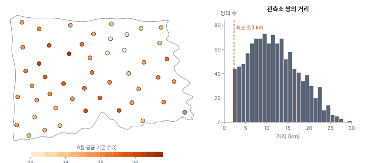
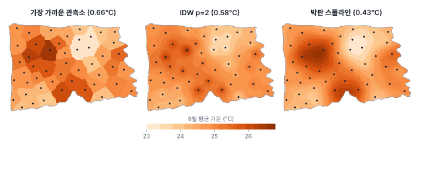
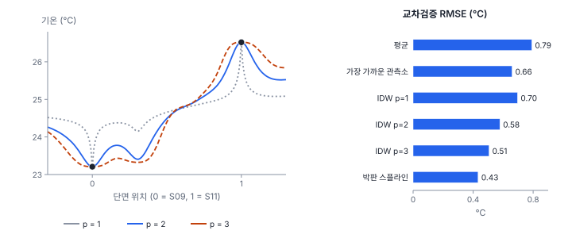

[목차](../README.md) · 이전: [19강 점 과정 모형](19-point-process-models.md) · 다음: [21강 베리오그램](21-variogram.md)

# 20강 연속 표면과 확률장

> 앱 지원: ○ 관측소 자료를 지도로 보는 것은 앱에서, 보간과 교차검증은 코드로 함 · 읽는 시간 약 35분

## 이 강에서 얻는 것

- 연속 표면 자료를 확률장의 한 번의 실현으로 보는 관점과, 정상성·등방성의 뜻을 앎
- 관측의 지원(점, 셀, 구역)이 무엇이고 왜 중요한지 앎
- 티센 다각형, 역거리 가중(IDW), 스플라인으로 보간하고 교차검증으로 비교할 수 있음
- 결정론적 보간이 주지 못하는 것, 곧 예측의 불확실성이 왜 필요한지 설명할 수 있음

## 들어가는 질문

한빛시에는 기상 관측소가 48곳 있음. 시청은 폭염 대책을 세우려고 "동마다의 8월 평균 기온"을 원함. 관측소가 없는 동이 대부분이라 관측소 사이의 기온을 채워 넣어야 함. 1강 연습에서 "가장 가까운 관측소의 값을 쓰는 것"의 문제를 봤음. 더 나은 방법은 무엇이고, 채워 넣은 값은 얼마나 믿을 만한가?

4부의 출동은 위치 자체가 관심이었음. 5부의 기온은 다름. 기온은 도시의 모든 지점에 존재하고, 관측소는 사람이 고른 몇 곳에서 그 값을 잼. 이런 자료를 다루는 분야가 **지구통계**(geostatistics)임. 남아프리카 광산에서 금 함량을 추정하던 크리게(Krige 1951)와, 그 방법을 이론으로 정리한 마테롱(Matheron 1963)에서 시작했음.

## 1. 연속 표면과 확률장

기온처럼 공간의 모든 지점 s에서 값이 정의되는 현상을 **장**(field)이라 함(1강). 지구통계는 관측된 기온 지도를 **확률장**(random field) Z(s)의 한 번의 실현으로 봄. 같은 도시, 같은 여름이 수없이 반복될 수 있다면 그때마다 조금씩 다른 기온 지도가 나왔을 것이고, 우리가 가진 것은 그 가운데 하나라는 생각임.

문제는 실현이 하나뿐이라는 것임. 지점 s의 평균이나 두 지점 사이의 상관을 추정하려면 반복이 필요한데, 시간을 되돌릴 수는 없음. 대신 **공간에서 반복**을 얻으려고 다음 가정을 둠.

- **2차 정상성**(second-order stationarity): 평균이 어디서나 같고(E[Z(s)] = μ), 두 지점의 공분산이 위치가 아니라 두 지점 사이의 벡터 h에만 달림(Cov[Z(s), Z(s + h)] = C(h)). 그러면 같은 거리만큼 떨어진 여러 쌍을 "같은 관계의 반복"으로 모아 쓸 수 있음
- **내재 정상성**(intrinsic stationarity): 더 약한 가정으로, 두 지점의 **차이**의 평균이 0이고(E[Z(s + h) − Z(s)] = 0) 그 분산만 h에 달린다고 봄(Var[Z(s + h) − Z(s)] = 2γ(h)). Z(s) 자체의 분산은 유한하지 않아도 되므로(멀어질수록 끝없이 벌어지는 표면도 허용) 2차 정상성보다 약함. 21강의 베리오그램 γ(h)가 여기서 나옴
- **등방성**(isotropy): 관계가 방향과 관계없이 거리 |h|에만 달림. 바닷바람이 한 방향으로 부는 해안 도시라면 동서와 남북의 관계가 다를 수 있음(**이방성**, anisotropy, 21강)

이 가정들은 3부의 공간 자기상관(이웃끼리 닮음)을 연속 공간에서 추정할 수 있게 해 주는 조건임. 가정이 크게 어긋나면 결과를 믿기 어려움. 도심이 외곽보다 2℃ 더운 도시라면 평균이 어디서나 같다는 가정은 깨지므로, 22강에서처럼 추세를 먼저 모형에 넣음.

## 2. 지원

관측값이 대표하는 공간의 크기와 모양을 **지원**(support)이라 함(1강).

- 관측소 기온은 지상 1.5 m의 한 **점**의 값임
- 지표온도는 50 m × 50 m **셀**의 평균임
- 시청이 원하는 것은 행정동이라는 **구역**의 평균 기온임

같은 현상이라도 지원이 다르면 값의 분포가 다름. 넓은 구역의 평균은 점 값보다 덜 흩어지고, 구역 평균의 최댓값은 점 값의 최댓값보다 낮음. 3강의 MAUP가 연속 표면에서 나타나는 형태임. 관측소의 점 값을 보간해 만든 지도를 그대로 동별 평균으로 읽으면 지원을 섞은 것임. 점에서 구역으로 지원을 바꾸는 **블록 크리깅**은 22강에서 다룸.

## 3. 한빛시 관측소



관측소 48곳의 8월 평균 기온은 평균 24.77℃, 표준편차 0.78℃이고, 가장 낮은 S09(23.21℃)와 가장 높은 S11(26.52℃)은 3.3℃ 차이남. 관측소는 서로 2.3 km 이상 떨어지게 고르게 배치되어 있어(16강 연습의 규칙 패턴), 관측소 하나가 평균 9.46 km²를 맡음. 가장 가까운 관측소끼리의 거리는 2,302~3,697 m(평균 2,661 m)임. 2.3 km보다 짧은 거리에서 기온이 어떻게 변하는지는 이 자료로 알 수 없다는 뜻이고, 21강에서 중요해짐.

## 4. 결정론적 보간

관측이 없는 지점 s₀의 값을 관측소들의 가중 평균으로 예측하는 방법들이 있음. 가중치를 정하는 규칙이 미리 정해져 있고 확률 모형이 없어 **결정론적 보간**(deterministic interpolation)이라 함.

$$
\hat{Z}(s_0) = \sum_{i=1}^{n} w_i\, Z(s_i), \qquad \sum_i w_i = 1
$$

- **티센 다각형**(Thiessen polygon, 보로노이 다각형): 가장 가까운 관측소의 값을 그대로 씀. 가장 가까운 관측소의 가중치만 1임. 관측소마다 다각형 하나가 생기고 다각형 경계에서 값이 계단처럼 끊김. 강수량 관측소의 면적 평균(Thiessen 1911)에서 시작했음
- **역거리 가중**(inverse distance weighting, IDW): 가중치를 거리의 p제곱에 반비례하게 줌, w_i ∝ 1/d_i^p. p가 크면 가까운 관측소에 무게가 몰려 티센 다각형에 가까워지고, 작으면 멀리 있는 관측소까지 고르게 섞음(Shepard 1968)
- **스플라인**(spline): 관측점을 지나면서 전체적으로 가장 덜 구부러진 곡면을 고름. **박판 스플라인**(thin plate spline)은 얇은 금속판을 관측점에 고정했을 때의 모양에 해당함

### 손으로 해 보기: IDW

예측 지점에서 1, 2, 3, 4 km 떨어진 네 관측소의 기온이 25.0, 24.0, 26.0, 24.5℃임.

| p | 가중치 (1 km, 2 km, 3 km, 4 km) | 예측 |
|---|---|---|
| 1 | 0.480, 0.240, 0.160, 0.120 | 24.860℃ |
| 2 | 0.702, 0.176, 0.078, 0.044 | 24.880℃ |
| 3 | 0.849, 0.106, 0.031, 0.013 | 24.919℃ |

p = 2의 가중치는 1/1² = 1, 1/2² = 0.25, 1/3² = 0.111, 1/4² = 0.0625를 합(1.424)으로 나눈 것임. p가 커질수록 가장 가까운 관측소(25.0℃)에 무게가 몰림. 가장 가까운 관측소만 쓰면 25.0℃, 네 관측소의 단순 평균은 24.875℃임.

### 한빛시 관측소로 보간하기



세 지도는 모두 북서쪽 신도심(가람구)과 남쪽 원도심(마루구)이 덥고 도시 가운데 북쪽(산림)이 시원한 큰 모습은 같음. 그러나 세부는 꽤 다름. 티센 다각형은 관측소 경계에서 값이 끊기고, IDW는 관측소마다 동심원 모양의 무늬(**황소 눈**, bull's eye)가 생김. IDW는 관측소에서 멀어지면 모든 관측소의 평균 쪽으로 끌려가기 때문임. 박판 스플라인은 관측값의 범위(23.21~26.52℃)를 조금 넘는 값(23.04~26.66℃)도 만들어 냄. 곡면이 관측점 사이에서 휘어지기 때문임. IDW는 가중 평균이라 관측 범위를 넘지 못함.

## 5. 교차검증으로 비교하기

어느 보간이 나은지는 **교차검증**(cross-validation)으로 판단함. 관측소 하나를 빼고 나머지 47곳으로 그 자리를 예측해 실제와 비교하는 일을 48번 되풀이함(leave-one-out). 오차의 제곱 평균의 제곱근(RMSE)과 절댓값 평균(MAE)을 봄.



| 방법 | RMSE | MAE | 가장 큰 절대 오차 |
|---|---|---|---|
| 나머지 관측소의 평균 | 0.791℃ | 0.623℃ | 1.788℃ |
| 가장 가까운 관측소 | 0.659℃ | 0.549℃ | 1.410℃ |
| IDW p = 1 | 0.695℃ | 0.548℃ | 1.660℃ |
| IDW p = 2 | 0.578℃ | 0.453℃ | 1.494℃ |
| IDW p = 3 | 0.506℃ | 0.403℃ | 1.340℃ |
| 박판 스플라인 | 0.433℃ | 0.346℃ | 1.255℃ |

한빛시 기온에서는 박판 스플라인이 가장 낫고, IDW는 p가 클수록 나았음. 기온이 매끄럽게 변하는 표면이라, 멀리 있는 관측소까지 섞는 p = 1은 지나치게 평평해짐. 그러나 가장 나은 방법도 절대 오차가 평균 0.35℃이고, 큰 곳은 1.3℃에 이름. 교차검증은 "평균적으로 얼마나 틀리는가"를 알려 주지만, "이 지점의 예측은 얼마나 틀릴 수 있는가"는 알려 주지 않음.

## 6. 결정론적 보간의 한계

- **불확실성이 없음**: 관측소 바로 옆의 예측과 관측소들 사이 한가운데(3 km 남짓 떨어진 곳)의 예측이 같은 지도 위에 같은 확신으로 그려짐. 실제로는 관측소에서 멀수록 훨씬 불확실함
- **가중치가 자료와 무관함**: IDW의 p, 스플라인의 매끄러움은 자료에서 배운 것이 아니라 사람이 고른 것임. 교차검증으로 고를 수는 있지만, 왜 그 값인지 설명하지 못함
- **관측소의 배치를 고려하지 않음**: 관측소 세 곳이 한쪽에 몰려 있으면 IDW는 그 세 곳에 큰 무게를 주어 같은 정보를 세 번 셈. 몰린 관측소끼리는 정보가 겹친다는 사실(**자료 중복**, redundancy)을 반영하지 못함
- **측정 오차를 다루지 못함**: 대부분 관측값을 정확히 지나가도록(정확 보간) 만들어져, 관측소의 측정 오차까지 지도에 새겨 넣음

크리깅(22강)은 이 문제들을 공간 구조 모형으로 다룸. 가중치를 자료에서 추정한 공간 구조(베리오그램, 21강)로 정하고, 관측소끼리의 중복을 고려하며, 지점마다 예측의 분산(불확실성)을 함께 줌. 이를 위해 먼저 "거리에 따라 기온이 얼마나 달라지는가"를 재야 함.

## 해 보기

### 앱으로: 관측소 자료 보기

1. `hanbit_stations.gpkg`와 `hanbit_lst.tif`를 엶
2. `hanbit_stations` 레이어를 고르고 주제도에서 `기온_8월평균`을 분위수 5계급으로 칠함. 지표온도 래스터 위에 관측소 점을 겹쳐 보며, 기온이 높은 관측소가 지표온도가 높은 곳에 있는지 봄
3. **차트**의 **+ 히스토그램** 단추로 `기온_8월평균`의 분포를 봄
   - 확인: 48곳, 23.21~26.52℃

보간과 교차검증은 앱에 없어 코드로 함.

### 코드로: IDW와 박판 스플라인의 교차검증

```python
import geopandas as gpd
import numpy as np
from scipy.interpolate import RBFInterpolator
from scipy.spatial.distance import cdist

st = gpd.read_file("book/data/hanbit_stations.gpkg")
X = np.c_[st.geometry.x, st.geometry.y] / 1000            # km 단위
z = st["기온_8월평균"].to_numpy()


def idw(Xt, zt, X0, p=2):
    w = 1 / cdist(X0, Xt) ** p
    return (w * zt).sum(1) / w.sum(1)


def tps(Xt, zt, X0):
    return RBFInterpolator(Xt, zt, kernel="thin_plate_spline")(X0)


def loocv(method, **kw):
    err = [method(np.delete(X, i, 0), np.delete(z, i), X[i:i + 1], **kw)[0] - z[i] for i in range(len(z))]
    return np.sqrt(np.mean(np.square(err)))


print(f"나머지의 평균으로 예측: RMSE {loocv(lambda Xt, zt, X0: np.full(len(X0), zt.mean())):.3f}℃")
for p in (1, 2, 3):
    print(f"IDW p = {p}: RMSE {loocv(idw, p=p):.3f}℃")
print(f"박판 스플라인: RMSE {loocv(tps):.3f}℃")
```

- 확인: 0.791, 0.695, 0.578, 0.506, 0.433℃
- 더 해 보기: IDW의 p를 4, 6, 10으로 키워 RMSE가 어떻게 되는지, p가 아주 크면 어느 방법에 가까워지는지 봄. `RBFInterpolator`의 `smoothing`을 0이 아닌 값으로 주면 관측값을 정확히 지나가지 않는 평활 스플라인이 됨

## 헷갈리는 쌍

- **점 패턴 vs 연속 표면**: 점 패턴은 점의 위치가 관심이고, 연속 표면은 정해진 점에서 잰 값이 관심임. 출동 위치를 보간하거나 관측소 위치로 K 함수를 구하면 질문을 잘못 고른 것임
- **2차 정상성 vs 내재 정상성**: 2차 정상성은 평균과 공분산이 위치와 무관, 내재 정상성은 차이의 평균이 0이고 차이의 분산만 거리에 따라 정해짐. 내재 정상성이 더 약한 가정임
- **정확 보간 vs 평활**: 정확 보간은 관측점을 그대로 지나고, 평활은 측정 오차를 고려해 관측값에서 조금 벗어날 수 있음
- **점 지원 vs 블록 지원**: 관측소 값은 점, 동 평균은 블록. 같은 현상이라도 블록 평균은 덜 흩어짐

## 흔한 실수와 심사 지적

- **보간 지도를 관측 자료처럼 제시함**
  - 지적: "이 지도의 값이 관측입니까, 추정입니까? 얼마나 정확합니까?"
  - 대응: 보간 방법과 교차검증 오차를 적고, 관측소 위치를 지도에 함께 표시함
- **IDW의 p를 기본값(2)으로 두고 이유를 대지 않음**
  - 대응: 교차검증으로 비교한 결과를 적음
- **관측소에서 먼 곳(시 경계, 바다 쪽)의 보간값을 그대로 씀**
  - 대응: 관측소의 범위를 벗어난 곳은 외삽이라 불확실성이 크다는 점을 밝힘
- **점 보간 지도를 행정동 평균으로 바로 읽음**
  - 대응: 동 안의 여러 점을 예측해 평균 내거나 블록 크리깅(22강)을 쓰고, 지원의 차이를 밝힘

## 보고서에는 이렇게 씀

> 기상 관측소 48곳의 2025년 8월 평균 기온(평균 24.77℃, 표준편차 0.78℃)을 보간하여 시 전역의 기온 표면을 추정하였다. 관측소 사이의 최소 거리는 2.3 km였다. 티센 다각형, 역거리 가중(거듭제곱 1~3), 박판 스플라인을 단일 관측소 제외 교차검증으로 비교한 결과, 박판 스플라인의 오차가 가장 작았다(RMSE 0.433℃, MAE 0.346℃). 다만 결정론적 보간은 지점별 예측 불확실성을 제공하지 않으므로, 이후 분석에서는 크리깅을 사용하였다.

적어야 할 항목은 다음과 같음.

- 관측소 수와 배치(최소 거리, 범위), 측정값의 지원과 기간
- 보간 방법과 매개변수(IDW의 p, 스플라인의 평활)
- 교차검증 방법과 오차(RMSE, MAE)
- 외삽 영역과 지원의 차이에 대한 주의

## 요약

- 지구통계는 연속 표면을 확률장의 한 번의 실현으로 보고, 정상성과 등방성을 가정해 공간에서 반복을 얻음
- 지원은 관측값이 대표하는 공간의 크기임. 점, 셀, 구역의 값은 분포가 다르고, 지원을 섞어 읽으면 안 됨
- 티센 다각형, IDW, 스플라인은 가중 평균의 규칙이 미리 정해진 결정론적 보간임. 한빛시 기온에서는 박판 스플라인이 교차검증 RMSE 0.433℃로 가장 나았고, IDW는 p가 클수록 나았음
- 결정론적 보간은 불확실성을 주지 않고, 가중치가 자료의 공간 구조와 관측소 배치를 반영하지 않음. 크리깅은 이를 공간 구조 모형으로 다룸

## 핵심 용어

| 한글 | 영문 | 비고 |
|---|---|---|
| 지구통계 | Geostatistics | Krige 1951, Matheron 1963 |
| 확률장 | Random Field | |
| 2차 정상성 | Second-Order Stationarity | |
| 내재 정상성 | Intrinsic Stationarity | |
| 등방성 / 이방성 | Isotropy / Anisotropy | |
| 지원 | Support | 점, 셀, 블록 |
| 티센 다각형 | Thiessen (Voronoi) Polygon | |
| 역거리 가중 | Inverse Distance Weighting (IDW) | Shepard 1968 |
| 박판 스플라인 | Thin Plate Spline | |
| 교차검증 | Cross-Validation | LOOCV |
| 자료 중복 | Data Redundancy (Declustering) | 크리깅이 고려함 |

## 원전과 더 읽을거리

**원전**

- Krige, D. G. (1951). A statistical approach to some basic mine valuation problems on the Witwatersrand. *Journal of the Chemical, Metallurgical and Mining Society of South Africa*, 52(6), 119–139.
- Matheron, G. (1963). Principles of geostatistics. *Economic Geology*, 58(8), 1246–1266.
- Thiessen, A. H. (1911). Precipitation averages for large areas. *Monthly Weather Review*, 39(7), 1082–1084.
- Shepard, D. (1968). A two-dimensional interpolation function for irregularly-spaced data. *Proceedings of the 1968 23rd ACM National Conference*, 517–524. IDW

**더 읽을거리**

- Webster, R., & Oliver, M. A. (2007). *Geostatistics for Environmental Scientists* (2nd ed.). Wiley. 지구통계 입문서
- Cressie, N. (1993). *Statistics for Spatial Data* (Revised ed.). Wiley. 2~3장
- Li, J., & Heap, A. D. (2011). A review of comparative studies of spatial interpolation methods in environmental sciences. *Ecological Informatics*, 6(3–4), 228–241. 보간 방법 비교 연구 정리

## 연습

1. 손계산의 네 관측소에서 p = 0이면 예측은 무엇이 되는가? p가 아주 크면?

2. 관측소가 한쪽에 셋, 반대쪽에 하나 있고 예측 지점이 그 가운데에 있음. 네 관측소가 모두 2 km 떨어져 있다면 IDW는 어떤 예측을 하는가? 무엇이 문제인가?

3. 박판 스플라인이 관측값의 범위를 넘는 값(26.66℃)을 만들었음. 이것은 오류인가?

4. 교차검증 RMSE가 0.43℃였음. "이 지도의 모든 지점은 ±0.43℃ 안에서 정확하다"고 말할 수 있는가?

5. 행정동 평균 기온을 구하려고 동의 중심점 하나에서 IDW 예측을 해 동의 값으로 썼음. 어떤 문제가 있는가?

<details>
<summary>해답</summary>

1. p = 0이면 모든 가중치가 같아 단순 평균 24.875℃임. p가 아주 크면 가장 가까운 관측소의 가중치만 1에 가까워져 25.0℃(티센 다각형)가 됨. IDW는 p에 따라 단순 평균과 티센 다각형 사이를 오감.

2. 거리가 모두 같으므로 가중치가 모두 0.25이고, 한쪽 세 관측소가 예측의 4분의 3을 차지함. 그런데 서로 가까이 붙은 세 관측소는 거의 같은 정보를 담고 있으므로, 세 곳을 합친 무게가 한 곳의 세 배까지 커져서는 안 됨. IDW는 관측소끼리의 중복을 고려하지 못함. 크리깅은 관측소끼리의 공분산을 써서 이를 바로잡음.

3. 오류는 아님. 스플라인은 곡면을 매끄럽게 이으므로 관측점 사이에서 관측값보다 높거나 낮게 휘어질 수 있음. 실제 기온도 관측소가 없는 곳에서 관측값보다 높을 수 있으므로 반드시 틀린 것도 아님. 다만 관측소가 성긴 곳의 극단값은 외삽에 가까우니 조심함.

4. 말할 수 없음. RMSE는 48곳 오차의 평균적인 크기일 뿐, 모든 지점의 오차 상한이 아님. 교차검증에서도 1.255℃까지 틀린 관측소가 있었고, 오차가 정규분포라 해도 ±RMSE 안에 드는 것은 약 3분의 2뿐임. 오차는 지점마다 다르므로(관측소 바로 옆은 작고 관측소 사이·가장자리는 큼) 크리깅 분산(22강)처럼 위치에 따라 달라지는 값으로 줘야 함.

5. (가) 점 하나의 예측을 구역 평균으로 쓰면 지원이 다름. 동이 넓으면 중심점의 값은 동 평균과 다를 수 있음. (나) 예측의 불확실성이 없고, 중심점이 오목한 동에서는 동 밖에 떨어질 수도 있음. 동 안의 여러 점에서 예측해 평균 내거나, 블록 크리깅(22강)으로 동 평균과 그 불확실성을 함께 구함.

</details>

---

[목차](../README.md) · 이전: [19강 점 과정 모형](19-point-process-models.md) · 다음: [21강 베리오그램](21-variogram.md)
