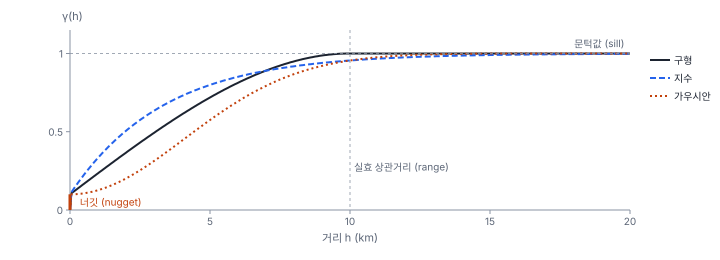
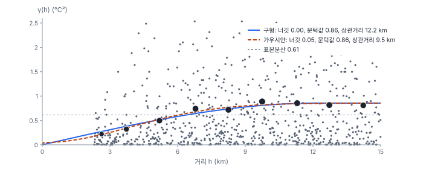
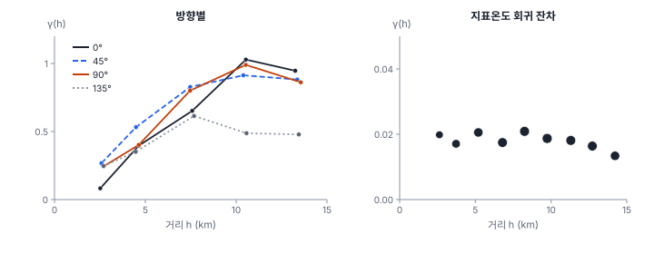

[목차](../README.md) · 이전: [20강 연속 표면과 확률장](20-continuous-surfaces.md) · 다음: [22강 크리깅](22-kriging.md)

# 21강 베리오그램

> 앱 지원: ○ GeoStat에 베리오그램이 없어 코드로 함 · 읽는 시간 약 40분

## 이 강에서 얻는 것

- 베리오그램의 정의를 알고 손으로 실험 베리오그램을 계산할 수 있음
- 너깃, 문턱값, 상관거리의 뜻을 알고 구형·지수·가우시안·마테른 모형을 구별할 수 있음
- 실험 베리오그램에 모형을 적합하고, 구간 폭과 자료의 배치가 결과에 주는 영향을 앎
- 방향별 베리오그램으로 이방성을 살피고, 추세나 공변량을 뺀 잔차의 베리오그램을 해석할 수 있음

## 들어가는 질문

20강의 결정론적 보간은 "가까운 관측소일수록 비슷하다"는 생각을 IDW의 p처럼 사람이 정한 규칙으로 표현했음. 그러나 기온이 거리에 따라 **얼마나** 달라지는지는 자료가 말해 줄 수 있음. 2 km 떨어진 관측소끼리는 평균적으로 몇 도 다르고, 10 km 떨어지면 몇 도 다른가? 몇 km를 넘으면 더 이상 닮지 않는가?

이 관계를 재는 도구가 **베리오그램**(variogram)임. 11강의 코렐로그램이 "거리에 따른 닮음"을 쟀다면, 베리오그램은 "거리에 따른 다름"을 잼. 22강의 크리깅은 이 베리오그램으로 가중치를 정함.

## 1. 베리오그램의 정의

20강의 내재 정상성 가정에서, 거리 h만큼 떨어진 두 지점의 차이의 분산의 반을 **반베리오그램**(semivariogram) γ(h)라 함. 흔히 그냥 베리오그램이라 부름.

$$
\gamma(h) = \frac{1}{2}\, \mathrm{Var}\left[Z(s + h) - Z(s)\right] = \frac{1}{2}\, \mathbb{E}\left[\left(Z(s + h) - Z(s)\right)^2\right]
$$

두 번째 등호는 평균이 일정해 차이의 평균이 0일 때 성립함. 가까운 지점끼리는 값이 비슷해 차이가 작으므로 γ(h)가 작고, 멀어질수록 커짐.

자료에서는 거리가 비슷한 쌍을 모아 **실험 베리오그램**(empirical variogram)을 구함(Matheron 1963).

$$
\hat{\gamma}(h) = \frac{1}{2\, N(h)} \sum_{(i,j):\, d_{ij} \approx h} \left(z_i - z_j\right)^2
$$

N(h)는 거리가 h 근처(구간 안)인 쌍의 수임. 2차 정상성이 있으면 공분산 C(h)에 대해 γ(h) = C(0) − C(h)가 성립해, 베리오그램과 공분산(또는 11강의 코렐로그램 ρ(h) = C(h)/C(0))은 같은 정보를 담음. 지구통계에서 베리오그램을 즐겨 쓰는 것은 평균을 몰라도 계산할 수 있고, 내재 정상성이라는 더 약한 가정에서도 정의되기 때문임.

### 손으로 해 보기: 지점 다섯 개

1 km 간격으로 늘어선 다섯 지점의 기온이 24.0, 24.4, 25.1, 24.9, 25.6℃임.

| 거리 h | 쌍의 차이 | 차이의 제곱 | γ(h) = 제곱 평균의 반 |
|---|---|---|---|
| 1 km | 0.4, 0.7, −0.2, 0.7 | 0.16, 0.49, 0.04, 0.49 | 0.1475 (쌍 4개) |
| 2 km | 1.1, 0.5, 0.5 | 1.21, 0.25, 0.25 | 0.2850 (쌍 3개) |
| 3 km | 0.9, 1.2 | 0.81, 1.44 | 0.5625 (쌍 2개) |

거리가 멀수록 γ가 커짐. 3 km의 γ(0.56)는 다섯 값의 분산(0.385)보다 큰데, 이 자료에 오른쪽으로 갈수록 높아지는 추세가 있기 때문임. 추세가 있으면 γ(h)는 분산 근처에서 멈추지 않고 계속 커짐(5절). 또 거리가 멀수록 쌍이 적어 γ가 불안정함. 실제 분석에서는 쌍이 30개 이상인 구간을 쓰고, 최대 거리의 절반 정도까지만 봄(Journel & Huijbregts 1978).

## 2. 너깃, 문턱값, 상관거리

실험 베리오그램은 몇 개의 점일 뿐이라, 크리깅에 쓰려면 모든 거리에서 값을 주는 매끄러운 **모형**으로 바꿔야 함. 모형은 세 가지 특징으로 설명함.



- **너깃**(nugget, c₀): 거리가 0에 가까워져도 남는 γ. 측정 오차와, 관측소 사이 거리보다 짧은 규모의 변동을 합친 것임. 금광에서 금덩이(너깃) 하나가 시료에 들어가느냐에 따라 값이 튀는 데서 이름이 나왔음
- **문턱값**(sill, c₀ + c): 거리가 멀어져 γ가 더 이상 커지지 않는 높이. 2차 정상성에서는 분산 C(0)와 같음. c를 부분 문턱값이라 함
- **상관거리**(range, a): γ가 문턱값에 이르는 거리. 그보다 멀리 떨어진 지점끼리는 서로 상관이 없음. 지수·가우시안처럼 문턱값에 점근하는 모형은 부분 문턱값의 95%(너깃 위로 c의 95%)에 이르는 거리를 **실효 상관거리**로 씀

모형마다 원점 근처의 모양이 다르고, 이는 표면의 매끄러움에 대응함.

| 모형 | 식 (h < a, c₀ 제외) | 원점 근처 | 표면 |
|---|---|---|---|
| 구형 (spherical) | c[1.5(h/a) − 0.5(h/a)³] | 직선 | 거침(지수보다 원점 기울기 완만) |
| 지수 (exponential) | c[1 − exp(−3h/a)] | 직선, 가파름 | 거침 |
| 가우시안 (Gaussian) | c[1 − exp(−3h²/a²)] | 포물선 | 매우 매끄러움 |
| 마테른 (Matérn) | 매끄러움 ν로 지수(ν = 0.5)와 가우시안(ν → ∞) 사이를 이음 | ν에 따라 | ν가 클수록 매끄러움 |

마테른 모형(Matérn 1960; Stein 1999가 널리 알림)은 매끄러움을 자료에서 정할 수 있어 통계학에서 많이 씀. 모형은 아무 함수나 쓸 수 없고, 합이 0인 어떤 가중치 조합의 분산도 음수가 되지 않는 성질(조건부 음정치성)을 만족해야 함. 그래서 위와 같은 검증된 모형을 씀.

## 3. 한빛시 관측소의 베리오그램

관측소 48곳에서 쌍은 1,128개이고, 15 km 안의 쌍은 794개임. 1.5 km 구간으로 나눠 실험 베리오그램을 구했음.



| 평균 거리 | γ (℃²) | 쌍 |
|---|---|---|
| 2.6 km | 0.220 | 44 |
| 3.7 km | 0.322 | 65 |
| 5.2 km | 0.496 | 86 |
| 6.8 km | 0.740 | 99 |
| 8.3 km | 0.720 | 104 |
| 9.7 km | 0.888 | 108 |
| 11.3 km | 0.855 | 102 |
| 12.7 km | 0.816 | 99 |
| 14.2 km | 0.808 | 87 |

**베리오그램 구름**(variogram cloud)의 점 하나하나는 쌍 하나의 ½(zᵢ − zⱼ)²로, 같은 거리에서도 0에서 5 이상까지 크게 흩어짐. 구간 평균을 내야 경향이 보임. 실험 베리오그램은 10 km 근처까지 오르다 0.8~0.9에서 평평해짐. 2.6 km에서 0.22라는 것은, 2.6 km 떨어진 관측소끼리 기온 차이의 제곱 평균이 0.44(제곱평균제곱근으로는 약 0.66℃)라는 뜻임.

### 모형 적합

모형은 크레시(Cressie 1985)의 **가중 최소제곱**으로 적합했음. 구간마다 (모형 − 실험값)²에 N(h)/γ(h)²(γ(h)는 실험값이 아니라 모형값)의 가중치를 줌. 쌍이 많은 구간과 γ가 작은 가까운 거리를 중시함. 크리깅에서 가까운 거리의 모형이 가장 중요하기 때문임.

| 모형 | 너깃 | 문턱값 | 실효 상관거리 | 가중 제곱합 |
|---|---|---|---|---|
| 구형 | 0.000 | 0.855 | 12.2 km | 7.23 |
| 지수 | 0.000 | 1.262 | 30.1 km | 13.40 |
| 가우시안 | 0.046 | 0.856 | 9.5 km | 2.98 |
| 마테른 (ν = 1.5) | 0.000 | 0.934 | 13.3 km | 5.30 |

가우시안 모형이 가장 잘 맞음. 기온이 매끄럽게 변하는 표면이라는 20강의 관찰(박판 스플라인이 가장 나았음)과 맞음. 지수 모형은 실험 베리오그램이 평평해지는 모습을 따라가지 못해 상관거리가 30 km로, 도시의 동서 폭(약 29 km)보다도 길게 나왔음.

### 자료가 말해 주지 않는 것

- **너깃**: 관측소끼리 가장 가까운 거리가 2.3 km라, 그보다 짧은 거리의 γ는 관측된 적이 없음. 구형 모형은 너깃을 0으로, 가우시안은 0.046으로 잡았는데, 둘 다 원점까지 곡선을 이어 붙인 외삽임. 측정 오차가 0.05℃²인지 0인지는 이 자료로 가릴 수 없음. 관측소 옆에 관측기를 하나 더 두는 식으로 짧은 거리의 쌍을 일부러 만들면 너깃을 잴 수 있음(38강의 표본설계)
- **문턱값과 분산**: 표본분산은 0.612인데 문턱값은 0.855로 더 큼. 도시의 폭(동서 약 29 km, 남북 약 20 km)이 상관거리(10~12 km)의 2~3배밖에 안 되어, 48곳의 표본분산이 확률장 전체의 분산을 다 보여 주지 못하기 때문임. 문턱값을 표본분산에 맞추면 안 됨
- **구간 폭**: 구간 폭을 1 km, 2.5 km로 바꾸면 구형 모형의 상관거리는 11.7 km, 11.4 km, 문턱값은 0.851, 0.832로 조금씩 바뀜. 구간 폭도 분석자가 정하는 것이므로 몇 가지로 해 봄

## 4. 이방성

등방성은 관계가 방향과 무관하다는 가정이었음. 방향마다 따로 베리오그램을 구해 확인함. 쌍의 방향(방위각)이 정한 방향에서 ±22.5° 안인 쌍만 모아 3 km 구간으로 계산했음.



0°(남북), 45°, 90°(동서) 방향은 10 km 근처에서 0.91~1.03에 이르러 비슷함. 135°(북서–남동) 방향만 10~13 km에서 0.49, 0.48로 낮음. 북서–남동 방향으로는 멀리 떨어져도 기온이 덜 다르다는 뜻이고, 서북쪽(가람구)과 남쪽(마루구)의 두 도심이 비슷하게 더운 것과 관계있어 보임. 그러나 구간마다 쌍이 8~67개뿐이라 이 차이를 이방성으로 단정하기는 어려움. 이방성이 확실하면 방향에 따라 상관거리가 다른 **기하 이방성** 모형을 쓰는데, 관측소 48곳으로는 그만큼의 정보가 없음.

## 5. 추세와 잔차의 베리오그램

평균이 위치에 따라 달라지면(추세), 실험 베리오그램은 문턱값 없이 계속 커지거나 실제 공간 구조보다 크게 나옴. 손계산의 다섯 지점이 그 예였음. 이때는 추세를 먼저 모형으로 설명하고 **잔차**의 베리오그램을 봄.

한빛시 관측소 기온에 좌표의 선형 추세(동서·남북으로 기울어진 평면)를 맞추면 R²는 0.047뿐임. 단순히 한쪽으로 기울어진 도시가 아니라는 뜻임. 대신 기온을 지표온도와 비교해 봤음. 관측소 위치의 지표온도(50 m 셀)와 기온의 상관은 0.908이고, 지표온도를 넓게 평활할수록 상관이 높아져 표준편차 1 km 가우시안 커널로 평활했을 때 0.987로 가장 높았음(500 m 0.968, 2 km 0.966). 공기 온도는 바로 아래 땅보다 주변 1 km 정도의 땅의 영향을 받는다는 뜻임.

1 km 평활 지표온도로 회귀하면 기온 = 11.829 + 0.4271 × 지표온도(R² 0.974)이고, 잔차의 표준편차는 0.128℃임. 잔차의 실험 베리오그램(위 그림 오른쪽)은 모든 거리에서 0.013~0.021로 평평함. 거리에 따라 커지지 않는 **순수 너깃**(pure nugget)임. 기온의 공간 구조가 지표온도로 모두 설명되고, 남은 것은 관측소마다 독립적인 작은 변동(측정 오차나 관측소 주변의 미세한 차이)뿐이라는 뜻임.

이 결과는 22강에서 중요함. 공변량이 공간 구조를 잘 설명하면, 크리깅은 잔차에서 더 얻을 것이 없음. 공간 구조를 베리오그램으로 모형화할지, 공변량으로 설명할지는 같은 문제의 두 얼굴임(9강, 24강).

## 해 보기

### 코드로: 실험 베리오그램과 모형 적합

```python
import geopandas as gpd
import numpy as np
from scipy.optimize import least_squares
from scipy.spatial.distance import pdist

st = gpd.read_file("book/data/hanbit_stations.gpkg")
X = np.c_[st.geometry.x, st.geometry.y] / 1000            # km
z = st["기온_8월평균"].to_numpy()

d = pdist(X)                                              # 쌍마다 거리 (1,128개)
g = 0.5 * pdist(z[:, None], "sqeuclidean")                # 쌍마다 반분산 ½(zᵢ − zⱼ)²
edges = np.arange(0, 15.01, 1.5)
rows = []
for a, b in zip(edges[:-1], edges[1:]):
    m = (d > a) & (d <= b)
    if m.any():
        rows.append((d[m].mean(), g[m].mean(), m.sum()))
h, gam, npair = np.array(rows).T
for row in rows:
    print(f"h {row[0]:5.2f} km: γ {row[1]:.4f} (쌍 {row[2]})")


def spherical(h, c0, c, a):
    return np.where(h < a, c0 + c * (1.5 * h / a - 0.5 * (h / a) ** 3), c0 + c)


def gaussian(h, c0, c, a):
    return c0 + c * (1 - np.exp(-3 * (h / a) ** 2))


for name, f in (("구형", spherical), ("가우시안", gaussian)):
    fit = least_squares(lambda p: np.sqrt(npair) * (f(h, *p) - gam) / f(h, *p), [0.05, 0.7, 9],
                        bounds=([0, 1e-6, 0.2], [np.inf, np.inf, 100]))
    c0, c, a = fit.x
    print(f"{name}: 너깃 {c0:.3f}, 문턱값 {c0 + c:.3f}, 실효 상관거리 {a:.1f} km")
```

- 확인: 실험 베리오그램 0.2196(2.63 km, 쌍 44)에서 0.8083(14.23 km, 쌍 87)까지. 구형: 너깃 0.000, 문턱값 0.855, 상관거리 12.2 km. 가우시안: 너깃 0.046, 문턱값 0.856, 상관거리 9.5 km
- 더 해 보기: `edges`의 간격을 1 km, 2.5 km로 바꿔 모형이 어떻게 바뀌는지 봄. `scikit-gstat`이나 `gstools` 같은 라이브러리는 실험 베리오그램, 여러 모형의 적합, 방향별 베리오그램을 함께 제공함

## 헷갈리는 쌍

- **베리오그램 vs 공분산(코렐로그램)**: 베리오그램은 거리에 따른 다름, 공분산은 닮음. 2차 정상성에서 γ(h) = C(0) − C(h)로 같은 정보임
- **너깃 vs 측정 오차**: 너깃은 측정 오차와 관측 간격보다 짧은 변동을 합친 것임. 관측 간격이 넓으면 둘을 가릴 수 없음
- **문턱값 vs 표본분산**: 문턱값은 확률장의 분산이고, 지역이 상관거리에 비해 작으면 표본분산이 문턱값보다 작음
- **상관거리 vs 실효 상관거리**: 구형 모형은 상관거리에서 정확히 문턱값에 닿고, 지수·가우시안은 점근하므로 부분 문턱값의 95% 지점을 실효 상관거리로 씀
- **베리오그램 구름 vs 실험 베리오그램**: 구름은 쌍 하나하나, 실험 베리오그램은 구간 평균

## 흔한 실수와 심사 지적

- **관측 간격보다 짧은 거리의 너깃을 자료에서 정했다고 씀**
  - 대응: 가장 가까운 쌍의 거리를 밝히고, 너깃은 모형의 외삽이라는 점과 그에 따른 민감도를 보고함
- **쌍이 적은 먼 거리까지 실험 베리오그램을 그려 해석함**
  - 대응: 최대 거리의 절반 정도까지, 쌍이 30개 이상인 구간만 씀
- **추세가 있는 자료의 베리오그램을 그대로 크리깅에 씀**
  - 결과: 상관거리와 문턱값이 부풀려지고 크리깅 분산이 틀림
  - 대응: 추세나 공변량을 먼저 모형에 넣고 잔차의 베리오그램을 봄
- **모형을 눈으로 맞추고 매개변수를 보고하지 않음**
  - 대응: 적합 방법(가중 최소제곱, 최대우도 등)과 매개변수, 비교한 모형을 적음
- **쌍이 적은데 방향별 베리오그램으로 이방성을 단정함**
  - 대응: 방향마다 쌍의 수를 함께 보고, 근거가 약하면 등방성을 유지함

## 보고서에는 이렇게 씀

> 관측소 48곳의 8월 평균 기온으로 실험 베리오그램(구간 1.5 km, 최대 15 km, 구간당 44~108쌍)을 계산하고, 가중 최소제곱(Cressie 1985)으로 구형·지수·가우시안·마테른 모형을 적합하였다. 가우시안 모형이 가장 잘 맞았으며(너깃 0.046℃², 문턱값 0.856℃², 실효 상관거리 9.5 km), 관측소 간 최소 거리가 2.3 km여서 너깃은 자료로 직접 추정되지 않았다. 방향별 베리오그램에서는 북서–남동 방향의 반분산이 원거리에서 다소 낮았으나 쌍의 수가 적어 등방성을 가정하였다. 1 km로 평활한 지표온도로 기온을 회귀한 잔차(R² = 0.974)의 베리오그램은 거리와 무관하게 평평하였다(0.013~0.021℃²).

적어야 할 항목은 다음과 같음.

- 구간 폭, 최대 거리, 구간마다의 쌍의 수
- 비교한 모형, 적합 방법, 선택한 모형의 매개변수
- 관측 간격과 너깃의 관계, 문턱값과 표본분산의 차이
- 추세나 공변량의 처리, 이방성 확인 결과

## 요약

- 베리오그램 γ(h)는 거리 h만큼 떨어진 두 지점의 차이의 분산의 반이며, 실험 베리오그램은 거리가 비슷한 쌍을 모아 구함
- 모형은 너깃(짧은 거리의 변동과 측정 오차), 문턱값(분산), 상관거리(닮음이 사라지는 거리)로 요약되고, 원점 근처의 모양이 표면의 매끄러움을 나타냄
- 한빛시 기온은 가우시안 모형(너깃 0.046, 문턱값 0.856, 실효 상관거리 9.5 km)이 가장 잘 맞았음. 관측소 간 최소 거리(2.3 km)보다 짧은 거리는 자료가 말해 주지 않음
- 방향별 베리오그램은 쌍이 적어 이방성을 단정하기 어려웠음
- 1 km 평활 지표온도로 회귀한 잔차는 순수 너깃이었음. 기온의 공간 구조는 지표온도로 설명됨

## 핵심 용어

| 한글 | 영문 | 비고 |
|---|---|---|
| (반)베리오그램 | (Semi)variogram | γ(h) |
| 실험 베리오그램 | Empirical (Experimental) Variogram | |
| 베리오그램 구름 | Variogram Cloud | |
| 너깃 | Nugget | c₀ |
| 문턱값 | Sill | c₀ + c |
| 상관거리 | Range | 실효 상관거리 |
| 구형·지수·가우시안 모형 | Spherical, Exponential, Gaussian Models | |
| 마테른 모형 | Matérn Model | 매끄러움 ν |
| 가중 최소제곱 | Weighted Least Squares | Cressie 1985 |
| 이방성 | Anisotropy | 기하 이방성 |
| 순수 너깃 | Pure Nugget | 공간 구조 없음 |

## 원전과 더 읽을거리

**원전**

- Matheron, G. (1963). Principles of geostatistics. *Economic Geology*, 58(8), 1246–1266. 베리오그램과 크리깅
- Cressie, N. (1985). Fitting variogram models by weighted least squares. *Journal of the International Association for Mathematical Geology*, 17(5), 563–586.
- Matérn, B. (1960). *Spatial Variation*. Meddelanden från Statens Skogsforskningsinstitut, 49(5). 마테른 모형의 원전
- Stein, M. L. (1999). *Interpolation of Spatial Data: Some Theory for Kriging*. Springer. 마테른 모형과 원점 근처의 중요성

**더 읽을거리**

- Journel, A. G., & Huijbregts, C. J. (1978). *Mining Geostatistics*. Academic Press. 실무 규칙(쌍의 수, 최대 거리)
- Webster, R., & Oliver, M. A. (2007). *Geostatistics for Environmental Scientists* (2nd ed.). Wiley. 4~6장
- Oliver, M. A., & Webster, R. (2014). A tutorial guide to geostatistics: Computing and modelling variograms and kriging. *Catena*, 113, 56–69.

## 연습

1. 손계산의 다섯 지점에서 h = 4 km의 γ를 구하시오. 왜 이 값을 해석하면 안 되는가?

2. 어떤 토양 오염 자료의 실험 베리오그램이 모든 거리에서 문턱값 근처로 평평했음. 무엇을 뜻하며, 크리깅 예측은 어떻게 될 것인가?

3. 관측소 간 최소 거리가 2.3 km인 자료에서 구형 모형(너깃 0)과 가우시안 모형(너깃 0.046)이 2.3 km 이후로는 비슷하게 맞았음. 크리깅에서 두 모형의 차이가 가장 크게 나타나는 곳은 어디인가?

4. 실험 베리오그램이 15 km까지 문턱값 없이 계속 커졌음. 무엇을 의심해야 하는가?

5. 잔차의 베리오그램이 순수 너깃이라는 것은 "기온에 공간 자기상관이 없다"는 뜻인가?

<details>
<summary>해답</summary>

1. h = 4 km의 쌍은 (24.0, 25.6) 하나뿐이고, 차이 1.6, 제곱 2.56, γ = 1.28임. 쌍이 하나라 우연에 크게 좌우되고, 전체 길이(4 km)의 끝이라 가장자리 두 점만 반영함. 쌍이 적은 먼 거리의 γ는 해석하지 않음.

2. 관측 간격보다 큰 규모에서는 공간 상관이 없다는 뜻임(순수 너깃). 상관이 있더라도 관측 간격보다 짧은 거리에서만 있는 것임. 크리깅은 어느 지점에서나 전체 평균에 가까운 값을 예측하고, 관측점 자리 바로 옆이라도 예측은 평균이고 크리깅 분산은 문턱값 근처로 큼. 더 촘촘한 표본이 필요함.

3. 관측소 바로 옆(2.3 km보다 가까운 곳)과 관측소 자리 자체임. 너깃이 0인 구형 모형은 관측값을 정확히 지나가고 관측소 근처의 크리깅 분산이 0에 가까움. 너깃이 있는 가우시안도 관측소 자리에서는 관측값을 그대로 지나가지만, 관측소에서 조금만 벗어나도 예측이 평활되고 크리깅 분산이 너깃 이상으로 뛰어오름(22강). 너깃을 측정 오차로 보는 필터링 크리깅이면 관측소 자리에서도 관측값에서 벗어남. 관측소 사이의 먼 곳에서는 두 모형의 예측이 비슷함.

4. 평균이 위치에 따라 달라지는 추세(비정상성)를 의심함. 지역 크기에 비해 상관거리가 매우 긴 경우도 있음. 좌표나 공변량으로 추세를 모형화하고 잔차의 베리오그램이 문턱값에 이르는지 봄.

5. 아님. 기온 자체는 강하게 공간 자기상관함(상관거리 약 10 km). 순수 너깃은 지표온도가 설명한 뒤 "남은 부분"에 공간 구조가 없다는 뜻임. 기온의 공간 자기상관은 지표온도의 공간 패턴을 통해 들어온 것임.

</details>

---

[목차](../README.md) · 이전: [20강 연속 표면과 확률장](20-continuous-surfaces.md) · 다음: [22강 크리깅](22-kriging.md)
