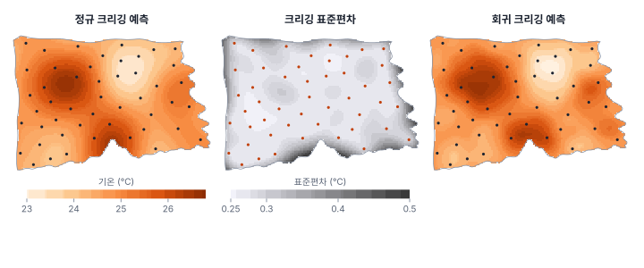
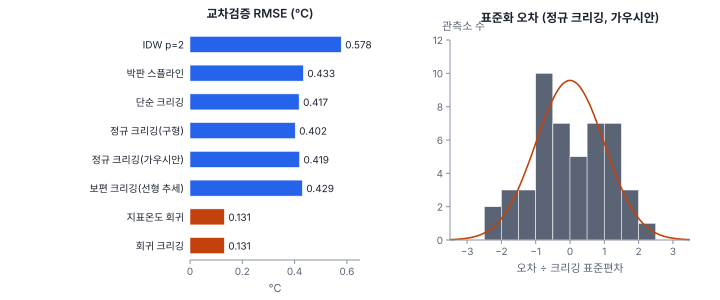

[목차](../README.md) · 이전: [21강 베리오그램](21-variogram.md) · 다음: [23강 불확실성과 시뮬레이션](23-uncertainty-simulation.md)

# 22강 크리깅

> 앱 지원: ○ GeoStat에 크리깅이 없어 코드로 함 · 읽는 시간 약 45분

## 이 강에서 얻는 것

- 크리깅이 "오차 분산을 가장 작게 하는 가중 평균"이라는 것을 알고, 정규 크리깅 방정식을 손으로 풀 수 있음
- 단순·정규·보편·회귀 크리깅의 차이와 크리깅 분산의 뜻을 앎
- 교차검증으로 예측의 정확도와 불확실성의 적절성(표준화 오차)을 함께 평가할 수 있음
- 블록 크리깅으로 점 관측에서 구역 평균과 그 불확실성을 구할 수 있음

## 들어가는 질문

20강에서 결정론적 보간은 불확실성을 주지 못했고, 21강에서 기온이 거리에 따라 얼마나 달라지는지(베리오그램)를 쟀음. 이제 둘을 합침. 관측소가 없는 지점의 기온을 베리오그램이 알려 주는 공간 구조에 맞춰 예측하고, 그 예측이 얼마나 틀릴 수 있는지도 함께 말할 수 있는가?

이것이 **크리깅**(kriging)임. 남아프리카의 광산 기술자 크리게(Krige 1951)가 시추공 몇 개로 광맥 전체의 금 함량을 추정하던 방법을, 마테롱(Matheron 1963)이 그의 이름을 붙여 이론으로 정리했음. 오늘날에는 기온·강수·토양·지하수·해양 수온 지도의 표준 방법 가운데 하나임.

## 1. 크리깅의 생각

크리깅의 예측도 20강처럼 관측값의 가중 평균임.

$$
\hat{Z}(s_0) = \sum_{i=1}^{n} w_i Z(s_i)
$$

다른 점은 가중치를 정하는 규칙임. 크리깅은 예측 오차 Ẑ(s₀) − Z(s₀)의 평균이 0이고(불편), 그 분산이 가장 작도록 가중치를 고름. 그래서 **최량 선형 불편 예측**(best linear unbiased prediction, BLUP)이라 함. 오차의 분산은 관측소끼리, 그리고 관측소와 예측 지점 사이의 공분산(베리오그램)으로 계산되므로, 가중치는 자료의 공간 구조에서 나옴.

### 정규 크리깅

평균 μ가 일정하지만 모를 때 쓰는 것이 **정규 크리깅**(ordinary kriging)임. 불편이려면 가중치의 합이 1이어야 하고, 이 조건에서 오차 분산을 최소화하면(라그랑주 승수 m) 다음 방정식이 나옴.

$$
\sum_{j=1}^{n} w_j\, \gamma(s_i - s_j) + m = \gamma(s_i - s_0), \quad i = 1, \ldots, n, \qquad \sum_{j=1}^{n} w_j = 1
$$

이 방정식을 풀면 가중치가 나오고, 그때의 오차 분산이 **크리깅 분산**(kriging variance)임.

$$
\sigma_K^2(s_0) = \sum_{i=1}^{n} w_i\, \gamma(s_i - s_0) + m
$$

크리깅 분산은 관측값 자체가 아니라 관측소의 배치와 베리오그램에만 달림. 관측소에서 멀수록, 관측소가 성길수록 커짐.

### 손으로 해 보기: 관측소 두 곳

한 줄 위 0 km와 4 km에 관측소가 있고, 1 km 지점을 예측함. 베리오그램은 구형 모형(너깃 0, 문턱값 1, 상관거리 10 km)임.

- γ(1) = 1.5 × 0.1 − 0.5 × 0.1³ = 0.1495
- γ(3) = 1.5 × 0.3 − 0.5 × 0.3³ = 0.4365
- γ(4) = 1.5 × 0.4 − 0.5 × 0.4³ = 0.5680

방정식은 다음과 같음.

- 0 × w₁ + 0.568 × w₂ + m = 0.1495
- 0.568 × w₁ + 0 × w₂ + m = 0.4365
- w₁ + w₂ = 1

위의 두 식을 빼면 0.568(w₂ − w₁) = −0.287이므로 w₂ − w₁ = −0.5053이고, w₁ = 0.7526, w₂ = 0.2474임. m = 0.1495 − 0.568 × 0.2474 = 0.0090. 크리깅 분산은 0.7526 × 0.1495 + 0.2474 × 0.4365 + 0.0090 = 0.2295(표준편차 0.479)임. 두 관측값이 25.0℃와 24.0℃라면 예측은 24.753℃임.

IDW(p = 2)라면 가중치가 1/1² : 1/3²로 0.9와 0.1임. 크리깅은 먼 관측소에 IDW(0.1)보다 더 많은 무게(0.25)를 줌. 상관거리가 10 km라 3 km 떨어진 관측소도 정보를 꽤 담고 있다고 베리오그램이 말하기 때문임.

### 가림 효과

0.2 km 지점에 관측소를 하나 더 두면(0, 0.2, 4 km) 가중치는 −0.012, 0.804, 0.208이 됨. 바짝 붙은 두 관측소는 거의 같은 정보를 담고 있어, 두 가중치의 합(0.79)이 관측소가 하나일 때(0.75)와 비슷하고, 예측 지점에 더 가까운 쪽이 무게를 거의 다 가져감. 둘 중 먼 쪽(0 km)은 오히려 작은 음수 가중치를 받음. IDW라면 두 관측소가 각자 큰 무게를 받아 같은 정보를 두 번 셌을 것임(20강 연습 2). 가까운 관측소가 그 뒤의 관측소를 가려 무게를 빼앗는 이 현상을 **가림 효과**(screening effect)라 하고, 붙은 관측소들이 정보를 나눠 갖는 성질은 군집 해소(declustering) 효과라고도 함.

## 2. 크리깅의 종류

평균(추세)을 어떻게 다루느냐에 따라 이름이 달라짐.

| 종류 | 평균 | 쓰는 경우 |
|---|---|---|
| 단순 크리깅 (simple) | 알려진 상수 μ | 평균을 다른 자료에서 알고 있을 때 |
| 정규 크리깅 (ordinary) | 모르는 상수 | 가장 흔함. 근처 관측소로 평균을 국지적으로 추정하는 효과 |
| 보편 크리깅 (universal) | 좌표의 함수(추세) | 지역 전체에 뚜렷한 기울기가 있을 때 |
| 회귀 크리깅 / 외부 표류 크리깅 | 공변량의 함수 | 위성 영상, 고도처럼 촘촘한 공변량이 있을 때 |

**회귀 크리깅**(regression kriging)은 공변량으로 회귀한 뒤 잔차를 크리깅해 더함(Hengl, Heuvelink & Rossiter 2007). **외부 표류 크리깅**(kriging with external drift)은 공변량을 보편 크리깅의 추세 항으로 넣는 것으로, 같은 모형을 한 번에 푸는 방법임. 두 변수를 함께 크리깅하는 **코크리깅**(cokriging)도 있는데, 보조 변수도 점으로 관측되지만 주 변수보다 많은 지점에서 관측될 때 쓰고, 공변량이 래스터처럼 어디서나 있으면 회귀 크리깅이 더 간단함.

## 3. 한빛시 기온의 크리깅

21강의 가우시안 베리오그램(너깃 0.046, 부분 문턱값 0.810, 실효 상관거리 9.5 km)으로 250 m 격자에 정규 크리깅을 했음.



예측 지도(왼쪽)는 20강의 박판 스플라인과 큰 모습이 같음(예측 범위 23.07~26.70℃). 크리깅의 장점은 가운데의 **크리깅 표준편차** 지도임.

| 가장 가까운 관측소까지 | 격자점 | 크리깅 표준편차 평균 |
|---|---|---|
| 0~500 m | 595 | 0.273℃ |
| 500~1,500 m | 4,284 | 0.278℃ |
| 1,500~3,000 m | 2,380 | 0.308℃ |
| 3,000 m 이상 | 2 | 0.467℃ |

관측소에서 멀수록 표준편차가 커지고, 관측소가 고르게 배치되어 대부분의 지점이 0.25~0.31℃임. 가장 큰 곳(0.518℃)은 남쪽 해안으로, 가장 가까운 관측소가 2.7 km 떨어져 있고 한쪽이 바다라 관측소가 한쪽에만 있는 곳임.

관측소 자리에서는 예측이 관측값과 같고 표준편차가 0임. 너깃(0.046)을 "관측소 사이보다 짧은 규모의 실제 변동"으로 보는 정확 보간이기 때문임. 관측소 바로 옆으로 조금만 옮겨도 표준편차는 √0.046 = 0.21℃ 이상으로 뛰어오름(S01에서 1 m만 옮겨도 0.296℃). 너깃을 측정 오차로 본다면 관측소 자리에서도 측정 오차를 걸러 낸 값을 예측하는 방식(필터링 크리깅)을 씀.

## 4. 교차검증: 정확도와 불확실성

20강처럼 관측소 하나씩 빼고 예측함. 크리깅은 예측과 함께 표준편차를 주므로, 오차를 표준편차로 나눈 **표준화 오차**도 봄. 크리깅 분산이 적절하다면 표준화 오차는 평균 0, 분산 1이고, 정규분포라면 약 5%만 ±1.96을 벗어나야 함.



| 방법 | RMSE | MAE | 표준화 오차 제곱 평균 | ±1.96 밖 |
|---|---|---|---|---|
| IDW (p = 2) | 0.578℃ | 0.453℃ | | |
| 박판 스플라인 | 0.433℃ | 0.346℃ | | |
| 단순 크리깅 (가우시안) | 0.417℃ | 0.330℃ | 1.132 | 3곳 |
| 정규 크리깅 (구형) | 0.402℃ | 0.321℃ | 0.536 | 0곳 |
| 정규 크리깅 (가우시안) | 0.419℃ | 0.332℃ | 1.134 | 3곳 |
| 보편 크리깅 (선형 추세) | 0.429℃ | 0.338℃ | 1.154 | 3곳 |
| 지표온도 회귀 | 0.131℃ | 0.105℃ | 1.065 | 3곳 |
| 회귀 크리깅 | 0.131℃ | 0.105℃ | 0.922 | 2곳 |

단순 크리깅의 평균은 남은 관측소의 평균으로 둠.

몇 가지를 읽을 수 있음.

- **크리깅은 스플라인보다 조금 나음**: 정규 크리깅 0.40~0.42℃로 박판 스플라인(0.433℃)과 비슷하거나 조금 나음. 예측만 보면 큰 차이가 없음. 크리깅의 이점은 예측의 정확도보다 불확실성을 함께 준다는 데 있음
- **정확도와 보정은 다름**: 구형 모형은 공간 보간 가운데 RMSE가 가장 작지만(0.402℃), 표준화 오차 제곱 평균이 0.536으로 1보다 한참 작음. 크리깅 표준편차가 실제 오차보다 1.4배쯤 크다는 뜻임(불확실성을 과장). 가우시안 모형은 1.134로 1에 가깝고, 48곳 가운데 3곳(6%)이 ±1.96을 벗어나 기대(5%)와 비슷함. 지도의 표준편차를 믿으려면 이 값이 1에 가까운 모형을 고름
- **보편 크리깅은 도움이 안 됨**: 21강에서 좌표의 선형 추세는 R² 0.047뿐이었음. 쓸모없는 추세를 넣으면 추정할 계수만 늘어 오히려 조금 나빠짐
- **공변량이 결정적임**: 1 km 평활 지표온도로 회귀만 해도 RMSE가 0.131℃로, 공간 보간의 3분의 1 이하임

### 회귀 크리깅과 순수 너깃

21강에서 지표온도 회귀의 잔차는 순수 너깃이었음. 잔차에 공간 구조가 없으므로, 잔차를 크리깅해도 어느 지점에서나 잔차의 평균(0)에 가까운 값만 더해짐. 그래서 회귀 크리깅과 회귀의 RMSE가 같음(0.131℃). 회귀 크리깅의 표준편차는 어디서나 0.137℃로, 잔차의 너깃(√0.0183 = 0.135℃)에 잔차 평균을 추정하는 불확실성이 조금 더해진 값임(회귀계수의 불확실성까지 더하면 조금 더 커짐).

이 결과는 실무에서 중요함. 위성 지표온도처럼 촘촘한 공변량이 공간 구조를 설명하면, 관측소 48곳의 공간 보간보다 공변량이 훨씬 많은 정보를 줌. 크리깅의 역할은 공변량이 설명하지 못한 나머지를 채우는 것이고, 남은 것에 공간 구조가 없으면 할 일이 없음. 반대로 공변량이 없거나 약하면 크리깅이 주된 도구가 됨.

## 5. 블록 크리깅: 동 평균 기온

시청이 원한 것은 지점의 기온이 아니라 **행정동의 평균 기온**이었음(20강의 지원 문제). 구역 B의 평균을 예측하는 **블록 크리깅**(block kriging)은 크리깅 방정식의 오른쪽 γ(sᵢ − s₀)를 "관측소와 블록 안 모든 점 사이 γ의 평균"으로 바꿈. 실제로는 블록 안에 점을 촘촘히 깔고(여기서는 250 m 간격) 평균을 냄. 블록 크리깅 분산은 다음과 같음.

$$
\sigma_B^2 = \sum_{i=1}^{n} w_i\, \bar{\gamma}(s_i, B) + m - \bar{\gamma}(B, B)
$$

마지막 항(블록 안 점끼리 γ의 평균)을 빼므로 점 크리깅 분산보다 작아짐.

| 동 | 면적 | 블록 예측 (표준편차) | 중심점 예측 (표준편차) |
|---|---|---|---|
| 마루31동 (가장 작음) | 0.61 km² | 26.360℃ (0.320) | 26.356℃ (0.376) |
| 다솜9동 (중간) | 2.47 km² | 25.310℃ (0.174) | 25.335℃ (0.278) |
| 다솜1동 (가장 큼) | 8.60 km² | 23.736℃ (0.148) | 23.701℃ (0.268) |

150개 동 전체로 보면 블록 표준편차의 중앙값은 0.175℃로, 중심점 하나의 표준편차(0.278℃)보다 훨씬 작음. 동 안의 여러 지점의 오차가 평균을 내며 서로 상쇄되기 때문임. 넓은 동일수록 대체로 블록 표준편차가 작음(관측소와의 위치도 영향을 줌). 예측값 자체는 두 방식이 비슷해서, 차이가 가장 큰 누리12동(8.34 km²)도 0.103℃임. "동 평균 기온"을 보고할 때는 블록 크리깅의 표준편차를 써야 불확실성을 과장하지 않음.

## 해 보기

### 코드로: 정규 크리깅의 교차검증

```python
import geopandas as gpd
import numpy as np
from scipy.spatial.distance import cdist

st = gpd.read_file("book/data/hanbit_stations.gpkg")
X = np.c_[st.geometry.x, st.geometry.y] / 1000            # km
z = st["기온_8월평균"].to_numpy()
c0, c, a = 0.046, 0.810, 9.55                             # 21강의 가우시안 모형 (km)


def cov(d):                                               # C(h) = 문턱값 − γ(h), 너깃은 h = 0에서만
    return np.where(d == 0, c0 + c, c * np.exp(-3 * (d / a) ** 2))


def ordinary_kriging(Xt, zt, X0):
    n = len(zt)
    A = np.ones((n + 1, n + 1))
    A[:n, :n], A[n, n] = cov(cdist(Xt, Xt)), 0           # 마지막 행·열: 가중치 합 = 1 조건
    b = np.vstack([cov(cdist(Xt, X0)), np.ones((1, len(X0)))])
    sol = np.linalg.solve(A, b)
    w, mu = sol[:n], sol[n]
    return w.T @ zt, (c0 + c) - np.sum(w * b[:n], axis=0) - mu   # 예측, 크리깅 분산


err, zscore = [], []
for i in range(len(z)):
    m = np.arange(len(z)) != i
    p, v = ordinary_kriging(X[m], z[m], X[i:i + 1])
    err.append(p[0] - z[i])
    zscore.append((p[0] - z[i]) / np.sqrt(v[0]))
err, zscore = np.array(err), np.array(zscore)
print(f"정규 크리깅 LOOCV: RMSE {np.sqrt(np.mean(err ** 2)):.3f}℃, 표준화 오차 제곱 평균 {np.mean(zscore ** 2):.3f}")
```

- 확인: RMSE 0.419℃, 표준화 오차 제곱 평균 1.134(본문 표의 정규 크리깅(가우시안)과 같음)
- 더 해 보기: `cov`를 구형 모형(너깃 0, 문턱값 0.855, 상관거리 12.2 km)으로 바꿔 RMSE는 줄지만 표준화 오차 제곱 평균이 0.536으로 작아지는 것을 확인함. `PyKrige`나 `gstools` 라이브러리를 쓰면 정규·보편·외부 표류 크리깅과 블록 크리깅을 바로 할 수 있음

## 헷갈리는 쌍

- **크리깅 vs IDW**: 둘 다 가중 평균이지만, 크리깅은 가중치를 베리오그램과 관측소 배치로 정하고 예측 분산을 줌
- **크리깅 분산 vs 교차검증 오차**: 크리깅 분산은 모형이 말하는 지점별 불확실성, 교차검증 오차는 실제로 틀린 정도. 표준화 오차로 둘이 맞는지 확인함
- **정규 크리깅 vs 보편 크리깅**: 평균이 상수인지, 좌표에 따른 추세인지
- **회귀 크리깅 vs 코크리깅**: 회귀 크리깅은 어디서나 값이 있는 공변량을 추세로 쓰고, 코크리깅은 점으로 관측된(대개 주 변수보다 촘촘한) 보조 변수와 함께 크리깅함
- **점 크리깅 vs 블록 크리깅**: 점의 값과 구역 평균. 블록 예측은 분산이 작음

## 흔한 실수와 심사 지적

- **크리깅 지도만 보여 주고 표준편차 지도를 빼먹음**
  - 지적: "크리깅을 쓴 이유가 무엇입니까? 불확실성은 어디에 있습니까?"
  - 대응: 예측과 표준편차 지도를 함께 제시함
- **교차검증 RMSE만으로 모형을 고름**
  - 대응: 표준화 오차의 평균과 제곱 평균(1에 가까운지)도 함께 보고함
- **추세나 공변량이 있는데 정규 크리깅만 함**
  - 대응: 공변량 회귀, 회귀 크리깅과 비교하고, 잔차의 베리오그램을 확인함
- **점 크리깅 값과 분산을 구역 평균으로 보고함**
  - 대응: 블록 크리깅을 쓰거나, 구역 안의 점 예측을 평균 내고 블록 분산을 따로 계산함
- **관측소 범위 밖(바다, 시 경계 밖)까지 예측해 지도를 채움**
  - 대응: 외삽 영역을 가리거나 표준편차와 함께 보여 줌

## 보고서에는 이렇게 씀

> 관측소 48곳의 8월 평균 기온을 가우시안 베리오그램(너깃 0.046℃², 문턱값 0.856℃², 실효 상관거리 9.5 km)을 사용한 정규 크리깅으로 250 m 격자에 예측하였다. 단일 관측소 제외 교차검증에서 RMSE는 0.419℃였고, 표준화 오차의 제곱 평균은 1.134로 크리깅 표준편차가 실제 오차의 크기를 적절히 나타냈다. 1 km로 평활한 위성 지표온도를 공변량으로 한 회귀 크리깅은 RMSE 0.131℃로 정확도를 크게 높였으며, 회귀 잔차에는 공간 구조가 남지 않았다. 행정동 평균 기온은 블록 크리깅으로 추정하였고, 블록 예측의 표준편차는 중앙값 0.175℃였다.

적어야 할 항목은 다음과 같음.

- 크리깅의 종류와 베리오그램 모형·매개변수, 추세나 공변량
- 예측 격자의 해상도와 범위(외삽 여부)
- 교차검증의 RMSE와 표준화 오차(평균, 제곱 평균)
- 구역 평균이라면 블록 크리깅 여부와 블록 분산

## 요약

- 크리깅은 오차 분산을 최소로 하는 불편 가중 평균(BLUP)이며, 가중치를 베리오그램과 관측소 배치로 정하고 크리깅 분산을 줌
- 손계산에서 크리깅은 IDW보다 먼 관측소에 더 무게를 줬고, 붙은 관측소들은 가림 효과로 같은 정보를 두 번 세지 않았음
- 한빛시 기온의 정규 크리깅은 교차검증 RMSE 0.419℃, 표준화 오차 제곱 평균 1.134로 불확실성도 적절했음. 구형 모형은 더 정확했지만 불확실성을 과장했음
- 1 km 평활 지표온도를 쓰는 회귀(크리깅)는 RMSE 0.131℃로 공간 보간보다 훨씬 나았고, 잔차가 순수 너깃이라 잔차 크리깅이 더하는 것은 없었음
- 블록 크리깅으로 구한 동 평균 기온의 표준편차(중앙값 0.175℃)는 점 예측(0.278℃)보다 작았음

## 핵심 용어

| 한글 | 영문 | 비고 |
|---|---|---|
| 크리깅 | Kriging | Krige 1951, Matheron 1963 |
| 최량 선형 불편 예측 | Best Linear Unbiased Prediction (BLUP) | |
| 단순·정규·보편 크리깅 | Simple, Ordinary, Universal Kriging | |
| 크리깅 분산 | Kriging Variance | |
| 라그랑주 승수 | Lagrange Multiplier | 가중치 합 조건 |
| 가림 효과 | Screening Effect | |
| 회귀 크리깅 | Regression Kriging | Hengl et al. 2007 |
| 외부 표류 크리깅 | Kriging with External Drift | |
| 코크리깅 | Cokriging | |
| 블록 크리깅 | Block Kriging | 지원 변경 |
| 표준화 오차 | Standardized Error | 제곱 평균이 1이면 적절 |

## 원전과 더 읽을거리

**원전**

- Krige, D. G. (1951). A statistical approach to some basic mine valuation problems on the Witwatersrand. *Journal of the Chemical, Metallurgical and Mining Society of South Africa*, 52(6), 119–139.
- Matheron, G. (1963). Principles of geostatistics. *Economic Geology*, 58(8), 1246–1266.
- Hengl, T., Heuvelink, G. B. M., & Rossiter, D. G. (2007). About regression-kriging: From equations to case studies. *Computers & Geosciences*, 33(10), 1301–1315.

**더 읽을거리**

- Cressie, N. (1990). The origins of kriging. *Mathematical Geology*, 22(3), 239–252.
- Webster, R., & Oliver, M. A. (2007). *Geostatistics for Environmental Scientists* (2nd ed.). Wiley. 8~10장
- Isaaks, E. H., & Srivastava, R. M. (1989). *An Introduction to Applied Geostatistics*. Oxford University Press. 크리깅의 직관적 설명

## 연습

1. 손계산에서 예측 지점을 2 km(두 관측소의 가운데)로 옮기면 가중치와 크리깅 분산은 어떻게 되는가? (γ(2) = 0.296)

2. 크리깅 분산이 관측값에 달려 있지 않다는 사실은 어떤 장점과 약점이 있는가?

3. 구형 모형의 표준화 오차 제곱 평균이 0.536이었음. 이 모형의 크리깅 표준편차 지도로 "95% 예측 구간"을 만들면 어떻게 되는가?

4. 지표온도 회귀가 정규 크리깅보다 세 배 정확했음. 그렇다면 관측소는 필요 없는가?

5. 넓은 동(8.6 km²)의 블록 표준편차(0.148℃)가 좁은 동(0.61 km²)의 블록 표준편차(0.320℃)보다 작은 이유는?

<details>
<summary>해답</summary>

1. 대칭이므로 w₁ = w₂ = 0.5. 첫 식에서 0.5 × 0.568 + m = 0.296이라 m = 0.012. 크리깅 분산은 0.5 × 0.296 + 0.5 × 0.296 + 0.012 = 0.308(표준편차 0.555)로, 1 km 지점(0.2295)보다 큼. 관측소에서 멀어질수록 불확실성이 커짐.

2. 장점: 관측하기 전에 관측소 배치만으로 지도의 불확실성을 계산할 수 있어, 새 관측소를 어디에 둘지 미리 정할 수 있음(23강). 약점: 값이 크게 변하는 곳(예: 극단값 근처)이라도 배치가 같으면 같은 분산을 줌. 변동의 크기가 장소마다 다르면(이분산) 크리깅 분산은 변동이 큰 곳의 불확실성은 과소평가하고 변동이 작은 곳은 과대평가함.

3. 표준편차가 실제 오차보다 약 1.4배(√(1/0.536)) 크므로, ±1.96 표준편차 구간은 실제 포함 확률이 95%보다 훨씬 높아(정규분포라면 약 99%) 거의 모든 관측(교차검증에서 48곳 모두)을 포함함. 구간이 지나치게 넓어 정보가 적음. 불확실성을 정확히 전하려면 표준화 오차 제곱 평균이 1에 가까운 모형을 씀.

4. 필요함. 회귀는 관측소 기온과 지표온도의 관계를 관측소에서 배운 것임. 관측소가 없으면 계수(11.829, 0.4271)를 정할 수 없음. 또 지표온도와 기온의 관계가 다른 해, 다른 계절에도 같은지 확인할 수 없음. 공변량은 관측소를 대신하지 않고, 관측소가 적어도 지도를 잘 그릴 수 있게 해 줌.

5. 블록 평균은 블록 안의 여러 지점 값의 평균이라, 지점마다의 예측 오차가 서로 일부 상쇄됨. 넓은 블록일수록 더 많은 독립적인 변동을 평균 내므로 분산이 작아짐. 또 넓은 동은 안에 관측소가 있거나 여러 관측소에 둘러싸여 있을 가능성이 큼.

</details>

---

[목차](../README.md) · 이전: [21강 베리오그램](21-variogram.md) · 다음: [23강 불확실성과 시뮬레이션](23-uncertainty-simulation.md)
