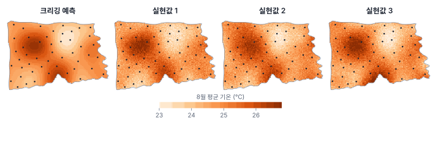
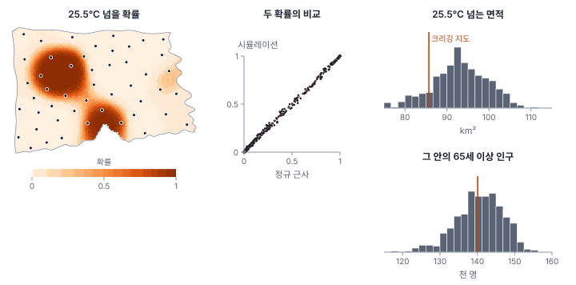
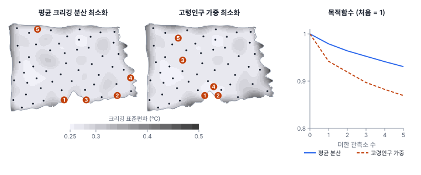

[목차](../README.md) · 이전: [22강 크리깅](22-kriging.md) · 다음: [24강 왜 공간 회귀인가](24-why-spatial-regression.md)

# 23강 불확실성과 시뮬레이션

> 앱 지원: ○ GeoStat에 크리깅과 시뮬레이션이 없어 코드로 함 · 읽는 시간 약 40분

## 이 강에서 얻는 것

- 크리깅 지도가 "가능한 지도들의 평균"이라 매끈하고, 그래서 면적·최댓값 같은 질문에 치우친 답을 준다는 것을 앎
- 크리깅 예측과 표준편차로 기준값을 넘을 확률을 계산하고, 확률로 기대 면적을 구할 수 있음
- 조건부 시뮬레이션의 원리를 알고, 실현값 수백 개로 면적·인구 같은 결과의 불확실성 구간을 낼 수 있음
- 크리깅 분산이 관측값에 달려 있지 않다는 성질로 새 관측소의 자리를 미리 고를 수 있음

## 들어가는 질문

한빛시가 폭염 대책으로 8월 평균 기온이 25.5℃를 넘는 곳에 그늘막과 무더위 쉼터를 늘리려 함. 22강의 크리깅 지도에서 25.5℃를 넘는 칸을 칠하면 대상 지역이 됨. 그런데 담당자가 묻는 것은 지도가 아니라 숫자임. 대상 지역은 몇 km²이고, 거기에 65세 이상이 몇 명 사는가? 그 숫자는 얼마나 틀릴 수 있는가? 그리고 관측소 5곳을 더 둘 예산이 있다면 어디에 둬야 하는가?

크리깅 지도와 표준편차 지도만으로는 이 질문에 바로 답할 수 없음. 표준편차는 칸마다 따로 주어지지만, 면적이나 인구는 여러 칸을 한꺼번에 세는 값이기 때문임. 이 강은 그 간격을 메우는 두 도구, **초과 확률**과 **조건부 시뮬레이션**을 다룸.

## 1. 크리깅 지도가 답하지 못하는 것

크리깅 예측은 각 지점에서 "평균적으로 가장 그럴듯한 값"임. 지점마다 오차 분산을 최소로 하려면 모르는 부분을 평균 쪽으로 당겨야 하므로, 관측소 사이의 예측은 관측값보다 덜 출렁임. 이것을 크리깅의 **평활 효과**(smoothing effect)라 함.

한빛시에서 이 효과를 재면 다음과 같음(250 m 격자 7,261칸).

- 크리깅 지도의 격자값 표준편차는 0.750℃로, 관측소 48곳의 표준편차(0.774℃)보다 작음. 같은 베리오그램을 따르는 시뮬레이션 지도(3절)는 0.804℃(실현값마다 0.710~0.926℃)임
- 크리깅 지도의 최고 기온은 26.70℃이지만, 시뮬레이션 지도의 최고 기온은 중앙값 27.23℃(90% 구간 26.94~27.59℃)임. 크리깅 지도 한 장의 최댓값은 시 전체의 최고 기온을 체계적으로 낮게 잡음. 다만 실현값에는 칸마다 독립인 너깃 몫이 들어 있어, 너깃의 일부가 측정 오차라면 실현값의 최댓값과 출렁임은 다소 과대함

평활은 잘못이 아님. 지점 하나의 값을 묻는다면 크리깅 예측이 최선임. 문제는 "25.5℃를 넘는 면적", "가장 더운 곳의 기온"처럼 여러 지점을 함께 보거나 기준선과 비교하는 질문임. 이런 질문의 답은 평균 지도의 함수가 아니라, 가능한 지도들 각각에 대한 답의 분포로 구해야 함.

## 2. 초과 확률

지점 하나라면 답이 쉬움. 크리깅 오차가 정규분포를 따른다고 보면, 예측 Ẑ(s₀)와 크리깅 표준편차 σ_K(s₀)로 기준값 T를 넘을 확률을 계산함.

$$
P\{Z(s_0) > T\} = 1 - \Phi\!\left(\frac{T - \hat{Z}(s_0)}{\sigma_K(s_0)}\right)
$$

Φ는 표준정규분포의 누적분포함수임. 이 확률을 칸마다 계산해 칠한 것이 **초과 확률 지도**(exceedance probability map)임.

### 손으로 해 보기: 초과 확률과 기대 면적

크리깅 예측이 25.2℃, 표준편차가 0.30℃인 칸이 25.5℃를 넘을 확률은 z = (25.5 − 25.2) / 0.30 = 1.00이므로 1 − Φ(1.00) = 0.1587임.

- 예측 25.4℃, 표준편차 0.3: 0.3694
- 예측 25.6℃, 표준편차 0.3: 0.6306
- 예측 25.2℃, 표준편차 0.15: 0.0228(같은 예측이라도 관측소 가까이 있어 표준편차가 작으면 확률이 훨씬 작음)

이제 칸 네 개의 예측이 25.6, 25.3, 25.2, 25.1℃이고 표준편차가 모두 0.3℃라 함. 크리깅 지도에서 25.5℃를 넘는 칸은 첫째 하나뿐임. 그러나 확률은 0.631, 0.252, 0.159, 0.091이고, 그 합 1.133이 25.5℃를 넘는 칸 수의 **기댓값**임. 기준을 겨우 넘는 칸보다 겨우 밑도는 칸이 많으면, 크리깅 지도로 센 면적은 기대 면적보다 작음(반대면 큼).

### 한빛시의 25.5℃ 초과 확률

관측소 48곳 가운데 25.5℃를 넘는 곳은 9곳임. 확률 지도(4절 그림 왼쪽. 4절에서 시뮬레이션으로 구한 확률이지만, 이 식으로 계산해도 거의 같음)는 북서쪽(가람구)과 남쪽 가운데(마루구)의 두 덩어리에서 1에 가깝고, 동쪽에 확률이 조금 오르는 작은 곳이 있음. 시 면적을 확률로 나누면 다음과 같음.

| 초과 확률 | 면적 (km²) |
|---|---|
| 0.05 미만 | 286.4 |
| 0.05~0.5 | 82.3 |
| 0.5~0.95 | 42.9 |
| 0.95 이상 | 42.1 |

"확실히 넘는 곳"(42.1 km²)과 "확실히 넘지 않는 곳"(286.4 km²) 사이에 판단이 갈리는 회색 지대가 125.2 km²나 됨. 크리깅 지도에서 25.5℃를 넘는 면적은 85.7 km²로, 초과 확률이 0.5 이상인 면적(85.1 km²)과 거의 같음. 반면 확률을 모두 더한 기대 면적은 92.9 km²임.

## 3. 조건부 시뮬레이션

초과 확률은 칸마다 따로 계산한 값이라, "25.5℃를 넘는 면적이 100 km²를 넘을 확률"이나 "그 안의 고령인구가 15만 명을 넘을 확률"처럼 칸들을 함께 보는 질문에는 답하지 못함. 이웃한 칸은 함께 덥거나 함께 덜 더운 경향(공간 자기상관)이 있어, 칸별 확률을 독립으로 곱하거나 더해서는 분포를 얻을 수 없음.

**조건부 시뮬레이션**(conditional simulation)은 다음 세 조건을 만족하는 지도를 여러 장 만듦.

1. 관측소 자리에서는 관측값과 정확히 같음(조건부)
2. 베리오그램(공간 구조)이 자료의 베리오그램과 같음. 그래서 크리깅 지도처럼 매끈하지 않고 실제 기온처럼 출렁임
3. 많이 만들어 지점마다 평균을 내면 크리깅 예측이 되고, 표준편차를 내면 크리깅 표준편차가 됨

각 지도를 **실현값**(realization)이라 함. 실현값 하나하나가 "자료와 모순되지 않는 그럴듯한 실제 지도"이고, 실현값들의 차이가 곧 불확실성임.

### 만드는 방법

이 강에서는 가장 단순한 방법을 씀(Journel 1974의 크리깅 조건화).

1. 격자점과 관측소 자리를 합쳐, 베리오그램에서 나온 공분산 행렬 C를 만들고 C = LLᵀ로 촐레스키 분해함. 표준정규 난수 벡터 e에 L을 곱한 Le가 평균 0, 공분산 C인 **무조건부 시뮬레이션**임
2. 이 무조건부 장의 관측소 자리 값으로 크리깅해, 무조건부 장 자신과의 차이(크리깅 오차의 한 가능한 모습)를 구함
3. 실제 관측값의 크리깅 지도에 그 차이를 더함

$$
Z_{cs}(s) = \hat{Z}(s) + \left[\,U(s) - \hat{U}(s)\,\right]
$$

U는 무조건부 장, Û는 U의 관측소 값으로 한 크리깅임. 관측소 자리에서는 크리깅이 관측값을 그대로 돌려주므로 괄호가 0이 되고 Z_cs = 관측값임(조건 1). 괄호 안의 값은 크리깅 오차와 같은 분포를 따르므로, 크리깅 예측에 크리깅 오차를 한 번 뽑아 더한 셈이 됨(조건 2, 3).

촐레스키 분해는 격자점이 수만 개를 넘으면 계산이 어려움. 그때는 격자를 하나씩 방문하며 앞서 만든 값까지 조건으로 크리깅해 값을 뽑는 **순차 가우시안 시뮬레이션**(sequential Gaussian simulation, SGS)이나, 회전 띠(turning bands), 고속 푸리에 변환 방법을 씀. 원리는 같음. 어느 방법이든 자료가 (변환 후) 정규분포를 따른다고 가정하므로, 강수량처럼 치우친 자료는 정규 점수 변환(normal score transform)을 한 뒤 시뮬레이션하고 되돌림.

### 한빛시 기온의 실현값

21강의 가우시안 베리오그램(너깃 0.046, 부분 문턱값 0.810, 실효 상관거리 9.5 km)으로 실현값 500개를 만들었음.



세 조건을 확인함.

- 관측소 자리의 실현값과 관측값의 차이는 최대 2.5 × 10⁻¹⁴℃(계산 오차 수준)
- 실현값 20개의 경험 베리오그램 평균은 1.0 km에서 0.075(모형 0.072), 3.8 km에서 0.362(0.348), 12.7 km에서 0.855(0.852)로 모형을 대체로 따름. 6.7 km에서 0.735(0.674), 9.7 km에서 0.949(0.820)로 모형보다 높음. 관측값 자체의 실험 베리오그램도 이 거리에서 모형보다 높아(21강, 0.740과 0.888) 실현값이 이를 물려받고, 시 크기(가로 약 29 km)에 비해 상관거리가 길어 흔들림도 큼
- 500개의 지점별 평균과 크리깅 예측의 차이는 평균 0.011℃, 지점별 표준편차와 크리깅 표준편차의 비는 중앙값 0.999(상관 0.970)

## 4. 면적과 인구의 불확실성

실현값마다 25.5℃를 넘는 면적과, 그 안에 사는 65세 이상 인구(100 m 인구 격자를 250 m 칸에 합침)를 셈. 500개의 답이 곧 답의 분포임.



먼저 칸별 초과 확률은 시뮬레이션(넘은 비율)과 정규 근사(2절의 식)가 거의 같음(차이 평균 0.005, 최대 0.069). 이것은 당연함. 가우시안 시뮬레이션은 칸마다 평균이 크리깅 예측, 표준편차가 크리깅 표준편차인 정규분포에서 값을 뽑으므로, 차이는 실현값 500개의 몬테카를로 오차임. 정규 가정 자체가 맞는지는 이 비교로 알 수 없고 관측값의 분포를 따로 봐야 함. 정규 가정을 받아들인다면 칸별 확률은 시뮬레이션 없이 크리깅 결과만으로 구해도 됨.

면적과 인구는 다름.

| 기준 | 크리깅 지도 한 장 | 시뮬레이션 중앙값 | 시뮬레이션 90% 구간 |
|---|---|---|---|
| 25.0℃ 넘는 면적 (km²) | 169.0 | 184.3 | 168.4~200.3 |
| 25.5℃ 넘는 면적 (km²) | 85.7 | 93.1 | 81.0~103.4 |
| 26.0℃ 넘는 면적 (km²) | 39.4 | 41.7 | 31.2~50.1 |
| 25.5℃ 넘는 곳의 65세 이상 (명) | 140,086 | 140,912 | 129,931~149,675 |

- 면적은 크리깅 지도가 세 기준 모두에서 시뮬레이션 중앙값보다 작음. 25.0℃ 기준에서는 크리깅 지도 값(169.0 km²)이 90% 구간의 아래 끝에 걸림. 크리깅 예측값은 24.5~25℃에 가장 많이 몰려 있어, 25.0℃ 바로 아래(±0.3℃ 안 1,383칸)가 바로 위(879칸)보다 훨씬 많음. 이 칸들 상당수가 실제로는 기준을 넘을 수 있는데 크리깅 지도에서는 통째로 빠짐(2절의 손계산과 같은 이유). 25.5℃(737칸 대 478칸), 26.0℃(402칸 대 339칸)에서도 같은 방향이지만 차이가 작아짐. 기준이 이 봉우리보다 낮으면 반대가 되어, 24.5℃에서는 크리깅 지도가 315.4 km²로 기대 면적(302.2 km²)보다 크게 잡음
- 25.5℃ 기준의 시뮬레이션 평균 면적은 93.0 km²로, 2절에서 확률을 더한 기대 면적(92.9 km²)과 같음. 기대 면적만 필요하다면 확률 지도로 충분하고, 구간이 필요하면 시뮬레이션이 필요함
- 고령인구는 크리깅 지도 값이 시뮬레이션 중앙값과 거의 같음. 확률로 가중한 기대 인구(140,331명)도 비슷함. 기준 바로 아래(±0.3℃ 안 35,972명)와 바로 위(31,745명)의 고령인구가 비슷해, 빠지는 사람과 더해지는 사람이 거의 상쇄되기 때문임. 다만 크리깅 지도 한 장은 구간을 주지 못함. 시뮬레이션으로 보면 시의 65세 이상 246,855명 가운데 25.5℃를 넘는 곳에 사는 비율은 52.6~60.6%(90% 구간)임

정리하면, 담당자에게 할 답은 "대상 지역은 약 93 km²(90% 구간 81~103 km²), 그 안의 65세 이상은 약 14만 1천 명(13만~15만 명)"임. 크리깅 지도로 센 85.7 km²는 면적을 낮게 잡고, 구간도 없음.

## 5. 지시자 크리깅

정규 가정 없이 초과 확률을 구하는 방법도 있음. 관측값을 기준을 넘으면 1, 아니면 0인 **지시자**(indicator)로 바꾸고, 그 0/1 값을 크리깅함. 0/1의 평균이 비율이므로, 크리깅한 값이 곧 "넘을 확률"의 추정임. 이것이 **지시자 크리깅**(indicator kriging, Journel 1983)임.

한빛시에서 25.5℃ 지시자의 비율은 0.188(48곳 중 9곳)임. 지시자 베리오그램을 구형 모형으로 맞추면 너깃 0.054, 부분 문턱값 0.138, 상관거리 8.5 km임. 지시자 크리깅 값은 시뮬레이션 확률과 상관 0.919로 비슷한 무늬를 주지만, 값의 범위가 −0.061~1.008이라 확률로 쓸 수 없는 점이 생김(0 미만 1,335칸, 1 초과 13칸). 가중치에 음수가 있어 생기는 **순서 관계 문제**로, 0~1로 잘라서 씀.

지시자 크리깅은 오염 농도처럼 분포가 심하게 치우치거나, 높은 값과 낮은 값의 공간 구조가 다를 때(기준마다 베리오그램을 따로 맞춤) 쓸모가 있음. 대신 0/1로 바꾸며 정보를 버리므로, 이 자료처럼 정규 가정에 무리가 없고 1이 9개뿐이면 정규 근사나 가우시안 시뮬레이션이 더 안정적임.

## 6. 새 관측소를 어디에 둘까

22강에서 크리깅 분산은 관측값이 아니라 관측소의 배치와 베리오그램에만 달려 있다고 했음. 그래서 관측하기 전에, 관측소를 어디에 더하면 지도의 불확실성이 얼마나 줄지 계산할 수 있음.

방법은 단순함. 후보 자리(여기서는 시 안의 1 km 격자점)마다 그 자리에 관측소를 더했을 때의 목적함수를 계산하고, 가장 많이 줄이는 자리를 고름. 그 자리를 관측소에 넣고 다음 하나를 같은 방식으로 고르는 일을 다섯 번 되풀이함(**탐욕 알고리즘**). 목적함수는 두 가지로 해 봄.

- 시 전체 격자의 평균 크리깅 분산
- 65세 이상 인구로 가중한 평균 크리깅 분산(사람이 많이 사는 곳의 불확실성을 더 줄임)



| | 평균 분산 최소화 | 고령인구 가중 최소화 |
|---|---|---|
| 목적함수 (처음 → 5곳 뒤) | 0.0842 → 0.0783 (−7%) | 0.0843 → 0.0733 (−13%) |
| 평균 크리깅 표준편차 (℃) | 0.288 → 0.279 | 0.288 → 0.282 |
| 고령인구 가중 표준편차 (℃) | 0.288 → 0.276 | 0.288 → 0.270 |
| 최대 크리깅 표준편차 (℃) | 0.518 → 0.485 | 0.518 → 0.485 |
| 기존 관측소까지 거리 (m) | 2,084~2,609 | 1,458~2,397 |

- 평균 분산을 줄이는 설계는 남쪽 경계와 동쪽·북서쪽 가장자리, 기존 관측소에서 2 km 넘게 떨어진 빈틈으로 감
- 고령인구 가중 설계는 남쪽 가운데와 서쪽, 고령인구가 몰린 곳 가까이로 감. 목적함수가 다르면 "가장 좋은 자리"도 다름. 어느 쪽을 쓸지는 통계가 아니라 관측의 목적(시 전체 지도의 품질인가, 취약 인구의 노출 추정인가)이 정함
- 비교를 위해 후보 중 5곳을 무작위로 200번 골랐더니 평균 크리깅 분산의 중앙값이 0.0822(범위 0.0805~0.0830)였음. 탐욕 설계(0.0783)는 200번 중 어느 무작위 배치보다도 나음
- 반대로 기존 관측소를 하나씩 빼 보면, 평균 크리깅 분산이 가장 많이 느는 곳은 동쪽 끝에서 가장 외딴 S01(+0.00706), 가장 적게 느는 곳은 이웃과 가장 가까운 S23(+0.00036)임. 예산을 줄여야 한다면 어느 관측소를 옮길지도 같은 방식으로 정함

다만 이 계산은 베리오그램이 맞다고 가정함. 22강의 회귀 크리깅처럼 지표온도가 공간 구조를 거의 다 설명하면, 잔차는 순수 너깃이라 크리깅 분산이 장소마다 거의 같음. 그때는 지리적 빈틈보다 **지표온도 값의 빈틈**(지표온도가 아주 높거나 낮은 곳)에 관측소를 둬야 회귀 계수가 잘 정해짐. 표본 설계는 38강에서 더 다룸.

## 해 보기

### 코드로: 조건부 시뮬레이션과 면적의 분포

22강의 정규 크리깅을 가중치 행렬로 바꾸고, 촐레스키 분해로 실현값 200개를 만듦. 계산을 가볍게 하려고 격자를 500 m로 했음(실행 몇 초).

```python
import geopandas as gpd
import numpy as np
import shapely
from scipy.spatial.distance import cdist

st = gpd.read_file("book/data/hanbit_stations.gpkg")
X = np.c_[st.geometry.x, st.geometry.y] / 1000            # km
z = st["기온_8월평균"].to_numpy()
c0, c, a = 0.046, 0.810, 9.55                             # 21강의 가우시안 모형 (km)

# 500 m 예측 격자 (시 경계 안)
city = gpd.read_file("book/data/hanbit_dong.gpkg").union_all()
x0, y0, x1, y1 = city.bounds
gx, gy = np.meshgrid(np.arange(x0 + 250, x1, 500), np.arange(y0 + 250, y1, 500))
inside = shapely.contains_xy(city, gx, gy)
G = np.c_[gx[inside], gy[inside]] / 1000


def cov(d):
    return np.where(d == 0, c0 + c, c * np.exp(-3 * (d / a) ** 2))


def ok_weights(Xt, X0):                                   # 22강의 정규 크리깅, 가중치 행렬로
    n = len(Xt)
    A = np.ones((n + 1, n + 1))
    A[:n, :n], A[n, n] = cov(cdist(Xt, Xt)), 0
    b = np.vstack([cov(cdist(Xt, X0)), np.ones((1, len(X0)))])
    sol = np.linalg.solve(A, b)
    return sol[:n], (c0 + c) - np.sum(sol[:n] * b[:n], axis=0) - sol[n]


W, var = ok_weights(X, G)
pred = W.T @ z

# 1) 격자와 관측소 자리에서 무조건부 가우시안 장(평균 0)을 200개 만듦
rng = np.random.default_rng(1)
P = np.vstack([G, X])
L = np.linalg.cholesky(cov(cdist(P, P)) + 1e-8 * np.eye(len(P)))
U = L @ rng.standard_normal((len(P), 200))
Ug, Ux = U[:len(G)], U[len(G):]
# 2) 조건부로 만듦: 관측값의 크리깅 + (무조건부 장 − 그 장의 관측소 값으로 한 크리깅)
S = pred[:, None] + Ug - W.T @ Ux

T, cell = 25.5, 0.25                                     # 기준 기온, 격자 한 칸 면적(km²)
area = (S > T).sum(0) * cell
print(f"{T}℃ 넘는 면적: 크리깅 지도 {np.sum(pred > T) * cell:.1f} km², "
      f"시뮬레이션 중앙값 {np.median(area):.1f} km² (90% 구간 {np.quantile(area, 0.05):.1f}~{np.quantile(area, 0.95):.1f})")
print(f"격자 최고 기온: 크리깅 지도 {pred.max():.2f}℃, 시뮬레이션 중앙값 {np.median(S.max(0)):.2f}℃")
```

- 확인: 크리깅 지도 85.8 km², 시뮬레이션 중앙값 92.9 km²(90% 구간 81.7~104.3 km²), 최고 기온 26.70℃ 대 27.12℃. 격자와 실현값 수가 달라 본문(250 m, 500개)과 소수점 아래가 조금 다름
- 더 해 보기: `W0 = ok_weights(X, X)[0]`로 관측소 자리의 크리깅 가중치를 구하고, 관측소 자리의 실현값 `(W0.T @ z)[:, None] + Ux - W0.T @ Ux`가 `z[:, None]`과 같은지(차이 10⁻¹⁴ 수준) 확인해 봄. 난수 시드를 바꾸면 90% 구간의 끝이 1~3 km²씩 움직임. 실현값 수를 늘리면 구간이 안정됨
- 대규모 격자에서는 `gstools`의 `CondSRF`(조건부 무작위장)나 R의 `gstat` 패키지의 순차 가우시안 시뮬레이션을 씀

## 헷갈리는 쌍

- **크리깅 지도 vs 시뮬레이션 실현값**: 크리깅 지도는 지점마다 가장 그럴듯한 값을 모은 평균 지도라 매끈함. 실현값은 그럴듯한 실제 지도 한 장이라 출렁임. 지점 하나의 예측에는 크리깅, 면적·최댓값·연결성처럼 여러 지점을 함께 보는 질문에는 실현값들
- **조건부 vs 무조건부 시뮬레이션**: 관측값을 지나도록 맞췄는지 여부. 무조건부는 공간 구조만 같은 가상의 장(18강의 CSR 시뮬레이션처럼 기준 분포를 만들 때 씀)
- **초과 확률 지도 vs 크리깅 지도의 기준선**: "예측이 25.5℃를 넘는 곳"은 "넘을 확률이 0.5 이상인 곳"과 같음. 확률 0.9 이상(50.2 km²)이나 0.1 이상(143.9 km²)처럼 목적에 맞는 문턱을 따로 고를 수 있음
- **기대 면적 vs 크리깅 지도의 면적**: 기대 면적은 칸별 초과 확률의 합. 크리깅 지도로 센 면적과 다름
- **지시자 크리깅 vs 정규 근사**: 둘 다 칸별 초과 확률을 줌. 지시자 크리깅은 정규 가정이 없지만 정보를 버리고 0~1을 벗어날 수 있음

## 흔한 실수와 심사 지적

- **크리깅 지도에서 기준을 넘는 칸을 세어 면적이나 노출 인구를 보고함**
  - 지적: "크리깅의 평활 효과로 면적이 과소 추정되지 않았습니까? 그 수치의 불확실성은 얼마입니까?"
  - 대응: 조건부 시뮬레이션으로 면적과 인구의 분포를 구해 중앙값과 구간을 보고함
- **크리깅 지도의 최댓값을 "최고 기온"으로 보고함**
  - 대응: 실현값별 최댓값의 분포를 보고함. 크리깅 지도의 최댓값은 체계적으로 낮음
- **실현값 하나를 "가장 정확한 지도"로 제시함**
  - 대응: 실현값은 여럿 중 하나일 뿐임. 지도로는 크리깅 예측이나 실현값의 평균을, 불확실성은 실현값 전체로 나타냄
- **실현값 수가 너무 적음(10~20개)**
  - 대응: 구간의 끝(5%, 95%)을 안정적으로 잡으려면 수백 개를 만들고, 개수를 늘려도 결과가 바뀌지 않는지 확인함
- **치우친 자료를 변환 없이 가우시안 시뮬레이션함**
  - 대응: 정규 점수 변환 후 시뮬레이션하고 되돌리거나, 지시자 방법을 씀
- **관측소 배치를 "빈 곳에 고르게"로만 정함**
  - 대응: 크리깅 분산(또는 목적에 맞게 가중한 분산)을 줄이는 자리를 계산하고, 무작위 배치와 비교해 효과를 보임

## 보고서에는 이렇게 씀

> 8월 평균 기온이 25.5℃를 넘는 지역의 면적과 그 안의 65세 이상 인구를 추정하기 위해, 가우시안 베리오그램(너깃 0.046℃², 부분 문턱값 0.810℃², 실효 상관거리 9.5 km)에 기반한 조건부 가우시안 시뮬레이션으로 250 m 격자에서 실현값 500개를 생성하였다. 실현값은 관측값을 정확히 재현하였고, 지점별 평균과 표준편차는 정규 크리깅의 예측 및 표준편차와 일치하였다. 25.5℃를 넘는 면적은 중앙값 93.1 km²(90% 구간 81.0~103.4 km²)로, 크리깅 예측 지도로 산정한 85.7 km²보다 컸다. 해당 지역의 65세 이상 인구는 중앙값 140,912명(90% 구간 129,931~149,675명)으로 시 전체 고령인구의 52.6~60.6%에 해당하였다. 추가 관측소 5곳은 65세 이상 인구로 가중한 평균 크리깅 분산을 최소화하도록 탐욕 알고리즘으로 선정하였으며, 이로써 목적함수가 13% 감소하였다.

적어야 할 항목은 다음과 같음.

- 시뮬레이션 방법(촐레스키, 순차 가우시안 등), 베리오그램, 변환 여부
- 격자 해상도와 실현값 수, 난수 시드
- 실현값의 점검(관측값 재현, 베리오그램 재현)
- 결과는 중앙값(또는 평균)과 구간으로, 크리깅 지도로 센 값과 함께
- 관측소 설계라면 목적함수와 후보 자리, 비교 기준(무작위 배치 등)

## 요약

- 크리깅 지도는 가능한 지도들의 평균이라 매끈함. 한빛시에서 격자값의 표준편차는 0.750℃로 실현값(0.804℃)보다 작고, 최고 기온은 26.70℃로 실현값의 중앙값(27.23℃)보다 낮았음
- 크리깅 예측과 표준편차로 칸별 초과 확률을 구할 수 있고, 확률의 합이 기대 면적임. 가우시안 시뮬레이션의 칸별 확률은 정규 근사와 같아, 칸별 확률만 필요하면 시뮬레이션이 필요 없음
- 조건부 시뮬레이션은 관측값을 지나고 베리오그램을 따르는 지도를 여러 장 만들어, 면적·인구처럼 여러 칸을 함께 세는 값의 분포를 줌
- 25.5℃ 넘는 면적은 크리깅 지도로 85.7 km²였지만 시뮬레이션으로는 93.1 km²(81.0~103.4 km²)였음. 고령인구는 약 14만 1천 명(13만~15만 명)이었음
- 크리깅 분산은 관측값 없이 계산되므로, 새 관측소의 자리를 미리 고를 수 있음. 목적함수(시 전체인가, 고령인구인가)에 따라 고르는 자리가 달라졌음

## 핵심 용어

| 한글 | 영문 | 비고 |
|---|---|---|
| 평활 효과 | Smoothing Effect | 크리깅 지도의 변동이 실제보다 작음 |
| 초과 확률 | Exceedance Probability | 1 − Φ((T − Ẑ)/σ_K) |
| 조건부 시뮬레이션 | Conditional Simulation | Journel 1974 |
| 실현값 | Realization | |
| 무조건부 시뮬레이션 | Unconditional Simulation | |
| 촐레스키 분해 | Cholesky Decomposition | C = LLᵀ |
| 순차 가우시안 시뮬레이션 | Sequential Gaussian Simulation (SGS) | |
| 정규 점수 변환 | Normal Score Transform | |
| 지시자 크리깅 | Indicator Kriging | Journel 1983 |
| 순서 관계 문제 | Order Relation Problem | 확률이 0~1을 벗어남 |
| 탐욕 알고리즘 | Greedy Algorithm | 하나씩 최선을 고름 |

## 원전과 더 읽을거리

**원전**

- Journel, A. G. (1974). Geostatistics for conditional simulation of ore bodies. *Economic Geology*, 69(5), 673–687.
- Journel, A. G. (1983). Nonparametric estimation of spatial distributions. *Journal of the International Association for Mathematical Geology*, 15(3), 445–468.
- Davis, M. W. (1987). Production of conditional simulations via the LU triangular decomposition of the covariance matrix. *Mathematical Geology*, 19(2), 91–98.

**더 읽을거리**

- Goovaerts, P. (1997). *Geostatistics for Natural Resources Evaluation*. Oxford University Press. 7~8장(지시자 방법과 확률적 시뮬레이션)
- Chilès, J.-P., & Delfiner, P. (2012). *Geostatistics: Modeling Spatial Uncertainty* (2nd ed.). Wiley. 7장
- Müller, W. G. (2007). *Collecting Spatial Data: Optimum Design of Experiments for Random Fields* (3rd ed.). Springer. 관측망 설계

## 연습

1. 크리깅 예측이 25.0℃, 표준편차가 0.4℃인 칸이 25.5℃를 넘을 확률과 24.5℃를 넘을 확률은?

2. 실현값 500개의 지점별 평균으로 지도를 그리면 어떤 지도가 되는가? 그렇다면 시뮬레이션을 하는 이유는 무엇인가?

3. 25.0℃ 기준에서는 크리깅 지도로 센 면적(169.0 km²)이 시뮬레이션 90% 구간의 아래 끝에 걸렸고, 26.0℃ 기준에서는 구간 안쪽(39.4 km², 구간 31.2~50.1 km²)이었음. 기준과 크리깅 예측값이 가장 많이 몰린 값(약 24.5~25℃)의 관계로 이 차이를 설명할 수 있는가?

4. 시가 "고령인구 가중" 설계로 관측소 5곳을 더했음. 시 전체 지도의 평균 크리깅 표준편차는 평균 분산 설계보다 덜 줄었음(0.282℃ 대 0.279℃). 이 선택을 어떻게 정당화할 수 있는가?

5. 코드에서 `T`를 26.0으로 바꿔 실행하고, 크리깅 지도와 시뮬레이션의 면적 차이를 25.5℃ 때와 비교하면 어떻게 다른가?

<details>
<summary>해답</summary>

1. 25.5℃: z = (25.5 − 25.0) / 0.4 = 1.25이므로 1 − Φ(1.25) = 0.1056. 24.5℃: z = −1.25이므로 1 − Φ(−1.25) = 0.8944. 예측이 기준에서 표준편차의 1.25배 떨어져 있으면 확률은 0.1이나 0.9 근처임.

2. 크리깅 예측 지도와 거의 같아짐(이 강에서 지점별 차이 평균 0.011℃). 평균 지도를 얻으려면 시뮬레이션이 필요 없음. 시뮬레이션의 쓸모는 실현값 하나하나에서 계산한 면적·최댓값·인구 같은 값의 분포를 얻는 데 있음. 이런 값은 지도의 비선형 함수라 평균 지도에서 계산한 값과 평균이 다름.

3. 치우침은 기준을 조금 밑도는 칸과 조금 넘는 칸의 수 차이에서 생김. 예측값은 24.5~25℃에 가장 많이 몰려 있어, 그 바로 위인 25.0℃에서는 조금 밑도는 칸이 조금 넘는 칸보다 훨씬 많음(±0.3℃ 안에 1,383칸 대 879칸). 이 칸들이 실제로는 상당 부분 25℃를 넘을 수 있어 면적이 크게 작아짐. 26.0℃ 근처는 칸이 적고 위아래 차이(402칸 대 339칸)도 작아 치우침이 덜함. 기준이 이 봉우리보다 낮으면(예: 24.5℃) 오히려 크리깅 지도가 면적을 크게 잡음. 어느 경우든 크리깅 지도 한 장은 구간을 주지 못함.

4. 관측의 목적이 고령인구의 폭염 노출 추정이라면, 그 목적에 맞는 목적함수(고령인구 가중 분산)를 쓴 설계가 맞음. 고령인구 가중 표준편차는 0.270℃로 평균 분산 설계(0.276℃)보다 작음. 시 전체 지도의 품질은 조금 덜 좋아지지만, 사람이 없는 가장자리의 정확도보다 취약 인구가 사는 곳의 정확도가 정책에 더 중요하다는 판단임. 보고서에는 목적함수와 그 이유를 밝혀야 함.

5. 500 m 격자에서 크리깅 지도 38.8 km², 시뮬레이션 중앙값 41.5 km²(90% 구간 32.0~51.5 km²). 차이가 약 2.7 km²로, 25.5℃일 때(약 7 km²)보다 작고, 크리깅 지도 값이 구간 안쪽에 있음. 3번의 설명과 같음.

</details>

---

[목차](../README.md) · 이전: [22강 크리깅](22-kriging.md) · 다음: [24강 왜 공간 회귀인가](24-why-spatial-regression.md)
