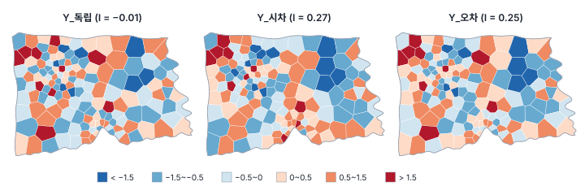
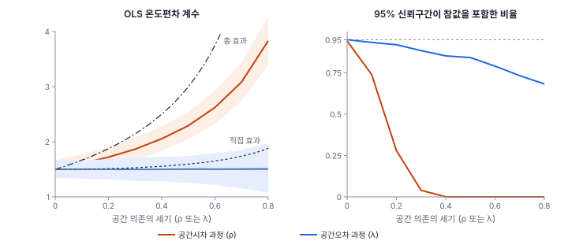
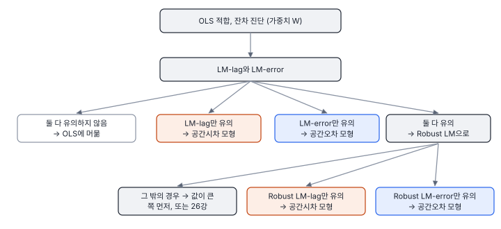
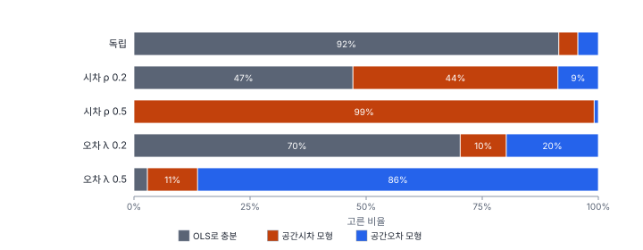

[목차](../README.md) · 이전: [23강 불확실성과 시뮬레이션](23-uncertainty-simulation.md) · 다음: [25강 공간시차 모형](25-spatial-lag.md)

# 24강 왜 공간 회귀인가

> 앱 지원: ● 앱에서 따라 할 수 있음 (모의 실험은 코드로 보충함) · 읽는 시간 약 45분

## 이 강에서 얻는 것

- 회귀 잔차가 공간적으로 닮는 이유를 실질적 의존(파급)과 성가신 의존(빠진 변수 등)으로 나눠 설명할 수 있음
- 공간 의존이 있을 때 OLS가 무엇을 틀리는지(계수의 편의인가, 표준오차의 과소 추정인가)를 모의 실험으로 확인함
- 잔차 Moran's I와 LM 검정을 계산하고 읽을 수 있고, LM 검정으로 모형을 고르는 흐름(Anselin 2005)과 그 한계를 앎
- GeoStat에서 OLS의 공간 진단을 실행하고 결과 카드의 안내를 해석할 수 있음

## 들어가는 질문

8강에서 행정동 150개의 출동률을 고령비율과 온도편차로 회귀했음. 행정동처럼 지역 단위로 모은 자료를 회귀하면 심사위원은 거의 반드시 묻음. "공간 자기상관을 고려했습니까?" 9강에서 본 것처럼 관측치끼리 닮으면 표준오차와 p값을 믿을 수 없기 때문임.

그렇다면 지역 자료는 늘 공간 회귀를 써야 하는가? 무엇을 확인해야 하고, 확인 결과에 따라 어떤 모형으로 가야 하는가? 이 강은 6부의 출발점으로, 그 판단 절차를 다룸. 공간시차 모형은 25강, 공간오차 모형과 그 밖의 모형은 26강에서 자세히 봄.

## 1. 잔차가 닮는 이유

회귀의 오차가 서로 독립이라는 가정(8강)은 지역 자료에서 자주 깨짐. 이웃한 지역의 잔차가 비슷하다면, 그 이유는 크게 두 가지임(Anselin 1988).

- **실질적 의존**(substantive dependence): 이웃의 결과가 나의 결과에 실제로 영향을 줌. 집값이 이웃 동네의 집값을 따라가고, 한 지역의 범죄가 이웃으로 번지고, 한 지자체의 세율이 이웃 지자체의 세율 결정에 영향을 주는 경우임. 이 영향을 **파급**(spillover)이라 부름. 모형에서는 이웃의 y를 설명변수처럼 넣음. 이것이 **공간시차 모형**(spatial lag model)임

$$
y = \rho W y + X\beta + \varepsilon
$$

- **성가신 의존**(nuisance dependence): 이웃끼리 서로 영향을 주지는 않지만, 모형에 넣지 않은 무언가가 공간적으로 이어져 있어 오차가 닮음. 공간적으로 매끄럽게 변하는 빠진 변수, 측정 오차, 행정 경계가 현상의 경계와 맞지 않는 문제(3강)가 원인임. 모형에서는 오차끼리 닮게 함. 이것이 **공간오차 모형**(spatial error model)임

$$
y = X\beta + u, \qquad u = \lambda W u + \varepsilon
$$

W는 3부의 공간가중치 행렬(행 표준화)이고, Wy는 이웃의 y 평균, Wu는 이웃의 오차 평균임. ρ와 λ는 의존의 세기임. ε는 서로 독립인 오차임.

두 모형 말고 셋째 이유도 있음. 관계 자체가 지역마다 달라(공간 이질성) 하나의 계수로 맞춘 모형의 잔차가 지역별로 몰리는 경우임. 이 경우는 7부(GWR)에서 다룸.

두 의존은 지도로는 구별되지 않음. 아래 그림은 이 강을 위해 만든 **연습용 모의 자료**의 세 변수를 OLS로 적합한 잔차임. 세 변수는 모두 고령비율과 온도편차로 만든 같은 회귀식에서 나왔고, 오차의 구조만 다름. 규칙을 공개하는 모의 자료이므로 정답을 알고 방법을 확인할 수 있음(해 보기 참고).

| 변수 | 만든 규칙 |
|---|---|
| Y_독립 | y = 5 + 0.3 × 고령비율 + 1.5 × 온도편차 + ε |
| Y_시차 | 같은 식에 이웃의 y가 더해지는 공간시차 과정, ρ = 0.5 |
| Y_오차 | 같은 식에 오차만 이웃끼리 닮는 공간오차 과정, λ = 0.5 |

ε는 평균 0, 표준편차 1.5인 정규분포이고 세 변수에 같은 값을 썼음. W는 행정동의 퀸 인접을 행 표준화한 것임.



## 2. OLS는 무엇을 틀리는가

공간 의존을 무시하고 OLS를 쓰면 무엇이 틀어지는가? 결론은 두 과정에서 다름.

- **공간오차 과정**: 계수는 평균적으로 맞음(불편). 그러나 같은 자료로 더 정확하게 추정할 수 있는데 그러지 못하고(비효율), 무엇보다 OLS가 보고하는 표준오차가 틀림. 설명변수도 공간적으로 닮았으면 표준오차가 작게 나와 p값이 지나치게 작아짐(9강에서 본 이유와 같음)
- **공간시차 과정**: 계수 자체가 틀림(편의). 빠진 설명변수 Wy가 X와 상관되어 있기 때문임(8강의 누락 변수 편향). 표본이 커져도 줄지 않음

모의 실험으로 확인함. 한빛시 행정동 150개의 실제 고령비율과 온도편차를 그대로 두고, 위의 규칙으로 y를 2,000번씩 새로 만들어 OLS를 적합했음. 의존의 세기(ρ 또는 λ)는 0부터 0.8까지 바꿨음. 두 설명변수는 Moran's I가 각각 0.812와 0.802로 강하게 닮은 변수임.



의존의 세기가 0.5일 때의 수치는 다음과 같음(온도편차 계수의 참값 1.5).

| | OLS 계수 평균 | 계수의 실제 표준편차 | OLS가 보고한 표준오차 평균 | 95% 신뢰구간 포함률 |
|---|---|---|---|---|
| 독립 (0) | 1.502 | 0.085 | 0.083 | 94.3% |
| 공간오차 (λ = 0.5) | 1.504 | 0.124 | 0.090 | 84.3% |
| 공간시차 (ρ = 0.5) | 2.292 | 0.129 | 0.098 | 0.0% |

공간오차 과정에서 계수는 맞지만 표준오차를 실제보다 약 28% 작게 보고해, "95%" 신뢰구간이 84%만 참값을 포함함. λ가 0.8이면 포함률은 68%까지 떨어짐. 공간시차 과정에서는 계수가 1.5에서 2.29로 부풀어 신뢰구간이 한 번도 참값을 포함하지 못함.

공간시차 과정에서는 "참값"이 무엇인지부터 따져야 함. x가 한 지역에서 오르면 그 지역의 y가 오르고, 그것이 이웃의 y를 올리고, 다시 돌아와 그 지역을 올림. 이 되먹임까지 포함한 그 지역 자신의 변화가 직접 효과, 이웃의 변화까지 합친 것이 총 효과임. ρ = 0.5에서 온도편차의 참 직접 효과는 1.594, 이웃까지 합친 총 효과는 3.0임. OLS 계수 2.29는 둘 중 어느 것도 아닌 섞인 값임. 이 효과들은 25강에서 자세히 다룸.

## 3. 잔차의 Moran's I

잔차가 닮았는지는 11강의 Moran's I를 잔차에 적용해 확인함. 행 표준화 가중치에서는 가중치의 합이 n이라 식이 간단해짐.

$$
I = \frac{n}{S_0} \frac{e^\top W e}{e^\top e} = \frac{e^\top W e}{e^\top e}
$$

e는 OLS 잔차 벡터임. 다만 잔차는 원래 변수와 달리 서로 독립이 아니므로(합이 0이고, 설명변수와 직교함) 귀무가설 아래의 기댓값이 −1/(n − 1)이 아니고 tr(MW)/(n − k)임. M은 잔차를 만드는 행렬(I − X(XᵀX)⁻¹Xᵀ), k는 상수를 포함한 계수의 수임(Cliff & Ord 1981). GeoStat과 PySAL은 이 보정을 한 정규 근사 p값을 줌.

### 손으로 해 보기: 한 줄로 놓인 네 지역

지역 1–2–3–4가 한 줄로 이어져 있고, 잔차가 e = (2, 1, −1, −2)임. 행 표준화하면 양 끝 지역은 이웃 하나에 1, 가운데 두 지역은 이웃 둘에 0.5씩 줌.

- We(이웃 잔차의 평균) = (1, 0.5, −0.5, −1)
- eᵀWe = 2 × 1 + 1 × 0.5 + (−1) × (−0.5) + (−2) × (−1) = 5, eᵀe = 4 + 1 + 1 + 4 = 10
- I = 5 / 10 = 0.500

왼쪽은 양수, 오른쪽은 음수로 같은 부호끼리 붙어 있어 양의 자기상관임. 잔차가 (2, −1, 1, −2)처럼 번갈아 놓이면 eᵀWe = −7이고 I = −0.700임.

### 변수가 닮은 것과 잔차가 닮은 것

연습용 자료의 세 변수는 y 자체도 모두 강하게 닮았음. Moran's I가 Y_독립 0.525, Y_시차 0.735, Y_오차 0.593임. 그러나 잔차의 I는 Y_독립 −0.007, Y_시차 0.267, Y_오차 0.250임. Y_독립의 오차는 서로 독립인데도 y가 닮은 것은 설명변수(고령비율, 온도편차)가 닮았기 때문임. 회귀에서 문제가 되는 것은 설명변수로 설명하고 **남은** 부분의 닮음이므로, 공간 회귀가 필요한지는 y가 아니라 잔차로 판단함(9강).

## 4. LM 검정: 어떤 의존인가

잔차 Moran's I는 "의존이 있다"는 것만 말하고, 그것이 시차 과정인지 오차 과정인지는 말하지 않음. 이를 가르는 것이 **라그랑주 승수 검정**(Lagrange multiplier test, LM 검정)임. LM 검정은 OLS 결과만으로 계산하는 검정으로, "ρ = 0" 또는 "λ = 0"이라는 제약을 풀면 우도가 얼마나 좋아질지를 그 지점의 기울기로 잼(스코어 검정). 공간 모형을 직접 추정할 필요가 없어서, 계산이 어렵던 1980~90년대에 표준 절차가 되었음.

- **LM-error**(Burridge 1980): λ = 0을 검정함

$$
LM_{err} = \frac{\left[ e^\top W e / (e^\top e / n) \right]^2}{T}, \qquad T = \mathrm{tr}(W^\top W + W W)
$$

- **LM-lag**(Anselin 1988): ρ = 0을 검정함. 분자는 eᵀWy를 쓰고, 분모에 (WXβ̂)ᵀM(WXβ̂)/σ̂²이 더해짐(σ̂² = eᵀe/n)
- 둘 다 자유도 1인 카이제곱분포를 따름

문제는 두 검정이 서로를 닮았다는 것임. 진짜 과정이 공간시차여도 LM-error가 유의하게 나오고, 반대도 마찬가지임. 그래서 상대 쪽 의존이 있어도 영향을 덜 받도록 고친 **Robust LM**(Anselin, Bera, Florax & Yoon 1996)을 함께 봄. 둘을 동시에 검정하는 **LM-SARMA**(자유도 2)도 있음.

### 손으로 해 보기: LM-error

3절의 네 지역에서 eᵀWe = 5, eᵀe = 10, n = 4임.

- tr(WᵀW)는 W의 모든 원소 제곱의 합으로 1 + 0.25 × 4 + 1 = 3.0임
- tr(WW)는 서로 이웃인 쌍의 w_ij × w_ji를 양방향으로 더한 것으로 2 × (1 × 0.5) + 2 × (0.5 × 0.5) + 2 × (0.5 × 1) = 2.5임
- T = 5.5이고, LM-error = (4 × 5 / 10)² / 5.5 = 0.727(p = 0.394)

관측치가 넷뿐이라 I가 0.5여도 유의하지 않음.

### 판단 흐름

Anselin(2005)이 GeoDa 실습서에 정리한 흐름이 실무의 표준이 되었음. GeoStat도 OLS 결과 카드 아래에 이 흐름에 따른 안내를 한 줄로 보여 줌.



연습용 자료에 적용하면 다음과 같음(퀸 인접, 행 표준화).

| | 잔차 I | LM-lag | Robust LM-lag | LM-error | Robust LM-error | 안내 |
|---|---|---|---|---|---|---|
| Y_독립 | −0.007 | 0.005 (p 0.945) | 0.003 (p 0.955) | 0.021 (p 0.886) | 0.019 (p 0.890) | OLS로 충분 |
| Y_시차 | 0.267 | 51.48 (p < 0.001) | 24.17 (p < 0.001) | 27.79 (p < 0.001) | 0.478 (p 0.489) | 공간시차 |
| Y_오차 | 0.250 | 14.60 (p < 0.001) | 0.001 (p 0.977) | 24.39 (p < 0.001) | 9.792 (p 0.002) | 공간오차 |

세 변수 모두 맞게 골랐음. Y_시차와 Y_오차에서는 두 LM이 모두 유의했고, Robust LM이 정답 쪽만 유의하게 남아 갈랐음.

### 이 흐름은 얼마나 믿을 만한가

한 번 맞았다고 늘 맞는 것은 아님. 2절의 모의 실험에서 매번 이 흐름대로 모형을 골라 봤음.



- 의존이 없을 때 공간 모형을 잘못 고르는 비율은 8~9%임. 검정을 여러 번 하기 때문에 유의수준 5%보다 높음(7강의 다중검정)
- 의존이 약하면(0.2) 놓치는 경우가 많음. 행정동 150개로는 약한 의존을 잡을 힘이 부족함
- ρ = 0.5인 공간시차 과정은 99%를 맞게 골랐음. λ = 0.5인 공간오차 과정은 86%를 맞게 고르고 11%를 공간시차로 잘못 골랐음

### 검정보다 앞서는 것

LM 검정은 W가 맞고, 설명변수가 빠짐없이 들어가 있다는 전제에서 시차와 오차 둘 중 어느 쪽인지를 물음. 이 전제가 깨지면 검정은 엉뚱한 답을 줌. Y_독립은 오차가 독립인 자료인데, 온도편차를 빼고 고령비율만으로 회귀하면 잔차 Moran's I가 0.416이 되고 안내는 "공간시차 모형을 검토할 만함"(Robust LM-lag만 유의, p 0.003)이 됨. 고령비율의 계수는 참값 0.3과 부호가 반대인 −0.178이 됨. 빠진 공간 변수가 만든 성가신 의존을 파급으로 오인하는 것임.

그래서 순서가 중요함.

1. 이론이 먼저임. "이웃의 y가 나의 y에 영향을 줄 메커니즘이 있는가?" 집값, 세율 경쟁, 확산처럼 메커니즘이 분명하면 공간시차를, 그렇지 않으면 오차 쪽을 먼저 생각함
2. 공간적으로 이어진 빠진 변수가 없는지 찾음. 공간 모형은 빠진 변수를 대신하지 못함
3. 그다음 LM 검정과 모형 비교로 확인함. 두 Robust LM이 모두 유의하면 두 의존을 함께 넣는 모형이나 공간 더빈 모형(26강)을 검토함
4. 결과가 W에 따라 달라지는지 확인함(27강의 민감도 분석)

## 5. 한빛시 출동률에서는

8강의 출동률 회귀로 돌아감. 출동률 자체는 Moran's I가 0.092(순열 p 0.031)로 약하게 닮았음.

- **M1**(고령비율만): 잔차 I = 0.077, 정규 근사 p = 0.071, 순열 999회 p = 0.050. LM-lag 2.442(p 0.118), LM-error 2.303(p 0.129)로 둘 다 유의하지 않음. 안내는 "LM 검정상 공간 의존성이 뚜렷하지 않음 → OLS로 충분할 수 있음"
- **M3**(고령비율 + 온도편차): 잔차 I = −0.030(정규 근사 p 0.787), LM-lag 0.361(p 0.548), LM-error 0.341(p 0.559)

고령비율만 넣었을 때 경계선에 있던 잔차의 닮음은 온도편차를 넣자 사라졌음. 출동률에는 공간 회귀가 필요하다는 증거가 없어, 공간 의존 측면에서는 8강의 OLS로 충분함(이분산은 8강에서 본 대로 따로 다룸). 지역 자료라고 해서 늘 공간 회귀가 필요한 것은 아니며, 그 판단의 근거가 이 강의 진단임. 보고서에는 진단 결과를 적어 "공간 자기상관을 고려했는가"라는 질문에 답함.

## 해 보기: GeoStat에서 공간 진단하기

1. 연습용 파일 `book/data/practice/hanbit_dong_sim.gpkg`를 엶. 행정동 150개에 `고령비율`, `온도편차`(8강과 같은 방법으로 계산한 값)와 모의 변수 `Y_독립`, `Y_시차`, `Y_오차`가 들어 있음
2. **공간 분석 → 공간가중치 만들기…** 메뉴에서 **퀸 인접 (Queen)** 가중치를 만듦
   - 확인: 왼쪽 **공간가중치** 칸에 "평균 5.41 · 최소 2 · 최대 8"
3. **공간 분석 → 회귀 분석 (OLS · 공간회귀 · GWR · MGWR)…** 메뉴를 엶. 모형 **OLS (최소제곱)**, 종속변수 (y) `Y_독립`, 독립변수 `고령비율`과 `온도편차`를 고름. **공간 진단 (잔차 Moran's I, LM 검정)** 칸이 켜져 있고 2번의 가중치가 골라져 있는지 확인하고, 결과 열 접두어 `O1`로 실행함
   - 확인: 계수 고령비율 0.2487, 온도편차 1.474. 진단 표의 **공간 의존성**에 잔차 Moran's I −0.007293(p 0.854), LM (lag) 0.004809, LM (error) 0.02073이 나오고, 맨 아래에 "LM 검정상 공간 의존성이 뚜렷하지 않음 → OLS로 충분할 수 있음"이라고 나옴
4. 같은 방법으로 종속변수 `Y_시차`, 접두어 `O2`로 실행함
   - 확인: 온도편차 계수 2.271(참값 1.5보다 큼), 잔차 Moran's I 0.267, LM (lag) 51.48, Robust LM (lag) 24.17, LM (error) 27.79, Robust LM (error) 0.4778(p 0.489). 안내는 "두 LM이 모두 유의하고 Robust LM-lag만 유의함 → 공간시차 모형을 검토할 만함"
5. 종속변수 `Y_오차`, 접두어 `O3`으로 실행함
   - 확인: 잔차 Moran's I 0.2501, LM (lag) 14.6, Robust LM (lag) 8.63e-4(p 0.977), LM (error) 24.39, Robust LM (error) 9.792(p 0.002). 안내는 "두 LM이 모두 유의하고 Robust LM-error만 유의함 → 공간오차 모형을 검토할 만함"
6. `O2` 결과 카드의 **잔차 지도** 단추를 눌러 잔차의 표준편차 지도를 보고, **잔차 Moran's I** 단추로 Moran 산점도를 그림
   - 확인: 산점도의 I가 0.2670으로 진단 표(0.267)와 같음. 순열 검정이라 p값은 진단 표(정규 근사)와 다를 수 있음
7. 4절의 함정을 재현함. 종속변수 `Y_독립`, 독립변수 `고령비율` 하나만 고르고 접두어 `O4`로 실행함
   - 확인: 고령비율 계수 −0.1775, 잔차 Moran's I 0.4157, Robust LM (lag) 8.933(p 0.003), Robust LM (error) 1.923(p 0.166). 오차가 독립인 자료인데 안내가 "공간시차 모형을 검토할 만함"이라고 나옴
8. (선택) 8강의 1~5번을 따라 `hanbit_dong`에서 출동률 회귀를 다시 실행하되, 퀸 인접 가중치를 만들어 공간 진단을 켬
   - 확인: M1의 LM (lag) 2.442(p 0.118), M3의 잔차 Moran's I −0.02956(p 0.787)

### 코드로: LM 검정

```python
import warnings

import geopandas as gpd
import libpysal
import spreg

warnings.filterwarnings("ignore")
sim = gpd.read_file("book/data/practice/hanbit_dong_sim.gpkg")
w = libpysal.weights.Queen.from_dataframe(sim, use_index=True)
w.transform = "r"                                          # 행 표준화 (앱과 같음)
X = sim[["고령비율", "온도편차"]].to_numpy()

for y in ["Y_독립", "Y_시차", "Y_오차"]:
    m = spreg.OLS(sim[[y]].to_numpy(), X, w=w, spat_diag=True, moran=True, name_y=y, name_x=["고령비율", "온도편차"])
    print(f"{y}: 잔차 I {m.moran_res[0]:.3f} | LM-lag {m.lm_lag[0]:.3f} (p {m.lm_lag[1]:.3f}), "
          f"LM-error {m.lm_error[0]:.3f} (p {m.lm_error[1]:.3f}) | "
          f"Robust LM-lag p {m.rlm_lag[1]:.3f}, Robust LM-error p {m.rlm_error[1]:.3f}")
```

- 확인: 4절의 표와 같은 값이 나옴(Y_시차의 LM-lag 51.481, Y_오차의 Robust LM-error p 0.002 등). p < 0.001은 0.000으로 찍힘
- 더 해 보기: `print(m.summary)`로 GeoDa 형식의 전체 보고서를 봄. 가중치를 `libpysal.weights.KNN.from_dataframe(sim, k=6)`으로 바꾸면 검정값이 얼마나 달라지는지 확인함(27강)

## 헷갈리는 쌍

- **실질적 의존 vs 성가신 의존**: 이웃의 y가 나의 y에 영향을 주는가(공간시차), 아니면 모형 밖의 무언가가 공간적으로 이어져 오차가 닮는가(공간오차). 앞의 것은 그 자체가 연구 대상이고, 뒤의 것은 추론을 바로잡아야 할 대상임
- **y의 Moran's I vs 잔차의 Moran's I**: y가 닮은 것은 설명변수가 닮아서일 수 있음. 공간 회귀가 필요한지는 잔차로 봄
- **LM vs Robust LM**: LM은 상대 쪽 의존이 있으면 함께 유의해짐. Robust LM은 상대 쪽 의존을 감안해 고친 것이라, 둘 다 유의할 때 가르는 데 씀
- **편의 vs 비효율**: 공간시차 과정을 OLS로 적합하면 계수가 틀림(편의). 공간오차 과정이면 계수는 맞지만 표준오차가 틀림(비효율과 잘못된 추론)

## 흔한 실수와 심사 지적

- **지역 자료라서 공간 회귀를 썼다고만 씀**
  - 지적: "왜 공간시차 모형입니까? 공간오차나 OLS가 아닌 근거는 무엇입니까?"
  - 대응: 잔차 Moran's I, LM 검정, 이론적 근거를 함께 제시함
- **y의 Moran's I가 크다는 이유로 공간 회귀를 씀**
  - 대응: OLS 잔차로 진단함. 설명변수가 공간 구조를 설명하면 OLS로 충분함
- **LM 검정 결과만으로 "파급효과가 있다"고 해석함**
  - 지적: "빠진 공간 변수 때문이 아니라는 근거가 있습니까?"
  - 대응: 공간적으로 이어진 후보 변수를 넣어 보고, 메커니즘을 이론으로 설명함. 해 보기 7번처럼 변수 하나가 빠져도 LM은 공간시차를 가리킴
- **공간 진단 없이 OLS의 p값을 보고함**
  - 대응: 잔차 Moran's I를 보고함. 의존이 남아 있으면 공간 모형을 쓰거나, 공간 자기상관에 강건한 HAC 표준오차(Kelejian & Prucha 2007)를 씀. White 강건 표준오차는 이분산만 바로잡고 공간 의존은 바로잡지 못함
- **가중치 하나로만 진단함**
  - 대응: 주된 가중치를 근거와 함께 정하고, 다른 가중치에서도 결론이 같은지 확인함(27강)

## 보고서에는 이렇게 씀

> 행정동별 출동률(인구 1만 명당)을 고령비율과 평균 지표온도로 설명하는 최소제곱 회귀모형을 추정하고, 퀸 인접(행 표준화) 공간가중치로 잔차의 공간 의존성을 진단하였다. 잔차의 Moran's I는 −0.030(p = 0.787)이었고, 라그랑주 승수 검정(LM-lag 0.361, p = 0.548; LM-error 0.341, p = 0.559)에서도 공간 의존성이 확인되지 않아 최소제곱 추정 결과를 최종 모형으로 보고하였다. 고령비율만 포함한 모형에서는 잔차의 Moran's I가 0.077(p = 0.071)로 경계 수준이었으나, 지표온도를 추가한 뒤 사라졌다.

적어야 할 항목은 다음과 같음.

- 공간가중치의 종류와 표준화 방법, 선택 근거
- 잔차 Moran's I와 그 p값(정규 근사인지 순열인지)
- LM-lag, LM-error와 필요하면 Robust LM의 값과 p값
- 최종 모형을 고른 근거(검정 결과와 이론)

## 요약

- 잔차가 닮는 이유는 이웃의 y가 영향을 주는 실질적 의존(공간시차)과, 빠진 공간 변수 등으로 오차가 닮는 성가신 의존(공간오차)으로 나뉨
- 공간오차 과정에서 OLS 계수는 맞지만 표준오차가 작게 나옴(λ = 0.5에서 95% 신뢰구간 포함률 84%). 공간시차 과정에서는 계수 자체가 틀림(ρ = 0.5에서 1.5가 2.29로)
- 공간 회귀가 필요한지는 y가 아니라 잔차의 Moran's I로 판단함
- LM 검정과 Robust LM은 시차와 오차를 가르는 출발점이지만, 빠진 변수가 있으면 엉뚱한 쪽을 가리킴. 이론과 변수 점검이 먼저임
- 한빛시 출동률은 온도편차를 넣은 뒤 잔차 의존이 없어 OLS로 충분했음

## 핵심 용어

| 한글 | 영문 | 비고 |
|---|---|---|
| 실질적 의존 | Substantive Dependence | 파급, 공간시차 |
| 성가신 의존 | Nuisance Dependence | 공간오차 |
| 파급 | Spillover | |
| 공간시차 모형 | Spatial Lag Model (SAR) | 25강, GeoDa: Spatial Lag |
| 공간오차 모형 | Spatial Error Model (SEM) | 26강 |
| 잔차 Moran's I | Moran's I for Residuals | Cliff & Ord 1981 |
| 라그랑주 승수 검정 | Lagrange Multiplier (LM) Test | 스코어 검정 |
| 강건 LM 검정 | Robust LM Test | Anselin 외 1996 |
| LM-SARMA | LM-SARMA | 두 의존 동시 검정 |
| 편의 | Bias | |
| 효율성 | Efficiency | |

## 원전과 더 읽을거리

**원전**

- Anselin, L. (1988). *Spatial Econometrics: Methods and Models*. Kluwer Academic. 공간 회귀 모형과 LM 검정의 체계
- Burridge, P. (1980). On the Cliff-Ord test for spatial correlation. *Journal of the Royal Statistical Society: Series B*, 42(1), 107–108. LM-error
- Anselin, L., Bera, A. K., Florax, R., & Yoon, M. J. (1996). Simple diagnostic tests for spatial dependence. *Regional Science and Urban Economics*, 26(1), 77–104. Robust LM
- Kelejian, H. H., & Prucha, I. R. (2007). HAC estimation in a spatial framework. *Journal of Econometrics*, 140(1), 131–154. 공간 HAC 표준오차
- Cliff, A. D., & Ord, J. K. (1981). *Spatial Processes: Models and Applications*. Pion. 잔차의 Moran's I

**더 읽을거리**

- Anselin, L. (2005). *Exploring Spatial Data with GeoDa: A Workbook*. Center for Spatially Integrated Social Science. 회귀 진단과 공간 회귀 장(판단 흐름 포함)
- Anselin, L., & Rey, S. J. (2014). *Modern Spatial Econometrics in Practice*. GeoDa Press. PySAL·GeoDa로 하는 실습
- LeSage, J., & Pace, R. K. (2009). *Introduction to Spatial Econometrics*. CRC Press. 1~2장
- Rey, S. J., Arribas-Bel, D., & Wolf, L. J. (2023). *Geographic Data Science with Python*. CRC Press. 11장(공간 회귀)

## 연습

1. 한 줄로 놓인 네 지역(1–2–3–4, 행 표준화)의 잔차가 e = (1, −1, 1, −1)이면 잔차 Moran's I와 LM-error는 얼마인가? (T = 5.5)

2. 연습용 자료의 Y_독립은 Moran's I가 0.525로 강하게 닮았는데, 고령비율과 온도편차로 회귀한 잔차의 I는 −0.007이었음. 이 결과를 어떻게 읽는가?

3. 2절의 모의 실험에서 공간오차 과정(λ = 0.5)의 OLS 95% 신뢰구간은 참값을 84%만 포함했음. 이것이 온도편차의 효과가 0인지 검정하는 상황이라면 어떤 문제가 생기는가?

4. 어떤 연구에서 LM-lag와 LM-error가 모두 유의하고, Robust LM-lag와 Robust LM-error도 모두 유의하게 나왔음. 어떻게 하는가?

5. 해 보기 7번에서 오차가 독립인 Y_독립을 고령비율 하나로 회귀했더니 GeoStat이 공간시차 모형을 권했음. 이 안내를 따라 공간시차 모형을 쓰고 "이웃 동의 값이 파급된다"고 보고하면 무엇이 잘못인가?

<details>
<summary>해답</summary>

1. We = (−1, 1, −1, 1)이라 eᵀWe = −1 − 1 − 1 − 1 = −4, eᵀe = 4이므로 I = −1.0(완전한 음의 자기상관). LM-error = (4 × (−4) / 4)² / 5.5 = 16 / 5.5 = 2.91(p = 0.088). 관측치가 넷뿐이라 이것도 5%에서 유의하지 않음.

2. y가 닮은 것은 공간적으로 닮은 설명변수(Moran's I 0.81, 0.80) 때문이고, 설명변수로 설명하고 남은 부분에는 공간 구조가 없다는 뜻임. 공간 회귀가 필요하지 않음. y의 Moran's I만 보고 공간 회귀를 고르면 안 되는 이유임.

3. 표준오차가 실제보다 작게 나오므로 t값이 커지고 p값이 지나치게 작아짐. 효과가 실제로는 0인 변수도 5%보다 훨씬 자주 "유의하다"고 나옴(1종 오류 증가). 계수의 크기는 평균적으로 맞더라도, 유의성 판단을 믿을 수 없음.

4. 두 의존이 함께 있거나, 다른 모형(공간 더빈 모형 등)이 맞을 가능성이 있음. 값이 더 큰 쪽을 먼저 추정해 보되, 두 의존을 함께 넣는 모형(SARAR)이나 공간 더빈 모형을 추정해 비교함(26강). 빠진 공간 변수와 가중치 선택도 다시 점검함.

5. 잔차의 닮음은 공간적으로 닮은 온도편차를 빼서 생긴 것(성가신 의존)이지 파급이 아님. 공간시차 모형의 ρ는 빠진 온도편차의 공간 구조를 대신 흡수할 뿐임. 또 고령비율의 계수는 부호까지 틀려 있음(−0.178, 참값 0.3). 먼저 빠진 변수를 찾아 넣어야 함. 온도편차를 넣으면 잔차 의존이 사라짐(해 보기 3번).

</details>

---

[목차](../README.md) · 이전: [23강 불확실성과 시뮬레이션](23-uncertainty-simulation.md) · 다음: [25강 공간시차 모형](25-spatial-lag.md)
