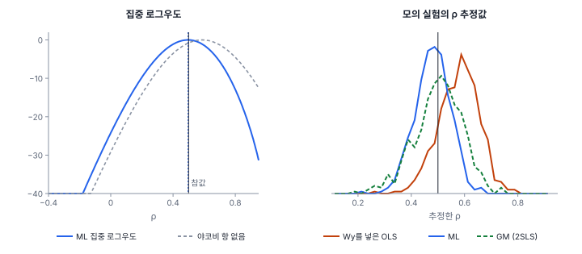
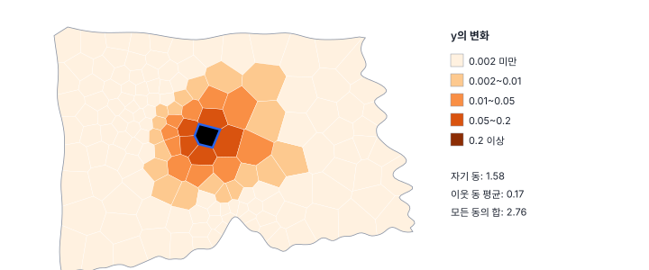
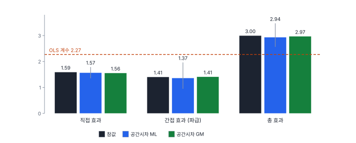

[목차](../README.md) · 이전: [24강 왜 공간 회귀인가](24-why-spatial-regression.md) · 다음: [26강 공간오차 모형과 모형 계보](26-spatial-error-and-family.md)

# 25강 공간시차 모형

> 앱 지원: ● 앱에서 따라 할 수 있음 (효과의 신뢰구간과 모의 실험은 코드로 보충함) · 읽는 시간 약 45분

## 이 강에서 얻는 것

- 공간시차 모형의 식이 왜 "동시에" 정해지는 체계인지, 공간 승수 (I − ρW)⁻¹가 무엇을 뜻하는지 손으로 계산해 앎
- Wy를 설명변수로 넣은 OLS가 왜 틀리는지 알고, 최대우도(ML)와 2단계 최소제곱(2SLS·GM) 추정의 원리를 앎
- ρ와 β를 OLS 계수처럼 읽으면 안 되는 이유를 알고, 직접·간접·총 효과(LeSage & Pace 2009)로 결과를 해석하고 보고할 수 있음

## 들어가는 질문

24강의 연습용 자료에서 Y_시차는 LM 검정이 공간시차 모형을 가리켰음. 이 자료를 만든 규칙은 "이웃 동의 y 평균이 내 동의 y에 0.5배만큼 더해진다"였음. 이런 자료로 공간시차 모형을 추정하면 무엇이 나오고, 그 숫자를 어떻게 읽어야 하는가? 특히 "온도편차가 1℃ 높으면 y가 얼마나 높아지는가"라는 질문에, OLS 계수(2.27), 공간시차 모형의 계수(1.48), 또는 그 밖의 어떤 숫자로 답해야 하는가?

## 1. 모형: 이웃의 y가 나의 y에 들어감

공간시차 모형(spatial lag model, spatial autoregressive model, SAR)은 다음과 같음(Ord 1975; Anselin 1988).

$$
y = \rho W y + X\beta + \varepsilon, \qquad \varepsilon \sim N(0, \sigma^2 I)
$$

Wy는 이웃의 y 평균(행 표준화 W)이고, ρ는 그 영향의 세기임. 겉모습은 회귀에 설명변수 Wy 하나를 더한 것이지만, 성질은 크게 다름. 내 y가 이웃의 y로 정해지고, 이웃의 y는 다시 내 y로 정해지기 때문임. 모든 지역의 y가 **동시에** 정해지는 체계라서, y에 대해 풀어야 실제로 무엇이 무엇을 정하는지 보임.

$$
y = (I - \rho W)^{-1} X\beta + (I - \rho W)^{-1} \varepsilon
$$

(I − ρW)⁻¹를 **공간 승수**(spatial multiplier)라 함. |ρ| < 1이고 W가 행 표준화이면 다음처럼 펼쳐짐.

$$
(I - \rho W)^{-1} = I + \rho W + \rho^2 W^2 + \rho^3 W^3 + \cdots
$$

x의 변화는 먼저 그 지역의 y를 바꾸고(I), 이웃의 y로 번지고(ρW), 이웃의 이웃으로 번지며(ρ²W²), 그 일부는 다시 처음 지역으로 돌아옴. 연못에 돌을 던졌을 때의 물결과 메아리에 해당함.

### 손으로 해 보기: 세 지역

지역 1–2–3이 한 줄로 이어져 있고 행 표준화하면 W의 행은 (0, 1, 0), (0.5, 0, 0.5), (0, 1, 0)임. ρ = 0.5이면 공간 승수는 다음과 같음.

$$
(I - 0.5W)^{-1} = \begin{pmatrix} 1.1667 & 0.6667 & 0.1667 \\ 0.3333 & 1.3333 & 0.3333 \\ 0.1667 & 0.6667 & 1.1667 \end{pmatrix}
$$

모든 행의 합이 2 = 1/(1 − 0.5)임. 계수가 β = 2일 때 지역 1의 x만 1 오르면 y의 변화는 β × 첫째 열 = (2.333, 0.667, 0.333)임.

- 지역 1은 β = 2보다 큰 2.333만큼 오름. 0.333은 이웃으로 번졌다가 되돌아온 몫(메아리)임
- 바로 이웃인 지역 2는 0.667, 이웃의 이웃인 지역 3은 0.333만큼 오름
- 급수로 확인하면, (1,1) 원소는 1 → 1 → 1.125 → 1.125 → 1.156 → …으로 1.1667에 다가가고, (2,1) 원소는 0 → 0.25 → 0.25 → 0.3125 → 0.3125 → 0.328 → …으로 0.3333에 다가감. 홀수 단계에서는 이웃으로 나가고, 짝수 단계에서 돌아옴

이처럼 공간시차 모형에서 x 하나의 변화는 모든 지역의 y를 바꿈. 그래서 "x가 1 오르면 y가 β만큼 오른다"는 OLS식 해석이 성립하지 않음(3절).

## 2. 추정

### Wy를 그냥 넣은 OLS는 틀림

Wy는 이웃의 y이고, 이웃의 y에는 이웃의 오차가, 그리고 메아리를 통해 나 자신의 오차 ε_i도 들어 있음. 설명변수가 오차와 상관되어 있으므로(**내생성**, endogeneity) OLS는 일치추정량이 아님. 연습용 자료와 같은 규칙(ρ = 0.5)으로 y를 500번 만들어 Wy를 설명변수로 넣은 OLS로 ρ를 추정하면 평균 0.579로 크게 나옴(아래 그림 오른쪽).

### 최대우도(ML)

Ord(1975)는 이 모형의 우도를 정리했음. ε가 정규분포이면 y의 로그우도는 다음과 같음.

$$
\ln L(\rho, \beta, \sigma^2) = -\frac{n}{2}\ln(2\pi\sigma^2) + \ln\lvert I - \rho W\rvert - \frac{1}{2\sigma^2}(y - \rho W y - X\beta)^\top (y - \rho W y - X\beta)
$$

보통의 회귀 우도와 다른 것은 가운데의 **야코비 항** ln|I − ρW|임. y를 ε로 바꾸는 변환의 부피 변화를 반영하는 항으로, 이 항이 Wy를 넣은 OLS의 치우침을 바로잡음. W의 고유값을 ω₁, …, ωₙ이라 하면 ln|I − ρW| = Σ ln(1 − ρωᵢ)이라 한 번 고유값을 구해 두면 빨리 계산됨(Ord 1975). 실제로는 β와 σ²를 ρ의 함수로 풀어 넣은 **집중 로그우도**를 ρ 하나에 대해 최대화함.



Y_시차의 집중 로그우도는 ρ = 0.4961에서 최대임. 야코비 항을 빼면 0.5872에서 최대가 되어 ρ를 크게 잡음.

ρ가 가질 수 있는 범위도 고유값이 정함. I − ρW가 역행렬을 가지려면 ρ가 1/ω_min과 1/ω_max 사이에 있어야 함. 행 표준화 W에서는 ω_max = 1임. 한빛시 퀸 인접의 가장 작은 고유값은 −0.573이라 ρ의 범위는 (−1.746, 1)임. 대부분의 응용에서 ρ는 0과 1 사이에 놓임(음수는 이웃끼리 경쟁하는 경우임).

### 2단계 최소제곱(2SLS)과 GM

내생 변수 Wy를 오차와 상관없는 **도구변수**로 대신하는 방법도 있음(Anselin 1988; Kelejian & Prucha 1998). 축약형에서 E[Wy] = W(I − ρW)⁻¹Xβ = WXβ + ρW²Xβ + …이므로, WX와 W²X가 Wy를 잘 예측하면서 ε와는 상관이 없어 도구변수로 적합함. 1단계에서 Wy를 [X, WX]로 회귀해 예측값을 만들고, 2단계에서 그 예측값을 Wy 대신 넣어 OLS를 함. GeoStat의 공간시차 모형 GM 추정(**공간시차 모형 — GM (2SLS)** 모형)은 WX를 도구변수로 씀.

- 정규분포 가정이 필요 없고, 큰 자료에서도 빠름. 고유값이나 행렬식을 계산하지 않기 때문임
- 대신 ML보다 덜 정확함. 모의 실험에서 ρ̂의 표준편차는 ML 0.066, 2SLS 0.089였음
- ML은 이 크기(n = 150)에서 평균 0.480으로 참값보다 조금 작게 나왔고, 2SLS는 평균 0.502였음. 표본이 커지면 둘 다 참값에 가까워짐
- 우도가 없으므로 AIC로 다른 모형과 비교할 수 없음
- 설명변수의 계수가 모두 0에 가깝거나 X가 공간적으로 거의 변하지 않으면 WX가 Wy를 잘 예측하지 못해 도구변수가 약해지고, ρ 추정이 불안정해짐

## 3. 효과: 계수를 그대로 읽으면 안 되는 이유

축약형에서 x_r(r번째 설명변수)을 바꿀 때 y가 바뀌는 양은 n × n 행렬로 나옴(LeSage & Pace 2009).

$$
\frac{\partial y}{\partial x_r^\top} = S_r(W) = (I - \rho W)^{-1} \beta_r
$$

(i, j) 원소는 "지역 j의 x_r이 1 오를 때 지역 i의 y가 오르는 양"임. 이 행렬을 세 숫자로 요약함.

- **직접 효과**(direct effect): 대각 원소의 평균. 한 지역의 x가 오를 때 **그 지역**의 y가 오르는 양(메아리 포함)
- **총 효과**(total effect): 행 합의 평균. **모든 지역**의 x가 함께 1 오를 때 한 지역의 y가 오르는 양. 같은 값을 "한 지역의 x가 오를 때 모든 지역의 y 변화의 합"을 평균한 것으로 읽을 수도 있음. 행 표준화 W에서는 β_r/(1 − ρ)임
- **간접 효과**(indirect effect, 파급): 총 효과 − 직접 효과

손계산의 세 지역(ρ = 0.5, β = 2)에서 직접 효과는 2 × (1.1667 + 1.3333 + 1.1667)/3 = 2.444, 총 효과는 2/(1 − 0.5) = 4, 간접 효과는 1.556임.



연습용 자료의 참 규칙(ρ = 0.5, 온도편차 β = 1.5)에서 승수의 대각 평균은 1.0628이라, 온도편차의 참 직접 효과는 1.594, 총 효과는 3.0, 간접 효과는 1.406임. 직접 효과가 β보다 조금 큰 것은 메아리 때문이고, 간접 효과가 직접 효과에 가까울 만큼 큰 것은 ρ = 0.5가 작지 않은 의존이기 때문임.

### Y_시차의 추정 결과

| | ρ | 온도편차 계수 | 직접 효과 | 간접 효과 | 총 효과 |
|---|---|---|---|---|---|
| 참값 | 0.5 | 1.5 | 1.594 | 1.406 | 3.000 |
| OLS | – | 2.271 | – | – | – |
| 공간시차 ML | 0.4961 | 1.481 | 1.572 | 1.366 | 2.938 |
| 공간시차 GM (2SLS) | 0.5073 | 1.463 | 1.558 | 1.411 | 2.969 |



- 공간시차 모형은 ρ, β, 세 효과를 모두 참값 가까이 찾았음
- 효과의 불확실성은 ML 추정의 점근 분포에서 (β, ρ)를 2,000번 뽑아 효과를 다시 계산해 구했음(LeSage & Pace 2009가 ML 추정에 제안한 모의 방식). 온도편차의 95% 구간은 직접 1.353~1.785, 간접 0.949~1.964, 총 2.563~3.471로 참값을 모두 포함함. 간접 효과는 ρ의 불확실성을 고스란히 받아 구간이 넓음
- OLS 계수 2.271은 직접 효과(1.594)도 총 효과(3.0)도 아닌, 둘이 섞인 값임(24강)
- 공간시차 모형의 계수 β = 1.481도 그 자체로는 한계효과가 아님. 직접 효과(1.572)와도 다름

"온도편차가 1℃ 높으면 y가 얼마나 높은가"에 답하려면 질문을 나눠야 함. 한 동만 더워졌을 때 그 동의 y는 평균 약 1.57 오르고(직접), 이웃 동들까지 합치면 평균 약 2.94가 오름(총, 어느 동이 더워졌는지에 따라 다름). 도시 전체가 1℃ 더워지면 각 동의 y가 약 2.94씩 오름.

## 4. 공간시차 모형은 언제 쓰는가

- **파급 자체가 연구 질문일 때**: 집값, 세율 경쟁, 정책 확산, 감염처럼 이웃의 결과가 나의 결과에 영향을 줄 메커니즘이 있을 때임. 이때는 효과 분해가 핵심 결과임
- **필터로 쓸 때**: 파급에 관심이 없더라도 공간시차 과정이 있다면 OLS의 β가 치우치므로, ρWy를 넣어 β를 바로잡는 용도로 씀. 이때도 보고하는 해석은 효과로 함

반대로 공간시차 모형이 맞는다는 증거로 ρ의 유의성만 내세우면 위험함. 24강 연습용 자료의 Y_오차(오차만 닮은 자료)에 공간시차 모형을 적합해도 ρ = 0.324(p < 0.001)로 유의하게 나옴. 파급이 없는 자료에서 "유의한 파급"이 나오는 것임. 공간오차 모형과의 비교가 26강의 주제임.

한빛시 출동률에서는 공간시차 모형이 필요하다는 증거가 없음. 8강의 M3(고령비율 + 온도편차)에 공간시차 모형을 적합하면 ρ = −0.076(p 0.559)이고, OLS와의 우도비 검정도 0.357(p 0.550)임. 24강의 진단과 같은 결론임.

## 해 보기: GeoStat에서 공간시차 모형 추정하기

1. 24강처럼 `book/data/practice/hanbit_dong_sim.gpkg`를 열고 **퀸 인접 (Queen)** 공간가중치를 만듦
2. **공간 분석 → 회귀 분석 (OLS · 공간회귀 · GWR · MGWR)…** 메뉴에서 모형 **OLS (최소제곱)**, 종속변수 (y) `Y_시차`, 독립변수 `고령비율`과 `온도편차`, 결과 열 접두어 `O2`로 실행함(24강에서 했으면 건너뜀)
3. 회귀 분석 창을 다시 열어 모형 목록에서 **공간시차 모형 (Spatial Lag)** 항목을 고름. 가중치 선택이 나타나면 1번의 퀸 인접을 고르고, 같은 변수로 접두어 `L1`로 실행함
   - 확인: 요약에 ρ (공간시차 계수) 0.4961, 유사 R² 0.894, 로그우도 −265. 계수 표에 고령비율 0.2492, 온도편차 1.481, ρ (W_y) 0.4961(표준오차 0.06347, z 7.82)
   - 확인: **직접·간접·총 효과 (정확 계산 (역행렬))** 표에 온도편차 직접 1.572, 간접 (파급) 1.366, 총 2.938과 고령비율 0.2645, 0.2299, 0.4944
   - 확인: 진단의 우도비 검정 (vs OLS) 48.42(p < 0.001), 잔차 Moran's I (순열 999회) −0.005243(p 0.500)
   - 확인: **모형 비교** 카드에서 Y_시차의 OLS AICc 586.782, Lag (ML) AICc 540.505이고 Lag (ML)에 **최적** 표시가 붙음
4. 모형 **공간시차 모형 — GM (2SLS)** 항목으로 같은 변수를 접두어 `L2`로 실행함
   - 확인: ρ (공간시차 계수) 0.5073, 온도편차 1.463, 효과 표의 온도편차 직접 1.558, 간접 (파급) 1.411, 총 2.969. 진단에 Anselin-Kelejian (잔차 공간 의존성) 0.02879(p 0.865)
   - 확인: 모형 비교 카드에는 Lag (GM)의 로그우도와 AICc가 "–"로 나오고 최적 비교에서 빠짐
5. 손계산을 확인함. 효과 표의 온도편차 총 효과 2.938은 계수 1.481 ÷ (1 − 0.4961)과 같음
6. 모형 **공간시차 모형 (Spatial Lag)**, 종속변수 `Y_오차`, 접두어 `L3`으로 실행함
   - 확인: ρ (W_y) 0.3239(p < 0.001). 오차만 닮은 자료인데도 "유의한 ρ"가 나옴. 26강에서 이어서 봄

### 코드로: 효과를 직접 계산하기

```python
import warnings

import geopandas as gpd
import libpysal
import numpy as np
import spreg

warnings.filterwarnings("ignore")
sim = gpd.read_file("book/data/practice/hanbit_dong_sim.gpkg")
w = libpysal.weights.Queen.from_dataframe(sim, use_index=True)
w.transform = "r"
names = ["고령비율", "온도편차"]
m = spreg.ML_Lag(sim[["Y_시차"]].to_numpy(), sim[names].to_numpy(), w, name_x=names, method="full", spat_impacts=None)
rho = m.rho.item()
beta = m.betas.ravel()[1:3]                              # 상수 다음의 두 계수
print(f"ρ = {rho:.4f} (표준오차 {m.std_err[-1]:.4f}), 로그우도 {m.logll:.3f}")

W = w.full()[0]
n = len(sim)
S = np.linalg.inv(np.eye(n) - rho * W)                   # 공간 승수 (I − ρW)⁻¹
direct, total = np.trace(S) / n, S.sum() / n
for name, b in zip(names, beta):
    print(f"{name}: 계수 {b:.4f} | 직접 {b * direct:.4f}, 간접 {b * (total - direct):.4f}, 총 {b * total:.4f}")
```

- 확인: ρ = 0.4961(표준오차 0.0635), 로그우도 −265.044, 온도편차 직접 1.5717, 간접 1.3662, 총 2.9380. 앱의 효과 표와 같음. spreg 1.9.1은 결과 앞에 모형 이름(`ML_Lag`)을 한 줄 찍음
- 더 해 보기: `S[:, j] * beta[1]`로 동 j 하나의 온도편차를 올렸을 때의 변화를 지도로 그려 25-ripple 그림을 재현함. 효과의 신뢰구간은 `np.random.default_rng().multivariate_normal(m.betas.ravel(), m.vm, 2000)`으로 (β, ρ)를 뽑아 같은 계산을 되풀이해 구함. 고전 자료로 확인하려면 `libpysal.examples.get_path("columbus.dbf")`의 CRIME을 INC, HOVAL로 회귀함(Anselin 1988의 Columbus 자료. `columbus.gal` 가중치에서 ρ = 0.4233)

## 헷갈리는 쌍

- **β vs 직접 효과**: 공간시차 모형의 β는 메아리를 빼고 본 계수이고, 직접 효과는 이웃을 거쳐 돌아오는 몫까지 포함함. 직접 효과가 조금 큼
- **간접 효과 vs ρ**: ρ는 이웃 y의 영향의 세기이고, 간접 효과는 x의 변화가 이웃 지역들로 번진 양의 합임. 간접 효과는 변수마다 다르고(β에 비례), ρ는 모든 변수에 공통임
- **ML vs GM(2SLS)**: ML은 정규 가정 아래 가장 정확하고 AIC로 비교할 수 있음. GM은 정규 가정이 없고 큰 자료에서 빠르지만 덜 정확하고 우도가 없음
- **공간시차 모형 vs Wy를 넣은 OLS**: 겉모습은 같지만, OLS는 내생성 때문에 ρ를 크게 잡음

## 흔한 실수와 심사 지적

- **공간시차 모형의 β를 OLS 계수처럼 해석함**
  - 지적: "직접·간접 효과는 보고하지 않았습니까?"
  - 대응: 효과 표를 보고하고 해석은 효과로 함. 계수 표만 보고하지 않음
- **Wy를 계산해 OLS에 설명변수로 넣음**
  - 대응: ML이나 2SLS로 추정함. OLS는 ρ를 크게 잡음
- **ρ가 유의하다는 것만으로 파급효과가 있다고 결론 냄**
  - 지적: "공간오차 과정이나 빠진 변수로도 같은 결과가 나오지 않습니까?"
  - 대응: 공간오차 모형 등과 비교하고(26강), 파급 메커니즘을 이론으로 설명함
- **효과의 불확실성을 보고하지 않음**
  - 대응: 모수 분포에서 뽑는 방법이나 MCMC로 효과의 신뢰구간이나 표준오차를 구해 함께 보고함
- **ρ가 1에 가까운데 총 효과를 그대로 보고함**
  - 대응: 총 효과는 β/(1 − ρ)라 ρ가 1에 가까우면 아주 커지고 불안정함. ρ의 구간과 함께 보고하고 W 선택을 점검함

## 보고서에는 이렇게 씀

> 공간적 파급을 고려하기 위해 공간시차 모형을 최대우도법으로 추정하였다(퀸 인접, 행 표준화). 공간시차 계수는 ρ = 0.496(표준오차 0.063, p < 0.001)이었고, 최소제곱 모형에 대한 우도비 검정 통계량은 48.42(p < 0.001)였다. 모형의 잔차에는 공간 자기상관이 남지 않았다(Moran's I = −0.005, 순열 p = 0.50). 계수는 파급효과 때문에 한계효과로 해석할 수 없으므로 LeSage and Pace(2009)의 방법으로 효과를 분해하였다. 온도편차의 직접 효과는 1.572(95% 구간 1.353~1.785), 간접 효과는 1.366(0.949~1.964), 총 효과는 2.938(2.563~3.471)이었다.

적어야 할 항목은 다음과 같음.

- 공간가중치와 표준화, 추정 방법(ML·2SLS)과 그 이유
- ρ와 그 표준오차, OLS 대비 검정(우도비 등), 모형 잔차의 공간 자기상관
- 계수 표와 함께 직접·간접·총 효과와 그 불확실성
- 파급을 주장한다면 그 메커니즘과 다른 모형(공간오차 등)과의 비교

## 요약

- 공간시차 모형 y = ρWy + Xβ + ε는 모든 지역의 y가 동시에 정해지는 체계이고, 축약형의 (I − ρW)⁻¹가 x의 변화를 이웃으로 번지게 하는 공간 승수임
- Wy를 넣은 OLS는 내생성 때문에 ρ를 크게 잡음(모의 실험 평균 0.579). ML은 야코비 항으로, 2SLS는 도구변수 WX로 이를 바로잡음
- 계수 β와 ρ를 그대로 해석하지 않고 직접·간접·총 효과로 해석함. 행 표준화 W에서 총 효과는 β/(1 − ρ)임
- 연습용 자료에서 공간시차 모형은 ρ(0.496)와 온도편차의 효과(직접 1.57, 간접 1.37, 총 2.94)를 참값(1.59, 1.41, 3.0) 가까이 찾았지만, OLS 계수(2.27)는 어느 효과와도 맞지 않았음
- ρ가 유의하다는 것만으로는 파급의 증거가 되지 않음. 오차만 닮은 자료에서도 ρ가 유의하게 나옴

## 핵심 용어

| 한글 | 영문 | 비고 |
|---|---|---|
| 공간시차 모형 | Spatial Lag Model, Spatial Autoregressive Model (SAR) | GeoDa: Spatial Lag, PySAL: ML_Lag·GM_Lag |
| 공간 승수 | Spatial Multiplier | (I − ρW)⁻¹ |
| 축약형 | Reduced Form | |
| 내생성 | Endogeneity | |
| 야코비 항 | Jacobian Term | ln\|I − ρW\| |
| 집중 로그우도 | Concentrated Log-likelihood | |
| 도구변수 | Instrumental Variable | WX, W²X |
| 2단계 최소제곱 | Two-stage Least Squares (2SLS) | GM 추정 |
| 직접 효과 | Direct Effect | LeSage & Pace 2009 |
| 간접 효과 | Indirect Effect (Spillover) | |
| 총 효과 | Total Effect | |

## 원전과 더 읽을거리

**원전**

- Ord, K. (1975). Estimation methods for models of spatial interaction. *Journal of the American Statistical Association*, 70(349), 120–126. 최대우도와 고유값을 이용한 계산
- Kelejian, H. H., & Prucha, I. R. (1998). A generalized spatial two-stage least squares procedure for estimating a spatial autoregressive model with autoregressive disturbances. *Journal of Real Estate Finance and Economics*, 17(1), 99–121. 도구변수 추정
- LeSage, J., & Pace, R. K. (2009). *Introduction to Spatial Econometrics*. CRC Press. 2장(효과 분해)

**더 읽을거리**

- Anselin, L. (1988). *Spatial Econometrics: Methods and Models*. Kluwer Academic. 6~7장
- Elhorst, J. P. (2014). *Spatial Econometrics: From Cross-Sectional Data to Spatial Panels*. Springer. 2장
- Golgher, A. B., & Voss, P. R. (2016). How to interpret the coefficients of spatial models: Spillovers, direct and indirect effects. *Spatial Demography*, 4(3), 175–205. 효과 해석의 친절한 안내

## 연습

1. 손계산의 세 지역에서 ρ = 0.4, β = 1이면 공간 승수와 직접·간접·총 효과는 얼마인가? 승수의 대각은 1.0952, 1.1905, 1.0952임.

2. 해 보기에서 온도편차의 계수는 1.481인데 직접 효과는 1.572였음. 둘이 다른 이유는 무엇인가? 승수의 대각 평균은 얼마로 계산되는가?

3. 어떤 연구에서 ρ = 0.9, 계수 β = 0.2가 나왔음. 총 효과는 얼마이고, 이 값을 보고할 때 무엇을 조심해야 하는가?

4. 해 보기 6번에서 오차만 닮은 자료(Y_오차)에 공간시차 모형을 적합하자 ρ = 0.324(p < 0.001)였음. 이 결과로 "이웃 동의 y가 파급된다"고 쓰면 어떤 문제가 있는가?

5. 코드에서 가중치를 `libpysal.weights.KNN.from_dataframe(sim, k=6)`(행 표준화)로 바꿔 ρ와 효과를 다시 계산해 보라. 참 규칙은 퀸 인접임. 결과가 어떻게 달라질 것으로 예상하는가?

<details>
<summary>해답</summary>

1. 승수는 행 순서대로 (1.0952, 0.4762, 0.0952), (0.2381, 1.1905, 0.2381), (0.0952, 0.4762, 1.0952)임. 직접 효과 = (1.0952 + 1.1905 + 1.0952)/3 = 1.127, 총 효과 = 1/(1 − 0.4) = 1.667, 간접 효과 = 0.540. ρ가 0.5일 때(직접 1.222, 총 2.0 — β = 1 기준)보다 둘 다 작음.

2. 직접 효과에는 그 동의 x 변화가 이웃으로 번졌다가 되돌아오는 메아리가 포함되기 때문임. 승수 대각 평균은 1.572 / 1.481 = 1.061임(정밀하게는 tr(S)/n = 1.0616). ρ가 클수록, 그리고 이웃 수가 적은 동끼리 맞붙어 있을수록(W²의 대각이 클수록) 이 값이 커짐.

3. 총 효과 = 0.2 / (1 − 0.9) = 2.0으로 계수의 10배임. ρ가 1에 가까우면 분모가 작아 총 효과가 ρ의 작은 오차에도 크게 흔들림(ρ = 0.85이면 1.33, 0.95이면 4.0). ρ의 신뢰구간과 효과의 신뢰구간을 함께 보고하고, ρ가 1에 가까운 것이 빠진 공간 추세나 W 설정 때문은 아닌지 점검함.

4. 오차의 공간 의존(성가신 의존)도 공간시차 모형에서 유의한 ρ로 나타남. 파급을 주장하려면 공간오차 모형과 비교해 어느 쪽이 자료를 더 잘 설명하는지 보고(26강에서 AICc는 공간오차 모형이 더 작음), 파급 메커니즘을 이론으로 설명해야 함.

5. 참 규칙과 다른 W를 쓰면 ρ와 효과가 달라짐. KNN 6은 퀸 인접(평균 5.41)과 이웃이 대부분 겹치므로 크게 다르지는 않겠지만 참값에서 조금 벗어날 것으로 예상할 수 있음. 실제로 ρ = 0.448, 온도편차 총 효과 2.871로 조금 작아지고, 로그우도는 −267.17로 퀸 인접(−265.04)보다 낮음. 27강에서 여러 W로 비교함.

</details>

---

[목차](../README.md) · 이전: [24강 왜 공간 회귀인가](24-why-spatial-regression.md) · 다음: [26강 공간오차 모형과 모형 계보](26-spatial-error-and-family.md)
