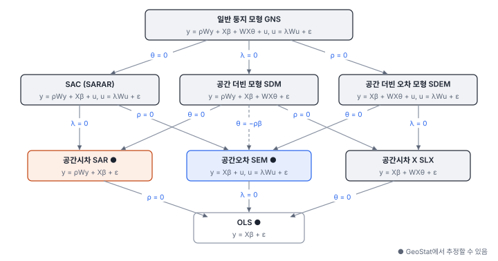
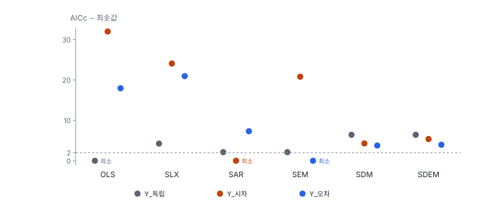

[목차](../README.md) · 이전: [25강 공간시차 모형](25-spatial-lag.md) · 다음: [27강 공간 회귀의 확장](27-spatial-regression-extensions.md)

# 26강 공간오차 모형과 모형 계보

> 앱 지원: ◐ 공간오차 모형(ML·GM)은 앱에서, 공간 더빈 모형 등 나머지 모형과 모형 비교 검정은 코드로 함 · 읽는 시간 약 50분

## 이 강에서 얻는 것

- 공간오차 모형을 "공간 필터를 거친 회귀"로 이해하고, 계수와 λ를 해석할 수 있음
- 공간 회귀 모형의 계보(SAR, SEM, SLX, SDM, SDEM, SAC, GNS)를 제약 관계로 정리하고, 모형마다 파급을 어떻게 다루는지 앎
- 특수→일반(LM 검정)과 일반→특수(공간 더빈 모형에서 출발) 전략으로 모형을 고르고, 공통인수 검정의 뜻을 앎
- GeoStat의 공간오차 모형 결과에서 잔차 Moran's I를 바르게 읽음

## 들어가는 질문

25강 해 보기 6번에서 오차만 닮은 자료(Y_오차)에 공간시차 모형을 적합하자 ρ = 0.324(p < 0.001)가 나왔음. 파급이 없는 자료에서 "유의한 파급"이 나온 것임. 반대로 실제로 파급이 있는 자료를 공간오차 모형으로 적합하면 어떻게 되는가? 두 모형 말고도 이웃의 x가 영향을 주는 모형, 두 의존이 함께 있는 모형 등 선택지가 많음. 이 모형들은 서로 어떤 관계이고, 자료로 어떻게 가를 수 있는가?

## 1. 공간오차 모형

공간오차 모형(spatial error model, SEM)은 오차끼리만 닮은 모형임.

$$
y = X\beta + u, \qquad u = \lambda W u + \varepsilon
$$

u에 대해 풀고 양변에 (I − λW)를 곱하면 다음이 됨.

$$
(I - \lambda W) y = (I - \lambda W) X \beta + \varepsilon
$$

y와 X에서 "이웃 평균의 λ배"를 뺀 값으로 OLS를 하는 셈임. 이 변환을 **공간 필터**(spatial filter)라 하고, 시계열의 Cochrane–Orcutt 변환과 같은 발상임. 그래서 공간오차 모형의 성질은 다음과 같음.

- β는 OLS처럼 그대로 한계효과임. 파급이 없으므로 직접 효과 = β, 간접 효과 = 0임
- λ는 연구 대상이라기보다 오차 구조를 바로잡기 위한 모수(성가신 모수)임
- 이 모형이 맞으면 OLS의 β도 평균적으로는 맞지만 표준오차가 틀림(24강). 공간오차 모형은 표준오차를 바로잡고 더 정확하게 추정함

추정은 25강처럼 최대우도(ML, 야코비 항 ln|I − λW|가 들어감)나, 오차의 적률 조건을 쓰는 GM(Kelejian & Prucha 1999)으로 함. GeoStat의 공간오차 모형 GM 추정(**공간오차 모형 — GM (이분산 강건)** 모형)은 오차의 분산이 지역마다 달라도 표준오차가 유효한 방법(Kelejian & Prucha 2010; Arraiz 외 2010)임. λ가 가질 수 있는 범위는 ρ와 같아서, 한빛시 퀸 인접에서는 (−1.746, 1)임(25강).

### Y_오차의 추정 결과

| | λ | 고령비율 (표준오차) | 온도편차 (표준오차) | 로그우도 | AICc |
|---|---|---|---|---|---|
| 참값 | 0.5 | 0.3 | 1.5 | – | – |
| OLS | – | 0.2145 (0.0327) | 1.476 (0.0848) | −275.342 | 558.959 |
| 공간시차 ML | ρ = 0.3239 | 0.1981 (0.0316) | 1.178 (0.1189) | −268.956 | 548.329 |
| 공간오차 ML | 0.4844 | 0.2279 (0.0401) | 1.488 (0.1039) | −265.298 | 541.012 |
| 공간오차 GM | 0.4915 | 0.2281 (0.0431) | 1.488 (0.0980) | – | – |

- 공간오차 모형의 AICc가 가장 작음. OLS 대비 우도비 검정은 20.09(p < 0.001)
- 공간오차 모형의 표준오차(온도편차 0.1039)가 OLS(0.0848)보다 큼. 24강의 모의 실험에서 이 과정의 OLS 계수가 실제로 흩어지는 정도는 0.124였는데 OLS는 0.090으로 보고했음. 공간오차 모형의 표준오차가 큰 것은 OLS가 지나치게 작게 보고한 것을 바로잡은 결과임
- 공간시차 모형을 잘못 고르면 ρ가 유의하게 나올 뿐 아니라 온도편차 계수가 1.178로 작아짐. 게다가 공간시차 모형의 잔차에는 공간 자기상관이 남음(Moran's I 0.087, 순열 p 0.038)
- 고령비율은 세 모형 모두 0.20~0.23 정도로 참값 0.3보다 작게 나왔음. 표준오차가 0.04 정도인 실현값 하나에서 생긴 표본 변동임. 모형을 바로 골라도 한 표본의 추정은 참값과 다를 수 있음

### 잔차 Moran's I를 읽을 때 주의할 점

공간오차 모형의 "잔차"는 두 가지가 있음. y − Xβ̂로 구한 u와, 공간 필터를 거친 ε̂ = (I − λ̂W)û임. 모형은 u가 닮았다고 보고 ε만 독립이라고 가정하므로, 모형이 맞는지는 ε로 확인해야 함.


GeoStat은 공간오차 모형에서 u를 잔차 열(`<접두어>_RESID`, 해 보기에서는 `E1_RESID`)로 저장하고, 결과 카드와 모형 비교 카드의 잔차 Moran's I도 u로 계산함. 그래서 Y_오차의 공간오차 모형에서 잔차 Moran's I가 0.253(p 0.001)으로 나오고 "잔차에 공간 자기상관이 남아 있음"이라는 안내가 붙음. 이 값은 모형이 잡아낸 오차 구조 자체이므로, 공간오차 모형이 실패했다는 뜻이 아님. 걸러낸 ε의 Moran's I는 0.0036(순열 p 0.417)임. 공간시차 모형의 잔차는 ε 자체이므로 이런 문제가 없음.

## 2. 모형의 계보

공간 의존이 들어갈 자리는 세 곳임. 이웃의 y(ρWy), 이웃의 x(WXθ), 이웃의 오차(λWu)임. 세 항을 모두 넣은 모형을 **일반 둥지 모형**(general nesting spatial model, GNS)이라 하고, 항을 하나씩 0으로 두면 지금까지 본 모형들이 나옴(Elhorst 2010).



- **SLX**(spatial lag of X): y = Xβ + WXθ + ε. 이웃의 x가 내 y에 영향을 줌. 예를 들어 이웃 동의 공원 면적이 내 동의 집값에 영향을 주는 경우임. 파급은 바로 이웃까지만 가는 **국지적 파급**이고, 직접 효과 = β, 간접 효과 = θ로 바로 읽힘. OLS로 추정할 수 있음
- **SDM**(spatial Durbin model): y = ρWy + Xβ + WXθ + ε. 공간시차 모형에 이웃의 x를 더한 것임. 파급은 승수를 거쳐 멀리까지 번지는 **전역적 파급**이고, 효과는 (I − ρW)⁻¹(Iβ_r + Wθ_r)로 계산함(LeSage & Pace 2009)
- **SDEM**(spatial Durbin error model): y = Xβ + WXθ + u, u = λWu + ε. 국지적 파급(θ)과 오차 의존을 함께 둠
- **SAC** 또는 **SARAR**: y = ρWy + Xβ + u, u = λWu + ε. 시차와 오차 의존을 함께 둠. 같은 W를 쓰면 식별이 WX, W²X 같은 도구에 기대므로, 설명변수의 공간 패턴이 약하면 ρ와 λ를 가르기 어려울 수 있음(Kelejian & Prucha 1998). PySAL은 GM 추정(GM_Combo)을 제공함
- **GNS**: 모수가 너무 많아 실제 자료에서는 잘 식별되지 않음. 출발점으로 쓰지 않음(Elhorst 2014)

### 공통인수: 공간오차 모형은 공간 더빈 모형의 특수한 경우

1절의 필터 식을 풀어 쓰면 다음과 같음.

$$
y = \lambda W y + X\beta - \lambda W X \beta + \varepsilon
$$

공간 더빈 모형에서 ρ = λ, θ = −λβ인 경우와 같음. 이 제약 θ = −ρβ를 **공통인수 제약**(common factor restriction)이라 함(Burridge 1981). 그래서 공간 더빈 모형을 추정한 뒤 θ가 −ρβ와 비슷한지 검정하면 공간오차 모형으로 줄여도 되는지 검정할 수 있음. θ = 0이면 공간시차 모형임.

## 3. 모형 고르기: 두 전략

- **특수→일반**: OLS에서 출발해 LM 검정으로 공간시차나 공간오차를 더함(24강, Anselin 2005). 계산이 쉽고 GeoStat에서 바로 할 수 있음. 다만 SLX나 SDM처럼 이웃의 x가 들어가는 경우는 보지 못하고, 빠진 변수가 있으면 엉뚱한 쪽을 가리킬 수 있음
- **일반→특수**: 공간 더빈 모형에서 출발해 제약을 검정함(LeSage & Pace 2009; Elhorst 2010). θ = 0을 받아들이면 공간시차 모형, θ = −ρβ를 받아들이면 공간오차 모형, 둘 다 기각하면 공간 더빈 모형에 머묾. 둘 다 받아들여지면(Y_독립처럼) 더 단순한 모형으로 내려가거나 LM 검정과 이론으로 고름. 공간 더빈 모형은 공간시차·공간오차 과정 어느 쪽이 참이어도 계수와 효과를 치우치지 않게 추정한다는 장점이 있음(LeSage & Pace 2009)
- **SLX에서 출발**: Halleck Vega & Elhorst(2015)는 파급을 이웃의 x로 직접 모형화하는 SLX를 먼저 보고, 필요할 때만 ρ나 λ를 더하자고 제안함. W를 바꿔 가며 추정하기 쉽고 효과 해석이 간단하기 때문임. Gibbons & Overman(2012)은 공간시차 모형 계열의 파급 추정이 강한 가정에 기대고 있어, 인과적 해석에 조심해야 한다고 비판함

### 연습용 자료에 적용하기

세 변수에 여섯 모형을 ML로 적합해 AICc를 비교했음(GeoStat과 같은 방식으로 계산).



일반→특수 전략의 우도비 검정은 다음과 같음.

| | SDM의 θ | SDM의 −ρβ | SDM → SAR (θ = 0) | SDM → SEM (θ = −ρβ) | 결론 |
|---|---|---|---|---|---|
| Y_시차 | (−0.006, 0.068) | (−0.125, −0.702) | 0.085 (p 0.958) | 20.902 (p < 0.001) | 공간시차 |
| Y_오차 | (−0.158, −0.690) | (−0.124, −0.692) | 7.921 (p 0.019) | 0.603 (p 0.740) | 공간오차 |

우도비는 자유도 2인 카이제곱으로 검정함(제약이 x 두 개에 걸림). Y_시차에서는 θ가 0에 가까워 공간시차로, Y_오차에서는 θ가 −ρβ와 거의 같아 공간오차로 내려감. 두 전략 모두 이 자료에서는 맞는 모형을 골랐음.

몇 가지를 더 읽을 수 있음.

- Y_독립에서는 모든 공간 항이 유의하지 않음(공간시차 vs OLS 우도비 0.005, p 0.945). 더 큰 모형은 AICc만 나빠짐
- Y_시차에 SLX를 적합하면 이웃 온도편차의 계수 θ가 1.314로, 참 간접 효과 1.406에 가까움. 온도편차가 공간적으로 매끄러워 WX가 W²X, W³X…와 거의 같이 움직이므로(WX와 W²X의 상관 0.99), θ가 더 먼 이웃의 파급까지 흡수하기 때문임. 바로 이웃 몫(ρβ = 0.75)만으로는 1.314가 되지 않음. 그러나 AICc는 564.563으로 공간시차 모형(540.505)보다 훨씬 나쁨
- Y_시차에 공간오차 모형을 적합하면 λ = 0.601이고 온도편차 계수는 1.960으로 참 직접 효과(1.594)보다 큼. 파급을 오차로 처리하면 계수가 치우침
- PySAL의 자동 탐색 함수 `spreg.gets_sdm`(GM 추정 기반, 유의수준 0.01)은 Y_독립을 OLS, Y_시차를 공간시차로 맞게 골랐지만, Y_오차도 공간시차로 골랐음. 자동 탐색의 결과도 검정 방법과 유의수준에 따라 달라지므로 그대로 믿지 않음

### 한빛시 출동률

출동률에 SLX(고령비율, 온도편차와 그 이웃 평균)를 적합하면 이웃 온도편차의 계수는 −0.383(p 0.691)이고 OLS 대비 우도비는 0.610(p 0.737)임. AICc도 OLS 966.398보다 나쁜 970.099임. 이웃 동의 더위가 내 동의 출동률에 따로 영향을 준다는 증거도 없음. 24·25강과 같은 결론임.

## 해 보기: GeoStat에서 공간오차 모형 추정하기

1. 24강처럼 `book/data/practice/hanbit_dong_sim.gpkg`를 열고 **퀸 인접 (Queen)** 공간가중치를 만듦
2. **공간 분석 → 회귀 분석 (OLS · 공간회귀 · GWR · MGWR)…** 메뉴에서 종속변수 (y) `Y_오차`, 독립변수 `고령비율`과 `온도편차`로 다음 세 모형을 차례로 실행함
   - 모형 **OLS (최소제곱)**, 접두어 `O3`(24강에서 했으면 건너뜀)
   - 모형 **공간시차 모형 (Spatial Lag)**, 접두어 `L3`(25강에서 했으면 건너뜀)
   - 모형 **공간오차 모형 (Spatial Error)**, 접두어 `E1`
3. `E1`의 결과 카드를 확인함
   - 확인: 요약에 λ (공간오차 계수) 0.4844, 유사 R² 0.7305, 로그우도 −265.3. 계수 표에 고령비율 0.2279(표준오차 0.04008), 온도편차 1.488(표준오차 0.1039), λ 0.4844(표준오차 0.09683)
   - 확인: 진단에 우도비 검정 (vs OLS) 20.09(p < 0.001), 잔차 Moran's I (순열 999회) 0.2531(p 0.001)이 나오고, "잔차에 공간 자기상관이 남아 있음 (p ≤ 0.05) → 모형 설정을 다시 검토할 만함"이라는 안내가 붙음. 1절에서 본 것처럼 이 값은 걸러내기 전의 u로 계산한 것이라, 공간오차 모형에서는 이 안내를 따르지 않음
   - 확인: 효과 표가 없음. 공간오차 모형의 계수는 그대로 한계효과임
4. **모형 비교** 카드를 확인함
   - 확인: Y_오차의 OLS AICc 558.959, Lag (ML) 548.329, Error (ML) 541.012이고 Error (ML)에 **최적** 표시가 붙음. Lag (ML)의 잔차 I는 0.0868(p 0.038)로 공간시차 모형으로는 의존이 다 걷히지 않음
5. 모형 **공간오차 모형 — GM (이분산 강건)** 항목으로 접두어 `E2`를 실행함
   - 확인: λ 0.4915, 온도편차 1.488(표준오차 0.09799). 로그우도와 AICc는 없음
6. (선택) `Y_시차`를 모형 **공간오차 모형 (Spatial Error)** 항목으로, 접두어 `E3`을 붙여 실행해 모형 비교 카드에서 25강의 `L1`(Lag (ML))과 비교함
   - 확인: Y_시차의 Error (ML) AICc는 561.322로 Lag (ML) 540.505보다 큼. 온도편차 계수는 1.96으로 부풀어 있음

### 코드로: 공간 더빈 모형과 일반→특수 검정

```python
import contextlib
import io
import warnings

import geopandas as gpd
import libpysal
import numpy as np
import spreg
from scipy import stats

warnings.filterwarnings("ignore")
sim = gpd.read_file("book/data/practice/hanbit_dong_sim.gpkg")
w = libpysal.weights.Queen.from_dataframe(sim, use_index=True)
w.transform = "r"
names = ["고령비율", "온도편차"]
X = sim[names].to_numpy()

for yname in ["Y_시차", "Y_오차"]:
    y = sim[[yname]].to_numpy()
    with contextlib.redirect_stdout(io.StringIO()):         # spreg가 찍는 모형 이름을 숨김
        sar = spreg.ML_Lag(y, X, w, name_x=names, spat_impacts=None)
        sem = spreg.ML_Error(y, X, w, name_x=names)
        sdm = spreg.ML_Lag(y, X, w, slx_lags=1, name_x=names, spat_impacts=None)   # 공간 더빈 모형
    b = sdm.betas.ravel()                                     # 상수, β1, β2, θ1, θ2, ρ
    lr_sar = 2 * (sdm.logll - sar.logll)                      # θ = 0 이면 SAR
    lr_sem = 2 * (sdm.logll - sem.logll)                      # θ = −ρβ 이면 SEM (공통인수)
    print(f"{yname}: SDM ρ {b[-1]:.3f}, θ = ({b[3]:.3f}, {b[4]:.3f}), −ρβ = ({-b[-1] * b[1]:.3f}, {-b[-1] * b[2]:.3f})")
    print(f"   SDM→SAR 우도비 {lr_sar:.3f} (p {stats.chi2.sf(lr_sar, 2):.3f}), SDM→SEM 우도비 {lr_sem:.3f} (p {stats.chi2.sf(lr_sem, 2):.3f})")
```

- 확인: 3절의 표와 같은 값이 나옴(Y_시차의 SDM→SAR 0.085, Y_오차의 SDM→SEM 0.603 등)
- 더 해 보기: `spreg.ML_Error(y, X, w, slx_lags=1)`로 공간 더빈 오차 모형을, `spreg.OLS(y, X, w=w, slx_lags=1)`로 SLX를 추정함. 공간오차 모형의 걸러낸 잔차는 `sem.e_filtered`에 있으니 `esda.Moran(sem.e_filtered.ravel(), w).I`로 확인함(`import esda` 필요, Y_오차에서 0.0036)

## 헷갈리는 쌍

- **공간시차 모형 vs 공간오차 모형**: 이웃의 y가 영향을 주는가(파급, 효과 분해 필요), 오차만 닮았는가(β가 곧 한계효과). 둘 다 잔차의 의존을 없애지만 계수의 뜻이 다름
- **국지적 파급(SLX·SDEM) vs 전역적 파급(SAR·SDM)**: 이웃까지만 가는가, 승수를 거쳐 멀리까지 번지는가. 국지적 파급은 θ가 곧 간접 효과임
- **u vs ε (공간오차 모형의 두 잔차)**: u = y − Xβ는 공간 구조를 담고 있고, ε = (I − λW)u가 독립이라고 가정한 부분임. 모형 진단은 ε로 함
- **특수→일반 vs 일반→특수**: OLS에서 LM 검정으로 올라가는가, SDM에서 제약 검정으로 내려가는가. 두 전략의 결과가 다르면 이론과 W 민감도로 판단함

## 흔한 실수와 심사 지적

- **공간오차 모형의 잔차 Moran's I가 크다고 모형이 틀렸다고 판단함**
  - 대응: 걸러낸 잔차 ε로 다시 계산함. GeoStat의 `<접두어>_RESID`는 u임
- **공간오차 모형을 쓰고 "공간적 파급"을 논의함**
  - 지적: "공간오차 모형에는 파급이 없습니다. 파급을 주장하려면 다른 모형이 필요하지 않습니까?"
  - 대응: 파급이 연구 질문이면 SAR, SDM, SLX를 비교함
- **공간시차와 공간오차 둘만 비교함**
  - 지적: "이웃의 설명변수 효과(SLX, SDM)는 검토했습니까?"
  - 대응: 공간 더빈 모형을 추정해 θ = 0, θ = −ρβ를 검정함
- **SDM의 계수 θ를 간접 효과로 보고함**
  - 대응: SDM은 승수를 거치므로 효과를 (I − ρW)⁻¹(Iβ + Wθ)로 계산함. θ가 곧 간접 효과인 것은 SLX와 SDEM뿐임
- **AICc 차이가 2보다 작은 모형 가운데 하나를 근거 없이 고름**
  - 대응: 비슷한 모형들의 결론(계수, 효과)이 같은지 보고, 이론으로 고름

## 보고서에는 이렇게 씀

> 최소제곱 잔차의 공간 의존성 진단(LM-error 24.39, p < 0.001; Robust LM-error 9.79, p = 0.002; Robust LM-lag 0.001, p = 0.977)에 따라 공간오차 모형을 최대우도법으로 추정하였다(퀸 인접, 행 표준화). 공간오차 계수는 λ = 0.484(표준오차 0.097)였고, AICc는 최소제곱 558.96, 공간시차 548.33, 공간오차 541.01로 공간오차 모형이 가장 작았다. 공간 더빈 모형에 대한 공통인수 제약은 기각되지 않았고(우도비 0.60, 자유도 2, p = 0.74), θ = 0 제약은 기각되었다(우도비 7.92, p = 0.019). 공간 필터를 거친 잔차의 Moran's I는 0.004(순열 p = 0.42)였다. 온도편차의 계수는 1.488(표준오차 0.104)이었다.

적어야 할 항목은 다음과 같음.

- 비교한 모형들과 고른 전략(특수→일반, 일반→특수)
- 모형 비교의 근거(LM 검정, 우도비 검정, AICc)와 그 값
- 공간오차 모형이면 걸러낸 잔차의 진단, 공간시차·더빈 모형이면 효과 분해
- 모형 선택이 W에 따라 달라지는지(27강)

## 요약

- 공간오차 모형은 공간 필터 (I − λW)를 거친 회귀이고, β는 그대로 한계효과이며 파급은 없음. OLS의 지나치게 작은 표준오차를 바로잡음
- 공간 회귀 모형은 세 공간 항(ρWy, WXθ, λWu)의 조합으로 정리되고(Elhorst 2010), 공간오차 모형은 공간 더빈 모형에서 θ = −ρβ인 특수한 경우임
- 특수→일반(LM 검정)과 일반→특수(SDM에서 우도비 검정) 모두 연습용 자료에서 맞는 모형을 골랐지만, 자동 탐색은 틀리기도 했음
- GeoStat의 공간오차 모형 잔차 열(`<접두어>_RESID`)은 걸러내기 전의 u라서 Moran's I가 크게 나옴. 걸러낸 ε로 진단함
- 한빛시 출동률에는 이웃 동의 더위가 영향을 준다는 증거(SLX)도 없었음

## 핵심 용어

| 한글 | 영문 | 비고 |
|---|---|---|
| 공간오차 모형 | Spatial Error Model (SEM) | GeoDa: Spatial Error, PySAL: ML_Error·GM_Error_Het |
| 공간 필터 | Spatial Filter | (I − λW) |
| 공간시차 X 모형 | Spatial Lag of X (SLX) | 국지적 파급 |
| 공간 더빈 모형 | Spatial Durbin Model (SDM) | 전역적 파급 |
| 공간 더빈 오차 모형 | Spatial Durbin Error Model (SDEM) | |
| SAC, SARAR | Spatial Autoregressive Combined | 시차 + 오차 |
| 일반 둥지 모형 | General Nesting Spatial Model (GNS) | Elhorst 2010 |
| 공통인수 제약 | Common Factor Restriction | θ = −ρβ |
| 특수→일반 / 일반→특수 | Specific-to-general / General-to-specific | |
| 이분산 강건 GM | Heteroskedasticity-robust GMM | Kelejian & Prucha 2010 |

## 원전과 더 읽을거리

**원전**

- Burridge, P. (1981). Testing for a common factor in a spatial autoregression model. *Environment and Planning A*, 13(7), 795–800. 공통인수 검정
- Kelejian, H. H., & Prucha, I. R. (1999). A generalized moments estimator for the autoregressive parameter in a spatial model. *International Economic Review*, 40(2), 509–533. 공간오차 모형의 GM 추정
- Elhorst, J. P. (2010). Applied spatial econometrics: Raising the bar. *Spatial Economic Analysis*, 5(1), 9–28. 모형 계보와 일반→특수 전략
- Halleck Vega, S., & Elhorst, J. P. (2015). The SLX model. *Journal of Regional Science*, 55(3), 339–363.

**더 읽을거리**

- Kelejian, H. H., & Prucha, I. R. (1998). A generalized spatial two-stage least squares procedure for estimating a spatial autoregressive model with autoregressive disturbances. *Journal of Real Estate Finance and Economics*, 17(1), 99–121.
- Kelejian, H. H., & Prucha, I. R. (2010). Specification and estimation of spatial autoregressive models with autoregressive and heteroskedastic disturbances. *Journal of Econometrics*, 157(1), 53–67.
- Arraiz, I., Drukker, D. M., Kelejian, H. H., & Prucha, I. R. (2010). A spatial Cliff-Ord-type model with heteroskedastic innovations: Small and large sample results. *Journal of Regional Science*, 50(2), 592–614.
- Gibbons, S., & Overman, H. G. (2012). Mostly pointless spatial econometrics? *Journal of Regional Science*, 52(2), 172–191. 공간 회귀의 인과 해석에 대한 비판
- LeSage, J., & Pace, R. K. (2009). *Introduction to Spatial Econometrics*. CRC Press. 2장(효과 해석), 6장(모형 비교)
- Elhorst, J. P. (2014). *Spatial Econometrics: From Cross-Sectional Data to Spatial Panels*. Springer. 2장

## 연습

1. 공간오차 과정 y = Xβ + u, u = λWu + ε에서 λ = 0.5, 온도편차의 β = 1.5라면, 같은 자료를 공간 더빈 모형으로 쓸 때 ρ와 이웃 온도편차의 계수 θ는 얼마여야 하는가?

2. Y_오차에서 공간오차 모형의 온도편차 표준오차(0.1039)가 OLS(0.0848)보다 컸음. 공간오차 모형이 OLS보다 "효율적"이라는 말과 모순되지 않는가?

3. 해 보기 3번에서 GeoStat이 공간오차 모형 결과에 "잔차에 공간 자기상관이 남아 있음"이라고 안내했음. 어떻게 확인하고 어떻게 보고하는가?

4. Y_오차에서 SDM → SAR 우도비 검정이 7.921(p 0.019)로 기각되고 SDM → SEM은 0.603(p 0.740)으로 기각되지 않았음. 이 결과를 말로 풀어 쓰시오.

5. "공원 면적이 넓은 동 옆의 동은 집값이 높다"는 가설을 검정하려 함. SLX와 SDM 가운데 무엇으로 출발하는 것이 자연스러운가? 효과는 각각 어떻게 읽는가?

<details>
<summary>해답</summary>

1. 공통인수 제약에서 ρ = λ = 0.5, θ = −λβ = −0.5 × 1.5 = −0.75. 실제로 Y_오차의 SDM 추정에서 ρ = 0.476, 이웃 온도편차의 θ = −0.690으로 이 값에 가깝게 나왔음.

2. 모순되지 않음. 효율성은 추정값이 실제로 흩어지는 정도(참 표준오차)의 비교임. OLS는 실제로는 더 크게 흩어지는데(24강 모의 실험에서 0.124) 보고하는 표준오차가 작게(0.090) 잘못 나옴. 공간오차 모형은 실제로 덜 흩어지면서 표준오차를 바르게 보고함. 보고된 표준오차끼리의 비교는 효율성의 비교가 아님.

3. 공간오차 모형의 잔차 열(`E1_RESID`)은 걸러내기 전의 u이므로 그 Moran's I는 오차의 공간 구조(λ)를 그대로 보여 줄 뿐임. 걸러낸 잔차 ε = (I − λ̂W)û를 계산해(코드에서는 `e_filtered`) Moran's I를 확인하고, 보고서에는 걸러낸 잔차의 값(이 자료에서 0.004)을 적음.

4. 이웃 설명변수의 효과가 0이라는 제약(공간시차 모형)은 자료와 맞지 않고, 이웃 설명변수의 효과가 −ρβ라는 제약(공간오차 모형)은 자료와 맞음. 즉 SDM에서 보이는 이웃 x의 계수는 오차의 공간 의존을 SDM 형태로 쓴 결과이고, 실질적인 파급이 아님. 공간오차 모형으로 내려가는 것이 타당함.

5. 이웃 동의 공원이 바로 옆 동의 집값에 영향을 준다는 국지적 가설이므로 SLX(집값 = 공원 면적β + 이웃 공원 면적θ + …)로 출발하는 것이 자연스러움. SLX에서는 θ가 곧 간접 효과(이웃 공원의 효과)임. SDM은 집값이 이웃 집값을 따라가는 전역적 파급까지 가정하므로, 그 메커니즘을 주장하려면 SDM으로 확장하고 효과를 (I − ρW)⁻¹(Iβ + Wθ)로 계산함.

</details>

---

[목차](../README.md) · 이전: [25강 공간시차 모형](25-spatial-lag.md) · 다음: [27강 공간 회귀의 확장](27-spatial-regression-extensions.md)
