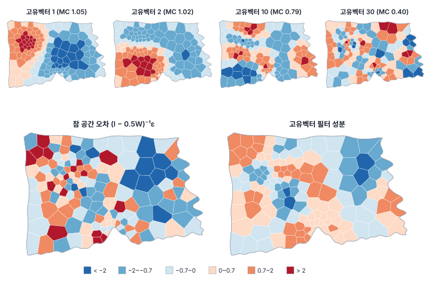
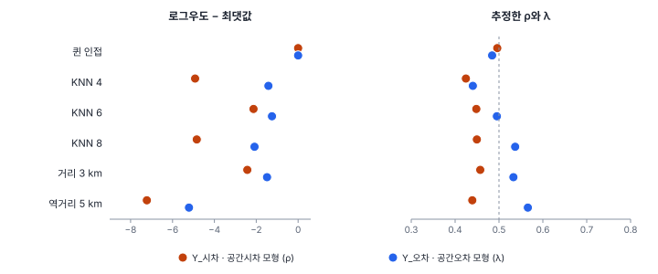

[목차](../README.md) · 이전: [26강 공간오차 모형과 모형 계보](26-spatial-error-and-family.md) · 다음: 28강 공간 비정상성 (집필 예정)

# 27강 공간 회귀의 확장

> 앱 지원: ◐ 가중치 민감도 분석은 앱에서, 계수 자료 모형과 고유벡터 공간 필터는 코드로 함 · 읽는 시간 약 45분

## 이 강에서 얻는 것

- 건수 자료를 비율로 바꾸지 않고 포아송·음이항 회귀로 모형화하고, 그 잔차의 공간 의존을 진단할 수 있음
- 고유벡터 공간 필터(ESF·MEM)의 원리를 알고, 무엇을 해결하고 무엇을 해결하지 못하는지 앎
- 공간 고정효과와 공간 패널 모형이 무엇을 다루는지 개요를 앎
- 공간가중치를 바꿔 가며 결과가 얼마나 달라지는지 확인하고 보고할 수 있음(민감도 분석)

## 들어가는 질문

24~26강은 y가 연속이고 정규분포에 가까운 경우를 다뤘음. 그러나 실제 지역 자료에는 건수(출동, 환자, 사고)가 많고, 8강처럼 건수를 인구로 나눈 비율을 OLS로 회귀하면 인구가 적은 동의 비율이 크게 흔들리는 문제가 생김(14강). 또 공간 회귀 모형은 W를 하나 정해야 하는데, 그 선택이 결과를 얼마나 좌우하는가? 이 강은 6부의 마무리로, 공간 회귀를 실제 자료에 쓸 때 자주 만나는 확장과 점검을 개요 수준에서 다룸.

## 1. 건수 자료: 포아송과 음이항 회귀

동 i의 출동 건수 yᵢ를 인구 Pᵢ에 비례하는 포아송 분포로 봄.

$$
y_i \sim \text{Poisson}(\mu_i), \qquad \ln \mu_i = \ln P_i + \beta_0 + \beta_1 x_{1i} + \beta_2 x_{2i}
$$

ln Pᵢ는 계수가 1로 고정된 항으로 **오프셋**(offset)이라 함. 그래서 모형은 실제로는 1인당 출동률 μᵢ/Pᵢ를 모형화하는 셈이고, 계수 β는 x가 1 늘 때 출동률이 exp(β)배가 된다는 뜻임. 비율을 OLS로 회귀할 때와 달리, 인구가 적은 동의 불안정성을 포아송 분산(평균과 같음)이 자동으로 반영함.

포아송 분포는 분산이 평균과 같다고 가정함. 실제 분산이 더 크면(**과대산포**, overdispersion) 표준오차가 작게 나옴. 피어슨 잔차 제곱합을 자유도로 나눈 **분산 비**가 1보다 크면 의심하고, 분산을 μ + αμ²로 두는 **음이항 회귀**(negative binomial, NB2)를 씀.

### 한빛시 출동 건수

행정동 150개의 출동 건수는 평균 9.39, 분산 50.80이고 0건인 동이 7개임. 8강의 두 모형(M1: 고령비율, M3: 고령비율 + 온도편차)을 포아송 회귀로 적합했음.

| | 고령비율 | 온도편차 | 분산 비 | 피어슨 잔차 Moran's I |
|---|---|---|---|---|
| 포아송 M1 | −0.0026 (0.0050) | – | 1.733 | 0.182 (p < 0.001) |
| 포아송 M3 | 0.0259 (0.0063) | 0.1343 (0.0184) | 1.381 | −0.018 (p 0.814) |
| 음이항 M3 | 0.0254 (0.0076) | 0.1357 (0.0219) | – | −0.029 (p 0.649) |

괄호 안은 표준오차, Moran's I의 p는 정규 근사임.

- M3에서 온도편차가 1℃ 높으면 출동률이 exp(0.1343) = 1.144배(14.4% 높음), 고령비율이 1%p 높으면 exp(0.0259) = 1.026배임
- 분산 비 1.381로 과대산포가 조금 있음. 음이항 모형의 α는 0.0325이고 포아송 대비 우도비 8.862(경계 보정 p 0.0015)로 유의함. 계수는 거의 같지만 표준오차가 20%쯤 커짐
- 24강의 비율 회귀와 같은 이야기가 건수 모형에서도 나옴. 온도편차를 빼면(M1) 피어슨 잔차의 Moran's I가 0.182로 크게 남지만, 넣으면 사라짐

건수 자료에서 공간 의존이 남는다면 어떻게 하는가? 공간시차·공간오차 모형의 건수판은 추정이 까다로움. 실무에서는 다음 둘을 많이 씀.

- 고유벡터 공간 필터를 포아송·음이항 회귀에 넣음(2절)
- 공간 랜덤효과를 넣은 베이지안 모형(CAR, BYM). 질병 지도의 표준이며 37강에서 다룸

## 2. 고유벡터 공간 필터

공간 의존을 모형의 구조(ρ, λ)로 다루는 대신, **공간 패턴 자체를 설명변수로 넣는** 방법이 있음. 그리피스(Griffith 2003)의 **고유벡터 공간 필터**(eigenvector spatial filtering, ESF)이고, 생태학에서는 같은 생각을 **MEM**(Moran's eigenvector maps, Dray, Legendre & Peres-Neto 2006)이라 부름.

이진 연결 행렬 C를 평균을 빼는 행렬 M = I − 11ᵀ/n으로 감싼 MCM의 고유벡터 e₁, e₂, …, eₙ은 다음 성질을 가짐(de Jong, Sprenger & van Veen 1984).

- 상수 벡터 하나를 빼면 서로 직교하고 평균이 0인 지도 패턴임
- e₁은 그 연결 구조에서 Moran's I가 가장 큰 패턴, e₂는 e₁과 직교하면서 I가 가장 큰 패턴임. 번호가 커질수록 I가 작아지고, 뒤쪽은 음의 자기상관 패턴임

즉 고유벡터는 그 지역 구조에서 나올 수 있는 공간 패턴의 목록임. 이 가운데 몇 개를 골라 설명변수로 넣으면, 잔차의 공간 구조를 그 패턴들이 흡수함. 보통 Moran 계수가 최댓값의 25% 이상인 양의 패턴을 후보로 두고, 잔차 Moran's I를 가장 줄이는 것부터 하나씩 더해 잔차 의존이 유의하지 않을 때 멈춤(Tiefelsdorf & Griffith 2007). 이 강에서는 (회귀 보정을 하지 않은) 정규 근사 p > 0.10을 멈춤 기준으로 썼음. R spatialreg의 `SpatialFiltering` 기본값(tol = 0.1)과 같은 수준임.



한빛시 퀸 인접에서는 후보가 37개임. 연습용 자료에 적용한 결과는 다음과 같음.

| | OLS 잔차 I | 고른 고유벡터 | 필터 뒤 잔차 I | 온도편차 계수 (표준오차) |
|---|---|---|---|---|
| Y_독립 | −0.007 | 없음 | −0.007 | 1.474 (0.077) |
| Y_오차 | 0.250 | 6개 | 0.045 (p 0.301) | 1.436 (0.074) |
| Y_시차 | 0.267 | 6개 | 0.031 (p 0.455) | 1.967 (0.091) |

- Y_독립에서는 하나도 고르지 않음
- Y_오차에서는 고유벡터 6개로 잔차 의존을 걷어냄. 필터 성분(고른 고유벡터들의 합)은 참 공간 오차와 상관 0.535로, 큰 무늬를 잡아냄
- Y_시차에서도 잔차 의존은 걷혔지만 온도편차 계수가 1.967로 여전히 부풀어 있음(참 직접 효과 1.594). 고유벡터는 잔차를 보고 고르는데, 빠진 Wy 가운데 X와 상관된 부분은 잔차가 아니라 이미 계수에 흡수되어 있음(24강의 누락 변수 편향). 그래서 잔차의 무늬는 지워도 계수의 편향은 되돌리지 못함. 파급이 있는 자료에 ESF를 쓰면 잔차는 깨끗해 보여도 계수가 틀림

### 추론은 믿을 만한가

공간오차 과정(λ = 0.5)으로 y를 300번 만들어 OLS, ESF, 공간오차 모형(ML)을 비교했음(온도편차 참값 1.5).

| | 계수 평균 | 실제 표준편차 | 보고한 표준오차 평균 | 95% 신뢰구간 포함률 |
|---|---|---|---|---|
| OLS | 1.502 | 0.128 | 0.090 | 83.0% |
| ESF | 1.506 | 0.144 | 0.086 | 77.7% |
| 공간오차 ML | 1.501 | 0.113 | 0.109 | 94.0% |

세 방법 모두 계수는 맞지만, ESF는 실제 표준편차가 OLS보다 크면서(0.144 대 0.128) 보고하는 표준오차는 OLS보다도 작아, 포함률이 77.7%로 가장 낮음. 고유벡터를 자료로 고른 뒤 고정된 것처럼 추론하므로(선택 후 추론) 고르는 단계의 불확실성이 표준오차에서 빠지기 때문임. 고르는 수도 실현값마다 0~11개로 들쭉날쭉했음. 이 실험에서는 공간오차 모형만 95%에 가까웠음. ESF는 건수 모형처럼 공간 회귀 모형을 쓰기 어려운 경우에 편리하지만, 표준오차는 낙관적일 수 있음.

### 빠진 변수를 대신하지 못함

출동 건수의 포아송 M1(고령비율만)에 ESF를 적용하면 고유벡터 2개(1번, 13번)로 잔차 I가 0.070(p 0.124)으로 줄어듦. 그러나 고령비율의 계수는 −0.023으로 온도편차를 넣은 M3(0.026)와 부호가 반대임. 필터 성분과 온도편차의 상관은 −0.370에 그침. 고유벡터는 잔차의 공간 무늬를 지울 뿐, 빠진 변수가 계수에 준 편향을 바로잡지 못함. 24강의 결론과 같음. 먼저 변수를 찾아야 함.

## 3. 공간 고정효과

지역을 묶는 상위 단위(구, 시군)가 있으면 그 단위별 더미를 넣을 수 있음. 이것이 **공간 고정효과**(spatial fixed effects)임. 상위 단위마다 다른 수준(절편)을 허용해, 구 단위로 공유되는 빠진 요인을 흡수함.

| | 구 더미 없음: 잔차 I | 구 더미 4개: 잔차 I |
|---|---|---|
| Y_오차 | 0.250 | 0.147 (p 0.002) |
| Y_시차 | 0.267 | 0.157 (p 0.001) |
| 출동률(8강 M3) | −0.030 | −0.059 (p 0.298) |

구 더미는 잔차 의존을 일부만 줄임. 의존이 구 경계와 관계없이 이웃한 동 사이에서 생기기 때문임. 고정효과는 "구마다 수준이 다르다"는 공간 이질성을 다루는 도구이고, 이웃 간 의존을 다루는 도구가 아님. 이질성을 더 정교하게 다루는 방법(공간 체제, GWR)은 7부에서 봄.

## 4. 공간 패널 모형 개요

같은 지역을 여러 해 관측한 패널 자료라면 다음 모형을 씀(Elhorst 2003, 2014).

$$
y_{it} = \rho \sum_j w_{ij} y_{jt} + x_{it}^\top \beta + \mu_i + \gamma_t + \varepsilon_{it}
$$

μᵢ는 지역 고정효과(또는 랜덤효과)로, 시간이 지나도 변하지 않는 지역의 특성(지형, 오래된 도시 구조)을 모두 흡수함. γₜ는 해마다 모든 지역에 공통인 충격임. 횡단면 자료에서는 빠진 지역 특성과 공간 의존을 구별하기 어렵지만, 패널에서는 지역 고정효과가 그 특성을 걷어내므로 파급 추정이 더 설득력 있음. 다만 시간에 따라 변하는 빠진 요인과 W 선택 문제는 그대로 남음. 공간시차·공간오차·공간 더빈 모형 모두 패널판이 있고, PySAL의 spreg(`Panel_FE_Lag`, `Panel_FE_Error`, `Panel_RE_Lag` 등)와 R의 splm에서 추정함. 한빛시의 연도별 패널은 9부(33~35강)에서 다룸.

## 5. 가중치 민감도 분석

공간 회귀의 모든 결과는 W를 전제로 함. W는 보통 이론이나 관행으로 정하지만, 다른 합리적인 W에서도 결론이 같은지 확인해야 함. 연습용 자료는 퀸 인접으로 만들었으므로, 다른 W를 쓰면 무엇이 달라지는지 볼 수 있음.



| W (이웃 평균) | Y_시차: ρ | 온도편차 총 효과 | 로그우도 | Y_오차: λ | 로그우도 |
|---|---|---|---|---|---|
| 퀸 인접 (5.41) | 0.496 | 2.938 | −265.04 | 0.484 | −265.30 |
| KNN 4 (4.00) | 0.425 | 2.710 | −269.96 | 0.440 | −266.72 |
| KNN 6 (6.00) | 0.448 | 2.871 | −267.17 | 0.495 | −266.55 |
| KNN 8 (8.00) | 0.450 | 2.956 | −269.88 | 0.537 | −267.38 |
| 거리 3 km (11.01) | 0.457 | 3.059 | −267.47 | 0.533 | −266.78 |
| 역거리 5 km (27.32) | 0.439 | 3.282 | −272.27 | 0.566 | −270.51 |

- 두 변수 모두 참 W(퀸 인접)에서 로그우도가 가장 큼. 같은 모형, 같은 변수라면 W끼리 로그우도(또는 AICc)를 비교해 자료에 맞는 W를 고를 수 있음(LeSage & Pace 2009는 베이지안 사후 확률로 같은 일을 함)
- 잘못된 W에서는 ρ가 작게 나왔음. 실제 이웃 관계를 흐리게 잡아 의존이 약해 보이기 때문으로 보임. 다만 이 자료에서 λ는 오히려 대부분 커졌으므로(KNN 4만 작음), 방향은 일반화하기 어려움
- 온도편차의 총 효과는 2.71~3.28로 W에 따라 20% 넘게 달라짐. 파급의 크기는 W에 민감함
- 모형 선택은 비교적 안정적이었음. 여섯 W 모두 LM 검정이 Y_시차는 공간시차, Y_오차는 공간오차 쪽을 가리켰음. 다만 KNN 8과 역거리에서는 Y_시차의 Robust LM-error도 유의해져(p 0.015, 0.017) 판단이 덜 깔끔했음
- 룩 인접은 퀸 인접과 이웃이 하나도 다르지 않았음. 한빛시 행정동은 꼭짓점 하나로만 만나는 동이 없기 때문임(10강)

## 해 보기

### GeoStat에서: 가중치를 바꿔 가며 공간시차 모형 비교하기

1. `book/data/practice/hanbit_dong_sim.gpkg`를 열고 **공간 분석 → 공간가중치 만들기…** 메뉴에서 다음 네 가중치를 차례로 만듦
   - **퀸 인접 (Queen)**: "평균 5.41 · 최소 2 · 최대 8"
   - **k-최근접 이웃 (KNN)**, **이웃 수 k** 6: "평균 6.00 · 최소 6 · 최대 6"
   - **거리 임계값**, **거리 임계값** 3000: "평균 11.01 · 최소 1 · 최대 25"
   - **거리 임계값**, **거리 임계값** 5000, **역거리 가중 (가까울수록 큰 가중치)** 켬, **거리 지수** 1 (1/d): "평균 27.32 · 최소 4 · 최대 51"
2. **공간 분석 → 회귀 분석 (OLS · 공간회귀 · GWR · MGWR)…** 메뉴에서 모형 **공간시차 모형 (Spatial Lag)**, 종속변수 (y) `Y_시차`, 독립변수 `고령비율`과 `온도편차`를 고르고, 가중치를 하나씩 바꿔 네 번 실행함. 접두어는 `WQ`, `WK6`, `WD3`, `WI5`처럼 다르게 둠
   - 확인: ρ (공간시차 계수)가 차례로 0.4961, 0.4484, 0.4573, 0.4392. 효과 표의 온도편차 총 효과는 2.938, 2.871, 3.059, 3.282
   - 확인: **모형 비교** 카드의 AICc가 540.505, 544.765, 545.362, 554.956이고, 퀸 인접으로 추정한 Lag (ML)에 **최적** 표시가 붙음
3. 같은 네 가중치로 `Y_오차`에 OLS를 실행해 LM 검정의 안내가 가중치마다 같은지 확인함
   - 확인: 네 가중치 모두 "두 LM이 모두 유의하고 Robust LM-error만 유의함 → 공간오차 모형을 검토할 만함"

### 코드로: 건수 자료의 포아송·음이항 회귀

```python
import warnings

import geopandas as gpd
import libpysal
import numpy as np
import statsmodels.api as sm                              # pip install statsmodels
from esda import Moran

warnings.filterwarnings("ignore")
dong = gpd.read_file("book/data/practice/hanbit_dong_sim.gpkg")   # 고령비율·온도편차가 들어 있음
ev = gpd.read_file("book/data/hanbit_events.gpkg")
dong["건수"] = gpd.sjoin(ev, dong, predicate="within").groupby("index_right").size() \
    .reindex(dong.index, fill_value=0)
w = libpysal.weights.Queen.from_dataframe(dong, use_index=True)
w.transform = "r"
np.random.seed(0)                                         # 순열 검정 재현용

y = dong["건수"].to_numpy()
offset = np.log(dong["인구"].to_numpy())                  # 인구를 노출량으로
for xs in (["고령비율"], ["고령비율", "온도편차"]):
    X = sm.add_constant(dong[xs].to_numpy())
    pois = sm.GLM(y, X, family=sm.families.Poisson(), offset=offset).fit()
    disp = (pois.resid_pearson ** 2).sum() / pois.df_resid
    I = Moran(pois.resid_pearson, w, permutations=999)
    coef = ", ".join(f"{v:.4f}" for v in pois.params)
    print(f"{xs}: 계수 {coef}, 분산 비 {disp:.3f}, 피어슨 잔차 I {I.I:.3f} (순열 p {I.p_sim:.3f})")
nb = sm.NegativeBinomial(y, X, offset=offset).fit(disp=0)  # 음이항(NB2), 마지막 모수가 α
coef = ", ".join(f"{v:.4f}" for v in nb.params[:-1])
print(f"음이항: 계수 {coef}, α {nb.params[-1]:.4f}")
```

- 확인: 고령비율만 넣으면 피어슨 잔차 I 0.182(순열 p 0.001), 온도편차까지 넣으면 계수 −7.6783, 0.0259, 0.1343과 잔차 I −0.018. 음이항 α 0.0325. 1절의 표와 같음
- 더 해 보기: `np.linalg.eigh`로 퀸 인접(이진)의 MCM 고유벡터를 구해 `X`에 몇 개씩 더해 보며 잔차 Moran's I와 고령비율 계수가 어떻게 바뀌는지 봄. 고유벡터 필터는 R의 spatialreg(`SpatialFiltering`)나 spmoran 패키지로도 할 수 있음

## 헷갈리는 쌍

- **비율의 OLS vs 건수의 포아송 회귀**: 비율 회귀는 인구가 적은 지역의 큰 흔들림을 그대로 받음. 포아송 회귀는 인구를 오프셋으로 넣고 분산을 평균에 맞춰 다룸
- **포아송 vs 음이항**: 분산 = 평균인가, 분산이 평균보다 큰가(과대산포). 과대산포를 무시하면 표준오차가 작게 나옴
- **공간 회귀 모형 vs 고유벡터 공간 필터**: 의존을 모수(ρ, λ)로 모형화하는가, 지도 패턴을 설명변수로 넣어 걷어내는가. ESF는 어떤 회귀에도 붙일 수 있지만 파급(공간시차)은 다루지 못하고 표준오차가 낙관적일 수 있음
- **공간 고정효과 vs 공간 의존**: 상위 단위마다 수준이 다른 것(이질성)과 이웃끼리 닮은 것(의존)은 다른 문제임

## 흔한 실수와 심사 지적

- **건수를 인구로 나눈 비율을 OLS로 회귀함**
  - 지적: "인구가 적은 지역의 비율 변동을 어떻게 다뤘습니까?"
  - 대응: 포아송·음이항 회귀에 인구 오프셋을 넣거나, 최소한 인구로 가중함
- **포아송 회귀에서 과대산포를 점검하지 않음**
  - 대응: 분산 비를 보고하고, 1보다 뚜렷이 크면 음이항이나 준포아송을 씀
- **ESF로 잔차 의존을 없앴다는 이유로 계수와 p값을 그대로 믿음**
  - 대응: 고유벡터 선택 규칙을 밝히고, 공간 회귀 모형이나 다른 방법의 결과와 비교함. 파급이 의심되면 ESF만으로는 부족함
- **W 하나의 결과만 보고함**
  - 지적: "다른 가중치에서도 결론이 같습니까?"
  - 대응: 대안 W 몇 개로 다시 추정해 계수, ρ, 효과, 모형 선택이 어떻게 달라지는지 표로 보고함
- **W를 결과가 가장 "좋게" 나오는 것으로 고르고 그 과정을 숨김**
  - 대응: W를 미리 이론으로 정하고, 자료로 고를 때는 로그우도·AICc 비교라는 기준을 밝힘

## 보고서에는 이렇게 씀

> 행정동별 폭염 구급 출동 건수를 인구를 오프셋으로 한 포아송 회귀로 분석하였다. 지표온도가 1℃ 높은 동의 출동률은 14.4% 높았고(계수 0.134, 표준오차 0.018), 고령비율이 1%p 높은 동은 2.6% 높았다(0.026, 0.006). 피어슨 잔차의 분산 비는 1.38이었으며, 음이항 회귀(α = 0.033)에서도 계수는 거의 같았다(0.136, 0.025). 피어슨 잔차의 Moran's I는 −0.018(p = 0.81, 퀸 인접)로 공간 의존성이 남지 않아 공간 효과를 추가하지 않았다. k-최근접 이웃(4·6·8), 거리 기준(3 km), 역거리(5 km) 가중치에서도 피어슨 잔차의 Moran's I는 −0.054~0.032로 유의하지 않았다(p ≥ 0.24).

적어야 할 항목은 다음과 같음.

- 건수 모형이면 분포(포아송·음이항), 오프셋, 과대산포 점검
- 잔차(피어슨 등)의 공간 의존 진단
- ESF를 썼다면 후보 고유벡터의 기준, 선택 규칙과 멈춤 기준, 고른 개수
- 가중치 민감도 분석의 대안 W와 결과가 달라진 정도

## 요약

- 건수 자료는 비율로 바꾸지 않고 인구 오프셋을 넣은 포아송·음이항 회귀로 다룸. 한빛시 출동 건수는 온도편차 1℃당 출동률이 14.4% 높았고, 온도편차를 넣으면 잔차 의존이 사라졌음
- 고유벡터 공간 필터는 지도 패턴을 설명변수로 넣어 잔차 의존을 걷어내는 방법임. 어떤 회귀에도 붙일 수 있지만, 파급(공간시차)과 빠진 변수의 편향은 해결하지 못하고, 이 강의 모의 실험에서는 표준오차가 낙관적이었음(포함률 77.7%)
- 공간 고정효과는 상위 단위의 수준 차이를 흡수할 뿐 이웃 간 의존을 없애지 못함. 패널 자료에서는 지역 고정효과가 빠진 지역 특성을 걷어내 파급 추정을 돕기도 함
- W를 바꾸면 ρ는 0.43~0.50, 온도편차 총 효과는 2.71~3.28(20% 넘게)로 달라졌고, 참 W에서 로그우도가 가장 컸음. 결과는 늘 여러 W로 점검해 보고함

## 핵심 용어

| 한글 | 영문 | 비고 |
|---|---|---|
| 포아송 회귀 | Poisson Regression | 일반화 선형 모형 |
| 오프셋 | Offset | ln(인구) |
| 과대산포 | Overdispersion | 분산 > 평균 |
| 음이항 회귀 | Negative Binomial Regression (NB2) | 분산 μ + αμ² |
| 고유벡터 공간 필터 | Eigenvector Spatial Filtering (ESF) | Griffith 2003 |
| 모란 고유벡터 지도 | Moran's Eigenvector Maps (MEM) | Dray 외 2006 |
| 공간 고정효과 | Spatial Fixed Effects | |
| 공간 패널 모형 | Spatial Panel Model | Elhorst 2003 |
| 민감도 분석 | Sensitivity Analysis | |

## 원전과 더 읽을거리

**원전**

- Griffith, D. A. (2003). *Spatial Autocorrelation and Spatial Filtering: Gaining Understanding Through Theory and Scientific Visualization*. Springer.
- Tiefelsdorf, M., & Griffith, D. A. (2007). Semiparametric filtering of spatial autocorrelation: The eigenvector approach. *Environment and Planning A*, 39(5), 1193–1221.
- Dray, S., Legendre, P., & Peres-Neto, P. R. (2006). Spatial modelling: A comprehensive framework for principal coordinate analysis of neighbour matrices (PCNM). *Ecological Modelling*, 196(3–4), 483–493.
- Elhorst, J. P. (2003). Specification and estimation of spatial panel data models. *International Regional Science Review*, 26(3), 244–268.

**더 읽을거리**

- de Jong, P., Sprenger, C., & van Veen, F. (1984). On extreme values of Moran's I and Geary's c. *Geographical Analysis*, 16(1), 17–24. 고유벡터와 Moran's I의 관계
- Cameron, A. C., & Trivedi, P. K. (2013). *Regression Analysis of Count Data* (2nd ed.). Cambridge University Press. 포아송·음이항 회귀
- Elhorst, J. P. (2014). *Spatial Econometrics: From Cross-Sectional Data to Spatial Panels*. Springer. 3~4장(공간 패널)
- LeSage, J., & Pace, R. K. (2009). *Introduction to Spatial Econometrics*. CRC Press. W 선택과 모형 비교

## 연습

1. 포아송 M3에서 온도편차의 계수가 0.1343이었음. 온도편차가 3℃ 높은 동의 출동률은 몇 배인가? 고령비율이 10%p 높은 동은?

2. 포아송 회귀의 분산 비가 1.381이었음. 이 값을 무시하고 포아송 표준오차를 그대로 쓰면 어떤 문제가 생기는가? 간단히 바로잡는 방법은?

3. 2절의 표에서 Y_시차에 고유벡터 필터를 적용하자 잔차 의존은 걷혔는데(I 0.031) 온도편차 계수는 1.967로 참 직접 효과(1.594)보다 컸음. 왜 그런가?

4. 5절에서 W를 바꾸면 Y_시차의 온도편차 총 효과가 2.71~3.28로 달라졌음. 보고서에 어떻게 쓰는 것이 좋은가?

5. 어떤 연구자가 W를 열 가지 시도해 ρ가 가장 크고 유의한 W 하나만 보고했음. 무엇이 문제인가?

<details>
<summary>해답</summary>

1. 온도편차 3℃: exp(3 × 0.1343) = exp(0.4029) = 1.496배(약 50% 높음). 고령비율 10%p: exp(10 × 0.0259) = exp(0.259) = 1.296배(약 30% 높음).

2. 실제 분산이 포아송 가정보다 약 38% 크므로 표준오차가 √1.381 = 1.175배쯤 작게 나오고 p값이 지나치게 작아짐. 준포아송처럼 표준오차에 √(분산 비)를 곱하거나, 음이항 회귀를 씀. 이 자료에서 음이항의 표준오차는 포아송보다 약 20% 컸음.

3. 공간시차 과정에서 OLS 계수가 치우치는 원인은 빠진 Wy가 X와 상관되어 있다는 것임(24강). 그 몫은 잔차에 남지 않고 계수에 들어가 있으므로, 잔차의 무늬를 보고 고르는 고유벡터로는 바로잡지 못함. 파급이 있으면 공간시차 모형(ML·2SLS)이 필요함.

4. 주된 W(이론적 근거가 있는 것, 예: 퀸 인접)의 결과를 본문에 보고하고, 대안 W들의 결과를 표로 덧붙여 "총 효과는 가중치에 따라 2.71~3.28로, 주된 가중치에서 2.94였다"처럼 범위를 밝힘. W끼리 로그우도를 비교한 결과도 함께 적음.

5. 여러 W를 시도하고 가장 좋은 결과만 보고하면 다중검정과 같은 문제가 생겨 p값이 실제보다 작아 보이고, 결과가 W 선택에 달려 있다는 사실이 숨겨짐. W는 미리 이론으로 정하고, 다른 W의 결과는 민감도 분석으로 모두 보고함. 자료로 W를 고를 때는 로그우도 같은 기준을 미리 밝힘.

</details>

---

[목차](../README.md) · 이전: [26강 공간오차 모형과 모형 계보](26-spatial-error-and-family.md) · 다음: 28강 공간 비정상성 (집필 예정)
