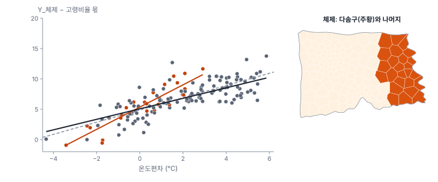
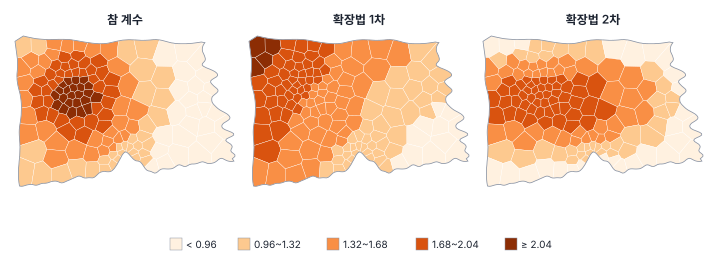
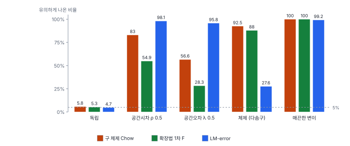

[목차](../README.md) · 이전: [27강 공간 회귀의 확장](27-spatial-regression-extensions.md) · 다음: 29강 지리가중회귀(GWR) (집필 예정)

# 28강 공간 비정상성

> 앱 지원: ◐ 체제 더미와 확장법은 앱의 계산 필드와 OLS로, Chow 검정과 공간 체제 모형은 코드로 함 · 읽는 시간 약 40분

## 이 강에서 얻는 것

- 회귀 계수가 지역마다 다른 공간 비정상성(공간 이질성)이 무엇이고, 전역 모형이 그것을 어떻게 숨기는지 앎
- 공간 체제 모형과 Chow 검정, 확장법(Casetti)으로 계수의 지역 차이를 모형화하고 검정할 수 있음
- 공간 의존성과 공간 이질성이 같은 잔차 무늬를 만들어 가르기 어려운 이유를 모의 실험으로 확인함

## 들어가는 질문

8강의 출동률 회귀(고령비율 + 온도편차)를 구마다 따로 적합하면 온도편차의 계수가 라온구 0.14, 가람구 0.58, 마루구 1.68, 누리구 1.93, 다솜구 2.29로 크게 달라 보임. 그렇다면 "더위의 영향은 다솜구에서 가장 크고 라온구에서는 거의 없다"고 써도 되는가? 계수 하나로 도시 전체를 요약한 6부의 모형들은 이런 차이를 처음부터 무시한 셈인데, 그래도 되는가?

7부는 이 질문을 다룸. 이 강은 지역 차이를 모형화하는 고전적인 두 방법(공간 체제, 확장법)과, 그 차이가 진짜인지 판단할 때 부딪히는 근본적인 어려움을 봄. 29~30강은 계수를 위치마다 따로 추정하는 지리가중회귀(GWR)로 이어짐.

## 1. 전역 모형이 숨기는 것

지금까지의 회귀는 계수 β가 어디서나 같다고 가정했음. 이 가정을 **정상성**(stationarity)이라 하고, 관계 자체가 위치에 따라 달라지는 것을 **공간 비정상성**(spatial non-stationarity) 또는 **공간 이질성**(spatial heterogeneity)이라 함(Anselin 1988; Fotheringham, Brunsdon & Charlton 2002). 6부가 다룬 공간 의존성(이웃끼리 닮음)과 함께 공간 자료의 두 가지 특성임(0강).

공간 이질성은 두 모습으로 나타남.

- **구조의 불안정**: 계수가 지역마다 다름. 도심과 외곽, 해안과 내륙에서 같은 변수가 다른 크기로 작용하는 경우임
- **공간 이분산**: 오차의 분산이 지역마다 다름. 8강의 이분산과 같은 문제가 지역 단위로 나타나는 것임

이 강은 주로 앞의 것을 다룸. 24강의 연습용 모의 자료에 규칙을 공개한 두 변수를 더했음.

| 변수 | 만든 규칙 |
|---|---|
| Y_체제 | y = 5 + 0.3 × 고령비율 + b₂ × 온도편차 + ε. b₂는 다솜구 2.0, 나머지 네 구 1.0 |
| Y_변이 | 같은 식에서 b₂가 위치에 따라 매끄럽게 변함. 도시 서쪽 가운데(가람·누리·라온구가 만나는 곳)에서 2.2로 가장 크고 바깥으로 갈수록 0.8까지 작아짐 |

ε는 평균 0, 표준편차 1.5인 정규분포(각 변수마다 따로 뽑음)이고, 고령비율의 계수 0.3은 어디서나 같음. 파일에는 행정동 중심점 좌표 `X_km`, `Y_km`(km)도 넣었음.

Y_체제를 OLS로 적합하면 온도편차 계수가 1.007로 나옴. 동 150개 가운데 125개가 계수 1.0인 지역이라 전역 계수는 그쪽에 끌리고, 다솜구 25개 동의 두 배 강한 관계는 평균 속에 묻힘.



전역 계수는 "평균적인 동"에 대한 답일 뿐, 어느 동에 대한 답도 아닐 수 있음. 정책이 지역마다 다르게 집행된다면 이 차이가 핵심 정보임.

## 2. 공간 체제와 Chow 검정

지역을 몇 개의 **공간 체제**(spatial regime)로 나누고 체제마다 다른 계수를 허용하는 것이 가장 단순한 방법임(Anselin 1988, 1990). 체제는 분석 전에 정함. 체제 경계를 어디에 긋느냐에 따라 결과가 달라질 수 있음(3강의 가변적 공간 단위 문제). 행정구역, 도심과 외곽, 해안과 내륙처럼 이론이나 제도가 차이를 예상하는 구분을 씀. 자료로 체제를 찾는 방법은 8부(영역화)에서 다룸.

체제 차이가 우연인지는 **Chow 검정**(Chow 1960)으로 봄. 모든 체제에 같은 계수를 쓴 모형(제약 모형)과 체제마다 따로 쓴 모형(비제약 모형)의 잔차 제곱합(RSS)을 비교함.

$$
F = \frac{(RSS_{\text{합침}} - RSS_{\text{따로}}) / q}{RSS_{\text{따로}} / (n - k_{\text{따로}})}
$$

q는 체제 때문에 늘어난 계수의 수, k_따로는 비제약 모형의 계수 수임. 계수 하나씩(예: 온도편차 기울기만) 검정할 수도 있음.

### 손으로 해 보기: 두 집단

두 집단 A, B에서 x = 1, 2, 3, 4이고, y는 A가 (2, 3, 5, 6), B가 (1, 3, 6, 8)임.

- 따로 적합: A는 절편 0.5, 기울기 1.4, RSS 0.2. B는 절편 −1.5, 기울기 2.4, RSS 0.2
- 합쳐 적합: 절편 −0.5, 기울기 1.9, RSS 3.4
- 체제 때문에 늘어난 계수는 절편과 기울기 2개(q = 2), 비제약 모형의 계수는 4개
- F = ((3.4 − 0.4) / 2) / (0.4 / (8 − 4)) = 1.5 / 0.1 = 15.0, 자유도 (2, 4)에서 p = 0.014

관측치가 8개뿐이어도 두 집단의 기울기 차이(1.4 대 2.4)가 잔차에 비해 커서 유의함.

### 연습용 자료에 적용하기

체제를 "다솜구 대 나머지"로 두고 체제 모형을 적합했음. PySAL은 Chow 검정을 체제마다 오차 분산을 따로 둔 왈드 검정(카이제곱) 형태로 줌. 고전적 Chow 검정(F)은 체제 간 오차 분산이 같다고 가정하지만, 이 자료에서는 두 방식의 결론이 같았음.

| | 온도편차 기울기: 다솜구 | 나머지 | 기울기 차이 검정 (χ², 자유도 1) | 전체 Chow (χ², 자유도 3) |
|---|---|---|---|---|
| Y_체제 | 1.837 | 0.866 | 20.03 (p < 0.001) | 32.50 (p < 0.001) |
| Y_독립 | 1.604 | 1.460 | 0.50 (p 0.481) | 9.92 (p 0.019) |

- Y_체제에서는 기울기 차이(참 차이 1.0)를 0.97로 찾아냈음
- Y_독립은 계수가 어디서나 같은 자료인데도 전체 Chow가 p 0.019로 유의함. 기울기는 차이가 없고, 절편과 고령비율 쪽의 우연한 차이가 겹친 결과임. 체제 나누는 법을 여러 가지 시도해 유의한 것 하나를 고르면 이런 우연을 발견으로 착각하게 됨. 체제는 분석 전에 정하고, 시도한 구분을 모두 보고함

### 한빛시 출동률

들어가는 질문의 구별 계수를 5개 구 체제 모형으로 검정하면, 전체 Chow는 13.71(자유도 12, p 0.320)이고 온도편차 기울기만 봐도 4.47(자유도 4, p 0.347)임. 구별 계수가 0.14에서 2.29까지 크게 달라 보였지만, 구마다 동이 19~39개뿐이라 계수 하나하나의 불확실성이 큼. 이 차이는 우연으로 충분히 설명됨. "다솜구에서 더위의 영향이 가장 크다"고 쓸 근거가 없음.

### 공간 의존과 함께 쓰기

체제 모형의 잔차가 공간적으로 닮았으면 24강의 문제가 그대로 생겨, OLS의 Chow 검정이 지나치게 자주 유의해짐(4절). 그래서 Anselin(1990)은 공간오차·공간시차 모형에 체제를 넣은 **공간 Chow 검정**을 제안했음. PySAL의 `ML_Error_Regimes`, `ML_Lag_Regimes`가 이를 추정함. 다만 4절에서 보듯 이것으로도 두 문제가 깔끔히 갈리지는 않음.

## 3. 확장법

체제는 경계에서 계수가 갑자기 바뀐다고 가정함. 계수가 공간에서 **매끄럽게** 변한다고 보면, 계수 자체를 좌표의 함수로 둘 수 있음. 이것이 카세티(Casetti 1972)의 **확장법**(expansion method)임.

$$
\beta_k(u, v) = \beta_{k0} + \beta_{k1} u + \beta_{k2} v
$$

(u, v)는 중심점 좌표임. 원래 식에 넣으면 xₖ·u, xₖ·v라는 상호작용 항이 생기므로, 새 변수를 만들어 OLS로 추정하면 됨. 상호작용 항의 계수가 0인지(F 검정)가 곧 "이 계수가 공간에서 변하는가"의 검정임. 2차식(u², v², uv)이나 거리 같은 다른 함수로도 넓힐 수 있음.

Y_변이의 온도편차 계수를 좌표의 1차식으로 넓히면(u, v는 중심점 좌표에서 38 km, 454 km를 뺀 값) 다음과 같음.

- 온도편차 계수 = 1.468 − 0.0405(u) + 0.0286(v). 서쪽과 북쪽으로 갈수록 커지는 기울어진 평면임
- 두 상호작용 항의 F = 11.32(p < 0.001)로 계수가 공간에서 변한다는 것은 분명히 잡음
- 그러나 참 계수와의 상관은 0.729에 그침. 2차식으로 넓히면 0.835로 나아짐



확장법의 장점은 OLS 하나로 추정하고 검정할 수 있다는 것임. 약점은 변이의 모양을 미리 정해야 한다는 것임. 1차식은 언덕을 기울어진 평면으로밖에 그리지 못하고, 다항식의 차수를 높이면 상호작용 항끼리 강하게 얽히고(다중공선성) 가장자리에서 값이 튐(2차식의 추정 범위 0.17~1.90). 계수의 모양을 미리 정하지 않고 위치마다 따로 추정하는 방법이 GWR(29강)임.

한빛시 출동률에 1차 확장법을 적용하면 F = 1.559(p 0.214)로, 온도편차 계수가 공간에서 변한다는 증거가 없음. 2절의 체제 검정과 같은 결론임.

## 4. 의존성인가 이질성인가

공간 의존성과 공간 이질성은 개념은 다르지만, 자료에서는 같은 모습으로 나타남. 둘 다 "이웃한 동의 잔차가 비슷하다"는 무늬를 만들기 때문임.

- 계수가 매끄럽게 변하는데 전역 계수 하나로 적합하면, 계수가 실제보다 큰(작은) 지역의 잔차는 온도편차를 따라 한쪽으로 함께 치우침. 잔차가 닮아 보임
- 오차가 공간적으로 닮으면, 어떤 구는 우연히 잔차가 대체로 크고 어떤 구는 작음. 구마다 절편이 다른 것처럼 보임

연습용 자료에서 확인하면 다음과 같음.

- Y_변이(이질성만 있고 오차는 독립): 잔차 Moran's I가 0.182(p < 0.001)이고, LM-lag와 LM-error가 모두 유의함(p < 0.001). 24강의 흐름대로라면 공간 회귀를 찾게 됨
- Y_오차(의존성만 있고 계수는 어디서나 같음): 5개 구 체제의 Chow 검정이 36.86(p < 0.001)으로 유의함
- Y_시차(파급만 있음): 5개 구 체제의 Chow 검정이 55.56(p < 0.001), 1차 확장법도 F = 5.68(p 0.004)로 유의함

한 번의 우연이 아님을 모의 실험으로 확인했음. 다섯 가지 과정에서 y를 1,000번씩 만들어 세 검정을 했음.



| 과정 | 구 체제 Chow | 확장법 1차 F | LM-error |
|---|---|---|---|
| 독립 | 5.8% | 5.3% | 4.7% |
| 공간시차 ρ 0.5 | 83.0% | 54.9% | 98.1% |
| 공간오차 λ 0.5 | 56.6% | 28.3% | 95.8% |
| 체제 (다솜구) | 92.5% | 88.0% | 27.6% |
| 매끈한 변이 | 100% | 100% | 99.2% |

각 검정은 자기 과정을 잘 잡지만(체제 Chow 92.5%, LM-error 95.8%), 상대 과정에서도 자주 유의함. 특히 매끈한 변이 과정에서는 세 검정이 모두 거의 100% 유의해, 검정만으로는 무엇이 원인인지 알 수 없음.

두 가지를 함께 넣은 모형도 이 자료에서는 문제를 풀지 못함. Y_오차를 5개 구 체제와 공간오차를 함께 넣은 모형으로 적합하면 λ가 0.484에서 0.223으로 줄고, 체제의 Chow 검정은 여전히 p 0.004로 유의함. 공간적으로 닮은 오차의 큰 무늬를 구별 절편이 나눠 가져가기 때문임. 단면 자료 한 장으로는 "계수가 지역마다 다르다"와 "오차가 이웃끼리 닮았다"를 원리적으로 가르기 어려움(Anselin 1988; Fotheringham 외 2002). 4부(16강)의 바틀릿 문제(1차 성질과 2차 성질의 혼동)와 같은 구조임.

그렇다면 어떻게 하는가?

1. **이론이 먼저임**: 지역에 따라 관계가 달라질 메커니즘(제도, 생활 방식, 환경)이 있는가, 이웃끼리 영향을 주는 메커니즘이 있는가를 먼저 따짐
2. **체제와 변이의 형태는 분석 전에 정함**: 자료를 보고 정한 구분은 검정의 의미를 잃음
3. **둘 다 비교하고 둘 다 보고함**: 공간 회귀와 체제·확장법·GWR의 적합도와 결론을 함께 보고, 결론이 갈리면 그 사실을 적음
4. **다른 자료로 확인함**: 다른 시기의 자료나 다른 지역에서도 같은 차이가 나오는지 봄. 패널 자료(27강 4절, 9부 시공간)에서는 지역 고정효과와 시간에 따른 변화로 두 문제를 더 잘 가를 수 있음

## 해 보기: GeoStat에서 체제와 확장법

1. `book/data/practice/hanbit_dong_sim.gpkg`를 열고 **공간 분석 → 공간가중치 만들기…** 메뉴에서 **퀸 인접 (Queen)** 가중치를 만듦. 28강에서 `X_km`, `Y_km`, `Y_체제`, `Y_변이` 열을 더했음
2. **공간 분석 → 회귀 분석 (OLS · 공간회귀 · GWR · MGWR)…** 메뉴에서 모형 **OLS (최소제곱)**, 종속변수 (y) `Y_체제`, 독립변수 `고령비율`과 `온도편차`, 접두어 `R0`으로 실행함
   - 확인: 온도편차 1.007, R² 0.4263, 잔차 Moran's I 0.08323(p 0.042), 결과 카드의 AICc 598.2
3. **공간 분석 → 계산 필드 추가…** 메뉴로 체제 변수를 만듦
   - `다솜` = `` (`구` == "다솜구") * 1 ``
   - `다솜_온도` = `` `다솜` * `온도편차` ``
4. 회귀 분석 창에서 종속변수 `Y_체제`, 독립변수 `고령비율`, `온도편차`, `다솜`, `다솜_온도`를 고르고 접두어 `R1`로 실행함
   - 확인: 온도편차 0.855(나머지 구의 기울기), 다솜_온도 1.016(p < 0.001, 다솜구에서 기울기가 더 큰 정도), 다솜 0.5822(p 0.139). 다솜구의 기울기는 0.855 + 1.016 = 1.871임(참값 2.0)
   - 확인: 모형 비교 카드에 R0 598.206, R1 577.828이 나오고 R1에 **최적** 표시가 붙음. 잔차 Moran's I −0.05127(p 0.594)
   - 여기서는 고령비율의 기울기를 체제마다 나누지 않았으므로 2절의 표(체제마다 모든 계수를 나눈 모형)와 숫자가 조금 다름
5. 종속변수 `Y_변이`, 독립변수 `고령비율`과 `온도편차`로 접두어 `V0`을 실행함
   - 확인: 온도편차 1.286, 잔차 Moran's I 0.1823(p < 0.001). 진단 표에서 LM (lag)과 LM (error)는 p < 0.001로 유의하지만 Robust LM (lag) p 0.531, Robust LM (error) p 0.179로 둘 다 유의하지 않음. 오차가 독립인 자료인데 공간 의존이 있는 것처럼 보임
6. 계산 필드로 확장법 변수를 만듦
   - `온도_x` = `` `온도편차` * (`X_km` - 38) ``
   - `온도_y` = `` `온도편차` * (`Y_km` - 454) ``
7. 종속변수 `Y_변이`, 독립변수 `고령비율`, `온도편차`, `온도_x`, `온도_y`로 접두어 `V1`을 실행함
   - 확인: 온도편차 1.468, 온도_x −0.04046(p < 0.001), 온도_y 0.02863(p 0.038). AICc 580.105로 V0(597.551)보다 작음. 잔차 Moran's I는 0.08143(p 0.026)으로 줄었지만 남아 있음(1차식으로는 언덕을 다 잡지 못함)
8. 계산 필드 `b2_확장` = `` 1.468 - 0.04046 * (`X_km` - 38) + 0.02863 * (`Y_km` - 454) ``를 만들어 지도로 그리고, 3절 그림 가운데와 비교함

### 코드로: Chow 검정과 확장법

```python
import contextlib
import io
import warnings

import geopandas as gpd
import numpy as np
import spreg

warnings.filterwarnings("ignore")
sim = gpd.read_file("book/data/practice/hanbit_dong_sim.gpkg")
names = ["고령비율", "온도편차"]
X = sim[names].to_numpy()
regime = np.where(sim["구"] == "다솜구", "다솜구", "나머지").tolist()   # 체제 두 개

for yname in ["Y_독립", "Y_체제"]:
    with contextlib.redirect_stdout(io.StringIO()):
        m = spreg.OLS_Regimes(sim[[yname]].to_numpy(), X, regime, name_x=names)
    b = dict(zip(m.name_x, m.betas.ravel()))
    stat, p = m.chow.regi[2]                                   # 셋째 줄 = 온도편차 계수의 Chow 검정
    print(f"{yname}: 온도편차 기울기 다솜구 {b['다솜구_온도편차']:.3f}, 나머지 {b['나머지_온도편차']:.3f} "
          f"| 기울기 차이 검정 {stat:.2f} (p {p:.4f}) | 전체 Chow {m.chow.joint[0]:.2f} (p {m.chow.joint[1]:.4f})")

# 확장법(Casetti): 온도편차 계수가 좌표의 1차식이라고 보고 상호작용 항을 넣음
y = sim[["Y_변이"]].to_numpy()
xc, yc = sim["X_km"].to_numpy() - 38, sim["Y_km"].to_numpy() - 454
with contextlib.redirect_stdout(io.StringIO()):
    base = spreg.OLS(y, X)
    ext = spreg.OLS(y, np.column_stack([X, X[:, 1] * xc, X[:, 1] * yc]))
F = ((base.utu - ext.utu) / 2) / (ext.utu / (len(y) - 5))
print(f"Y_변이 확장법: 온도편차 계수 = {ext.betas[2, 0]:.3f} {ext.betas[3, 0]:+.4f}·(x − 38) {ext.betas[4, 0]:+.4f}·(y − 454), F = {F:.2f}")
```

- 확인: Y_체제의 기울기 다솜구 1.837, 나머지 0.866, 기울기 차이 검정 20.03. Y_독립의 전체 Chow 9.92(p 0.0192). 확장법 F = 11.32
- 더 해 보기: `regime`을 `sim["구"].tolist()`(5개 구)로 바꿔 Y_오차와 Y_시차의 전체 Chow를 확인함(4절). `spreg.ML_Error_Regimes(y, X, regime, w=w)`로 공간오차 체제 모형을 추정해 λ와 Chow가 어떻게 바뀌는지 봄

## 헷갈리는 쌍

- **공간 의존성 vs 공간 이질성**: 이웃끼리 닮은 것(관측치 사이의 관계)과 관계 자체가 지역마다 다른 것(계수의 차이). 잔차에서는 같은 무늬로 보여 가르기 어려움
- **공간 체제 vs 확장법**: 경계에서 계수가 갑자기 바뀐다고 보는가, 좌표에 따라 매끄럽게 변한다고 보는가. 둘 다 변이의 형태를 미리 정함
- **체제 더미(절편) vs 체제 상호작용(기울기)**: 체제마다 수준만 다른가(27강의 공간 고정효과), 관계의 크기도 다른가
- **구별 회귀를 따로 돌리기 vs 체제 모형**: 모든 계수를 체제마다 나누면 결과의 계수는 같지만, 체제 모형에서는 차이를 검정할 수 있음. 구별 계수를 나란히 놓고 크기만 비교하면 우연한 차이를 발견으로 착각하기 쉬움

## 흔한 실수와 심사 지적

- **지역별 회귀 계수의 크기만 비교해 "지역마다 영향이 다르다"고 씀**
  - 지적: "그 차이는 통계적으로 유의합니까?"
  - 대응: 체제 모형과 Chow 검정(또는 상호작용 항의 검정)으로 차이를 검정함
- **체제를 결과를 보고 정함**
  - 대응: 체제는 분석 전에 이론이나 제도로 정하고, 시도한 구분을 모두 보고함
- **잔차가 닮았다는 이유만으로 공간 의존 모형을 고름**
  - 지적: "계수가 지역마다 달라서 생긴 무늬일 가능성은 검토했습니까?"
  - 대응: 체제·확장법·GWR로 이질성을 함께 점검하고, 이론으로 판단함
- **계수가 지역마다 다르다는 결론을 의존성 점검 없이 내림**
  - 대응: 체제 모형의 잔차 의존을 확인하고, 공간 Chow 검정이나 다른 시기의 자료로 확인함
- **확장법의 상호작용 항을 원래 좌표 그대로 곱함**
  - 대응: 좌표에서 중심값을 빼고 곱해 다중공선성을 줄이고, 계수 지도를 함께 보고함

## 보고서에는 이렇게 씀

> 출동률과 지표온도의 관계가 구마다 다른지 확인하기 위해, 5개 구를 공간 체제로 하는 체제별 회귀모형을 추정하였다. 구별 지표온도 계수는 0.14~2.29였으나, Chow 검정에서 계수 전체(왈드 통계량 13.71, 자유도 12, p = 0.32)와 지표온도 계수(4.47, 자유도 4, p = 0.35)의 체제 간 차이는 유의하지 않았다. 지표온도 계수를 중심점 좌표의 1차식으로 확장한 모형(Casetti 1972)에서도 확장 항은 유의하지 않았다(F = 1.56, p = 0.21). 구별 차이의 근거가 없어 지표온도의 효과는 시 전체에 하나의 계수로 보고하였다. 다만 구별 동 수(19~39개)가 적어 작은 차이를 검출할 검정력은 제한적이다.

적어야 할 항목은 다음과 같음.

- 체제를 정한 근거(분석 전에 정했는지)와 체제별 표본 크기
- Chow 검정의 통계량, 자유도, p값(전체와 관심 계수)
- 확장법이면 확장한 계수와 함수 형태, 좌표 중심화
- 잔차의 공간 의존 점검과, 의존성과 이질성 해석의 한계

## 요약

- 공간 비정상성은 회귀의 관계 자체가 위치에 따라 달라지는 것이고, 전역 계수는 그 차이를 평균 속에 숨김(Y_체제의 1.007은 참 계수 2.0과 1.0의 혼합)
- 공간 체제 모형과 Chow 검정은 경계에서 갈리는 차이를, 확장법은 좌표에 따라 매끄럽게 변하는 차이를 미리 정한 형태로 모형화하고 검정함
- 한빛시 출동률의 구별 온도 계수(0.14~2.29)는 달라 보였지만 Chow 검정(p 0.32)과 확장법(p 0.21) 모두 유의하지 않았음
- 공간 의존성과 이질성은 같은 잔차 무늬를 만듦. 모의 실험에서 이질성 검정은 의존 과정에서, 의존성 검정은 이질 과정에서 자주 유의했음
- 둘을 가르려면 이론, 사전에 정한 형태, 여러 모형의 비교, 다른 자료가 필요함

## 핵심 용어

| 한글 | 영문 | 비고 |
|---|---|---|
| 공간 비정상성 | Spatial Non-stationarity | |
| 공간 이질성 | Spatial Heterogeneity | Anselin 1988 |
| 구조의 불안정 | Structural Instability | 계수의 지역 차이 |
| 공간 이분산 | Spatial Heteroskedasticity | |
| 공간 체제 | Spatial Regimes | PySAL: OLS_Regimes |
| Chow 검정 | Chow Test | Chow 1960 |
| 공간 Chow 검정 | Spatial Chow Test | Anselin 1990 |
| 확장법 | Expansion Method | Casetti 1972 |
| 상호작용 항 | Interaction Term | |

## 원전과 더 읽을거리

**원전**

- Chow, G. C. (1960). Tests of equality between sets of coefficients in two linear regressions. *Econometrica*, 28(3), 591–605.
- Casetti, E. (1972). Generating models by the expansion method: Applications to geographical research. *Geographical Analysis*, 4(1), 81–91.
- Anselin, L. (1990). Spatial dependence and spatial structural instability in applied regression analysis. *Journal of Regional Science*, 30(2), 185–207. 공간 Chow 검정

**더 읽을거리**

- Anselin, L. (1988). *Spatial Econometrics: Methods and Models*. Kluwer Academic. 공간 이질성
- Fotheringham, A. S., Brunsdon, C., & Charlton, M. (2002). *Geographically Weighted Regression: The Analysis of Spatially Varying Relationships*. Wiley. 1~2장(지역 관계와 확장법)
- Casetti, E. (1997). The expansion method, mathematical modeling, and spatial econometrics. *International Regional Science Review*, 20(1–2), 9–33.

## 연습

1. 손계산의 집단 B를 y = (3, 4, 6, 7)(A에 1씩 더한 것)로 바꾸면 Chow F는 얼마인가? 두 집단의 기울기는 어떤가?

2. 들어가는 질문에서 구별 온도편차 계수는 0.14에서 2.29까지 달랐지만 Chow 검정은 유의하지 않았음(p 0.35). 두 사실은 어떻게 함께 성립하는가?

3. 어떤 연구자가 "도심 대 외곽", "해안 대 내륙", "북부 대 남부" 등 체제 구분 열 가지를 시도해, 그중 하나에서 Chow 검정 p = 0.02를 얻고 그것만 보고했음. 무엇이 문제인가?

4. Y_변이(오차는 독립)를 OLS로 적합하자 잔차 Moran's I가 0.182이고 LM 검정이 모두 유의했음. 이 결과만 본 연구자는 어떤 결론을 내리기 쉽고, 무엇을 더 확인해야 하는가?

5. 해 보기 8번에서 그린 1차 확장법의 계수 지도는 참 계수(3절 그림 왼쪽)와 어디에서 가장 다른가? 그 이유는 무엇인가?

<details>
<summary>해답</summary>

1. 두 집단의 기울기는 1.4로 같고 절편만 0.5와 1.5로 다름. 따로 적합한 RSS는 0.2 + 0.2 = 0.4, 합쳐 적합하면(절편 1.0, 기울기 1.4) RSS 2.4. F = ((2.4 − 0.4) / 2) / (0.4 / 4) = 10.0(p 0.028). 전체 Chow 검정은 절편 차이에도 반응하므로, 기울기 차이를 보려면 기울기만 따로 검정함.

2. 구마다 동이 19~39개뿐이라 구별 계수의 표준오차가 큼. 계수가 서로 크게 달라 보여도 그 차이가 표준오차에 비해 크지 않으면 우연으로 설명됨. 다섯 개의 추정값을 나란히 놓으면 가장 큰 것과 가장 작은 것의 차이는 우연만으로도 커지기 마련임.

3. 여러 구분을 시도하면 진짜 차이가 없어도 우연히 유의한 결과가 나올 확률이 커짐(7강의 다중검정). 열 번 시도하면 적어도 한 번 5%에서 유의할 확률은 (시도가 서로 독립이라면) 약 40%임. Y_독립에서도 "다솜구 대 나머지"의 전체 Chow가 p 0.019였음. 체제는 분석 전에 이론으로 정하고, 시도한 구분을 모두 보고하며, 필요하면 다중검정을 보정함.

4. 공간 의존이 있다고 보고 공간오차·공간시차 모형을 고르기 쉬움. 그러나 이 잔차 무늬는 온도편차의 계수가 지역마다 달라 생긴 것임. 확장법(F = 11.32, p < 0.001)이나 GWR로 계수의 공간 변이를 점검하고, 계수가 달라질 이론적 이유가 있는지 따져야 함. 이질성을 모형화한 뒤 잔차 의존이 얼마나 남는지도 봄.

5. 참 계수는 도시 서쪽 가운데가 가장 높은 언덕인데, 1차 확장법은 서쪽·북쪽으로 갈수록 계속 커지는 평면이라 북서쪽 모서리(가람구 바깥쪽)에서 가장 크게 나옴. 언덕 꼭대기는 덜 높게, 서쪽 끝은 실제보다 높게 그림. 1차식은 기울기만 표현할 수 있어 봉우리를 만들 수 없기 때문임.

</details>

---

[목차](../README.md) · 이전: [27강 공간 회귀의 확장](27-spatial-regression-extensions.md) · 다음: 29강 지리가중회귀(GWR) (집필 예정)
