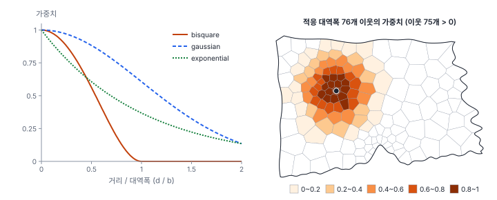
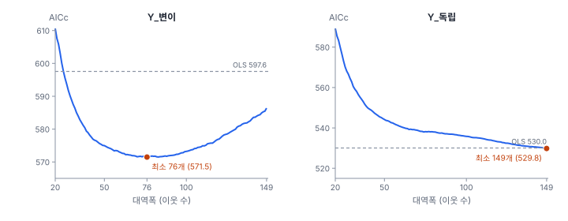
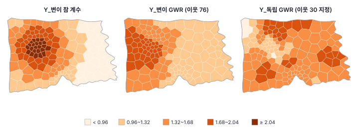
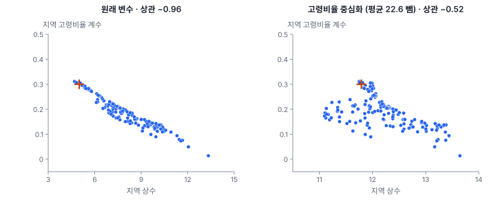
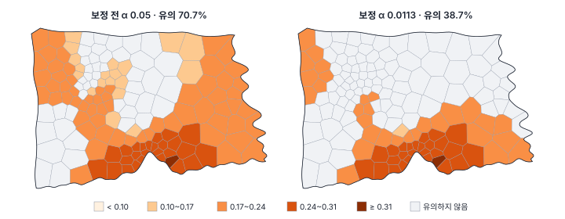

[목차](../README.md) · 이전: [28강 공간 비정상성](28-spatial-nonstationarity.md) · 다음: [30강 MGWR과 해석](30-mgwr.md)

# 29강 지리가중회귀(GWR)

> 앱 지원: ● 앱에서 따라 할 수 있음 (다중검정 보정, 지역 다중공선성, 계수 변이 검정은 코드로 보충함) · 읽는 시간 약 50분

## 이 강에서 얻는 것

- 지리가중회귀(GWR)가 위치마다 가까운 관측치에 큰 가중치를 주어 따로 회귀를 푸는 방법임을 손으로 계산해 앎
- 커널, 고정·적응 대역폭, AICc로 대역폭을 고르는 원리와 유효 모수 수(ENP)의 뜻을 앎
- 계수 지도를 읽을 때 생기는 세 가지 함정(지역 다중공선성, 보정하지 않은 다중검정, 대역폭이 만드는 거짓 변이)을 알고 점검할 수 있음

## 들어가는 질문

28강의 Y_변이는 온도편차의 계수가 도시 서쪽 가운데에서 언덕처럼 커지도록 만든 자료였음. 확장법은 그 언덕을 미리 정한 식(1차, 2차 다항식)의 모양으로만 그릴 수 있었음. 계수의 모양을 미리 정하지 않고 "동마다 그 동 둘레의 자료로 따로 회귀를 풀면" 어떨까? 그렇게 얻은 150개의 계수 지도는 믿을 만한가? 지도에 무늬가 보이면 관계가 정말 지역마다 다른 것인가?

## 1. 위치마다 따로 푸는 회귀

**지리가중회귀**(geographically weighted regression, GWR)는 계수가 위치 (u, v)의 함수라고 보고(Brunsdon, Fotheringham & Charlton 1996; Fotheringham, Brunsdon & Charlton 2002), 각 관측 위치에서 가까운 관측치일수록 큰 가중치를 준 가중 최소제곱으로 계수를 추정함.

$$
y_i = \beta_0(u_i, v_i) + \sum_{k} \beta_k(u_i, v_i)\, x_{ik} + \varepsilon_i,
\qquad
\hat{\boldsymbol\beta}(u_i, v_i) = (X^\top W_i X)^{-1} X^\top W_i\, \mathbf y
$$

W_i는 i번째 위치에서 다른 관측치까지의 거리로 정한 가중치를 대각에 놓은 행렬임. 6부의 공간가중치 W(이웃 사이의 관계)와 이름은 같지만 역할이 다름. GWR의 W_i는 "i의 회귀를 풀 때 각 관측치를 얼마나 믿을지"를 정함. 관측치가 n개면 가중 회귀를 n번 푸는 셈임.

가중치는 거리 d와 **대역폭**(bandwidth) b로 정하는 **커널** 함수에서 나옴.

| 커널 | 가중치 | 성질 |
|---|---|---|
| bisquare | (1 − (d/b)²)², d < b일 때 (그 밖은 0) | 대역폭 밖은 쓰지 않음. 앱의 기본값 |
| gaussian | exp(−½ (d/b)²) | 모든 관측치를 씀. 멀수록 작아짐 |
| exponential | exp(−d/b) | 모든 관측치를 씀. 가까운 곳에서 빨리 줄어듦 |

대역폭을 정하는 방법은 두 가지임.

- **고정 대역폭**: b를 거리(m)로 정함. 어디서나 같은 반경을 씀. 동이 듬성한 외곽에서는 반경 안의 관측치가 적어 계수가 불안정해짐
- **적응 대역폭**: b를 "N번째로 가까운 관측치까지의 거리"로 정함. 어디서나 같은 수의 이웃을 씀. 동이 촘촘한 도심에서는 반경이 좁고 외곽에서는 넓어짐. 앱의 기본값



오른쪽 지도의 동(누리13동)은 자기를 포함해 가장 가까운 76개 동까지의 거리 7.24 km를 대역폭으로 씀. 76번째 동은 d = b라 가중치가 0이므로 실제로 쓰이는 동은 75개임.

### 손으로 해 보기: 기울기가 바뀌는 길

1차원 길 위 0, 1, 2, 3, 4, 5 km에 관측치 6개가 있음. x = 1, 2, 3, 4, 5, 6이고, y는 0~2 km에서 y = x(기울기 1), 3~5 km에서 y = 2x − 3(기울기 2)을 따라 1, 2, 3, 5, 7, 9임. 고정 bisquare 대역폭 3 km로 2 km 지점의 계수를 구함.

- 가중치: 거리 0, 1, 2 km는 1, (1 − 1/9)² = 64/81 ≈ 0.790, (1 − 4/9)² = 25/81 ≈ 0.309. 거리 3 km 이상(5 km 지점)은 0
- 가중 평균: Σw = (25 + 64 + 81 + 64 + 25)/81 = 259/81 = 3.198. Σwx = 777/81 = 9.593, Σwy = 891/81 = 11.000이므로 x̄ = 3.000, ȳ = 3.440
- 기울기 = Σw(x − x̄)(y − ȳ) / Σw(x − x̄)² = 6.074 / 4.049 = 1.500, 절편 = ȳ − 1.500 × x̄ = −1.060

같은 계산을 다른 지점에서 하면 기울기가 0 km 1.000, 1 km 1.205, 2 km 1.500, 3 km 1.848, 5 km 2.000으로 바뀜. 전체를 하나로 적합한 OLS의 기울기 1.629는 어느 지점에도 맞지 않음. GWR은 계수의 모양을 미리 정하지 않고, 가까운 자료가 말하는 대로 위치마다 다른 계수를 줌. 대신 경계 근처(2~3 km)에서는 양쪽 관계를 섞어, 실제로는 1에서 2로 갑자기 바뀌는 기울기를 매끄럽게 그림.

## 2. 대역폭 고르기

대역폭은 GWR의 결과를 가장 크게 좌우함. 대역폭이 작으면 위치마다 쓰는 자료가 적어 계수가 잡음까지 따라 흔들리고(분산이 큼), 크면 계수가 평평해져 진짜 변이를 놓침(편향이 큼). 대역폭이 무한히 크면 모든 가중치가 1이 되어 OLS와 같아짐.

이 균형을 자료로 정하는 기준은 둘임.

- **교차검증(CV)**: i번째 관측치를 빼고 추정한 계수로 yᵢ를 예측한 오차의 제곱합이 가장 작은 대역폭(20강의 교차검증과 같은 생각)
- **AICc**: 적합도와 모형의 복잡도를 함께 봄(Hurvich, Simonoff & Tsai 1998). GWR의 표준 기준이고 앱의 기본값임

$$
\text{AICc} = 2n \ln \hat\sigma + n \ln 2\pi + n\, \frac{n + \operatorname{tr}(S)}{n - 2 - \operatorname{tr}(S)}
$$

S는 ŷ = Sy인 **모자 행렬**(hat matrix)이고, 그 대각합 tr(S)를 **유효 모수 수**(effective number of parameters, ENP)라 함. OLS에서는 계수 수와 같고(상수와 변수 2개면 3), 대역폭이 작아질수록 커짐. GWR이 "계수를 몇 개 추정한 만큼 자유로운가"를 나타냄. σ̂는 √(RSS / n)임.



- Y_변이: AICc는 이웃 76개에서 가장 작음(571.49). OLS(597.55)보다 26 낮아, 계수가 변한다는 자료의 신호를 잡음
- Y_독립: 대역폭을 키울수록 AICc가 계속 줄어 탐색 상한(n = 150) 바로 아래인 149개에서 가장 작음(529.81). OLS(530.04)와 거의 같음. 계수가 어디서나 같은 자료에서는 "가능한 한 전역에 가깝게"를 고름. 대역폭이 n에 가깝게 나오면 GWR이 전역 모형보다 나을 것이 없다는 신호임

### 기준과 커널에 따라

Y_변이에 여러 설정을 적용했음(대역폭 탐색은 mgwr의 황금분할 탐색). CV 행은 코드로 계산했음. 이 책을 쓰는 시점의 앱에서는 GWR에 **교차검증 (CV)** 기준을 고르면 오류가 나므로, 앱에서는 AICc, AIC, BIC만 씀.

| 설정 | 대역폭 | ENP | AICc | 온도편차 계수 범위 | 참 계수와 상관 |
|---|---|---|---|---|---|
| bisquare · 적응 · AICc (앱 기본) | 76개 | 13.24 | 571.49 | 1.06~2.02 | 0.781 |
| bisquare · 적응 · AIC | 61개 | 16.51 | 572.61 | 1.03~2.06 | 0.761 |
| bisquare · 적응 · BIC | 116개 | 8.14 | 575.73 | 1.08~1.76 | 0.798 |
| bisquare · 적응 · CV | 63개 | 16.06 | 572.23 | 1.04~2.06 | 0.763 |
| gaussian · 적응 · AICc | 48개 | 6.05 | 580.70 | 1.16~1.70 | 0.799 |
| exponential · 적응 · AICc | 48개 | 8.22 | 580.60 | 1.18~1.61 | 0.812 |
| bisquare · 고정 · AICc | 9.92 km | 14.91 | 568.49 | −0.41~2.04 | 0.706 |

- 같은 bisquare 적응 커널에서 기준만 바꿔도 대역폭이 61~116개로 달라짐. BIC는 복잡도에 벌점을 크게 주어 더 매끄러운(넓은) 대역폭을 고름
- gaussian과 exponential은 대역폭 밖도 쓰므로 같은 "48개"라도 bisquare의 48개보다 훨씬 넓게 평균함. 커널이 다르면 대역폭 숫자를 비교하지 않고 ENP와 AICc로 비교함
- 고정 대역폭은 AICc가 가장 작았지만 계수가 −0.41까지 내려가는 동이 있음. 동이 듬성한 가장자리에서 반경 9.92 km 안의 관측치가 적어 추정이 불안정해진 것임. 관측 밀도가 고르지 않은 행정구역 자료에서는 적응 대역폭이 안전함
- 참 계수와의 상관은 0.71~0.81로 비슷함. AICc가 가장 작은 설정이 참 계수를 가장 잘 그리는 것은 아님. 대역폭은 하나의 "정답"이 아니라 분석의 척도를 정하는 선택이고, 30강의 MGWR은 이 선택을 변수마다 따로 함

## 3. 결과 읽기: 계수 지도

GWR은 위치마다 계수, 표준오차, t값을 주므로 결과를 지도로 읽음.



Y_변이의 GWR(이웃 76개) 결과는 다음과 같음.

- 온도편차 계수 1.06~2.02(참값 0.80~2.19), 참 계수와 상관 0.781, 평균 제곱근 오차 0.287. 28강 확장법의 1차식(상관 0.729)보다 낫고 2차식(0.835)보다 조금 못함. 언덕의 자리는 잘 찾지만, 76개 동을 가중 평균하므로 꼭대기는 깎이고 바닥은 메워짐(평활 편향)
- R² 0.7583, 지역 R²(각 위치의 가중 회귀가 설명하는 비율) 0.650~0.814
- 잔차 Moran's I가 OLS의 0.182에서 −0.043(p 0.223)으로 사라짐. 28강 4절에서 본 대로, 계수의 변이를 모형에 넣자 "공간 의존"처럼 보이던 잔차 무늬가 없어짐

그런데 고령비율의 계수(참값은 어디서나 0.3)는 0.014~0.311로 크게 흔들리고, 상수(참값 5)는 4.70~13.33으로 더 크게 흔들림. 변하지 않는 계수까지 변하는 것처럼 나옴. 그 이유가 다음 절임.

## 4. 지역 다중공선성과 계수의 맞바꿈

설명변수끼리 상관이 높으면 OLS의 계수가 불안정해짐(8강의 다중공선성). GWR은 위치마다 적은 수의 관측치로 회귀를 푸므로 이 문제가 더 심함. 한 지역 안에서는 변수의 변동 폭이 좁고, 지역에 따라 변수끼리의 상관이 전역보다 강해질 수 있기 때문임. 그 결과 지역 계수끼리 서로 상관을 갖고 맞바뀌는 현상이 생김(Wheeler & Tiefelsdorf 2005).



- 고령비율과 온도편차의 상관은 도시 전체로 −0.750이고, 지역(가중) 상관은 −0.888~−0.281임
- 지역 상수와 지역 고령비율 계수의 상관이 −0.956임. 고령비율은 12~36%라 상수(고령비율 0%일 때의 값)는 자료에서 멀리 떨어진 곳을 외삽한 값임. 그래서 기울기가 조금 바뀌면 상수가 크게 반대로 움직임
- 고령비율에서 평균(22.63)을 빼고 적합하면 상수가 "평균 고령비율인 동의 기댓값"이 되어 범위가 11.10~13.65로 좁아지고 맞바꿈도 −0.523으로 줄어듦. 온도편차 계수는 전혀 바뀌지 않음

지역 다중공선성은 다음으로 점검함(Wheeler 2007).

- **지역 조건수**(local condition number): 위치마다의 가중 설명변수 행렬의 조건수. 30을 넘으면 문제가 심하다고 봄(Belsley 기준). 이 자료는 14.4~26.5로 기준 아래임
- **지역 VIF**: 최대 4.73(기준 10 아래)
- **지역 계수끼리의 상관**: 위의 −0.956처럼 진단 기준을 넘지 않아도 계수끼리 강하게 얽힐 수 있음. 진단값만 보지 말고 계수 지도 두 장을 나란히 놓고 거울상인지 봄

계수 지도에서 두 변수의 무늬가 서로 반대로 생겼다면, 두 관계가 정말 지역마다 다른 것이 아니라 추정이 맞바꾼 결과일 수 있음. 설명변수의 중심화, 변수 줄이기, 30강의 MGWR(변수마다 대역폭을 따로 정해 변하지 않는 계수는 넓게 평균함)로 줄일 수 있음.

## 5. 유의성: 무엇을 검정하는가

### 지역 t값은 "0인가"를 물음

GWR은 위치마다 t = β̂ₖ(i) / SE를 줌. 이 t값은 "i에서 계수가 0인가"를 검정하는 것이지, "계수가 지역마다 다른가"를 검정하는 것이 아님. 3절 그림 오른쪽의 Y_독립(대역폭 30 지정)은 온도편차 계수가 0.88~1.97로 흔들리지만 150개 동 모두에서 "유의"함. 계수가 어디서나 0이 아니라는 뜻일 뿐, 그 무늬가 진짜라는 뜻이 아님.

### 다중검정

150개 동에서 t 검정을 150번 하면 7강의 다중검정 문제가 생김. 다만 이웃한 동의 GWR 계수는 같은 관측치를 나눠 쓰므로 150개의 검정은 서로 독립이 아님. 다 실바와 포더링엄(da Silva & Fotheringham 2016)은 독립인 검정의 수를 "ENP / 계수 수"로 보고, 그만큼 α를 나누는 보정을 제안했음.

$$
\alpha_{\text{보정}} = \frac{\alpha \cdot k}{\text{ENP}} = \frac{0.05 \times 3}{13.24} = 0.01133
$$

자유도 149의 t분포에서 임계값이 1.976에서 2.564로 커짐. Y_변이의 고령비율 계수가 유의한 동은 보정 전 70.7%에서 보정 후 38.7%로 줄어듦. 참값 0.3은 어디서나 0이 아니므로 더 많이 유의해야 맞지만, 4절의 맞바꿈으로 고령비율 계수가 작게 나온 동이 많아 보정하면 절반 넘게 유의하지 않게 됨.



앱의 GWR 결과에서는 다음을 구별해야 함(이 책을 쓰는 시점의 GeoStat).

- 진단 표의 **보정 유의수준 (상수 기준)** 항목은 위의 보정 α(0.01133)를 보여 줌
- 그러나 지역 계수 표의 **유의%**, `<접두어>_SIG_<변수>` 열, 계수 지도의 **유의하지 않은 지역 가리기**는 보정하지 않은 α 0.05(|t| > 1.976) 기준임
- 보정한 판단은 `<접두어>_T_<변수>` 열로 직접 함. 해 보기 6번처럼 계산 필드로 |t| > 2.564인 동을 표시함

### 계수가 정말 변하는가: 몬테카를로 검정

"계수가 지역마다 다른가"는 별도로 검정해야 함. 포더링엄 외(2002)의 몬테카를로 검정은 7강의 순열 검정과 같은 생각임. 좌표를 관측치끼리 뒤섞으면 위치와 관계의 연결이 끊김. 뒤섞은 자료마다 대역폭을 다시 고르고 GWR을 적합해, 지역 계수의 표준편차가 실제 자료보다 크게 나온 비율을 유사 p로 봄.

| 자료 | 대역폭 | 상수 | 고령비율 | 온도편차 |
|---|---|---|---|---|
| Y_변이 | 76개 | 0.02 | 0.04 | 0.01 |
| Y_독립 | 149개 | 0.61 | 0.54 | 0.68 |
| 출동률 | 149개 | 0.56 | 0.52 | 0.62 |

좌표 순열 99회의 유사 p(가장 작은 값은 1/100 = 0.01)임. Y_변이의 온도편차는 가장 작은 값(0.01)으로 변이가 분명하고, Y_독립은 모든 계수에서 변이의 증거가 없음. 그러나 Y_변이의 고령비율도 p 0.04로 유의하게 나옴. 참값은 어디서나 0.3인데, 온도편차의 변이와 함께 하나의 대역폭으로 추정한 탓에 4절의 맞바꿈이 고령비율에 "변이"를 만든 것임. GWR은 모든 계수에 같은 대역폭을 쓰므로, 변하는 계수 하나가 변하지 않는 계수까지 흔들 수 있음. 30강의 MGWR이 이 문제를 다룸.

## 6. 한빛시 출동률

8강의 출동률 회귀(고령비율 + 온도편차)를 GWR로 적합하면 다음과 같음.

- 대역폭이 탐색 상한 바로 아래인 149개 이웃으로 골라짐(ENP 5.01). 거리에 따라 완만히 줄어드는 아주 넓은 평활이라 전역 회귀에 가까움
- AICc 966.555로 OLS(966.398)보다 오히려 조금 큼. R²는 0.175에서 0.198로 늘었지만 늘어난 복잡도만큼의 값어치가 없음
- 온도편차 지역 계수 1.38~2.11(OLS 1.757)이지만, 몬테카를로 검정의 유사 p가 0.62로 변이의 증거가 없음

28강의 체제 Chow 검정(p 0.32)과 확장법(p 0.21)에 이어 GWR도 같은 결론을 줌. 출동률과 지표온도의 관계는 시 전체에 하나의 계수로 보고하는 것이 맞음. 이렇게 GWR은 "변이가 있다"는 것만이 아니라 "변이가 없다"는 것도 확인해 주는 도구임. 다만 계수 지도를 그려 보면 1.38~2.11의 무늬가 보이므로, 대역폭과 검정 결과를 함께 보지 않고 지도만 보면 없는 지역 차이를 읽게 됨.

## 해 보기: GeoStat에서 GWR

1. `book/data/practice/hanbit_dong_sim.gpkg`를 열고 **공간 분석 → 공간가중치 만들기…** 메뉴에서 **퀸 인접 (Queen)** 가중치를 만듦(잔차 Moran's I 진단용. GWR의 커널 가중치는 앱이 중심점 거리로 따로 계산함)
2. **공간 분석 → 회귀 분석 (OLS · 공간회귀 · GWR · MGWR)…** 메뉴에서 모형 **지리가중회귀 (GWR)**, 종속변수 (y) `Y_변이`, 독립변수 `고령비율`과 `온도편차`를 고름. **커널**은 bisquare (권장), **대역폭 선택 기준**은 AICc (권장)으로 두고, **고정 대역폭** 확인란은 끈 채로(적응 대역폭), **대역폭 직접 지정** 칸은 비워 둠. **잔차 공간 자기상관 진단 (Moran's I)**을 켜고 결과 열 접두어 `G1`로 실행함
   - 확인: 요약에 대역폭 76.0개 이웃, R² 0.7583, AICc 571.5, 유효 모수 수 (ENP) 13.24, 잔차 제곱합 321
   - 확인: 지역 계수 표의 온도편차 평균 1.466, 최소 1.064, 중앙값 1.366, 최대 2.017, 유의% 100. 고령비율 평균 0.187, 최소 0.01381, 최대 0.3114, 유의% 70.7
   - 확인: 진단 표의 보정 유의수준 (상수 기준) 0.01133, 잔차 Moran's I −0.04331(p 0.223)
3. 지역 계수 표에서 **온도편차** 행을 눌러 계수 지도로 바꾸고, 3절 그림 왼쪽(참 계수)과 비교함. 고령비율 행도 눌러 보고, 상수 행의 지도와 서로 거울상인지 봄(4절)
4. 28강의 해 보기에서 OLS(`V0`, `V1`)를 실행했다면 **모형 비교** 카드에 같은 y(`Y_변이`)의 OLS 행(597.551, 580.105)과 GWR 행(571.495)이 함께 나오고 GWR에 **최적** 표시가 붙음. 카드의 행 이름은 접두어가 아니라 모형 종류(OLS, GWR …)이고, 행에 마우스를 올리면 설정 설명이 보임
5. 종속변수를 `Y_독립`으로 바꿔 접두어 `G2`로 실행함
   - 확인: 대역폭 149.0개 이웃, ENP 5.013, AICc 529.8. 온도편차 계수 1.443~1.539로 거의 평평함
   - 이어서 **대역폭 직접 지정** 칸에 `30`을 넣고 접두어 `G3`로 실행함. 요약의 대역폭 선택 기준이 "직접 지정"으로 바뀌고, 온도편차 계수가 0.8826~1.968, 유의% 100으로 나옴. AICc 562.8로 G2(529.8)보다 훨씬 나쁨. 계수 지도에 그럴듯한 무늬가 생기는 것을 확인함(3절 그림 오른쪽)
6. **공간 분석 → 계산 필드 추가…** 메뉴에서 보정한 유의 판정을 만듦
   - `G1_보정유의` = `` (abs(`G1_T_고령비율`) > 2.564) * 1 ``
   - 확인: 값이 1인 동이 58개(38.7%)임. 지역 계수 표의 고령비율 유의% 70.7(보정 전)과 비교함
7. `book/data/hanbit_dong.gpkg`에 8강처럼 출동률, 고령비율, 온도편차를 만든 자료에서 같은 GWR을 실행함
   - 확인: 대역폭 149.0개 이웃, AICc 966.6, 온도편차 최소 1.382, 최대 2.113

### 코드로: 다중검정 보정과 지역 다중공선성

```python
import warnings

import geopandas as gpd
import numpy as np
from mgwr.gwr import GWR
from mgwr.sel_bw import Sel_BW
from scipy import stats

warnings.filterwarnings("ignore")
sim = gpd.read_file("book/data/practice/hanbit_dong_sim.gpkg")
cent = sim.geometry.centroid
coords = np.column_stack([cent.x, cent.y])                  # 앱과 같은 행정동 중심점 좌표(m)
X = sim[["고령비율", "온도편차"]].to_numpy()
y = sim[["Y_변이"]].to_numpy()

bw = Sel_BW(coords, y, X).search(criterion="AICc")          # bisquare 커널, 적응 대역폭(이웃 수)
res = GWR(coords, y, X, bw).fit()
print(f"대역폭 {bw:.0f}개 이웃, ENP {res.ENP:.2f}, AICc {res.aicc:.2f}")

# 다중검정 보정 (da Silva & Fotheringham 2016): α를 ENP / k로 나눔
a_adj = 0.05 * res.k / res.ENP
t_raw = stats.t.ppf(1 - 0.05 / 2, res.n - 1)
t_adj = stats.t.ppf(1 - a_adj / 2, res.n - 1)
for j, name in enumerate(["상수", "고령비율", "온도편차"]):
    t = np.abs(res.tvalues[:, j])
    print(f"{name}: 유의 비율 보정 전 {(t > t_raw).mean():.1%}, 보정 후 {(t > t_adj).mean():.1%}")
print(f"보정 α {a_adj:.5f}, 임계 t {t_adj:.3f}")

# 지역 다중공선성과 지역 계수의 맞바꿈
corr, vif, cn, vdp = res.local_collinearity()
print(f"지역 조건수 {cn.min():.1f}~{cn.max():.1f}, 지역 상수와 고령비율 계수의 상관 {np.corrcoef(res.params[:, 0], res.params[:, 1])[0, 1]:.3f}")

print(f"교차검증(CV)으로 고른 대역폭 {Sel_BW(coords, y, X).search(criterion='CV'):.0f}개 이웃")
```

- 확인: 대역폭 76개 이웃, ENP 13.24, AICc 571.49. 고령비율의 유의 비율 보정 전 70.7%, 보정 후 38.7%. 보정 α 0.01133, 임계 t 2.564. 지역 조건수 14.4~26.5, 계수 상관 −0.956. CV 대역폭 63개 이웃
- mgwr의 `res.filter_tvals()`를 인자 없이 부르면 보정한 임계값으로 유의하지 않은 t값을 0으로 만든 배열을 줌. `alpha=0.05`를 넘기면 보정하지 않음
- 더 해 보기: 5절의 몬테카를로 검정은 mgwr의 `res.spatial_variability(Sel_BW(coords, y, X), n_iters=99)`로 할 수 있음(1분쯤 걸림). 이 책의 표는 `book/fig-src/29.py`에서 같은 방법을 직접 구현해 계산했음

## 헷갈리는 쌍

- **GWR의 커널 가중치 vs 공간가중치 행렬 W**: 앞의 것은 i의 회귀를 풀 때 각 관측치를 얼마나 믿을지(거리에 따라 연속적으로 줄어듦), 뒤의 것은 모형 안에서 이웃끼리의 관계(Wy, Wε)를 나타냄
- **고정 대역폭 vs 적응 대역폭**: 같은 거리 반경 대 같은 이웃 수. 관측 밀도가 고르지 않으면 적응 대역폭이 안정함
- **대역폭 vs ENP**: 대역폭은 평활의 폭, ENP는 그 결과 모형이 갖는 자유도. 커널이 다르면 대역폭 숫자가 아니라 ENP로 복잡도를 비교함
- **지역 t 검정 vs 변이 검정**: "이 위치에서 계수가 0인가"와 "계수가 위치마다 다른가". 지역 계수가 모두 유의해도 변이가 없을 수 있음
- **지역 R² vs 전체 R²**: 위치마다의 가중 회귀가 설명하는 비율과 모형 전체의 설명력. 지역 R²가 높은 곳이 "관계가 강한 곳"이라는 뜻은 아님(가중 범위 안의 변동 폭에 따라 달라짐)

## 흔한 실수와 심사 지적

- **계수 지도의 무늬만 보고 "지역마다 영향이 다르다"고 씀**
  - 지적: "계수의 공간 변이를 검정했습니까? 대역폭은 얼마였습니까?"
  - 대응: 대역폭과 ENP를 보고하고, 몬테카를로 검정이나 MGWR로 변이를 확인함. 대역폭이 n에 가까우면 전역 모형을 보고함
- **보정하지 않은 지역 t값으로 유의 지역을 표시함**
  - 대응: da Silva & Fotheringham 보정 임계값을 쓰고, 어떤 기준을 썼는지 적음. 앱의 유의%와 `_SIG_` 열은 보정 전 기준임
- **대역폭을 자료를 보고 원하는 무늬가 나올 때까지 바꿈**
  - 대응: AICc 등 자료 기반 기준으로 고르고, 직접 정했다면 근거와 함께 민감도(여러 대역폭의 결과)를 보고함
- **두 변수의 계수 지도가 거울상인데 둘 다 해석함**
  - 지적: "지역 다중공선성은 점검했습니까?"
  - 대응: 지역 조건수, VIF, 지역 계수끼리의 상관을 보고하고, 설명변수를 중심화하거나 MGWR로 다시 추정함
- **GWR을 예측 모형이나 인과 모형으로 씀**
  - 대응: GWR은 관계의 공간 변이를 탐색하는 도구임. 변이의 원인은 이론과 다른 자료로 확인함

## 보고서에는 이렇게 씀

> 출동률과 지표온도의 관계가 공간적으로 변하는지 확인하기 위해 지리가중회귀(GWR; Brunsdon 외 1996)를 추정하였다. 커널은 bisquare, 대역폭은 적응형(이웃 수)으로 하고 AICc로 선택하였다. 선택된 대역폭은 탐색 상한(150개) 바로 아래인 149개 이웃(유효 모수 수 5.01)이었고, GWR의 AICc(966.56)는 전역 OLS(966.40)보다 작지 않았다. 지표온도의 지역 계수는 1.38~2.11이었으나, 좌표 순열 99회의 몬테카를로 검정에서 지역 계수 표준편차의 유사 p값이 0.62로 공간 변이의 증거가 없었다. 따라서 지표온도의 효과는 시 전체에 하나의 계수(1.76)로 보고하였다.

적어야 할 항목은 다음과 같음.

- 커널, 고정·적응 여부, 대역폭 선택 기준과 선택된 대역폭, ENP
- 전역 모형과의 AICc 비교, 잔차의 공간 자기상관
- 지역 계수의 요약(최소, 중앙값, 최대)과 계수 지도
- 유의성 판단 기준(다중검정 보정 여부)과 계수 변이 검정 결과
- 지역 다중공선성 점검 결과(조건수, 계수끼리의 상관)

## 요약

- GWR은 위치마다 가까운 관측치에 큰 가중치를 준 가중 최소제곱으로 계수를 따로 추정함. 계수의 모양을 미리 정하지 않음
- 대역폭이 결과를 좌우함. AICc나 CV로 고르고, 적응 대역폭은 관측 밀도가 고르지 않은 자료에서 안정함. 계수가 변하지 않는 자료에서는 대역폭이 n에 가깝게 골라짐(Y_독립 149개)
- Y_변이에서 GWR은 계수 언덕의 위치를 찾았지만(참값과 상관 0.78) 꼭대기를 깎았고, 변하지 않는 고령비율과 상수까지 흔들었음(지역 계수 상관 −0.96)
- 지역 t값은 "0인가"를 검정함. 다중검정은 α × k / ENP로 보정하고(Y_변이 고령비율 70.7% → 38.7%), 계수의 변이는 몬테카를로 검정으로 따로 확인함
- 한빛시 출동률은 GWR에서도 대역폭 149개, AICc 개선 없음, 변이 검정 p 0.62로 전역 관계가 맞았음

## 핵심 용어

| 한글 | 영문 | 비고 |
|---|---|---|
| 지리가중회귀 | Geographically Weighted Regression (GWR) | Brunsdon 외 1996 |
| 커널 | Kernel | bisquare, gaussian, exponential |
| 대역폭 | Bandwidth | |
| 고정 대역폭 | Fixed Bandwidth | 거리 |
| 적응 대역폭 | Adaptive Bandwidth | 이웃 수 |
| 모자 행렬 | Hat Matrix | ŷ = Sy |
| 유효 모수 수 | Effective Number of Parameters (ENP) | tr(S) |
| 수정 아카이케 정보 기준 | Corrected AIC (AICc) | Hurvich 외 1998 |
| 지역 R² | Local R² | |
| 지역 다중공선성 | Local Multicollinearity | Wheeler & Tiefelsdorf 2005 |
| 지역 조건수 | Local Condition Number | |
| 평활 편향 | Smoothing Bias | |

## 원전과 더 읽을거리

**원전**

- Brunsdon, C., Fotheringham, A. S., & Charlton, M. E. (1996). Geographically weighted regression: A method for exploring spatial nonstationarity. *Geographical Analysis*, 28(4), 281–298.
- Hurvich, C. M., Simonoff, J. S., & Tsai, C.-L. (1998). Smoothing parameter selection in nonparametric regression using an improved Akaike information criterion. *Journal of the Royal Statistical Society: Series B*, 60(2), 271–293.
- Wheeler, D., & Tiefelsdorf, M. (2005). Multicollinearity and correlation among local regression coefficients in geographically weighted regression. *Journal of Geographical Systems*, 7(2), 161–187.
- da Silva, A. R., & Fotheringham, A. S. (2016). The multiple testing issue in geographically weighted regression. *Geographical Analysis*, 48(3), 233–247.

**더 읽을거리**

- Fotheringham, A. S., Brunsdon, C., & Charlton, M. (2002). *Geographically Weighted Regression: The Analysis of Spatially Varying Relationships*. Wiley. 2~4장(추정, 대역폭, 검정)
- Wheeler, D. C. (2007). Diagnostic tools and a remedial method for collinearity in geographically weighted regression. *Environment and Planning A*, 39(10), 2464–2481.
- Oshan, T. M., Li, Z., Kang, W., Wolf, L. J., & Fotheringham, A. S. (2019). mgwr: A Python implementation of multiscale geographically weighted regression for investigating process spatial heterogeneity and scale. *ISPRS International Journal of Geo-Information*, 8(6), 269.

## 연습

1. 손계산의 길에서 대역폭을 2 km로 줄이면 2 km 지점의 가중치는 어떻게 되는가? 그때 기울기는 얼마인가?

2. 어떤 연구에서 GWR의 대역폭이 n − 1개 이웃으로 골라졌고, 계수 지도에는 뚜렷한 동서 무늬가 보였음. 연구자는 "동쪽에서 영향이 더 크다"고 썼음. 무엇을 지적하겠는가?

3. 2절의 표에서 gaussian 커널(48개 이웃)의 ENP는 6.05이고 bisquare(76개 이웃)의 ENP는 13.24임. 이웃 수가 더 적은데 ENP가 더 작은 이유는 무엇인가?

4. GWR 결과에서 지역 상수의 지도와 고령비율 계수의 지도가 서로 거울상처럼 생겼음. 이 무늬를 어떻게 해석하고, 무엇을 해 보겠는가?

5. 앱의 GWR 결과에서 고령비율의 유의%가 70.7이었음. 이 숫자를 보고서에 "고령비율은 70.7%의 지역에서 유의한 영향을 미쳤다"고 쓰면 무엇이 문제인가? 두 가지를 드시오.

<details>
<summary>해답</summary>

1. 대역폭 2 km에서는 거리 0 km가 1, 1 km가 (1 − 1/4)² = 0.5625, 2 km 이상은 0이 되어 1, 2, 3 km 지점의 관측치 3개만 씀(가중치 0.5625, 1, 0.5625). x = 2, 3, 4, y = 2, 3, 5이므로 x̄ = 3, ȳ = (1.125 + 3 + 2.8125) / 2.125 = 3.265. 기울기 = Σw(x − x̄)(y − ȳ) / Σw(x − x̄)² = (0.5625 × (−1) × (−1.265) + 0.5625 × 1 × 1.735) / (0.5625 + 0.5625) = 1.6875 / 1.125 = 1.5. 이 지점에서는 양쪽 이웃이 대칭이라 기울기는 같지만, 쓰는 관측치가 3개로 줄어 잡음에 더 민감해짐.

2. 대역폭이 n − 1이면 bisquare 가중치가 도시 전체에 걸쳐 거리에 따라 완만히 줄어드는 아주 넓은 평활이라 전역 회귀에 가까움. 그래도 위치마다 가중치가 다르므로 계수 범위는 꽤 넓게 나올 수 있음(6절의 출동률은 대역폭 149개에서 온도편차 계수가 1.38~2.11). 지도의 무늬만으로는 변이를 말할 수 없으므로, AICc를 OLS와 비교하고 계수 변이의 몬테카를로 검정을 하라고 지적함. 출동률은 AICc가 OLS보다 나을 것이 없고 변이 검정 p가 0.62였음.

3. gaussian 커널은 대역폭 밖의 관측치에도 가중치를 주고, 대역폭이 "가중치가 1/√e로 줄어드는 거리"일 뿐 끊기는 거리가 아님. 그래서 같은 이웃 수라도 bisquare보다 훨씬 넓게 평균함. bisquare 76개 이웃은 76번째 동에서 가중치가 0이 되지만, gaussian 48개 이웃은 48번째 동에서도 가중치가 0.61이고 그 너머까지 이어짐. 커널이 다르면 대역폭 숫자로 평활 정도를 비교할 수 없고 ENP로 비교함.

4. 두 계수가 맞바뀌는 지역 다중공선성의 신호임(Wheeler & Tiefelsdorf 2005). 상수는 고령비율이 0%일 때를 외삽한 값이라 고령비율 기울기가 조금만 바뀌어도 반대로 크게 움직임. 고령비율을 중심화해 다시 적합하고, 지역 조건수와 지역 계수끼리의 상관을 보고함. 고령비율 계수의 변이가 진짜인지는 MGWR(30강)로 고령비율의 대역폭을 따로 골라 확인함.

5. (1) 앱의 유의%는 보정하지 않은 α 0.05 기준임. da Silva & Fotheringham 보정(α 0.01133)으로는 38.7%임. (2) 지역 t 검정은 "그 지역에서 계수가 0이 아닌가"를 묻는 것이라 "지역마다 영향이 다르다"는 뜻이 아님. 이 자료에서 참 고령비율 계수는 어디서나 0.3인데, 맞바꿈 때문에 일부 지역의 계수가 작게 추정되어 유의하지 않게 나온 것임.

</details>

---

[목차](../README.md) · 이전: [28강 공간 비정상성](28-spatial-nonstationarity.md) · 다음: [30강 MGWR과 해석](30-mgwr.md)
