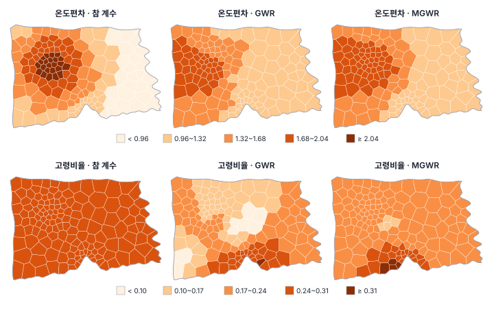

[목차](../README.md) · 이전: [29강 지리가중회귀(GWR)](29-gwr.md) · 다음: [31강 군집 분석 기초](31-clustering-basics.md)

# 30강 MGWR과 해석

> 앱 지원: ● 앱에서 따라 할 수 있음 (원래 단위 환산은 계산 필드로, 변수별 다중검정 보정과 반복 실험은 코드로 보충함) · 읽는 시간 약 45분

## 이 강에서 얻는 것

- GWR이 모든 계수에 하나의 대역폭을 쓰는 한계와, 변수마다 대역폭을 따로 정하는 다중척도 GWR(MGWR)의 원리를 앎
- 역적합(backfitting)으로 MGWR을 추정하는 과정을 손으로 따라가 봄
- MGWR 결과(대역폭, 표준화 계수, 상수, 유의성)를 바르게 읽고, 과해석을 피하는 점검 목록과 베이지안 공간 변이 계수 모형의 개요를 앎

## 들어가는 질문

29강에서 Y_변이를 GWR로 적합하자, 참값이 어디서나 0.3인 고령비율 계수가 0.014~0.311로 흔들렸고 몬테카를로 검정에서도 "변한다"(p 0.04)고 나왔음. 온도편차의 언덕을 잡으려고 고른 이웃 76개짜리 대역폭을 고령비율과 상수에도 똑같이 썼기 때문임. 도시 전체에서 같은 관계와 동네마다 다른 관계가 한 모형에 섞여 있다면, 계수마다 다른 범위를 볼 수는 없을까?

## 1. 하나의 대역폭의 한계

GWR의 대역폭은 "관계가 얼마나 넓은 범위에서 비슷한가", 곧 과정이 작동하는 **공간 척도**(spatial scale)를 뜻함. GWR은 모든 계수에 같은 대역폭을 쓰므로, 모든 과정이 같은 척도에서 작동한다고 가정하는 셈임. 현실에서는 어떤 관계는 도시 전체에서 같고(전역), 어떤 관계는 구 단위로, 어떤 관계는 동네 단위로 달라질 수 있음.

하나의 대역폭이 이 차이를 담지 못하면 두 가지가 생김.

- 전역 관계까지 좁은 대역폭으로 추정되어 거짓 변이가 생김(29강의 고령비율)
- 좁게 변하는 관계는 넓은 대역폭으로 평평하게 깎임

## 2. MGWR: 변수마다 대역폭

**다중척도 GWR**(multiscale GWR, MGWR; Fotheringham, Yang & Kang 2017)은 계수마다 대역폭 bwⱼ를 따로 둠.

$$
y_i = \sum_{j=0}^{k} \beta_{bw_j}(u_i, v_i)\, x_{ij} + \varepsilon_i
$$

대역폭이 n에 가까운 계수는 사실상 전역 계수이고, 작은 계수는 국지적으로 변함. GWR은 모든 bwⱼ가 같은 특수한 경우이고, OLS는 모든 bwⱼ가 무한대인 경우임. 그래서 MGWR은 대역폭을 "그 관계가 작동하는 척도"의 지표로 읽을 수 있다는 점이 매력임.

### 역적합

계수마다 대역폭이 다르면 한 번의 가중 최소제곱으로 풀 수 없음. MGWR은 일반화 가법 모형의 **역적합**(backfitting; Buja, Hastie & Tibshirani 1989)으로 추정함.

1. GWR로 모든 계수의 시작값을 구함
2. 변수 j마다 차례로: 다른 변수의 몫을 뺀 부분 잔차 rⱼ = y − Σ_{l≠j} β̂ₗxₗ를 만들고, rⱼ를 xⱼ 하나에 대해 GWR로 적합함. 이때 대역폭을 AICc로 새로 고르고 β̂ⱼ를 바꿈
3. 계수가 거의 바뀌지 않을 때까지 2를 되풀이함

변수들의 단위가 다르면 대역폭 탐색이 단위에 휘둘리므로, MGWR은 보통 y와 x를 모두 표준화(평균 0, 표준편차 1)해 추정함(Oshan 외 2019). 앱도 언제나 표준화해 추정함.

### 손으로 해 보기: 전역 기울기로 하는 역적합

역적합의 뼈대는 "평활" 자리에 무엇을 넣어도 같음. 가장 단순하게 평활 대신 전역 기울기(대역폭 무한대)를 넣으면 역적합은 OLS 해로 다가감. 평균이 0인 자료 x₁ = (−1.5, −0.5, 0.5, 1.5), x₂ = (−1, −1, 1, 1), y = (−3, −1, 2, 2)에서 Σx₁² = 5, Σx₂² = 4, Σx₁y = 9, Σx₂y = 8, Σx₁x₂ = 4임. 시작값을 b₂ = 0으로 두고 b₁, b₂ 순서로 고침.

- b₁ ← Σx₁(y − b₂x₂) / Σx₁² = (9 − 4b₂) / 5
- b₂ ← Σx₂(y − b₁x₁) / Σx₂² = (8 − 4b₁) / 4 = 2 − b₁

| 반복 | b₁ | b₂ | 잔차 제곱합 |
|---|---|---|---|
| 1 | 1.8000 | 0.2000 | 1.6400 |
| 2 | 1.6400 | 0.3600 | 1.4096 |
| 3 | 1.5120 | 0.4880 | 1.2621 |
| 5 | 1.3277 | 0.6723 | 1.1074 |
| 10 | 1.1074 | 0.8926 | 1.0115 |
| 20 | 1.0115 | 0.9885 | 1.0001 |
| OLS | 1 | 1 | 1 |

b₁의 OLS 해와의 차이가 반복마다 0.8배로 줄어듦. 0.8은 두 변수의 상관(0.894)의 제곱임. 설명변수끼리 상관이 클수록 역적합이 느리게 수렴함. 한빛시의 고령비율과 온도편차는 상관이 −0.750이라 MGWR의 역적합이 수십 번 반복되기도 함.

## 3. Y_변이에 적용하기

Y_변이를 앱과 같은 설정(bisquare, 적응 대역폭, AICc)으로 MGWR에 적합했음.

| | 상수 | 고령비율 | 온도편차 |
|---|---|---|---|
| GWR 대역폭 | 76 | 76 | 76 |
| MGWR 대역폭 | 103 | 83 | 68 |
| 대역폭 거리(중앙값) | 12.3 km | 10.5 km | 8.8 km |
| 계수별 유효 모수 수 ENPⱼ | 2.85 | 3.28 | 4.88 |


대역폭 거리는 동마다 그 이웃 수에 해당하는 거리(적응 대역폭이라 동마다 다름)의 중앙값임. "온도편차의 관계는 반경 9 km 안팎에서 비슷하다"처럼 읽음.

- 전체 ENP는 11.01로 GWR(13.24)보다 작고, AICc는 569.784로 GWR(571.495)보다 작음. 잔차 Moran's I는 −0.033(p 0.313)
- 온도편차 계수(원래 단위로 환산)는 1.120~1.931이고 참 계수와의 상관 0.896, 평균 제곱근 오차 0.230으로 GWR(0.781, 0.287)보다 나음
- 고령비율 계수(원래 단위)는 0.165~0.324로, GWR(0.014~0.311)보다 흔들림이 줄었지만(평균 제곱근 오차 0.127 → 0.099) 평평하지는 않음. 대역폭 83은 전역(149)과 거리가 있음
- Y_독립에서는 대역폭이 148, 134, 148로 모두 전역 근처임. AICc 529.004로 OLS(530.035)와 GWR(529.810)과 비슷함



### 상수의 대역폭은 왜 좁은가

원래 식에서 상수는 어디서나 5인데 MGWR은 상수에 대역폭 103을 주었음. 잘못 찾은 것이 아님. MGWR은 변수를 표준화(평균을 뺌)해 추정하므로, 상수는 "모든 변수가 평균일 때의 y"가 됨.

$$
\text{표준화 모형의 상수}(u, v) = \frac{5 + 0.3 \times \bar x_1 + b_2(u, v) \times \bar x_2 - \bar y}{s_y}
$$

온도편차의 평균(1.731)이 0이 아니므로 온도편차 계수의 언덕이 상수에도 옮겨 와, 표준화 모형의 참 상수는 −0.578~0.231로 변함. MGWR의 상수(−0.200~0.074)는 이 참 상수와 상관 0.747임. 계수 하나가 변하면 중심화한 모형의 상수도 따라 변함. 상수의 대역폭이 좁다고 "기저 수준이 지역마다 다르다"고 바로 읽지 않음.

## 4. 결과 읽기: 표준화 계수와 유의성

### 표준화 계수를 원래 단위로

앱의 MGWR 결과 카드와 `<접두어>_B_<변수>` 열은 **표준화한 변수 기준의 계수**임(카드의 안내 문구). "x가 1 표준편차 커지면 y가 몇 표준편차 커지는가"로 읽음. GWR이나 OLS의 계수와 비교하려면 원래 단위로 되돌림.

$$
\beta_j^{\text{원래}} = \beta_j^{\text{표준화}} \times \frac{s_y}{s_{x_j}}
$$

Y_변이에서 s_y = 2.9757, 온도편차의 s_x = 2.2296이라 배수는 1.3346임. 앱 카드의 온도편차 평균 1.137은 원래 단위로 1.517임. 표준편차를 n으로 나눠 구하든 n − 1로 나눠 구하든 두 표준편차의 비는 같음.

### 변수별 다중검정 보정

29강의 보정을 MGWR에 넓히면 계수마다 독립 검정 수가 ENPⱼ이므로 αⱼ = α / ENPⱼ로 보정함(Yu 외 2020).

| | 상수 | 고령비율 | 온도편차 |
|---|---|---|---|
| 보정 α | 0.01754 | 0.01522 | 0.01026 |
| 임계 t | 2.402 | 2.455 | 2.600 |
| 유의 비율(보정 전) | 24.0% | 100% | 100% |
| 유의 비율(보정 후) | 10.7% | 100% | 100% |

앱의 MGWR 결과는 진단 표에 **유의수준** 0.05를 보여 주고, 유의%와 `_SIG_` 열, 계수 지도의 가리기도 보정하지 않은 0.05 기준임(이 책을 쓰는 시점의 GeoStat). 보정한 판단은 코드나 `_T_` 열과 위의 임계 t로 함.

## 5. 대역폭은 얼마나 믿을 만한가

자료 하나에서 고른 대역폭은 우연에 따라 흔들림. 같은 규칙에서 오차 ε만 바꿔 Y_변이와 Y_독립 과정의 자료를 50개씩 만들어 GWR과 MGWR을 적합했음.


| 과정 | 계수 | MGWR 대역폭 중앙값 (사분위) | 전역 근처(140 이상) |
|---|---|---|---|
| Y_변이 | 상수 | 85 (68~102) | 0% |
| | 고령비율 | 148 (148~148) | 88% |
| | 온도편차 | 74 (56~89) | 4% |
| Y_독립 | 상수 | 148 (146~148) | 84% |
| | 고령비율 | 148 (144~148) | 80% |
| | 온도편차 | 148 (146~148) | 90% |

- Y_변이 과정에서 MGWR은 대체로 변하지 않는 고령비율을 전역으로(88%), 변하는 온도편차를 좁게(중앙값 74) 골랐음. 이 책의 자료(고령비율 83)는 140 아래로 나온 12%와 같은 쪽이었음
- 계수 오차(평균 제곱근 오차의 평균)를 보면 고령비율은 MGWR이 GWR의 절반(0.047 대 0.093, 50개 중 46개에서 MGWR이 나음)이지만, 온도편차는 오히려 GWR이 조금 나았음(0.314 대 0.335, MGWR이 나은 것은 18개). MGWR이 언제나 모든 계수를 더 잘 추정하는 것은 아님
- Y_독립 과정에서도 계수마다 10~20%의 자료에서 대역폭이 140 아래로 골라졌음. 변이가 없는데 "국지적 척도"를 고르는 경우가 있음

대역폭의 불확실성은 AICc 가중치로 대역폭의 신뢰구간을 구하는 방법(Li 외 2020)이나 붓스트랩으로 따로 재야 함. 대역폭 하나의 값을 "이 과정의 척도는 8.8 km다"라고 단정하지 않음.

## 6. 과해석을 피하는 점검 목록

GWR과 MGWR의 계수 지도는 보기 좋고 이야기가 쉽게 붙어, 과해석되기 쉬움.

1. **전역 모형과 비교했는가**: AICc를 OLS와 비교하고, 대역폭이 n에 가까운 계수는 전역 계수로 보고함
2. **변이를 검정했는가**: 몬테카를로 검정(29강)이나 MGWR의 대역폭과 그 불확실성으로 확인함
3. **척도를 맞게 읽었는가**: MGWR 계수는 표준화 기준임. 상수는 중심화한 값이라 다른 계수의 변이를 옮겨 받을 수 있음
4. **유의성을 보정했는가**: 계수마다 α / ENPⱼ로 보정함. 지역 t 검정은 "0인가"를 물음
5. **지역 다중공선성을 봤는가**: 두 계수 지도가 거울상이면 맞바꿈일 수 있음(29강)
6. **빠진 변수를 생각했는가**: 모형에 없는 변수가 지역마다 다르면 그것이 계수의 변이처럼 보임. 계수의 지역 차이는 "이 변수의 효과가 다르다"와 "이 지역에 빠진 무언가가 있다"를 가르지 못함
7. **공간 의존과 함께 봤는가**: 28강 4절처럼 이질성과 의존성은 같은 무늬를 만듦. 공간 회귀의 결과와 함께 보고 결론이 갈리면 그 사실을 적음
8. **인과로 읽지 않았는가**: GWR과 MGWR은 관계의 공간 변이를 탐색하는 도구임

## 7. 베이지안 공간 변이 계수 모형

GWR과 MGWR은 커널 가중으로 계수를 위치마다 추정하는 방법이라, 계수 지도의 불확실성이나 대역폭 선택의 불확실성을 한 틀에서 다루기 어려움. **베이지안 공간 변이 계수 모형**(spatially varying coefficient model, SVC; Gelfand 외 2003)은 계수 자체를 공간 확률장(20강)으로 봄.

$$
y(\mathbf s) = \sum_j \big(\beta_j + w_j(\mathbf s)\big)\, x_j(\mathbf s) + \varepsilon(\mathbf s),
\qquad w_j(\cdot) \sim \text{가우스 과정}
$$

- 계수마다 공분산 함수의 범위(21강 베리오그램의 범위)를 추정하므로, MGWR의 변수별 대역폭과 같은 역할을 자료에서 정함
- 계수 지도와 범위의 불확실성을 사후분포로 함께 얻음
- 잔차의 공간 의존을 같은 모형에 넣을 수 있음
- 계산이 무거워 관측치가 수천 개를 넘으면 근사 기법(가까운 이웃 가우스 과정, INLA 등)이 필요함. R의 spBayes(Finley, Banerjee & Gelfand 2015), INLA, mgcv의 좌표 평활 항을 쓰는 일반화 가법 모형으로 추정함. 마지막 것(Comber 외 2024)은 완전한 베이지안 추정은 아니지만, 가우스 과정 평활을 베이지안 사전분포로 해석할 수 있는 가까운 방법임

핀리(Finley 2011)는 생태 자료에서 베이지안 SVC가 GWR보다 계수와 예측을 더 잘 추정하고 불확실성도 제대로 준다고 보고했음. 다만 사전분포와 공분산 함수의 선택이 결과에 영향을 줌. 계층 모형과 베이지안 추론은 10부에서 다룸.

## 8. 한빛시 출동률

출동률(고령비율 + 온도편차)을 MGWR로 적합하면 세 계수의 대역폭이 모두 148로 전역 근처임. AICc 967.732로 OLS(966.398)보다 큼. 표준화 계수의 온도편차 평균 0.5541을 원래 단위로 바꾸면(배수 2.9130) 1.614로 OLS의 1.757과 비슷함. 28~29강의 결론(관계가 시 전체에서 같음)이 MGWR에서도 그대로임.

## 해 보기: GeoStat에서 MGWR

1. 29강처럼 `book/data/practice/hanbit_dong_sim.gpkg`를 열고 퀸 인접 가중치를 만듦
2. **공간 분석 → 회귀 분석 (OLS · 공간회귀 · GWR · MGWR)…** 메뉴에서 모형 **다중척도 GWR (MGWR)**, 종속변수 (y) `Y_변이`, 독립변수 `고령비율`과 `온도편차`, 커널 bisquare (권장), 대역폭 선택 기준 AICc (권장), 고정 대역폭 끔, 접두어 `M1`로 실행함(수십 초 걸림)
   - 확인: 요약에 R² 0.7523, AICc 569.8, 유효 모수 수 (ENP) 11.01. 안내에 "MGWR 계수는 표준화한 변수 기준임 (단위 1 표준편차당 변화)"
   - 확인: 지역 계수 표의 대역폭이 상수 103, 고령비율 83, 온도편차 68. 온도편차 평균 1.137, 최소 0.8392, 최대 1.447. 상수의 유의% 24
   - 확인: 진단 표의 유의수준 0.05, 잔차 Moran's I −0.03272(p 0.313)
3. 29강의 `G1`(GWR)이 있으면 **모형 비교** 카드에 GWR 행(571.495)과 MGWR 행(569.784)이 나오고 MGWR에 **최적** 표시가 붙음(28강의 OLS 행이 있으면 함께 나옴)
4. **공간 분석 → 계산 필드 추가…** 메뉴에서 원래 단위로 환산함
   - `M1_온도` = `` `M1_B_온도편차` * 1.3346 ``
   - `M1_고령` = `` `M1_B_고령비율` * 0.5146 ``
   - 확인: `M1_온도`는 1.120~1.931, `M1_고령`은 0.165~0.324. 두 열을 29강의 `G1_B_온도편차`, `G1_B_고령비율` 지도와 같은 계급으로 칠해 비교함(3절 그림)
5. 종속변수 `Y_독립`으로 접두어 `M2`를 실행함
   - 확인: 대역폭 148, 134, 148
6. 8강처럼 만든 출동률 자료에서 같은 MGWR을 실행함
   - 확인: 대역폭 모두 148, AICc 967.7

### 코드로: 변수별 보정과 원래 단위

```python
import contextlib
import io
import warnings

import geopandas as gpd
import numpy as np
from mgwr.gwr import MGWR
from mgwr.sel_bw import Sel_BW

warnings.filterwarnings("ignore")
sim = gpd.read_file("book/data/practice/hanbit_dong_sim.gpkg")
cent = sim.geometry.centroid
coords = np.column_stack([cent.x, cent.y])
X = sim[["고령비율", "온도편차"]].to_numpy()
y = sim[["Y_변이"]].to_numpy()

# 앱과 같이 표준화한 변수로 추정함 (대역폭을 변수끼리 비교할 수 있게)
Xs = (X - X.mean(axis=0)) / X.std(axis=0)
ys = (y - y.mean()) / y.std()
sel = Sel_BW(coords, ys, Xs, multi=True)
with contextlib.redirect_stderr(io.StringIO()):              # 진행 막대를 숨김
    sel.search(tol_multi=1e-5)                               # 역적합으로 변수별 대역폭을 찾음
    res = MGWR(coords, ys, Xs, sel).fit()

names = ["상수", "고령비율", "온도편차"]
crit = np.ravel(res.critical_tval())                         # 변수별 보정 임계 t (α / ENP_j)
for j, name in enumerate(names):
    sig = (np.abs(res.tvalues[:, j]) > crit[j]).mean()
    print(f"{name}: 대역폭 {sel.bw[0][j]:.0f}, ENP_j {res.ENP_j[j]:.2f}, 보정 α {res.adj_alpha_j[j, 1]:.4f}, 보정 후 유의 {sig:.1%}")

# 표준화 계수를 원래 단위로: β × sd(y) / sd(x)
b_orig = res.params[:, 1:] * y.std() / X.std(axis=0)
print(f"원래 단위 온도편차 계수 {b_orig[:, 1].min():.3f}~{b_orig[:, 1].max():.3f}, 고령비율 계수 {b_orig[:, 0].min():.3f}~{b_orig[:, 0].max():.3f}")
```

- 확인: 대역폭 103, 83, 68. ENPⱼ 2.85, 3.28, 4.88. 상수의 보정 후 유의 10.7%. 원래 단위 온도편차 1.120~1.931, 고령비율 0.165~0.324
- 더 해 보기: `y`를 `sim[["Y_독립"]]`로 바꿔 대역폭이 전역 근처(148, 134, 148)로 나오는지 봄. `np.random.default_rng(1)`로 ε를 새로 뽑아 Y_변이 규칙(`regkit.py` 머리말)으로 자료를 몇 개 더 만들어, 대역폭이 얼마나 흔들리는지 5절처럼 확인함

## 헷갈리는 쌍

- **GWR vs MGWR**: 모든 계수에 대역폭 하나 대 계수마다 대역폭. GWR은 MGWR에서 대역폭을 모두 같게 둔 특수한 경우임
- **대역폭(척도) vs 계수의 크기**: 대역폭은 관계가 비슷한 범위, 계수는 관계의 세기. 대역폭이 좁아도 계수의 변동 폭은 작을 수 있음
- **표준화 계수 vs 원래 단위 계수**: 앱의 MGWR 계수는 표준화 기준. 비교·보고는 원래 단위로 환산해서 함
- **원래 식의 상수 vs 표준화 모형의 상수**: x가 0일 때의 y와 x가 평균일 때의 y. 뒤의 것은 다른 계수의 변이를 옮겨 받음
- **MGWR vs 베이지안 SVC**: 커널 가중 추정과 대역폭 선택 대 계수를 확률장으로 둔 계층 모형. 뒤의 것이 불확실성을 한 틀에서 다루지만 계산과 설정이 무거움

## 흔한 실수와 심사 지적

- **MGWR의 표준화 계수를 원래 단위인 것처럼 해석함**
  - 대응: sd(y) / sd(x)를 곱해 원래 단위로 바꾸고, 어느 쪽인지 밝힘
- **대역폭 하나의 값을 과정의 척도로 단정함**
  - 지적: "그 대역폭의 불확실성은 얼마입니까?"
  - 대응: 대역폭의 신뢰구간(Li 외 2020)이나 민감도를 보고하고, 대역폭이 전역에 가까운지 아닌지 정도로 읽음
- **변수별 보정 없이 유의 지역을 표시함**
  - 대응: αⱼ = α / ENPⱼ로 보정함. 앱의 유의%는 보정 전임
- **상수의 지도로 "기저 위험의 지역 차이"를 주장함**
  - 대응: 표준화(중심화) 모형의 상수는 다른 계수의 변이를 옮겨 받는다는 점을 밝히고, 해석을 아낌
- **MGWR이 GWR보다 AICc가 작으니 모든 계수가 더 정확하다고 씀**
  - 대응: 반복 실험에서 보듯 계수마다 다를 수 있음. 결론이 모형에 따라 갈리면 함께 보고함

## 보고서에는 이렇게 씀

> 출동률과 고령비율, 지표온도의 관계가 서로 다른 공간 척도에서 작동하는지 확인하기 위해 다중척도 지리가중회귀(MGWR; Fotheringham 외 2017)를 추정하였다. 변수는 표준화하였고, 커널은 bisquare, 대역폭은 변수별 적응형으로 AICc 기준의 역적합으로 선택하였다. 세 계수의 대역폭은 모두 148개 이웃(탐색 상한 근처)으로 선택되어 전역 관계와 구별되지 않았고, MGWR의 AICc(967.73)는 전역 OLS(966.40)보다 작지 않았다. 지표온도의 표준화 계수 평균(0.554)을 원래 단위로 환산하면 1.61로 OLS 계수(1.76)와 비슷하였다. 따라서 두 변수의 효과는 시 전체에 하나의 계수로 보고하였다.

적어야 할 항목은 다음과 같음.

- 표준화 여부와 커널, 대역폭 선택 기준, 변수별 대역폭(가능하면 그 불확실성)
- 전역 모형과 GWR과의 AICc 비교
- 계수 요약과 지도(원래 단위로 환산했는지 밝힘)
- 변수별 보정 유의수준(α / ENPⱼ)
- 상수의 해석과 다중공선성, 공간 의존 점검

## 요약

- GWR은 모든 계수에 하나의 대역폭을 써 모든 과정이 같은 척도라고 가정함. MGWR은 계수마다 대역폭을 따로 정해 전역 관계와 국지 관계를 함께 담음
- MGWR은 역적합으로 추정함. 상관이 큰 변수는 수렴이 느림(손계산에서 오차가 반복마다 0.8배)
- Y_변이에서 MGWR은 온도편차에 가장 좁은 대역폭(68)을 주고 계수를 GWR보다 잘 그렸지만(상관 0.90 대 0.78), 고령비율은 전역까지 넓히지 못했음(83). 반복 실험에서는 고령비율의 88%가 전역 근처였음
- 앱의 MGWR 계수는 표준화 기준이고 상수는 중심화한 값임. 원래 단위로 환산하고, 유의성은 α / ENPⱼ로 보정함
- 베이지안 공간 변이 계수 모형은 계수를 확률장으로 두어 척도와 불확실성을 한 틀에서 추정함
- 한빛시 출동률은 MGWR에서도 모든 대역폭이 전역 근처로, 관계가 시 전체에서 같다는 결론이 유지됨

## 핵심 용어

| 한글 | 영문 | 비고 |
|---|---|---|
| 다중척도 지리가중회귀 | Multiscale GWR (MGWR) | Fotheringham 외 2017 |
| 공간 척도 | Spatial Scale | |
| 역적합 | Backfitting | Buja 외 1989 |
| 부분 잔차 | Partial Residual | |
| 계수별 유효 모수 수 | Covariate-specific ENP (ENPⱼ) | Yu 외 2020 |
| 표준화 계수 | Standardized Coefficient | |
| 대역폭 불확실성 | Bandwidth Uncertainty | Li 외 2020 |
| 공간 변이 계수 모형 | Spatially Varying Coefficient Model (SVC) | Gelfand 외 2003 |
| 가우스 과정 | Gaussian Process | |

## 원전과 더 읽을거리

**원전**

- Fotheringham, A. S., Yang, W., & Kang, W. (2017). Multiscale geographically weighted regression (MGWR). *Annals of the American Association of Geographers*, 107(6), 1247–1265.
- Buja, A., Hastie, T., & Tibshirani, R. (1989). Linear smoothers and additive models. *The Annals of Statistics*, 17(2), 453–510.
- Yu, H., Fotheringham, A. S., Li, Z., Oshan, T., Kang, W., & Wolf, L. J. (2020). Inference in multiscale geographically weighted regression. *Geographical Analysis*, 52(1), 87–106.
- Gelfand, A. E., Kim, H.-J., Sirmans, C. F., & Banerjee, S. (2003). Spatial modeling with spatially varying coefficient processes. *Journal of the American Statistical Association*, 98(462), 387–396.

**더 읽을거리**

- Li, Z., Fotheringham, A. S., Oshan, T. M., & Wolf, L. J. (2020). Measuring bandwidth uncertainty in multiscale geographically weighted regression using Akaike weights. *Annals of the American Association of Geographers*, 110(5), 1500–1520.
- Oshan, T. M., Li, Z., Kang, W., Wolf, L. J., & Fotheringham, A. S. (2019). mgwr: A Python implementation of multiscale geographically weighted regression for investigating process spatial heterogeneity and scale. *ISPRS International Journal of Geo-Information*, 8(6), 269.
- Wolf, L. J., Oshan, T. M., & Fotheringham, A. S. (2018). Single and multiscale models of process spatial heterogeneity. *Geographical Analysis*, 50(3), 223–246.
- Finley, A. O. (2011). Comparing spatially-varying coefficients models for analysis of ecological data with non-stationary and anisotropic residual dependence. *Methods in Ecology and Evolution*, 2(2), 143–154.
- Finley, A. O., Banerjee, S., & Gelfand, A. E. (2015). spBayes for large univariate and multivariate point-referenced spatio-temporal data models. *Journal of Statistical Software*, 63(13), 1–28.
- Comber, A., Harris, P., & Brunsdon, C. (2024). Multiscale spatially varying coefficient modelling using a Geographical Gaussian Process GAM. *International Journal of Geographical Information Science*, 38(1), 27–47.

## 연습

1. 손계산에서 x₂를 (−1, 1, −1, 1)로 바꾸면(x₁과의 상관 0.447) 역적합의 오차는 반복마다 몇 배로 줄어드는가? 상관이 0이면 어떻게 되는가?

2. MGWR 결과에서 어떤 변수의 대역폭이 148~149(탐색 상한 근처)로 나왔음. 이 계수를 어떻게 보고하는 것이 좋은가?

3. 앱의 MGWR 카드에서 온도편차 계수 평균이 1.137, 같은 자료의 GWR 카드에서는 1.466이었음. "MGWR에서는 온도편차의 효과가 더 작게 추정되었다"고 쓰면 무엇이 문제인가?

4. 표준화한 MGWR에서 상수의 대역폭이 좁게 나왔고, 상수 지도는 도시 서쪽 가운데가 높았음. 이것을 "서쪽 가운데는 기본 출동 수준이 높다"고 읽으면 무엇이 문제인가?

5. 5절의 반복 실험에서 Y_독립 과정(모든 계수가 같음)인데도 일부 자료에서 MGWR이 어떤 계수에 좁은 대역폭을 골랐음. 실제 연구에서 이런 위험을 줄이려면 무엇을 할 수 있는가?

<details>
<summary>해답</summary>

1. Σx₁x₂는 (−1.5)(−1) + (−0.5)(1) + (0.5)(−1) + (1.5)(1) = 2로 바뀌고 Σx₂² = 4 그대로임. b₁ ← (Σx₁y − 2b₂) / 5, b₂ ← (Σx₂y − 2b₁) / 4이므로 b₁의 오차는 반복마다 (2/5) × (2/4) = 0.2배로 줄어듦. 이는 상관의 제곱(0.447² = 0.2)과 같음. 상관이 0이면 한 번의 반복으로 OLS 해에 닿음(각 변수의 기울기가 서로 영향을 주지 않음).

2. 대역폭이 탐색 상한에 닿았다는 것은 그 관계가 사실상 전역이라는 뜻임. 지역 계수의 작은 차이를 해석하지 말고, 전역 계수 하나로 보고함(원래 단위로 환산한 평균이나, 그 변수만 전역으로 둔 모형의 계수). 이 판단이 자료 하나의 우연이 아닌지 대역폭의 불확실성도 함께 봄.

3. MGWR 카드의 계수는 표준화한 변수 기준이고 GWR 카드의 계수는 원래 단위임. 1.137에 sd(y) / sd(x) = 1.3346을 곱하면 1.517로 GWR의 평균(1.466)과 비슷함. 단위가 다른 숫자를 비교한 것이라 "더 작다"는 결론이 나오지 않음.

4. 표준화 모형의 상수는 "모든 변수가 평균일 때의 y"이고, 온도편차 계수가 지역마다 다르면 그 차이 × 온도편차의 평균만큼 상수도 변함(3절의 식). 온도편차의 평균(1.731)이 양수라 온도편차 계수가 큰 서쪽 가운데에서 표준화 상수도 커짐. 상수 지도의 높은 곳은 온도편차 계수의 언덕을 옮겨 받은 것일 수 있음. Y_변이에서는 원래 식의 상수가 어디서나 5인데도 표준화 상수가 −0.578~0.231로 변했음. 상수의 지역 차이는 다른 계수와 함께 해석함.

5. (1) 전역 모형, GWR, MGWR의 AICc를 비교하고, 좁은 대역폭이 AICc를 얼마나 개선하는지 봄. (2) 대역폭의 신뢰구간(Li 외 2020)이나 붓스트랩으로 불확실성을 확인함. (3) 몬테카를로 변이 검정(29강)으로 해당 계수의 변이를 따로 검정함. (4) 다른 시기나 다른 지역의 자료에서 같은 척도가 나오는지 확인함. (5) 변이를 설명할 이론이 있는지 따져 봄.

</details>

---

[목차](../README.md) · 이전: [29강 지리가중회귀(GWR)](29-gwr.md) · 다음: [31강 군집 분석 기초](31-clustering-basics.md)
