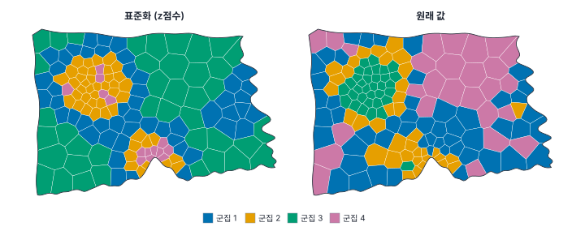
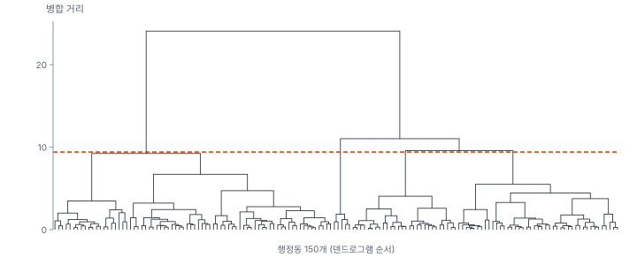
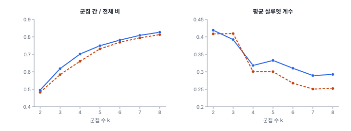
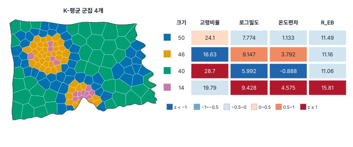

[목차](../README.md) · 이전: [30강 MGWR과 해석](30-mgwr.md) · 다음: [32강 공간 제약 군집화](32-spatially-constrained-clustering.md)

# 31강 군집 분석 기초

> 앱 지원: ● 앱에서 따라 할 수 있음 (실루엣 계수와 군집 수 비교는 코드로 보충함) · 읽는 시간 약 45분

## 이 강에서 얻는 것

- 군집 분석이 무엇을 하는지, 거리와 표준화와 변수 선택이 결과를 어떻게 좌우하는지 앎
- K-평균과 Ward 계층 군집의 원리를 손으로 계산해 앎
- 군집 수를 정하는 지표(팔꿈치, 실루엣, 덴드로그램)와 그 한계를 알고, 군집 프로필과 안정성으로 결과를 평가할 수 있음

## 들어가는 질문

한빛시가 폭염 대응 계획을 세우면서 150개 행정동을 "비슷한 동끼리" 몇 가지 유형으로 나누어 유형마다 다른 대책을 쓰려 함. 고령비율, 인구밀도, 지표온도, 출동률을 함께 보고 나누려면 어떻게 해야 하는가? 몇 개로 나누어야 하는가? 그렇게 나온 유형은 자료에 정말 있는 것인가, 방법이 만든 것인가?

8부는 관측치를 묶는 문제를 다룸. 이 강은 위치를 고려하지 않고 속성만으로 묶는 **군집 분석**의 기초를, 32강은 이웃한 동끼리만 묶는 **공간 제약 군집화**(영역화)를 봄.

## 1. 군집 분석이 하는 일

**군집 분석**(cluster analysis)은 정답 라벨 없이 관측치를 "안에서는 비슷하고 서로는 다른" 몇 개의 묶음으로 나누는 방법임. 회귀처럼 맞춰야 할 y가 없으므로 비지도 학습(unsupervised learning)이라고도 함. 공간 자료에서는 지역 유형 분류(지오데모그래픽스, geodemographics), 28강의 체제를 자료에서 찾기, 32강의 영역 나누기의 바탕이 됨.

"좋은 군집"의 기준은 자료가 정해 주지 않고 분석자가 정함. 무엇이 "비슷한가"(변수와 거리), 몇 개로 나눌 것인가(k), 어떤 방법으로 나눌 것인가가 모두 선택이고, 선택에 따라 결과가 크게 달라짐. 이 강은 그 선택들을 하나씩 봄.

15강의 **공간 군집 탐지**(핫스팟 찾기)와 이름이 비슷하지만 다른 문제임. 그쪽은 "값이 이례적으로 높은 곳이 모여 있는가"를 검정하고, 이쪽은 모든 관측치를 몇 개의 유형으로 나눔.

이 강의 변수는 다음 네 가지임.

| 변수 | 만드는 법 | 평균 | 표준편차(n으로 나눔) |
|---|---|---|---|
| 고령비율 | 고령인구 / 인구 × 100 (8강) | 22.63 | 5.78 |
| 로그밀도 | log(인구 / 면적_km2) | 7.87 | 1.39 |
| 온도편차 | 동 평균 지표온도 − 30 (8강) | 1.73 | 2.23 |
| R_EB | 출동률의 EB 평활, 1만 명당 (14강) | 11.68 | 1.96 |

## 2. 거리와 표준화

대부분의 군집 방법은 관측치 사이의 **유클리드 거리** d = √Σⱼ(xⱼ − yⱼ)²로 "비슷함"을 잼. 변수마다 단위와 흩어짐이 다르면 흩어짐이 큰 변수가 거리를 독차지함.

### 손으로 해 보기: 누가 더 가까운가

세 동의 고령비율(%)과 로그밀도가 A(20, 8.0), B(21, 6.0), C(26, 8.1)임.

- 원래 값: A–B = √(1² + 2²) = 2.236, A–C = √(6² + 0.1²) = 6.001. A는 B와 가까움
- 표준화(각 변수를 한빛시 150개 동의 표준편차 5.783과 1.389로 나눔): A–B = √((1/5.783)² + (2/1.389)²) = 1.450, A–C = √((6/5.783)² + (0.1/1.389)²) = 1.040. A는 C와 가까움

고령비율 6%p 차이는 한빛시 동 사이에서 흔한 차이(표준편차 1개쯤)지만, 로그밀도 2의 차이는 매우 큰 차이(표준편차 1.4개)임. 원래 값의 거리는 이를 거꾸로 봄.

### 한빛시 동에서

네 변수를 원래 값 그대로 쓰면 분산이 고령비율 33.44, 로그밀도 1.93, 온도편차 4.97, R_EB 3.82라, 전체 제곱합의 75.7%를 고령비율이 차지함. K-평균(군집 4개)의 결과가 고령비율의 높낮이 띠로만 나뉨.



두 결과가 얼마나 같은지는 **수정 랜드 지수**(adjusted Rand index, ARI; Hubert & Arabie 1985)로 잼. 두 분류가 같으면 1, 우연히 맞는 정도면 0 근처임. 표준화한 결과와 원래 값의 결과는 ARI 0.292로 거의 다른 분류임.

표준화(z = (x − 평균) / 표준편차)는 "모든 변수에 같은 무게를 준다"는 결정임. 앱은 기본으로 표준화함(**변수 표준화 (z점수)** 확인란). 변수마다 다른 무게를 주고 싶다면 표준화한 뒤 가중치를 곱함.

### 변수 고르기

- **상관이 큰 변수**: 로그밀도와 온도편차의 상관은 0.914임. 둘을 함께 넣으면 "도심 대 외곽"이라는 같은 정보가 거리에 두 번 들어가 그 축에 두 배의 무게를 주는 셈임. 로그밀도를 빼고 세 변수로 군집하면 결과가 꽤 달라짐(ARI 0.613). 두 변수를 함께 넣을지는 그 무게를 원하는지로 정함
- **잡음이 큰 변수**: 원비율 출동률(0~49.36)로 군집하면 군집 4개 가운데 하나가 다솜1동과 다솜23동 단 2개로 이루어짐. 둘은 인구 1,063명과 1,013명에 출동 4건과 5건이라 원비율이 37.63, 49.36으로 튄 동임(14강). EB 평활 R_EB(13.94, 14.80)로 바꾸면 이 두 동은 다른 군집에 섞임. K-평균은 제곱 거리를 쓰므로 이상값 몇 개가 군집 하나를 차지하기 쉬움
- **관련 없는 변수**: 구분하려는 목적과 관계없는 변수를 넣으면 그 변수의 우연한 차이가 군집을 흔듦. 변수는 "어떤 유형을 구분하고 싶은가"에서 출발해 고름

## 3. K-평균

**K-평균**(k-means; MacQueen 1967, Lloyd 1982)은 군집 수 k를 정하고, 각 관측치와 그 군집 중심 사이의 제곱 거리 합(**군집 내 제곱합**, within-cluster sum of squares)이 가장 작게 나눔.

$$
\text{WSS} = \sum_{c=1}^{k} \sum_{i \in c} \lVert \mathbf x_i - \mathbf m_c \rVert^2
$$

모든 나누기를 다 해 보는 것은 불가능하므로 다음을 되풀이함.

1. 중심 k개를 정함(처음에는 무작위)
2. 각 관측치를 가장 가까운 중심의 군집에 배정함
3. 군집마다 평균을 새 중심으로 함
4. 배정이 바뀌지 않을 때까지 2~3을 되풀이함

### 손으로 해 보기: 점 여섯 개

1차원 점 1, 2, 4, 7, 9, 10을 군집 2개로 나눔. 시작 중심은 1과 4임.

| 반복 | 배정 | 새 중심 | WSS |
|---|---|---|---|
| 1 | {1, 2}, {4, 7, 9, 10} | 1.5, 7.5 | 21.5 |
| 2 | {1, 2, 4}, {7, 9, 10} | 2.333, 8.667 | 9.333 |
| 3 | 바뀌지 않음 | | 9.333 |

반복 2에서 점 4는 새 중심 1.5까지 2.5, 7.5까지 3.5라 첫 군집으로 옮겨 감. 전체 제곱합(평균 5.5에서의 제곱합)은 69.5이므로 **군집 간 / 전체 비**는 1 − 9.333 / 69.5 = 0.8657임. 군집이 전체 차이의 87%를 설명한다는 뜻으로, 회귀의 R²와 같은 생각임. 앱의 결과 카드가 이 비를 보여 줌.

### 시작점에 따라 답이 다름

K-평균은 시작 중심에서 가까운 **국소 최적**(local optimum)에 멈춤. 한빛시 네 변수(표준화)로 군집 4개를 시작점 200개에서 한 번씩 돌리면 서로 다른 해가 50개 나오고, 가장 작은 WSS(178.945)에 닿은 것은 17번뿐이며 가장 나쁜 해는 220.458임. 그래서 시작점을 여러 번 바꿔 돌리고 WSS가 가장 작은 해를 씀. 앱은 시작점 50개(시드 123456789 고정)를 써서 178.9에 닿음.

K-평균은 군집이 중심 둘레에 둥글게 모여 있고 크기가 비슷하다고 가정하는 것과 같음. 길쭉하거나 크기가 아주 다른 군집, 이상값에는 약함.

## 4. Ward 계층 군집

**계층 군집**(hierarchical clustering)은 관측치 하나하나를 군집으로 시작해 가장 가까운 두 군집을 하나씩 합쳐 감. 합칠 군집을 고르는 기준(연결법)이 여러 가지인데, **Ward 방법**(Ward 1963)은 합쳤을 때 WSS가 가장 적게 늘어나는 두 군집을 합침. 군집 A와 B를 합칠 때 늘어나는 WSS는 다음과 같음.

$$
\Delta = \frac{n_A n_B}{n_A + n_B} \lVert \mathbf m_A - \mathbf m_B \rVert^2
$$

합친 순서를 나무 모양으로 그린 것이 **덴드로그램**(dendrogram)임. 세로 높이(병합 거리)는 SciPy 등의 관행대로 √(2Δ)로 그림. 원하는 높이에서 가로로 자르면 그 아래의 가지 수만큼 군집이 나옴.



계층 군집은 한 번 합친 것을 되돌리지 않으므로, 같은 k에서 WSS가 K-평균보다 크게 나오는 것이 보통임. 군집 4개에서 Ward의 군집 간 / 전체 비는 0.6604로 K-평균(0.7018)보다 작음. 대신 시작점에 따라 답이 바뀌지 않고, k를 바꿔 가며 다시 계산하지 않아도 덴드로그램 하나로 여러 k의 결과를 봄.

두 방법의 군집 4개는 꽤 다름(ARI 0.416). Ward는 K-평균의 중간형 50개 가운데 34개와 외곽형 40개 전부를 하나의 큰 군집(74개)으로 묶고, 대신 K-평균의 "도심 고출동형" 14개 동을 9개와 5개로 나눔.

## 5. 군집 수 정하기

군집 수 k는 분석자가 정해야 함. 흔히 쓰는 지표는 다음과 같음.

- **팔꿈치 방법**(elbow): k에 따른 군집 간 / 전체 비(또는 WSS)를 그려 증가가 갑자기 완만해지는 곳을 찾음. 이 비는 k가 커질수록 언제나 커지므로(k = n이면 1) 최댓값을 고를 수 없음
- **실루엣 계수**(silhouette; Rousseeuw 1987): 관측치 i마다 같은 군집의 다른 관측치까지 평균 거리 a와, 가장 가까운 다른 군집의 관측치까지 평균 거리 b로 s = (b − a) / max(a, b)를 구함. 1에 가까우면 제 군집에 잘 들어맞고, 0 근처면 경계에 있고, 음수면 다른 군집이 더 가까움. 평균 실루엣이 큰 k를 고름

손계산의 점 4는 같은 군집의 1, 2까지 평균 거리 a = (3 + 2) / 2 = 2.5, 다른 군집의 7, 9, 10까지 평균 거리 b = (3 + 5 + 6) / 3 = 4.667이라 s = (4.667 − 2.5) / 4.667 = 0.464임. 여섯 점의 평균 실루엣은 0.659임.



| k | 2 | 3 | 4 | 5 | 6 | 7 | 8 |
|---|---|---|---|---|---|---|---|
| K-평균 군집 간 / 전체 | 0.495 | 0.618 | 0.702 | 0.749 | 0.782 | 0.809 | 0.827 |
| K-평균 실루엣 | 0.419 | 0.392 | 0.318 | 0.333 | 0.310 | 0.289 | 0.292 |
| Ward 실루엣 | 0.409 | 0.409 | 0.301 | 0.300 | 0.267 | 0.251 | 0.252 |

K-평균의 실루엣과 덴드로그램은 k = 2를 가리킴(K-평균 실루엣이 가장 크고, 덴드로그램의 마지막 병합이 가장 김). Ward의 실루엣은 k = 2(0.4087)와 3(0.4095)이 거의 같음. 그런데 군집 2개는 "도심 대 외곽"이라는, 지도만 봐도 아는 구분임. 또 실루엣이 모든 k에서 0.25~0.42에 머묾. 카우프만과 루소(Kaufman & Rousseeuw 1990)의 경험 기준은 0.71~1이면 강한 구조, 0.51~0.70이면 쓸 만한 구조, 0.26~0.50이면 약한 구조(인위적일 수 있음), 0.25 이하면 뚜렷한 구조가 없음임. 한빛시 동들은 뚜렷이 갈린 덩어리가 아니라 도심에서 외곽으로 이어지는 연속적인 변화에 가까움.

군집 분석은 자료에 덩어리가 없어도 언제나 k개의 군집을 만들어 냄. 지표는 "자료가 몇 개로 나뉘어 있는가"의 답이 아니라 판단을 돕는 참고임. k는 목적(유형마다 다른 대책을 쓸 수 있는가, 유형이 해석되는가)과 지표를 함께 보고 정하고, 지표가 약하다는 사실도 보고함. 이 강은 출동률이 특히 높은 도심 동을 따로 볼 수 있는 k = 4를 씀.

## 6. 결과 평가와 해석

### 군집 프로필

군집의 뜻은 군집마다 변수 평균을 나란히 놓은 **프로필**로 읽음. 표준화 평균(z)을 색으로 칠하면 어느 변수가 그 군집을 특징짓는지 한눈에 보임. 앱의 결과 카드도 같은 방식으로 칠함.



| 군집 | 동 수 | 고령비율 | 로그밀도 | 온도편차 | R_EB | 읽기 |
|---|---|---|---|---|---|---|
| 1 | 50 | 24.1 | 7.774 | 1.133 | 11.49 | 중간형 |
| 2 | 46 | 16.63 | 9.147 | 3.792 | 11.16 | 도심형 |
| 3 | 40 | 28.7 | 5.992 | −0.888 | 11.06 | 외곽형 |
| 4 | 14 | 19.79 | 9.428 | 4.575 | 15.81 | 도심 고출동형 |

군집 4의 14개 동은 마루구 9개, 가람구 3개, 누리구 2개임. 군집의 이름은 프로필을 요약한 꼬리표일 뿐이고, 같은 군집 안에서도 동마다 차이가 큼(군집 4의 군집 내 제곱합 26). 이름이 낙인이 되지 않도록 설명적으로 붙임.

### 안정성

같은 자료에서 방법이나 변수, 시작점을 조금 바꿨을 때 군집이 크게 바뀌면 그 군집을 믿기 어려움. 이 자료에서는 다음과 같았음.

- k = 2는 K-평균과 Ward가 거의 같음(ARI 0.845). k = 4는 많이 다름(0.416)
- 다만 Ward가 따로 떼어 낸 출동률 최상위 5개 동(R_EB 평균 18.18)은 모두 K-평균의 군집 4 안에 있음. "도심이면서 출동률이 높은 동이 따로 있다"는 결론은 두 방법에서 함께 나옴
- 로그밀도를 빼면 ARI 0.613, 원비율 출동률을 쓰면 0.728로 변수 선택에도 꽤 민감함

안정성을 더 체계적으로 보려면 관측치를 붓스트랩으로 다시 뽑아 군집을 반복하고 군집마다 얼마나 자주 다시 나오는지를 보는 방법(Hennig 2007)이 있음.

### 지도에 놓으면

비공간 군집은 위치를 쓰지 않았는데도 지도에서 꽤 덩어리져 보임. 변수 자체가 공간적으로 닮았기 때문임(퀸 가중치의 Moran's I가 고령비율 0.812, 로그밀도 0.836, 온도편차 0.802, R_EB 0.197). 그래도 같은 군집이 2~4개 조각으로 흩어짐(앱 카드의 **조각** 열). "유형"을 찾는 목적이면 흩어져도 괜찮지만, 관리 구역처럼 "이어진 영역"이 필요하면 32강의 공간 제약 군집화를 씀.

## 해 보기: GeoStat에서 K-평균과 Ward

1. 8강처럼 `hanbit_dong.gpkg`, `hanbit_events.gpkg`, `hanbit_lst.tif`를 열고 `PT_CNT`, `ZS_MEAN`, `고령비율`, `온도편차`, `출동률`을 만듦. 14강처럼 **공간 분석 → 비율 지도 · EB 보정…** 메뉴에서 방법 **경험적 베이즈(EB) 평활**, 분자 `PT_CNT`, 분모 `인구`, 단위 **10,000당**으로 `R_EB`를 만듦. **공간 분석 → 공간가중치 만들기…** 메뉴로 **퀸 인접 (Queen)** 가중치도 만듦(조각 수 계산용)
2. **공간 분석 → 계산 필드 추가…** 메뉴에서 `로그밀도` = `` log(`인구` / `면적_km2`) ``를 만듦
   - 확인: 가람1동 6.001
3. **공간 분석 → 군집 분석 (SKATER · Max-p · AZP · K-평균)…** 메뉴를 엶. 방법 **K-평균 (비공간)**, 변수 `고령비율`, `로그밀도`, `온도편차`, `R_EB`를 고름(변수 — 4개 선택). **변수 표준화 (z점수)** 확인란은 켠 채로, 군집 수 4, **공간 조각 수 계산 (군집이 몇 덩어리로 흩어졌는지)**을 켜고 퀸 가중치를 고른 뒤, 결과 열 접두어 `KM4`로 실행함
   - 확인: 요약에 전체 제곱합 600, 군집 내 제곱합 178.9, 군집 간 제곱합 421.1, 군집 간 / 전체 비 0.7018
   - 확인: 군집별 요약 표의 크기 50, 46, 40, 14와 조각 2, 3, 3, 4. 군집 4의 R_EB 15.81(빨강 칸)
4. **군집 지도** 단추를 눌러 `KM4_GRP`를 고유값 지도로 보고, 표의 군집 4 행을 눌러 지도에서 14개 동을 선택함
5. 같은 설정에서 **변수 표준화** 확인란만 끄고 접두어 `KM4R`로 실행함
   - 확인: 변수 척도 "원래 값", 전체 제곱합 6,625, 군집 간 / 전체 비 0.7895. 군집 평균의 고령비율이 14.73, 19.99, 25.39, 30.89로 띠처럼 갈림. 이 비는 척도가 다른 결과끼리 비교할 수 없음(연습 4)
6. 방법 **계층적 군집 Ward (비공간)**, 변수 표준화 켬, 군집 수 4, 접두어 `HC4`로 실행함
   - 확인: 크기 74, 43, 28, 5, 군집 간 / 전체 비 0.6604, 조각 1, 4, 8, 1. 5개 동 군집의 R_EB 18.18
7. 변수에서 `R_EB` 대신 `출동률`을 골라 K-평균(표준화, 군집 4개)을 접두어 `KM4O`로 실행함
   - 확인: 군집 4의 크기가 2이고 출동률 평균 43.49임. 표에서 그 행을 눌러 다솜1동과 다솜23동이 선택되는 것을 봄

### 코드로: 실루엣과 군집 수

```python
import geopandas as gpd
import numpy as np
from esda.smoothing import Empirical_Bayes
from exactextract import exact_extract   # pip install exactextract (앱의 존 통계와 같은 계산)
from sklearn.cluster import AgglomerativeClustering, KMeans
from sklearn.metrics import adjusted_rand_score, silhouette_score

dong = gpd.read_file("book/data/hanbit_dong.gpkg")
ev = gpd.read_file("book/data/hanbit_events.gpkg")
cnt = gpd.sjoin(ev, dong, predicate="within").groupby("index_right").size().reindex(dong.index, fill_value=0)
dong["고령비율"] = dong["고령인구"] / dong["인구"] * 100
dong["로그밀도"] = np.log(dong["인구"] / dong["면적_km2"])
dong["온도편차"] = exact_extract("book/data/hanbit_lst.tif", dong, "mean", output="pandas")["mean"].to_numpy() - 30
dong["R_EB"] = Empirical_Bayes(cnt.to_numpy(), dong["인구"].to_numpy()).r.ravel() * 10000   # 14강의 EB 평활

V = ["고령비율", "로그밀도", "온도편차", "R_EB"]
X = dong[V].to_numpy()
Z = (X - X.mean(axis=0)) / X.std(axis=0)                     # 표준화 (앱과 같이 n으로 나눈 표준편차)
tss = (Z ** 2).sum()
for k in range(2, 9):
    km = KMeans(n_clusters=k, n_init=50, random_state=123456789).fit(Z)
    hc = AgglomerativeClustering(n_clusters=k, linkage="ward").fit_predict(Z)
    print(f"k {k}: K-평균 군집 간/전체 {1 - km.inertia_ / tss:.4f}, 실루엣 {silhouette_score(Z, km.labels_):.3f} | "
          f"Ward 실루엣 {silhouette_score(Z, hc):.3f} | 두 결과의 ARI {adjusted_rand_score(km.labels_, hc):.3f}")
```

- 확인: k 4에서 K-평균 군집 간/전체 0.7018(앱과 같음), 실루엣 0.318, Ward 실루엣 0.301, ARI 0.416. 5절의 표와 같음
- 더 해 보기: `from sklearn.metrics import silhouette_samples`로 동마다 실루엣을 구해 지도로 그리면, 군집 경계에 있어 어느 쪽에 넣어도 비슷한 동(실루엣 0 근처)이 어디인지 보임

## 헷갈리는 쌍

- **군집 분석 vs 공간 군집 탐지(15강)**: 모든 관측치를 유형으로 나누는 것과, 값이 이례적으로 높은 곳이 모였는지 검정하는 것
- **K-평균 vs Ward 계층 군집**: k를 정하고 중심을 옮겨 가며 WSS를 줄이는 것과, 하나씩 합쳐 가며 WSS가 가장 적게 늘어나는 쪽을 고르는 것. 앞의 것은 시작점에 따라, 뒤의 것은 앞선 병합에 따라 결과가 정해짐
- **군집 간 / 전체 비 vs 실루엣**: 앞의 것은 k가 커질수록 언제나 커지고, 뒤의 것은 군집이 잘 갈렸는지를 봄. 앞의 것으로 k를 고를 수는 없음
- **표준화 vs 가중**: 표준화는 모든 변수에 같은 무게를 주는 것, 가중은 의도적으로 무게를 다르게 주는 것. 상관이 큰 변수를 함께 넣는 것은 의도하지 않은 가중임
- **유형(군집) vs 영역(지역)**: 떨어져 있어도 같은 유형일 수 있는 것과, 이어진 땅이어야 하는 것(32강)

## 흔한 실수와 심사 지적

- **단위가 다른 변수를 표준화 없이 군집함**
  - 지적: "군집이 사실상 한 변수로만 나뉜 것 아닙니까?"
  - 대응: 표준화하고, 표준화하지 않았다면 그 이유와 변수별 분산을 보고함
- **군집 수를 근거 없이 정함**
  - 대응: 여러 k의 실루엣, 군집 간 / 전체 비, 덴드로그램을 보고하고 목적과 함께 선택 이유를 적음
- **군집이 있다는 것 자체를 발견으로 씀**
  - 지적: "군집 분석은 덩어리가 없어도 군집을 만듭니다. 구조가 얼마나 뚜렷합니까?"
  - 대응: 평균 실루엣과 그 해석 기준을 적고, 방법·변수를 바꾼 안정성을 보고함
- **작은 수로 계산한 비율을 그대로 넣음**
  - 대응: 원비율의 이상값이 군집 하나를 차지하지 않는지 보고, EB 평활(14강)이나 변환을 씀
- **군집 이름을 낙인처럼 씀**
  - 대응: 프로필을 함께 보여 주고, 군집 안의 차이도 보고함

## 보고서에는 이렇게 씀

> 한빛시 150개 행정동을 고령비율, 인구밀도(로그), 동 평균 지표온도, 출동률(경험적 베이즈 평활, 1만 명당)의 네 변수로 유형화하였다. 변수는 z점수로 표준화하였고, K-평균(시작점 50개)과 Ward 계층 군집을 k = 2~8에서 비교하였다. 평균 실루엣 계수는 k = 2에서 가장 컸으나(K-평균 0.419) 모든 k에서 0.25~0.42로 군집 구조가 약하였다. 폭염 대응의 대상 구분이라는 목적에 따라 k = 4를 선택하였으며(군집 간 / 전체 제곱합 비 0.702, 실루엣 0.318), 도심형(46개 동), 중간형(50개), 외곽형(40개)과, 도심형 가운데 출동률이 특히 높은 14개 동(1만 명당 평균 15.81건)이 구분되었다. 두 방법의 k = 4 분류는 일치도가 낮았으나(수정 랜드 지수 0.416), Ward 방법이 분리한 출동률 최상위 5개 동은 모두 K-평균의 고출동 군집에 포함되었다.

적어야 할 항목은 다음과 같음.

- 변수와 그 선택 이유, 변환(로그, EB 평활)과 표준화 여부
- 방법과 설정(K-평균의 시작점 수와 시드, 계층 군집의 연결법)
- k를 고른 근거(지표와 목적)와 지표의 값
- 군집 프로필(군집별 크기와 변수 평균)과 지도
- 안정성 점검(다른 방법·변수와의 일치도)

## 요약

- 군집 분석은 정답 없이 관측치를 비슷한 것끼리 묶음. 변수, 거리, 표준화, k, 방법이 모두 분석자의 선택임
- 표준화하지 않으면 분산이 큰 변수가 거리를 독차지함(고령비율 75.7%). 상관이 큰 변수는 같은 정보에 두 배의 무게를 주고, 작은 수의 비율은 이상값 군집을 만듦
- K-평균은 WSS를 줄이는 반복 알고리즘이라 국소 최적에 빠짐(시작점 200개 중 17번만 최적). Ward는 WSS가 가장 적게 늘어나는 쪽으로 하나씩 합침
- 군집 수 지표(팔꿈치, 실루엣, 덴드로그램)는 참고일 뿐임. 한빛시 동은 실루엣 0.25~0.42로 구조가 약하고, k는 목적과 함께 정함
- 결과는 프로필로 해석하고 방법·변수를 바꾼 안정성으로 점검함. 비공간 군집은 지도에서 여러 조각으로 흩어짐(32강으로)

## 핵심 용어

| 한글 | 영문 | 비고 |
|---|---|---|
| 군집 분석 | Cluster Analysis | 비지도 학습 |
| 지오데모그래픽스 | Geodemographics | 지역 유형 분류 |
| 유클리드 거리 | Euclidean Distance | |
| 표준화 | Standardization | z점수 |
| K-평균 | K-means | MacQueen 1967, Lloyd 1982 |
| 군집 내 제곱합 | Within-cluster Sum of Squares (WSS) | |
| 국소 최적 | Local Optimum | |
| 계층 군집 | Hierarchical Clustering | |
| Ward 방법 | Ward's Method | Ward 1963 |
| 덴드로그램 | Dendrogram | |
| 팔꿈치 방법 | Elbow Method | |
| 실루엣 계수 | Silhouette Coefficient | Rousseeuw 1987 |
| 수정 랜드 지수 | Adjusted Rand Index (ARI) | Hubert & Arabie 1985 |
| 군집 프로필 | Cluster Profile | |

## 원전과 더 읽을거리

**원전**

- MacQueen, J. (1967). Some methods for classification and analysis of multivariate observations. In *Proceedings of the Fifth Berkeley Symposium on Mathematical Statistics and Probability* (Vol. 1, pp. 281–297). University of California Press.
- Lloyd, S. P. (1982). Least squares quantization in PCM. *IEEE Transactions on Information Theory*, 28(2), 129–137.
- Ward, J. H. (1963). Hierarchical grouping to optimize an objective function. *Journal of the American Statistical Association*, 58(301), 236–244.
- Rousseeuw, P. J. (1987). Silhouettes: A graphical aid to the interpretation and validation of cluster analysis. *Journal of Computational and Applied Mathematics*, 20, 53–65.
- Hubert, L., & Arabie, P. (1985). Comparing partitions. *Journal of Classification*, 2(1), 193–218.

**더 읽을거리**

- Kaufman, L., & Rousseeuw, P. J. (1990). *Finding Groups in Data: An Introduction to Cluster Analysis*. Wiley.
- Everitt, B. S., Landau, S., Leese, M., & Stahl, D. (2011). *Cluster Analysis* (5th ed.). Wiley.
- Hennig, C. (2007). Cluster-wise assessment of cluster stability. *Computational Statistics & Data Analysis*, 52(1), 258–271.
- Singleton, A. D., & Spielman, S. E. (2014). The past, present, and future of geodemographic research in the United States and United Kingdom. *The Professional Geographer*, 66(4), 558–567.

## 연습

1. 손계산 1의 세 동에 R_EB를 A 11, B 15, C 11.5로 더해 세 변수를 표준화(나누는 값 5.783, 1.389, 1.955)하면 A는 B와 C 가운데 누구와 가까운가?

2. 손계산 2에서 시작 중심을 9와 10으로 바꾸면 반복이 어떻게 진행되고 어디서 멈추는가?

3. 실루엣 계수가 모든 k에서 0.25~0.42였음. 이 결과를 "한빛시 동은 4개 유형으로 뚜렷이 나뉜다"고 쓰면 무엇이 문제인가?

4. 해 보기 5번(표준화하지 않음)의 군집 간 / 전체 비는 0.7895로, 표준화한 결과(0.7018)보다 큼. "표준화하지 않은 쪽이 더 잘 나뉜 군집"이라고 할 수 있는가?

5. 원비율 출동률로 군집하자 다솜1동과 다솜23동 2개만으로 된 군집이 생겼음. 이 군집을 "출동 위험이 가장 높은 유형"이라고 보고하면 무엇이 문제인가?

<details>
<summary>해답</summary>

1. A–B = √((1/5.783)² + (2/1.389)² + (4/1.955)²) = 2.507, A–C = √((6/5.783)² + (0.1/1.389)² + (0.5/1.955)²) = 1.071. 여전히 C와 가까움. R_EB의 4 차이는 표준편차 2개에 해당하는 큰 차이라 B를 더 멀게 만듦.

2. 반복 1: 1, 2, 4, 7은 9에, 9는 9에, 10은 10에 가까움. 중심은 (1 + 2 + 4 + 7 + 9) / 5 = 4.6과 10. 반복 2: 9는 4.6까지 4.4, 10까지 1이라 두 번째 군집으로 옮기고 7은 4.6까지 2.4, 10까지 3이라 첫 군집에 남음. 중심 3.5와 9.5. 반복 3: 7은 3.5까지 3.5, 9.5까지 2.5라 옮김. 중심 2.333과 8.667. 반복 4: 바뀌지 않음. 본문과 같은 해({1, 2, 4}, {7, 9, 10})에서 멈춤. 1차원의 단순한 자료라 시작점이 달라도 같은 해에 닿았지만, 변수와 군집이 많으면 3절처럼 서로 다른 해에 멈추는 일이 흔함.

3. 실루엣 0.26~0.50은 약한 구조(인위적일 수 있음)로 봄(Kaufman & Rousseeuw 1990). 동들이 뚜렷한 덩어리로 갈려 있지 않고 연속적으로 이어져 있어, 경계 근처의 동은 어느 군집에 넣어도 비슷함. 또 K-평균의 실루엣이 가장 큰 k는 2였음. "4개 유형으로 나누었다(목적에 따라 선택, 구조는 약함)"고 써야 함.

4. 아님. 군집 간 / 전체 비는 군집에 쓴 값의 척도에서 계산함. 표준화하지 않으면 전체 제곱합의 75.7%가 고령비율이고, 고령비율 한 변수를 띠로 자르는 것만으로 비가 쉽게 커짐. 척도(무게)가 다른 결과끼리는 이 비를 비교할 수 없음. 같은 척도 안에서 k나 방법을 비교할 때만 씀.

5. 두 동은 인구가 1천 명 남짓이고 출동이 4건, 5건뿐이라 원비율이 우연만으로도 크게 튈 수 있음(14강). EB 평활로는 13.94, 14.80으로 시 평균보다 조금 높은 정도임. 군집은 이 우연한 이상값 때문에 생긴 것이라 "유형"이라 부르기 어려움. EB 평활이나 다른 변환을 쓰고, 군집 크기가 아주 작으면 그 구성과 원인을 따로 점검함.

</details>

---

[목차](../README.md) · 이전: [30강 MGWR과 해석](30-mgwr.md) · 다음: [32강 공간 제약 군집화](32-spatially-constrained-clustering.md)
