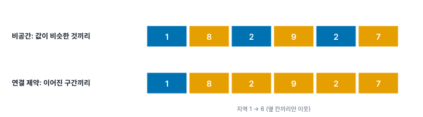
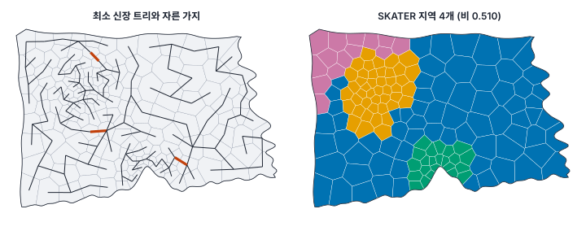
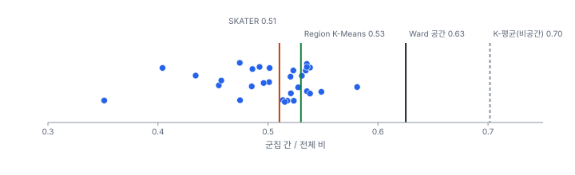

[목차](../README.md) · 이전: [31강 군집 분석 기초](31-clustering-basics.md) · 다음: [33강 시공간 자료의 구조](33-spatiotemporal-data.md)

# 32강 공간 제약 군집화

> 앱 지원: ◐ SKATER, Ward(공간 제약), AZP, Region K-Means, Max-p는 앱에서, 시작점 비교와 지역 모양 평가는 코드로, REDCAP은 개념으로 다룸 · 읽는 시간 약 45분

## 이 강에서 얻는 것

- 영역화(공간 제약 군집화)가 비공간 군집과 무엇이 다르고, 연결 제약이 동질성을 얼마나 깎는지 앎
- SKATER, Ward(공간 제약), AZP, Region K-Means, Max-p의 원리와 성격 차이를 앎
- 동질성, 모양, 크기 조건을 함께 보고 실무 구역을 설계하고 보고할 수 있음

## 들어가는 질문

31강에서 찾은 "도심 고출동형" 14개 동은 마루구, 가람구, 누리구에 4개 조각으로 흩어져 있었음. 한빛시가 폭염 대응 현장 지원팀을 **이어진 구역** 단위로 배치하려 함. 구역 안의 동은 서로 비슷해야 하고, 구역마다 인구가 너무 적지 않아야 함. 이런 구역은 어떻게 만드는가? 이어진 땅이라는 조건은 얼마의 대가를 치르게 하는가?

## 1. 영역화: 이어진 군집

**영역화**(regionalization)는 각 군집이 공간적으로 이어진 한 덩어리(공간가중치 그래프에서 연결된 부분)가 되도록 관측치를 나누는 군집화임. **공간 제약 군집화**(spatially constrained clustering)라고도 함. 선거구 획정, 상권·생활권 설정, 관리 구역 설계, 분석 단위 만들기(작은 동을 묶어 안정된 비율 얻기)에 쓰임.

### 손으로 해 보기: 한 줄로 이어진 지역

한 줄로 이어진 지역 여섯 개(옆 칸끼리만 이웃)의 값이 1, 8, 2, 9, 2, 7임. 두 묶음으로 나눔. 전체 제곱합(평균 4.833에서의 제곱합)은 62.833임.

- **비공간**: 값만 보면 {1, 2, 2}와 {8, 9, 7}로 나누는 것이 가장 좋음. 군집 내 제곱합 0.667 + 2 = 2.667, 군집 간 / 전체 비 0.958. 그러나 두 묶음이 서로 엇갈려 흩어짐
- **연결 제약**: 이어진 구간으로만 나눌 수 있어 자르는 자리 다섯 곳 가운데 하나를 고름. 지역 1 | 2~6이 가장 좋고 군집 내 제곱합 45.2, 비 0.281임. 나머지 자리는 54.7(1~3 | 4~6), 57.2, 62.5, 62.5



값이 1, 2, 2, 8, 9, 7처럼 이웃끼리 닮았다면 연결 제약에서도 1~3 | 4~6으로 잘라 비공간과 같은 2.667을 얻음. **연결 제약의 대가는 변수의 공간 자기상관에 달려 있음.** 값이 공간적으로 닮을수록 이어진 지역이 곧 비슷한 지역이라 대가가 작음.

한빛시의 네 변수(31강)는 고령비율, 로그밀도, 온도편차의 Moran's I가 0.80~0.84로 높고 R_EB만 0.197임. 군집 4개의 군집 간 / 전체 비는 비공간 K-평균 0.702에서 공간 제약 방법으로 0.40~0.63으로 줄어듦(3절).

### 왜 근사해법을 쓰는가

이어진 지역으로 나누는 모든 경우를 다 따져 가장 좋은 것을 고르는 문제는 관측치가 조금만 많아도 풀 수 없을 만큼 커짐(NP-난해; Duque, Ramos & Suriñach 2007). 그래서 아래 방법들은 모두 "좋은 해"를 빠르게 찾는 근사해법(휴리스틱)이고, 방법마다 다른 답을 줌.

## 2. 방법들

### SKATER: 나무를 잘라 나눔

**SKATER**(Spatial 'K'luster Analysis by Tree Edge Removal; Assunção 외 2006)는 두 단계로 나눔.

1. 이웃한 동끼리만 선을 긋고, 선의 길이를 두 동의 변수 차이로 둠. 이 그래프에서 모든 동을 가장 짧은 선들로 한 번씩만 잇는 **최소 신장 트리**(minimum spanning tree)를 만듦. 비슷한 이웃끼리 이어진 나무임
2. 나무의 가지를 하나 자르면 두 덩어리가 됨. 자른 뒤의 군집 내 제곱합이 가장 많이 줄어드는 가지를 골라 자르고, 군집이 k개가 될 때까지 되풀이함



나무는 동 150개를 149개의 가지로 잇고, 가지 3개를 자르면 지역 4개가 됨. 빠르고 결과가 안정적이지만, 한 번 만든 나무 위에서만 자르므로 나무에 없는 경계는 만들지 못함. 지역 크기가 69, 44, 23, 14로 고르지 않음. 앱의 **군집별 최소 피처 수**를 20으로 두면 69, 37, 23, 21로 바뀌고 군집 간 / 전체 비는 0.510에서 0.482로 조금 줄어듦.

### Ward(공간 제약)와 REDCAP

31강의 Ward 계층 군집에서 **이웃한 군집끼리만** 합치도록 제한한 것임(Murtagh 1985). 합칠 수 있는 쌍이 이웃으로 제한될 뿐, WSS가 가장 적게 늘어나는 쌍을 고르는 원리는 같음.

**REDCAP**(Regionalization with Dynamically Constrained Agglomerative Clustering and Partitioning; Guo 2008)은 이 생각을 넓힌 방법 묶음임. 연결법(단일, 평균, 완전)과, 두 군집의 거리를 맞닿은 동 쌍만으로 잴지(1차) 두 군집의 모든 동 쌍으로 잴지(전체 차수)를 조합한 여섯 가지로 나무를 만들고, SKATER처럼 그 나무를 잘라 지역을 만듦. 1차 단일 연결은 SKATER와 같은 나무가 됨. 앱과 PySAL에는 없고 GeoDa에 있으며, GeoDa는 Ward 연결도 더했음. 구오(Guo 2008)는 전체 차수의 완전·평균 연결이 SKATER보다 동질성이 높은 지역을 만드는 경우가 많다고 보고했음.

### AZP: 경계의 동을 옮겨 가며 고침

**AZP**(Automatic Zoning Procedure; Openshaw 1977; Openshaw & Rao 1995)는 이어진 지역 k개를 무작위로 만들어 시작하고, 지역 경계에 있는 동을 이웃 지역으로 옮겨 목적 함수가 좋아지면(연결이 끊어지지 않는 한) 옮기기를 되풀이함. 더 옮길 것이 없으면 멈춤. 담금질(simulated annealing)이나 금기 탐색(tabu search)을 더한 변형도 있음.

K-평균처럼 시작 배치에 따라 다른 국소 최적에 멈춤. PySAL(spopt)의 AZP는 지역 안 모든 쌍의 변수 차이 합을 목적 함수로 써서, 군집 간 / 전체 비를 직접 최대화하지는 않음.



시드 30개의 군집 간 / 전체 비는 0.351~0.581(중앙값 0.516)임. 앱은 시드를 123456789로 고정해 언제나 같은 답(0.398)을 주는데, 이 값은 분포의 아래쪽임. AZP를 쓸 때는 코드로 여러 시드를 돌려 목적 함수가 가장 좋은 해를 고름.

### Region K-Means

K-평균의 배정 단계에 연결 조건을 더한 근사해법임(spopt의 `RegionKMeansHeuristic`). 군집 4개에서 비 0.530으로 SKATER와 비슷함. 다만 근사해법이라 군집 수를 늘려도 비가 커진다는 보장이 없어, 이 자료에서는 군집 6개(0.528)가 4개(0.530)보다 오히려 작았음.

### Max-p: 지역 수를 정하지 않음

앞의 방법들은 지역 수 k를 정해야 함. **Max-p**(Duque, Anselin & Rey 2012)는 대신 "지역마다 어떤 변수의 합계가 임계값 이상"이라는 조건을 정함. 예를 들어 "구역마다 인구 10만 명 이상"이라고 정하면, 이 조건을 만족하는 지역의 수 p를 최대로 하고, 그 가운데서 지역 안의 차이가 가장 작은 해를 찾음.

인구 10만 명을 임계값으로 하면 지역이 11개 만들어지고(인구 100,364~133,606명), 군집 간 / 전체 비는 0.455임. 작은 동을 묶어 비율이 안정된 분석 단위를 만들 때(14강의 작은 수 문제)나 구역마다 최소한의 규모가 필요한 행정 구역을 만들 때 알맞음. 다만 계산이 무거워, 같은 자료에서 임계값에 따라 몇 초에서 몇 분이 걸렸음.

## 3. 무엇이 좋은 영역인가

같은 네 변수(표준화)와 퀸 인접으로 나눈 결과를 비교함.


| 방법 | 지역 수 | 군집 간 / 전체 | 지역 크기(동 수) | 모양(폴스비-포퍼 평균) | 비공간 K-평균과 ARI |
|---|---|---|---|---|---|
| K-평균 (비공간) | 4 | 0.702 | 50, 46, 40, 14 (2~4조각) | 0.132 | 1 |
| SKATER | 4 | 0.510 | 69, 44, 23, 14 | 0.419 | 0.328 |
| Ward (공간 제약) | 4 | 0.625 | 65, 53, 27, 5 | 0.287 | 0.351 |
| AZP (앱 시드) | 4 | 0.398 | 45, 39, 36, 30 | 0.239 | 0.409 |
| Region K-Means | 4 | 0.530 | 57, 38, 29, 26 | 0.348 | 0.339 |
| Max-p (인구 10만) | 11 | 0.455 | 9~19 | 0.393 | 0.089 |

좋은 영역의 기준은 하나가 아님.

- **동질성**: 지역 안이 비슷한가(군집 간 / 전체 비). 이 자료에서는 Ward(공간 제약)가 가장 높음
- **모양**: 지역이 둥글고 다루기 쉬운가. **폴스비-포퍼 지수** 4πA / P²(면적 A, 둘레 P)는 원이면 1, 길쭉하거나 들쭉날쭉하면 0에 가까움. SKATER(0.419)가 가장 둥글고 AZP(0.239)가 가장 들쭉날쭉함. 비공간 K-평균의 0.132는 여러 조각을 한 지역으로 본 값임
- **크기 균형**: 지역마다 동 수나 인구가 비슷한가. AZP와 Region K-Means는 비교적 고르고, Ward와 SKATER는 아주 작은 지역을 만들기도 함(5개, 14개 동). 인구 조건이 필요하면 Max-p나 SKATER의 최소 크기를 씀
- **목적과의 관계**: 31강의 도심 고출동형 14개 동은 SKATER에서 두 지역(5개, 9개)에, Ward(공간 제약)에서 세 지역(4, 5, 5개)에 나뉨. Ward는 그 가운데 출동률이 가장 높은 5개 동을 따로 한 지역으로 떼어 냄(R_EB 평균 18.18). "유형"이 공간적으로 흩어져 있으면 이어진 지역은 여러 유형을 섞을 수밖에 없음

방법마다 경계가 크게 달라(서로 비슷한 정도가 낮음), 하나의 결과를 "한빛시의 자연스러운 구역"이라고 부를 수 없음. 3강의 가변적 공간 단위 문제(MAUP)에서 본 것처럼, 구역을 어떻게 나누느냐에 따라 구역 단위의 통계가 달라짐. 영역화는 그 선택을 자료와 목적에 근거해 투명하게 하는 도구임.

## 4. 실무 구역 설계

1. **목적과 조건을 먼저 정함**: 지역 수, 최소 인구, 모양, 기존 경계(구 경계를 넘지 않기 등)를 분석 전에 적음
2. **변수와 무게를 정함**: 31강의 변수 선택과 표준화 원칙이 그대로 적용됨
3. **이웃 정의를 정함**: 퀸, 룩, 거리 기반에 따라 "이어짐"의 뜻이 달라짐(10강). 강이나 철도로 끊긴 곳을 이웃으로 볼지 정함. 섬이 있으면 Max-p, AZP, Region K-Means는 실행되지 않음
4. **여러 방법과 시드를 비교함**: 동질성, 모양, 크기 균형을 표로 놓고 고름. AZP와 Max-p는 시드를 바꿔 돌려 봄
5. **현장 검토를 거침**: 자료로 만든 구역은 출발점임. 관리하는 사람이 보기에 말이 되는지(생활권, 도로, 기존 관할) 확인하고 고친 내용을 기록함

## 해 보기: GeoStat에서 영역화

1. 31강 해 보기의 자료(`고령비율`, `로그밀도`, `온도편차`, `R_EB`, 퀸 가중치)에서 이어서 함
2. **공간 분석 → 군집 분석 (SKATER · Max-p · AZP · K-평균)…** 메뉴에서 방법 **SKATER**, 변수 네 개, **변수 표준화 (z점수)** 켬, 군집 수 4, **군집별 최소 피처 수**는 비워 둠(제한 없음). 공간가중치는 퀸, 접두어 `SK4`로 실행함
   - 확인: 군집 내 제곱합 293.7, 군집 간 제곱합 306.3, 군집 간 / 전체 비 0.5104. 크기 69, 44, 23, 14, 조각은 모두 1
3. 같은 설정에서 **군집별 최소 피처 수**에 20을 넣고 접두어 `SK4F`로 실행함
   - 확인: 크기 69, 37, 23, 21, 비 0.4822
4. 방법 **Ward 계층 군집 (공간 제약)**, 군집 수 4, 접두어 `WS4`로 실행함
   - 확인: 비 0.6252, 크기 65, 53, 27, 5. 크기 5인 지역의 R_EB 18.18
5. 방법 **AZP (자동 구역화)**, 군집 수 4, 접두어 `AZP4`로 실행함
   - 확인: 비 0.3982, 크기 45, 39, 36, 30
6. 방법 **Region K-Means**, 군집 수 4, 접두어 `RKM4`로 실행함
   - 확인: 비 0.5299, 크기 57, 38, 29, 26
7. 방법 **Max-p 지역화**, **임계값 변수** `인구`, **지역별 최소 합계** 100000, 접두어 `MP10`으로 실행함(몇 초 걸림)
   - 확인: 요약에 군집 수 11, 지역 최소 합계 "100000 (인구)", 비 0.4546
   - 군집별 요약 표의 행을 차례로 눌러 각 지역을 지도에서 확인함. 지역별 인구 합계(100,364~133,606명)는 결과 카드에 나오지 않으므로 코드로 확인함
8. 31강의 `KM4`(비공간, 비 0.7018, 조각 2~4)와 지도를 번갈아 보며 "유형"과 "영역"의 차이를 비교함

### 코드로: 시작점 비교와 지역 모양

31강 코드의 앞부분(`Z`와 `tss`를 만드는 데까지)에 이어서 실행함.

```python
import pandas as pd
from libpysal.weights import Queen
from spopt.region import AZP, Skater

w = Queen.from_dataframe(dong, use_index=False)
df = pd.DataFrame(Z, columns=["z1", "z2", "z3", "z4"])
cols = list(df.columns)


def ratio(labels):                                            # 군집 간 / 전체 비
    labels = np.asarray(labels)
    wss = sum(((Z[labels == c] - Z[labels == c].mean(axis=0)) ** 2).sum() for c in np.unique(labels))
    return 1 - wss / tss


def compact(labels):                                          # 지역별 폴스비-포퍼 지수 4πA/P²의 평균
    g = dong.dissolve(by=np.asarray(labels)).geometry
    return (4 * np.pi * g.area / g.length ** 2).mean()


sk = Skater(df, w, cols, n_clusters=4, floor=1, islands="increase")
sk.solve()
print(f"SKATER: 군집 간/전체 {ratio(sk.labels_):.4f}, 모양 {compact(sk.labels_):.3f}")

for seed in range(1, 6):                                      # AZP는 시작 배치(시드)에 따라 답이 달라짐
    np.random.seed(seed)
    azp = AZP(df, w, cols, n_clusters=4, random_state=seed)
    azp.solve()
    print(f"AZP 시드 {seed}: 군집 간/전체 {ratio(azp.labels_):.4f}, 모양 {compact(azp.labels_):.3f}")
```

- 확인: SKATER 0.5104, 모양 0.419(앱과 같음). AZP 시드 1~5는 0.5343, 0.5230, 0.5011, 0.5354, 0.3512로 시드마다 다름
- 더 해 보기: `from spopt.region import MaxPHeuristic`으로 `df["인구"] = dong["인구"]`를 더해 `MaxPHeuristic(df, w, cols, "인구", 100000, top_n=2)`를 `np.random.seed(s)`의 s를 바꿔 가며 돌려, 지역 수가 언제나 11개인지 봄

## 헷갈리는 쌍

- **군집(유형) vs 영역(지역)**: 떨어져 있어도 같은 유형일 수 있는 것과, 이어진 한 덩어리여야 하는 것
- **SKATER vs Ward(공간 제약)**: 나무를 먼저 만들고 위에서부터 자르는 것과, 아래에서부터 이웃끼리 합쳐 올라가는 것
- **AZP vs Region K-Means**: 둘 다 경계를 고쳐 가는 방식이지만, AZP는 목적 함수가 좋아지는 이동만 받아들이며 시작점에 민감하고, Region K-Means는 K-평균의 배정·중심 갱신에 연결 조건을 더함
- **k를 정하는 방법 vs Max-p**: 지역 수를 정하는 것과, 지역의 최소 규모를 정하고 지역 수는 결과로 얻는 것
- **동질성 vs 모양**: 지역 안이 비슷한 것과 지역의 모양이 다루기 쉬운 것. 둘은 자주 충돌함

## 흔한 실수와 심사 지적

- **비공간 군집 결과를 "지역"이라 부름**
  - 대응: 조각 수를 확인하고, 이어진 지역이 필요하면 공간 제약 방법을 씀
- **한 방법, 한 시드의 결과만 보고함**
  - 지적: "다른 방법이나 시작점에서도 같은 구역이 나옵니까?"
  - 대응: 여러 방법과 시드의 결과를 비교하고, 고른 이유를 적음
- **동질성만 보고 구역을 고름**
  - 대응: 모양, 크기 균형, 현장의 타당성을 함께 보고함
- **이웃 정의를 따져 보지 않음**
  - 대응: 사용한 공간가중치와 그 근거를 적고, 섬이나 끊긴 곳의 처리를 밝힘
- **만든 구역으로 다시 통계를 내면서 구역 설정의 영향을 언급하지 않음**
  - 대응: MAUP를 언급하고, 다른 구역 설정에서도 결론이 같은지 확인함

## 보고서에는 이렇게 씀

> 폭염 대응 현장 지원 구역을 설정하기 위해 150개 행정동을 고령비율, 인구밀도(로그), 동 평균 지표온도, 출동률(경험적 베이즈 평활)의 네 변수(z점수)로 영역화하였다. 이웃은 퀸 인접으로 정의하였고, 구역마다 인구 10만 명 이상을 조건으로 Max-p 방법(Duque 외 2012)을 적용한 결과 11개 구역(인구 100,364~133,606명)이 만들어졌다(군집 간 제곱합 비 0.455). 비교를 위해 지역 수를 4개로 정한 SKATER, 공간 제약 Ward, AZP, Region K-Means를 함께 적용하였으며, 군집 간 제곱합 비는 0.40~0.63으로 공간 제약이 없는 K-평균(0.70)보다 낮았다. 방법에 따라 구역 경계가 크게 달라 설정된 구역은 하나의 가능한 분할이며, 최종 구역은 현장 검토를 거쳐 확정하였다.

적어야 할 항목은 다음과 같음.

- 목적과 사전에 정한 조건(지역 수, 최소 규모, 경계 조건)
- 변수, 표준화, 공간가중치
- 방법과 설정(시드, 최소 크기, 임계값), 비교한 다른 방법
- 동질성, 모양, 크기 균형의 지표
- 결과 구역의 한계(MAUP, 현장 검토로 고친 내용)

## 요약

- 영역화는 각 군집이 이어진 한 덩어리가 되게 나누는 군집화임. 연결 제약의 대가는 변수의 공간 자기상관이 낮을수록 큼(손계산 비 0.958 → 0.281)
- SKATER는 최소 신장 트리를 잘라, Ward(공간 제약)는 이웃끼리 합쳐, AZP는 경계를 옮겨, Region K-Means는 연결 조건을 둔 K-평균으로, Max-p는 최소 규모 조건 아래 지역 수를 최대로 해 지역을 만듦
- 한빛시 네 변수에서 군집 간 / 전체 비는 비공간 0.702, 공간 제약 0.40~0.63이었고, 방법마다 경계와 모양, 크기가 크게 달랐음. AZP는 시드에 따라 0.35~0.58로 흔들림
- 좋은 영역은 동질성, 모양, 크기 균형, 목적을 함께 보고 고르며, 하나의 결과는 가능한 여러 분할 가운데 하나임

## 핵심 용어

| 한글 | 영문 | 비고 |
|---|---|---|
| 영역화 | Regionalization | |
| 공간 제약 군집화 | Spatially Constrained Clustering | |
| 최소 신장 트리 | Minimum Spanning Tree | |
| SKATER | Spatial 'K'luster Analysis by Tree Edge Removal | Assunção 외 2006 |
| REDCAP | Regionalization with Dynamically Constrained Agglomerative Clustering and Partitioning | Guo 2008 |
| 자동 구역화 절차 | Automatic Zoning Procedure (AZP) | Openshaw 1977 |
| Max-p 지역화 | Max-p Regionalization | Duque 외 2012 |
| 근사해법 | Heuristic | |
| 폴스비-포퍼 지수 | Polsby-Popper Score | 4πA/P² |
| 선거구 획정 | Redistricting | |

## 원전과 더 읽을거리

**원전**

- Openshaw, S. (1977). A geographical solution to scale and aggregation problems in region-building, partitioning and spatial modelling. *Transactions of the Institute of British Geographers*, 2(4), 459–472.
- Openshaw, S., & Rao, L. (1995). Algorithms for reengineering 1991 census geography. *Environment and Planning A*, 27(3), 425–446.
- Murtagh, F. (1985). A survey of algorithms for contiguity-constrained clustering and related problems. *The Computer Journal*, 28(1), 82–88.
- Assunção, R. M., Neves, M. C., Câmara, G., & da Costa Freitas, C. (2006). Efficient regionalization techniques for socio-economic geographical units using minimum spanning trees. *International Journal of Geographical Information Science*, 20(7), 797–811.
- Guo, D. (2008). Regionalization with dynamically constrained agglomerative clustering and partitioning (REDCAP). *International Journal of Geographical Information Science*, 22(7), 801–823.
- Duque, J. C., Anselin, L., & Rey, S. J. (2012). The max-p-regions problem. *Journal of Regional Science*, 52(3), 397–419.

**더 읽을거리**

- Duque, J. C., Ramos, R., & Suriñach, J. (2007). Supervised regionalization methods: A survey. *International Regional Science Review*, 30(3), 195–220.
- Anselin, L. (2024). *An Introduction to Spatial Data Science with GeoDa, Volume 2: Clustering Spatial Data*. CRC Press. 공간 제약 군집 장들
- Polsby, D. D., & Popper, R. D. (1991). The third criterion: Compactness as a procedural safeguard against partisan gerrymandering. *Yale Law & Policy Review*, 9(2), 301–353.

## 연습

1. 손계산의 값 1, 8, 2, 9, 2, 7을 세 묶음(이어진 구간)으로 나누면 가장 좋은 자르기는 무엇이고 군집 내 제곱합은 얼마인가?

2. 같은 자료에서 비공간 K-평균의 군집 간 / 전체 비는 0.702, SKATER는 0.510이었음. 이 차이를 "SKATER가 나쁜 방법"이라고 읽으면 무엇이 문제인가?

3. 앱의 AZP 결과(비 0.398)를 보고서에 그대로 쓰려 함. 무엇을 더 해야 하는가?

4. 인구가 적은 동이 많아 동 단위 출동률이 불안정함. 이 문제를 줄이는 분석 단위를 영역화로 만들려면 어떤 방법을 어떻게 쓰겠는가?

5. Ward(공간 제약)는 동이 5개뿐인 지역을 만들었음. 이것이 문제가 되는 경우와 오히려 유용한 경우를 하나씩 드시오.

<details>
<summary>해답</summary>

1. 자를 자리 두 곳을 고르는 경우는 10가지임. 지역 1 | 2 | 3~6이면 {1}, {8}, {2, 9, 2, 7}로 군집 내 제곱합 0 + 0 + 38 = 38(평균 5에서 9 + 16 + 9 + 4). 지역 1 | 2~4 | 5~6이면 {1}, {8, 2, 9}, {2, 7}로 0 + 28.67 + 12.5 = 41.17이고, 1~3 | 4 | 5~6도 41.17임. 지역 1 | 2~5 | 6이면 {1}, {8, 2, 9, 2}, {7}로 42.75. 나머지는 더 큼. 가장 좋은 것은 1 | 2 | 3~6(38)으로, 묶음을 늘려도 엇갈린 값 때문에 제곱합이 크게 남음. 비공간으로 세 묶음을 만들면 {1, 2, 2}, {7}, {8, 9}로 군집 내 제곱합이 1.167이므로, 그 차이가 연결 제약의 대가임.

2. 공간 제약 방법은 "이어진 지역"이라는 조건을 더 지키므로 같은 k에서 동질성이 비공간보다 낮은 것이 당연함. 비교해야 할 것은 공간 제약 방법끼리의 비, 모양, 크기 균형임. 또 비공간 결과는 군집이 2~4조각으로 흩어져 있어 "지역"으로는 쓸 수 없음. 두 결과는 목적이 다름.

3. AZP는 시작 배치에 따라 답이 크게 달라짐(시드 30개에서 0.35~0.58). 앱은 시드가 고정이라 하나의 답만 줌. 코드로 여러 시드를 돌려 목적 함수가 가장 좋은 해를 고르거나, 다른 방법(SKATER, Ward 공간 제약 등)과 비교해 보고함. 시드와 반복 횟수도 적음.

4. Max-p를 씀. 임계값 변수를 인구(또는 출동 건수)로, 최소 합계를 "비율이 안정될 만한 규모"(예: 인구 5만 명)로 두면 조건을 만족하면서 가능한 많은 구역이 만들어짐. 변수로는 비슷한 동끼리 묶이게 할 속성을 넣음. 만든 구역의 비율은 동보다 안정되지만, 구역 설정에 따라 결과가 달라지는 MAUP를 함께 보고함. 인구 5만 명 조건에서는 20개 구역(인구 50,176~83,760명)이 만들어졌음.

5. 관리 구역처럼 구역마다 일정한 규모가 필요하면 5개 동 구역은 너무 작아 문제가 됨(팀 배치의 효율, 구역 간 형평). 반대로 "출동률이 특히 높은 곳이 어디인가"를 찾는 목적이라면, 비슷한 동끼리만 묶어 특이한 작은 지역을 떼어 낸 것이 유용함(R_EB 평균 18.18인 5개 동). 크기 조건이 필요하면 Max-p나 SKATER의 최소 크기를 씀.

</details>

---

[목차](../README.md) · 이전: [31강 군집 분석 기초](31-clustering-basics.md) · 다음: [33강 시공간 자료의 구조](33-spatiotemporal-data.md)
