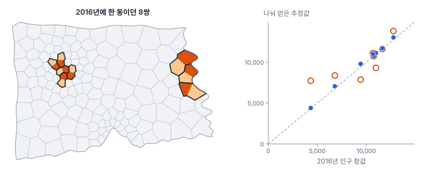
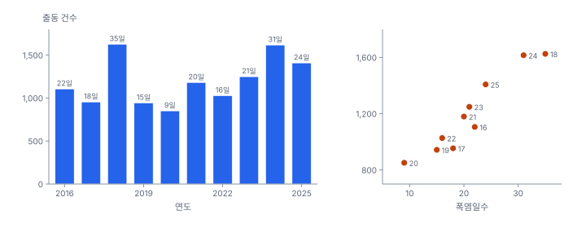
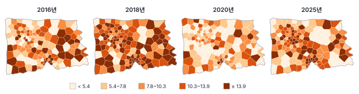
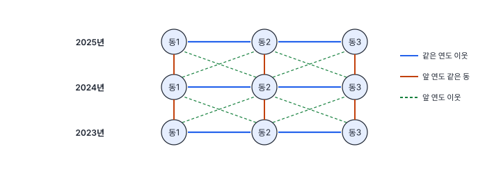

[목차](../README.md) · 이전: [32강 공간 제약 군집화](32-spatially-constrained-clustering.md) · 다음: [34강 시공간 탐색](34-spatiotemporal-exploration.md)

# 33강 시공간 자료의 구조

> 앱 지원: ● 앱에서 따라 할 수 있음 (분산 분해, 경계 변화 재현, 시공간 가중치는 코드로 보충함) · 읽는 시간 약 40분

## 이 강에서 얻는 것

- 시공간 자료의 꼴(패널, 시공간 점, 시점별 표면)과 긴 형태·넓은 형태·기간별 파일을 구분하고, 앱에서 서로 바꿀 수 있음
- 시간 단위와 경계 변화가 만드는 문제를 알고, 면적 비례와 인구 비례 내삽으로 과거 자료를 지금 경계에 맞출 수 있음
- 시공간 변동을 공간 몫과 시간 몫으로 나누고, 시간 자기상관과 시공간 가중치의 구조를 앎

## 들어가는 질문

지금까지 한빛시의 분석은 2025년 여름 한 해의 자료였음. "고령비율이 높고 더운 동에서 출동률이 높다", "마루구 몇 동에 높은 값이 모여 있다"는 결론은 해마다 같은가? 폭염일수가 35일이던 해와 9일이던 해에도 같은 동이 높은가? 10년 치 자료가 생기면 무엇을 더 알 수 있고, 무엇을 조심해야 하는가?

9부는 시간이 더해진 공간 자료를 다룸. 이 강은 자료의 구조와 준비를, 34강은 탐색을, 35강은 모형을 봄.

### 새 자료: 행정동 10년 패널

`book/data/hanbit_dong_panel.gpkg`를 더했음. 행정동 150개의 2016~2025년 값을 한 해에 한 행씩 담은 1,500행의 자료임.

| 열 | 내용 |
|---|---|
| 동코드, 구, 동이름 | 행정동 (2025년 경계) |
| 연도 | 2016~2025 |
| 인구, 고령인구 | 그해 인구와 65세 이상 인구 |
| 출동건수 | 그해 6~8월 폭염 관련 119 구급 출동 건수 |
| 폭염일수 | 그해 한빛시의 폭염일수(일 최고기온 33℃ 이상인 날). 도시 전체에 하나인 값이라 모든 동이 같음 |
| 면적_km2 | 동 면적 |

- 2025년 값은 지금까지 쓴 `hanbit_dong.gpkg`의 인구·고령인구, `hanbit_events.gpkg`의 동별 출동 건수와 같음
- 경계는 모든 연도에 2025년 경계를 씀. 과거 값을 지금 경계로 다시 집계해 둔 자료라고 봄(2절)
- 다른 한빛시 자료처럼 알려진 규칙으로 만들었고, 규칙은 `book/data/make_hanbit_panel.py`에 있음. 34~35강의 탐색과 모형이 무엇을 찾아내는지 확인하기 위해, 책을 끝까지 읽기 전에는 보지 않기를 권함

## 1. 시공간 자료의 꼴과 형태

### 세 가지 꼴

1강의 공간 자료의 세 얼굴(면, 점, 표면)에 시간이 더해지면 다음과 같은 꼴이 됨.

- **고정 단위의 시계열(패널)**: 같은 지역 단위를 여러 시점에 관측함. 이 강의 행정동 10년 자료, 해마다의 인구 통계, 월별 감염병 신고가 이 꼴임
- **시공간 점 사건**: 사건마다 위치와 시각이 있음. `hanbit_events.gpkg`의 출동은 출동일이 있어 이미 시공간 점 자료임(6월 303건, 7월 621건, 8월 484건)
- **시점별 표면과 관측소 시계열**: 위성 지표온도처럼 시점마다 표면이 있거나, 관측소에서 연속으로 잼

이 강과 34강은 주로 첫째 꼴을 다루고, 35강에서 나머지를 개관함.

### 긴 형태, 넓은 형태, 기간별 파일

같은 패널 자료도 표로 담는 방법이 셋임.

- **긴 형태**(long): (ID, 시점, 값) 한 행에 관측 하나. 시점이 행으로 늘어남. 모형(35강)과 시점 수가 많은 자료에 알맞음
- **넓은 형태**(wide): ID 한 행에 시점별 열(`값_2016`, `값_2017` …). 시점마다 지도를 그리고 시점끼리 비교(34강)하기에 알맞음
- **기간별 파일**: `2016.gpkg`, `2017.gpkg` …처럼 시점마다 파일이 따로 있음. 기관에서 받는 자료가 흔히 이 꼴임

### 손으로 해 보기: 긴 형태 ↔ 넓은 형태

동 A, B의 2023~2025년 건수가 긴 형태로 다음과 같음.

| 동 | 연도 | 건수 |
|---|---|---|
| A | 2023 | 3 |
| A | 2024 | 5 |
| A | 2025 | 4 |
| B | 2023 | 7 |
| B | 2024 | 6 |
| B | 2025 | 9 |

넓은 형태로 바꾸면(동을 행으로, 연도를 열로 펼침) 다음과 같음.

| 동 | 건수_2023 | 건수_2024 | 건수_2025 |
|---|---|---|---|
| A | 3 | 5 | 4 |
| B | 7 | 6 | 9 |

행 6개가 행 2개 × 열 3개가 됨. 거꾸로 넓은 형태의 열을 행으로 접으면 긴 형태로 돌아감. 이 바꾸기를 **피벗**(pivot)과 **언피벗**(melt)이라 함. 지도 자료에서는 넓은 형태의 한 행에 지오메트리가 하나이고, 긴 형태에서는 같은 지오메트리가 시점 수만큼 되풀이됨.

GeoStat은 시공간 분석을 넓은 형태로 함. 긴 형태와 기간별 파일은 **시공간 → 기간별 자료 만들기 (긴 형태·기간별 파일)…** 메뉴로 넓은 형태로 바꾸고, 넓은 형태의 `값_2016`, `값_2017` 같은 열은 **시간 변수 묶음**으로 묶어 한 변수의 기간들로 다룸(해 보기).

## 2. 시간 단위와 경계 변화

### 시간 단위

3강의 가변적 공간 단위 문제(MAUP)는 시간에도 있음. 일별, 월별, 연별로 묶는 단위에 따라 무늬가 달라지는 것을 **가변적 시간 단위 문제**(modifiable temporal unit problem; Cheng & Adepeju 2014)라 함. 이 패널은 여름 석 달을 한 해로 묶었으므로 한 해 안의 폭염 기간별 차이는 보이지 않음. 연 단위로 본 결론을 일 단위의 결론(예: "폭염 당일 출동이 늘어난다")으로 옮기지 않음.

### 경계 변화

행정구역 경계는 바뀜. 인구가 늘어난 동은 둘로 나뉘고, 줄어든 동은 합쳐짐. 경계가 다른 시점의 값을 그대로 이어 붙이면 같은 이름의 다른 땅을 비교하게 됨. 흔한 대처는 셋임.

1. **지금 경계로 다시 집계함**: 과거의 작은 단위(조사구, 주소) 자료가 있으면 지금 경계로 다시 묶음. 이 패널이 그렇게 만든 자료라고 봄
2. **면적 내삽**(areal interpolation): 과거 경계의 값을 지금 경계로 나눔
3. **고정 격자**: 시점마다 값을 같은 격자로 옮겨 격자 단위로 비교함(40강)

면적 내삽에서 값을 나누는 몫을 정하는 방법은 둘임.

- **면적 비례**(areal weighting; Goodchild & Lam 1980): 겹치는 면적의 비율로 나눔. 사람과 사건이 땅에 고르게 퍼져 있다고 가정함
- **보조 자료 비례**(dasymetric; Mennis 2003): 인구 격자, 건물, 토지 피복처럼 값이 어디에 몰려 있는지 알려 주는 자료의 비율로 나눔

건수나 인구처럼 더할 수 있는 값(외연 변수)은 몫대로 나누고, 비율이나 평균처럼 더할 수 없는 값(내연 변수)은 분자와 분모를 각각 나눈 뒤 다시 계산함.

### 손으로 해 보기: 한 동을 둘로

2016년에 인구 10,000명인 동 하나가 지금은 A(면적 3 ㎢, 지금 인구 2,000명)와 B(1 ㎢, 6,000명)로 나뉘었음.

- 면적 비례: A = 10,000 × 3/4 = 7,500, B = 2,500
- 지금 인구 비례: A = 10,000 × 2,000/8,000 = 2,500, B = 7,500

넓지만 사람이 적은 A에 면적 비례는 인구를 거꾸로 몰아 줌. 다만 인구 비례도 "2016년에도 인구가 지금처럼 퍼져 있었다"고 가정하므로, 그사이 한쪽에 아파트가 들어섰다면 틀림.

### 한빛시에서 재현하기

2016~2025년에 인구가 빨리 늘어난 동 8곳을 골라, 2016년에는 같은 구의 이웃 동과 한 동이었다고 보고 두 동의 2016년 값을 합쳤음. 이 합친 값을 지금 경계로 다시 나눠 패널의 참값과 비교했음. 인구 비례에는 `hanbit_pop100.tif`(2025년 100 m 격자 인구)를 썼음.



| 변수 | 면적 비례 평균 절대 오차 | 인구 비례 평균 절대 오차 | 상대 오차 중앙값 (면적 / 인구) |
|---|---|---|---|
| 인구 | 1,221.0명 | 196.5명 | 11.8% / 1.9% |
| 출동건수 | 3.4건 | 2.6건 | 53.8% / 31.3% |

인구는 보조 자료 비례로 거의 맞출 수 있지만, 출동 건수는 어느 방법으로도 상대 오차의 중앙값이 30%를 넘음. 쌍마다 십여 건뿐인 사건이 두 동에 어떻게 나뉘었는지는 우연이 크게 좌우하기 때문임. 내삽한 과거 값은 "추정값"이라는 사실을 기록하고, 작은 단위의 사건 수를 내삽했다면 그 불확실성을 감안함.

## 3. 공간 변동과 시간 변동

도시 전체의 연도별 값은 다음과 같음.

| 연도 | 출동건수 | 폭염일수 | 출동률(1만 명당) | 고령비율(%) |
|---|---|---|---|---|
| 2016 | 1,106 | 22 | 9.303 | 16.78 |
| 2017 | 954 | 18 | 8.033 | 17.20 |
| 2018 | 1,626 | 35 | 13.699 | 17.62 |
| 2019 | 943 | 15 | 7.951 | 18.03 |
| 2020 | 851 | 9 | 7.166 | 18.46 |
| 2021 | 1,180 | 20 | 9.916 | 18.89 |
| 2022 | 1,027 | 16 | 8.614 | 19.32 |
| 2023 | 1,249 | 21 | 10.445 | 19.74 |
| 2024 | 1,616 | 31 | 13.495 | 20.16 |
| 2025 | 1,408 | 24 | 11.733 | 20.58 |



연 출동 건수와 폭염일수의 상관은 0.952임. log(건수)를 폭염일수에 회귀하면 기울기 0.0282로, 폭염일수가 하루 많은 해에 출동이 약 2.9% 많음. 다만 점이 10개뿐이고 고령화라는 다른 추세도 함께 움직이므로, 이 값은 기술일 뿐 효과의 추정이 아님(35강).



열 해 전체의 값으로 정한 5분위 경계(5.43, 7.84, 10.28, 13.87)로 칠하면, 가장 높은 계급에 든 동이 2018년 61개, 2020년 9개임. 해마다 따로 분위수를 정하면 어느 해나 30개씩 들어가므로 해끼리의 차이가 지워짐. 시점끼리 수준을 비교하려면 경계를 같게 하고, 해마다의 상대적 순위를 보려면 따로 정함.

### 분산 분해: 어디서 오는 차이인가

동 150개 × 연도 10개의 출동률 1,500개의 차이를 동의 몫, 연도의 몫, 나머지로 나눌 수 있음(이원 배치 분산 분석과 같은 계산). 동 효과는 동마다 열 해 평균이 전체 평균과 다른 정도, 연도 효과는 해마다 150개 동 평균이 전체 평균과 다른 정도임.

| | 전체 | 열 해 평균 인구 1만 명 이상 56개 동 |
|---|---|---|
| 동(공간) | 58.7% | 42.4% |
| 연도(시간) | 7.4% | 23.6% |
| 나머지 | 33.9% | 34.0% |

- 차이의 대부분은 동 사이의 꾸준한 차이임. 공간 구조가 해마다 크게 바뀌지 않음
- 연도의 몫은 전체로는 7.4%지만 인구가 많은 동만 보면 23.6%임. 작은 동은 작은 수의 흔들림(14강)이 커서 연도 효과가 묻힘
- 나머지(동 × 연도의 고유한 변동)는 3분의 1임. 이 안에 작은 수의 우연, 특정 동의 특정 해에만 있던 변화가 섞여 있음

## 4. 시간 자기상관

같은 동의 앞뒤 해를 짝지어 출동률의 상관을 보면 0.565임. 앞 해에 높던 동은 다음 해에도 높은 경향이 있음. 그런데 이것이 "작년에 출동이 많아서 올해도 많다"는 뜻인지, "원래 높은 동이라서 해마다 높다"는 뜻인지는 다름.

- 연도 평균만 뺀 값의 상관: 0.621
- 동 평균과 연도 평균을 모두 뺀 값(분산 분해의 나머지)의 상관: −0.057

동의 꾸준한 차이를 빼면 앞뒤 해의 상관이 거의 0이 됨. 다만 동 평균과 연도 평균을 뺀 값은 서로 독립이어도 상관이 −1/(T − 1) ≈ −0.11 쪽으로 치우침. 서로 독립인 잡음(150 × 10)으로 1,000번 해 보면 평균 −0.112, 95% 범위 −0.164~−0.059임. 관측된 −0.057은 이 범위의 바로 위라 아주 약한 지속성이 남아 있을 수는 있음. 그래도 이 자료의 시간 지속성은 대부분 동마다의 고정된 차이 때문이고, 해에서 해로 넘어가는 동역학은 약함. 인구의 앞뒤 해 상관은 0.9997인데, 이것도 대부분 동마다 인구 규모가 크게 다르기 때문이고 인구는 해마다 조금씩만 바뀜.

어느 쪽이든 같은 동의 열 해 관측은 서로 독립이 아님. 1,500행을 독립 관측처럼 OLS에 넣으면 9강에서 본 것처럼 표준오차가 작게 나옴. 이 구조를 다루는 것이 35강의 패널 모형임.

## 5. 시공간 가중치

공간가중치 W(10강)는 "누가 이웃인가"를 정함. 시공간 자료에서는 이웃의 종류가 늘어남.

- **같은 시점의 공간 이웃**: 같은 해의 이웃 동
- **같은 단위의 앞 시점**: 같은 동의 앞 해
- **앞 시점의 공간 이웃**: 앞 해의 이웃 동(시공간 파급)



관측치를 연도 순서대로 쌓으면(앞 연도의 동 150개, 다음 연도의 동 150개 …) 세 종류의 가중치는 **크로네커 곱**(Kronecker product, ⊗)으로 간단히 씀. I_T는 T × T 단위행렬, L은 바로 앞 시점을 가리키는 T × T 행렬(대각선 바로 아래가 1)임.

$$
W_{\text{공간}} = I_T \otimes W, \qquad W_{\text{시간}} = L \otimes I_n, \qquad W_{\text{시공간}} = L \otimes W
$$

### 손으로 해 보기: 동 3개 × 연도 2개

동 1–2–3이 한 줄로 이웃이면 W의 1행은 (0, 1, 0), 2행은 (1, 0, 1), 3행은 (0, 1, 0)임. 연도가 2개면 관측치는 (2024년 동 1, 2, 3, 2025년 동 1, 2, 3)의 6개이고, I₂ ⊗ W는 6 × 6 행렬의 왼쪽 위와 오른쪽 아래에 W를 하나씩 놓은 것임. L ⊗ I₃은 2025년 동 i의 행에서 2024년 동 i의 열만 1이고, L ⊗ W는 2025년 동 i의 행에서 2024년 동 i의 이웃 열이 1임. 예를 들어 2025년 동 2의 행은 L ⊗ W에서 2024년 동 1과 동 3에 1이 있음.

한빛시 패널은 1,500 × 1,500 행렬이 되고, 0이 아닌 칸은 같은 연도 이웃 8,120개, 앞 연도 같은 동 1,350개, 앞 연도 이웃 7,308개임. 크기는 커지지만 거의 모든 칸이 0인 희소 행렬이라 계산에 부담이 적음.

시간은 방향이 있다는 점이 공간과 다름. 올해 값이 작년 값에 영향을 줄 수는 없으므로 시간 이웃은 앞쪽(과거)만 셈. 또 같은 해 이웃과 앞 해 이웃에 얼마의 무게를 줄지는 자료가 정해 주지 않아 분석자가 정하거나 모형에서 추정함(35강).

## 해 보기: GeoStat에서 패널 자료 다루기

1. `book/data/hanbit_dong_panel.gpkg`를 엶
   - 확인: 피처 1,500개. 같은 동의 폴리곤이 연도마다 겹쳐 있어 지도에는 150개 동처럼 보임. **속성 테이블**에서 동코드 HB001의 행이 10개(연도 2016~2025)인 것을 봄
2. **공간 분석 → 계산 필드 추가…** 메뉴에서 `출동률` = `` `출동건수` / `인구` * 10000 ``을 만듦(긴 형태에서 한 번에 1,500행이 계산됨)
3. **시공간 → 기간별 자료 만들기 (긴 형태·기간별 파일)…** 메뉴에서 **긴 형태 (ID·기간·값 행)**를 고르고, **ID 열 (지점·격자 구분)**은 `동코드`, **기간 열 (연도 등)**은 `연도`, **기간별 열로 만들 값 (숫자 열)**은 `인구`, `고령인구`, `출동건수`, `출동률`을 골라 **만들기…**를 누르고 `hanbit_dong_panel_기간별.gpkg`로 저장함
   - 확인: 새 자료의 피처 150개, 열 `인구_2016` … `출동률_2025`(40개)와 `동코드`. HB001의 `출동건수_2016` 1, `출동건수_2025` 1, `출동률_2025` 5.24
4. **시공간 → 시간 변수 묶음…** 메뉴를 엶
   - 확인: `인구`, `고령인구`, `출동건수`, `출동률` 묶음이 연도 2016~2025의 10개 기간으로 이미 만들어져 있음
5. 주제도 패널에서 **변수** `출동률_2016`, **방법** **분위수**, **계급 수** 5를 고르고 **적용**을 누름. **기간** 줄의 ◀ ▶ 단추로 해를 넘기고, **재생**을 눌러 차례로 봄
   - **모든 기간 같은 계급 경계 (기간끼리 비교)**를 켜고 **적용**을 다시 누르면 열 해의 값을 모은 경계(5.433, 7.838, 10.28, 13.87)로 칠해, 2018년은 진하고 2020년은 옅게 보임(3절 그림)
   - 끄면 해마다 경계를 따로 정해 어느 해나 비슷한 밝기로 보임. 두 지도에서 무엇을 비교할 수 있는지 생각해 봄
6. `hanbit_events.gpkg`를 열고 **속성 테이블**에서 `출동일`, `월` 열을 확인함. 시공간 점 자료임. 월마다 점 집계를 하면 월별 넓은 형태도 만들 수 있음(연습 5)

### 코드로: 형태 바꾸기, 분산 분해, 시공간 가중치

```python
import geopandas as gpd
import numpy as np
from libpysal.weights import Queen
from scipy import sparse

p = gpd.read_file("book/data/hanbit_dong_panel.gpkg")       # 긴 형태: 1,500행 (동 150 × 연도 10)
p["출동률"] = p["출동건수"] / p["인구"] * 10000
wide = p.pivot(index="동코드", columns="연도", values="출동률")  # 넓은 형태: 150행 × 10열
long = wide.reset_index().melt(id_vars="동코드", var_name="연도", value_name="출동률")   # 다시 긴 형태
print(f"넓은 형태 {wide.shape}, 긴 형태 {long.shape}")

# 동 × 연도 이원 분산 분해
R = wide.to_numpy()
g = R.mean()
dong_eff = R.mean(axis=1, keepdims=True) - g                # 동 효과 (시간에 따라 변하지 않는 차이)
year_eff = R.mean(axis=0, keepdims=True) - g                # 연도 효과 (도시 전체가 함께 오르내림)
resid = R - g - dong_eff - year_eff
tot = ((R - g) ** 2).sum()
print(f"동 {(dong_eff ** 2).sum() * R.shape[1] / tot:.1%}, 연도 {(year_eff ** 2).sum() * R.shape[0] / tot:.1%}, 나머지 {(resid ** 2).sum() / tot:.1%}")

# 앞뒤 연도의 상관: 그대로와 두 효과를 뺀 뒤
lag1 = lambda M: np.corrcoef(M[:, 1:].ravel(), M[:, :-1].ravel())[0, 1]  # noqa: E731
print(f"앞뒤 연도 상관: 그대로 {lag1(R):.3f}, 동·연도 효과를 뺀 뒤 {lag1(resid):.3f}")

# 시공간 가중치: 같은 연도 이웃(I ⊗ W)과 앞 연도 같은 동(L ⊗ I)
d25 = p[p["연도"] == 2025].sort_values("동코드").reset_index(drop=True)
W = Queen.from_dataframe(d25, use_index=False).sparse
T = 10
W_space = sparse.kron(sparse.identity(T), W)
W_time = sparse.kron(sparse.eye(T, k=-1), sparse.identity(W.shape[0]))
print(f"시공간 가중치 {W_space.shape}: 같은 연도 이웃 {W_space.nnz:,}칸, 앞 연도 같은 동 {W_time.nnz:,}칸")
```

- 확인: 넓은 형태 (150, 10), 긴 형태 (1500, 3). 동 58.7%, 연도 7.4%, 나머지 33.9%. 앞뒤 연도 상관 0.565, 효과를 뺀 뒤 −0.057. 같은 연도 이웃 8,120칸, 앞 연도 같은 동 1,350칸
- 더 해 보기: 면적 비례 내삽은 `gpd.overlay(옛경계, 새경계, how="intersection")`로 조각을 만들고 조각 면적 / 옛 동 면적을 몫으로 곱해 새 동별로 더하면 됨. PySAL의 tobler 패키지(`area_interpolate`)가 같은 일을 함

## 헷갈리는 쌍

- **긴 형태 vs 넓은 형태**: 시점이 행으로 늘어나는가 열로 늘어나는가. 모형은 긴 형태로, 시점별 지도와 비교는 넓은 형태로 함
- **외연 변수 vs 내연 변수**: 나눠 더할 수 있는 값(건수, 인구)과 그럴 수 없는 값(비율, 평균). 내삽할 때 다르게 다룸
- **면적 비례 vs 보조 자료 비례**: 땅에 고르게 퍼졌다고 보는가, 사람이 사는 곳에 몰렸다고 보는가
- **시간 지속성 vs 시간 동역학**: 원래 높은 단위가 해마다 높은 것과, 앞 시점의 값이 다음 시점을 끌어올리는 것. 동 효과를 빼 보면 구별됨
- **같은 계급 경계 vs 시점별 계급 경계**: 시점끼리의 수준 비교와 시점 안의 순위 비교

## 흔한 실수와 심사 지적

- **경계가 바뀐 시점의 자료를 이름(동코드)만 맞춰 이어 붙임**
  - 지적: "그 기간에 행정구역 개편은 없었습니까?"
  - 대응: 경계 변경 이력을 확인하고, 지금 경계로 다시 집계하거나 내삽한 뒤 그 방법을 적음
- **내삽한 과거 값을 관측값처럼 씀**
  - 대응: 내삽 방법과 보조 자료를 밝히고, 작은 사건 수의 내삽은 불확실성이 크다는 점을 적음
- **시점마다 따로 정한 계급으로 그린 지도로 "증가했다"고 씀**
  - 대응: 수준을 비교하려면 모든 시점에 같은 계급 경계를 씀
- **패널의 모든 행을 독립 관측으로 회귀함**
  - 지적: "같은 동의 반복 관측을 고려했습니까?"
  - 대응: 패널 모형(고정효과, 확률효과)이나 군집 강건 표준오차를 씀(35강)
- **연 단위 결과를 일 단위의 메커니즘으로 해석함**
  - 대응: 분석한 시간 단위를 밝히고, 그 단위에서 말할 수 있는 것만 말함

## 보고서에는 이렇게 씀

> 2016~2025년 한빛시 150개 행정동의 폭염 관련 구급 출동 자료를 2025년 행정동 경계를 기준으로 구성하였다(1,500개 동·연도). 연간 출동 건수는 851건(2020년)에서 1,626건(2018년)까지 변하였고, 연간 폭염일수와의 상관계수는 0.95였다. 동별 출동률(인구 1만 명당)의 변동을 이원 분산 분해한 결과 동 간 차이가 58.7%, 연도 간 차이가 7.4%, 나머지가 33.9%를 차지하였다. 같은 동의 인접한 두 해의 출동률 상관은 0.57이었으나, 동 평균과 연도 평균을 제거하면 −0.06으로 독립일 때의 기대값(−0.11) 근처였으므로, 시간적 지속성은 주로 동 간의 안정된 차이에서 비롯된 것으로 판단하였다.

적어야 할 항목은 다음과 같음.

- 자료의 기간, 시간 단위, 공간 단위와 그 경계 기준(경계 변화의 처리 방법)
- 내삽했다면 방법(면적 비례, 보조 자료)과 그 한계
- 시간 추세와 시점별 지도의 계급 경계 기준
- 공간·시간 변동의 크기(분산 분해)와 시간 자기상관

## 요약

- 시공간 자료는 고정 단위의 시계열(패널), 시공간 점 사건, 시점별 표면의 꼴이 있음. 같은 패널도 긴 형태, 넓은 형태, 기간별 파일로 담을 수 있고 앱의 **기간별 자료 만들기**로 서로 바꿈
- 시간 단위와 경계 변화는 결과를 바꿈. 과거 값은 지금 경계로 다시 집계하거나 내삽함. 한빛시 재현에서 인구는 격자 인구 비례로 오차 1.9%(면적 비례 11.8%)였지만, 출동 건수는 어느 방법으로도 30% 넘게 틀렸음
- 연 출동 건수는 폭염일수와 함께 오르내림(상관 0.95). 동별 출동률 변동의 58.7%는 동 사이, 7.4%는 연도 사이의 차이임
- 앞뒤 해의 상관(0.565)은 동의 고정된 차이를 빼면 거의 0이 됨(−0.057, 독립이어도 −0.11 쪽으로 치우침). 그래도 같은 동의 관측은 독립이 아님
- 시공간 가중치는 같은 시점 이웃(I ⊗ W), 앞 시점 같은 단위(L ⊗ I), 앞 시점 이웃(L ⊗ W)으로 짬

## 핵심 용어

| 한글 | 영문 | 비고 |
|---|---|---|
| 패널 자료 | Panel Data | 고정 단위의 시계열 |
| 긴 형태 / 넓은 형태 | Long / Wide Format | |
| 피벗 / 언피벗 | Pivot / Melt | |
| 시간 변수 묶음 | Time Variable Group | GeoStat |
| 가변적 시간 단위 문제 | Modifiable Temporal Unit Problem (MTUP) | Cheng & Adepeju 2014 |
| 면적 내삽 | Areal Interpolation | Goodchild & Lam 1980 |
| 보조 자료 비례 내삽 | Dasymetric Interpolation | Mennis 2003 |
| 외연 / 내연 변수 | Extensive / Intensive Variable | |
| 분산 분해 | Variance Decomposition | |
| 크로네커 곱 | Kronecker Product | |
| 시공간 가중치 | Space-time Weights | |

## 원전과 더 읽을거리

**원전**

- Goodchild, M. F., & Lam, N. S.-N. (1980). Areal interpolation: A variant of the traditional spatial problem. *Geo-Processing*, 1, 297–312.
- Mennis, J. (2003). Generating surface models of population using dasymetric mapping. *The Professional Geographer*, 55(1), 31–42.
- Cheng, T., & Adepeju, M. (2014). Modifiable temporal unit problem (MTUP) and its effect on space-time cluster detection. *PLoS ONE*, 9(6), e100465.

**더 읽을거리**

- Cressie, N., & Wikle, C. K. (2011). *Statistics for Spatio-Temporal Data*. Wiley. 1장, 5장(탐색 방법)
- Wikle, C. K., Zammit-Mangion, A., & Cressie, N. (2019). *Spatio-Temporal Statistics with R*. Chapman & Hall/CRC. 2장(자료 형태와 탐색). 온라인 공개
- Logan, J. R., Xu, Z., & Stults, B. J. (2014). Interpolating U.S. decennial census tract data from as early as 1970 to 2010: A longitudinal tract database. *The Professional Geographer*, 66(3), 412–420.

## 연습

1. 손계산의 긴 형태 자료에 동 C(2023년 2, 2025년 4, 2024년 자료 없음)를 더해 넓은 형태로 바꾸면 어떻게 되는가? 앱의 **기간별 자료 만들기**는 빈칸을 어떻게 다루는가?

2. 2016년에 출동 12건이던 동이 지금은 A(면적 2 ㎢, 지금 인구 9,000명)와 B(6 ㎢, 3,000명)로 나뉘었음. 면적 비례와 인구 비례로 A의 2016년 건수를 추정하시오. 어느 쪽을 믿겠는가?

3. 분산 분해에서 동의 몫이 58.7%였음. 이것을 "출동률 차이의 59%는 동의 특성 때문"이라고 쓰면 무엇이 문제인가?

4. 동 평균을 빼지 않은 앞뒤 해의 상관 0.565를 근거로 "작년에 출동이 많았던 동은 올해도 많을 것이므로 작년 출동 건수로 올해를 예측할 수 있다"고 함. 무엇이 맞고 무엇이 틀린가?

5. `hanbit_events.gpkg`의 출동을 월별로 나누어 동별 6월, 7월, 8월 건수의 넓은 형태 자료를 앱에서 만들려면 어떻게 하는가?

<details>
<summary>해답</summary>

1. 넓은 형태는 C 행에 건수_2023 = 2, 건수_2024 = 빈칸, 건수_2025 = 4가 됨. 앱은 관측이 없는 ID·기간 칸을 값 없음으로 두고 "관측이 없는 ID·기간 칸 1개는 값 없음으로 둠" 같은 안내를 보여 줌. 빈칸은 0이 아님. 건수 자료에서 "출동이 없었다"(0)와 "자료가 없다"(빈칸)를 구별해야 함.

2. 면적 비례: A = 12 × 2/8 = 3건. 인구 비례: A = 12 × 9,000/12,000 = 9건. 출동은 사람이 있는 곳에서 생기므로 인구 비례가 더 그럴듯함. 다만 2016년에도 인구가 지금처럼 A에 몰려 있었는지 확인해야 하고, 12건을 나누는 것이라 어느 방법이든 우연에 따른 오차가 큼(2절의 재현에서 상대 오차 30% 이상).

3. 동의 몫은 "동마다 열 해 평균이 다른 정도"이고, 그 원인이 동의 특성(인구 구성, 더위)인지 동마다 다른 우연(작은 인구에서 생기는 흔들림이 열 해 평균에도 남은 것)인지는 가르지 않음. 또 원인 변수를 넣은 모형이 아니므로 "때문"이라고 쓸 수 없음. "출동률 변동의 59%는 동 사이의 꾸준한 차이"라고 씀.

4. 맞는 것: 앞 해에 높던 동은 다음 해에도 높은 경향이 있어, 작년 값은 올해의 예측에 도움이 됨. 틀린 것: 그 이유는 작년 출동이 올해 출동을 늘리는 동역학 때문이 아니라 대부분 동마다의 꾸준한 차이 때문임(동 평균과 연도 평균을 빼면 상관 −0.057로, 독립일 때 기대되는 −0.11 근처). 그래서 한 해 값보다 여러 해 평균이 더 나은 예측임. 작년 한 해 값은 작은 수의 우연까지 담고 있어 그대로 쓰면 평균으로의 회귀를 놓침.

5. `hanbit_events.gpkg`에서 **계산 필드 추가…**로 `m6` = `` (`월` == 6) * 1 ``, `m7`, `m8`을 만들어 각 출동이 그 달이면 1인 열을 만듦. `hanbit_dong`을 고르고 **점 집계 (점 → 폴리곤)…**에서 원본 속성 통계로 세 열의 **합계**를 구하면 동별 6월, 7월, 8월 건수 열이 생김. 이 세 열을 **시간 변수 묶음…** 메뉴에서 한 묶음(기간 이름 6월, 7월, 8월)으로 묶으면 월별 기간 지도와 34강의 분석을 할 수 있음. 월별 파일이 따로 있다면 **기간별 파일 잇기**로 이어도 됨.

</details>

---

[목차](../README.md) · 이전: [32강 공간 제약 군집화](32-spatially-constrained-clustering.md) · 다음: [34강 시공간 탐색](34-spatiotemporal-exploration.md)
