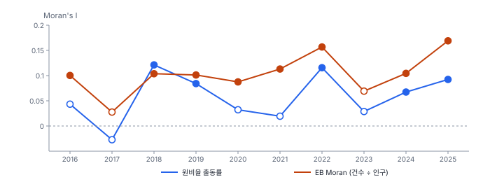
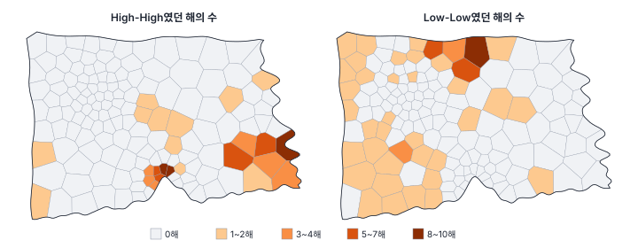
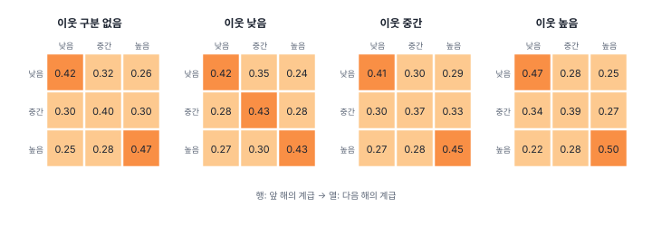
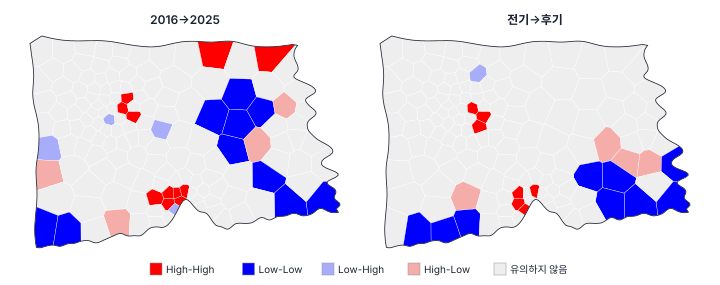
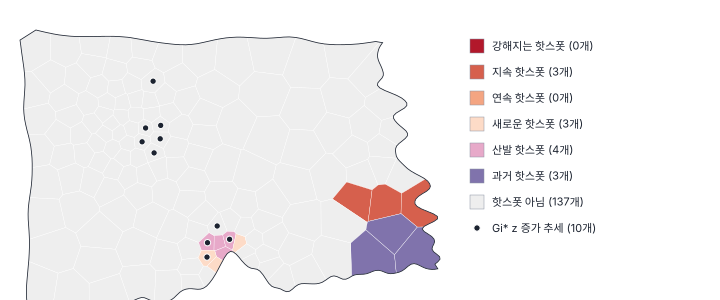

[목차](../README.md) · 이전: [33강 시공간 자료의 구조](33-spatiotemporal-data.md) · 다음: [35강 시공간 모형 개요](35-spatiotemporal-models.md)

# 34강 시공간 탐색

> 앱 지원: ◐ Moran's I 추이, 기간별 LISA와 군집 전이, 차분 LISA는 앱에서, LISA 마르코프·공간 마르코프와 떠오르는 핫스폿 분석은 코드로 함 · 읽는 시간 약 50분

## 이 강에서 얻는 것

- 시점마다의 전역·국지 자기상관을 이어 보고, 한 시점의 결과가 얼마나 흔들리는지 판단할 수 있음
- 기간별 LISA의 군집 전이, LISA 마르코프, 공간 마르코프로 "무늬가 어떻게 움직이는가"를 요약할 수 있음
- 변화량의 공간 무늬(차분 LISA)와 떠오르는 핫스폿 분석으로 새로 생기거나 강해지는 곳을 찾고, 그 한계를 앎

## 들어가는 질문

14강에서 2025년 출동률의 EB 비율 LISA로 마루구 남쪽의 몇 동이 High-High로 나왔음. 이 곳은 원래부터 높았는가, 최근에 높아졌는가? 다른 해에도 같은 곳이 나오는가? 해마다 LISA 지도를 그려 나란히 놓으면 무늬가 계속 바뀌는데, 그 가운데 무엇이 진짜 변화이고 무엇이 우연인가?

이 강은 33강의 행정동 10년 패널(`hanbit_dong_panel.gpkg`)을 넓은 형태로 바꾼 자료로, 시공간 무늬를 탐색하는 방법들을 차례로 적용함.

## 1. 시점별 전역 자기상관의 추이

가장 먼저 할 일은 해마다 전역 Moran's I(11강)를 구해 이어 보는 것임. 공간 무늬가 강해지는지, 약해지는지, 해마다 들쭉날쭉한지 봄.



| 연도 | 2016 | 2017 | 2018 | 2019 | 2020 | 2021 | 2022 | 2023 | 2024 | 2025 |
|---|---|---|---|---|---|---|---|---|---|---|
| 원비율 I | 0.043 | −0.027 | 0.121 | 0.084 | 0.032 | 0.019 | 0.116 | 0.029 | 0.067 | 0.092 |
| 유사 p | 0.116 | 0.326 | 0.004 | 0.027 | 0.184 | 0.288 | 0.006 | 0.203 | 0.045 | 0.031 |
| EB Moran's I | 0.100 | 0.028 | 0.104 | 0.101 | 0.087 | 0.113 | 0.157 | 0.069 | 0.104 | 0.169 |
| 유사 p | 0.023 | 0.226 | 0.013 | 0.015 | 0.034 | 0.011 | 0.002 | 0.066 | 0.013 | 0.004 |

- 원비율의 Moran's I는 해마다 크게 흔들림. 2017년은 음수이고 2018년은 0.121임. 공간 구조가 해마다 바뀐 것이 아니라, 인구가 적은 동의 원비율이 해마다 우연히 튀기 때문임(14강)
- 인구를 고려한 EB Moran's I(Assunção & Reis 1999)는 0.03~0.17로, 2017년을 빼면 0.07~0.17에서 더 안정되고 열 해 가운데 여덟 해가 유의함
- 열 해의 건수와 인구를 합쳐 만든 출동률은 Moran's I 0.077(p 0.009), EB Moran's I 0.104(p 0.005)임

해마다의 Moran's I가 "2017년에 공간 무늬가 사라졌다가 2018년에 생겼다"고 말해 주는 것은 아님. 시점별 값의 흔들림이 검정의 표본 변동인지 진짜 변화인지는, 비율의 안정성(분모의 크기)과 함께 판단함.

## 2. 기간별 LISA와 군집 전이

해마다 LISA(12강)를 구하면 시점마다 High-High, Low-Low 등의 군집 지도가 생김. GeoStat은 이것을 한 번에 계산하고, 앞 해에서 다음 해로 군집이 어떻게 바뀌었는지를 **군집 전이표**로 요약함.

| 앞 해 → 다음 해 | 유의하지 않음 | High-High | Low-Low | Low-High | High-Low |
|---|---|---|---|---|---|
| 유의하지 않음 | 1,046 | 22 | 44 | 13 | 22 |
| High-High | 22 | 38 | 0 | 13 | 1 |
| Low-Low | 42 | 0 | 15 | 0 | 4 |
| Low-High | 11 | 15 | 0 | 12 | 2 |
| High-Low | 22 | 0 | 4 | 0 | 2 |

동 150개 × 인접한 두 해 9쌍 = 1,350번의 전이를 모은 표임(원비율 출동률, α 0.05, 보정 없음).

- High-High에서 출발한 74번 가운데 38번(51.4%)이 다음 해에도 High-High였음. 22번은 유의하지 않게 되었고 13번은 Low-High(자기는 낮아지고 이웃은 여전히 높음)가 되었음
- 150개 동 가운데 75개는 열 해 동안 군집이 한 번 이상 바뀌었고, 모든 해에 같은 유의 군집이었던 동은 없음
- 해마다 High-High는 4~11개, Low-Low는 2~11개뿐임. FDR로 보정하면(12강) 유의한 동이 2022년의 4개를 빼면 없음

한 해의 LISA 지도는 우연한 무늬를 많이 담음. 여러 해를 모아 "몇 해 동안 High-High였는가"를 보면 꾸준한 곳이 드러남.



High-High가 가장 자주 나온 동은 다솜20동, 마루17동, 마루18동(각 8해), 다솜21동(7해), 마루15동, 마루16동, 다솜19동(각 6해)임. 한 번이라도 High-High였던 동은 24개지만 5해 이상은 7개뿐임. 14강에서 2025년 EB 비율 LISA(FDR 보정)로 찾은 마루15·16·17·18·31동 가운데 15~18동은 2025년만의 일이 아님.

## 3. 마르코프 연쇄로 요약하기

군집 전이표는 "유의한가"의 전이를 셈. 유의성과 관계없이 값의 상태가 어떻게 옮겨 가는지를 보는 방법이 **마르코프 연쇄**(Markov chain)임. 상태를 몇 개로 나누고, 이번 해의 상태가 정해지면 다음 해의 상태가 어떤 확률로 바뀌는지를 **전이 확률 행렬** P로 나타냄. Pᵢⱼ는 상태 i에서 j로 갈 확률이고, 각 행의 합은 1임. 이 과정이 오래 계속되면 도달하는 분포를 **정상 분포**(stationary distribution)라 함.

### LISA 마르코프

레이(Rey 2001)는 Moran 산점도(11강)의 네 사분면을 상태로 삼았음. 해마다 동을 표준화한 값과 그 공간 시차의 부호로 HH(자기와 이웃 모두 평균 위), LH, LL, HL로 나누고 전이를 셈. 유의성은 따지지 않음.

### 손으로 해 보기: 한 동의 사분면 전이

한 동의 다섯 해 사분면이 HH, HH, LH, HH, HH임. 인접한 두 해의 짝은 (HH, HH), (HH, LH), (LH, HH), (HH, HH)의 4개임. HH에서 출발한 3번 가운데 2번은 HH로 남고 1번은 LH로 갔으므로, 이 동만으로 추정한 P(HH → HH) = 2/3, P(HH → LH) = 1/3임. 모든 동의 짝을 모아 같은 방법으로 셈.

### 한빛시의 LISA 마르코프

| 앞 → 뒤 | HH | LH | LL | HL |
|---|---|---|---|---|
| HH | 0.482 | 0.221 | 0.163 | 0.134 |
| LH | 0.198 | 0.341 | 0.300 | 0.160 |
| LL | 0.111 | 0.168 | 0.491 | 0.230 |
| HL | 0.129 | 0.184 | 0.367 | 0.320 |

- 같은 사분면에 남을 확률은 HH 0.482, LL 0.491로, 자기와 이웃이 함께 높거나 함께 낮은 상태가 더 오래감. 자기만 높거나 낮은 상태(HL 0.320, LH 0.341)는 쉽게 바뀜
- 1,350번의 이동을 나누면 자기와 이웃 모두 그대로 41.9%, 자기만 바뀜 25.1%, 이웃만 바뀜 18.1%, 둘 다 바뀜 14.8%임
- 정상 분포(HH 0.213, LH 0.221, LL 0.352, HL 0.213)는 처음 해의 분포(0.220, 0.227, 0.333, 0.220)와 비슷함. 무늬가 한쪽으로 쏠려 가는 변화는 보이지 않음

### 공간 마르코프

**공간 마르코프**(spatial Markov; Rey 2001)는 고전적 마르코프 행렬을 이웃의 상태별로 나눔. 출동률을 열 해 전체의 3분위(7.15, 11.30)로 낮음·중간·높음의 계급으로 나누고, 이웃 평균(공간 시차)도 3분위로 나눠, 이웃 계급마다 전이 행렬을 따로 셈. "높은 동 곁에 있는 동은 다음 해에 높아지기 쉬운가"를 물음.



이웃 계급에 따라 높음 → 높음은 0.429, 0.447, 0.495로, 낮음 → 낮음은 0.415, 0.409, 0.475로 조금씩 다름. 그러나 세 행렬이 하나의 행렬과 같다는 가설의 우도비 검정(Bickenbach & Bode 2003)은 LR 7.04, 자유도 12, p 0.855로 기각되지 않음. 이 자료에서는 이웃의 상태가 다음 해의 변화를 바꾼다는 증거가 없음. 33강에서 본 것처럼 이 자료의 시간 지속성은 대부분 동마다의 고정된 차이이고, 이웃에서 이웃으로 번지는 동역학은 약함.

대각선의 확률(0.37~0.50)은 그리 크지 않음. 출동률의 계급이 해마다 자주 바뀌는 것은 작은 수의 흔들림 때문이기도 하므로, 이런 분석은 분모가 큰 자료나 평활한 비율에서 더 의미가 있음.

## 4. 변화량의 공간 무늬: 차분 LISA

어디가 **늘었는가**를 직접 보려면 두 시점의 차이(뒤 − 앞)에 Moran's I와 LISA를 적용함. 이것을 **차분 Moran's I**, **차분 LISA**라 함(GeoDa의 differential Moran). 변화량이 이웃끼리 닮았는지, 함께 크게 늘거나 준 곳이 어디인지 봄.



| 비교 | 차분 Moran's I | High-High(함께 늘어난 곳) |
|---|---|---|
| 2016 → 2025 | 0.192 (p 0.001) | 누리4·14·15·16동, 다솜2동, 마루11·13·15·16·17·30동 (11개) |
| 2016~2018 평균 → 2023~2025 평균 | 0.152 (p 0.003) | 누리14·16·26동, 마루13·17·30·31동 (7개) |

두 해만 비교하면 각 해의 우연한 흔들림이 변화량에 그대로 더해짐. 2016년 → 2025년 변화량의 범위는 −26.10~28.40으로, 평균 변화(1.65)보다 우연의 몫이 훨씬 큼. 여러 해의 평균끼리 비교하면 범위가 −21.10~9.48로 줄고, 두 비교에 함께 남은 곳(누리14·16동, 마루13·17·30동)이 믿을 만한 증가 후보임.

## 5. 떠오르는 핫스폿 분석

**떠오르는 핫스폿 분석**(emerging hot spot analysis)은 ESRI의 ArcGIS Pro가 대중화한 방법으로, 해마다의 Gi* 핫스폿(13강)과 그 추세를 함께 보고 위치마다 유형을 붙임.

1. 해마다 Gi*를 계산해 핫스폿(유의한 양의 z) 여부를 정함
2. 위치마다 열 해의 Gi* z값에 **맨-켄달 추세 검정**(Mann 1945; Kendall 1975)을 적용해, z가 꾸준히 커지는지 작아지는지 봄
3. 두 결과로 유형을 정함. 예를 들면 다음과 같음
   - **새로운**: 마지막 해에 처음 핫스폿
   - **연속**: 마지막 몇 해 동안 끊기지 않고 핫스폿이고 그 전에는 아니었음
   - **강해지는 / 지속 / 약해지는**: 90% 이상의 해에 핫스폿이고 마지막 해도 핫스폿. z가 커지면 강해지는, 작아지면 약해지는, 추세가 없으면 지속
   - **산발**: 마지막 해에 핫스폿이고, 그 전에도 핫스폿이었다 아니었다를 되풀이했으며 90%에 못 미침
   - **과거**: 90% 이상의 해에 핫스폿이었으나 마지막 해에는 아님

ESRI의 원래 방법은 Gi*를 계산할 때 앞뒤 시점의 이웃까지 묶는 시공간 이웃(시간 간격)을 쓰고, 차가운 곳(콜드스폿)의 유형과 "진동" 유형도 따짐. 이 강의 계산은 해마다 공간 이웃만으로 Gi*를 구하고 핫스폿 쪽만 나눈 단순한 판임.

### 손으로 해 보기: 맨-켄달 검정

어떤 동의 다섯 해 Gi* z가 0.5, 1.2, 0.9, 2.1, 2.4임. 맨-켄달 통계량 S는 모든 앞뒤 짝(i < j)의 부호 sign(zⱼ − zᵢ)의 합임. 짝 10개 가운데 뒤가 큰 짝이 9개, 작은 짝(1.2 → 0.9)이 1개이므로 S = 9 − 1 = 8임. 동점이 없으면 Var(S) = n(n − 1)(2n + 5)/18 = 5 × 4 × 15 / 18 = 16.67이고, z = (S − 1)/√Var(S) = 7/4.08 = 1.715, p = 0.086임. 다섯 해로는 꽤 꾸준한 증가도 5%에서 유의하지 않음. 순위만 쓰므로 값의 분포를 가정하지 않는 검정임.

### 한빛시의 유형

원비율 출동률의 Gi*(자기를 포함한 이진 가중치, 정규 근사 z, α 0.05)로 나눈 결과임.



- **지속**: 다솜18·19·20동(9~10해 핫스폿, 추세 없음)
- **과거**: 다솜22·23·24동(9해 핫스폿, 2025년만 아님)
- **새로운**: 마루18·30·31동(2025년에 처음)
- **산발**: 마루13·15·16·17동. 2~4해 핫스폿이고 2025년에도 핫스폿이며 Gi* z가 커지는 추세(맨-켄달 z 1.07~2.86, 13·17동만 유의)
- Gi* z가 유의하게 커지는 동 10개(누리6·13·14·16·17·26동, 마루13·14·17·30동), 작아지는 동 7개(다솜7·13동, 라온12·16·17·18·19동)

"강해지는 핫스폿"은 하나도 없음. 마루구 남쪽은 해마다 핫스폿인 정도(90%)에 이르지는 않았지만 최근 들어 자주 나오고 z가 커지는 곳이라, 산발과 새로운 핫스폿, 증가 추세가 겹쳐 나타남. 다솜구 동쪽 해안은 오래된 핫스폿임.

이 분석은 직관적인 유형을 주지만 한계도 큼.

- 해마다 Gi*를 따로 검정하므로 다중검정 문제가 시간 축으로도 커짐. 유형의 경계(90%)도 관행일 뿐임
- 맨-켄달 검정도 위치마다 하므로 150번의 검정임. 증가 쪽만 보면 우연으로 5% / 2 × 150 ≈ 3.75개가 기대되는데 10개가 나왔고, 증가와 감소를 합치면 우연의 기대 7.5개에 17개임. 다만 이웃한 동의 Gi*는 이웃을 나눠 쓰므로 추세도 함께 움직여, 유의한 동이 모여 있다는 것만으로 우연이 아니라고 할 수는 없음
- 시간 단위(연, 월)와 Gi*의 이웃 정의에 따라 유형이 바뀜

그래서 이 유형은 "어디를 더 들여다볼지"의 지도로 쓰고, 그 곳의 변화는 35강의 모형이나 현장 자료로 확인함.

## 6. 탐색 결과를 모으면

여러 방법이 같은 곳을 가리키면 믿을 만함.

| 곳 | 기간별 LISA | 차분 LISA | 떠오르는 핫스폿 | 읽기 |
|---|---|---|---|---|
| 다솜구 동쪽 해안(다솜18~24동) | High-High 2~8해 | 대체로 감소 쪽(다솜18·19동은 이웃보다 늘어난 High-Low) | 지속·과거 | 오래된 핫스폿 |
| 마루구 남쪽(마루13~18·30·31동) | High-High 6~8해(15~18동) | 함께 늘어남 | 산발·새로운, z 증가 | 최근 강해지는 곳 |
| 누리구 일부(누리14·16·26동 등) | 없음 | 함께 늘어남 | z 증가 | 낮은 수준에서 늘어나는 곳 |

무늬가 왜 생겼는지는 탐색이 말해 주지 않음. 마루구 남쪽에 최근 무슨 일이 있었는지(시설, 인구 구성, 기후 노출)는 다른 자료로 확인해야 함. 35강은 이런 변화를 설명변수와 함께 모형화하는 방법을 개관함.

## 해 보기: GeoStat에서 시공간 분석

1. 33강 해 보기에서 만든 `hanbit_dong_panel_기간별.gpkg`(넓은 형태, 시간 변수 묶음 `출동률` 등)를 열고 퀸 인접 가중치를 만듦
2. **시공간 → 시공간 분석 (Moran 추이·기간별 LISA·차분 LISA)…** 메뉴를 엶. **시간 변수 묶음**은 `출동률 (2016–2025)`, 순열 999, 공간가중치는 퀸, **유의수준 α** 0.05, **다중검정 보정** 없음
3. **1. 전역 Moran's I 추이**의 **기간별 Moran's I 계산** 단추를 누름
   - 확인: 추이 그래프와 표(기간, Moran's I, z, 유사 p, 평균). 2017년 −0.0272(p 0.326), 2018년 0.1213(p 0.004), 2025년 0.0924(p 0.031)
4. **2. 기간별 LISA와 군집 전이**의 **기간별 LISA 실행** 단추를 누름
   - 확인: `TLISA_2016_CL` … `TLISA_2025_CL`과 `TLISA_CHG` 열이 생기고 마지막 기간(2025)의 LISA 군집 지도가 나옴. 주제도 패널의 **기간** ◀ ▶로 해를 넘겨 봄
   - 확인: 결과 패널의 "기간별 LISA · 출동률" 카드에 군집 전이표(High-High → High-High 38 등)와 "군집이 한 번 이상 바뀐 피처 75개 · 모든 기간 같은 유의 군집 0개"
5. 같은 창에서 **다중검정 보정**을 FDR (Benjamini-Hochberg)로 바꿔 다시 실행해 봄(같은 접두어면 앞의 결과를 대체함). 유의한 동이 거의 사라지는 것을 확인함
6. **3. 두 기간의 차분 LISA**에서 **앞 기간** 2016, **뒤 기간** 2025를 고르고 **차분 LISA 실행**을 누름
   - 확인: `DLISA_2016_2025` 접두어의 열이 생기고, High-High 11개(누리4·14·15·16동, 다솜2동, 마루11·13·15·16·17·30동)
7. 세 해 평균끼리 비교함. **공간 분석 → 계산 필드 추가…**로 `전기` = `` (`출동률_2016` + `출동률_2017` + `출동률_2018`) / 3 ``, `후기` = `` (`출동률_2023` + `출동률_2024` + `출동률_2025`) / 3 ``을 만듦. **시공간 → 시간 변수 묶음…** 메뉴에서 **+ 직접 추가**를 눌러 **묶음 이름** `세해평균`, 기간 두 줄의 **기간 이름**과 **열**을 전기·`전기`, 후기·`후기`로 정하고 **저장**함. 시공간 분석 창에서 묶음 `세해평균`, 앞 기간 전기, 뒤 기간 후기로 차분 LISA를 실행함
   - 확인: High-High 7개(누리14·16·26동, 마루13·17·30·31동)
8. **공간 분석 → Moran's I · Moran 산점도…** 메뉴에서 **종류**를 **EB 비율 Moran's I (분자 ÷ 분모)**로, **변수** `출동건수_2018`, **분모 (모집단·노력량 등)** `인구_2018`로 **계산**해 1절 표의 EB 값(0.1038)을 확인함. **종류**를 **차분 Moran's I (변수 − 기준 변수, 기간 사이 변화)**로 바꾸고 **변수** `출동률_2025`, **기준 변수 (앞 기간)** `출동률_2016`으로 계산하면 0.1915임

### 코드로: LISA 마르코프와 공간 마르코프

```python
import geopandas as gpd
import numpy as np
from giddy.markov import LISA_Markov, Spatial_Markov   # pip install giddy
from libpysal.weights import Queen

p = gpd.read_file("book/data/hanbit_dong_panel.gpkg")
p["출동률"] = p["출동건수"] / p["인구"] * 10000
wide = p.pivot(index="동코드", columns="연도", values="출동률")       # 150 × 10
d25 = p[p["연도"] == 2025].sort_values("동코드").reset_index(drop=True)
w = Queen.from_dataframe(d25, use_index=False)
w.transform = "r"
y = wide.to_numpy()

# LISA 마르코프: Moran 산점도 사분면(1 HH, 2 LH, 3 LL, 4 HL)의 해마다 전이
lm = LISA_Markov(y, w)
print("사분면 전이 횟수\n", lm.transitions.astype(int))
print("유지 확률", np.round(np.diag(lm.p), 3))

# 공간 마르코프: 열 해 전체의 3분위로 나눈 계급의 전이를, 이웃 평균의 3분위별로 나눔
sm = Spatial_Markov(y, w, k=3, m=3, fixed=True)
for g in range(3):
    print(f"이웃 계급 {g + 1}: 높음 → 높음 {sm.P[g][2, 2]:.3f}, 낮음 → 낮음 {sm.P[g][0, 0]:.3f}")
print(f"동질성 우도비 검정 LR {sm.LR:.2f}, 자유도 {sm.dof_hom}, p {sm.LR_p_value:.3f}")
```

- 확인: 사분면 전이 횟수 첫 행 133, 61, 45, 37. 유지 확률 0.482, 0.341, 0.491, 0.32. 이웃 계급 3에서 높음 → 높음 0.495. LR 7.04, 자유도 12, p 0.855
- 더 해 보기: 떠오르는 핫스폿 분석은 `esda.getisord.G_Local(값, w, star=True, transform="B")`로 해마다 z를 구하고(`.Zs`), 위치마다 열 해의 z에 맨-켄달 검정(손계산의 S와 분산)을 적용해 만들 수 있음. 이 강의 그림은 `book/fig-src/34.py`의 `ehsa()` 함수로 만들었음. R의 sfdep 패키지(`emerging_hotspot_analysis`)에도 같은 기능이 있음

## 헷갈리는 쌍

- **군집 전이표 vs LISA 마르코프**: 유의한 LISA 군집의 전이를 세는 것과, 유의성과 관계없이 Moran 산점도 사분면의 전이를 세는 것
- **고전적 마르코프 vs 공간 마르코프**: 모든 단위에 하나의 전이 행렬 대 이웃의 상태별로 나눈 전이 행렬
- **차분 LISA vs 기간별 LISA**: 변화량이 이웃과 함께 큰 곳과, 각 시점의 수준이 이웃과 함께 높은 곳. 수준이 높은 곳과 많이 늘어난 곳은 다를 수 있음
- **지속 핫스폿 vs 강해지는 핫스폿**: 핫스폿이 계속되지만 세기의 추세가 없는 곳과, 세기가 커지는 곳
- **맨-켄달 추세 vs 회귀 기울기**: 순위로 본 꾸준한 증감(분포 가정 없음)과 직선의 기울기(크기를 셈)

## 흔한 실수와 심사 지적

- **한 해의 LISA 지도를 해마다 나란히 놓고 "군집이 이동했다"고 씀**
  - 지적: "그 변화는 해마다의 우연한 흔들림보다 큽니까?"
  - 대응: 여러 해를 모은 빈도, 마르코프 요약, 평활한 비율이나 여러 해 평균으로 확인함
- **두 해의 차이만으로 증가 지역을 정함**
  - 대응: 양 끝의 여러 해 평균을 비교하거나 추세 검정을 함께 봄
- **시점마다, 위치마다 검정을 반복하면서 보정을 언급하지 않음**
  - 대응: FDR 등 보정 결과를 함께 보고하고, 탐색 결과임을 밝힘
- **떠오르는 핫스폿 유형을 확정된 사실처럼 씀**
  - 대응: 유형의 규칙(α, 90% 기준, 이웃 정의)을 밝히고, 다른 설정에서도 같은지 확인함
- **작은 수의 원비율로 시공간 분석을 함**
  - 대응: EB Moran, EB 평활 비율, 분모가 큰 단위로 묶기(32강 Max-p)를 검토함

## 보고서에는 이렇게 씀

> 2016~2025년 행정동별 출동률의 시공간 무늬를 탐색하였다. 연도별 EB Moran's I는 0.03~0.17로 열 해 가운데 여덟 해에서 유의하였다(순열 999회, p < 0.05). 연도별 LISA(α = 0.05)에서 다솜구 동쪽 해안과 마루구 남쪽의 7개 동이 다섯 해 이상 High-High로 나타났으나, FDR 보정 후에는 대부분 유의하지 않았다. 공간 마르코프 분석에서 출동률 계급의 전이 확률은 이웃의 계급에 따라 유의하게 다르지 않았다(우도비 7.04, 자유도 12, p = 0.85). 2016~2018년과 2023~2025년 평균의 차분 LISA에서 누리구와 마루구 남쪽의 7개 동이 함께 증가한 지역으로 나타났고, 떠오르는 핫스폿 분석에서도 같은 지역의 Gi* 값이 증가 추세를 보였다(맨-켄달 검정, p < 0.05). 이 결과는 탐색적이며, 마루구 남쪽의 증가 원인은 추가 자료로 확인할 필요가 있다.

적어야 할 항목은 다음과 같음.

- 분석한 값(원비율, EB 평활 등)과 시간·공간 단위, 공간가중치
- 시점별 통계의 요약(추이)과 유의성 기준, 다중검정 보정 여부
- 전이 분석의 상태 정의(사분면, 분위 계급)와 동질성 검정
- 차분 분석의 비교 시점(한 해인지 평균인지)
- 떠오르는 핫스폿 분석을 썼다면 규칙과 설정

## 요약

- 해마다의 전역 Moran's I는 작은 수 때문에 크게 흔들림(원비율 −0.03~0.12). EB Moran's I가 더 안정됨(0.03~0.17, 여덟 해 유의)
- 기간별 LISA의 군집 전이표에서 High-High의 51%가 다음 해에 유지되었고, 여러 해를 모으면 다솜구 동쪽 해안과 마루구 남쪽이 꾸준한 High-High로 드러남. 한 해의 LISA 지도는 우연을 많이 담음
- LISA 마르코프와 공간 마르코프는 무늬의 동역학을 전이 확률로 요약함. 이 자료에서는 이웃의 상태가 다음 해의 변화를 바꾼다는 증거가 없었음(p 0.855)
- 차분 LISA는 함께 늘어난 곳을 찾음. 두 해보다 여러 해 평균을 비교하는 것이 안정적임
- 떠오르는 핫스폿 분석은 해마다의 Gi*와 맨-켄달 추세로 지속·새로운·산발·과거 등의 유형을 붙임. 마루구 남쪽은 최근 강해지는 곳, 다솜구 동쪽 해안은 오래된 핫스폿으로 나타났음

## 핵심 용어

| 한글 | 영문 | 비고 |
|---|---|---|
| 군집 전이표 | Cluster Transition Table | GeoStat 기간별 LISA |
| 마르코프 연쇄 | Markov Chain | |
| 전이 확률 행렬 | Transition Probability Matrix | |
| 정상 분포 | Stationary Distribution | |
| LISA 마르코프 | LISA Markov | Rey 2001 |
| 공간 마르코프 | Spatial Markov | Rey 2001 |
| 차분 Moran's I / 차분 LISA | Differential Moran's I / LISA | |
| 떠오르는 핫스폿 분석 | Emerging Hot Spot Analysis | ESRI |
| 맨-켄달 추세 검정 | Mann-Kendall Trend Test | Mann 1945, Kendall 1975 |

## 원전과 더 읽을거리

**원전**

- Rey, S. J. (2001). Spatial empirics for economic growth and convergence. *Geographical Analysis*, 33(3), 195–214.
- Bickenbach, F., & Bode, E. (2003). Evaluating the Markov property in studies of economic convergence. *International Regional Science Review*, 26(3), 363–392.
- Mann, H. B. (1945). Nonparametric tests against trend. *Econometrica*, 13(3), 245–259.
- Kendall, M. G. (1975). *Rank Correlation Methods* (4th ed.). Griffin.
- Assunção, R. M., & Reis, E. A. (1999). A new proposal to adjust Moran's I for population density. *Statistics in Medicine*, 18(16), 2147–2162.

**더 읽을거리**

- Rey, S. J., Kang, W., & Wolf, L. (2016). The properties of tests for spatial effects in discrete Markov chain models of regional income distribution dynamics. *Journal of Geographical Systems*, 18(4), 377–398.
- Anselin, L. (2024). *An Introduction to Spatial Data Science with GeoDa, Volume 1: Exploring Spatial Data*. CRC Press. 시공간 비교와 차분 Moran
- ESRI. How Emerging Hot Spot Analysis works. ArcGIS Pro 도움말(Space Time Pattern Mining 도구 상자)

## 연습

1. 어떤 동의 여섯 해 사분면이 LL, LL, HL, LL, LL, LH임. 이 동만으로 P(LL → LL)와 P(LL → HL)를 구하시오.

2. 해마다의 원비율 Moran's I가 2017년 −0.027(p 0.326), 2018년 0.121(p 0.004)이었음. "2018년에 출동률의 공간 군집이 새로 생겼다"고 쓰면 무엇이 문제인가?

3. 공간 마르코프의 동질성 검정이 유의하지 않았음(p 0.855). 이것이 "출동률에는 공간 자기상관이 없다"는 뜻인가?

4. 2016년과 2025년의 차분 LISA에서 High-High가 11개, 세 해 평균끼리의 차분 LISA에서는 7개였음. 두 결과가 다른 이유와, 보고서에는 어느 쪽을 쓰는 것이 좋은지 설명하시오.

5. 다섯 해의 Gi* z가 2.5, 2.2, 2.4, 2.1, 1.9(모두 핫스폿)인 동의 맨-켄달 S와 z를 구하고, 떠오르는 핫스폿 유형을 정하시오(90% 기준, α 0.05).

<details>
<summary>해답</summary>

1. 인접한 짝은 (LL, LL), (LL, HL), (HL, LL), (LL, LL), (LL, LH)의 5개임. LL에서 출발한 짝이 4개이고 그 가운데 LL로 남은 것 2개, HL 1개, LH 1개임. P(LL → LL) = 2/4 = 0.5, P(LL → HL) = 1/4 = 0.25. 한 동의 몇 해로는 추정이 매우 불안정하므로 실제로는 모든 동의 짝을 모아 셈.

2. 해마다의 원비율은 인구가 적은 동에서 크게 흔들려 Moran's I도 해마다 크게 흔들림. 같은 자료의 EB Moran's I는 2017년 0.028, 2018년 0.104로 차이가 원비율보다 작고, 열 해를 합친 비율로도 공간 자기상관이 있음. 2017년의 값은 "공간 군집이 없었다"가 아니라 "그해 원비율로는 검출되지 않았다"임. 비율의 안정성과 여러 해의 흐름을 함께 보고 써야 함.

3. 아님. 동질성 검정은 "이웃의 계급에 따라 다음 해의 전이 확률이 다른가"를 물음. 수준의 공간 자기상관(같은 해에 이웃끼리 닮음)은 EB Moran's I처럼 따로 있음. 이 자료에서는 높은 곳이 대체로 꾸준히 높고(고정된 차이), 이웃이 높다고 해서 다음 해에 더 높아지는 동역학은 보이지 않았다는 뜻임.

4. 두 해만 비교하면 각 해의 우연한 흔들림이 변화량에 그대로 들어가, 우연히 2016년에 낮고 2025년에 높았던 동이 증가 지역으로 잡힘(변화량 범위 −26.10~28.40). 세 해 평균은 흔들림이 줄어 변화량이 더 안정됨(−21.10~9.48). 보고서에는 여러 해 평균의 결과를 주로 쓰고, 두 비교에 함께 나온 곳(누리14·16동, 마루13·17·30동)을 강조하며, 비교 방법을 밝힘.

5. 짝 10개: 2.5에서 뒤의 2.2, 2.4, 2.1, 1.9는 모두 작음(−4). 2.2에서 2.4는 큼(+1), 2.1, 1.9는 작음(−2). 2.4에서 2.1, 1.9 작음(−2). 2.1에서 1.9 작음(−1). S = −4 + 1 − 2 − 2 − 1 = −8. Var(S) = 16.67, z = (S + 1)/√16.67 = −7/4.08 = −1.715, p = 0.086으로 5%에서 유의한 감소는 아님. 모든 해(100%)가 핫스폿이고 마지막 해도 핫스폿이며 추세가 유의하지 않으므로 지속 핫스폿임. 해가 더 많아 감소가 유의해지면 약해지는 핫스폿이 됨.

</details>

---

[목차](../README.md) · 이전: [33강 시공간 자료의 구조](33-spatiotemporal-data.md) · 다음: [35강 시공간 모형 개요](35-spatiotemporal-models.md)
