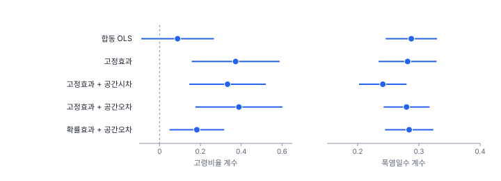

[목차](../README.md) · 이전: [34강 시공간 탐색](34-spatiotemporal-exploration.md) · 다음: [36강 베이지안 사고와 계층 모형](36-bayesian-hierarchical.md)

# 35강 시공간 모형 개요

> 앱 지원: ○ GeoStat에 시공간 모형이 없어 코드로 함 (자료 준비와 탐색은 33~34강의 앱 기능으로 함) · 읽는 시간 약 45분

## 이 강에서 얻는 것

- 시공간 모형의 큰 갈래(패널 회귀, 공간 패널, 건수 패널, 시공간 스캔, 시공간 지구통계, 계층 베이즈)와 각각이 답하는 질문을 앎
- 합동 OLS, 고정효과, 확률효과, 공간 패널 모형을 적합하고 계수를 비교해 읽을 수 있음
- 시공간 스캔 통계로 "어디서 언제" 높았는지를 검정하고, 모형에 따라 찾는 것이 다르다는 것을 앎

## 들어가는 질문

34강의 탐색은 마루구 남쪽에서 최근 출동이 늘었다는 신호를 주었음. 이것을 검정할 수 있는가? 8강의 단면 회귀는 지표온도를 통제하면 고령비율이 1%p 높은 동의 출동률이 0.367 높다고 했는데, 10년 자료로 보면 어떤가? 폭염일수가 하루 늘면 출동은 얼마나 늘어나는가?

9부의 마지막 강인 이 강은 시공간 모형의 지도를 그리고, 한빛시 패널에 몇 가지를 직접 적용함. 각 방법을 깊이 다루기보다 "어떤 질문에 무엇을 쓰는가"와 결과를 읽는 법에 집중함.

## 1. 시공간 모형의 지도

| 자료의 꼴 | 질문 | 방법 |
|---|---|---|
| 지역 단위 패널 | 설명변수의 효과는? | 패널 회귀(고정효과, 확률효과), 공간 패널 모형(공간시차·공간오차; Elhorst 2014) |
| 지역 단위 패널(건수) | 위험의 크기와 요인은? | 포아송·음이항 패널 회귀, 시공간 계층 베이즈(Knorr-Held 2000, 37강) |
| 지역 단위 패널 | 어디서 언제 높았는가? | 시공간 스캔 통계(Kulldorff 2001; Kulldorff 외 2005) |
| 시공간 점 사건 | 가까운 곳에서 가까운 때에 몰리는가? | Knox 검정(Knox 1964), 시공간 K 함수(Diggle 외 1995), 시공간 점 과정 모형 |
| 관측소·표면의 시계열 | 관측하지 않은 곳과 때의 값은? | 시공간 크리깅(Cressie & Huang 1999), 시공간 가우스 과정 |
| 지역 단위 시계열 | 다음 시점의 값은? | 시공간 자기회귀(STARIMA; Pfeifer & Deutsch 1980), 동적 공간 패널, 머신러닝(39강) |

공통된 어려움은 33강에서 본 두 가지 의존성, 곧 같은 단위의 반복 관측(시간)과 이웃끼리의 닮음(공간)을 함께 다루는 것임. 둘 다 무시하면 9강처럼 표준오차가 작게 나와 효과를 과신함.

## 2. 패널 회귀: 반복 관측 다루기

### 합동 OLS, 고정효과, 확률효과

- **합동 OLS**(pooled OLS): 1,500행을 독립 관측처럼 한꺼번에 회귀함. 동마다의 꾸준한 차이가 오차에 남음
- **고정효과**(fixed effects, FE): 동마다 자기 절편 αᵢ를 둠. 같은 계산으로, 각 동의 값에서 그 동의 열 해 평균을 뺀 **동 안 편차**끼리 회귀함. 시간에 따라 변하지 않는 모든 동의 특성(지표온도, 지형, 생활 방식)이 통제됨. 대신 동 안에서 변하는 부분만으로 계수를 추정함
- **확률효과**(random effects, RE): αᵢ를 평균 0인 확률변수로 보고, 동 사이와 동 안의 정보를 함께 씀. αᵢ가 설명변수와 상관이 없어야 일치 추정량임

$$
y_{it} = \alpha_i + \mathbf x_{it}^\top \boldsymbol\beta + \varepsilon_{it}
\quad\Rightarrow\quad
y_{it} - \bar y_{i} = (\mathbf x_{it} - \bar{\mathbf x}_{i})^\top \boldsymbol\beta + (\varepsilon_{it} - \bar\varepsilon_{i})
$$

### 손으로 해 보기: 두 동, 두 해

동 A의 (x, y)가 (10, 5), (12, 6)이고 동 B가 (20, 2), (22, 3)임.

- 합동 OLS: 네 점을 한꺼번에 회귀하면 기울기 −0.269. x가 큰 B가 y는 낮아서 음의 기울기가 나옴
- 고정효과: 동 평균을 빼면 A는 x −1, 1과 y −0.5, 0.5, B도 같음. 기울기 = [(−1)(−0.5) + (1)(0.5)] × 2 / [(1 + 1) × 2] = 2 / 4 = 0.5

동 안에서는 x가 늘면 y도 늘지만(0.5), 동 사이의 차이가 이를 거꾸로 덮었음(−0.269). 8강의 고령비율과 같은 구조임.

### 한빛시 패널

동별 출동률(1만 명당)을 고령비율과 폭염일수로 회귀했음.



| 모형 | 고령비율 (SE) | 폭염일수 (SE) | 공간 모수 |
|---|---|---|---|
| 합동 OLS | 0.0882 (0.0909) | 0.2876 (0.0214) | |
| 고정효과 | 0.3726 (0.1099) | 0.2816 (0.0242) | |
| 고정효과 + 공간시차 | 0.3331 (0.0956) | 0.2411 (0.0198) | ρ 0.1385 (0.0394) |
| 고정효과 + 공간오차 | 0.3886 (0.1088) | 0.2798 (0.0191) | λ 0.1406 (0.0394) |
| 확률효과 + 공간오차 | 0.1826 (0.0683) | 0.2841 (0.0201) | λ 0.1442 (0.0551) |

- **고령비율**: 합동 OLS(0.088)는 동 사이의 차이에 섞임. 고령 동은 대개 외곽의 시원한 동이라(8강) 고령의 효과가 덮임. 고정효과(0.373)는 지표온도를 넣지 않았는데도 8강에서 지표온도를 통제한 단면 회귀(0.367)와 비슷함. 동마다 변하지 않는 지표온도를 고정효과가 통제했기 때문임. 다만 고령비율의 동 안 표준편차는 1.25%p로 전체(5.98%p)의 5분의 1이라, 동 안의 변화만 쓰는 고정효과의 표준오차가 큼
- **표준오차**: 합동 OLS의 고령비율 표준오차는 보통 방식으로 0.0327이지만, 같은 동의 열 해를 한 묶음으로 보는 **군집 강건 표준오차**로는 0.0909로 2.8배임. 반복 관측을 독립으로 보면 효과를 과신함
- **폭염일수**: 모든 모형이 0.24~0.29로 비슷함. 폭염일수는 해마다 도시 전체에 하나인 값이라 동 사이의 차이와 섞일 일이 없음. 대신 사실상 열 개의 해로 추정하는 것이라, 같은 해에 함께 변한 다른 것(고령화 추세, 그해의 다른 사건)과 구별되지 않음. 그래서 연도 고정효과와 함께 넣을 수 없음
- **확률효과**(0.183)는 고정효과(0.389)와 크게 다름. 확률효과의 가정(동의 고유 수준이 고령비율과 상관없음)이 이 자료에서 성립하지 않는다는 신호이므로 고정효과를 씀. 이 비교를 정식으로 하는 것이 하우스만 검정인데, spreg의 공간 패널 하우스만 검정은 이 자료에서 음수(−5.92)를 주어 쓸 수 없었음. 두 추정량의 분산 차이가 양정치가 아닐 때 생기는 일임

## 3. 공간 패널 모형

24~26강의 공간시차·공간오차 모형을 패널로 넓힌 것임(Elhorst 2014). 고정효과와 함께 쓰면 동마다의 꾸준한 차이를 뺀 뒤에 남은 이웃끼리의 닮음을 다룸.

$$
y_{it} = \rho \sum_j w_{ij} y_{jt} + \alpha_i + \mathbf x_{it}^\top \boldsymbol\beta + \varepsilon_{it}
\qquad\text{또는}\qquad
y_{it} = \alpha_i + \mathbf x_{it}^\top \boldsymbol\beta + u_{it},\; u_{it} = \lambda \sum_j w_{ij} u_{jt} + \varepsilon_{it}
$$

- 패널 LM 검정(Anselin 외 2008): LM-lag 20.296(p < 0.001), LM-error 21.112(p < 0.001), 강건 LM-lag 6.253(p 0.012), 강건 LM-error 7.069(p 0.008). 넷 다 유의하고 두 강건 검정이 모두 유의해, 24강의 흐름으로는 어느 쪽이라고 가르기 어려움
- 이 검정들은 고정효과가 아니라 합동 OLS의 잔차로 계산함. 고정효과 잔차로 같은 식의 LM-error를 근사하면 15.73으로 여전히 큼
- spreg 1.9.1의 `panel_LMlag`는 분모의 T × tr(W′W + WW)를 tr(W′W + WW)²로 계산하는 오류가 있어 3.519를 줌. 위의 20.296은 Anselin 외(2008)의 식으로 직접 계산한 값임(`book/fig-src/35.py`). 강건 검정과 LM-error는 spreg의 값과 직접 계산이 같음
- 고정효과 + 공간오차의 λ = 0.141, 고정효과 + 공간시차의 ρ = 0.139로 둘 다 작지만 유의함. 고정효과 모형의 잔차는 해마다 Moran's I가 −0.098~0.198(평균 0.046)로 흔들림
- 공간시차 모형의 계수는 25강처럼 그대로 한계 효과가 아님. 폭염일수의 총 효과는 0.2411 / (1 − 0.1385) ≈ 0.280으로, 공간오차 모형의 0.280과 같아짐

공간 모수를 넣어도 고령비율과 폭염일수의 결론은 거의 바뀌지 않음. 33강에서 본 것처럼 고정효과를 빼고 나면 남은 공간·시간 의존이 약하기 때문임. 앞 해의 값(yᵢ,ₜ₋₁)이나 앞 해 이웃의 값을 넣는 **동적 공간 패널**은 해에서 해로 이어지는 동역학이 있을 때 씀. 이 자료에서는 33강의 앞뒤 해 상관(−0.057)으로 보아 필요성이 낮음.

## 4. 건수 자료: 포아송 패널

출동은 건수이므로, 27강처럼 건수를 포아송분포로 보고 인구를 노출량(오프셋)으로 넣는 모형이 더 알맞음. 동마다 더미(고정효과)를 넣으면 다음과 같음.

$$
\log E[\text{건수}_{it}] = \log(\text{인구}_{it}) + \alpha_i + \beta_1 \text{고령비율}_{it} + \beta_2 \text{폭염일수}_t
$$

- 고령비율 0.0508(SE 0.0066): 같은 동에서 고령비율이 1%p 오르면 출동이 5.2% 늘어남
- 폭염일수 0.0270(SE 0.0012): 폭염일수가 하루 많은 해에 출동이 2.7% 많음. 33강의 도시 전체 기술(2.9%)과 비슷함
- 피어슨 과산포 지수 0.945로 과산포는 없음. 과산포가 크면 음이항 모형이나 준포아송 표준오차를 씀

포아송 모형의 계수는 비율(%)로 읽으므로, 출동률이 낮은 동과 높은 동에 같은 "몇 %"를 적용함. 선형 모형의 계수(1만 명당 몇 건)와는 해석의 틀이 다름. 작은 동의 큰 흔들림도 포아송 우도가 알아서 덜 믿음(14강의 작은 수 문제).

## 5. 시공간 스캔 통계

**시공간 스캔 통계**(space-time scan statistic; Kulldorff 2001)는 15강의 공간 스캔 통계를 원기둥으로 넓힘. 원기둥의 밑면은 어떤 동을 중심으로 가까운 동을 차례로 넣은 원이고, 높이는 연속한 몇 해의 기간임. 모든 원기둥에서 "안이 밖보다 높다"의 가능도비를 구해 가장 큰 것을 가장 가능성 높은 군집으로 삼고, 몬테카를로로 유의성을 검정함.

$$
\text{LLR} = c \ln\frac{c}{e} + (C - c)\ln\frac{C - c}{C - e}, \quad c > e
$$

c는 원기둥 안의 관측 건수, e는 귀무가설 아래 기대 건수, C는 전체 건수임.

### 손으로 해 보기

원기둥 안의 관측이 30건, 기대가 18건, 전체가 1,000건이면 LLR = 30 ln(30/18) + 970 ln(970/982) = 15.325 − 11.926 = 3.398임. 상대위험(안의 관측/기대 ÷ 밖의 관측/기대)은 (30/18) / (970/982) = 1.687임. 이 값이 큰지는 귀무가설 아래 자료를 수백 번 만들어 각각의 최대 LLR과 비교해 정함.

### 두 가지 기대값

기대 건수를 어떻게 정하느냐에 따라 찾는 군집이 다름.

- **시간 보정 포아송 모형**: 해마다 도시 전체의 출동률 × 동의 인구. 그해의 도시 평균보다 높은 "어디서 언제"를 찾음. 늘 높은 곳(순수한 공간 군집)도 잡힘
- **시공간 순열 모형**(Kulldorff 외 2005): 동의 열 해 합계 × 그해의 전체 합계 / 전체. 동마다의 평소 수준과 해마다의 수준을 모두 기대값에 넣어, "그 동의 평소에 비해 특정 기간에 늘어난 곳"(시공간 상호작용)만 찾음. 인구 자료가 없어도 됨

한빛시 패널에서 원기둥을 인구 10% 이하, 기간 5년 이하로 두고 몬테카를로 999회로 검정했음.


| 모형 | 군집 | 기간 | 관측 / 기대 | 상대위험 | p |
|---|---|---|---|---|---|
| 시간 보정 포아송 | 마루15~21동 (7개) | 2021~2025 | 820 / 546.8 | 1.54 | 0.001 |
| | 다솜23동 (1개) | 2018~2022 | 42 / 4.9 | 8.60 | 0.001 |
| | 다솜7·8·12·14동 (4개) | 2016~2020 | 228 / 144.8 | 1.59 | 0.001 |
| 시공간 순열 | 누리13·16·26동 (3개) | 2023~2025 | 171 / 126.5 | 1.36 | 0.165 |

- 포아송 모형은 마루구 남쪽의 2021~2025년을 가장 가능성 높은 군집으로 찾음. 34강의 탐색(산발·새로운 핫스팟, Gi* 증가)과 맞음. 기간이 5년 이하로 제한되어 있으므로, 이 곳이 열 해 내내 같았다면 앞쪽 기간이 뽑힐 수도 있었음. 뒤쪽 다섯 해가 뽑힌 것은 최근에 더 높았다는 뜻임
- 다솜23동(2025년 인구 1,013명)은 한 동만으로 2018~2022년에 기대의 8.6배임. 34강의 과거 핫스팟과 같은 지역임. 다솜7·8·12·14동은 앞쪽 다섯 해에 높았던 곳이고, 그 가운데 다솜7동은 34강에서 Gi*가 유의하게 줄어든 동임
- 시공간 순열 모형에서는 유의한 군집이 없었음. 동마다의 평소 수준을 기대값에 넣으면 마루구 남쪽의 최근 증가도 그 동의 열 해 평균에 이미 일부 들어가 있어 "평소보다 크게 늘었다"고 할 만큼은 아님. 상호작용을 찾는 순열 모형은 검출력이 낮음

스캔 통계의 결과는 원기둥의 모양(원), 크기 상한, 기간 상한, 기대값의 모형에 따라 달라짐. 이 설정들을 미리 정하고 보고함. SaTScan(Kulldorff)이 표준 도구이고, R의 rsatscan과 scanstatistics 패키지가 있음.

## 6. 시공간 지구통계와 계층 베이즈

### 시공간 공분산과 크리깅

관측소에서 매일 잰 기온처럼 연속 표면의 시계열이면, 21~22강의 베리오그램과 크리깅을 시공간으로 넓힘. 핵심은 공간 거리 h와 시간 차 u에 대한 공분산 C(h, u)를 정하는 것임.

- **분리형**(separable): C(h, u) = C_s(h) C_t(u). 공간 구조와 시간 구조 사이에 상호작용이 없다고 봄. 계산이 쉬움
- **곱-합형**(product-sum; De Cesare 외 2001): k₁C_s(h) C_t(u) + k₂C_s(h) + k₃C_t(u)(k는 음이 아닌 상수)의 꼴로 조금 더 유연함
- **비분리형**(nonseparable; Cressie & Huang 1999; Gneiting 2002): 바람에 실려 이동하는 오염처럼 공간과 시간이 얽힌 구조를 담음

한빛시 자료에는 관측소의 시계열이 없어 이 강에서는 적용하지 않음. R의 gstat(`variogramST`, `krigeST`)이 대표 도구임.

### 시공간 계층 베이즈

지역 단위 건수를 다루는 가장 유연한 틀은 계층 베이즈 모형임. 포아송 우도에 공간 랜덤효과(이웃끼리 닮은 동 효과, 37강의 BYM), 시간 랜덤효과(해에서 해로 매끄럽게 변하는 추세), 시공간 상호작용 효과를 함께 넣음(Bernardinelli 외 1995; Knorr-Held 2000). 크노르-헬트(Knorr-Held 2000)는 상호작용을 네 가지(독립, 시간 구조만, 공간 구조만, 둘 다)로 나눴음. 작은 동의 흔들림을 이웃과 앞뒤 해의 정보로 평활하면서 불확실성을 사후분포로 줌. 10부(36~37강)에서 다룸.

## 7. 무엇을 언제 쓰나

1. **질문을 먼저 정함**: 효과의 크기인가(패널 회귀), 어디서 언제인가(스캔, 34강 탐색), 지도화와 예측인가(계층 베이즈, 시공간 크리깅)
2. **자료의 꼴을 확인함**: 지역 패널, 점 사건, 관측소 시계열
3. **반복 관측을 다룸**: 최소한 동 단위 군집 강건 표준오차. 시간에 따라 변하지 않는 혼란 변수가 걱정되면 고정효과
4. **공간 의존을 점검함**: 패널 LM 검정(합동 OLS 잔차 기반이라는 점에 유의), 고정효과 잔차의 연도별 Moran's I. 필요하면 공간 패널이나 공간 랜덤효과
5. **건수면 건수 모형**: 포아송·음이항, 오프셋
6. **시간 변수의 식별을 따짐**: 해마다 하나인 변수(폭염일수)는 사실상 해의 수만큼의 관측으로 추정됨

## 해 보기

GeoStat에는 시공간 모형이 없으므로 33~34강에서 만든 자료를 코드로 이어 분석함. 앱에서는 결과를 확인하는 지도를 그릴 수 있음. 예를 들어 아래 코드의 포아송 모형으로 계산한 동별 고정효과(αᵢ)를 CSV로 저장해 넓은 형태 자료에 붙이면, 동마다의 "열 해 동안 꾸준한 위험 수준"을 지도로 볼 수 있음.

### 코드로: 공간 패널과 포아송 고정효과

```python
import contextlib
import io

import geopandas as gpd
import numpy as np
import spreg
import statsmodels.api as sm
from libpysal.weights import Queen

p = gpd.read_file("book/data/hanbit_dong_panel.gpkg")
p["출동률"] = p["출동건수"] / p["인구"] * 10000
p["고령비율"] = p["고령인구"] / p["인구"] * 100
p = p.sort_values(["연도", "동코드"]).reset_index(drop=True)   # spreg 패널은 연도별로 쌓은 순서를 씀
w = Queen.from_dataframe(p[p["연도"] == 2025].reset_index(drop=True), use_index=False)
w.transform = "r"
y = p[["출동률"]].to_numpy()
X = p[["고령비율", "폭염일수"]].to_numpy()

# 공간 패널: 동 고정효과 + 공간오차, 패널 LM 검정
with contextlib.redirect_stdout(io.StringIO()):
    fe_err = spreg.Panel_FE_Error(y, X, w, name_x=["고령비율", "폭염일수"])
print({k: round(float(v), 4) for k, v in zip(fe_err.name_x, fe_err.betas.ravel())})
print(f"패널 LM-error {spreg.panel_LMerror(y, X, w)[0]:.2f}, 강건 LM-lag {spreg.panel_rLMlag(y, X, w)[0]:.2f}")

# 포아송 고정효과: 건수를 동 더미와 함께, 인구를 노출량(오프셋)으로
Xp = np.column_stack([p[["고령비율", "폭염일수"]].to_numpy(), np.eye(150)[p["동코드"].astype("category").cat.codes]])
glm = sm.GLM(p["출동건수"].to_numpy(), Xp, family=sm.families.Poisson(), offset=np.log(p["인구"].to_numpy())).fit()
for j, name in enumerate(["고령비율", "폭염일수"]):
    print(f"{name}: {glm.params[j]:.4f} (SE {glm.bse[j]:.4f}), 1 단위당 {np.expm1(glm.params[j]):.1%}")
```

- 확인: 고령비율 0.3886, 폭염일수 0.2798, lambda 0.1406. 패널 LM-error 21.11, 강건 LM-lag 6.25. 포아송 고정효과 고령비율 0.0508(5.2%), 폭염일수 0.0270(2.7%)
- 더 해 보기: `Panel_FE_Lag`, `Panel_RE_Error`로 바꿔 2절의 표를 재현함. 시공간 스캔 통계는 `book/fig-src/35.py`의 `scan()` 함수가 원기둥을 만들고 몬테카를로 검정을 하는 과정을 numpy로 구현한 것임. 실무에서는 SaTScan을 씀

## 헷갈리는 쌍

- **고정효과 vs 확률효과**: 동마다의 고유 수준을 추정할 모수로 보는가(어떤 상관도 허용), 확률변수로 보는가(설명변수와 상관없어야 함)
- **보통 표준오차 vs 군집 강건 표준오차**: 관측을 독립으로 보는가, 같은 동의 반복 관측을 한 묶음으로 보는가
- **선형 패널 vs 포아송 패널**: 1만 명당 몇 건의 차이 대 몇 %의 차이. 건수 자료에는 뒤의 것이 알맞음
- **시간 보정 포아송 스캔 vs 시공간 순열 스캔**: 그해의 도시 평균보다 높은 곳과 때 대 그 동의 평소보다 특정 기간에 높아진 곳
- **분리형 vs 비분리형 시공간 공분산**: 공간과 시간의 구조가 따로 곱해지는가, 얽혀 있는가

## 흔한 실수와 심사 지적

- **패널을 합동 OLS로만 분석하고 보통 표준오차를 보고함**
  - 지적: "같은 지역의 반복 관측을 고려했습니까?"
  - 대응: 군집 강건 표준오차, 고정효과나 확률효과 모형을 쓰고 결과를 비교함
- **고정효과 모형에서 시간에 따라 변하지 않는 변수의 효과를 추정하려 함**
  - 대응: 고정효과는 그런 변수를 통제할 뿐 효과를 추정하지 못함. 확률효과나 혼합 모형, 단면 비교를 씀
- **연도마다 하나인 변수(기후, 정책)의 효과를 1,500개 관측의 정밀도로 보고함**
  - 대응: 사실상 연도 수만큼의 정보라는 점을 밝히고, 같은 시기의 다른 추세와 구별되지 않는 한계를 적음
- **시공간 스캔의 설정(크기, 기간 상한, 모형)을 결과를 보고 고름**
  - 대응: 설정을 미리 정하고, 다른 설정의 결과도 함께 보고함
- **스캔 통계가 찾은 원기둥을 정확한 경계로 해석함**
  - 대응: 원기둥은 원 모양 가정에서 나온 근사임. 군집의 핵심 위치와 기간 정도로 읽음

## 보고서에는 이렇게 씀

> 2016~2025년 150개 행정동의 출동 건수를 인구를 노출량으로 하는 포아송 고정효과 모형(행정동 더미)으로 분석하였다. 행정동 내에서 고령비율이 1%p 높아지면 출동이 5.2%(95% 신뢰구간 3.9~6.6%) 증가하였고, 폭염일수가 하루 많은 해에는 2.7%(2.5~3.0%) 증가하였다(과산포 지수 0.95). 출동률을 종속변수로 한 선형 패널 모형에서도 행정동 고정효과를 넣으면 고령비율의 계수가 합동 OLS의 0.088에서 0.373으로 커졌고, 공간오차 고정효과 모형의 공간오차 계수(λ)는 0.141로 작았다. 시간 보정 포아송 시공간 스캔 통계(원기둥 인구 10% 이하, 기간 5년 이하, 몬테카를로 999회)에서 가장 가능성 높은 군집은 마루구 남쪽 7개 동의 2021~2025년이었다(상대위험 1.54, p = 0.001). 다만 폭염일수의 효과는 열 해의 연도 간 변동으로 추정된 것이어서 같은 기간의 다른 추세와 구별되지 않는다.

적어야 할 항목은 다음과 같음.

- 자료의 기간과 단위, 모형(합동, 고정효과, 확률효과, 공간 패널, 건수 모형)과 그 선택 이유
- 표준오차의 종류(군집 강건, 최대우도)
- 공간 의존의 점검(패널 LM, 잔차 Moran's I)과 공간 모수
- 시간 변수의 식별에 관한 한계
- 스캔 통계의 설정(모형, 원기둥 크기·기간 상한, 반복 수)과 결과

## 요약

- 시공간 모형은 질문(효과, 어디서 언제, 지도화·예측)과 자료의 꼴(지역 패널, 점 사건, 관측소 시계열)에 따라 고름
- 고정효과는 시간에 따라 변하지 않는 동의 특성을 모두 통제함. 한빛시에서 고령비율의 계수가 합동 OLS 0.088에서 고정효과 0.373으로 바뀌었고, 반복 관측을 무시한 표준오차는 2.8배 작았음
- 공간 패널 모형에서 고정효과 뒤의 공간 의존은 작았고(λ 0.141, ρ 0.139) 결론을 바꾸지 않았음
- 포아송 고정효과 모형에서 고령비율 1%p당 5.2%, 폭염일수 하루당 2.7%의 증가가 추정됨. 폭염일수의 효과는 연도 수만큼의 정보로 추정된다는 한계가 있음
- 시공간 스캔 통계(시간 보정 포아송)는 마루구 남쪽의 2021~2025년을 가장 가능성 높은 군집으로 찾았고, 평소 수준 대비 변화를 찾는 순열 모형에서는 유의한 군집이 없었음

## 핵심 용어

| 한글 | 영문 | 비고 |
|---|---|---|
| 합동 OLS | Pooled OLS | |
| 고정효과 / 확률효과 | Fixed / Random Effects | |
| 동 안 편차 | Within Transformation | |
| 군집 강건 표준오차 | Cluster-robust Standard Error | |
| 하우스만 검정 | Hausman Test | 고정효과 대 확률효과 |
| 공간 패널 모형 | Spatial Panel Model | Elhorst 2014 |
| 동적 공간 패널 | Dynamic Spatial Panel | |
| 시공간 스캔 통계 | Space-time Scan Statistic | Kulldorff 2001 |
| 시공간 순열 모형 | Space-time Permutation Model | Kulldorff 외 2005 |
| 분리형 공분산 | Separable Covariance | |
| 시공간 크리깅 | Space-time Kriging | |
| 시공간 상호작용 | Space-time Interaction | Knorr-Held 2000 |

## 원전과 더 읽을거리

**원전**

- Kulldorff, M. (2001). Prospective time periodic geographical disease surveillance using a scan statistic. *Journal of the Royal Statistical Society: Series A*, 164(1), 61–72.
- Kulldorff, M., Heffernan, R., Hartman, J., Assunção, R., & Mostashari, F. (2005). A space–time permutation scan statistic for disease outbreak detection. *PLoS Medicine*, 2(3), e59.
- Anselin, L., Le Gallo, J., & Jayet, H. (2008). Spatial panel econometrics. In L. Mátyás & P. Sevestre (Eds.), *The Econometrics of Panel Data* (3rd ed., pp. 625–660). Springer.
- Knorr-Held, L. (2000). Bayesian modelling of inseparable space-time variation in disease risk. *Statistics in Medicine*, 19(17–18), 2555–2567.
- Cressie, N., & Huang, H.-C. (1999). Classes of nonseparable, spatio-temporal stationary covariance functions. *Journal of the American Statistical Association*, 94(448), 1330–1340.
- Knox, E. G. (1964). The detection of space-time interactions. *Journal of the Royal Statistical Society: Series C*, 13(1), 25–30.

**더 읽을거리**

- Elhorst, J. P. (2014). *Spatial Econometrics: From Cross-Sectional Data to Spatial Panels*. Springer.
- Wooldridge, J. M. (2010). *Econometric Analysis of Cross Section and Panel Data* (2nd ed.). MIT Press. 10장(고정효과와 확률효과)
- Gneiting, T. (2002). Nonseparable, stationary covariance functions for space–time data. *Journal of the American Statistical Association*, 97(458), 590–600.
- De Cesare, L., Myers, D. E., & Posa, D. (2001). Estimating and modeling space–time correlation structures. *Statistics & Probability Letters*, 51(1), 9–14.
- Bernardinelli, L., Clayton, D., Pascutto, C., Montomoli, C., Ghislandi, M., & Songini, M. (1995). Bayesian analysis of space–time variation in disease risk. *Statistics in Medicine*, 14(21–22), 2433–2443.
- Diggle, P. J., Chetwynd, A. G., Häggkvist, R., & Morris, S. E. (1995). Second-order analysis of space-time clustering. *Statistical Methods in Medical Research*, 4(2), 124–136.
- Pfeifer, P. E., & Deutsch, S. J. (1980). A three-stage iterative procedure for space-time modeling. *Technometrics*, 22(1), 35–47.
- Wikle, C. K., Zammit-Mangion, A., & Cressie, N. (2019). *Spatio-Temporal Statistics with R*. Chapman & Hall/CRC.

## 연습

1. 손계산의 동 B를 (20, 4), (22, 3)으로 바꾸면 고정효과 기울기는 얼마인가? 합동 OLS의 기울기는 어느 쪽으로 바뀌는가?

2. 고정효과 모형에서 고령비율의 계수(0.373)의 표준오차(0.110)가 합동 OLS의 보통 표준오차(0.033)보다 훨씬 큼. 고정효과가 "덜 정확한" 모형이라는 뜻인가?

3. 어떤 연구자가 "동의 면적이 넓을수록 출동률이 높은가"를 고정효과 모형으로 검정하려 함. 무엇이 문제인가?

4. 시간 보정 포아송 스캔에서는 마루구 남쪽이 유의한 군집으로 나왔지만, 시공간 순열 스캔에서는 유의한 군집이 없었음. 두 결과는 모순인가?

5. 폭염일수의 계수(포아송 0.027)를 근거로 "기후 변화로 폭염일수가 열흘 늘면 출동이 약 31% 늘어날 것"이라고 예측하려 함. 이 예측에 어떤 가정이 들어 있는가? 두 가지 이상 드시오.

<details>
<summary>해답</summary>

1. B의 동 평균을 빼면 x −1, 1과 y 0.5, −0.5가 됨. A는 그대로 x −1, 1과 y −0.5, 0.5. Σ(x 편차 × y 편차) = 0.5 + 0.5 − 0.5 − 0.5 = 0이므로 고정효과 기울기는 0. 동 A에서는 늘고 동 B에서는 줄어 동 안의 평균적인 관계가 없음. 합동 OLS는 네 점 (10, 5), (12, 6), (20, 4), (22, 3)으로 계산하면 −0.192로, B의 y 평균이 2.5에서 3.5로 높아진 만큼 −0.269보다 덜 가파른 음의 기울기가 됨. 두 방법이 다른 정보(동 사이 대 동 안)를 쓴다는 점이 그대로 드러남.

2. 아님. 합동 OLS의 보통 표준오차(0.033)는 반복 관측을 독립으로 본 탓에 너무 작게 나온 것이고, 군집 강건 표준오차로는 0.091임. 고정효과의 표준오차가 큰 것은 동 안의 변화(표준편차 1.25%p)만 쓰기 때문이고, 그 대가로 시간에 따라 변하지 않는 혼란 변수(지표온도 등)를 모두 통제함. 합동 OLS는 표준오차가 작더라도 치우친 추정값(0.088)을 줌. 정확성은 치우침과 분산을 함께 봐야 함.

3. 동의 면적은 열 해 동안 변하지 않으므로 동 고정효과와 완전히 겹침. 고정효과 모형은 이런 변수의 계수를 추정할 수 없음(동 안 편차가 모두 0). 면적처럼 변하지 않는 변수의 효과는 단면 비교, 확률효과·혼합 모형, 또는 고정효과를 추정한 뒤 그 효과를 면적에 회귀하는 방법으로 봐야 하고, 이때는 다른 동 특성의 혼란을 다시 고려해야 함.

4. 모순이 아님. 두 모형은 다른 질문을 함. 시간 보정 포아송은 "그해의 도시 평균보다 높은 곳과 때"를 찾으므로 마루구 남쪽이 최근 다섯 해에 높았다는 것을 잡음. 시공간 순열은 동마다의 열 해 평균도 기대값에 넣어 "그 동의 평소보다 특정 기간에 높아진 곳"만 찾음. 마루구 남쪽은 평소에도 높은 편이었고 최근의 증가가 그 평소 수준에 비해 검출될 만큼 크지 않았던 것임. 순열 모형은 이런 상호작용에 대한 검출력이 낮다는 점도 함께 적음.

5. 예: (1) 열 해 동안의 연도 간 관계가 미래의 훨씬 더 더운 해에도 그대로 이어진다는 외삽 가정(관측된 폭염일수는 최대 35일로, 2018년 한 해뿐임). (2) 폭염일수의 계수가 같은 시기의 다른 추세(고령화, 보고 체계 변화)와 섞이지 않았다는 가정. (3) 인구 구성과 냉방·쉼터 같은 적응 조건이 지금과 같다는 가정. (4) 로그 선형 관계라 열흘이면 exp(0.27) − 1 ≈ 31%로 곱해서 늘어난다는 함수 형태의 가정. 예측에는 이 가정들과 불확실성 구간을 함께 적어야 함.

</details>

---

[목차](../README.md) · 이전: [34강 시공간 탐색](34-spatiotemporal-exploration.md) · 다음: [36강 베이지안 사고와 계층 모형](36-bayesian-hierarchical.md)
