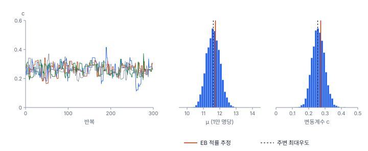

[목차](../README.md) · 이전: [35강 시공간 모형 개요](35-spatiotemporal-models.md) · 다음: [37강 질병 지도와 CAR 모형](37-disease-mapping-car.md)

# 36강 베이지안 사고와 계층 모형

> 앱 지원: ◐ EB 평활(사후 평균)과 사후 표준편차는 앱에서(비율 지도 · EB 보정, 계산 필드), 사후 구간·초과 확률·MCMC는 코드로 함 · 읽는 시간 약 45분

## 이 강에서 얻는 것

- 사전분포, 가능도, 사후분포의 관계를 알고, 포아송-감마 켤레로 사후분포를 손으로 계산할 수 있음
- 14강의 EB 평활이 "자료에서 추정한 사전분포를 쓴 베이즈 사후 평균"이라는 것을 확인함
- 계층 모형의 세 층(자료, 과정, 모수)을 알고, 경험적 베이즈와 완전 베이즈의 차이를 앎
- MCMC의 원리와 진단(흔적 그림, R-hat, 유효 표본 크기)을 알고, INLA가 무엇인지 앎
- 수축 추정이 평균적으로 오차를 줄이지만 극단의 작은 지역에서는 참값을 놓친다는 것을 모의로 확인함

## 들어가는 질문

다솜23동은 인구 1,013명에 출동이 5건으로, 원비율이 1만 명당 49.36임. 도시 전체(11.73)의 네 배임. 이 동의 참 출동률이 도시 평균보다 높을 확률은 얼마인가?

7강의 빈도주의 통계는 이 질문에 바로 답하지 못함. 참 출동률은 고정된 하나의 값이고, 확률은 자료가 만들어지는 과정에 붙기 때문임. 정확 포아송 95% 신뢰구간은 16.03~115.19로, "이런 방법으로 구간을 만들면 100번 가운데 적어도 95번은 참값을 포함한다"는 뜻임. 베이즈 통계는 참 출동률 자체를 불확실한 양으로 보고 확률분포로 나타냄. 그러면 "다솜23동의 참 출동률이 11.73보다 클 확률은 0.81"처럼 질문에 그대로 답할 수 있음. 14강에서 만든 EB 평활 값 14.80도 이 틀에서 다시 보면 뜻이 또렷해짐.

## 1. 베이즈 정리: 사전, 가능도, 사후

모수 θ(예: 한 동의 참 출동률)에 대해 자료를 보기 전의 믿음을 **사전분포** p(θ)로, 자료 y가 θ에서 나올 가능성을 **가능도** p(y | θ)로 나타냄. 둘을 곱하면 자료를 본 뒤의 믿음인 **사후분포**가 됨.

$$
p(\theta \mid y) = \frac{p(y \mid \theta)\, p(\theta)}{p(y)} \;\propto\; p(y \mid \theta)\, p(\theta)
$$

분모 p(y)는 θ와 상관없는 상수라 사후분포의 모양은 "가능도 × 사전분포"로 정해짐. 사후분포에서 평균이나 중앙값을 점추정값으로 쓰고, 2.5%와 97.5% 분위수 사이를 **95% 신용구간**(credible interval)으로 씀. 신용구간은 "θ가 이 안에 있을 확률이 95%"라고 읽음.

사전분포는 주관적이라는 비판을 받지만, 공간통계에서는 사전분포를 자료로부터 정하거나(경험적 베이즈) 여러 지역이 공유하는 분포로 두어(계층 모형), 지역끼리 정보를 빌려 쓰는 장치로 씀. 14강의 작은 수 문제가 바로 이 장치가 필요한 곳임.

## 2. 포아송-감마 켤레

동 i의 출동 건수 yᵢ가 인구 nᵢ(만 명)와 참 출동률 θᵢ(1만 명당)에 따라 포아송분포를 따르고, θᵢ의 사전분포가 감마분포라고 둠.

$$
y_i \mid \theta_i \sim \text{Poisson}(n_i \theta_i), \qquad \theta_i \sim \text{Gamma}(a, b)
\quad\Rightarrow\quad
\theta_i \mid y_i \sim \text{Gamma}(a + y_i,\; b + n_i)
$$

감마분포 Gamma(a, b)의 평균은 a/b, 분산은 a/b²임. 사후분포가 사전분포와 같은 감마 꼴로 나오는 이런 짝을 **켤레**(conjugate)라 함. 갱신은 덧셈뿐임. 모양 a에 건수를, 비율 b에 인구를 더함. 그래서 사전분포를 "인구 b만 명에 a건이 있었던 가상의 동"으로 읽을 수 있음.

사후 평균을 풀어 쓰면 다음과 같음.

$$
E[\theta_i \mid y_i] = \frac{a + y_i}{b + n_i} = w_i \frac{y_i}{n_i} + (1 - w_i) \frac{a}{b}, \qquad w_i = \frac{n_i}{b + n_i}
$$

원비율과 사전 평균의 가중평균이고, 가중치는 인구가 클수록 1에 가까움. 14강의 EB 가중치 α̂ / (α̂ + β̂/nᵢ)에 b = β̂/α̂을 넣으면 nᵢ/(b + nᵢ)와 같아짐. **EB 평활은 사전분포의 평균을 β̂, 분산을 α̂로 맞춘 감마 사전분포의 사후 평균**임.

### 손으로 해 보기: 14강의 EB를 감마 사전분포로

14강에서 β̂ = 11.7333, α̂ = 10.2937이었음. 감마분포의 평균 a/b = β̂, 분산 a/b² = α̂로 맞추면 다음과 같음.

- b = β̂/α̂ = 11.7333 / 10.2937 = 1.1399
- a = β̂²/α̂ = 11.7333² / 10.2937 = 13.3744
- 사전분포는 "인구 11,399명에 13.37건이 있었던 동"과 같은 무게임. 사전 95% 구간은 6.31~18.81, 동 사이 변동계수(표준편차 ÷ 평균) 1/√a = 0.273

이 사전분포로 세 동을 갱신함.

| 동 | 건수 | 인구 | 원비율 | 사후분포 | 사후 평균 | 95% 신용구간 | P(θ > 11.73) |
|---|---|---|---|---|---|---|---|
| 다솜23동 | 5 | 1,013 | 49.36 | Gamma(18.37, 1.2412) | 14.80 | 8.83~22.30 | 0.811 |
| 마루16동 | 31 | 10,506 | 29.51 | Gamma(44.37, 2.1905) | 20.26 | 14.74~26.64 | 0.999 |
| 누리12동 | 0 | 753 | 0.00 | Gamma(13.37, 1.2152) | 11.01 | 5.92~17.64 | 0.372 |

- 다솜23동: 사후 평균 (13.37 + 5) / (1.1399 + 0.1013) = 18.37 / 1.2412 = 14.80. 14강의 EB 평활 값과 같음. 가중치 0.1013 / 1.2412 = 0.082도 14강과 같음
- 150개 동 모두에서 사후 평균과 esda의 EB 평활 값이 같음(차이는 컴퓨터의 반올림 오차 수준인 10⁻¹⁵)
- 사후 표준편차는 √(a + y) / (b + n)임. 다솜23동은 √18.37 / 1.2412 = 3.45


들어가는 질문의 답은 0.811임. 다솜23동의 원비율은 마루16동보다 훨씬 높지만, 도시 평균보다 높을 확률은 마루16동(0.999)이 훨씬 큼. 5건으로는 "높다"는 증거가 약하기 때문임. 150개 동 가운데 원비율이 11.73보다 높은 동은 62개인데, P(θ > 11.73) ≥ 0.95인 동은 누리26동, 마루15동, 마루16동, 마루17동, 마루19동, 마루30동의 6개뿐임. 모두 인구 1만 명이 넘는 동이고, 14강의 EB 상위 6개와 같음.

이런 **초과 확률**(exceedance probability)은 질병 지도에서 많이 씀. 다만 150개 동에 0.95 문턱을 각각 적용하는 것은 12강의 다중검정과 비슷한 문제가 있음(계층 모형의 수축이 일부를 덜어 주지만 문턱을 고르는 문제는 남음). 베이즈 틀에서는 문턱을 "결정에 따르는 손실"로 정하는 것이 원칙이지만, 실무에서는 0.8이나 0.95 같은 관례를 쓰고 그 문턱을 밝힘(Richardson 외 2004).

## 3. 계층 모형: 동끼리 정보를 빌림

위의 모형은 세 층으로 되어 있음.

1. **자료 층**: yᵢ | θᵢ ~ Poisson(nᵢθᵢ). 관측이 참값에서 어떻게 나오는가
2. **과정 층**: θᵢ | a, b ~ Gamma(a, b). 동마다의 참값이 공통의 분포에서 나옴
3. **모수 층**: a, b의 값. 동 사이의 평균 수준과 흩어진 정도

이런 구조를 **계층 모형**(hierarchical model) 또는 다층 모형이라 함. 동마다 따로 추정하면(완전 분리) 작은 동이 불안정하고, 모든 동을 하나로 보면(완전 합동) 동 사이의 차이를 잃음. 계층 모형은 그 사이에서 자료가 정한 만큼 **부분 합동**(partial pooling)함. 작은 동은 다른 동의 정보를 많이 빌리고, 큰 동은 자기 자료를 주로 씀.

모수 층을 어떻게 다루느냐에 따라 두 갈래가 있음.

- **경험적 베이즈**(empirical Bayes, EB): a, b를 자료에서 한 값으로 추정해 그대로 씀. 14강은 클레이턴과 칼더(Clayton & Kaldor 1987)의 EB를 마셜(Marshall 1991)의 적률로 추정했음. 주변 가능도(θ를 적분해 없앤 가능도, 여기서는 음이항분포)를 최대화해도 됨(2형 최대우도). 한빛시에서는 적률 추정이 사전 평균 μ = a/b 11.73, 변동계수 c = 1/√a 0.273이고, 주변 최대우도가 μ 11.60, c 0.255로 조금 다름
- **완전 베이즈**(full Bayes, FB): a, b에도 사전분포(**초사전분포**, hyperprior)를 두고, 모든 미지수의 결합 사후분포를 구함. 초모수를 한 값으로 고정하지 않으므로 그 불확실성이 동별 사후분포에 반영됨

EB는 계산이 쉽고 지역이 많으면(수십 개 이상) 완전 베이즈와 결과가 비슷함. 지역이 적거나 초모수의 불확실성이 클 때는 EB의 구간이 너무 좁아질 수 있음.

## 4. MCMC: 사후분포에서 표본 뽑기

켤레가 아닌 모형(37강의 CAR 모형 등)은 사후분포를 식으로 풀 수 없음. 대신 사후분포에서 표본을 많이 뽑아 그 평균과 분위수로 요약함. **마르코프 연쇄 몬테카를로**(MCMC)는 다음 값이 현재 값에만 의존하는 연쇄를 만들어, 충분히 오래 돌리면 그 연쇄의 값들이 사후분포를 따르게 하는 방법임.

가장 단순한 **메트로폴리스 알고리즘**(Metropolis 외 1953)은 다음을 되풀이함.

1. 현재 값 θ 둘레에서 후보 θ*를 뽑음(예: θ* = θ + 작은 정규 난수)
2. 사후 밀도의 비 r = p(θ* | y) / p(θ | y)를 구함. 분모 p(y)가 약분되므로 "가능도 × 사전분포"만 있으면 됨
3. 확률 min(1, r)로 θ*로 옮기고, 아니면 θ에 머묾

### 한빛시의 완전 베이즈 모형

초모수를 μ = a/b(동 출동률의 평균 수준)와 c = 1/√a(동 사이 변동계수)로 바꿔, 다음 초사전분포를 두었음.

- log μ ~ 정규(log 10, 2²): 1만 명당 0.2건에서 500건까지를 다 허용하는 아주 넓은 분포
- c ~ 반정규(0, 1): 동 사이 차이가 0에 가까울 수도, 평균만큼 클 수도 있음

(log μ, log c)를 메트로폴리스로 뽑을 때는 θᵢ를 적분한 주변 가능도(음이항)를 썼고, 뽑힌 초모수마다 θᵢ를 사후분포 Gamma(a + yᵢ, b + nᵢ)에서 정확히 뽑았음. 체인 4개를 서로 다른 시작점에서 출발해 예열 2,000번 뒤 5,000번씩 모았음(`book/fig-src/36.py`).



### MCMC 진단

MCMC의 결과는 연쇄가 사후분포에 도달해 그 안을 고루 돌아다녔을 때만 믿을 수 있음. 세 가지를 확인함.

- **흔적 그림**(trace plot): 반복에 따른 값의 그림. 여러 체인이 시작점과 상관없이 같은 범위를 털처럼 오가면 좋음. 한 체인만 다른 곳에 머물거나 천천히 흘러가면 문제
- **R-hat**(Gelman & Rubin 1992; Vehtari 외 2021): 체인 사이의 흩어짐과 체인 안의 흩어짐을 비교함. 1에 가까워야 하고, 1.01 아래를 기준으로 씀. 각 체인을 반으로 나눠 계산하는 분할 R-hat이 표준임
- **유효 표본 크기**(ESS): 연쇄의 값들은 서로 상관이 있어, 20,000개를 뽑아도 독립 표본 20,000개만큼의 정보가 아님. 요약에 쓰려면 수백 개 이상(관례로 400)이 필요함

한빛시 모형은 μ의 R-hat 1.001(ESS 2,309), c의 R-hat 1.003(ESS 2,721)으로 문제가 없었음. 후보의 채택률은 0.39 안팎임. 채택률이 너무 높거나(후보가 너무 가까움) 너무 낮으면(후보가 너무 멂) 연쇄가 느리게 섞임.

### 완전 베이즈와 EB의 비교

| | μ | c | α = a/b² | 다솜23동 (95% 구간) | 마루16동 (95% 구간) |
|---|---|---|---|---|---|
| EB(적률) | 11.73 | 0.273 | 10.29 | 14.80 (8.83~22.30) | 20.26 (14.74~26.64) |
| 완전 베이즈 | 11.60 (10.82~12.40) | 0.259 (0.186~0.338) | 9.23 (4.64~15.34) | 14.37 (8.64~22.03) | 19.57 (14.06~26.43) |

- 동별 사후 평균은 두 방법이 거의 같음(상관 0.9999, 최대 차이 0.68). 지역이 150개라 초모수가 잘 정해지기 때문임
- 완전 베이즈의 동 사이 분산 α는 4.64~15.34로 불확실성이 큼. EB는 이 가운데 한 값(10.29)만 씀
- 완전 베이즈는 c의 사후 평균이 EB보다 조금 작아 조금 더 당김. 마루16동의 구간은 완전 베이즈가 0.48 넓고, 다솜23동은 오히려 조금 좁음. 초모수의 불확실성을 더하는 효과와 더 당기는 효과가 함께 작용함
- 초과 확률이 0.95 이상인 동은 EB 6개, 완전 베이즈 5개임. 누리26동이 빠졌음(조금 더 당겨져서). 문턱 근처의 판정은 방법에 따라 흔들림

### 사전분포를 바꾸면

초사전분포를 c ~ 균등(0, 5)로 바꿔도 c의 사후 평균은 0.259, 다솜23동의 사후 평균은 14.42로 거의 같았음. 자료가 충분하면 넓은 사전분포 사이의 선택은 결과를 바꾸지 않음. 그러나 c ~ 반정규(0, 0.05)처럼 "동 사이 차이가 거의 없다"는 강한 사전분포를 두면 c의 사후 평균이 0.159로 줄고, 동별 사후 평균의 범위가 7.59~19.57에서 9.49~15.87로 좁아짐. 사전분포가 자료와 다투면 결과가 바뀜. 그래서 사전분포를 밝히고 **민감도 분석**(다른 사전분포로 다시 적합)을 함께 보고함.

## 5. 수축은 왜 좋은가, 언제 나쁜가

평균 쪽으로 당긴 추정값이 각 동의 원비율보다 낫다는 것은 직관에 어긋나 보임. 다솜23동의 5건은 다솜23동의 자료인데, 왜 다른 동의 자료로 고치는가? 이것은 통계학에서 **스타인의 역설**로 알려진 현상임. 분산이 같고 알려진 독립 정규 평균 셋 이상을 함께 추정할 때, 적절한 양만큼 한 점 쪽으로 당긴 제임스-스타인 추정량은 참값이 무엇이든 각자의 표본 평균보다 오차 제곱합의 기댓값이 작음(당기는 점을 자료에서 추정하면 넷 이상; James & Stein 1961; Efron & Morris 1975). 계층 모형의 수축은 같은 생각을 포아송 자료로 넓힌 것임.

참값을 아는 모의로 확인함. 동마다 참 출동률을 위의 사전분포 Gamma(13.37, 1.14)에서 뽑고, 실제 동 인구로 포아송 건수를 만들어 원비율, EB, 완전 베이즈로 추정했음. 이것을 400번 했음.


| 추정량 | 평균제곱오차 (인구 1분위 → 4분위) | 전체 | 95% 구간 포함률 | 참 비율 상위 10%·인구 1분위의 포함률 |
|---|---|---|---|---|
| 원비율 | 62.24, 20.85, 11.73, 8.73 | 26.01 | 0.970 | 0.979 |
| EB | 8.92, 6.91, 5.69, 4.73 | 6.57 | 0.940 | 0.723 |
| 완전 베이즈 | 8.93, 6.90, 5.69, 4.73 | 6.56 | 0.946 | 0.754 |

- EB의 평균제곱오차는 원비율의 0.25배임. 인구가 가장 적은 4분의 1에서는 7분의 1로 줄었음
- 완전 베이즈의 구간은 EB보다 조금 넓어 포함률이 95%에 더 가까움(0.946 대 0.940). EB가 초모수의 불확실성을 무시한 몫임
- 그러나 **참 출동률이 정말 높은 작은 동**에서는 베이즈 구간이 참값을 4번에 1번꼴로 놓침. 평균 쪽으로 당기기 때문임. 포함률 95%는 "동 전체에 대한 평균"이지 "모든 동 하나하나"에 대한 보장이 아님

수축은 지도 전체의 정확도를 높이는 대신, 진짜 이상치를 평범하게 보이게 할 수 있음. 작은 지역의 진짜 위험을 찾는 것이 목적(감시)이면 원비율과 사건 수, 초과 확률을 함께 보고, 수축의 정도를 밝힘.

## 6. 계산법: MCMC, HMC, INLA

| 방법 | 원리 | 도구 | 특징 |
|---|---|---|---|
| 켤레 | 사후분포를 식으로 품 | 손계산 | 쓸 수 있는 모형이 적음 |
| 깁스·메트로폴리스 | 조건부 분포나 후보 채택으로 연쇄를 만듦 | WinBUGS, JAGS, NIMBLE | 범용. 고차원에서 느리게 섞임 |
| 해밀토니안 몬테카를로(HMC, NUTS) | 사후 밀도의 기울기를 따라 멀리 이동함 | Stan, PyMC, NumPyro | 고차원에서도 잘 섞임. 37강에서 씀 |
| INLA | 사후분포를 라플라스 근사로 계산함 | R-INLA | 매우 빠름. 잠재 가우스 모형에 한정 |

**INLA**(integrated nested Laplace approximation; Rue, Martino & Chopin 2009)는 "관측 ~ 잠재 가우스 장 + 몇 개의 초모수" 꼴의 모형에서 사후분포를 표본 없이 수치 근사로 구함. 37강의 BYM 모형, 시공간 모형, 연속 공간의 SPDE 모형(Lindgren 외 2011)이 모두 이 꼴이라 질병 지도와 공간 역학에서 널리 씀. 표준 구현이 R의 R-INLA라서, 이 책의 Python 코드에서는 PyMC나 Stan(cmdstanpy)으로 같은 모형을 MCMC로 적합함.

## 해 보기

GeoStat의 EB 평활이 곧 감마 사전분포의 사후 평균이므로, 사후 평균과 사후 표준편차까지는 앱에서 만들 수 있음. 사후 구간과 초과 확률은 감마분포의 분위수가 필요해 코드로 함.

1. 14강처럼 `hanbit_dong.gpkg`와 `hanbit_events.gpkg`를 열고 `hanbit_dong`에 **공간 분석 → 점 집계 (점 → 폴리곤)…** 메뉴로 `PT_CNT`를 만듦
2. **공간 분석 → 비율 지도 · EB 보정…** 메뉴에서 방법 **경험적 베이즈(EB) 평활**, 분자 `PT_CNT`, 분모 `인구`, 단위 **10,000당** 항목으로 실행함
   - 확인: `R_EB`의 다솜23동 14.80, 마루16동 20.26
3. **공간 분석 → 계산 필드 추가…** 메뉴로 사후 평균을 직접 계산함. 새 변수 이름 `사후평균`, 식 `` (13.3744 + `PT_CNT`) / (1.1399 + `인구` / 10000) ``
   - 확인: `R_EB`와 같은 값(다솜23동 14.80, 누리12동 11.01)
4. 같은 메뉴로 `사후SD` = `` sqrt(13.3744 + `PT_CNT`) / (1.1399 + `인구` / 10000) ``와 `가중치` = `` (`인구` / 10000) / (1.1399 + `인구` / 10000) ``를 만듦
   - 확인: 다솜23동 사후SD 3.45, 가중치 0.0816. 마루16동 사후SD 3.04, 가중치 0.4796
5. **+ 산점도** 단추로 x에 `인구`, y에 `가중치`를 놓음. 인구가 클수록 자기 자료를 더 믿는 곡선 인구/(11,399 + 인구)가 보임
6. `사후SD`를 분위수 5계급으로 칠해 `사후평균`의 지도와 나란히 봄. 사후 평균이 비슷해도 인구가 적은 동은 불확실성이 큼

### 코드로: 사후 구간, 초과 확률, 완전 베이즈(격자 근사)

```python
import geopandas as gpd
import numpy as np
from scipy import special, stats

dong = gpd.read_file("book/data/hanbit_dong.gpkg")
ev = gpd.read_file("book/data/hanbit_events.gpkg")
j = gpd.sjoin(ev, dong[["geometry"]], predicate="within")
y = j.groupby("index_right").size().reindex(dong.index, fill_value=0).to_numpy(float)
n = dong["인구"].to_numpy(float) / 1e4          # 만 명 단위 → 비율은 1만 명당

# 1) 14강 EB를 감마 사전분포로: a = β²/α, b = β/α
beta = y.sum() / n.sum()
s2 = (n * (y / n - beta) ** 2).sum() / n.sum()
alpha = s2 - beta / n.mean()
a, b = beta ** 2 / alpha, beta / alpha
A, B = a + y, b + n                               # 동마다 사후분포 Gamma(A, B)
dong["사후평균"] = A / B
dong["하한"], dong["상한"] = stats.gamma.ppf(0.025, A, scale=1 / B), stats.gamma.ppf(0.975, A, scale=1 / B)
dong["P초과"] = stats.gamma.sf(beta, A, scale=1 / B)   # P(θ > 도시 전체 비율)
print(f"a = {a:.2f}, b = {b:.3f}")
print(dong.loc[dong["동이름"].isin(["다솜23동", "마루16동"]), ["동이름", "사후평균", "하한", "상한", "P초과"]].round(3))
print("P초과 ≥ 0.95:", dong.loc[dong["P초과"] >= 0.95, "동이름"].tolist())

# 2) 완전 베이즈: 초모수(μ = a/b, c = 1/√a)에도 사전분포를 두고 격자에서 사후분포를 구함
u, v = np.meshgrid(np.log(beta) + np.linspace(-0.6, 0.6, 121), np.linspace(np.log(0.01), np.log(1.5), 161), indexing="ij")
ga = np.exp(-2 * v)
gb = ga / np.exp(u)
ll = (special.gammaln(ga[..., None] + y) - special.gammaln(ga[..., None]) - special.gammaln(y + 1)
      + ga[..., None] * np.log(gb[..., None] / (gb[..., None] + n)) + y * np.log(n / (gb[..., None] + n))).sum(-1)
lp = ll + stats.norm.logpdf(u, np.log(10), 2) + stats.halfnorm.logpdf(np.exp(v)) + v
w = np.exp(lp - lp.max())
w /= w.sum()
print(f"c 사후 평균 {(w * np.exp(v)).sum():.3f}, μ 사후 평균 {(w * np.exp(u)).sum():.2f}")
i = dong.index[dong["동이름"] == "다솜23동"][0]
print(f"다솜23동 완전 베이즈 사후 평균 {(w * (ga + y[i]) / (gb + n[i])).sum():.2f}")
```

- 확인: a = 13.37, b = 1.140. 다솜23동 14.804(8.827~22.301, P초과 0.811), 마루16동 20.258(14.741~26.638, 0.999). P초과 ≥ 0.95는 누리26동, 마루15·16·17·19·30동. 완전 베이즈 c 사후 평균 0.259, μ 11.61, 다솜23동 14.40(MCMC로는 14.37)
- 초모수가 둘뿐이라 격자로 충분함. 초모수가 많아지면 격자는 불가능해져 MCMC를 씀. `book/fig-src/36.py`의 `metropolis()`가 메트로폴리스를 직접 구현한 것임

## 헷갈리는 쌍

- **신뢰구간 vs 신용구간**: 구간을 만드는 방법이 참값을 포함하는 빈도(빈도주의) 대 참값이 구간 안에 있을 확률(베이즈)
- **가능도 vs 사후분포**: 자료가 θ의 각 값을 얼마나 지지하는가(θ의 확률분포가 아님) 대 자료와 사전분포를 합친 θ의 확률분포
- **경험적 베이즈 vs 완전 베이즈**: 초모수를 자료에서 한 값으로 추정해 고정함 대 초모수에도 사전분포를 두고 불확실성을 전파함
- **사전분포 vs 초사전분포**: 동별 θᵢ의 분포(과정 층) 대 그 분포의 모수(a, b)에 둔 분포(모수 층)
- **R-hat vs ESS**: 체인들이 같은 분포에 도달했는가 대 그 표본이 독립 표본 몇 개만큼의 정보인가

## 흔한 실수와 심사 지적

- **사전분포를 밝히지 않음**
  - 지적: "어떤 사전분포를 썼고, 결과가 그 선택에 민감합니까?"
  - 대응: 모든 사전분포와 초사전분포를 적고, 다른 사전분포로 다시 적합한 결과를 부록에 넣음
- **MCMC 진단 없이 결과를 보고함**
  - 대응: 체인 수, 예열·표본 수, R-hat, ESS, 발산(HMC)을 적고 흔적 그림을 확인함
- **사후 평균 지도만 제시함**
  - 대응: 사후 표준편차나 신용구간 폭, 초과 확률 지도를 함께 제시함. 같은 평균이라도 불확실성이 다름
- **수축한 값으로 "위험이 낮다"고 단정함**
  - 대응: 작은 지역의 사후 평균이 평균 근처인 것은 증거가 부족해서일 수 있음. 사건 수와 구간을 함께 보고함
- **신용구간을 신뢰구간처럼(또는 그 반대로) 해석함**
  - 대응: 베이즈 결과는 "확률 0.95로 이 범위에 있음"으로, 빈도주의 결과는 방법의 성질로 읽음

## 보고서에는 이렇게 씀

> 행정동별 출동률을 포아송-감마 계층 모형으로 추정하였다. 행정동 i의 출동 건수를 인구 nᵢ와 참 출동률 θᵢ의 포아송분포로, θᵢ를 공통의 감마분포로 두었다. 초모수는 평균 수준 μ와 행정동 간 변동계수 c로 모수화하고 log μ ~ N(log 10, 2²), c ~ 반정규(0, 1)의 약한 정보 사전분포를 주었다. 메트로폴리스 알고리즘으로 체인 4개를 각 7,000회(예열 2,000회) 반복하였고, 모든 초모수의 분할 R-hat은 1.01 미만, 유효 표본 크기는 2,000 이상이었다. 행정동 간 변동계수의 사후 평균은 0.26(95% 신용구간 0.19~0.34)이었다. 도시 전체 비율(1만 명당 11.73)을 넘을 사후 확률이 0.95 이상인 행정동은 마루구의 5개였고, 모두 인구 1만 명 이상이었다. 원비율이 가장 높은 다솜23동(인구 1,013명, 5건)의 사후 평균은 14.4(95% 신용구간 8.6~22.0)였고 초과 확률은 0.78이었다. 사전분포를 c ~ U(0, 5)로 바꾸어도 결과는 거의 같았다.

적어야 할 항목은 다음과 같음.

- 모형의 층(자료, 과정, 모수)과 각 분포
- 모든 사전분포·초사전분포와 그 선택 이유, 민감도 분석
- 계산 방법(켤레, MCMC, INLA)과 MCMC 설정·진단(체인, 반복, R-hat, ESS)
- 사후 요약(평균, 신용구간)과 초과 확률의 문턱
- EB를 썼다면 초모수 추정 방법(적률, 주변 최대우도)

## 요약

- 베이즈 통계는 모수를 확률분포로 나타내고, 사후분포 ∝ 가능도 × 사전분포로 갱신함. "참 출동률이 평균보다 높을 확률"에 바로 답함
- 포아송-감마 켤레에서 사후분포는 Gamma(a + y, b + n)임. 14강의 EB 평활은 사전분포를 Gamma(13.37, 1.14)로 둔 사후 평균과 같음. 다솜23동은 14.80(95% 8.83~22.30), 초과 확률 0.81
- 계층 모형은 동들이 공통 분포를 공유해 정보를 빌림. EB는 초모수를 고정하고, 완전 베이즈는 초모수의 불확실성도 전파함. 150개 동에서 두 방법의 사후 평균은 거의 같았음
- MCMC는 흔적 그림, R-hat(1.01 미만), ESS로 진단함. INLA는 잠재 가우스 모형을 빠르게 근사함
- 모의에서 수축 추정은 평균제곱오차를 원비율의 4분의 1로 줄였지만, 참 위험이 정말 높은 작은 동에서는 95% 구간이 참값을 4번에 1번꼴로 놓쳤음

## 핵심 용어

| 한글 | 영문 | 비고 |
|---|---|---|
| 사전분포 / 사후분포 | Prior / Posterior Distribution | |
| 가능도 | Likelihood | |
| 신용구간 | Credible Interval | |
| 켤레 사전분포 | Conjugate Prior | 포아송-감마 |
| 초과 확률 | Exceedance Probability | P(θ > 기준) |
| 계층 모형 | Hierarchical Model | 다층 모형 |
| 부분 합동 | Partial Pooling | |
| 초사전분포 | Hyperprior | |
| 경험적 베이즈 / 완전 베이즈 | Empirical / Full Bayes | |
| 주변 가능도 | Marginal Likelihood | 2형 최대우도 |
| 마르코프 연쇄 몬테카를로 | Markov Chain Monte Carlo (MCMC) | |
| 메트로폴리스 알고리즘 | Metropolis Algorithm | Metropolis 외 1953 |
| 흔적 그림 | Trace Plot | |
| R-hat | Potential Scale Reduction Factor | Gelman & Rubin 1992 |
| 유효 표본 크기 | Effective Sample Size (ESS) | |
| 해밀토니안 몬테카를로 | Hamiltonian Monte Carlo (HMC, NUTS) | Stan, PyMC |
| INLA | Integrated Nested Laplace Approximation | Rue 외 2009 |
| 스타인의 역설 | Stein's Paradox | 수축 추정 |

## 원전과 더 읽을거리

**원전**

- Clayton, D., & Kaldor, J. (1987). Empirical Bayes estimates of age-standardized relative risks for use in disease mapping. *Biometrics*, 43(3), 671–681.
- Marshall, R. J. (1991). Mapping disease and mortality rates using empirical Bayes estimators. *Journal of the Royal Statistical Society: Series C*, 40(2), 283–294.
- Metropolis, N., Rosenbluth, A. W., Rosenbluth, M. N., Teller, A. H., & Teller, E. (1953). Equation of state calculations by fast computing machines. *The Journal of Chemical Physics*, 21(6), 1087–1092.
- Gelman, A., & Rubin, D. B. (1992). Inference from iterative simulation using multiple sequences. *Statistical Science*, 7(4), 457–472.
- James, W., & Stein, C. (1961). Estimation with quadratic loss. In *Proceedings of the Fourth Berkeley Symposium on Mathematical Statistics and Probability* (Vol. 1, pp. 361–379). University of California Press.
- Rue, H., Martino, S., & Chopin, N. (2009). Approximate Bayesian inference for latent Gaussian models by using integrated nested Laplace approximations. *Journal of the Royal Statistical Society: Series B*, 71(2), 319–392.

**더 읽을거리**

- Gelman, A., Carlin, J. B., Stern, H. S., Dunson, D. B., Vehtari, A., & Rubin, D. B. (2013). *Bayesian Data Analysis* (3rd ed.). Chapman & Hall/CRC. 2장(단일 모수 모형), 5장(계층 모형), 11~12장(MCMC)
- McElreath, R. (2020). *Statistical Rethinking* (2nd ed.). Chapman & Hall/CRC. 입문서
- Efron, B., & Morris, C. (1975). Data analysis using Stein's estimator and its generalizations. *Journal of the American Statistical Association*, 70(350), 311–319.
- Vehtari, A., Gelman, A., Simpson, D., Carpenter, B., & Bürkner, P.-C. (2021). Rank-normalization, folding, and localization: An improved R-hat for assessing convergence of MCMC. *Bayesian Analysis*, 16(2), 667–718.
- Richardson, S., Thomson, A., Best, N., & Elliott, P. (2004). Interpreting posterior relative risk estimates in disease-mapping studies. *Environmental Health Perspectives*, 112(9), 1016–1025.
- Lindgren, F., Rue, H., & Lindström, J. (2011). An explicit link between Gaussian fields and Gaussian Markov random fields: The stochastic partial differential equation approach. *Journal of the Royal Statistical Society: Series B*, 73(4), 423–498.
- Lawson, A. B. (2018). *Bayesian Disease Mapping* (3rd ed.). Chapman & Hall/CRC.

## 연습

1. 인구 2,000명에 출동 4건인 동 P와, 인구 2만 명에 40건인 동 Q가 있음. 원비율은 둘 다 20임. 사전분포 Gamma(13.37, 1.14)로 각 동의 사후 평균, 가중치, P(θ > 11.73)를 구하시오(초과 확률은 코드로).

2. 사전분포 Gamma(13.37, 1.14)를 "인구 11,399명에 13.37건이 있었던 가상의 동"으로 읽었음. 동이 150개가 아니라 15개뿐이었다면, 이 가상의 동의 "크기"(b)는 어떻게 추정될 것이고 무엇이 걱정되는가?

3. 어떤 보고서가 MCMC 결과를 "체인 1개, 1,000번 반복, 사후 평균 표"로만 보고함. 심사자로서 무엇을 요청하겠는가? 세 가지 이상 드시오.

4. 모의에서 EB의 95% 구간은 전체로 94.0%를 포함했지만, 참 출동률이 상위 10%인 인구 1분위 동에서는 72.3%만 포함했음. 이것은 EB 구간이 "틀렸다"는 뜻인가? 감시(고위험 동 찾기)가 목적일 때 어떻게 보고하겠는가?

5. 강한 초사전분포 c ~ 반정규(0, 0.05)를 쓰자 동별 사후 평균의 범위가 9.49~15.87로 좁아졌음. 이 분석을 한 사람이 "동 사이의 출동률 차이는 작다"고 결론 내렸다면 무엇이 문제인가?

<details>
<summary>해답</summary>

1. P: 사후 Gamma(13.3744 + 4, 1.1399 + 0.2) = Gamma(17.3744, 1.3399). 사후 평균 17.3744 / 1.3399 = 12.97, 가중치 0.2 / 1.3399 = 0.149, 95% 신용구간 7.60~19.74, P(θ > 11.73) 0.629. Q: Gamma(53.3744, 3.1399). 사후 평균 17.00, 가중치 2 / 3.1399 = 0.637, 95% 12.75~21.85, P(θ > 11.73) 0.994. 원비율이 같아도 자료가 열 배인 Q는 자기 자료를 훨씬 믿어 평균에서 멀리 남고, 높다는 확률도 거의 확실함. `stats.gamma.sf(11.7333, 17.3744, scale=1/1.3399)`처럼 계산함.

2. b = β̂/α̂이고 α̂ = s² − β̂/n̄은 동 사이의 흩어짐에서 우연의 몫을 뺀 것이라, 동이 15개면 s²가 불안정해 α̂가 크게 흔들림. α̂가 작게 나오면 b가 아주 커져 모든 동을 평균으로 거의 다 당기고(음수면 0으로 두어 b가 무한대, 곧 모든 동이 평균이 됨), 크게 나오면 거의 당기지 않음. EB는 이 흔들린 한 값을 그대로 쓰므로 구간이 지나치게 좁거나 넓어짐. 완전 베이즈로 초모수의 불확실성을 전파하거나, 초모수의 구간을 함께 보고하고 민감도를 확인함.

3. 예: (1) 서로 다른 시작점의 체인 여러 개(관례로 4개)와 분할 R-hat. (2) 예열 구간과 남긴 표본 수, 유효 표본 크기(요약하는 모든 양에 대해). (3) 흔적 그림. (4) 사전분포와 초사전분포의 명시, 민감도 분석. (5) HMC라면 발산 전이(divergent transition) 수. (6) 사후 평균만이 아니라 신용구간과 불확실성 지도.

4. 틀린 것이 아님. 베이즈 구간의 95%는 사전분포에 따라 참값이 뽑힌다는 가정 아래 "동 전체에 대한 평균" 포함률이고, 실제로 94% 근처를 맞췄음. 대신 평균에서 먼 참값을 가진 작은 동은 평균 쪽으로 당겨져 자주 놓침. 감시가 목적이면 사후 평균 지도만이 아니라 원비율과 사건 수, 초과 확률을 함께 보고, "작은 동은 증거가 부족해 평균 근처로 추정되었다"는 점을 밝힘. 필요하면 원비율 쪽의 정확 포아송 구간이나 스캔 통계(15강)를 함께 씀.

5. 사후분포의 좁은 범위는 자료가 아니라 사전분포가 만든 것임. 같은 자료를 넓은 사전분포로 분석하면 c가 0.26이고 범위가 7.59~19.57였음. "차이가 작다"는 결론은 처음부터 사전분포에 넣은 믿음을 되풀이한 것에 가까움. 사전분포의 선택 근거를 밝히고, 넓은 사전분포의 결과를 함께 보고해 결론이 사전분포에 기대고 있음을 드러내야 함.

</details>

---

[목차](../README.md) · 이전: [35강 시공간 모형 개요](35-spatiotemporal-models.md) · 다음: [37강 질병 지도와 CAR 모형](37-disease-mapping-car.md)
