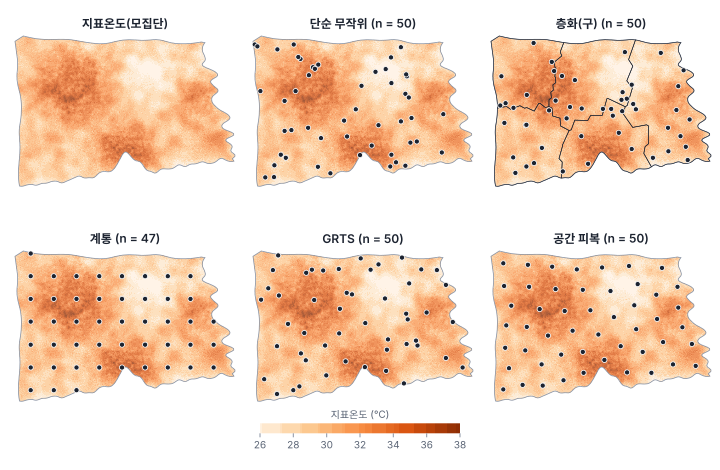
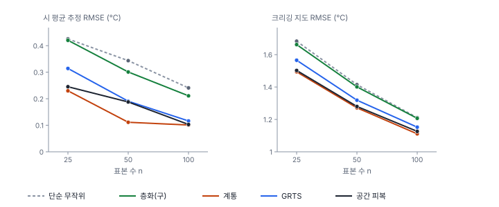

[목차](../README.md) · 이전: [37강 질병 지도와 CAR 모형](37-disease-mapping-car.md) · 다음: [39강 공간 교차검증과 머신러닝](39-spatial-cv-ml.md)

# 38강 공간 표본 설계

> 앱 지원: ○ GeoStat에 표본 추출 기능이 없어 코드로 함. 뽑은 점은 GeoPackage로 저장해 앱에서 지도와 겹쳐 봄 · 읽는 시간 약 45분

## 이 강에서 얻는 것

- 공간 표본 설계의 기본형(단순 무작위, 층화, 계통, 공간 균형, 공간 피복)과 각각의 장단점을 앎
- 설계 기반 추론과 모형 기반 추론의 차이를 알고, 목적(평균 추정 대 지도 만들기)에 맞는 설계를 고를 수 있음
- 포함확률, 호비츠-톰프슨 추정량, 층화 추정량의 분산을 손으로 계산할 수 있음
- 공간 자기상관이 있을 때 고르게 퍼진 표본이 왜 효율적인지, 그리고 그 표본의 분산을 단순 무작위 식으로 계산하면 어떻게 되는지 앎

## 들어가는 질문

한빛시가 여름 한낮 지표온도를 현장에서 재려 함. 장비가 50대뿐임. 시 전체의 평균 지표온도를 알고 싶을 때와, 시 전체의 지표온도 지도를 그리고 싶을 때, 50대를 어디에 두어야 하는가? 측정하기 쉬운 길가나 공원에만 두어도 되는가?

이 강은 한빛시의 50 m 지표온도 래스터(셀 181,637개, 454.1 km²)를 "참값을 모두 아는 모집단"으로 놓고, 여러 설계로 표본을 수백 번 뽑아 성능을 직접 비교함. 시 전체의 참 평균은 30.454℃, 셀 값의 표준편차는 2.302℃임.

## 1. 두 가지 추론: 설계 기반과 모형 기반

공간 표본에서 불확실성이 어디서 오는가에 따라 두 관점이 있음(de Gruijter & ter Braak 1990; Brus & de Gruijter 1997).

| | 설계 기반 추론 | 모형 기반 추론 |
|---|---|---|
| 무엇이 무작위인가 | 표본을 뽑는 과정(모집단의 값은 고정됨) | 값을 만든 과정(확률장, 20강) |
| 필요한 것 | 알려진 포함확률로 뽑은 확률 표본 | 맞는 공간 모형(베리오그램 등) |
| 표본 배치 | 무작위여야 함 | 아무렇게나 둬도 됨(목적에 맞게 고름) |
| 잘하는 일 | 영역 전체의 평균·합계·비율 | 지도 만들기(크리깅), 관측하지 않은 곳의 예측 |
| 약점 | 지도를 그리지 못함 | 모형이 틀리면 결과도 틀림 |

설계 기반 추론에서는 "이 표본을 뽑는 방법을 수없이 되풀이하면 추정값이 참 평균 둘레에 어떻게 흩어지는가"가 불확실성임. 표본점의 값이 서로 공간 자기상관이 있어도, 뽑는 방법이 무작위라 추정량이 불편이 됨. 9강의 "독립성이 깨지면 표준오차가 틀린다"는 경고는 모형 기반 관점의 이야기이고, 무작위로 뽑은 확률 표본의 평균 추정에는 그대로 적용되지 않음.

## 2. 확률 표본의 기본형

### 포함확률과 호비츠-톰프슨 추정량

**포함확률** πᵢ는 단위 i가 표본에 들어갈 확률임. 셀 N = 1,000개에서 n = 50개를 단순 무작위로 뽑으면 모든 셀의 π = 50/1,000 = 0.05임. **호비츠-톰프슨 추정량**(Horvitz & Thompson 1952)은 각 표본값을 포함확률로 나눠 더함.

$$
\hat{\bar Y}_{HT} = \frac{1}{N}\sum_{i \in s} \frac{y_i}{\pi_i}
$$

π가 모두 n/N이면 표본 평균과 같음. 포함확률이 다른 설계(예: 인구가 많은 곳을 더 뽑음)에서도 이 식으로 불편 추정을 함.

### 층화 무작위 추출

모집단을 겹치지 않는 **층**(stratum)으로 나누고, 층마다 따로 무작위로 뽑음. 층별 평균을 면적 비율 W_h로 가중해 더함.

$$
\hat{\bar Y}_{st} = \sum_h W_h \bar y_h, \qquad \widehat{\text{Var}} = \sum_h W_h^2 \frac{s_h^2}{n_h}
$$

### 손으로 해 보기: 두 층

층 A(면적 비율 0.6)에서 6점의 평균 31.0℃, 표준편차 1.2℃이고, 층 B(0.4)에서 4점의 평균 33.0℃, 표준편차 0.8℃임.

- 추정값: 0.6 × 31.0 + 0.4 × 33.0 = 31.800
- 분산: 0.6² × 1.2² / 6 + 0.4² × 0.8² / 4 = 0.0864 + 0.0256 = 0.1120, 표준오차 √0.1120 = 0.3347

층 안이 고르고 층 사이가 다를수록 층화의 이득이 큼. 층의 수가 많고 작을수록 공간적으로 고르게 퍼진 표본이 됨. 한빛시의 다섯 구는 지표온도 평균이 29.69℃(다솜구)~31.79℃(가람구)로 다름.

### 계통 추출

정사각 격자의 교점에 점을 두고, 격자 전체를 무작위로 한 번 옮겨(무작위 시작점) 확률 표본으로 만듦. 50점이면 간격이 약 3 km임. 바다나 시 밖에 떨어진 점은 버리므로 표본 수가 조금씩 다름(한빛시 50점 설계에서 44~58점).

### 공간 균형 추출: GRTS

**GRTS**(generalized random tessellation stratified; Stevens & Olsen 2004)는 영역을 사분 트리(네 칸으로 나누고 각 칸을 다시 넷으로 나눔)로 쪼개 칸마다 주소를 매기되, 각 단계에서 네 칸의 순서를 무작위로 섞음. 그 주소 순서로 셀을 한 줄로 늘어놓고 계통 추출을 하면, 줄에서 가까운 셀이 지도에서도 대체로 가깝기 때문에 표본이 고르게 퍼짐. 확률 표본이면서 공간적으로 균형 잡히고, 주소 순서의 다음 순번을 더 뽑거나(예비 점) 순서의 끝에서 빼도 균형이 유지됨. 미국 환경보호청의 하천·호수 조사가 이 설계를 씀. R의 spsurvey 패키지가 표준 도구임(Dumelle 외 2023). 비슷한 목적의 **국지 피벗 방법**(local pivotal method; Grafström, Lundström & Schelin 2012)도 있음.

### 공간 피복 표본

좌표에 k-평균 군집을 적용해 영역을 n개의 조각으로 나누고, 각 조각의 중심에 점을 둠(Walvoort, Brus & de Gruijter 2010). 가장 고르게 퍼진 배치이고, 크리깅의 평균 예측 분산을 거의 최소로 만드는 모형 기반 설계임. 다만 무작위성이 거의 없어 **확률 표본이 아님**. 평균을 설계 기반으로 추정하면 안 됨.



## 3. 한빛시에서 비교하기

다섯 설계로 표본을 n = 25, 50, 100에서 각각 300~500번 뽑아 두 가지 일을 시켰음(`book/fig-src/38.py`).

- **시 평균 추정**: 표본 평균(층화는 층화 추정량)과 참 평균(30.454℃)의 차이
- **지도 만들기**: 표본점으로 정규 크리깅(22강)해 검증 셀 3,000개에서 참값과 비교. 베리오그램은 설계와 상관없는 예비 표본 500점으로 한 번 추정해(지수 모형, 너깃 0.135, 부분 문턱값 10.60, 실효 상관거리 34 km) 모든 설계에 같이 씀. 상관거리가 시의 크기보다 길게 나온 것은 지표온도에 시 전체에 걸친 큰 경향이 있기 때문임



n = 50의 결과는 다음과 같음.

| 설계 | 평균 추정 RMSE | 치우침 | 설계 효과 | 단순 무작위 식 95% 구간의 포함률 | 크리깅 RMSE | 평균 크리깅 분산 |
|---|---|---|---|---|---|---|
| 단순 무작위 | 0.344 | +0.020 | 1 | 0.930 | 1.415 | 1.954 |
| 층화(구) | 0.301 | −0.010 | 0.767 | 0.938 | 1.401 | 1.907 |
| 계통 | 0.111 | +0.001 | 0.105 | 1.000 | 1.271 | 1.558 |
| GRTS | 0.191 | +0.007 | 0.308 | 0.996 | 1.319 | 1.716 |
| 공간 피복 | 0.188 | +0.127 | 0.298 | 1.000 | 1.280 | 1.507 |

**설계 효과**는 같은 표본 수에서 단순 무작위 대비 평균제곱오차의 비임. 0.105는 단순 무작위로 같은 정밀도를 얻으려면 표본이 약 10배 필요하다는 뜻임. 다만 계통 추출의 이득은 격자 간격과 시의 모양이 맞물리는 방식(시원한 가장자리에 떨어지는 점의 수)에 따라 들쭉날쭉해서, 설계 효과가 n = 25·50·100에서 0.292·0.105·0.175였고 n = 100의 RMSE(0.101)가 n = 50(0.111)과 거의 같았음. 0.105는 n = 50의 간격에서 운 좋게 맞물린 값으로 봐야 함.

- **고르게 퍼질수록 평균 추정이 정밀함**: 지표온도는 이웃끼리 닮아서, 가까운 두 점은 거의 같은 정보를 줌. 단순 무작위 표본은 이런 겹치는 점이 생기고, 고르게 퍼진 표본은 겹침이 적음. 표본점에서 가장 가까운 다른 표본점까지의 평균 거리는 단순 무작위 1,610 m, 계통 3,001 m, 공간 피복 2,852 m임
- **층화(구)의 이득은 작음**: 구는 다섯 개뿐이고 크기가 커서, 구 안에서는 여전히 무작위로 몰림. 층을 작고 많이 나누면(예: k-평균으로 25개 층에 2점씩) 공간 피복에 가까워짐
- **단순 무작위의 분산 식은 고른 설계에서 너무 큼**: 계통과 GRTS 표본에 s²/n 식을 쓰면 95% 구간이 거의 언제나(0.996~1.000) 참값을 포함함. 구간이 너무 넓어 정밀도를 과소평가한다는 뜻임. 계통·GRTS 표본에는 실용적인 설계 불편 분산 추정량이 없어, 이웃한 점끼리의 차이로 분산을 근사하는 방법(Stevens & Olsen 2003의 국지 이웃 분산 추정량 등)을 씀
- **공간 피복은 평균에 치우침이 있음**: 치우침 +0.127℃가 평균제곱오차의 약 절반을 차지함. 시 가장자리(해안과 이웃 시와의 경계)는 안쪽보다 시원함. 가장자리에서 500 m 안의 셀은 평균 29.39℃, 5 km 넘게 들어간 셀은 30.88℃임. 그런데 k-평균 중심은 조각의 안쪽에 놓이므로, 가장자리 1 km 안에 떨어지는 표본점이 3.8%뿐임(셀은 20.5%, 단순 무작위 표본점은 20.4%). 확률 표본이 아니면 표본 평균이 불편이라는 보장이 없음
- **지도 만들기는 계통과 공간 피복이 가장 좋음**: 평균 크리깅 분산은 공간 피복이 가장 작고, 실제 크리깅 RMSE는 계통이 근소하게 가장 작음(1.271 대 1.280). 두 설계는 사실상 같음. 크리깅 분산은 참값 없이도 계산되므로, 모형 기반 설계에서는 이것을 최소화하는 배치를 찾음

공간 균형의 정도를 숫자로 보면, 모든 셀을 가장 가까운 표본점에 배정했을 때(보로노이 다각형) 점마다 맡은 넓이(포함확률의 합)의 분산이 단순 무작위 0.325, 층화(구) 0.259, GRTS 0.103, 계통 0.040, 공간 피복 0.009임(n = 50). 작을수록 고르게 퍼진 것임(Stevens & Olsen 2004).

## 4. 실무에서 조사 지점 두기

1. **목적을 먼저 정함**: 영역 전체의 평균·비율·합계이면 확률 표본(층화, GRTS)이고, 지도이면 공간 피복이나 계통 표본임. 둘 다면 확률 표본이면서 고르게 퍼진 GRTS나 작은 층의 층화가 절충안임
2. **모집단 틀을 정의함**: 조사할 수 있는 곳(육지, 사유지 제외 등)을 지도로 정하고, 그 밖은 결론의 범위에서 뺌. 한빛시에서는 바다와 시 밖을 뺐음
3. **접근성 편향를 피함**: 길가에만 두면 길가의 열섬을 재게 됨. 접근할 수 없는 점은 예비 점(GRTS의 다음 순번)으로 바꾸고, 바꾼 사실을 기록함
4. **베리오그램을 추정하려면 가까운 쌍이 필요함**: 계통·공간 피복 표본은 가장 가까운 점 사이가 3 km라 짧은 거리의 베리오그램을 추정할 수 없음. 일부 점 옆에 가까운 점을 덧붙임(Lark & Marchant 2018)
5. **설계를 보고서에 남김**: 설계, 표본 수, 층과 배분, 무작위 시드, 바꾼 점. 설계 기반 추정의 분산은 설계에 따라 계산하므로, 설계를 모르면 다시 분석할 수 없음

## 해 보기

GeoStat에는 표본 추출 기능이 없으므로 코드로 뽑고, 결과를 GeoPackage로 저장해 앱에서 지표온도 래스터와 겹쳐 봄.

### 코드로: 단순 무작위, 계통, 공간 피복 표본

```python
import geopandas as gpd
import numpy as np
import rasterio
import shapely
from sklearn.cluster import KMeans

dong = gpd.read_file("book/data/hanbit_dong.gpkg")
with rasterio.open("book/data/hanbit_lst.tif") as r:
    z = r.read(1).astype(float)
    tr = r.transform
rows, cols = np.indices(z.shape)
X, Y = tr.c + (cols + 0.5) * 50, tr.f - (rows + 0.5) * 50          # 셀 중심 좌표
land = (z > -9000) & shapely.contains_xy(dong.union_all(), X, Y)   # 모집단 틀: 시 안 육지 셀
x, y, v = X[land], Y[land], z[land]
N = len(v)
print(f"모집단 {N:,}셀, 참 평균 {v.mean():.3f}")

rng = np.random.default_rng(38)
n = 50
# 1) 단순 무작위 추출과 95% 신뢰구간 (유한 모집단 수정 포함)
s = rng.choice(N, n, replace=False)
se = v[s].std(ddof=1) / np.sqrt(n) * np.sqrt(1 - n / N)
print(f"단순 무작위: {v[s].mean():.3f} ± {1.96 * se:.3f}")

# 2) 계통 추출: 정사각 격자 간격 d, 무작위 시작점, 시 밖·바다에 떨어진 점은 버림
d = np.sqrt(N * 50 ** 2 / n)
gx, gy = np.meshgrid(np.arange(x.min() + rng.uniform(0, d), x.max(), d), np.arange(y.min() + rng.uniform(0, d), y.max(), d))
c = ((gx.ravel() - tr.c) // 50).astype(int)
r_ = ((tr.f - gy.ravel()) // 50).astype(int)
keep = land[r_, c]
print(f"계통: 간격 {d:.0f} m, 표본 {keep.sum()}점, 평균 {z[r_[keep], c[keep]].mean():.3f}")

# 3) 공간 피복: 좌표의 k-평균 중심에 가장 가까운 셀 (지도 만들기용, 확률 표본이 아님)
km = KMeans(n, n_init=1, random_state=38).fit(np.c_[x, y][rng.choice(N, 20000, replace=False)])
near = np.argmin((x[:, None] - km.cluster_centers_[:, 0]) ** 2 + (y[:, None] - km.cluster_centers_[:, 1]) ** 2, axis=0)
print(f"공간 피복: 평균 {v[near].mean():.3f}")
gpd.GeoDataFrame({"LST": v[near]}, geometry=gpd.points_from_xy(x[near], y[near]), crs=dong.crs).to_file("coverage50.gpkg")
```

- 확인: 모집단 181,637셀, 참 평균 30.454. 단순 무작위 30.723 ± 0.680, 계통 간격 3,014 m에 53점·평균 30.230, 공간 피복 평균 30.746. 한 번의 표본이라 참 평균과 차이가 있음. `rng`의 시드를 바꿔 여러 번 해 보면 계통 표본의 평균이 가장 덜 흔들림
- 앱에서 보기: **파일 → 데이터 열기…** 메뉴로 `hanbit_lst.tif`와 `coverage50.gpkg`를 열어 겹쳐 봄. 점이 시 가장자리(해안과 시 경계)를 얼마나 덜 덮는지 봄
- GRTS는 `book/fig-src/38.py`의 `grts()` 함수에 같은 포함확률의 간단한 구현이 있음(numpy만 씀. 파일 전체를 불러오려면 GeoStat 엔진 환경이 필요함). 이 간단한 구현은 예비 점의 순서(역계층 순서)를 만들지 않으므로, 대체 지점이 필요한 실무에서는 R의 spsurvey(`grts()`)를 씀

## 헷갈리는 쌍

- **설계 기반 vs 모형 기반 추론**: 뽑는 과정의 무작위성 대 값을 만든 과정의 확률 모형. 앞의 것은 확률 표본이 필요하고, 뒤의 것은 맞는 모형이 필요함
- **확률 표본 vs 공간 피복 표본**: 포함확률을 알고 0보다 큼 대 배치를 최적화해 정함(포함확률을 알 수 없음)
- **계통 추출 vs GRTS**: 둘 다 고르게 퍼진 확률 표본임. 계통은 격자 간격이 고정되어 주기적인 패턴(도로망 등)과 겹치면 분산이 커질 수 있고(한 번의 표본이 크게 빗나갈 수 있고), GRTS는 무작위 순서 덕분에 이런 위험이 적고 점을 더하거나 빼기 쉬움
- **층화 vs 군집 추출**: 층마다 모두 뽑음(정밀도가 오름) 대 군집 몇 개를 골라 그 안을 다 조사함(비용은 줄지만 군집 안이 닮으면 정밀도가 떨어짐, 40강의 유효 표본 크기)
- **설계 효과 vs 유효 표본 크기**: 단순 무작위 대비 분산(평균제곱오차)의 비 대 같은 정밀도를 주는 단순 무작위 표본의 크기

## 흔한 실수와 심사 지적

- **편의 표본(접근하기 쉬운 곳)으로 영역 평균을 추정함**
  - 지적: "표본이 모집단을 대표한다는 근거가 있습니까?"
  - 대응: 확률 표본으로 뽑거나, 편의 표본이면 모형 기반 추론(공변량과 공간 모형)으로 바꾸고 그 가정을 밝힘
- **계통·GRTS 표본에 단순 무작위의 분산 식을 그대로 씀**
  - 대응: 대개 보수적(구간이 넓음)임을 밝히거나, 국지 이웃 분산 추정량을 씀
- **공간 피복 표본으로 설계 기반 평균과 신뢰구간을 보고함**
  - 대응: 확률 표본이 아니므로 모형 기반 예측(블록 크리깅의 영역 평균, 22강)으로 추정함
- **바꾼 점과 접근 불가 점을 기록하지 않음**
  - 대응: 원래 점, 바꾼 점, 이유를 표로 남김. 바꾼 점이 많으면 결론의 범위가 달라짐
- **표본 수를 공간 자기상관 없이 정함**
  - 대응: 지도 목적이면 크리깅 분산, 평균 목적이면 예비 조사의 분산과 설계 효과를 함께 고려함

## 보고서에는 이렇게 씀

> 시 경계 안 육지 전체(454.1 km²)를 모집단 틀로 정의하고, 여름 한낮 지표온도의 평균을 추정하기 위해 GRTS 설계(Stevens & Olsen 2004; 같은 포함확률)로 50개 지점을 추출하였다(난수 시드 20260930). 접근할 수 없는 지점은 GRTS 순번의 다음 예비 지점으로 대체하였으며, 대체 지점과 사유를 부록에 수록하였다. 영역 평균은 호비츠-톰프슨 추정량으로 추정하였고, 분산은 국지 이웃 분산 추정량(Stevens & Olsen 2003)으로 계산하였다. 같은 자료로 지표온도 지도를 작성할 때에는 지수 베리오그램 모형에 의한 정규 크리깅을 사용하였다. 참고로, 전 영역의 위성 지표온도를 참값으로 놓은 모의에서 이 설계의 평균 추정 평균제곱오차는 단순 무작위 추출의 0.31배였다.

적어야 할 항목은 다음과 같음.

- 목적(영역 평균, 지도)과 모집단 틀(포함한 곳과 뺀 곳)
- 설계(단순 무작위, 층화와 층·배분, 계통과 간격, GRTS, 공간 피복)와 표본 수, 난수 시드
- 대체 지점과 결측, 그 처리
- 추정 방법(호비츠-톰프슨, 층화 추정량, 모형 기반 예측)과 분산 추정 방법

## 요약

- 설계 기반 추론은 무작위로 뽑는 과정에서, 모형 기반 추론은 확률 모형에서 불확실성을 얻음. 평균에는 확률 표본, 지도에는 고르게 퍼진 배치가 알맞음
- 한빛시 지표온도(셀 181,637개)에서 50점으로 시 평균을 추정하면 RMSE가 단순 무작위 0.344℃, GRTS 0.191℃, 계통 0.111℃였음. 공간 자기상관이 있으면 고르게 퍼진 확률 표본이 훨씬 정밀함
- 계통·GRTS 표본에 단순 무작위 분산 식을 쓰면 구간이 너무 넓어짐(포함률 0.996~1.000)
- 크리깅 지도는 계통(RMSE 1.271℃)과 공간 피복(1.280℃, 평균 크리깅 분산 최소)이 가장 좋았음. 공간 피복은 확률 표본이 아니라 시원한 가장자리를 덜 뽑아 평균에 치우침(+0.127℃)이 있었음
- 조사 지점은 목적, 모집단 틀, 접근성 편향, 베리오그램용 가까운 쌍을 함께 고려해 정하고, 설계를 기록함

## 핵심 용어

| 한글 | 영문 | 비고 |
|---|---|---|
| 설계 기반 추론 | Design-based Inference | |
| 모형 기반 추론 | Model-based Inference | |
| 모집단 틀 | Sampling Frame | |
| 포함확률 | Inclusion Probability | |
| 호비츠-톰프슨 추정량 | Horvitz–Thompson Estimator | 1952 |
| 단순 무작위 추출 | Simple Random Sampling (SRS) | |
| 층화 무작위 추출 | Stratified Random Sampling | |
| 계통 추출 | Systematic Sampling | |
| 공간 균형 추출 | Spatially Balanced Sampling | |
| GRTS | Generalized Random Tessellation Stratified | Stevens & Olsen 2004 |
| 국지 피벗 방법 | Local Pivotal Method | Grafström 외 2012 |
| 공간 피복 표본 | Spatial Coverage Sample | Walvoort 외 2010 |
| 설계 효과 | Design Effect | |
| 유한 모집단 수정 | Finite Population Correction | |

## 원전과 더 읽을거리

**원전**

- Horvitz, D. G., & Thompson, D. J. (1952). A generalization of sampling without replacement from a finite universe. *Journal of the American Statistical Association*, 47(260), 663–685.
- de Gruijter, J. J., & ter Braak, C. J. F. (1990). Model-free estimation from spatial samples: A reappraisal of classical sampling theory. *Mathematical Geology*, 22(4), 407–415.
- Stevens, D. L., Jr., & Olsen, A. R. (2003). Variance estimation for spatially balanced samples of environmental resources. *Environmetrics*, 14(6), 593–610.
- Stevens, D. L., Jr., & Olsen, A. R. (2004). Spatially balanced sampling of natural resources. *Journal of the American Statistical Association*, 99(465), 262–278.
- Grafström, A., Lundström, N. L. P., & Schelin, L. (2012). Spatially balanced sampling through the pivotal method. *Biometrics*, 68(2), 514–520.
- Walvoort, D. J. J., Brus, D. J., & de Gruijter, J. J. (2010). An R package for spatial coverage sampling and random sampling from compact geographical strata by k-means. *Computers & Geosciences*, 36(10), 1261–1267.

**더 읽을거리**

- Brus, D. J. (2022). *Spatial Sampling with R*. Chapman & Hall/CRC. 온라인 무료. 이 강의 거의 모든 설계를 R 코드와 함께 다룸
- Brus, D. J., & de Gruijter, J. J. (1997). Random sampling or geostatistical modelling? Choosing between design-based and model-based sampling strategies for soil (with discussion). *Geoderma*, 80(1–2), 1–59.
- de Gruijter, J., Brus, D. J., Bierkens, M. F. P., & Knotters, M. (2006). *Sampling for Natural Resource Monitoring*. Springer.
- Dumelle, M., Kincaid, T., Olsen, A. R., & Weber, M. (2023). spsurvey: Spatial sampling design and analysis in R. *Journal of Statistical Software*, 105(3), 1–29.
- Lark, R. M., & Marchant, B. P. (2018). How should a spatial-coverage sample design for a geostatistical soil survey be supplemented to support estimation of spatial covariance parameters? *Geoderma*, 319, 89–99.
- Cochran, W. G. (1977). *Sampling Techniques* (3rd ed.). Wiley.

## 연습

1. 층화 손계산에서 층 B의 표본을 4점에서 8점으로 늘리면(평균과 표준편차는 그대로) 표준오차는 얼마가 되는가? 같은 10점을 면적 비례(A 6점, B 4점) 대신 어떻게 나누면 분산이 가장 작아지는가(네이만 배분: n_h ∝ W_h s_h)?

2. 한빛시 모의에서 단순 무작위 50점의 평균 추정 RMSE는 0.344℃였음. 셀 값의 표준편차 2.302℃로 이론값 σ/√n을 계산해 비교하시오. 계통 추출(0.111℃)로 같은 정밀도를 단순 무작위로 얻으려면 몇 점이 필요한가?

3. 어떤 연구가 도로변 측정소 30곳의 평균 지표온도를 "도시 평균"으로 보고함. 이 추정의 문제를 설계 기반과 모형 기반 관점에서 각각 설명하시오.

4. 공간 피복 표본은 지도의 크리깅 오차가 가장 작았는데 시 평균에는 치우침이 있었음. 같은 표본으로 시 평균을 제대로 추정하려면 어떻게 하는가?

5. GRTS 표본 50점 가운데 7점이 사유지라 접근할 수 없었음. 어떻게 처리하고 무엇을 보고하겠는가?

<details>
<summary>해답</summary>

1. 분산 = 0.0864 + 0.4² × 0.8² / 8 = 0.0864 + 0.0128 = 0.0992, 표준오차 0.315. 네이만 배분은 W_h s_h에 비례하므로 A: 0.6 × 1.2 = 0.72, B: 0.4 × 0.8 = 0.32. 10점을 0.72 : 0.32로 나누면 A 6.9점, B 3.1점, 곧 A 7점·B 3점임. 분산은 0.36 × 1.44 / 7 + 0.16 × 0.64 / 3 = 0.0741 + 0.0341 = 0.1082로, 면적 비례(0.1120)보다 조금 작음. 흩어짐이 큰 층에 더 많이 둠.

2. 이론값 2.302 / √50 = 0.326(유한 모집단 수정은 무시할 만함). 모의값 0.344는 500번 모의의 몬테카를로 오차 범위 안임. 단순 무작위의 RMSE가 0.111이 되려면 n = (2.302 / 0.111)² ≈ 430점이 필요함. 설계 효과 0.105(약 10분의 1)와 같은 이야기임(설계 효과로 계산하면 50 / 0.105 ≈ 476점인데, 모의의 단순 무작위 RMSE가 이론값보다 조금 컸기 때문에 차이가 남). 다만 계통의 이득은 n = 50의 간격에서 특히 컸음(n = 100에서는 설계 효과 0.175).

3. 설계 기반: 도로변 측정소는 확률 표본이 아니라 포함확률이 정의되지 않고, 도로에서 먼 곳(공원, 산지, 해안)의 포함확률이 0임. 그래서 도시 평균의 불편 추정이 아님. 모형 기반: 측정소의 값과 위치를 모형으로 연결하면 도시 평균을 예측할 수 있지만, 도로변이라는 위치가 지표온도와 관련되므로(포장, 차량) 그 공변량을 모형에 넣어야 함. 그렇지 않으면 도로변의 열섬이 도시 전체로 퍼진 치우친 예측이 됨. 측정소가 30곳뿐이고 몰려 있으면 베리오그램과 예측 분산도 불확실함.

4. 모형 기반으로 추정함. 표본점으로 베리오그램을 정하고 시 전체를 블록 크리깅(22강)해 영역 평균과 그 예측 분산을 구하거나, 셀마다 크리깅 예측을 해 평균함. 시 가장자리를 덜 대표하는 문제는 크리깅이 공간 구조로 메우지만, 가장자리의 예측 분산이 크다는 점을 함께 보고함. 공변량(가장자리까지 거리)이 있으면 회귀 크리깅이 도움이 됨.

5. GRTS 순번의 다음 예비 지점으로 차례대로 바꿔 공간 균형을 유지함. 보고서에는 원래 지점, 대체 지점, 사유를 표로 적고, 결론의 범위를 "접근 가능한 토지"로 좁혀 적음. 사유지가 특정 환경(예: 공장 부지)에 몰려 있으면 그 부분 모집단을 대표하지 못한다는 한계를 밝힘. 대체 없이 빼면 설계 가중치를 조정해야 함.

</details>

---

[목차](../README.md) · 이전: [37강 질병 지도와 CAR 모형](37-disease-mapping-car.md) · 다음: [39강 공간 교차검증과 머신러닝](39-spatial-cv-ml.md)
