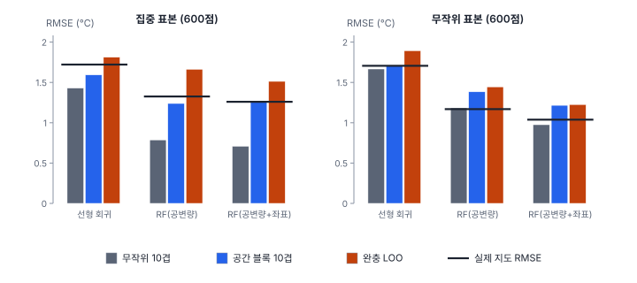
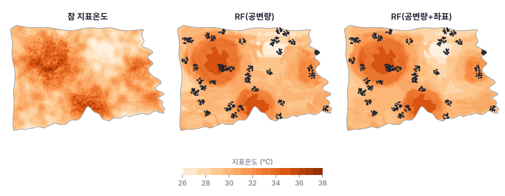

[목차](../README.md) · 이전: [38강 공간 표본 설계](38-spatial-sampling.md) · 다음: [40강 격자·래스터 자료와 공간통계](40-raster-grid.md)

# 39강 공간 교차검증과 머신러닝

> 앱 지원: ○ GeoStat에 머신러닝과 교차검증 기능이 없어 코드로 함 · 읽는 시간 약 45분

## 이 강에서 얻는 것

- 공간 자료에서 무작위 교차검증이 왜 낙관적인지(공간 누설) 손계산과 모의로 확인함
- 공간 블록 교차검증, 완충 LOO의 원리와 블록 크기를 정하는 기준을 앎
- 교차검증 방법은 표본 설계와 예측할 범위에 맞춰 골라야 한다는 것을 앎(공간 교차검증이 늘 옳은 것은 아님)
- 랜덤 포레스트 같은 머신러닝 모형의 잔차 자기상관과, 좌표를 특징으로 넣는 것의 득실을 앎

## 들어가는 질문

어떤 연구가 표본점 600개로 지표온도를 예측하는 랜덤 포레스트를 학습하고 "10겹 교차검증 RMSE 0.71℃"라고 보고함. 이 모형으로 시 전체 지도를 그리면 실제 오차도 0.71℃ 안팎일까?

한빛시 지표온도는 참값을 모두 알고 있으므로 이 질문에 직접 답할 수 있음. 표본점이 40곳에 15점씩 모여 있었다면, 실제 지도의 RMSE는 1.26℃로 교차검증 추정의 1.8배였음.

## 1. 공간 누설

교차검증은 자료를 나눠 일부로 학습하고 나머지로 평가하는 일을 되풀이해, "새 자료에 대한 오차"를 추정함. 이것이 맞으려면 평가 자료가 학습 자료와 독립이고, 앞으로 예측할 대상과 같은 분포에서 나와야 함.

공간 자료에서는 가까운 점끼리 값이 닮음(9강). 표본점이 모여 있으면 무작위로 뺀 평가 점마다 바로 옆에 학습 점이 있어, 모형이 "옆 점의 값을 기억해 내는" 것만으로도 잘 맞힘. 그런데 지도를 그릴 때 예측할 셀 대부분은 가장 가까운 표본점에서 수백 m~수 km 떨어져 있음. 평가할 때의 거리와 예측할 때의 거리가 다르니 오차도 다름. 이것을 **공간 누설**(spatial leakage) 또는 공간 과적합이라 함(Roberts 외 2017; Ploton 외 2020).

### 손으로 해 보기: 한 줄의 열 점

x = 1~10에 놓인 열 점의 값이 3, 4, 6, 5, 7, 8, 7, 9, 10, 9임. 예측은 "남은 점 가운데 가장 가까운 왼쪽과 오른쪽 값의 평균"으로 함.

- **하나씩 빼기(LOO)**: x = 2를 빼면 왼쪽 3, 오른쪽 6의 평균 4.5로 예측해 오차 +0.5. 열 점의 오차는 1.0, 0.5, −1.5, 1.5, −0.5, −1.0, 1.5, −0.5, −1.0, 1.0이고 RMSE는 1.072
- **블록 빼기**: 1~3, 4~6, 7~10을 덩어리째 빼면 x = 2의 예측에 왼쪽 점이 없고 오른쪽 가장 가까운 점이 x = 4(값 5)라 오차 +1.0. 열 점의 오차는 2.0, 1.0, −1.0, 1.5, −0.5, −1.5, 1.0, −1.0, −2.0, −1.0이고 RMSE는 1.332

블록을 빼면 예측에 쓰는 점이 멀어져 오차가 커짐. 둘 가운데 어느 것이 "맞는" 오차인지는 실제로 예측할 곳이 표본점에서 얼마나 떨어져 있는지에 달림.

## 2. 공간 교차검증의 방법

| 방법 | 나누는 방식 | 참고 |
|---|---|---|
| 공간 블록 k겹 | 영역을 정사각형(또는 육각형) 블록으로 나누고, 블록을 통째로 k개 겹에 배정함 | Roberts 외 2017; Valavi 외 2019(blockCV) |
| 공간 군집 k겹 | 좌표를 k-평균으로 k개 덩어리로 나눔 | Brenning 2012(sperrorest) |
| 완충 LOO | 평가 점 하나를 빼고, 그 둘레 반경 r 안의 점도 학습에서 뺌 | Le Rest 외 2014; Pohjankukka 외 2017 |
| 최근접 이웃 거리 맞춤(NNDM, kNNDM) | 평가 점에서 가장 가까운 학습 점까지의 거리 분포가, 예측 셀에서 가장 가까운 표본점까지의 거리 분포와 같아지게 나눔 | Milà 외 2022; Linnenbrink 외 2024 |

블록의 크기나 완충 반경은 흔히 잔차의 공간 자기상관이 사라지는 거리(잔차 베리오그램의 상관거리, 21강)로 정함. 너무 작으면 누설이 남고, 너무 크면 학습 자료가 줄고 공변량의 범위를 벗어난 외삽을 평가하게 되어 비관적임. NNDM은 "예측할 때와 같은 거리에서 평가한다"는 원칙을 직접 구현한 것임.

### 공간 교차검증이 늘 옳은 것은 아님

와두 외(Wadoux 외 2021)는 표본이 단순 무작위·계통 표본처럼 영역 전체에 고르게 퍼진 확률 표본(38강)이라면 보통의 무작위 교차검증이 지도 오차를 거의 치우침 없이 추정하고, 공간 교차검증은 오히려 비관적이라고 지적함. 표본점과 예측 셀의 거리 관계가 이미 같기 때문임. 핵심은 "공간이냐 아니냐"가 아니라 **평가할 때의 상황이 예측할 때의 상황을 흉내 내느냐**임. 몇 곳을 고른 뒤 그 안을 뽑는 군집 확률 표본(이 강의 집중 표본이 그 예)은 확률 표본이어도 무작위 교차검증이 낙관적임. 가장 확실한 방법은 지도 전체에서 따로 확률 표본을 뽑아 독립 검증하는 것임(40강).

## 3. 한빛시 실험

시 안 육지의 50 m 지표온도를 표본점 600개로 학습해 시 전체(셀 181,637개)를 예측했음. 공변량은 100 m 격자의 로그 인구밀도와 고령인구 비율, 해안까지 거리, 주요 도로까지 거리임. 표본은 두 가지임.

- **집중 표본**: 시 안의 40곳을 골라 각 반경 600 m 안에서 15점씩. 현장 조사가 몇몇 지역에 몰리는 흔한 상황임. 표본점끼리의 최근접 거리는 평균 147 m인데, 예측할 셀에서 가장 가까운 표본점까지는 평균 1,353 m(최대 5,420 m)임
- **무작위 표본**: 시 전체에서 단순 무작위로 600점. 표본점끼리 435 m, 예측 셀에서 표본점까지 463 m로 거의 같음

모형은 선형 회귀, 랜덤 포레스트(나무 200그루), 좌표를 더한 랜덤 포레스트이고, 교차검증은 무작위 10겹, 3 km 블록을 10겹에 배정한 공간 블록 10겹, 반경 2 km의 완충 LOO(평가 점 120개)임. 블록 크기와 반경은 설명을 위해 정한 값으로, 블록 하나가 집중 표본 덩어리 한두 개를 담는 크기임. "실제"는 표본 전체로 학습한 모형으로 시 전체를 예측한 RMSE임(`book/fig-src/39.py`).



| 표본 | 모형 | 무작위 10겹 | 공간 블록 10겹 | 완충 LOO | 실제 |
|---|---|---|---|---|---|
| 집중 | 선형 회귀 | 1.430 | 1.593 | 1.812 | 1.721 |
| 집중 | RF(공변량) | 0.787 | 1.239 | 1.663 | 1.325 |
| 집중 | RF(공변량+좌표) | 0.710 | 1.265 | 1.513 | 1.260 |
| 무작위 | 선형 회귀 | 1.667 | 1.706 | 1.894 | 1.706 |
| 무작위 | RF(공변량) | 1.184 | 1.384 | 1.445 | 1.169 |
| 무작위 | RF(공변량+좌표) | 0.976 | 1.216 | 1.225 | 1.039 |

- **집중 표본의 무작위 교차검증은 크게 낙관적임**: 랜덤 포레스트는 실제의 절반 남짓(0.79 대 1.33, 0.71 대 1.26)으로 추정함. 선형 회귀는 덜함(1.43 대 1.72). 유연한 모형일수록 옆 점을 기억하는 능력이 커서 누설이 큼
- **집중 표본의 랜덤 포레스트에서는 공간 블록이 실제에 가장 가까웠음**(1.24 대 1.33, 1.27 대 1.26). 완충 LOO는 반경 2 km가 실제 예측 거리(평균 1.35 km)보다 길어 비관적임. 선형 회귀에서는 완충 LOO가 가장 가까웠음(1.81 대 1.72)
- **무작위 표본에서는 무작위 교차검증이 실제와 비슷함**(1.18 대 1.17). 랜덤 포레스트에서는 공간 블록과 완충 LOO가 0.2~0.3℃쯤 비관적임(선형 회귀의 공간 블록은 실제와 같음). 와두 외(2021)의 지적과 같음
- **모형 순위는 교차검증 방법에 따라 달라질 수 있음**: 집중 표본에서 무작위 10겹과 실제는 좌표를 더한 RF를 낫게 보지만(0.710 대 0.787, 1.260 대 1.325), 공간 블록은 반대로 매김(1.265 대 1.239). 차이가 0.1℃ 안팎이면 어느 교차검증으로도 가리기 어려움

### 거리에 따른 실제 오차

예측 셀을 가장 가까운 표본점까지의 거리로 나누면, 집중 표본으로 학습한 RF(공변량)의 실제 RMSE는 500 m 안(셀의 21%)이 0.966, 0.5~2 km(56%)가 1.363, 2 km 이상(24%)이 1.491이었음. 표본에서 멀수록 오차가 커짐. 좌표를 더한 RF는 500 m 안에서 0.876으로 더 좋았지만 2 km 이상에서는 1.558로 오히려 나빴음. 좌표 특징은 표본에서 2 km 안에서는 도움이 되지만(0.5~2 km에서도 1.237 대 1.363) 그보다 먼 곳에서는 오히려 해가 됨. 메이어와 페베스마(Meyer & Pebesma 2021)는 학습 자료의 공변량 공간에서 너무 먼 곳을 **적용 가능 영역**(area of applicability) 밖으로 표시해 지도와 함께 내자고 제안함.

## 4. 머신러닝 잔차의 자기상관과 좌표 특징



공변량이 공간 구조를 다 설명하지 못하면 잔차에 자기상관이 남음(8강의 잔차 Moran's I). 무작위 표본에서 8개 최근접 이웃 가중치로 잰 잔차의 Moran's I는 다음과 같음.

| 모형 | 잔차 Moran's I | 유사 p |
|---|---|---|
| 선형 회귀 | 0.456 | 0.001 |
| RF(공변량), 아웃오브백 잔차 | 0.173 | 0.001 |
| RF(공변량+좌표), 아웃오브백 잔차 | 0.004 | 0.399 |

- 랜덤 포레스트는 비선형 관계를 잡아 선형 회귀보다 잔차의 자기상관이 작지만, 여전히 남음
- 좌표(X, Y)를 특징으로 넣으면 남은 공간 구조를 "위치에 따른 보정"으로 흡수해 잔차의 자기상관이 사라지고, 실제 지도 RMSE도 1.169에서 1.039로 줄었음
- 그러나 좌표 특징은 표본이 있는 곳에서만 배움. 나무 모형은 좌표 축에 평행하게 공간을 자르므로, 표본이 없는 곳에 같은 좌표 구간의 표본 덩어리 값을 띠나 직사각형 모양으로 늘어뜨리는 인공 무늬를 만들 수 있음(Meyer 외 2019; Hengl 외 2018). 이 예에서는 좌표의 중요도가 작아(0.06~0.07) 그런 무늬가 뚜렷하지 않음. 잔차의 자기상관이 사라졌다고 지도가 좋아진 것은 아님

공간 구조를 다루는 다른 방법은 다음과 같음.

- **회귀 크리깅 방식**: 머신러닝의 잔차(랜덤 포레스트라면 아웃오브백 잔차)를 크리깅해 더함(22강의 회귀 크리깅과 같은 생각)
- **거리 특징**: 표본점이나 영역 모서리까지의 거리들을 특징으로 넣음(Hengl 외 2018의 RFsp; Behrens 외 2018)
- **공간 랜덤 포레스트**: 나무를 지역마다 따로 키우는 지리적 랜덤 포레스트(Georganos 외 2021), 오차의 공간 공분산을 넣은 RF-GLS(Saha, Basu & Datta 2023)

### 블록 부트스트랩

교차검증이 예측 오차를 추정한다면, **블록 부트스트랩**은 자기상관이 있는 자료에서 통계량의 불확실성을 추정함. 점을 하나씩 다시 뽑으면 이웃끼리의 닮음이 깨져 표준오차가 너무 작게 나오므로, 공간 블록을 통째로 다시 뽑음(Lahiri 2003). 블록의 크기는 자기상관이 사라지는 거리보다 커야 하지만, 너무 크면 블록 수가 줄어 추정이 불안정함.

## 해 보기

GeoStat에는 머신러닝과 교차검증이 없으므로 코드로 함. scikit-learn의 `GroupKFold`에 공간 블록 번호를 그룹으로 넘기면 공간 블록 교차검증이 됨.

### 코드로: 무작위 교차검증과 공간 블록 교차검증

```python
import geopandas as gpd
import numpy as np
import rasterio
import shapely
from scipy import ndimage
from scipy.spatial import cKDTree
from sklearn.ensemble import RandomForestRegressor
from sklearn.model_selection import GroupKFold, KFold, cross_val_predict

dong = gpd.read_file("book/data/hanbit_dong.gpkg")
with rasterio.open("book/data/hanbit_lst.tif") as r:
    z = r.read(1).astype(float)
    tr = r.transform
with rasterio.open("book/data/hanbit_pop100.tif") as r:
    pop = r.read(1).astype(float)
rows, cols = np.indices(z.shape)
X, Y = tr.c + (cols + 0.5) * 50, tr.f - (rows + 0.5) * 50
land = (z > -9000) & shapely.contains_xy(dong.union_all(), X, Y)
dsea = ndimage.distance_transform_edt(z > -9000) * 50 / 1000                 # 해안까지 거리(km)
feat = np.c_[np.log1p(np.maximum(pop[rows // 2, cols // 2], 0)[land] / 0.01), dsea[land]]
x, y, v = X[land], Y[land], z[land]

# 집중 표본: 40곳에서 반경 600 m 안의 15점씩
rng = np.random.default_rng(39)
tree = cKDTree(np.c_[x, y])
idx = np.concatenate([rng.choice(tree.query_ball_point([x[c], y[c]], 600), 15, replace=False)
                      for c in rng.choice(len(v), 40, replace=False)])
rf = RandomForestRegressor(200, min_samples_leaf=2, random_state=0, n_jobs=-1)
rmse = lambda p, t: np.sqrt(np.mean((p - t) ** 2))  # noqa: E731

# 1) 무작위 10겹  2) 3 km 블록을 묶음으로 한 10겹 (GroupKFold)
p_rand = cross_val_predict(rf, feat[idx], v[idx], cv=KFold(10, shuffle=True, random_state=0))
block = (x[idx] // 3000).astype(int) * 1000 + (y[idx] // 3000).astype(int)
p_block = cross_val_predict(rf, feat[idx], v[idx], cv=GroupKFold(10), groups=block)
# 3) 실제 지도 오차: 표본 전체로 학습해 시 안 모든 셀을 예측
p_map = rf.fit(feat[idx], v[idx]).predict(feat)
print(f"무작위 10겹 {rmse(p_rand, v[idx]):.3f}, 공간 블록 10겹 {rmse(p_block, v[idx]):.3f}, 실제 지도 {rmse(p_map, v):.3f}")
```

- 확인: 무작위 10겹 1.176, 공간 블록 10겹 1.847, 실제 지도 1.506. 이 표본(공변량 두 개)에서는 무작위 교차검증이 낙관적이고 공간 블록은 비관적임. 블록 크기를 1~5 km로 바꿔 가며 추정이 어떻게 변하는지 봄
- 더 해 보기: `rng`의 시드를 바꿔 집중 표본을 여러 번 만들고, 매번 세 값을 기록해 어떤 방법이 평균적으로 실제에 가까운지 봄. 집중 표본을 시 전체의 무작위 600점으로 바꿔 같은 일을 함

## 헷갈리는 쌍

- **무작위 교차검증 vs 공간 교차검증**: 평가 점을 무작위로 뺌 대 공간 덩어리째 뺌. 앞의 것은 표본과 예측 대상의 거리 관계가 같을 때(영역 전체에 고르게 퍼진 확률 표본), 뒤의 것은 예측이 표본에서 멀리 떨어진 곳까지 갈 때 알맞음
- **교차검증 vs 독립 검증**: 같은 표본을 나눠 씀 대 지도 전체에서 따로 뽑은 확률 표본으로 평가함. 뒤의 것이 지도 정확도의 기준임
- **보간 vs 외삽**: 표본 사이를 채움 대 표본(또는 공변량의 범위) 밖을 예측함. 공간 블록 교차검증은 외삽에 가까운 상황을 평가함
- **교차검증 vs 블록 부트스트랩**: 예측 오차를 추정함 대 통계량(계수, 평균)의 불확실성을 추정함
- **잔차의 자기상관이 없음 vs 지도가 정확함**: 좌표 특징처럼 표본 위치에 맞춘 보정은 잔차의 자기상관을 없애도 표본이 없는 곳의 오차를 줄이지 못할 수 있음

## 흔한 실수와 심사 지적

- **모여 있는 표본에 무작위 k겹 교차검증만 보고함**
  - 지적: "검증 자료가 학습 자료와 공간적으로 독립입니까?"
  - 대응: 표본점끼리의 거리와 예측 셀에서 표본점까지의 거리 분포를 그려 비교하고, 그에 맞는 공간 교차검증(블록, NNDM)을 함께 보고함
- **블록 크기를 근거 없이 정함**
  - 대응: 잔차 베리오그램의 상관거리나 예측 거리 분포를 근거로 정하고, 몇 가지 크기의 결과를 함께 보임
- **확률 표본인데 공간 교차검증만 보고해 성능을 과소평가함**
  - 대응: 표본 설계를 밝히고, 단순 무작위·계통처럼 고르게 퍼진 확률 표본이면 무작위 교차검증이나 독립 확률 표본 검증을 씀
- **좌표 특징의 중요도가 높다고 "공간 효과가 크다"고 해석함**
  - 대응: 좌표는 빠진 공변량의 대리일 뿐임. 무엇이 공간 패턴을 만드는지는 공변량과 설계로 답함
- **교차검증으로 모형과 초모수를 고른 뒤 같은 교차검증 값을 최종 성능으로 보고함**
  - 대응: 중첩 교차검증이나 따로 남긴 검증 자료로 최종 성능을 보고함

## 보고서에는 이렇게 씀

> 지표온도 예측 모형(랜덤 포레스트, 나무 200그루, 잎의 최소 표본 2)의 공변량은 100 m 격자 인구밀도(로그), 고령인구 비율, 해안까지 거리, 주요 도로까지 거리였다. 학습 자료 600점은 40개 조사 구역에 모여 있어, 표본점 간 최근접 거리(평균 147 m)가 예측 셀에서 가장 가까운 표본점까지의 거리(평균 1,353 m)보다 훨씬 짧았다. 따라서 무작위 10겹 교차검증(RMSE 0.79℃) 대신, 3 km 정사각 블록을 단위로 한 공간 블록 10겹 교차검증(RMSE 1.24℃)으로 예측 성능을 평가하였다. 블록 크기의 민감도와 반경 2 km 완충 LOO의 결과(1.66℃)를 부록에 함께 수록하였다. 예측 지도에는 가장 가까운 표본점까지의 거리를 함께 제시하여, 2 km 이상 떨어진 지역의 예측이 더 불확실함을 표시하였다.

적어야 할 항목은 다음과 같음.

- 표본 설계와 표본점의 공간 분포(표본 간 거리, 예측 셀까지의 거리)
- 교차검증 방법(무작위, 블록과 크기, 완충 반경, NNDM)과 그 선택 근거
- 모형의 초모수와 그 조정 방법(중첩 교차검증 여부)
- 가능하면 독립 확률 표본에 의한 검증, 예측의 적용 범위

## 요약

- 표본이 모여 있으면 무작위 교차검증의 평가 점 옆에 학습 점이 있어 오차가 낙관적으로 추정됨(공간 누설). 한빛시 집중 표본에서 RF의 무작위 10겹 RMSE는 0.79℃, 실제 지도는 1.33℃였음
- 공간 블록 교차검증과 완충 LOO는 평가 점을 학습 점에서 떼어 놓음. 집중 표본에서는 공간 블록(1.24℃)이 실제에 가장 가까웠음
- 표본이 영역 전체에서 단순 무작위로 뽑은 것이면 무작위 교차검증이 실제와 비슷하고(1.18 대 1.17), 공간 교차검증은 비관적임. 평가는 예측의 상황을 흉내 내야 함
- 머신러닝의 잔차에도 자기상관이 남을 수 있음(RF 0.173). 좌표를 특징으로 넣으면 잔차의 자기상관은 사라지지만, 표본이 없는 곳의 지도가 그만큼 좋아지는 것은 아님

## 핵심 용어

| 한글 | 영문 | 비고 |
|---|---|---|
| 교차검증 | Cross-validation | k겹, LOO |
| 공간 누설 | Spatial Leakage | 공간 과적합 |
| 공간 블록 교차검증 | Spatial Block Cross-validation | Roberts 외 2017 |
| 완충 LOO | Buffered Leave-one-out | |
| 최근접 이웃 거리 맞춤 | Nearest Neighbour Distance Matching (NNDM) | Milà 외 2022 |
| 적용 가능 영역 | Area of Applicability (AOA) | Meyer & Pebesma 2021 |
| 아웃오브백 오차 | Out-of-bag (OOB) Error | 랜덤 포레스트 |
| 랜덤 포레스트 | Random Forest | Breiman 2001 |
| 좌표 특징 | Coordinates as Features | |
| 블록 부트스트랩 | Block Bootstrap | Lahiri 2003 |
| 외삽 | Extrapolation | |
| 중첩 교차검증 | Nested Cross-validation | |

## 원전과 더 읽을거리

**원전**

- Roberts, D. R., Bahn, V., Ciuti, S., Boyce, M. S., Elith, J., Guillera-Arroita, G., … Dormann, C. F. (2017). Cross-validation strategies for data with temporal, spatial, hierarchical, or phylogenetic structure. *Ecography*, 40(8), 913–929.
- Le Rest, K., Pinaud, D., Monestiez, P., Chadoeuf, J., & Bretagnolle, V. (2014). Spatial leave-one-out cross-validation for variable selection in the presence of spatial autocorrelation. *Global Ecology and Biogeography*, 23(7), 811–820.
- Wadoux, A. M. J.-C., Heuvelink, G. B. M., de Bruin, S., & Brus, D. J. (2021). Spatial cross-validation is not the right way to evaluate map accuracy. *Ecological Modelling*, 457, 109692.
- Meyer, H., & Pebesma, E. (2021). Predicting into unknown space? Estimating the area of applicability of spatial prediction models. *Methods in Ecology and Evolution*, 12(9), 1620–1633.
- Milà, C., Mateu, J., Pebesma, E., & Meyer, H. (2022). Nearest neighbour distance matching leave-one-out cross-validation for map validation. *Methods in Ecology and Evolution*, 13(6), 1304–1316.
- Breiman, L. (2001). Random forests. *Machine Learning*, 45(1), 5–32.

**더 읽을거리**

- Ploton, P., Mortier, F., Réjou-Méchain, M., Barbier, N., Picard, N., Rossi, V., … Pélissier, R. (2020). Spatial validation reveals poor predictive performance of large-scale ecological mapping models. *Nature Communications*, 11, 4540.
- Meyer, H., Reudenbach, C., Wöllauer, S., & Nauss, T. (2019). Importance of spatial predictor variable selection in machine learning applications: Moving from data reproduction to spatial prediction. *Ecological Modelling*, 411, 108815.
- Valavi, R., Elith, J., Lahoz-Monfort, J. J., & Guillera-Arroita, G. (2019). blockCV: An R package for generating spatially or environmentally separated folds for k-fold cross-validation of species distribution models. *Methods in Ecology and Evolution*, 10(2), 225–232.
- Brenning, A. (2012). Spatial cross-validation and bootstrap for the assessment of prediction rules in remote sensing: The R package sperrorest. In *2012 IEEE International Geoscience and Remote Sensing Symposium* (pp. 5372–5375).
- Pohjankukka, J., Pahikkala, T., Nevalainen, P., & Heikkonen, J. (2017). Estimating the prediction performance of spatial models via spatial k-fold cross validation. *International Journal of Geographical Information Science*, 31(10), 2001–2019.
- Linnenbrink, J., Milà, C., Ludwig, M., & Meyer, H. (2024). kNNDM CV: k-fold nearest-neighbour distance matching cross-validation for map accuracy estimation. *Geoscientific Model Development*, 17(15), 5897–5912.
- Hengl, T., Nussbaum, M., Wright, M. N., Heuvelink, G. B. M., & Gräler, B. (2018). Random forest as a generic framework for predictive modeling of spatial and spatio-temporal variables. *PeerJ*, 6, e5518.
- Behrens, T., Schmidt, K., Viscarra Rossel, R. A., Gries, P., Scholten, T., & MacMillan, R. A. (2018). Spatial modelling with Euclidean distance fields and machine learning. *European Journal of Soil Science*, 69(5), 757–770.
- Georganos, S., Grippa, T., Niang Gadiaga, A., Linard, C., Lennert, M., Vanhuysse, S., … Kalogirou, S. (2021). Geographical random forests: A spatial extension of the random forest algorithm to address spatial heterogeneity in remote sensing and population modelling. *Geocarto International*, 36(2), 121–136.
- Saha, A., Basu, S., & Datta, A. (2023). Random forests for spatially dependent data. *Journal of the American Statistical Association*, 118(541), 665–683.
- Lahiri, S. N. (2003). *Resampling Methods for Dependent Data*. Springer.

## 연습

1. 손계산의 열 점에서 블록을 1~5, 6~10의 두 덩어리로 바꾸면 블록 빼기의 RMSE는 어떻게 되는가? 블록이 커질수록 RMSE가 커지는 까닭은?

2. 집중 표본의 RF(공변량)에서 무작위 10겹 RMSE는 0.787, 아웃오브백 RMSE는 0.773이었음. 아웃오브백 오차가 무작위 교차검증과 비슷한 까닭을 설명하시오.

3. 어떤 연구가 시 전체에서 단순 무작위로 뽑은 300점으로 모형을 만들고, 심사자의 요청으로 공간 블록 교차검증을 했더니 RMSE가 무작위 교차검증보다 30% 컸음. 어느 쪽을 지도의 오차로 보고하겠는가?

4. 좌표를 특징으로 넣은 RF는 잔차의 Moran's I가 0.004로 사라졌음. 이것으로 "공간 자기상관 문제가 해결되었다"고 할 수 있는가?

5. 한빛시 집중 표본에서 완충 LOO의 반경을 2 km에서 500 m로 줄이면 추정 RMSE는 어느 쪽으로 움직일 것으로 예상하는가? 반경을 어떻게 정하는 것이 좋은가?

<details>
<summary>해답</summary>

1. 1~5를 빼면 왼쪽 점이 없고 오른쪽 가장 가까운 점이 x = 6(값 8)이라 예측이 모두 8임. 오차는 5, 4, 2, 3, 1. 6~10을 빼면 가장 가까운 점이 x = 5(값 7)라 예측이 모두 7이고 오차는 −1, 0, −2, −3, −2. RMSE = √((25 + 16 + 4 + 9 + 1 + 1 + 0 + 4 + 9 + 4) / 10) = √7.3 = 2.702. 블록이 커지면 빼낸 점이 학습 점에서 더 멀어져, 값이 덜 닮은 점으로 예측하게 되기 때문임. 블록이 영역의 절반이면 사실상 외삽을 평가하는 셈임.

2. 아웃오브백 오차는 각 나무가 부트스트랩 표본에 들지 않은 점으로 평가한 것이라, 무작위로 점을 빼는 교차검증과 비슷한 방식임. 빠진 점 옆의 점은 대개 학습에 들어 있으므로 같은 공간 누설이 생김. 그래서 모여 있는 표본에서 아웃오브백 오차는 지도 오차를 대표하지 못함.

3. 시 전체의 단순 무작위 표본이면 표본점과 예측 셀의 거리 관계가 같아, 무작위 교차검증이 지도 오차를 거의 치우침 없이 추정함(Wadoux 외 2021; 한빛시 무작위 표본에서 1.18 대 실제 1.17). 공간 블록은 학습 점을 일부러 멀리 떼어 놓아 실제보다 어려운 문제를 평가하므로 비관적임. 보고서에는 무작위 교차검증을 지도 오차로 쓰고, 표본 설계를 근거로 밝히며, 공간 블록의 결과는 "표본이 없는 먼 곳으로 확장할 때의 오차"로 함께 적을 수 있음.

4. 아님. 좌표 특징은 표본이 있는 곳의 위치별 차이를 외워 잔차를 없앤 것이고, 아웃오브백 잔차는 표본점에서 계산되므로 표본 근처의 성능만 보여 줌. 표본이 없는 곳의 예측은 가까운 표본 덩어리의 값을 늘어뜨린 것일 수 있음. 지도의 정확도는 예측 거리에 맞는 검증(공간 블록, NNDM, 독립 확률 표본)으로 따로 확인해야 함.

5. 반경을 줄이면 평가 점 가까이의 학습 점이 남아 누설이 커지므로 RMSE가 작아짐(무작위 교차검증 쪽으로 움직임). 반경은 예측 셀에서 가장 가까운 표본점까지의 거리 분포(한빛시 집중 표본에서 평균 1,353 m)에 맞추거나, 잔차의 자기상관이 사라지는 거리를 기준으로 정함. 하나로 정하기 어렵다면 거리 분포 전체를 맞추는 NNDM을 씀.

</details>

---

[목차](../README.md) · 이전: [38강 공간 표본 설계](38-spatial-sampling.md) · 다음: [40강 격자·래스터 자료와 공간통계](40-raster-grid.md)
