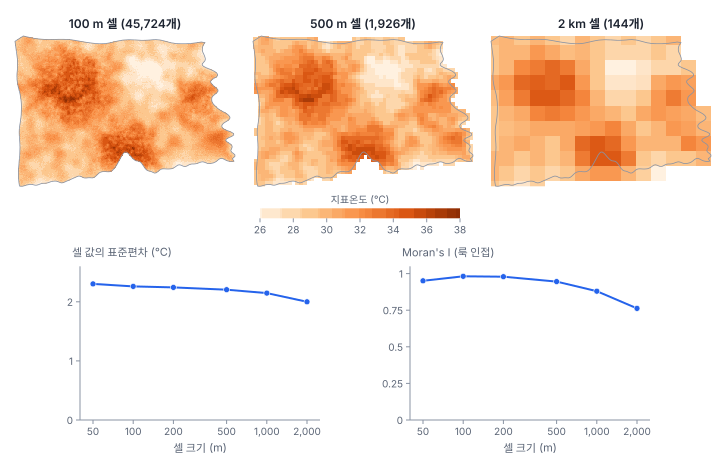

[목차](../README.md) · 이전: [39강 공간 교차검증과 머신러닝](39-spatial-cv-ml.md) · 다음: [41강 공간 분석 연구 설계](41-research-design.md)

# 40강 격자·래스터 자료와 공간통계

> 앱 지원: ◐ 격자 만들기·존 통계·Moran's I로 셀 크기에 따른 변화를 앱에서 확인함. 픽셀 단위 계산과 정확도 평가는 코드로 함 · 읽는 시간 약 40분

## 이 강에서 얻는 것

- 래스터를 격자 단위의 지역 자료로 보고, 셀 크기(해상도)를 바꿀 때 분산과 자기상관이 어떻게 바뀌는지 앎(지원 효과)
- 분산이 "블록 사이 + 블록 안"으로 나뉘는 관계를 손으로 확인함
- 이웃한 픽셀이 독립이 아니라서 픽셀 수가 정보의 양이 아니라는 것(유효 표본 크기)을 앎
- 원격탐사 산출물의 정확도 평가에서 자기상관이 일으키는 함정과, 확률 표본에 의한 평가의 원칙을 앎
- 큰 래스터를 분석할 때 쓰는 계산 전략을 앎

## 들어가는 질문

한빛시의 지표온도 래스터는 50 m 셀 181,637개(시 안 육지)임. 이것을 행정동 150개로 요약하면 무엇을 잃는가? 1 km 격자로 요약하면? 그리고 이 래스터에서 픽셀 400개를 뽑아 "n = 400"으로 통계를 내도 되는가?

1강에서 래스터를 존 통계로 행정동에 옮겼고, 3강에서 단위를 바꾸면 결과가 바뀌는 문제(MAUP)를 봤음. 이 강은 그 이야기를 래스터 자체의 성질로 다시 봄.

## 1. 래스터는 격자 위의 지역 자료

래스터의 각 셀은 일정한 넓이를 대표하는 값임(1강의 지원). 그래서 래스터는 10~13강의 지역 자료와 같은 틀로 다룰 수 있음. 차이는 두 가지임.

- **이웃이 규칙적임**: 룩 인접(변을 공유하는 4개)이나 퀸 인접(꼭짓점까지 8개)이 격자에서 바로 정해짐. 가중치를 따로 만들 필요 없이 배열을 한 칸씩 밀어서 공간시차를 계산할 수 있음
- **셀이 아주 많음**: 한빛시 50 m 래스터의 셀 18만 개로 n × n 가중치 행렬을 만들면 330억 칸임. 성긴 행렬이나 배열 연산, 집계를 써야 함(5절)

## 2. 셀 크기를 바꾸면: 지원 효과

### 블록 평균과 분산의 분해

50 m 셀을 k × k개씩 묶어 평균하면 더 큰 셀의 래스터가 됨. 이때 원래 분산은 정확히 둘로 나뉨.

$$
\underbrace{\sigma^2_{\text{픽셀}}}_{\text{전체}} = \underbrace{\sigma^2_{\text{블록 사이}}}_{\text{큰 셀 값의 분산}} + \underbrace{\overline{\sigma^2_{\text{블록 안}}}}_{\text{평균에 묻힌 몫}}
$$

지구통계에서는 이것을 **크리게의 관계**(Krige's relation)라 하고, 블록 안의 분산은 베리오그램을 블록 안에서 평균한 값 γ̄(B, B)(22강)에서 픽셀 자체의 γ̄(v, v)를 뺀 값으로 계산됨. 큰 셀의 값은 작은 셀보다 덜 흩어지는데, 이것이 **지원 효과**(support effect)임.

### 손으로 해 보기: 4 × 4 픽셀

| | 1열 | 2열 | 3열 | 4열 |
|---|---|---|---|---|
| 1행 | 30 | 31 | 33 | 34 |
| 2행 | 31 | 32 | 34 | 35 |
| 3행 | 28 | 29 | 31 | 31 |
| 4행 | 29 | 30 | 32 | 33 |

2 × 2 블록 넷의 평균은 왼쪽 위 31.0, 오른쪽 위 34.0, 왼쪽 아래 29.0, 오른쪽 아래 31.75임.

- 전체 픽셀 16개의 분산(모분산): 3.7461
- 블록 평균 넷의 분산: 3.1992
- 블록 안 분산의 평균: (0.5 + 0.5 + 0.5 + 0.6875) / 4 = 0.5469
- 3.1992 + 0.5469 = 3.7461. 블록으로 묶으면 0.5469만큼의 변동이 사라짐

### 한빛시 지표온도



| 셀 크기 | 셀 수 | 표준편차(℃) | 범위(℃) | 블록 사이 분산 | 묻힌 분산 | Moran's I (룩) |
|---|---|---|---|---|---|---|
| 50 m | 181,637 | 2.302 | 22.31~39.20 | 5.298 | 0 | 0.951 |
| 100 m | 45,724 | 2.259 | 23.08~38.44 | 5.102 | 0.196 | 0.981 |
| 200 m | 11,584 | 2.243 | 23.54~37.80 | 5.026 | 0.272 | 0.979 |
| 500 m | 1,926 | 2.204 | 23.86~37.05 | 4.885 | 0.413 | 0.945 |
| 1 km | 508 | 2.147 | 24.08~35.93 | 4.648 | 0.650 | 0.880 |
| 2 km | 144 | 1.999 | 24.97~35.02 | 4.181 | 1.117 | 0.762 |

블록 사이 분산은 셀 면적으로 가중한 값이고(가장자리 블록은 육지 셀이 적음), 묻힌 분산은 50 m의 분산 5.298에서 뺀 것임.

- **범위가 크게 줄어듦**: 가장 뜨거운 곳은 50 m에서 39.20℃지만 2 km에서는 35.02℃임. "최고 기온 지점"이나 "38℃ 넘는 면적" 같은 극값 지표는 해상도에 크게 의존함
- **분산은 조금만 줄어듦**: 2 km로 묶어도 분산의 79%(4.181 / 5.298)가 남음. 한빛시 지표온도의 변동 대부분이 수 km에 걸친 큰 경향이기 때문임(38강의 긴 상관거리)
- **Moran's I는 단조롭지 않음**: 50 m에서 100 m로 가면서 오히려 커짐(0.951 → 0.981). 50 m 픽셀에는 이웃과 상관없는 잡음(21강의 너깃)이 섞여 있고, 2 × 2로 평균하면 그 잡음이 줄기 때문임. 그 뒤로는 셀이 커질수록 이웃 셀의 중심이 멀어져 작아짐(2 km에서 0.762)
- 자기상관의 크기는 "몇 m 떨어진 이웃과의 닮음"이므로, 셀 크기가 다른 두 연구의 Moran's I를 그대로 비교하면 안 됨

## 3. 픽셀 수는 정보의 양이 아님: 유효 표본 크기

자기상관이 있으면 이웃 픽셀은 거의 같은 정보를 줌. 그래서 n개 픽셀의 평균은 독립 표본 n개의 평균보다 덜 정확함. 평균의 분산이 독립 표본 몇 개의 분산과 같은지를 **유효 표본 크기**(effective sample size)라 함.

### 손으로 해 보기: 1차 자기회귀

한 줄로 늘어선 값들이 1차 자기회귀(이웃 상관 ρ)를 따르면, n이 클 때 유효 표본 크기는 대략 다음과 같음.

$$
n_{\text{eff}} \approx n \frac{1 - \rho}{1 + \rho}
$$

- n = 100, ρ = 0.5: 100 × 0.5 / 1.5 = 33.3
- n = 100, ρ = 0.8: 100 × 0.2 / 1.8 = 11.1
- n = 400, ρ = 0.95: 400 × 0.05 / 1.95 = 10.3. 400개를 재도 독립 관측 10개 남짓의 정보임

### 한빛시: 400픽셀로 시 평균 추정하기

400픽셀로 시 전체의 평균 지표온도(30.454℃)를 추정하는 일을 세 가지 배치로 2,000번씩 했음.


| 배치 | 실제 RMSE | 순진한 표준오차 s/√400 | 95% 구간 포함률 | 유효 표본 크기 |
|---|---|---|---|---|
| 시 전체에서 무작위 400픽셀 | 0.113 | 0.115 | 0.954 | 414 |
| 5 × 5 묶음 16개(250 m 정사각형) | 0.545 | 0.110 | 0.316 | 17.8 |
| 20 × 20 한 덩어리(1 km 정사각형) | 2.136 | 0.040 | 0.033 | 1.2 |

유효 표본 크기는 픽셀 분산(5.298)을 실제 평균제곱오차로 나눈 것임.

- 무작위 400픽셀은 독립 표본처럼 행동함(유효 표본 크기 414). 38강의 확률 표본임
- 1 km 정사각형 하나의 400픽셀은 독립 픽셀 1.2개만큼의 정보임. 덩어리 안의 픽셀은 거의 같은 값이라 s가 작고, 그래서 순진한 표준오차(0.040)는 오히려 가장 작음. 95% 구간이 참 평균을 포함한 비율은 3.3%뿐임
- 원격탐사 연구에서 "현장 조사 구역 몇 곳의 픽셀 수천 개"로 통계 검정을 하면 이 문제가 그대로 생김. 단위는 픽셀이 아니라 조사 구역임

## 4. 정확도 평가와 자기상관

원격탐사로 만든 분류 지도(예: 고온 지역 지도)의 정확도는 참값(현장 조사나 고해상도 자료)과 비교해 평가함. 흔한 방법은 훈련용으로 그린 구역의 픽셀을 무작위로 나눠 일부를 평가에 쓰는 것인데, 3절과 39강의 문제가 겹쳐 정확도가 부풀려짐.

한빛시에서 지표온도 32℃ 이상인 픽셀(시 육지의 24.2%)을 고온으로 놓고, 39강의 공변량(인구밀도, 고령인구 비율, 해안·도로까지 거리)으로 랜덤 포레스트 분류기를 학습했음. 훈련 자료는 시 안에 무작위로 놓은 500 m 정사각형 구역 40개의 픽셀 4,000개임. 40개 구역 가운데 고온과 저온이 섞인 구역은 11개뿐이고 나머지는 한쪽뿐임.

| 평가 방법 | 전체 정확도 |
|---|---|
| 훈련 픽셀을 무작위로 나눈 5겹 교차검증 | 0.955 |
| 훈련 구역 단위로 나눈 5겹 교차검증 | 0.937 |
| 시 전체에서 무작위로 뽑은 독립 표본 1,000픽셀 | 0.888 (95% 0.868~0.908) |
| 실제 지도 정확도(시 육지 전체) | 0.887 |

- 픽셀을 무작위로 나누면 평가 픽셀 바로 옆의 픽셀이 학습에 들어가 0.955로 부풀려짐
- 구역 단위로 나눠도 0.937로 여전히 높음. 훈련 구역 40개는 대부분 한쪽 범주뿐인 "쉬운" 곳이고, 고온과 저온의 경계처럼 어려운 곳을 충분히 담지 못했기 때문임. 교차검증은 훈련 자료가 대표하는 범위 안의 성능만 평가함
- 시 전체의 확률 표본은 0.888로 실제(0.887)와 맞음. 이 표본에서 고온 범주의 생산자 정확도(재현율)는 0.805, 사용자 정확도(정밀도)는 0.756으로, 시 전체 픽셀로 구한 실제 값(0.817, 0.742)과 가까움. 예측 고온 면적(26.6%)이 실제(24.2%)보다 컸음

그래서 원격탐사의 정확도 평가 지침(Stehman 2009; Olofsson 외 2014)은 **훈련과 따로, 지도 전체에서 확률 표본으로 뽑은 평가 자료**를 쓰고, 표본 설계에 맞는 추정량으로 정확도와 면적을 추정하라고 권함. 드물게 나타나는 범주는 지도의 범주로 층화해 충분히 뽑음.

## 5. 큰 래스터를 다루는 전략

| 전략 | 내용 | 주의 |
|---|---|---|
| 집계 | 분석 목적에 맞는 셀 크기로 묶음(2절) | 지원 효과와 MAUP. 셀 크기를 밝히고 민감도를 봄 |
| 표본 추출 | 확률 표본으로 픽셀을 뽑아 분석함(38강) | 설계에 맞는 추정량 |
| 배열 연산 | 이웃 합·평균을 배열을 밀어서 계산함. 국지 Gi*의 분자는 이동 창 합(합성곱)으로 계산할 수 있음 | 가장자리와 결측 처리 |
| 성긴 행렬 | 이웃만 저장한 가중치로 Moran's I, 공간 회귀 | 공간 회귀의 행렬식 계산은 근사(LeSage & Pace 2009) |
| 확장 가능한 공간 모형 | 최근접 이웃 가우스 과정(NNGP; Datta 외 2016), 베키아 근사, 고정 순위 크리깅(FRK), INLA-SPDE(36강) | 근사의 정도를 확인함 |
| 타일 나누기 | 큰 영역을 겹치는 타일로 나눠 따로 처리 | 타일 경계의 이음매 |

픽셀 18만 개에 LISA를 하면 18만 번의 검정이 됨. 유의수준 0.05면 무작위 자료에서도 9천 개 넘는 픽셀이 "유의"하게 나옴(12강의 다중검정). 래스터의 국지 통계는 FDR 보정을 하고, 해석할 단위(구역, 격자)로 집계해 보는 것이 좋음.

## 해 보기: GeoStat에서 셀 크기에 따른 변화 보기

1. `hanbit_dong.gpkg`와 `hanbit_lst.tif`를 엶
2. `hanbit_dong`을 고른 채 **공간 분석 → 격자 만들기 (정사각·육각)…** 메뉴에서 범위 `레이어: hanbit_dong`, 정사각형, 셀 크기 `500`, **폴리곤과 겹치는 셀만 남기기**와 **만든 뒤 바로 존 통계 계산**(래스터 `hanbit_lst`)을 켜고 **만들기…** 단추로 저장함
   - 확인: 격자 1,934개에 `ZS_MEAN` 열이 붙음
3. 새 격자 레이어를 고른 채 **공간 분석 → 공간가중치 만들기…** 메뉴로 **퀸 인접 (Queen)** 가중치를 만들고, **공간 분석 → Moran's I · Moran 산점도…** 메뉴에서 변수 `ZS_MEAN`, 순열 999번으로 **계산**함
   - 확인: Moran's I 0.9244, 유사 p 0.001
4. 셀 크기 `1000`, `2000`으로 2~3을 반복함
   - 확인: 1 km 격자 511개 0.8393, 2 km 격자 135개 0.6859
5. `hanbit_dong`에 존 통계(평균)와 퀸 가중치로 같은 계산을 함
   - 확인: 행정동 150개 0.8021
6. 네 레이어의 `ZS_MEAN`을 각각 분위수 5계급으로 칠해 나란히 놓고, 뜨거운 곳의 크기와 모양이 어떻게 바뀌는지 봄. 계급 경계는 레이어마다 따로 정해지므로, 값의 크기는 속성 테이블에서 `ZS_MEAN`의 최댓값과 최솟값으로 비교함

앱의 격자는 행정동 범위의 왼쪽 위에서 시작하고 시 경계에 걸친 셀도 남기므로, 래스터를 블록으로 묶은 2절의 표(래스터 원점 기준)와 셀 수와 값이 조금 다름.

### 코드로: 블록 평균, 분산 분해, 유효 표본 크기

```python
import geopandas as gpd
import numpy as np
import rasterio
import shapely

dong = gpd.read_file("book/data/hanbit_dong.gpkg")
with rasterio.open("book/data/hanbit_lst.tif") as r:
    z = r.read(1).astype(float)
    tr = r.transform
rows, cols = np.indices(z.shape)
X, Y = tr.c + (cols + 0.5) * 50, tr.f - (rows + 0.5) * 50
z[~((z > -9000) & shapely.contains_xy(dong.union_all(), X, Y))] = np.nan   # 시 안 육지만
total = np.nanvar(z)

for k in (2, 10, 40):                                   # 100 m, 500 m, 2 km
    b = z.reshape(z.shape[0] // k, k, z.shape[1] // k, k).swapaxes(1, 2).reshape(z.shape[0] // k, z.shape[1] // k, -1)
    n = (~np.isnan(b)).sum(-1)
    m = np.where(n > 0, np.nansum(b, -1) / np.maximum(n, 1), np.nan)   # 블록 평균 (육지 셀이 없으면 NaN)
    ok = n > 0
    wm = (m[ok] * n[ok]).sum() / n[ok].sum()
    between = (n[ok] * (m[ok] - wm) ** 2).sum() / n[ok].sum()
    print(f"{k * 50} m: 블록 {ok.sum():,}개, 표준편차 {m[ok].std():.3f}, 블록 사이 {between:.3f} + 블록 안 {total - between:.3f} = {total:.3f}")

# 20×20 한 덩어리 400픽셀의 순진한 표준오차와 실제 오차
rng = np.random.default_rng(40)
est, se = [], []
while len(est) < 500:
    i, j = rng.integers(0, z.shape[0] - 20), rng.integers(0, z.shape[1] - 20)
    w = z[i:i + 20, j:j + 20]
    if np.isnan(w).any():
        continue
    est.append(w.mean())
    se.append(w.std(ddof=1) / 20)
mse = np.mean((np.array(est) - np.nanmean(z)) ** 2)
print(f"순진한 표준오차 {np.mean(se):.3f}, 실제 RMSE {np.sqrt(mse):.3f}, 유효 표본 크기 {total / mse:.1f}")
```

- 확인: 100 m 블록 45,724개 표준편차 2.259, 블록 사이 5.102 + 블록 안 0.196 = 5.298. 500 m 1,926개 2.204, 4.885 + 0.413. 2 km 144개 1.999, 4.181 + 1.117. 덩어리 400픽셀의 순진한 표준오차 0.040, 실제 RMSE 2.246, 유효 표본 크기 1.1(500번이라 2,000번 한 3절의 표와 조금 다름)

## 헷갈리는 쌍

- **해상도 vs 지원**: 셀의 크기 대 값 하나가 대표하는 넓이. 위성 센서의 실제 지원(점 확산 함수)은 표시된 셀 크기보다 클 수 있음
- **블록 사이 분산 vs 픽셀 분산**: 큰 셀 값의 흩어짐 대 원래 픽셀의 흩어짐. 차이는 평균에 묻힌 블록 안 분산임
- **픽셀 수 vs 유효 표본 크기**: 잰 개수 대 그 정보가 독립 표본 몇 개에 해당하는가
- **교차검증 정확도 vs 지도 정확도**: 훈련 자료가 대표하는 범위 안의 성능 대 지도 전체의 성능. 뒤의 것은 지도 전체에서 뽑은 확률 표본으로 추정함
- **집계 vs 표본 추출**: 셀을 묶어 줄임(값의 뜻이 바뀜) 대 셀을 골라 줄임(값의 뜻은 그대로, 설계가 필요함)

## 흔한 실수와 심사 지적

- **픽셀을 독립 관측으로 놓고 검정함**
  - 지적: "픽셀 수천 개가 독립 관측입니까?"
  - 대응: 분석 단위를 조사 구역으로 두거나, 공간 자기상관을 반영한 모형·유효 표본 크기·블록 부트스트랩(39강)으로 불확실성을 구함
- **훈련 구역의 픽셀을 나눠 정확도를 평가함**
  - 대응: 훈련과 따로 확률 표본으로 평가 자료를 모으고, 오차 행렬과 범주별 정확도, 면적 추정을 함께 보고함(Olofsson 외 2014)
- **셀 크기가 다른 자료의 자기상관이나 극값을 그대로 비교함**
  - 대응: 같은 셀 크기로 맞춘 뒤 비교하고, 셀 크기를 밝힘
- **해상도를 높이면 늘 더 정확하다고 가정함**
  - 대응: 작은 셀은 잡음(너깃)이 크고 위치 오차에 민감함. 질문의 척도에 맞는 셀 크기를 고름
- **래스터 전체에 LISA를 하고 유의한 픽셀을 그대로 지도로 냄**
  - 대응: 다중검정을 보정하고, 해석 단위로 묶어 봄

## 보고서에는 이렇게 씀

> 50 m 지표온도 산출물(시 육지 181,637셀)을 100 m, 500 m, 2 km 블록 평균으로 집계해 해상도에 따른 민감도를 확인하였다. 셀 값의 표준편차는 50 m 2.30℃에서 2 km 2.00℃로 줄었고, 최고값은 39.2℃에서 35.0℃로 낮아졌다. 따라서 극값 지표는 해상도를 함께 명시하였다. 고온 지역(32℃ 이상) 분류 지도의 정확도는 훈련 자료와 별도로 시 전체에서 단순 무작위로 추출한 1,000픽셀로 평가하였으며, 전체 정확도는 0.888(95% 신뢰구간 0.868~0.908), 같은 표본에서 고온 범주의 생산자 정확도와 사용자 정확도는 각각 0.80과 0.76이었다. 훈련 구역 내 픽셀을 무작위로 나눈 교차검증 정확도(0.955)는 공간 자기상관 때문에 과대 추정되므로 보고하지 않았다.

적어야 할 항목은 다음과 같음.

- 원자료의 해상도와 출처, 집계한 셀 크기와 방법(평균, 면적 가중)
- 해상도에 따른 민감도(분산, 극값, 자기상관)
- 정확도 평가 자료의 설계(확률 표본인지, 층화 여부, 표본 수)와 추정량
- 픽셀을 단위로 한 검정이면 자기상관의 처리 방법

## 요약

- 래스터는 규칙적인 격자 위의 지역 자료임. 셀을 묶으면 분산이 "블록 사이 + 블록 안"으로 나뉘고, 블록 안의 몫이 사라짐(지원 효과)
- 한빛시 지표온도는 2 km로 묶어도 분산의 79%가 남았지만 최고값은 39.2℃에서 35.0℃로 낮아졌음. Moran's I는 셀 크기에 따라 0.76~0.98로 바뀌었음
- 붙어 있는 픽셀은 같은 정보를 반복함. 1 km 정사각형 하나의 400픽셀은 독립 픽셀 1.2개만큼의 정보였고, 순진한 95% 구간은 3.3%만 참값을 포함했음
- 분류 정확도는 훈련 픽셀을 나눈 교차검증(0.955)이 실제(0.887)를 부풀렸고, 지도 전체의 확률 표본(0.888)이 실제와 맞았음
- 큰 래스터는 집계, 표본 추출, 배열 연산, 성긴 행렬, 확장 가능한 모형으로 다루고, 국지 통계의 다중검정에 주의함

## 핵심 용어

| 한글 | 영문 | 비고 |
|---|---|---|
| 해상도 | Resolution | 셀 크기 |
| 지원 효과 | Support Effect | 1강의 지원 |
| 지원 변경 | Change of Support | |
| 크리게의 관계 | Krige's Relation | 분산의 분해 |
| 블록 평균 | Block Average | 집계 |
| 유효 표본 크기 | Effective Sample Size | |
| 정확도 평가 | Accuracy Assessment | |
| 오차 행렬 | Error (Confusion) Matrix | |
| 생산자 정확도 / 사용자 정확도 | Producer's / User's Accuracy | 재현율 / 정밀도 |
| 최근접 이웃 가우스 과정 | Nearest-Neighbor Gaussian Process (NNGP) | Datta 외 2016 |
| 고정 순위 크리깅 | Fixed Rank Kriging (FRK) | |

## 원전과 더 읽을거리

**원전**

- Atkinson, P. M., & Tate, N. J. (2000). Spatial scale problems and geostatistical solutions: A review. *The Professional Geographer*, 52(4), 607–623.
- Gotway, C. A., & Young, L. J. (2002). Combining incompatible spatial data. *Journal of the American Statistical Association*, 97(458), 632–648.
- Stehman, S. V. (2009). Sampling designs for accuracy assessment of land cover. *International Journal of Remote Sensing*, 30(20), 5243–5272.
- Olofsson, P., Foody, G. M., Herold, M., Stehman, S. V., Woodcock, C. E., & Wulder, M. A. (2014). Good practices for estimating area and assessing accuracy of land change. *Remote Sensing of Environment*, 148, 42–57.
- Datta, A., Banerjee, S., Finley, A. O., & Gelfand, A. E. (2016). Hierarchical nearest-neighbor Gaussian process models for large geostatistical datasets. *Journal of the American Statistical Association*, 111(514), 800–812.

**더 읽을거리**

- Journel, A. G., & Huijbregts, C. J. (1978). *Mining Geostatistics*. Academic Press. 지원 효과와 분산의 분해
- Woodcock, C. E., & Strahler, A. H. (1987). The factor of scale in remote sensing. *Remote Sensing of Environment*, 21(3), 311–332.
- Dale, M. R. T., & Fortin, M.-J. (2009). Spatial autocorrelation and statistical tests: Some solutions. *Journal of Agricultural, Biological, and Environmental Statistics*, 14(2), 188–206. 유효 표본 크기
- Heaton, M. J., Datta, A., Finley, A. O., Furrer, R., Guinness, J., Guhaniyogi, R., … Zammit-Mangion, A. (2019). A case study competition among methods for analyzing large spatial data. *Journal of Agricultural, Biological, and Environmental Statistics*, 24(3), 398–425.
- Pebesma, E., & Bivand, R. (2023). *Spatial Data Science: With Applications in R*. Chapman & Hall/CRC. 래스터·데이터 큐브

## 연습

1. 손계산의 4 × 4 픽셀을 4 × 4 블록 하나로 묶으면 블록 사이 분산과 블록 안 분산은 각각 얼마인가? 1 × 1 블록(묶지 않음)이면?

2. 어떤 연구가 공원 다섯 곳에서 각각 100 m × 100 m 안의 10 m 픽셀을 모두 써서(공원마다 100픽셀, 모두 500픽셀) "공원의 지표온도가 주변보다 1.2℃ 낮다(t = 15.3, p < 0.001)"고 보고함. 무엇이 문제이고 어떻게 다시 분석하겠는가?

3. 한빛시에서 50 m의 Moran's I(0.951)가 100 m(0.981)보다 작았음. 위성 센서의 잡음이 더 큰 자료였다면 이 차이는 어떻게 될 것으로 예상하는가?

4. 고온 지역 분류 지도의 정확도를 평가하려고 함. 고온 범주는 지도의 24% 정도이고, 예산은 평가 픽셀 300개임. 표본 설계를 제안하시오.

5. 2 km로 집계한 지표온도와 행정동 단위 출동률의 관계를 분석하려 함. 해상도와 단위에 관해 보고서에 무엇을 적겠는가?

<details>
<summary>해답</summary>

1. 블록 하나로 묶으면 블록 평균이 하나뿐이라 블록 사이 분산은 0이고, 블록 안 분산이 전체 3.7461임. 1 × 1 블록이면 블록이 픽셀 자체라 블록 사이 분산이 3.7461, 블록 안 분산이 0. 분해의 두 끝임.

2. 같은 공원 안의 픽셀 100개는 서로 닮아 독립 관측이 아님. 유효 표본 크기는 공원 수(5)에 가까움. 분석 단위를 공원으로 두어 공원 다섯 곳의 평균과 각 공원 주변의 평균을 비교하고(짝지은 비교, 자유도 4), 공원 크기·위치 같은 차이를 함께 봄. 픽셀을 그대로 쓰려면 공원을 랜덤효과로 둔 혼합 모형이나 공간 오차 모형을 쓰고, 픽셀 해상도와 센서의 실제 지원(10 m 표시라도 실제는 더 클 수 있음)을 밝힘.

3. 잡음(너깃)이 클수록 50 m 픽셀끼리의 닮음이 줄어 50 m의 Moran's I가 더 작아지고, 2 × 2 평균으로 잡음이 줄어든 100 m와의 차이가 더 커질 것임. 잡음은 평균하면 줄지만 큰 경향은 남기 때문임. 그래서 픽셀 단위의 자기상관은 "현상의 연속성"과 "측정 잡음"을 함께 반영함.

4. 지도의 범주(고온, 비고온)로 층화한 무작위 추출을 제안함. 면적 비례(고온 72, 비고온 228)보다 고온 범주를 더 뽑아(예: 각 150) 고온의 사용자 정확도를 정밀하게 추정하고, 정확도와 면적은 층의 면적 비율로 가중해 추정함(Olofsson 외 2014). 훈련 구역과 겹치는 픽셀은 모집단 틀에서 빼거나, 빼지 않더라도 훈련과 독립으로 뽑음. 오차 행렬, 전체·생산자·사용자 정확도와 그 표준오차를 보고함.

5. 지표온도 원자료의 해상도(50 m)와 집계 셀 크기(2 km), 집계 방법(블록 평균, 면적 가중), 2 km 셀과 행정동을 잇는 방법(겹침 면적 가중 등)을 적음. 2 km에서는 최고값과 국지 차이가 줄어 관계의 기울기가 달라질 수 있으므로, 행정동 존 통계(50 m 원자료에서 직접)와 다른 셀 크기의 결과를 민감도 분석으로 함께 보고함(3강의 MAUP). 단위 사이의 관계를 개인 수준으로 해석하지 않는다는 점도 적음.

</details>

---

[목차](../README.md) · 이전: [39강 공간 교차검증과 머신러닝](39-spatial-cv-ml.md) · 다음: [41강 공간 분석 연구 설계](41-research-design.md)
