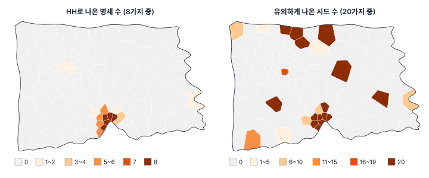

[목차](../README.md) · 이전: [40강 격자·래스터 자료와 공간통계](40-raster-grid.md) · 다음: [42강 쓰고 읽기](42-writing-reading.md)

# 41강 공간 분석 연구 설계

> 앱 지원: ● 명세를 바꿔 가며 회귀와 국지 통계를 다시 하는 민감도 분석, 프로젝트 저장과 보고서 내보내기까지 앱에서 함 · 읽는 시간 약 45분

## 이 강에서 얻는 것

- 질문 → 단위 → 자료 → 가중치 → 방법의 순서로 공간 분석을 설계하고, 그 결정을 미리 적어 둘 수 있음
- 분석자의 선택에 결과가 얼마나 기대는지를 다중 우주(명세 곡선) 분석으로 보여 줄 수 있음
- 핫스폿이 가중치, 다중검정 보정, 순열 난수에 얼마나 강건한지 점검할 수 있음
- 재현할 수 있게 분석을 기록하는 방법(시드, 프로젝트 파일, 코드)을 앎
- 공간 관찰 자료로 인과를 주장할 때의 한계와 그 한계를 줄이는 설계를 앎

## 들어가는 질문

두 사람이 같은 한빛시 자료로 "지표온도가 1℃ 높은 동은 출동률이 얼마나 높은가"를 분석했음. 한 사람은 1만 명당 1.04, 다른 사람은 3.14라고 보고함. 둘 다 계산은 맞았음. 무엇이 달랐는가? 그리고 독자는 어느 쪽을 믿어야 하는가?

이 책은 지금까지 방법 하나하나를 다뤘음. 이 강은 그 방법들을 한 연구로 엮을 때 내려야 하는 결정과, 그 결정이 결과를 얼마나 바꾸는지를 다룸.

## 1. 질문에서 방법까지

공간 분석의 결정은 다음 순서로 내림. 앞의 결정이 뒤의 선택지를 정하므로 거꾸로 하면 안 됨.

| 단계 | 결정할 것 | 관련 강 |
|---|---|---|
| 1. 질문 | 기술(어떤 모양인가), 탐색(어디가 다른가), 설명(무엇과 관련되는가), 예측(관측하지 않은 곳은), 인과(바꾸면 달라지는가) | 0, 41 |
| 2. 단위 | 점, 행정구역, 격자, 래스터. 질문의 척도와 MAUP | 1, 3, 40 |
| 3. 자료 | 시기, 지원, 분모, 결측, 표본 설계 | 4, 14, 38 |
| 4. 공간 관계 | 인접, 거리, k-최근접, 커널. 무엇이 "이웃"인가 | 10 |
| 5. 방법 | 전역·국지 자기상관, 점 패턴, 지구통계, 공간 회귀, 군집, 시공간, 베이즈 | 11~37 |
| 6. 검증 | 진단, 민감도 분석, 교차검증, 독립 검증 | 23, 39, 41 |
| 7. 보고 | 방법·결과·한계, 재현 자료 | 42 |

### 분석 계획서

자료를 보기 전에(또는 보자마자 결과를 보기 전에) 다음을 적어 두면, 결과를 보고 선택을 바꾸는 일(뒤에 맞추기)을 막을 수 있음. 임상시험의 사전 등록과 같은 생각임(Nosek 외 2018).

- 질문과 주된 추정 대상(예: 온도편차 1℃당 출동률의 차이)
- 분석 단위와 자료의 기간, 제외 기준
- 종속변수와 그 변환(원비율인가, 건수 모형인가), 공변량과 그 선택 근거
- 공간가중치와 그 근거, 대안 가중치
- 주된 모형과 대안 모형, 유의수준과 다중검정 보정
- 순열 횟수와 난수 시드, 민감도 분석의 범위

계획에 없던 분석을 하는 것은 괜찮지만, 보고할 때 "탐색적 분석"으로 구분함.

## 2. 다중 우주 분석: 선택이 결과를 얼마나 바꾸는가

**다중 우주 분석**(multiverse analysis; Steegen 외 2016) 또는 **명세 곡선**(specification curve; Simonsohn, Simmons & Nelson 2020)은 그럴듯한 선택을 모두 조합해 분석을 되풀이하고, 결과의 분포를 보여 줌. 한빛시의 온도-출동률 관계에서 다음을 바꿨음.

- 종속변수: 원비율(출동률), EB 평활 비율(14강) — 2가지
- 공변량: 온도편차만, + 고령비율, + 고령비율 + 로그 인구밀도 — 3가지
- 모형: OLS, 공간시차(총 효과), 공간오차 — 3가지
- 공간가중치(공간 모형만): 퀸, 퀸 2차(하위 포함), 6-최근접, 거리 3 km — 4가지

명세 수는 2 × 3 × (OLS 1 + 공간시차 4 + 공간오차 4) = 54개임. 회귀는 GeoStat 엔진으로 계산해 앱과 같음(`book/fig-src/41.py`).


| 선택 | 효과의 중앙값 (범위) |
|---|---|
| 종속변수: 원비율 | 1.746 (0.962~3.140) |
| 종속변수: EB 평활 | 0.572 (0.285~1.206) |
| 공변량: 온도편차만 | 0.661 (0.285~1.050) |
| 공변량: + 고령비율 | 1.083 (0.538~1.800) |
| 공변량: + 고령비율 + 로그밀도 | 1.863 (0.784~3.140) |
| 모형: OLS / 공간시차 / 공간오차 | 0.948 / 0.996 / 0.947 |
| 가중치: 퀸 / 퀸 2차 / 6-최근접 / 거리 3 km | 1.003 / 0.996 / 1.015 / 0.929 |

- **방향과 유의성은 강건함**: 54개 명세 모두 양수이고 p < 0.05임(가장 큰 p 0.0015). "더운 동일수록 출동률이 높다"는 결론은 이 54개 명세 안에서는 흔들리지 않음
- **크기는 강건하지 않음**: 0.28에서 3.14까지 11배 차이 남. 들어가는 질문의 두 사람은 공변량(온도만 대 고령·밀도까지)과 모형·가중치가 달랐음. 아래처럼 EB 평활 비율은 종속변수로 알맞지 않으므로 원비율의 명세만 보아도 0.96~3.14로 3.3배 차이 남
- **모형과 가중치는 거의 상관없음**: 공간 모수는 −0.42~0.39였지만(절댓값이 가장 큰 −0.42는 퀸 2차 가중치에서), 온도편차의 효과는 OLS와 비슷했음(26강의 결론과 같음)
- **EB 평활 비율을 종속변수로 쓰면 효과가 3분의 1 안팎으로 줄어듦**: EB는 작은 동의 비율을 온도와 상관없는 도시 평균 쪽으로 당기므로, 잡음만이 아니라 온도에 따른 차이(신호)까지 함께 줄임(표준편차가 원비율의 0.30배, 동마다 자기 비율을 6~62%만 남김). 평활 값은 지도용 추정값이지 회귀의 종속변수가 아님. 건수를 직접 모형화하는 포아송 모형(27강, 37강)을 씀

### 손으로 해 보기: 빠진 변수 치우침

공변량의 영향은 계산으로 설명됨. 출동률을 온도편차만으로 회귀한 "짧은 식"의 기울기는 1.0433이고, 고령비율을 넣은 "긴 식"에서는 온도편차 1.7570, 고령비율 0.3670임. 고령비율을 온도편차로 회귀한 기울기 δ는 −1.9447임(더운 동은 젊음, 상관 −0.750).

$$
b_{\text{짧은}} = b_{\text{긴, 온도}} + b_{\text{긴, 고령}} \times \delta = 1.7570 + 0.3670 \times (-1.9447) = 1.0433
$$

고령비율을 빼면 "더운 동은 고령비율이 낮고, 고령비율이 낮으면 출동이 적다"는 경로가 온도의 계수에 섞여 들어가 계수가 작아짐. 이 등식은 OLS에서 늘 정확히 성립함.

어느 공변량을 넣을지는 데이터가 아니라 **질문과 인과 구조**가 정함. 인구밀도가 지표온도를 높이고(포장, 건물) 출동에도 따로 영향을 준다면 혼란 변수라 넣어야 하고, 온도가 높아서 사람들이 몰려 사는 것이라면 넣지 말아야 할 수도 있음. 이 판단을 그림으로 정리하는 것이 6절의 인과 도표임.

## 3. 핫스폿은 얼마나 강건한가

같은 생각을 국지 통계에 적용함. 출동률의 EB 비율 LISA(14강)를 가중치 4가지 × 다중검정 보정 2가지(없음, FDR)로 구해, 각 동이 High-High로 나온 횟수를 셌음. 또 퀸 가중치·보정 없음으로 고정하고 순열의 난수 시드만 20가지로 바꿨음.



| 가중치 | 보정 없음: HH / 유의 전체 | FDR: HH / 유의 전체 |
|---|---|---|
| 퀸 | 10 / 22 | 5 / 5 |
| 퀸 2차 | 13 / 32 | 7 / 8 |
| 6-최근접 | 10 / 23 | 7 / 8 |
| 거리 3 km | 16 / 31 | 10 / 15 |

- **핵심은 강건함**: 마루15·16·17·18·31동은 여덟 명세 모두에서 HH임. 14강에서 FDR 뒤에 남은 다섯 동과 같음
- **가장자리는 선택에 기댐**: 마루13동은 6번, 마루14·29·30동은 5번, 누리13동·다솜20동·마루19동은 2번, 가람29동 등 4개 동은 1번만 HH임. 이웃의 범위가 넓은 가중치(퀸 2차, 거리 3 km)일수록 HH가 많음
- **순열 난수도 결과를 바꿈**: 시드만 바꿔도 유의한 동의 수가 15~21개로 흔들림. 15개 동은 20번 모두 유의하지만, 9개 동은 시드에 따라 유의 여부가 바뀜(예: 다솜20동 20번 가운데 10번, 라온18동 12번). 앱의 시드(123456789)로는 22개임. 순열을 9,999번으로 늘리면(시드 5가지로 해 보면) 흔들리는 동이 5개로 줄지만 사라지지는 않음. 유사 p가 0.05 근처인 동은 순열을 늘려도 판정이 흔들릴 수밖에 없음

그래서 국지 통계는 "유의한 동의 목록"보다 "여러 선택에서 꾸준히 나오는 핵심"과 "선택에 따라 나오는 가장자리"를 나눠 보고하는 것이 정직함. 순열 횟수와 시드도 적음.

## 4. 재현성

같은 자료와 같은 절차로 같은 결과를 다시 얻을 수 있어야 함(재현성, reproducibility). 공간 분석에서 재현을 막는 흔한 원인은 다음과 같음(Kedron 외 2021).

- **난수**: 순열 검정, 몬테카를로, MCMC, 군집 분석의 시작점. 시드를 고정하고 적음. GeoStat은 국지 통계와 Moran's I의 순열에 시드 123456789(GeoDa 기본값)를 씀
- **가중치의 세부**: "퀸 인접"만으로는 부족함. 차수, 하위 차수 포함, 행 표준화, 섬의 처리, 거리 단위를 적음. 가중치 파일(.gal, .gwt)을 함께 냄
- **자료의 판본**: 행정 경계와 인구는 해마다 바뀜. 기준 시점과 출처, 내려받은 날짜를 적음
- **좌표계와 거리**: 거리 기반 가중치와 커널은 좌표계에 따라 값이 다름(2강)
- **소프트웨어 판본**: 같은 이름의 함수도 판본에 따라 기본값이나 계산이 다름. 35강에서 본 spreg의 패널 LM 검정 오류가 한 예임

GeoStat의 **프로젝트 파일**(.gstproj)은 열었던 자료의 경로(상대 경로), 계산 필드의 식, 가중치 명세, 분석 설정을 저장하고, 다시 열면 같은 시드로 다시 계산해 같은 결과를 냄. 프로젝트 폴더째로 옮기면 다른 컴퓨터에서도 열림. 코드로 분석한다면 스크립트, 환경 파일(예: `uv.lock`), 시드를 함께 남김. 이 책의 모든 수치가 `book/fig-src/`의 스크립트에서 나오는 것도 같은 원칙임.

## 5. 인과 주장의 한계

공간 관찰 자료로 "지표온도가 출동을 늘린다"고 말하려면 여러 장애물을 넘어야 함.

| 장애물 | 내용 | 관련 강 |
|---|---|---|
| 혼란 변수 | 온도와 출동에 함께 영향을 주는 변수(고령비율, 인구밀도, 소득) | 8, 41 |
| 생태학적 오류 | 동 단위의 관계가 개인의 관계라는 보장이 없음 | 3, 8 |
| MAUP | 단위를 바꾸면 관계의 크기가 바뀜 | 3, 40 |
| 공간 교락 | 공간 랜덤효과가 공변량과 같은 패턴을 두고 다툼 | 37 |
| 간섭(파급) | 한 동의 처치가 이웃 동의 결과에 영향을 줌. 인과 추론의 "단위끼리 서로 영향 없음" 가정이 깨짐 | 25 |
| 선택과 측정 | 출동 신고의 지역 차이, 위성 지표온도와 체감 기온의 차이 | 1, 14 |

**인과 도표**(DAG; Pearl 2009)는 변수 사이의 인과 가정을 화살표로 그려, 어떤 변수를 통제해야 하고 어떤 변수는 통제하면 안 되는지(매개 변수, 충돌 변수)를 정해 줌. 2절의 인구밀도처럼 데이터만으로는 정할 수 없는 선택을 드러내 줌.

관찰 자료로 인과에 다가가는 공간 설계는 다음과 같음.

- **고정효과 패널**: 지역마다 변하지 않는 혼란 변수를 모두 통제함(35강). 해마다 바뀌는 혼란 변수는 남음
- **이중차분**: 정책이 시행된 지역과 아닌 지역의 변화를 비교함. 이웃 지역으로의 파급을 따로 다룸(Delgado & Florax 2015)
- **공간 회귀 불연속**: 행정 경계처럼 처치가 갑자기 바뀌는 선의 양쪽을 비교함(Keele & Titiunik 2015)
- **자연 실험**: 처치가 우연에 가깝게 배정된 상황(예: 무작위 순서의 쉼터 설치)을 찾음

이런 설계가 없으면 보고서의 표현은 "관련이 있었다", "높았다"로 쓰고, "늘렸다", "효과가 있었다"는 피함(42강).

## 해 보기: GeoStat에서 민감도 분석하기

1. 8강처럼 `hanbit_dong.gpkg`, `hanbit_events.gpkg`, `hanbit_lst.tif`를 열고 `PT_CNT`, `ZS_MEAN`과 계산 필드 `출동률`, `고령비율`, `온도편차`(= `` `ZS_MEAN` - 30 ``), `로그밀도c`(= `` log(`인구` / `면적_km2`) - 8 ``)를 만듦. 14강처럼 **공간 분석 → 비율 지도 · EB 보정…** 메뉴에서 방법 **경험적 베이즈(EB) 평활**, 분자 `PT_CNT`, 분모 `인구`, 단위 **10,000당** 항목으로 `R_EB`도 만듦
2. **공간 분석 → 공간가중치 만들기…** 메뉴로 퀸 1차, 퀸 2차(하위 차수 포함), k-최근접 6, 거리 임계값 `3000`의 가중치 네 개를 만듦
   - 확인: 거리 3 km는 "평균 11.01"
3. **공간 분석 → 회귀 분석 (OLS · 공간회귀 · GWR · MGWR)…** 메뉴에서 모형 **OLS (최소제곱)**, 공간 진단의 가중치는 퀸 1차로 두고 다음을 차례로 실행함. 결과가 덮어쓰이지 않게 결과 열 접두어를 `M1`~`M4`로 바꿔 가며 실행하고, 온도편차의 계수를 표로 적음
   - `출동률` ~ `온도편차`: 1.043 (SE 0.2236)
   - `출동률` ~ `온도편차` + `고령비율`: 1.757 (SE 0.3298)
   - `출동률` ~ `온도편차` + `고령비율` + `로그밀도c`: 2.927 (SE 0.5401)
   - `R_EB` ~ `온도편차` + `고령비율`: 0.5724 (SE 0.09833)
4. 3의 두 번째 식을 모형 **공간오차 모형 (Spatial Error)**, 퀸 가중치, 접두어 `E1`로 다시 실행함
   - 확인: 1.763 (SE 0.3117). 다른 가중치로도 바꿔 봄
5. **공간 분석 → 국지 통계 (LISA · Gi\* · Local Geary)…** 메뉴에서 방법 **EB 비율 LISA**, 분자 `PT_CNT`, 분모 `인구`, 순열 999번, α 0.05로, 가중치 네 개와 보정 **없음**·**FDR (Benjamini-Hochberg)**의 여덟 조합을 실행함. 접두어는 `H1`~`H8`처럼 구분함
   - 확인: 알림의 유의한 피처 수와 범례의 High-High 수가 3절의 표와 같음(퀸·보정 없음: 유의 22, HH 10 / 퀸·FDR: 유의 5, HH 5 등)
6. **공간 분석 → 계산 필드 추가…** 메뉴로 `HH횟수` = `` (`H1_CL` == 1) * 1 + (`H2_CL` == 1) * 1 + (`H3_CL` == 1) * 1 + (`H4_CL` == 1) * 1 + (`H5_CL` == 1) * 1 + (`H6_CL` == 1) * 1 + (`H7_CL` == 1) * 1 + (`H8_CL` == 1) * 1 ``을 만들어 고유값 지도로 칠함. 3절 왼쪽 그림과 같은 무늬의 지도가 됨
7. **파일 → 프로젝트 저장** 메뉴로 `.gstproj`를 저장함. 앱을 닫았다 **파일 → 프로젝트 열기…** 로 다시 열어 같은 결과가 나오는지 확인함
8. **파일 → 분석 보고서 내보내기 (Word·HTML)…** 메뉴로 실행한 분석의 결과표를 한 문서로 저장함. 이 문서를 분석 계획서와 함께 보관함(42강)

### 코드로: 명세 곡선을 직접 만들기

```python
import contextlib
import io
import itertools
import warnings

import geopandas as gpd
import numpy as np
import pandas as pd
import spreg
from exactextract import exact_extract   # pip install exactextract (앱의 존 통계와 같은 계산)
from libpysal.weights import KNN, Queen

dong = gpd.read_file("book/data/hanbit_dong.gpkg")
ev = gpd.read_file("book/data/hanbit_events.gpkg")
j = gpd.sjoin(ev, dong[["geometry"]], predicate="within")
dong["PT_CNT"] = j.groupby("index_right").size().reindex(dong.index, fill_value=0)
dong["출동률"] = dong["PT_CNT"] / dong["인구"] * 1e4
dong["고령비율"] = dong["고령인구"] / dong["인구"] * 100
dong["로그밀도c"] = np.log(dong["인구"] / dong["면적_km2"]) - 8
dong["온도편차"] = exact_extract("book/data/hanbit_lst.tif", dong, "mean", output="pandas")["mean"].to_numpy() - 30

warnings.filterwarnings("ignore")
ws = {"퀸": Queen.from_dataframe(dong, use_index=False), "6-최근접": KNN.from_dataframe(dong, k=6)}
for w in ws.values():
    w.transform = "r"
xsets = [["온도편차"], ["온도편차", "고령비율"], ["온도편차", "고령비율", "로그밀도c"]]
rows = []
for xs, (wn, w) in itertools.product(xsets, ws.items()):
    y, X = dong[["출동률"]].to_numpy(), dong[xs].to_numpy()
    ols = spreg.OLS(y, X)
    with contextlib.redirect_stdout(io.StringIO()):            # spreg가 찍는 진행 문구를 숨김
        err = spreg.ML_Error(y, X, w)
    rows.append(("+".join(xs), "OLS", "-", ols.betas[1, 0]))
    rows.append(("+".join(xs), "공간오차", wn, err.betas[1, 0]))
spec = pd.DataFrame(rows, columns=["공변량", "모형", "가중치", "온도편차"]).drop_duplicates().sort_values("온도편차")
print(spec.round(3).to_string(index=False))
```

- 확인: OLS는 1.043, 1.757, 2.927. 공간오차(퀸)는 1.050, 1.763, 2.903. 6-최근접의 공간오차도 비슷함
- 더 해 보기: 종속변수를 EB 평활 비율로 바꾸고, `spreg.ML_Lag(..., spat_impacts="simple")`가 주는 총 효과(또는 β / (1 − ρ))를 더해 54개 명세를 다 만들어 봄

## 헷갈리는 쌍

- **재현성 vs 반복 가능성**: 같은 자료·같은 절차로 같은 결과를 얻는가 대 다른 자료(다른 도시, 다른 해)로도 같은 결론이 나오는가
- **민감도 분석 vs 다중 우주 분석**: 주된 분석에서 한두 가지를 바꿔 봄 대 그럴듯한 선택을 모두 조합해 결과의 분포를 봄
- **확증적 분석 vs 탐색적 분석**: 계획서에 미리 정한 분석 대 결과를 보며 더한 분석. 둘 다 할 수 있지만 구분해 보고함
- **혼란 변수 vs 매개 변수**: 처치와 결과에 함께 영향을 줌(통제함) 대 처치가 결과에 이르는 경로 위에 있음(총 효과를 원하면 통제하지 않음)
- **강건한 핵심 vs 선택에 기댄 가장자리**: 여러 명세에서 꾸준히 나오는 결과 대 특정 선택에서만 나오는 결과

## 흔한 실수와 심사 지적

- **결과를 보고 가중치나 단위를 고름**
  - 지적: "다른 가중치에서도 결과가 같습니까?"
  - 대응: 계획서에 주된 선택과 근거를 미리 적고, 대안의 결과를 부록에 넣음
- **평활한 비율이나 추정값을 회귀의 종속변수로 씀**
  - 대응: 건수 모형(포아송, 음이항, BYM)으로 분모와 작은 수를 직접 다룸
- **국지 통계의 유의한 지역 목록을 단 하나의 실행으로 확정함**
  - 대응: 순열 횟수와 시드를 적고, 가중치·보정을 바꾼 결과에서 꾸준히 나오는 핵심을 구분함
- **공변량을 통계적 유의성만으로 넣고 뺌**
  - 대응: 인과 도표로 혼란 변수와 매개 변수를 구분해 정하고, 근거를 적음
- **관찰 자료로 "효과", "원인", "늘렸다"라고 씀**
  - 대응: 연구 설계가 인과 추론을 뒷받침하지 않으면 연관의 언어로 씀

## 보고서에는 이렇게 씀

> 주된 분석(사전에 정한 명세)은 행정동별 출동률을 지표온도 편차와 고령비율로 회귀한 OLS 모형이었으며, 지표온도 1℃당 출동률은 1만 명당 1.76(95% 신뢰구간 1.11~2.41) 높았다. 분석자의 선택에 대한 민감도를 확인하기 위해 종속변수(원비율, EB 평활 비율), 공변량(3가지), 모형(OLS, 공간시차, 공간오차), 공간가중치(퀸 1차, 퀸 2차, 6-최근접, 거리 3 km)를 조합한 54개 명세를 추정하였다(부록 그림 S3). 지표온도의 계수는 모든 명세에서 양수이고 유의하였으나(p ≤ 0.002), 크기는 0.28~3.14로 공변량과 종속변수의 선택에 따라 크게 달랐다. 출동률의 EB 비율 LISA에서 마루구 원도심의 5개 행정동은 가중치 4가지와 다중검정 보정 여부를 조합한 8개 명세에서 모두 High-High 군집이었다. 주 분석의 순열 검정은 999회, 난수 시드 123456789로 수행하였고, 분석 프로젝트 파일과 스크립트를 보충 자료로 제공한다.

적어야 할 항목은 다음과 같음.

- 사전에 정한 주된 분석과, 나중에 더한 탐색적 분석의 구분
- 민감도 분석의 범위(무엇을 바꿨는가)와 결과의 분포
- 결과가 강건한 부분과 선택에 기댄 부분
- 시드, 순열 횟수, 소프트웨어와 판본, 재현 자료(프로젝트 파일, 코드, 가중치 파일)
- 인과 주장의 범위와 근거가 되는 설계, 또는 연관에 그친다는 한계

## 요약

- 공간 분석은 질문 → 단위 → 자료 → 공간 관계 → 방법 → 검증 → 보고의 순서로 설계하고, 주된 선택을 미리 적어 둠
- 한빛시 온도-출동률 관계의 54개 명세에서 방향과 유의성은 모두 같았지만 크기는 0.28~3.14로 달랐음. 크기를 가른 것은 공변량과 종속변수였고, 모형과 가중치는 거의 영향이 없었음
- 공변량을 빼면 계수는 "긴 식의 계수 + 빠진 변수의 계수 × δ"만큼 바뀜(1.757 + 0.367 × (−1.945) = 1.043). 무엇을 넣을지는 인과 구조로 정함
- 핫스폿은 마루구 원도심 다섯 동이 모든 명세에서 강건했고, 가장자리 동과 p가 경계에 있는 동은 가중치·보정·순열 난수에 따라 바뀌었음
- 재현을 위해 시드, 가중치의 세부, 자료와 소프트웨어 판본, 프로젝트 파일이나 코드를 남김. 관찰 자료의 결과는 설계가 뒷받침하는 만큼만 인과로 말함

## 핵심 용어

| 한글 | 영문 | 비고 |
|---|---|---|
| 분석 계획서 | Analysis Plan | 사전 등록 |
| 다중 우주 분석 | Multiverse Analysis | Steegen 외 2016 |
| 명세 곡선 | Specification Curve | Simonsohn 외 2020 |
| 민감도 분석 | Sensitivity Analysis | |
| 빠진 변수 치우침 | Omitted Variable Bias | |
| 재현성 | Reproducibility | |
| 반복 가능성 | Replicability | |
| 인과 도표 | Directed Acyclic Graph (DAG) | Pearl 2009 |
| 혼란 변수 / 매개 변수 / 충돌 변수 | Confounder / Mediator / Collider | |
| 간섭 | Interference (Spillover) | |
| 이중차분 | Difference-in-Differences | |
| 공간 회귀 불연속 | Geographic Regression Discontinuity | Keele & Titiunik 2015 |
| 자연 실험 | Natural Experiment | |

## 원전과 더 읽을거리

**원전**

- Steegen, S., Tuerlinckx, F., Gelman, A., & Vanpaemel, W. (2016). Increasing transparency through a multiverse analysis. *Perspectives on Psychological Science*, 11(5), 702–712.
- Simonsohn, U., Simmons, J. P., & Nelson, L. D. (2020). Specification curve analysis. *Nature Human Behaviour*, 4(11), 1208–1214.
- Nosek, B. A., Ebersole, C. R., DeHaven, A. C., & Mellor, D. T. (2018). The preregistration revolution. *Proceedings of the National Academy of Sciences*, 115(11), 2600–2606.
- Kedron, P., Li, W., Fotheringham, S., & Goodchild, M. (2021). Reproducibility and replicability: Opportunities and challenges for geospatial research. *International Journal of Geographical Information Science*, 35(3), 427–445.
- Keele, L. J., & Titiunik, R. (2015). Geographic boundaries as regression discontinuities. *Political Analysis*, 23(1), 127–155.
- Pearl, J. (2009). *Causality: Models, Reasoning, and Inference* (2nd ed.). Cambridge University Press.

**더 읽을거리**

- Gelman, A., & Loken, E. (2014). The statistical crisis in science. *American Scientist*, 102(6), 460–465. "갈림길의 정원"
- Delgado, M. S., & Florax, R. J. G. M. (2015). Difference-in-differences techniques for spatial data: Local autocorrelation and spatial interaction. *Economics Letters*, 137, 123–126.
- Kolak, M., & Anselin, L. (2020). A spatial perspective on the econometrics of program evaluation. *International Regional Science Review*, 43(1–2), 128–153.
- Hernán, M. A., & Robins, J. M. (2020). *Causal Inference: What If*. Chapman & Hall/CRC. 온라인 무료
- Nüst, D., Granell, C., Hofer, B., Konkol, M., Ostermann, F. O., Sileryte, R., & Cerutti, V. (2018). Reproducible research and GIScience: An evaluation using AGILE conference papers. *PeerJ*, 6, e5072.
- Brunsdon, C., & Comber, A. (2021). Opening practice: Supporting reproducibility and critical spatial data science. *Journal of Geographical Systems*, 23(4), 477–496.

## 연습

1. 2절의 손계산에서, 고령비율과 온도편차가 상관이 없었다면(δ = 0) 짧은 식과 긴 식의 온도 계수는 어떤 관계인가? 실제 연구에서 이 조건이 드문 까닭은?

2. 다중 우주 분석에서 EB 평활 비율을 종속변수로 쓴 명세의 효과가 원비율의 3분의 1 안팎이었음. "EB가 잡음을 줄였으니 EB 쪽 계수가 더 정확하다"는 주장에 답하시오.

3. 순열 999번, 시드 123456789로 유의했던 다솜20동이 시드를 바꾸자 20번 가운데 10번만 유의했음. 이 동을 보고서에 어떻게 적겠는가?

4. 분석 계획서를 쓰지 않은 채 가중치 다섯 가지로 LISA를 하고, 핫스폿이 가장 많이 나온 거리 3 km 가중치의 결과만 보고하려 함. 무엇이 문제이고 어떻게 고치겠는가?

5. "지표온도가 1℃ 오르면 출동이 1만 명당 1.76건 늘어난다"는 문장을 관찰 자료에 맞게 고쳐 쓰고, 이 주장을 인과에 가깝게 만들려면 어떤 자료나 설계가 필요한지 하나 이상 드시오.

<details>
<summary>해답</summary>

1. δ = 0이면 b_짧은 = b_긴 + b_고령 × 0 = b_긴으로, 두 계수가 같음. 빠진 변수가 처치(온도)와 상관이 없으면 빼도 치우침이 없음. 공간 자료에서는 많은 변수가 같은 공간 구조(도심-외곽)를 따르므로 서로 상관이 큼(한빛시 온도와 고령비율 −0.750). 그래서 공간 분석에서 빠진 변수 치우침은 흔하고 클 수 있음.

2. EB는 작은 동의 비율을 평균 쪽으로 당기는데, 당기는 정도가 동마다 다름(가중치 0.06~0.62). 회귀의 종속변수가 이렇게 줄어들면 기울기도 대략 평균 가중치만큼 줄어드는 치우친 추정이 됨. 잡음이 준 것이 아니라 신호까지 함께 줄인 것임. 작은 수의 잡음은 종속변수를 평활하지 말고, 건수를 포아송 우도로 모형화해(분모를 오프셋으로) 다룸. 그러면 작은 동의 정보는 덜 믿되 기울기는 치우치지 않음.

3. "다솜20동은 앱의 기본 시드에서 유의했으나 유사 p가 0.05 근처라(시드 20가지 중 10번 유의) 판정이 불안정함"이라고 적음. 핵심 군집(여러 선택에서 늘 유의)과 구분해 표나 지도에 따로 표시하고, 필요하면 순열 횟수를 늘린 결과(9,999회)를 함께 적음. 이런 동을 근거로 정책 대상을 정하지 않도록 권고함.

4. 결과를 보고 선택한 것이라 핫스폿이 과장되고, 다른 연구자가 같은 결론을 재현하기 어려움(갈림길의 정원). 가중치를 질문의 척도(예: 걸어서 닿는 거리, 행정적 인접)로 미리 정한 근거와 함께 주된 결과로 보고하고, 나머지 네 가지의 결과를 부록이나 강건성 지도(여러 명세에서 HH인 횟수)로 함께 보고함. 다중검정 보정도 함께 적용함.

5. 예: "지표온도가 1℃ 높은 행정동은 고령비율이 같을 때 출동률이 1만 명당 1.76 높았다(행정동 단위의 연관)." 인과에 가깝게 하려면 (1) 같은 동의 여러 해 자료로 동 고정효과 모형(35강)을 써서 변하지 않는 동 특성을 통제하거나, (2) 쿨링 시설·녹지 조성처럼 온도를 바꾸는 개입이 일부 지역에서만 있었던 경우를 이중차분으로 비교하거나, (3) 개인 단위 자료(나이, 소득, 거주지 온도)로 생태학적 오류를 피하는 설계가 필요함. 혼란 변수를 정하는 인과 도표도 함께 제시함.

</details>

---

[목차](../README.md) · 이전: [40강 격자·래스터 자료와 공간통계](40-raster-grid.md) · 다음: [42강 쓰고 읽기](42-writing-reading.md)
