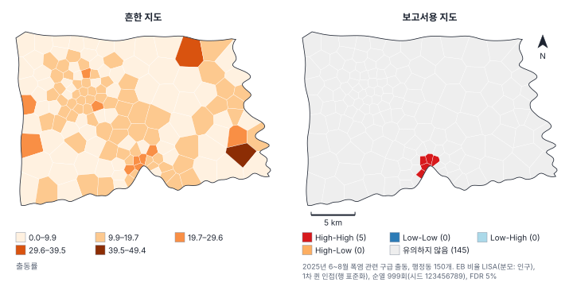

[목차](../README.md) · 이전: [41강 공간 분석 연구 설계](41-research-design.md) · 다음: 부록 A 방법 선택 지도 (집필 예정)

# 42강 쓰고 읽기

> 앱 지원: ● 분석 보고서 내보내기(Word·HTML)와 결과 카드의 보고서 저장으로 방법·결과의 근거를 모음 · 읽는 시간 약 40분

## 이 강에서 얻는 것

- 공간 분석 논문·보고서의 방법 절과 결과 절에 무엇을 어떤 순서로 쓰는지 앎
- 보고서용 지도가 갖춰야 할 요소를 알고, 흔한 지도와 비교해 고칠 수 있음
- 심사에서 자주 받는 지적 20가지와 그 대응을 이 책의 각 강과 연결해 앎
- 공간 분석 논문을 읽을 때 확인할 질문 목록을 갖고, 짧은 초록에 적용해 볼 수 있음
- GeoStat의 분석 보고서를 방법 절과 보충 자료의 근거로 쓸 수 있음

## 들어가는 질문

41강의 분석을 마쳤음. 이제 이것을 논문이나 정책 보고서로 써야 함. 심사자나 독자가 "그래서 정확히 무엇을 했는가"를 재현할 수 있으려면 무엇을 적어야 하는가? 반대로 다른 사람의 공간 분석 논문을 읽을 때는 무엇을 의심해야 하는가?

이 책의 강마다 있던 "보고서에는 이렇게 씀"과 "흔한 실수와 심사 지적"을 한데 모아, 쓰는 쪽과 읽는 쪽에서 정리함.

## 1. 방법 절 쓰기

공간 분석의 방법 절은 41강의 설계 순서를 그대로 따르면 빠짐이 적음.

| 순서 | 적을 것 | 예 (한빛시) |
|---|---|---|
| 1. 자료 | 출처, 기간, 공간 범위, 단위와 개수, 좌표계 | 2025년 6~8월 구급 출동 1,408건, 행정동 150개, EPSG:5186 |
| 2. 변수 | 정의와 단위, 분모, 변환, 결측 처리 | 출동률(1만 명당), 존 통계(면적 가중 평균) |
| 3. 공간 관계 | 가중치 유형, 차수, 표준화, 섬 처리, 대안 | 1차 퀸 인접, 행 표준화, 섬 없음 |
| 4. 방법 | 통계량·모형, 추정 방법, 모형 선택 근거 | EB 비율 LISA, 공간오차 모형(최대우도) |
| 5. 추론 | 순열 횟수, 시드, 유의수준, 다중검정 보정, 표준오차의 종류 | 999회, 시드 123456789, FDR 5% |
| 6. 민감도 | 바꿔 본 선택과 그 범위 | 가중치 4가지, 공변량 3가지 |
| 7. 도구 | 소프트웨어와 판본, 재현 자료 | GeoStat(판본), Python 패키지 판본, 프로젝트 파일 |

방법 절은 "무엇을 했는가"를 과거형으로 쓰고, 선택의 근거를 한 문장씩 붙임. "공간가중치는 퀸 인접을 사용하였다"보다 "행정동 간 출동 자원의 공유가 경계를 맞댄 동 사이에서 주로 일어나므로 1차 퀸 인접을 사용하였다"가 심사자의 질문을 미리 막음.

## 2. 결과 절 쓰기

- **효과의 크기와 불확실성을 함께 씀**: "유의하였다(p < 0.05)"만 쓰지 않고, 계수와 신뢰구간(또는 신용구간)을 단위와 함께 씀. p값은 자료가 가정한 모형과 얼마나 맞지 않는지를 나타낼 뿐, 효과의 크기나 중요성을 재지 않음(Wasserstein & Lazar 2016)
- **공간 모형의 계수는 해석할 수 있는 양으로 바꿈**: 공간시차 모형은 직접·간접·총 효과(25강), 포아송 모형은 비율(exp(β) − 1), GWR은 지역 계수의 분포와 지도(29강)
- **국지 통계는 핵심과 가장자리를 나눔**: 유의한 지역의 개수와 목록, 보정 방법, 여러 명세에서 꾸준한 핵심(41강)
- **표는 비교를 위해 만듦**: 모형 비교표는 같은 표본, 같은 종속변수의 모형끼리 놓고, 적합도 지표(AIC, 로그우도)의 계산 방식이 같은지 확인함
- **원자료를 함께 줌**: 비율이면 사건 수와 분모를, 평활 값이면 원비율을 함께 줌

### 지도

왼쪽 지도는 흔히 보는 실수를 모았음. 원비율을 등간격 5계급(0~9.87, ~19.74, ~29.62, ~39.49, ~49.36)으로 나눠 계급별 동 수가 70, 68, 10, 1, 1개로, 150개 동 가운데 138개(92%)가 옅은 두 계급에 몰림. 가장 진한 색의 동은 인구 1,013명에 출동 5건인 다솜23동임(14강). 범례에는 단위도, 계급 방법도, 자료의 기간도 없음.

보고서용 지도에 넣을 것은 다음과 같음.

- 무엇을 칠했는가: 변수 이름과 단위, 기간, 계급 방법과 경계(5강), 군집 지도면 유형별 개수
- 어떻게 계산했는가: 방법, 가중치, 순열·시드, 보정을 주석으로
- 어디인가: 축척 막대, 방위(북쪽이 위가 아니거나 독자가 지역을 모를 때), 필요하면 위치도
- 불확실성: 평활·추정 지도라면 구간 폭이나 초과 확률 지도를 함께(36~37강)
- 색: 0이나 1을 기준으로 하는 값(잔차, 상대위험)은 발산 색, 크기는 순차 색. 색맹인 독자도 구별할 수 있는 색(ColorBrewer; Brewer 2016)

## 3. 심사에서 자주 받는 지적 20가지

| 번호 | 지적 | 대응 | 관련 강 |
|---|---|---|---|
| 1 | 거리와 면적을 어떤 좌표계에서 계산했습니까? | 투영 좌표계와 단위를 밝히고, 위경도로 계산한 거리는 고침 | 2 |
| 2 | 분석 단위를 왜 그렇게 정했고, 바꾸면 결과가 유지됩니까? | 질문의 척도로 근거를 대고, 다른 단위의 결과를 함께 보고함(MAUP) | 3, 40 |
| 3 | 분모가 작은 지역의 비율을 그대로 믿을 수 있습니까? | 사건 수와 분모를 함께 보이고, EB 평활·건수 모형·베이즈 모형을 씀 | 14, 36, 37 |
| 4 | 공간가중치의 근거는 무엇이고, 다른 가중치에서도 같습니까? | 현상에 맞는 근거를 대고, 대안 가중치의 결과를 부록에 넣음 | 10, 41 |
| 5 | 잔차의 공간 자기상관을 확인했습니까? | 잔차 Moran's I와 LM 검정을 보고하고, 필요하면 공간 모형으로 바꿈 | 8, 24 |
| 6 | 유사 p값은 순열 몇 번으로 얻었습니까? | 순열 횟수와 시드를 적음. 999회면 유사 p의 최솟값이 0.001임 | 7, 11 |
| 7 | 국지 통계의 다중검정을 보정했습니까? | FDR이나 본페로니 보정 결과를 함께 보고함 | 12 |
| 8 | 핫스폿을 원인이 있는 곳처럼 해석하지 않았습니까? | 군집은 패턴의 위치일 뿐임을 밝히고, 원인은 따로 분석함 | 12, 13 |
| 9 | 점 패턴의 군집이 인구 분포 때문은 아닙니까? | 비균질 K 함수나 사례-대조 비교로 배경 분포를 통제함 | 17, 18 |
| 10 | 연구 영역의 경계 효과를 보정했습니까? | 경계 보정 방법을 밝힘 | 16, 18 |
| 11 | 베리오그램 모형은 어떻게 골랐고, 예측의 불확실성은? | 모형 비교와 교차검증, 크리깅 분산이나 조건부 모의를 보고함 | 21~23 |
| 12 | 공간시차 모형의 계수를 한계 효과로 해석하지 않았습니까? | 직접·간접·총 효과를 보고함 | 25 |
| 13 | 공간시차와 공간오차 가운데 왜 그 모형입니까? | LM 검정과 이론적 근거, 두 모형의 결과를 함께 보임 | 24, 26 |
| 14 | GWR의 대역폭과 지역 계수의 유의성은? | 대역폭 선택 방법과 다중검정을 고려한 판정을 밝힘. MGWR로 변수별 척도를 봄 | 29, 30 |
| 15 | 군집 수와 공간 제약은 어떻게 정했습니까? | 적합도 지표와 해석 가능성, 제약 조건을 밝히고 안정성을 확인함 | 31, 32 |
| 16 | 같은 지역의 반복 관측을 고려했습니까? | 군집 강건 표준오차, 고정효과·확률효과, 공간 패널 모형을 씀 | 35 |
| 17 | 사전분포는 무엇이고, MCMC는 수렴했습니까? | 사전분포와 민감도, 체인·R-hat·ESS를 보고함 | 36, 37 |
| 18 | 교차검증의 평가 자료가 학습 자료와 공간적으로 독립입니까? | 표본 설계와 예측 거리에 맞는 교차검증이나 독립 확률 표본 검증을 함 | 39 |
| 19 | 픽셀이나 반복 측정을 독립 관측으로 세지 않았습니까? | 분석 단위를 다시 정하거나 자기상관을 모형에 넣음. 정확도는 확률 표본으로 평가함 | 40 |
| 20 | 지역 단위 자료로 개인이나 인과에 대해 말하지 않았습니까? | 연관의 언어로 고쳐 쓰고, 인과 주장은 설계로 뒷받침함 | 3, 8, 41 |

## 4. 흔한 계산 실수

심사에서 지적받기 전에 스스로 확인할 것들임.

- **위경도로 계산한 거리와 면적**: 도(°) 단위의 거리로 거리 임계값이나 커널 대역폭을 정함(2강)
- **가중치의 표준화를 섞음**: 행 표준화한 가중치와 이진 가중치의 Moran's I는 값이 다름. GeoStat의 Gi*는 가중치를 이진으로 바꿔 씀(10강, 13강)
- **정규 근사 p와 유사 p를 섞음**: 같은 표에 z검정의 p와 순열의 유사 p를 구분 없이 적음
- **다른 도구의 AIC를 비교함**: 로그우도의 상수 부분과 모수 개수(σ² 포함 여부)를 세는 방식이 달라 도구끼리 AIC 값이 다를 수 있음. 같은 도구에서 같은 표본으로 비교함(부록 E)
- **유사 R²를 OLS의 R²와 비교함**: 공간 모형의 유사 R²는 OLS의 R²와 뜻이 다름. 공간시차 모형은 예측값에 이웃의 y(Wy)가 들어가 유사 R²가 커지기 쉬움
- **비율의 단위를 섞음**: 1만 명당과 10만 명당, 퍼센트와 비율
- **0과 결측을 혼동함**: 사건이 없는 지역(0)과 자료가 없는 지역(결측)을 같은 값으로 둠
- **거리 단위를 착각함**: 대역폭이나 블록 크기를 m와 km로 섞음
- **평활 값으로 다시 검정함**: 공간 평활한 값으로 Moran's I를 구하거나 회귀의 종속변수로 씀(14강, 41강)

## 5. 논문 읽기

다른 사람의 공간 분석을 읽을 때는 41강의 설계 순서를 질문으로 바꿔 차례로 확인함.

1. 질문은 기술·탐색·설명·예측·인과 가운데 무엇이고, 결론의 언어가 그 질문에 맞는가?
2. 분석 단위와 그 근거는? 다른 단위에서도 같을까?
3. 분모가 작은 지역은 어떻게 다뤘는가?
4. 공간가중치는 무엇이고 왜인가? 대안을 봤는가?
5. 공간 자기상관을 확인하고 다뤘는가(잔차, 모형)?
6. 순열·시드·보정·표준오차가 적혀 있는가?
7. 공간 모형의 계수를 올바른 양으로 해석했는가(효과, 비율, 지역 계수)?
8. 예측이나 지도라면 검증이 예측의 상황에 맞는가?
9. 민감도 분석이 있는가? 결과는 강건한가?
10. 자료와 코드, 프로젝트 파일로 재현할 수 있는가?

### 읽기 연습: 가상의 초록

> (가상) "본 연구는 A시 200개 행정동의 2023년 열 관련 질환 발생률을 분석하였다. Moran's I는 0.31(p < 0.001)로 유의한 공간 자기상관이 있었다. LISA 분석 결과 32개 행정동이 유의한 핫스폿으로 나타났으며, 이 지역은 녹지율이 낮았다. 공간시차 모형에서 녹지율의 계수는 −0.42로 유의하였으므로, 녹지율을 10%p 높이면 발생률이 4.2 감소할 것이다."

위의 질문으로 읽으면 다음이 보임.

- 발생률의 분모와 작은 동의 처리가 없음(질문 3). 원비율의 LISA라면 인구 적은 동의 극단값이 핫스폿에 섞였을 수 있음
- 가중치, 순열 횟수, 다중검정 보정이 없음(질문 4, 6). 200개 동에서 보정 없이 32개면 우연으로도 10개 안팎이 기대됨
- "핫스폿은 녹지율이 낮았다"는 핫스폿을 고른 뒤의 비교라, 녹지율과 발생률의 관계를 따로 검정한 것이 아님(지적 8)
- 공간시차 모형의 계수 −0.42를 그대로 한계 효과로 읽었음. 총 효과는 −0.42 / (1 − ρ)의 꼴로 더 클 수 있음(지적 12)
- "높이면 감소할 것이다"는 관찰 자료로 쓸 수 없는 인과 표현임(지적 20). 동 단위 관계를 개인에게 옮겨서도 안 됨

## 6. GeoStat 분석 보고서 활용

GeoStat은 두 가지 형태로 분석의 근거를 남김.

- **결과 카드의 보고서 저장**: 회귀 결과 카드의 **보고서 저장…** 단추는 모형, 변수, 계수 표, 진단, 효과를 텍스트 파일로 저장함. 모형 하나의 상세 기록임
- **분석 보고서 내보내기**: **파일 → 분석 보고서 내보내기 (Word·HTML)…** 메뉴는 자료 정보(파일, 좌표계, 피처 수), 공간가중치(유형과 요약), 시간 변수 묶음, 실행한 분석(국지 통계·회귀·군집·점 집계·비율 등)의 결과표, 현재 지도 그림, 차트 패널의 Moran's I 결과를 한 문서로 모음

이 문서는 방법 절의 체크리스트(1절의 표)를 채우는 근거이자, 그대로 보충 자료로 낼 수 있는 기록임. 다만 내보낸 문서는 계산 결과의 기록이지 해석이 아님. 어떤 결과를 주된 결과로 쓰고 무엇을 민감도 분석으로 둘지는 분석 계획서(41강)에 따라 사람이 정함.

## 해 보기: 분석 보고서로 방법 절 쓰기

1. 41강의 해 보기를 마친 프로젝트(`.gstproj`)를 **파일 → 프로젝트 열기…** 로 엶. 저장된 결과가 그대로 복원됨(결과 캐시가 없으면 같은 시드로 다시 계산되어 같은 값이 나옴)
2. 41강 3단계의 접두어 `M2` 회귀 결과 카드(`출동률` ~ `온도편차` + `고령비율`, OLS, 공간 진단 가중치 퀸 1차)의 **보고서 저장…** 단추로 텍스트 보고서를 저장하고 엶. 계수 표와 잔차 진단(Moran's I, LM 검정)을 확인함. 41강에서 접두어를 바꾸지 않았다면 같은 접두어의 결과가 덮어쓰였으므로, 이 회귀를 접두어 `M2`, 퀸 가중치로 다시 실행함
3. 41강 5단계에서 퀸 가중치·FDR 보정으로 실행한 EB 비율 LISA의 군집 지도를 표시함
4. **파일 → 분석 보고서 내보내기 (Word·HTML)…** 메뉴에서 형식 **Word 문서 (.docx)**, 범위 **활성 레이어만**, **현재 지도 그림 넣기**를 켜고 저장함
5. 문서를 열어 1절 표의 일곱 항목 가운데 문서에서 찾을 수 있는 것(자료, 변수, 공간 관계, 방법, 추론)과 찾을 수 없는 것(선택의 근거, 민감도 범위, Python 패키지 판본, 난수 시드)을 나눔. GeoStat의 판본은 문서 맨 위에 적혀 있음
6. 찾은 내용으로 방법 절 한 단락을 쓰고, 찾을 수 없던 항목은 분석 계획서에서 채움. 아래 "보고서에는 이렇게 씀"과 비교함

## 헷갈리는 쌍

- **방법 절 vs 결과 절**: 무엇을 어떻게 했는가(재현에 필요한 모든 선택) 대 무엇이 나왔는가(크기, 불확실성, 강건성)
- **통계적 유의성 vs 실질적 중요성**: p값이 작음 대 효과가 정책이나 이론에 의미가 있을 만큼 큼
- **보고서용 지도 vs 탐색용 지도**: 독자가 혼자 읽을 수 있게 모든 정보를 담은 지도 대 분석자가 빠르게 훑어보는 지도
- **결과의 기록 vs 해석**: 내보낸 분석 보고서(무엇이 계산되었나) 대 논문의 결과·논의(무엇을 뜻하나)
- **한계 vs 변명**: 결론의 범위를 정확히 긋는 서술 대 결과를 흐리는 일반론. 한계는 구체적으로(어떤 가정이, 어떤 방향으로) 씀

## 흔한 실수와 심사 지적

- **방법 절에 도구 이름만 적음**
  - 지적: "GeoStat(또는 GeoDa)으로 분석하였다는 것만으로는 재현할 수 없습니다"
  - 대응: 도구 안에서 고른 선택(가중치, 순열, 보정, 모형 설정)과 판본을 모두 적음
- **유의한 결과만 보고함**
  - 대응: 계획한 분석은 결과와 상관없이 모두 보고하고, 유의하지 않은 결과도 크기와 구간으로 씀
- **지도에 계급 방법과 단위를 적지 않음**
  - 대응: 범례에 단위, 계급 방법과 경계, 기간, 자료의 출처를 넣음
- **결론에서 결과보다 강한 말을 씀**
  - 대응: 결과 절의 표현(연관, 지역 단위)을 결론까지 유지함
- **보충 자료 없이 "요청 시 제공"이라고만 씀**
  - 대응: 가중치 파일, 코드나 프로젝트 파일, 집계 자료를 저장소에 올려 함께 냄. 개인 정보가 있으면 집계·합성 자료로 대신함

## 보고서에는 이렇게 씀

방법 절의 예(41강의 분석)는 다음과 같음.

> **자료와 변수.** 2025년 6~8월 A시에서 발생한 폭염 관련 119 구급 출동 1,408건의 위치를 행정동 150개에 집계하고, 주민등록 인구 1만 명당 출동률을 산출하였다. 행정동 평균 지표온도는 50 m 위성 산출물을 행정동 경계와 겹치는 셀의 면적 비율로 가중 평균하여 구하였다(존 통계). 모든 공간 자료는 EPSG:5186 좌표계로 처리하였다.
>
> **공간 관계.** 행정동 간 인접은 경계를 공유하는 1차 퀸 인접으로 정의하고 행 표준화하였다. 섬(이웃이 없는 행정동)은 없었다. 민감도 분석에서는 2차 퀸 인접(하위 차수 포함), 6-최근접 이웃, 3 km 거리 임계값을 함께 사용하였다.
>
> **분석.** 작은 인구에 의한 비율의 불안정을 고려하여 공간 자기상관은 Assunção와 Reis(1999)의 EB 표준화 Moran's I와 EB 비율 LISA로 측정하였다. 순열 검정은 999회(난수 시드 123456789) 수행하였고, 국지 통계의 다중검정은 벤야미니–호흐베르크 방법으로 거짓 발견율을 5%로 통제하였다. 출동률과 지표온도의 관계는 고령비율을 통제한 OLS 회귀로 추정하고, 잔차의 공간 자기상관을 Moran's I와 LM 검정으로 진단한 뒤 공간오차 모형(최대우도)과 비교하였다. 종속변수, 공변량, 모형, 공간가중치를 조합한 54개 명세로 민감도를 확인하였다.
>
> **도구와 재현.** 분석은 GeoStat(판본 기재)과 Python(esda, spreg; 판본 기재)으로 수행하였다. 분석 프로젝트 파일, 공간가중치 파일, 분석 스크립트를 보충 자료로 제공한다.

## 요약

- 방법 절은 자료 → 변수 → 공간 관계 → 방법 → 추론 → 민감도 → 도구의 순서로, 선택마다 근거를 붙여 씀
- 결과 절은 효과의 크기와 불확실성, 해석할 수 있는 양(효과, 비율), 강건한 핵심을 씀. 지도에는 단위·계급·방법·축척·주석을 넣음. 원비율을 등간격으로 칠한 지도는 극단값 몇 개에 휘둘려 150개 동 가운데 138개가 옅은 두 계급에 몰렸음
- 심사의 지적 20가지는 대부분 이 책의 한 강씩에 대응함. 쓰기 전에 표를 점검표로 씀
- 논문을 읽을 때는 질문·단위·분모·가중치·자기상관·추론·해석·검증·민감도·재현의 열 가지를 차례로 확인함
- GeoStat의 결과 카드 보고서와 분석 보고서 내보내기는 방법 절과 보충 자료의 근거가 됨. 무엇을 주된 결과로 쓸지는 분석 계획서가 정함

## 핵심 용어

| 한글 | 영문 | 비고 |
|---|---|---|
| 방법 절 / 결과 절 | Methods / Results Section | |
| 보충 자료 | Supplementary Material | |
| 효과 크기 | Effect Size | |
| 실질적 중요성 | Practical Significance | |
| 보고 지침 | Reporting Guideline | STROBE 등 |
| 축척 막대 | Scale Bar | |
| 방위 표시 | North Arrow | |
| 계급 구분 | Classification | 5강 |
| 사전 등록 | Preregistration | 41강 |
| 재현 자료 | Replication Package | |

## 원전과 더 읽을거리

**원전**

- Wasserstein, R. L., & Lazar, N. A. (2016). The ASA statement on p-values: Context, process, and purpose. *The American Statistician*, 70(2), 129–133.
- von Elm, E., Altman, D. G., Egger, M., Pocock, S. J., Gøtzsche, P. C., & Vandenbroucke, J. P. (2007). The Strengthening the Reporting of Observational Studies in Epidemiology (STROBE) statement: Guidelines for reporting observational studies. *The Lancet*, 370(9596), 1453–1457.
- Brewer, C. A. (2016). *Designing Better Maps: A Guide for GIS Users* (2nd ed.). Esri Press.
- Assunção, R. M., & Reis, E. A. (1999). A new proposal to adjust Moran's I for population density. *Statistics in Medicine*, 18(16), 2147–2162.

**더 읽을거리**

- Monmonier, M. (2018). *How to Lie with Maps* (3rd ed.). University of Chicago Press.
- Kedron, P., Li, W., Fotheringham, S., & Goodchild, M. (2021). Reproducibility and replicability: Opportunities and challenges for geospatial research. *International Journal of Geographical Information Science*, 35(3), 427–445.
- Benchimol, E. I., Smeeth, L., Guttmann, A., Harron, K., Moher, D., Petersen, I., … Langan, S. M. (2015). The REporting of studies Conducted using Observational Routinely-collected health Data (RECORD) statement. *PLoS Medicine*, 12(10), e1001885.
- Gelman, A., Hill, J., & Vehtari, A. (2020). *Regression and Other Stories*. Cambridge University Press. 결과를 쓰고 읽는 법
- Anselin, L. (2024). *An Introduction to Spatial Data Science with GeoDa* (Vols. 1–2). CRC Press.

## 연습

1. 다음 방법 절 문장에서 빠진 정보를 찾고 고쳐 쓰시오. "공간 자기상관은 Moran's I로 검정하였고, LISA로 핫스폿을 찾았다(p < 0.05)."

2. 다음 결과 문장을 효과의 크기와 불확실성이 드러나게 고쳐 쓰시오. "공간오차 모형에서 지표온도는 출동률에 유의한 양(+)의 영향을 미쳤다(p < 0.001)." (계수 1.763, 표준오차 0.3117, 단위는 1만 명당·1℃당)

3. 2절의 왼쪽 지도(원비율, 등간격 5계급)를 보고서용으로 고치려 함. 계급 방법, 색, 범례, 주석을 각각 어떻게 바꾸겠는가?

4. 5절의 가상 초록에 대해 심사 의견을 세 문장으로 쓰시오.

5. 심사자가 "공간가중치를 바꾸면 결과가 달라지지 않습니까?"라고 물음. 41강의 결과를 근거로 답변 단락을 쓰시오.

해답

1. 빠진 것: 변수와 분모, 공간가중치(유형·표준화), 순열 횟수와 시드(또는 정규 근사), 다중검정 보정, LISA의 유의 기준. 예: "행정동별 출동률(1만 명당)의 공간 자기상관은 1차 퀸 인접(행 표준화) 가중치로 EB 표준화 Moran's I를 구해 순열 999회(시드 123456789)로 검정하였다. 국지 군집은 EB 비율 LISA로 찾고, 거짓 발견율 5%(벤야미니–호흐베르크)로 다중검정을 보정하였다."

2. 예: "고령비율을 통제한 공간오차 모형에서 지표온도가 1℃ 높은 행정동은 출동률이 1만 명당 1.76(95% 신뢰구간 1.15~2.37) 높았다(λ 및 모형 설정은 표 2)." 구간은 1.763 ± 1.96 × 0.3117 = 1.152~2.374. "영향을 미쳤다"는 인과 표현이라 "높았다"로 바꿈.

3. 계급: 원비율 대신 EB 평활 비율을 분위수나 자연 구분으로 칠하거나(5강, 14강), 목적이 군집이면 EB 비율 LISA 결과를 칠함. 색: 크기는 순차 색, 상대위험처럼 1을 기준으로 하면 발산 색. 범례: 변수 이름과 단위(1만 명당), 기간, 계급 방법과 경계, 계급별 동 수. 주석: 분모(주민등록 인구), 평활 방법, 자료 출처, 축척 막대. 인구가 적은 동을 따로 표시하거나 사건 수 지도를 곁들임.

4. 예: "발생률의 분모와 인구가 적은 행정동의 처리, 공간가중치, 순열 횟수와 다중검정 보정을 밝혀 주십시오. 200개 동에서 보정 없이 32개가 유의하다면 우연에 의한 것이 상당수 포함될 수 있습니다. 또 공간시차 모형의 계수를 한계 효과로 해석하였는데, 직접·간접·총 효과를 보고하고, 관찰 자료이므로 '녹지율을 높이면 감소할 것'이라는 인과 표현을 연관의 표현으로 바꾸어 주십시오."

5. 예: "지적에 감사드립니다. 공간가중치의 영향을 확인하기 위해 1차 퀸, 2차 퀸(하위 차수 포함), 6-최근접 이웃, 3 km 거리 임계값의 네 가지 가중치와 종속변수·공변량·모형을 조합한 54개 명세를 추정하였습니다(부록 그림 S3). 지표온도 계수는 모든 명세에서 양수이고 유의하였으며, 가중치별 중앙값은 0.93~1.02로 가중치의 영향은 작았습니다. 계수의 크기는 주로 종속변수(원비율, EB 평활 비율)와 공변량의 선택에 따라 달랐으며, 이에 대한 근거를 방법 절에 추가하였습니다. 핫스폿 분석에서도 마루구 원도심의 5개 행정동은 네 가지 가중치와 다중검정 보정 여부를 조합한 8개 명세 모두에서 High-High 군집이었고, 일부 가장자리 행정동만 가중치에 따라 달라졌음을 본문에 명시하였습니다."

---

[목차](../README.md) · 이전: [41강 공간 분석 연구 설계](41-research-design.md) · 다음: 부록 A 방법 선택 지도 (집필 예정)
