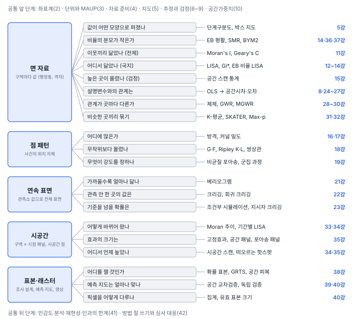

[목차](../README.md) · 이전: [42강 쓰고 읽기](42-writing-reading.md) · 다음: [부록 B 수학 준비](B-math-primer.md)

# 부록 A 방법 선택 지도

> 자료의 꼴과 묻고 싶은 질문에서 출발해 쓸 방법과 그 방법을 다룬 강을 찾는 색인임

공간 분석에서 방법을 고르는 순서는 41강에서 정리했음. 질문, 단위, 자료, 공간 관계, 방법의 순서임. 이 부록은 그 가운데 "방법" 단계의 지도임. 다음 두 가지를 차례로 정하면 길이 좁혀짐.

1. **자료가 어떤 꼴인가**: 구역마다 값이 하나인 면 자료, 사건의 위치 자체인 점 패턴, 관측소에서 잰 연속 표면, 여러 시점의 패널, 그리고 표본·래스터
2. **무엇을 묻는가**: 모양, 닮음(전체·국지), 관계, 예측, 묶기, 변화

같은 현상도 기록하는 방식에 따라 꼴이 달라짐(1강). 출동 위치는 점 패턴이지만, 행정동으로 세면 면 자료가 되고, 커널 밀도로 펴면 연속 표면처럼 다룰 수 있음. 꼴을 바꾸면 쓸 수 있는 방법과 잃는 정보가 함께 바뀜.

표의 "앱" 열에서 ●는 GeoStat 앱에서 바로 할 수 있음, ◐는 앱에서 일부만 됨, ○는 앱에 없어 그 강의 "코드로" 절처럼 파이썬으로 함을 뜻함. 한 칸에 기호가 둘이면 그 줄의 앞쪽 방법과 뒤쪽 방법이 다름.

## 1. 모든 갈래의 앞 단계

어느 방법을 쓰든 먼저 확인할 것들임.

| 확인할 것 | 왜 | 강 |
|---|---|---|
| 좌표계와 거리 단위 | 거리 기반 가중치, 커널, 베리오그램이 모두 거리에 기댐 | 2 |
| 분석 단위와 그 근거 | 단위를 바꾸면 결과가 바뀜(MAUP) | 3, 40 |
| 결측, 섬, 경계 | 이웃이 없는 구역과 경계 밖의 이웃 | 4, 10 |
| 분모와 작은 수 | 인구가 적은 구역의 비율이 지도를 지배함 | 5, 14 |
| 독립 가정 | 자기상관이 있으면 보통의 검정이 지나치게 자신함 | 7, 9 |
| 이웃의 정의 | 공간가중치의 유형과 표준화 | 10 |

## 2. 면 자료 (구역마다 값이 하나)

| 질문 | 방법 | 앱 | 주의 | 강 |
|---|---|---|---|---|
| 값이 어떤 모양으로 퍼졌나 | 단계구분도(분위수, 자연 분류, 박스 지도), 연동 그래프 | ● | 큰 구역이 눈을 지배함. 계급 방법을 밝힘 | 5 |
| 비율의 분모가 작은가 | 원비율과 사건 수, EB 평활, 연령 표준화 SMR | ● | 평활 값은 지도용이고 회귀의 종속변수가 아님 | 14 |
| | 포아송-감마 계층 모형, BYM2 | ◐ ○ | 사전분포와 수렴 진단을 보고함. 진짜 이상치를 묻을 수 있음 | 36, 37 |
| 이웃끼리 닮았나 (전체) | Moran's I, Geary's C, General G, 코렐로그램 | ● ○ | 가중치에 따라 값이 달라짐. 순열 횟수를 밝힘 | 11 |
| 비율 자료의 자기상관 | EB Moran's I | ● | 평활한 비율로 재면 부풀려짐 | 14, 41 |
| 어디서 닮았나 (국지) | LISA, Gi*, Local Geary, EB 비율 LISA, 국지 Join Count | ● ○ | 다중검정 보정. LISA는 군집의 핵을 찍을 뿐 경계를 긋지 않음 | 12, 13, 14 |
| 높은 곳이 몰렸나 (검정) | 공간 스캔 통계 | ○ | 창의 모양·크기 상한을 미리 정함. 사후 가설의 함정 | 15 |
| 설명변수와의 관계는 | OLS와 잔차 진단 | ● | 잔차 Moran's I, LM 검정 | 8, 24 |
| | 공간시차·공간오차 모형 | ● | 공간시차 모형은 직접·간접·총 효과로 해석함 | 25, 26 |
| | SLX, SDM, SDEM, 건수 모형, 고유벡터 필터 | ○ | 이론으로 모형을 고름 | 26, 27 |
| 관계가 곳마다 다른가 | 공간 체제, Chow 검정 | ◐ | 체제를 미리 정할 근거 | 28 |
| | GWR, MGWR | ● | 대역폭, 지역 계수의 다중검정, 거짓 변이 | 29, 30 |
| 비슷한 곳끼리 묶기 | K-평균, 계층 군집 | ● | 표준화와 군집 수 | 31 |
| | SKATER, AZP, Max-p | ● | 연결성 제약과 조밀성의 균형 | 32 |

## 3. 점 패턴 (사건의 위치 자체)

| 질문 | 방법 | 앱 | 주의 | 강 |
|---|---|---|---|---|
| 점이 몇 개, 어디에 많은가 | 방격 개수, 커널 밀도, 상대 강도(사례/대조) | ◐ | 대역폭, 관찰창의 경계 | 16, 17 |
| 무작위보다 몰렸나, 흩어졌나 | G·F 함수, Ripley K·L, 쌍상관함수, 모의 포락선 | ○ | 배경 밀도(인구)가 고르지 않으면 비균질 K | 18 |
| 두 종류의 점이 함께 나타나나 | 교차 K, 무작위 표지 검정 | ○ | 위치는 두고 표지만 섞는 귀무가설. 두 종류의 배경 인구 분포가 다르면 상호작용이 없어도 차이가 남 | 18 |
| 무엇이 강도를 정하나 | 비균질 포아송 모형, 군집 과정, 억제 과정, LGCP | ○ | 공변량과 군집을 함께 다룸 | 19 |

## 4. 연속 표면 (관측소에서 잰 값)

| 질문 | 방법 | 앱 | 주의 | 강 |
|---|---|---|---|---|
| 관측 사이를 어떻게 채우나 | IDW, 스플라인 | ○ | 불확실성을 주지 않음 | 20 |
| 거리에 따라 얼마나 닮나 | 실험 베리오그램과 모형 적합 | ○ | 구간 너비와 최대 거리, 가까운 쌍이 필요함 | 21 |
| 관측 안 한 곳의 값과 그 불확실성 | 단순·정규·보편·회귀 크리깅, 블록 크리깅 | ○ | 교차검증, 지원 변경 | 22 |
| 기준을 넘을 확률, 여러 지점을 함께 | 조건부 시뮬레이션, 지시자 크리깅 | ○ | 시뮬레이션 횟수와 시드 | 23 |

## 5. 시공간 (여러 시점)

| 질문 | 방법 | 앱 | 주의 | 강 |
|---|---|---|---|---|
| 자료를 어떤 꼴로 두나 | 긴 형태·넓은 형태, 경계 변경 처리 | ● | 시점마다 다른 경계를 같은 경계로 맞춤 | 33 |
| 공간 패턴이 어떻게 바뀌었나 | Moran 추이, 기간별 LISA, 차분 LISA, 공간 마르코프 | ● ○ | 시점마다 검정하면 다중검정이 늘어남 | 34 |
| 어디서 언제 높았나 | 떠오르는 핫스팟, 시공간 스캔 | ○ | 기대값을 무엇으로 두느냐에 따라 찾는 것이 다름 | 34, 35 |
| 효과의 크기는 | 고정효과·확률효과, 공간 패널, 포아송 패널 | ○ | 반복 관측의 표준오차, 해마다 하나인 변수의 식별 | 35 |

## 6. 표본·예측·래스터

| 질문 | 방법 | 앱 | 주의 | 강 |
|---|---|---|---|---|
| 어디를 잴 것인가 | 단순 무작위, 층화, 계통, GRTS, 공간 피복 | ○ | 목적(평균 대 지도)에 맞게 고름 | 38 |
| 예측 지도는 얼마나 맞나 | 무작위·공간 블록 교차검증, 독립 확률 표본 검증 | ○ | 평가가 예측의 상황을 흉내 내야 함 | 39 |
| 머신러닝 예측의 공간 구조 | 잔차 Moran's I, 좌표·거리 특징, 회귀 크리깅 방식 | ○ | 잔차의 자기상관이 없다고 지도가 좋은 것은 아님 | 39 |
| 래스터를 어떻게 요약하나 | 격자 집계, 존 통계, 셀 크기 민감도 | ◐ | 지원 효과, 극값의 변화 | 3, 40 |
| 픽셀로 검정하거나 정확도를 평가함 | 유효 표본 크기, 확률 표본 정확도 평가 | ○ | 붙어 있는 픽셀은 같은 정보를 반복함 | 40 |

## 7. 자주 헷갈리는 선택

| 상황 | 고를 것 | 강 |
|---|---|---|
| "이 지역에 몰려 있다"는 민원 | 창 모양·인구 상한을 미리 정한 스캔 통계. 민원 지역만 골라 검정하지 않음 | 15 |
| LISA, Gi*, 스캔 가운데 무엇을 | 이웃과 함께 높은 구역(LISA HH), 높은 값이 모인 구역(Gi*), 위험이 높은 덩어리의 검정(스캔) | 12, 13, 15 |
| 공간시차인가 공간오차인가 | 파급(이웃의 결과가 결과에 영향)이 이론적으로 있으면 공간시차, 빠진 변수의 공간 패턴이면 공간오차. LM 검정은 보조 수단 | 24~26 |
| 체제인가 GWR인가 | 경계가 미리 정해진 차이면 체제, 매끄럽게 변하는 차이면 GWR·MGWR | 28~30 |
| EB인가 BYM2인가 | 도시 평균 쪽으로 당겨도 되면 EB(이웃 평균 쪽이면 공간 EB), 이웃 쪽으로 당기는 것이 그럴듯하면 BYM2. BYM2는 이웃 쪽으로 당기는 몫(공간 비중 φ)을 자료에서 정함. 감시 목적이면 원비율과 사건 수를 함께 | 14, 36, 37 |
| 크리깅인가 머신러닝인가 | 공변량이 적고 공간 구조가 크면 크리깅, 공변량이 많고 관계가 비선형이면 머신러닝. 둘을 섞은 회귀 크리깅 방식도 있음 | 22, 39 |
| 무작위 교차검증인가 공간 교차검증인가 | 표본이 영역 전체의 고른 확률 표본이면 무작위, 모여 있고 멀리 예측하면 공간 블록이나 NNDM | 39 |
| 설계 기반인가 모형 기반인가 | 영역 평균이 목적이면 확률 표본과 설계 기반, 지도가 목적이면 모형 기반 | 38 |

---

[목차](../README.md) · 이전: [42강 쓰고 읽기](42-writing-reading.md) · 다음: [부록 B 수학 준비](B-math-primer.md)
