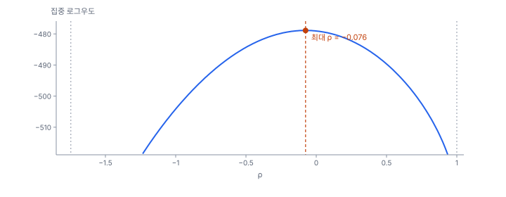

[목차](../README.md) · 이전: [부록 A 방법 선택 지도](A-method-map.md) · 다음: [부록 C 기호·수식표](C-symbols.md)

# 부록 B 수학 준비

> 6부(공간 회귀) 앞에서 읽으면 좋은 최소한의 행렬, 확률분포, 로그우도, 최적화. 모두 일렬로 이은 네 지역의 손계산으로 설명함

공간통계의 식은 대부분 몇 가지 도구의 조합임. 이웃 값의 가중합(행렬과 벡터의 곱), 그 합을 모은 이차형식(Moran's I), 모든 지역을 한꺼번에 푸는 연립방정식(공간시차 모형), 그 해가 존재하는 범위(고유값), 그리고 모수를 고르는 기준(로그우도)임. 이 부록은 지역 네 개를 일렬로 이은 A–B–C–D로 이것들을 손으로 계산해 봄(`book/fig-src/B.py`).

## 1. 벡터와 행렬: 공간 시차

지역마다의 값을 세로로 늘어놓은 것이 **벡터**, 지역 쌍마다의 값을 표로 놓은 것이 **행렬**임. A–B–C–D에서 이웃(맞닿은 지역)이면 1, 아니면 0인 인접 행렬을 각 행의 합으로 나누면 행 표준화한 공간가중치 W가 됨(10강).

$$
W = \begin{pmatrix} 0 & 1 & 0 & 0 \\ 0.5 & 0 & 0.5 & 0 \\ 0 & 0.5 & 0 & 0.5 \\ 0 & 0 & 1 & 0 \end{pmatrix},
\qquad
\mathbf x = \begin{pmatrix} 1 \\ 3 \\ 5 \\ 9 \end{pmatrix}
\quad\Rightarrow\quad
W\mathbf x = \begin{pmatrix} 3 \\ 3 \\ 6 \\ 5 \end{pmatrix}
$$

행렬과 벡터의 곱 Wx의 i번째 원소는 Σⱼ wᵢⱼxⱼ, 곧 i의 이웃 값을 가중치로 평균한 것임. B는 이웃 A(1)와 C(5)의 평균 3, C는 B(3)와 D(9)의 평균 6임. 이것이 **공간 시차**임(10강, 11강의 Moran 산점도 세로축).

- **전치** Wᵀ: 행과 열을 바꿈. 이진 인접 행렬은 대칭(Wᵀ = W)이지만, 행 표준화하면 대칭이 깨짐(A의 행은 1, B의 행은 0.5)
- **단위 행렬** I: 대각이 1이고 나머지가 0. Ix = x

## 2. 이차형식: Moran's I

평균을 뺀 값 z = x − x̄ = (−3.5, −1.5, 0.5, 4.5)로 zᵀWz = Σᵢ Σⱼ wᵢⱼzᵢzⱼ를 구하면, 이웃끼리 같은 쪽(둘 다 평균 위 또는 아래)이면 양의 기여를, 반대쪽이면 음의 기여를 더함. 이런 꼴을 **이차형식**이라 함.

$$
I = \frac{n}{S_0}\,\frac{\mathbf z^\top W \mathbf z}{\mathbf z^\top \mathbf z} = \frac{4}{4} \times \frac{10.5}{35} = 0.300
$$

S₀는 가중치의 합(행 표준화면 n)임. A–B–C–D는 작은 값에서 큰 값으로 이어져 있어 양의 자기상관(0.300)이 나옴(11강). Geary's C의 분자 Σᵢ Σⱼ wᵢⱼ(xᵢ − xⱼ)², LM 검정에 들어가는 잔차의 eᵀWe, 회귀의 잔차 제곱합 eᵀe도 모두 이차형식임.

## 3. 역행렬과 연립방정식: 공간 승수

공간시차 모형 y = ρWy + Xβ + ε(25강)는 y가 양쪽에 있는 연립방정식임. y에 대해 풀면 다음과 같음.

$$
\mathbf y = (I - \rho W)^{-1}(X\boldsymbol\beta + \boldsymbol\varepsilon)
$$

(I − ρW)⁻¹는 **역행렬**로, (I − ρW)와 곱하면 I가 되는 행렬임. ρ = 0.5이면 다음과 같음.

$$
(I - 0.5W)^{-1} = \begin{pmatrix} 1.156 & 0.622 & 0.178 & 0.044 \\ 0.311 & 1.244 & 0.356 & 0.089 \\ 0.089 & 0.356 & 1.244 & 0.311 \\ 0.044 & 0.178 & 0.622 & 1.156 \end{pmatrix}
$$

- 대각 원소(1.156, 1.244)는 자기 자신의 몫 1에, 이웃을 거쳐 되돌아온 몫(0.156, 0.244)을 더한 것임(직접 효과의 승수). 대각 밖은 다른 지역으로 번지는 몫(간접 효과)임(25강)
- 행 표준화한 W에서는 각 행의 합이 1/(1 − ρ) = 2임. 모든 지역의 x가 똑같이 1만큼 오르면 y는 2β만큼 오름(총 효과의 승수)
- |ρ| < 1이면 역행렬을 급수로 풀 수 있음. (I − ρW)⁻¹ = I + ρW + ρ²W² + ρ³W³ + …. W²는 이웃의 이웃이므로, 효과가 이웃을 타고 퍼지며 줄어드는 모양임. 앞의 네 항만 더하면 (1, 1) 원소가 1.125로, 정확한 값 1.156에 다가감

## 4. 고유값: ρ의 범위와 행렬식

행렬 W에 대해 Wv = λv를 만족하는 수 λ를 **고유값**, 벡터 v를 고유벡터라 함. W를 곱해도 방향은 그대로이고 크기만 λ배가 되는 방향임.

- A–B–C–D의 W의 고유값은 −1, −0.5, 0.5, 1임
- 행 표준화한 W의 가장 큰 고유값은 언제나 1임(모든 값이 같은 벡터 1이 W1 = 1을 만족함). 또 모든 고유값은 |λ| ≤ 1임. Wv의 각 원소는 v의 이웃 값의 평균이라, v에서 절댓값이 가장 큰 원소보다 커질 수 없기 때문임
- 그래서 가장 작은 고유값 λ_min은 −1과 0 사이의 음수이고, ρ의 하한 1/λ_min은 −1 이하의 음수가 됨
- (I − ρW)의 고유값은 1 − ρλ임. 이것이 0이 되면 역행렬이 없으므로, ρ는 1/λ_min < ρ < 1/λ_max = 1 안에 있어야 함. A–B–C–D는 −1 < ρ < 1이고, 한빛시 행정동 150개의 퀸 가중치는 가장 작은 고유값이 −0.5728이라 −1.746 < ρ < 1임(25강. 25강은 고유값을 ω로 적음)
- **행렬식** |I − ρW|는 고유값의 곱 Π(1 − ρλᵢ)임. 로그를 취하면 log|I − ρW| = Σ log(1 − ρλᵢ)로, 공간시차·공간오차 모형의 로그우도에 들어감. ρ = 0.5이면 log(1.5) + log(1.25) + log(0.75) + log(0.5) = −0.3522임. 지역이 수만 개이면 고유값을 다 구하기 어려워 근사를 씀(40강)
- 37강의 ICAR는 D − W(여기서 W는 행 표준화하지 않은 0/1 인접 행렬, D는 이웃 수의 대각 행렬)의 고유값 하나가 0이라 역행렬이 없는 경우임

## 5. 자주 쓰는 확률분포

| 분포 | 무엇에 | 평균 | 분산 | 쓰는 강 |
|---|---|---|---|---|
| 정규 N(μ, σ²) | 연속값, 회귀의 오차 | μ | σ² | 6, 8, 24~30 |
| 포아송 Poisson(λ) | 건수 | λ | λ | 14, 16, 27, 35~37 |
| 음이항 | 과대산포가 있는 건수 | μ | μ + αμ² | 27 |
| 이항 Binomial(n, p) | n 가운데 성공 수 | np | np(1 − p) | — |
| 감마 Gamma(a, b) | 양수인 비율, 포아송 평균의 사전분포 | a/b | a/b² | 36 |
| 카이제곱 χ²(k) | 검정통계량(LM, 우도비) | k | 2k | 24, 26 |

포아송은 평균과 분산이 같다는 강한 가정을 함. 실제 분산이 평균보다 크면 과대산포라 하고, 음이항(27강)이나 랜덤효과(36~37강)로 다룸.

## 6. 로그우도와 최대우도

**가능도**(likelihood)는 모수가 어떤 값일 때 지금의 자료가 나올 확률(밀도)임. 관측이 독립이면 각 관측의 밀도를 곱하고, 다루기 쉽게 로그를 취해 더함. 가능도를 가장 크게 하는 모수가 **최대우도 추정값**임(8강).

### 손으로 해 보기: 정규분포

y = (2, 4, 6)에서 평균의 최대우도 추정값은 표본 평균 4이고, 분산은 n으로 나눈 8/3 = 2.6667임.

$$
\log L = -\frac{n}{2}\log(2\pi\hat\sigma^2) - \frac{n}{2} = -\frac{3}{2}\log(2\pi \times 2.6667) - \frac{3}{2} = -5.7281
$$

AIC = −2 log L + 2k(k는 추정한 모수 수)는 모수가 많은 모형에 벌점을 줘서 비교함. 평균과 분산 두 모수면 AIC = 11.4561 + 4 = 15.4561임. 모수 수를 셀 때 분산을 넣는지는 도구마다 달라서, AIC는 같은 도구 안에서만 비교함(부록 E).

### 손으로 해 보기: 포아송 비율

노출(인구)이 1, 2, 0.5인 세 지역에서 건수가 3, 5, 1이면, 공통 비율 λ의 최대우도 추정값은 전체 건수 ÷ 전체 노출 = 9 / 3.5 = 2.5714임. 14강의 도시 전체 비율(β̂)이 이것임.

## 7. 최적화와 집중 로그우도

식으로 풀리지 않는 최대우도는 수치 최적화로 찾음.

- **격자 탐색**: 후보 값을 촘촘히 늘어놓고 모두 계산함. 모수가 하나둘이면 가장 확실함(36강은 초모수 둘의 사후분포를 격자에서 구함)
- **황금 분할 탐색**: 구간을 일정한 비율로 줄여 가며 최솟값을 찾음. GWR의 대역폭 선택에 씀(29강)
- **뉴턴 방법**: 기울기(1차 도함수)와 곡률(2차 도함수)로 다음 값을 정함. 최댓값에서 로그우도의 곡률은 음수이고, 그 부호를 바꾼 값(정보)의 역수가 추정값의 분산이 됨. 꼭대기가 뾰족할수록 분산이 작음
- **반복 재가중 최소제곱**(IRLS): 포아송 회귀의 최대우도를, 현재 추정값으로 가중치를 다시 계산해 가중 최소제곱을 푸는 일을 되풀이해 찾음(27강, 35강)

공간시차 모형에서는 ρ를 정하면 β와 σ²가 최소제곱으로 바로 나오므로, 로그우도를 ρ 하나의 함수로 줄일 수 있음. 이것을 **집중 로그우도**라 함.

$$
\log L_c(\rho) = -\frac{n}{2}\log\!\left(2\pi\hat\sigma^2(\rho)\right) - \frac{n}{2} + \log|I - \rho W|
$$

- 한빛시 출동률을 온도편차와 고령비율로 회귀한 공간시차 모형에서 집중 로그우도의 최댓값은 ρ = −0.0759, log L = −478.8823임. GeoStat 엔진의 결과와 소수 넷째 자리까지 같음(25강에서 ρ = −0.076으로 보고한 모형)
- ρ = 0이면 OLS와 같고 log L = −479.0610임. 두 값의 차이 0.1787의 두 배(0.357)가 ρ = 0을 검정하는 우도비 통계량이며(25강), χ²(1)의 기준 3.84보다 훨씬 작음
- ρ = 0.5에서는 −489.6643으로 크게 떨어짐. 곡선이 뾰족할수록 ρ가 정밀하게 추정됨

## 8. 로그와 지수: 비율로 읽는 계수

건수 모형(포아송, BYM2)은 log(기대 건수)를 선형식으로 둠. 그래서 계수 β는 "x가 1 오를 때 기대 건수가 exp(β)배"로 읽음.

- β = 0.0508이면 exp(0.0508) = 1.052, 곧 5.2% 증가(35강)
- β가 작으면 exp(β) − 1 ≈ β라서 계수를 그대로 퍼센트로 읽어도 비슷함. β = 0.3이면 exp(0.3) − 1 = 35%로 차이가 커짐
- 두 효과를 함께 보려면 계수를 더하고 지수를 취함. 곱으로 쌓이기 때문임
- 로그를 취한 변수(로그 인구밀도)의 계수는 "x가 e배(약 2.72배)가 될 때"의 변화임

## 더 읽을거리

- Strang, G. (2016). *Introduction to Linear Algebra* (5th ed.). Wellesley-Cambridge Press. 행렬과 고유값
- Pawitan, Y. (2001). *In All Likelihood: Statistical Modelling and Inference Using Likelihood*. Oxford University Press. 가능도와 최대우도
- LeSage, J., & Pace, R. K. (2009). *Introduction to Spatial Econometrics*. Chapman & Hall/CRC. 2~4장(공간 회귀의 행렬식과 승수)

---

[목차](../README.md) · 이전: [부록 A 방법 선택 지도](A-method-map.md) · 다음: [부록 C 기호·수식표](C-symbols.md)
