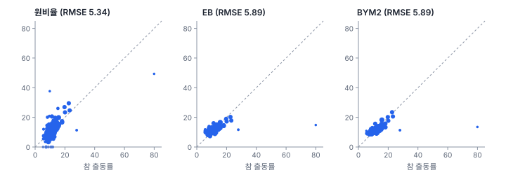

[목차](../README.md) · 이전: [부록 F 더 읽을거리](F-further-reading.md)

# 부록 G 예제 자료

> 책 전체에서 쓴 가상 도시 한빛시의 자료와, 그 자료를 만든 규칙(참 모형)을 공개함. 고전 자료와 앱 샘플의 출처와 이용 조건도 정리함

한빛시의 모든 값은 알려진 규칙으로 만들었음. 실제 자료로는 할 수 없는 일, 곧 "이 방법이 참 구조를 찾아내는가"를 확인하기 위해서임. 이 부록은 그 규칙을 모두 공개함. **책을 다 읽기 전이라면** 1절(레이어 목록)과 5절(고전 자료)만 읽고, 2~4절은 나중에 읽기를 권함. 각 강에서 방법을 적용해 얻은 결론을 참값과 맞춰 보는 재미가 사라지기 때문임.

## 1. 레이어 한눈에

모든 파일은 `book/data/`에 있고 좌표계는 EPSG:5186(중부원점)임. 실제 지형과 겹치지 않게 서해 바다 위(동경 125.0~125.4°, 북위 36.5~36.8°)에 두었음.

| 파일 | 형태 | 내용 | 처음 쓴 강 |
|---|---|---|---|
| `hanbit_dong.gpkg` | 면 | 행정동 150개(구 5개). 동코드, 구, 동이름, 인구, 고령인구, 면적_km2 | 1강 |
| `hanbit_events.gpkg` | 점 | 2025년 6~8월 폭염 관련 119 구급 출동 1,408건. 출동ID, 출동일, 월, 연령대 | 1강 |
| `hanbit_stations.gpkg` | 점 | 기상 관측소 48곳의 8월 평균 기온 | 1강 |
| `hanbit_roads.gpkg` | 선 | 주요 도로 4개 | 1강 |
| `hanbit_lst.tif` | 래스터 | 여름 한낮 지표온도(℃), 50 m, 640 × 480 | 1강 |
| `hanbit_pop100.tif` | 래스터 | 100 m 격자 인구(1밴드)와 고령인구(2밴드) | 3강 |
| `hanbit_boundary.gpkg` | 선 | 시 경계를 해안선과 이웃 시와의 행정 경계로 나눈 선 | 4강 |
| `hanbit_dong_panel.gpkg` | 면 | 행정동 150개 × 2016~2025년 패널(1,500행) | 33강 |
| `practice/hanbit_dong_sim.gpkg` | 면 | 공간 회귀 연습용 모의 자료(규칙 공개) | 24강 |
| `practice/hanbit_dong_digitized.gpkg` | 면 | 경계를 ±0.5 m 흔든 행정동(퀸 인접에서 모두 섬이 됨) | 4강 |

자료는 다음 명령으로 언제든 똑같이 다시 만들 수 있음. 구성 요소마다 난수 흐름을 따로 써서(기본 시드 20260930 + 구성 요소 이름), 새 변수를 더해도 이미 책에 쓴 값은 바뀌지 않음.

```
cd engine
uv run python ../book/data/make_hanbit.py
uv run python ../book/data/make_hanbit_panel.py
```

## 2. 참 모형 카드

좌표는 km 단위(EPSG:5186의 x, y ÷ 1,000)로 적음. g(중심, σ)는 중심에서 거리 d일 때 exp(−d²/2σ²)인 종 모양 함수임.

### 카드 1. 땅과 인구 밀도

- **땅**: 32 km × 24 km 범위. 북쪽과 서쪽은 이웃 시와 맞닿은 행정 경계, 남쪽과 동쪽은 해안선이고, 남쪽 원도심 앞에 만(항만)을 하나 파 넣었음
- **인구 밀도**(명/㎢): 250 + 17,000·g(원도심 (40.5, 447.6), 1.9 km) + 12,000·g(신도심 (33.5, 456.5), 2.6 km) + 4,500·g(동부 (50.5, 455.0), 2.0 km)
  - 도시 북쪽 가운데의 산림 (43.5, 458.5)에서 최대 85% 줄이고(σ 3.2 km), 동쪽 해안 산업단지 (53.0, 449.5)에서 최대 80% 줄임(σ 1.5 km)
- **고령인구 비율**: e = 0.10 + 0.20 × (1 − 도시화) + 0.08 × g(원도심, 1.5 km) + 0.03 × (1.5 km 매끄러운 잡음), 0.05~0.45로 자름
  - 도시화 = 밀도 / (밀도 + 4,000). 외곽과 원도심에서 고령비율이 높음

### 카드 2. 행정동

- 밀도가 높을수록 촘촘하게 씨앗점을 뿌리고(간격 1,700 × (밀도/1,000)^−0.36 m, 450~2,800 m로 자름) 보로노이 다각형을 만든 뒤 로이드 이완으로 모양을 고름. 도심 동은 작고 외곽 동은 큼(5강의 면적 편향)
- 구 다섯 개는 동 중심점을 k-평균으로 다섯 무리로 나눈 것임
- **인구**: 밀도 표면을 동마다 적분하고, 동마다 로그정규 잡음(표준편차 0.15)을 곱한 뒤 합계를 120만 명으로 맞춤
- **고령인구**: 동 안의 고령비율 표면을 인구로 가중 평균하고 로그정규 잡음(표준편차 0.06)을 곱함

### 카드 3. 지표온도

$$
\text{LST} = 29 + 8u - 3.5f + 5k - 2.5c + 0.9\,N_{500} + 1.1\,u\,N_{120} + 0.5\,\varepsilon
$$

- u는 도시화, f는 산림(σ를 3.2 × 0.8 km로 좁힌 g), k는 산업단지 g(σ 1.5 km), c = exp(−해안까지 거리/900 m)는 해안 냉각
- N₅₀₀, N₁₂₀은 표준편차 1인 매끄러운 잡음장(가우시안 평활 σ 500 m, 120 m). 120 m 잡음은 도시화에 비례해 도심에서만 큼(지붕·주차장·공원의 차이)
- ε는 셀마다 독립인 표준정규 잡음(픽셀 잡음)
- 시 안 육지 셀의 분산 5.298 가운데 큰 경향의 분산이 4.409, 500 m 잡음 0.775, 120 m 잡음 0.126, 픽셀 잡음 0.250임. 성분끼리 표본에서 조금씩 상관이 있어 합이 정확히 같지는 않음

**책에서 찾은 것**

- 38강의 베리오그램은 실효 상관거리를 34 km로, 시보다 길게 추정했음. 분산의 대부분이 도시·산림·해안의 큰 경향이기 때문임
- 40강에서 50 m의 Moran's I(0.951)가 100 m(0.981)보다 작았던 까닭은 픽셀 잡음 ε임
- 600 m보다 짧은 거리에서 사라지는 변동은 픽셀 잡음 0.25와 120 m 잡음 약 0.13으로, 합하면 약 0.38이 너깃처럼 보여야 함. 38강은 첫 구간이 0~600 m인 베리오그램을 원점 쪽으로 외삽해 너깃을 0.135로 작게 추정했음. 원점 근처의 쌍을 따로 보지 못했기 때문임
- 40강에서 2 km로 묶어도 분산의 79%가 남은 것도 같은 구조임

### 카드 4. 폭염 관련 구급 출동

출동 위치는 다음 강도에 비례하는 비균질 포아송 과정으로 뽑았음. 건수는 평균 1,400건의 포아송분포에서 뽑아 1,408건이 나왔음.

$$
\lambda(s) = \text{밀도}(s) \times (0.3 + 6e(s)) \times e^{0.15(\text{LST}(s) - 32)} + 9{,}000\,g(\text{산업단지 군집}) + 12{,}000\,g(\text{전통시장 군집})
$$

- **더위**: 지표온도 1℃당 위험이 exp(0.15) = 1.162배
- **나이**: 65세 이상 한 사람의 위험은 65세 미만의 3배임(개인 수준의 참값). 출동마다 65세 이상일 확률을 3e/(1 + 2e)로 정해 연령대를 붙였음
- **동네 맥락**: 위 식의 (0.3 + 6e)는 개인 효과 (1 + 2e)에 동네 효과 (0.3 + 6e)/(1 + 2e)를 곱한 것임. 고령비율 15%인 곳은 0.92배, 25%는 1.20배, 35%는 1.41배. 고령 동네의 주거·냉방 여건을 나타냄
- **국지 군집 두 곳**: 동쪽 해안 산업단지 주변 (52.3, 450.2), σ 0.5 km(야외 작업)와 원도심 전통시장 주변 (39.8, 448.7), σ 0.35 km. 2025년 기대 건수로는 각각 11.7건과 7.6건뿐이지만, 산업단지 군집은 다솜23동 기대 건수의 80%, 다솜20동의 67%, 다솜19동의 28%를 차지함
- 월은 6·7·8월을 0.2·0.45·0.35의 확률로 뽑았음

**책에서 찾은 것**

- 14강에서 65세 이상의 출동률(1만 명당 25.72)은 미만(8.11)의 3.17배였음. 개인 수준의 참값 3과 가까움
- 3강에서 고령비율이 높은 동일수록 출동률이 오히려 조금 낮았음(상관 −0.13). 개인의 위험은 3배인데도 그랬던 것은 고령 동이 대개 시원한 외곽에 있기 때문임(카드 1, 3). 생태학적 오류의 예로 쓴 그대로임
- 37강의 BYM2는 동 평균 지표온도 1℃당 상대위험을 1.124로 추정했음. 참 모형으로 계산한 동별 기대 건수를 같은 방식(연령 표준화 기대 대비)으로 동 평균 지표온도에 회귀하면 1℃당 1.098배임. 픽셀 수준의 참값 1.162보다 작은 까닭은 두 가지임. 하나는 혼재임. 더운 도심 동은 고령비율이 낮아 동네 효과 (0.3 + 6e)/(1 + 2e)가 작고(동 수준 상관 −0.75), 이 몫이 온도의 효과를 깎음. 다른 하나는 가중의 차이임. 동 평균 지표온도는 면적으로 평균한 것인데, 출동은 사람이 사는 셀에서 나오므로 인구로 가중한 온도를 따름
- 다솜23동(인구 1,013명, 5건)은 1강부터 "작은 동이라 튀는 값"의 예였고, 14강의 EB는 49.36을 14.80으로, 37강의 BYM2는 1.02(상대위험)로 끌어내렸음. 그러나 참 출동률은 1만 명당 79.9로 시에서 가장 높음. 산업단지 군집이 실제로 있었던 것임. 한 해 자료의 스캔 통계(15강)는 이 동을 유의한 군집으로 잡지 못했지만, 열 해 패널의 시공간 스캔(35강)은 2018~2022년의 군집(상대위험 8.60, p 0.001)으로, 떠오르는 핫스팟 분석(34강)은 다솜구 동쪽 해안의 지속·과거 핫스팟으로 잡았음
- 마루구 원도심(14강의 FDR 뒤 HH 다섯 동, 15강의 가장 가능성 높은 군집)은 참 출동률도 높은 곳임(마루15동 23.2, 마루16동 22.6). 다만 높은 까닭은 전통시장 군집(마루15동 기대 건수의 16%)보다 원도심의 높은 고령비율(카드 1의 원도심 항)과 더위가 겹친 데 있음. 오래전부터 위험이 높았던 곳임

### 카드 5. 기상 관측소

- 시 경계에서 400 m 안쪽에, 서로 2.3 km 이상 떨어지게 48곳을 뽑았음
- 기온 = 25.5 + 0.45 × (1.2 km로 평활한 지표온도 − 32) + N(0, 0.15²)

**책에서 찾은 것**: 21강에서 1 km로 평활한 지표온도에 대한 기울기는 0.4271이었고(22강의 회귀 크리깅도 같은 회귀를 씀), 잔차의 너깃은 0.0183(√ = 0.135℃)이었음. 참값 0.45와 잡음 분산 0.0225(표준편차 0.15℃)에 가까움. 잔차에 공간 구조가 없었던 것(21강)도 참 모형의 잡음이 독립이기 때문임

### 카드 6. 도로와 100 m 격자 인구

- 도로 4개(한빛대로, 해안로, 동서로, 산성로)는 세 도심과 해안을 잇는 꺾은선을 조금 구부린 것임
- 100 m 격자 인구는 행정동 인구를 동 안의 50 m 셀에 밀도 표면(고령인구는 밀도 × 고령비율)에 비례해 정수로 나눠 담은 뒤 100 m로 묶은 것임. 난수가 없음. 50 m 단위로는 동 안의 셀을 더하면 동 인구와 정확히 같지만, 100 m 셀은 동 경계에 걸칠 수 있어 100 m 셀로 동별 합을 내면 조금 다름

### 카드 7. 행정동 패널(2016~2025)

- **폭염일수**(도시 전체): 2016년부터 22, 18, 35, 15, 9, 20, 16, 21, 31, 24일
- **폭염 효과**: 폭염일수가 하루 많으면 출동 위험이 3% 큼
- **인구**: 2025년에서 거슬러 올라가며 해마다 바뀜. 연 증가율(로그) = −0.001 + 0.012·g(신도심, 3 km) − 0.015·g(원도심, 2.5 km) + 0.06·g(동부 개발지 (51.5, 456.5), 2 km, 2020년부터) + N(0, 0.004²)
- **고령비율**: 동마다 한 번 뽑은 연 증가분 a = 0.004 + 0.003·g(원도심) − 0.003·g(동부 개발지) + N(0, 0.001²)만큼 해마다 오름. 원도심이 가장 빨리 늙음
- **전통시장 군집**: 2020년까지는 지금 강도의 30%, 2021년 시장 확장 뒤 지금 강도
- 출동 건수는 해마다 위 위험으로 계산한 기대 건수의 포아송분포에서 뽑았고, 2025년 값은 `hanbit_events.gpkg`의 동별 건수와 같음

**책에서 찾은 것**

- 35강의 포아송 고정효과 모형은 폭염일수 하루당 0.0270(2.7%)을 추정했음. 참값 0.03(3%)에 가까움
- 35강의 시간 보정 시공간 스캔이 마루구 남쪽의 2021~2025년을 가장 가능성 높은 군집으로 찾고, 34강이 마루구 남쪽에 새로운·산발 핫스팟을 찾은 것은 원도심의 빠른 고령화와 2021년 전통시장 확장이 겹친 결과임. 시장 군집은 2025년 기대 건수로 7.6건뿐이라, 34강의 새로운 핫스팟을 시장만으로 설명하지는 못함. 원래 위험이 높던 원도심에서 고령비율이 해마다 더 빨리 오른 몫이 큼

### 카드 8. 연습용 모의 자료

`practice/hanbit_dong_sim.gpkg`의 규칙은 처음부터 공개했음(24강, 28강, `fig-src/regkit.py`).

- 기본: xb = 5 + 0.3 × 고령비율(%) + 1.5 × 온도편차(동 평균 지표온도 − 30℃), ε ~ N(0, 1.5²)
- `Y_독립` = xb + ε, `Y_시차` = (I − 0.5W)⁻¹(xb + ε), `Y_오차` = xb + (I − 0.5W)⁻¹ε. W는 행 표준화한 퀸 인접
- `Y_체제`: 온도편차 계수가 다솜구 2.0, 나머지 1.0
- `Y_변이`: 온도편차 계수 = 0.8 + 1.4 × exp(−d²/(2 × 6²)), d는 (34, 455) km까지의 거리(km)
- `Y_체제`와 `Y_변이`는 ε를 따로 뽑음

`practice/hanbit_dong_digitized.gpkg`는 `hanbit_dong.gpkg`의 꼭짓점을 ±0.5 m 안에서 흔든 것임. 퀸 인접으로 이웃을 만들면 150개 동이 모두 섬이 됨(4강).

## 3. 참값으로 다시 본 추정

참 모형에서 동마다의 2025년 기대 출동 건수를 계산하면(`book/data/make_hanbit_panel.py`의 위험 표면을 동별로 합침), 동별 참 출동률을 알 수 있음. 14강의 원비율과 EB, 37강의 BYM2를 이 참값과 비교했음(`book/fig-src/G.py`).



| 추정 | RMSE (150개 동) | 인구 1분위 | 인구 4분위 | 참값과 상관 | RMSE (다솜19·20·23동 뺌) | 상관 (세 동 뺌) |
|---|---|---|---|---|---|---|
| 원비율 | 5.339 | 8.988 | 2.136 | 0.665 | 4.480 | 0.608 |
| EB(14강) | 5.889 | 11.166 | 1.772 | 0.445 | 2.178 | 0.723 |
| BYM2(37강) | 5.891 | 11.309 | 1.616 | 0.431 | 1.877 | 0.792 |

BYM2의 출동률은 사후 평균 상대위험에 연령 표준화 기대 건수를 곱해 인구로 나눈 것임.

- **대부분의 동에서는 수축이 맞았음**: 산업단지 군집의 세 동을 빼면 BYM2의 오차는 원비율의 절반 아래이고, 이웃의 정보를 쓴 BYM2가 도시 평균을 쓴 EB보다 나았음. 큰 동(인구 4분위)에서도 BYM2가 가장 정확했음
- **진짜 이상치에서는 수축이 틀렸음**: 다솜23동의 참값 79.9를 EB는 14.80, BYM2는 13.52로 추정했음. 이웃도 낮지 않았지만(다솜20동 참값 27.9) 5건으로는 높다는 증거가 약했고, 수축이 그것을 평균 쪽으로 묻었음. 36강의 모의에서 "참 위험이 정말 높은 작은 동은 베이즈 구간이 4번에 1번꼴로 놓친다"고 했던 바로 그 경우임
- 그래서 지도용 추정(EB, BYM2)과 감시용 판단(원비율과 사건 수, 여러 해 자료, 스캔 통계)을 나눠 써야 한다는 14·36·37강의 권고가 참값으로도 확인됨

## 4. 참 구조와 각 부의 결론

| 참 구조 | 찾아낸 강과 방법 | 결과 |
|---|---|---|
| 도심이 덥고(도시화로 최대 약 +6.5℃), 북쪽 산림과 해안이 시원함 | 1·5강 지도, 20~22강 지구통계 | 시 전체의 큰 경향과 긴 상관거리 |
| 더운 곳의 출동 위험이 큼(1℃당 1.162배) | 8강 회귀, 25~27강, 35·37·41강 | 모든 모형·명세에서 양의 관계. 건수 모형으로는 동 평균 1℃당 1.12배 안팎(37강) |
| 개인 위험은 고령이 3배인데 고령 동은 외곽에 있음 | 3강, 8강 | 동 단위로는 고령비율의 관계가 약하거나 거꾸로 보이는 생태학적 오류 |
| 원도심 군집(밀도·고령·더위가 겹침과 전통시장) | 12~15강 LISA, Gi*, EB LISA, 스캔 | 마루구 원도심 HH와 군집 |
| 산업단지 군집(작은 동) | 34·35강 시공간 분석 | 여러 해를 묶어야 검출됨. 한 해 자료의 수축 추정은 놓침 |
| 원도심의 빠른 고령화, 2021년 시장 확장 | 34·35강 | 마루구 남쪽의 최근 증가 |
| 폭염일수 하루당 3% | 35강 | 2.7% |
| 연습 자료의 체제·변이 계수(공개 규칙) | 28~30강 | GWR·MGWR이 Y_변이의 온도편차 계수가 매끄럽게 변하는 것을 찾음. 같은 자료에서 참값이 일정한 고령비율 계수(0.3)는 GWR에서 0.014~0.311로 흔들리는 거짓 변이를 보였음(29·30강). 계수가 모두 일정한 Y_독립에서는 GWR이 이웃 149개의 사실상 전역 회귀를 골랐음 |

## 5. 고전 자료와 앱 샘플

| 자료 | 쓴 곳 | 출처 | 이용 조건 |
|---|---|---|---|
| 노스캐롤라이나 영아 돌연사(NC SIDS), 카운티 100개, 1974~84년 | 0강, 5강 연습, 11·12강 해 보기(앱 샘플) | Cressie (1993) *Statistics for Spatial Data*. GeoDa Center·PySAL 배포본 | PySAL `libpysal.examples`는 BSD-3 라이선스. 원자료는 공개 통계 |
| 조지아 교육 수준, 카운티 159개, 1990년 | 앱 샘플(책에서는 쓰지 않음. GWR 연습에 알맞음) | Fotheringham, Brunsdon & Charlton (2002) *Geographically Weighted Regression*. PySAL 배포본 | BSD-3(PySAL 배포본) |
| 콜럼버스 범죄, 근린 49개 | 25강 더 해 보기 | Anselin (1988) *Spatial Econometrics*. `libpysal.examples.get_path("columbus.dbf")` | BSD-3(PySAL 배포본) |
| 서울 가상 격자, 가상 지형 | 앱 샘플 | GeoStat 자체 생성 | 가상 값 |

앱 샘플은 **도움말 → 샘플** 메뉴로 열고, 사용자 문서 폴더(`문서/GeoStat/샘플 데이터`)에 복사해서 씀. 한국 공개 자료(통계청 SGIS, 공공데이터포털 등)는 경계가 해마다 바뀌고 이용 조건이 제각각이라 책에 넣지 않았음. 쓸 때는 기준 연도와 출처, 공공누리 유형을 함께 적음.

## 6. 연습 해답

각 강의 연습 문제 해답은 그 강의 맨 끝 "해답" 접힘 상자에 있음. 수치가 들어간 해답은 그 강의 그림 스크립트(`book/fig-src/<강번호>.py`)나 "코드로" 절의 코드로 다시 계산할 수 있음.

---

[목차](../README.md) · 이전: [부록 F 더 읽을거리](F-further-reading.md)
